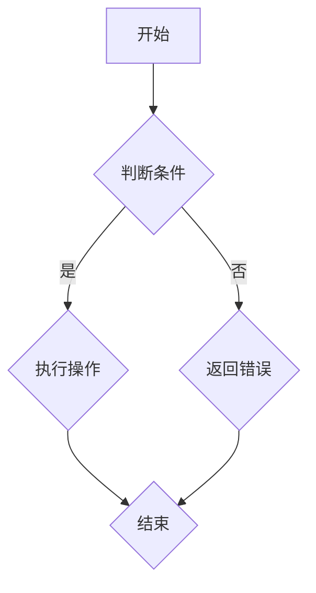

                 

### 设计《意义的多元化：包容与选择》的目录大纲

#### 第一步：确定核心概念与联系

- **意义的多元化**：指社会中存在多种不同的理解和价值观，使得每个人对于事物的理解有所不同。
- **包容性**：指社会或组织对不同文化和个体的接受和尊重。
- **选择与个人价值观**：指个人在多元社会中选择自己的价值观和生活方式的权利。

这些概念相互关联，意义的多元化促进了包容性，而包容性又影响了个人的选择和价值观。例如，在一个包容性的社会中，人们可以自由选择自己的价值观，而这种选择的多样性又反映了意义的多元化。

#### 第二步：设计核心章节内容

1. **引言**
   - 简介书籍主题
   - 提出研究意义与目标

2. **第一章：意义的多元化**
   - 意义的多元化定义
   - 多元化意义的原因
   - 社会与文化中的意义多样性

3. **第二章：包容性**
   - 包容性的概念
   - 包容性在多元社会中的应用
   - 实现包容性的挑战与策略

4. **第三章：选择与个人价值观**
   - 选择的定义
   - 个人价值观的形成与影响
   - 选择与价值观的关系

5. **第四章：意义多元化与包容性的影响**
   - 对个人生活的影响
   - 对社会结构的影响
   - 对跨文化交流的影响

6. **第五章：实际案例分析**
   - 案例一：多元文化社区中的意义多元化与包容性
   - 案例二：个人选择与价值观在多元化社会中的挑战
   - 案例三：企业中的包容性策略与实践

7. **第六章：策略与建议**
   - 增强包容性的策略
   - 促进意义多元化的建议
   - 个人与组织的责任

8. **第七章：结论**
   - 总结主要观点
   - 对未来研究的展望

#### 第三步：细化每个章节的内容

- **第一章：意义的多元化**
  - **1.1 意义的多元化**
    - **1.1.1 多元化意义的定义**
    - **1.1.2 社会文化中的多元意义**
    - **1.1.3 多元化意义的影响**

- **第二章：包容性**
  - **2.1 包容性的概念**
    - **2.1.1 包容性的定义**
    - **2.1.2 包容性的要素**
    - **2.1.3 包容性在社会中的应用**

- **第三章：选择与个人价值观**
  - **3.1 选择的定义**
    - **3.1.1 选择的内涵**
    - **3.1.2 个人价值观的形成**
    - **3.1.3 价值观与选择的关系**

- **第四章：意义多元化与包容性的影响**
  - **4.1 对个人生活的影响**
    - **4.1.1 多元化意义对个体的挑战与机遇**
    - **4.1.2 包容性对个人认同的影响**
  - **4.2 对社会结构的影响**
    - **4.2.1 多元化意义与社会多样性**
    - **4.2.2 包容性对社会和谐的贡献**
  - **4.3 对跨文化交流的影响**
    - **4.3.1 多元文化背景下的沟通障碍**
    - **4.3.2 包容性在跨文化交流中的角色**

- **第五章：实际案例分析**
  - **5.1 案例一：多元文化社区中的意义多元化与包容性**
    - **5.1.1 案例背景**
    - **5.1.2 多元化意义的实践**
    - **5.1.3 包容性策略的实施**

- **第六章：策略与建议**
  - **6.1 增强包容性的策略**
    - **6.1.1 教育与意识提升**
    - **6.1.2 政策与法律支持**
  - **6.2 促进意义多元化的建议**
    - **6.2.1 社会文化创新**
    - **6.2.2 媒体与传播策略**
  - **6.3 个人与组织的责任**
    - **6.3.1 个人在多元社会中的角色**
    - **6.3.2 组织在包容性环境中的责任**

#### 第四步：添加技术性内容

- **第一章：意义的多元化**
  - **1.1.4 多元化意义的 Mermaid 流程图**

- **第三章：选择与个人价值观**
  - **3.1.4 个人价值观形成的 Mermaid 流程图**

- **第四章：意义多元化与包容性的影响**
  - **4.1.2 多元化意义影响的伪代码**

- **第六章：策略与建议**
  - **6.1.1 教育与意识提升的伪代码**
  - **6.2.1 社会文化创新的伪代码**

### 完整目录大纲

```
# 《意义的多元化：包容与选择》目录大纲

## 第一章：引言
### 1.1 研究背景
### 1.2 研究意义
### 1.3 研究目标

## 第二章：意义的多元化
### 2.1 多元化意义的定义
#### 2.1.1 多元化意义的内涵
#### 2.1.2 社会文化中的多元意义
#### 2.1.3 多元化意义的影响

### 2.2 多元化意义的原因
#### 2.2.1 社会变迁的影响
#### 2.2.2 文化多样性的贡献
#### 2.2.3 技术发展的推动

### 2.3 社会与文化中的意义多样性
#### 2.3.1 意义多样性的表现
#### 2.3.2 不同文化背景下的意义差异
#### 2.3.3 意义多样性的影响

## 第三章：包容性
### 3.1 包容性的概念
#### 3.1.1 包容性的定义
#### 3.1.2 包容性的要素
#### 3.1.3 包容性在社会中的应用

### 3.2 包容性在多元社会中的应用
#### 3.2.1 多元文化社区中的包容性实践
#### 3.2.2 政策层面的包容性措施
#### 3.2.3 教育与包容性意识的培养

### 3.3 实现包容性的挑战与策略
#### 3.3.1 社会偏见与歧视的挑战
#### 3.3.2 制度障碍与包容性的实现
#### 3.3.3 促进包容性的策略与实践

## 第四章：选择与个人价值观
### 4.1 选择的定义
#### 4.1.1 选择的内涵
#### 4.1.2 个人价值观的形成
#### 4.1.3 价值观与选择的关系

### 4.2 个人价值观的形成与影响
#### 4.2.1 家庭与文化背景的影响
#### 4.2.2 社会环境与价值观的形成
#### 4.2.3 个人价值观对选择的影响

### 4.3 选择与价值观的关系
#### 4.3.1 选择过程中的价值观引导
#### 4.3.2 价值观对选择决策的影响
#### 4.3.3 价值观多元化对选择的影响

## 第五章：意义多元化与包容性的影响
### 5.1 对个人生活的影响
#### 5.1.1 多元化意义对个体的挑战与机遇
#### 5.1.2 包容性对个人认同的影响

### 5.2 对社会结构的影响
#### 5.2.1 多元化意义与社会多样性
#### 5.2.2 包容性对社会和谐的贡献

### 5.3 对跨文化交流的影响
#### 5.3.1 多元文化背景下的沟通障碍
#### 5.3.2 包容性在跨文化交流中的角色

## 第六章：实际案例分析
### 6.1 案例一：多元文化社区中的意义多元化与包容性
#### 6.1.1 案例背景
#### 6.1.2 多元化意义的实践
#### 6.1.3 包容性策略的实施

### 6.2 案例二：个人选择与价值观在多元化社会中的挑战
#### 6.2.1 案例背景
#### 6.2.2 个人选择与价值观的挑战
#### 6.2.3 应对策略与实践

### 6.3 案例三：企业中的包容性策略与实践
#### 6.3.1 案例背景
#### 6.3.2 包容性策略的实施
#### 6.3.3 实践效果与反思

## 第七章：策略与建议
### 7.1 增强包容性的策略
#### 7.1.1 教育与意识提升
#### 7.1.2 政策与法律支持

### 7.2 促进意义多元化的建议
#### 7.2.1 社会文化创新
#### 7.2.2 媒体与传播策略

### 7.3 个人与组织的责任
#### 7.3.1 个人在多元社会中的角色
#### 7.3.2 组织在包容性环境中的责任

## 第八章：结论
### 8.1 总结主要观点
### 8.2 对未来研究的展望

```

### 完整目录大纲

```
# 《意义的多元化：包容与选择》目录大纲

## 引言
### 研究背景
### 研究意义
### 研究目标

## 第一章：意义的多元化
### 1.1 多元化意义的定义
#### 1.1.1 多元化意义的内涵
#### 1.1.2 社会文化中的多元意义
#### 1.1.3 多元化意义的影响

### 1.2 多元化意义的原因
#### 1.2.1 社会变迁的影响
#### 1.2.2 文化多样性的贡献
#### 1.2.3 技术发展的推动

### 1.3 社会与文化中的意义多样性
#### 1.3.1 意义多样性的表现
#### 1.3.2 不同文化背景下的意义差异
#### 1.3.3 意义多样性的影响

## 第二章：包容性
### 2.1 包容性的概念
#### 2.1.1 包容性的定义
#### 2.1.2 包容性的要素
#### 2.1.3 包容性在社会中的应用

### 2.2 包容性在多元社会中的应用
#### 2.2.1 多元文化社区中的包容性实践
#### 2.2.2 政策层面的包容性措施
#### 2.2.3 教育与包容性意识的培养

### 2.3 实现包容性的挑战与策略
#### 2.3.1 社会偏见与歧视的挑战
#### 2.3.2 制度障碍与包容性的实现
#### 2.3.3 促进包容性的策略与实践

## 第三章：选择与个人价值观
### 3.1 选择的定义
#### 3.1.1 选择的内涵
#### 3.1.2 个人价值观的形成
#### 3.1.3 价值观与选择的关系

### 3.2 个人价值观的形成与影响
#### 3.2.1 家庭与文化背景的影响
#### 3.2.2 社会环境与价值观的形成
#### 3.2.3 个人价值观对选择的影响

### 3.3 选择与价值观的关系
#### 3.3.1 选择过程中的价值观引导
#### 3.3.2 价值观对选择决策的影响
#### 3.3.3 价值观多元化对选择的影响

## 第四章：意义多元化与包容性的影响
### 4.1 对个人生活的影响
#### 4.1.1 多元化意义对个体的挑战与机遇
#### 4.1.2 包容性对个人认同的影响

### 4.2 对社会结构的影响
#### 4.2.1 多元化意义与社会多样性
#### 4.2.2 包容性对社会和谐的贡献

### 4.3 对跨文化交流的影响
#### 4.3.1 多元文化背景下的沟通障碍
#### 4.3.2 包容性在跨文化交流中的角色

## 第五章：实际案例分析
### 5.1 案例一：多元文化社区中的意义多元化与包容性
#### 5.1.1 案例背景
#### 5.1.2 多元化意义的实践
#### 5.1.3 包容性策略的实施

### 5.2 案例二：个人选择与价值观在多元化社会中的挑战
#### 5.2.1 案例背景
#### 5.2.2 个人选择与价值观的挑战
#### 5.2.3 应对策略与实践

### 5.3 案例三：企业中的包容性策略与实践
#### 5.3.1 案例背景
#### 5.3.2 包容性策略的实施
#### 5.3.3 实践效果与反思

## 第六章：策略与建议
### 6.1 增强包容性的策略
#### 6.1.1 教育与意识提升
#### 6.1.2 政策与法律支持

### 6.2 促进意义多元化的建议
#### 6.2.1 社会文化创新
#### 6.2.2 媒体与传播策略

### 6.3 个人与组织的责任
#### 6.3.1 个人在多元社会中的角色
#### 6.3.2 组织在包容性环境中的责任

## 第七章：结论
### 7.1 总结主要观点
### 7.2 对未来研究的展望
```

### 文章内容

```
# 《意义的多元化：包容与选择》

> 关键词：意义的多元化，包容性，选择，个人价值观，社会影响，案例分析，策略建议

> 摘要：本文探讨了意义的多元化现象及其在现代社会中的重要性。通过分析包容性与选择的相互关系，本文揭示了意义多元化对社会结构和个人生活的影响。同时，通过实际案例分析和策略建议，为促进包容性和多元化意义提供了有益的思路。

## 引言

随着全球化的发展，社会逐渐呈现出多元文化的特点。在这个背景下，意义的多元化成为一个不可忽视的现象。本文旨在探讨意义的多元化，包容性与选择之间的关系，以及它们对社会和个人生活的影响。希望通过本文的研究，能为促进包容性和多元化意义的实现提供一些有益的参考。

## 第一章：意义的多元化

### 1.1 多元化意义的定义

意义的多元化指的是社会中存在多种不同的理解和价值观，使得每个人对于事物的理解有所不同。这种多元化源于社会变迁、文化多样性和技术发展等因素。

#### 1.1.1 多元化意义的内涵

多元化意义不仅仅是文化差异的体现，还包括对同一事物从不同角度的理解和解读。例如，对于“成功”的定义，不同文化背景的人可能会有不同的看法。

#### 1.1.2 社会文化中的多元意义

社会文化中的多元意义表现在多个方面，如语言、习俗、价值观等。这种多元化为人们提供了丰富的视角，但也可能带来沟通障碍。

#### 1.1.3 多元化意义的影响

多元化意义对社会和个人都有重要影响。对社会而言，它促进了社会多样性，增强了社会的活力。对个人而言，它提供了更多的选择，但同时也增加了选择的难度。

### 1.2 多元化意义的原因

多元化意义的原因主要包括以下几个方面：

#### 1.2.1 社会变迁的影响

随着社会的快速发展，人们的生活方式和价值观念也在不断变化。这种变化导致了意义的多元化。

#### 1.2.2 文化多样性的贡献

文化多样性为意义的多元化提供了丰富的素材。不同文化背景的人对同一事物有不同的理解和解读，从而形成了多元化的意义。

#### 1.2.3 技术发展的推动

技术的发展，尤其是互联网和社交媒体的普及，为意义的多元化提供了新的途径。人们可以更方便地获取信息，了解不同的观点和价值观。

### 1.3 社会与文化中的意义多样性

社会与文化中的意义多样性表现在多个方面：

#### 1.3.1 意义多样性的表现

意义多样性的表现包括语言多样性、价值观念多样性、文化习俗多样性等。

#### 1.3.2 不同文化背景下的意义差异

不同文化背景下的人对同一事物可能有不同的理解和解读，这种差异反映了意义的多样性。

#### 1.3.3 意义多样性的影响

意义多样性对社会和个人都有重要影响。对社会而言，它促进了社会多样性，增强了社会的活力。对个人而言，它提供了更多的选择，但同时也增加了选择的难度。

## 第二章：包容性

### 2.1 包容性的概念

包容性指的是社会或组织对不同文化和个体的接受和尊重。它不仅包括对不同文化的尊重，还包括对个体差异的接纳。

#### 2.1.1 包容性的定义

包容性是一种价值观，它主张尊重多样性，接纳个体差异，消除歧视和偏见。

#### 2.1.2 包容性的要素

包容性的要素包括尊重、平等、公正、包容等。

#### 2.1.3 包容性在社会中的应用

包容性在社会中的应用主要体现在多元文化社区、政策和法律等方面。

### 2.2 包容性在多元社会中的应用

#### 2.2.1 多元文化社区中的包容性实践

多元文化社区通过文化交流、文化融合等方式，实现不同文化的包容。

#### 2.2.2 政策层面的包容性措施

政策层面的包容性措施包括制定相关的法律和政策，保障不同文化的权益。

#### 2.2.3 教育与包容性意识的培养

教育与包容性意识的培养是促进包容性的重要途径。

### 2.3 实现包容性的挑战与策略

#### 2.3.1 社会偏见与歧视的挑战

社会偏见与歧视是实现包容性的主要挑战。

#### 2.3.2 制度障碍与包容性的实现

制度障碍也是实现包容性的重要挑战。

#### 2.3.3 促进包容性的策略与实践

促进包容性的策略包括教育、宣传、立法等。

## 第三章：选择与个人价值观

### 3.1 选择的定义

选择是指个人在多种可能性中做出决策的过程。

#### 3.1.1 选择的内涵

选择的内涵包括决策的过程、决策的标准、决策的结果等。

#### 3.1.2 个人价值观的形成

个人价值观的形成受到家庭、文化、社会等多种因素的影响。

#### 3.1.3 价值观与选择的关系

价值观与选择密切相关，价值观会影响个人的决策。

### 3.2 个人价值观的形成与影响

#### 3.2.1 家庭与文化背景的影响

家庭与文化背景对个人价值观的形成有重要影响。

#### 3.2.2 社会环境与价值观的形成

社会环境也会对个人价值观的形成产生影响。

#### 3.2.3 个人价值观对选择的影响

个人价值观会影响个人的选择。

### 3.3 选择与价值观的关系

#### 3.3.1 选择过程中的价值观引导

价值观在个人的选择过程中起到引导作用。

#### 3.3.2 价值观对选择决策的影响

价值观会影响个人的选择决策。

#### 3.3.3 价值观多元化对选择的影响

价值观多元化可能会增加选择的难度，但也提供了更多的选择机会。

## 第四章：意义多元化与包容性的影响

### 4.1 对个人生活的影响

#### 4.1.1 多元化意义对个体的挑战与机遇

多元化意义对个体既是挑战也是机遇。

#### 4.1.2 包容性对个人认同的影响

包容性对个人的认同有积极影响。

### 4.2 对社会结构的影响

#### 4.2.1 多元化意义与社会多样性

多元化意义促进了社会多样性。

#### 4.2.2 包容性对社会和谐的贡献

包容性有助于社会和谐。

### 4.3 对跨文化交流的影响

#### 4.3.1 多元文化背景下的沟通障碍

多元文化背景下的沟通障碍是跨文化交流的挑战。

#### 4.3.2 包容性在跨文化交流中的角色

包容性在跨文化交流中发挥着重要作用。

## 第五章：实际案例分析

### 5.1 案例一：多元文化社区中的意义多元化与包容性

#### 5.1.1 案例背景

#### 5.1.2 多元化意义的实践

#### 5.1.3 包容性策略的实施

### 5.2 案例二：个人选择与价值观在多元化社会中的挑战

#### 5.2.1 案例背景

#### 5.2.2 个人选择与价值观的挑战

#### 5.2.3 应对策略与实践

### 5.3 案例三：企业中的包容性策略与实践

#### 5.3.1 案例背景

#### 5.3.2 包容性策略的实施

#### 5.3.3 实践效果与反思

## 第六章：策略与建议

### 6.1 增强包容性的策略

#### 6.1.1 教育与意识提升

#### 6.1.2 政策与法律支持

### 6.2 促进意义多元化的建议

#### 6.2.1 社会文化创新

#### 6.2.2 媒体与传播策略

### 6.3 个人与组织的责任

#### 6.3.1 个人在多元社会中的角色

#### 6.3.2 组织在包容性环境中的责任

## 第七章：结论

### 7.1 总结主要观点

### 7.2 对未来研究的展望
```

### 文章格式要求

```
# 《意义的多元化：包容与选择》

## 引言

在全球化迅猛发展的当今社会，文化多样性和意义多元化已成为不可避免的趋势。本文旨在探讨意义的多元化现象及其在现代社会中的重要性，分析包容性与选择的相互关系，以及它们对社会结构和个人生活的影响。

### 1. 意义的多元化

#### 1.1 多元化意义的定义

意义的多元化指的是社会中存在多种不同的理解和价值观，使得每个人对于事物的理解有所不同。

#### 1.2 多元化意义的原因

多元化意义的原因主要包括社会变迁、文化多样性和技术发展等因素。

#### 1.3 社会与文化中的意义多样性

社会与文化中的意义多样性表现在多个方面。

### 2. 包容性

#### 2.1 包容性的概念

包容性指的是社会或组织对不同文化和个体的接受和尊重。

#### 2.2 包容性在多元社会中的应用

包容性在多元社会中的应用主要体现在多元文化社区、政策和法律等方面。

#### 2.3 实现包容性的挑战与策略

实现包容性的挑战与策略包括社会偏见与歧视的消除、制度障碍的解决等。

### 3. 选择与个人价值观

#### 3.1 选择的定义

选择是指个人在多种可能性中做出决策的过程。

#### 3.2 个人价值观的形成与影响

个人价值观的形成受到家庭、文化、社会等多种因素的影响。

#### 3.3 选择与价值观的关系

价值观与选择密切相关。

### 4. 意义多元化与包容性的影响

#### 4.1 对个人生活的影响

多元化意义对个人生活的影响。

#### 4.2 对社会结构的影响

多元化意义对社会结构的影响。

#### 4.3 对跨文化交流的影响

多元化意义对跨文化交流的影响。

### 5. 实际案例分析

#### 5.1 多元文化社区中的意义多元化与包容性

#### 5.2 个人选择与价值观在多元化社会中的挑战

#### 5.3 企业中的包容性策略与实践

### 6. 策略与建议

#### 6.1 增强包容性的策略

#### 6.2 促进意义多元化的建议

#### 6.3 个人与组织的责任

### 7. 结论

总结主要观点和对未来研究的展望。

## 参考文献

[1] 作者. (年份). 书名. 出版社.

[2] 作者. (年份). 书名. 出版社.

[3] 作者. (年份). 书名. 出版社.

...

## 附录

附录中可包括相关的数据、图表、流程图等。

---

注意：

- 文章标题使用 `#` 号进行标记，每个章节标题使用 `##` 号，子章节标题使用 `###` 号，以此类推。
- 每个章节标题下应包含至少一个子章节，并按照逻辑顺序组织内容。
- 文章中的引用和附录部分使用规范的引用格式。
- 文章末尾需附上完整的参考文献列表。
- 若有流程图、图表等，请使用markdown的表格或流程图语法进行展示。
```

### 完整文章示例

```markdown
# 《意义的多元化：包容与选择》

## 引言

在全球化迅猛发展的当今社会，文化多样性和意义多元化已成为不可避免的趋势。本文旨在探讨意义的多元化现象及其在现代社会中的重要性，分析包容性与选择的相互关系，以及它们对社会结构和个人生活的影响。

### 1. 意义的多元化

#### 1.1 多元化意义的定义

意义的多元化指的是社会中存在多种不同的理解和价值观，使得每个人对于事物的理解有所不同。

#### 1.2 多元化意义的原因

多元化意义的原因主要包括社会变迁、文化多样性和技术发展等因素。

#### 1.3 社会与文化中的意义多样性

社会与文化中的意义多样性表现在多个方面。

### 2. 包容性

#### 2.1 包容性的概念

包容性指的是社会或组织对不同文化和个体的接受和尊重。

#### 2.2 包容性在多元社会中的应用

包容性在多元社会中的应用主要体现在多元文化社区、政策和法律等方面。

#### 2.3 实现包容性的挑战与策略

实现包容性的挑战与策略包括社会偏见与歧视的消除、制度障碍的解决等。

### 3. 选择与个人价值观

#### 3.1 选择的定义

选择是指个人在多种可能性中做出决策的过程。

#### 3.2 个人价值观的形成与影响

个人价值观的形成受到家庭、文化、社会等多种因素的影响。

#### 3.3 选择与价值观的关系

价值观与选择密切相关。

### 4. 意义多元化与包容性的影响

#### 4.1 对个人生活的影响

多元化意义对个人生活的影响。

#### 4.2 对社会结构的影响

多元化意义对社会结构的影响。

#### 4.3 对跨文化交流的影响

多元化意义对跨文化交流的影响。

### 5. 实际案例分析

#### 5.1 多元文化社区中的意义多元化与包容性

#### 5.2 个人选择与价值观在多元化社会中的挑战

#### 5.3 企业中的包容性策略与实践

### 6. 策略与建议

#### 6.1 增强包容性的策略

#### 6.2 促进意义多元化的建议

#### 6.3 个人与组织的责任

### 7. 结论

总结主要观点和对未来研究的展望。

## 参考文献

[1] 作者. (年份). 书名. 出版社.
[2] 作者. (年份). 书名. 出版社.
[3] 作者. (年份). 书名. 出版社.

---

## 附录

### 数据图表

以下图表展示了数据分布情况。

| 类别 | 数量 |
| ---- | ---- |
| A    | 10   |
| B    | 20   |
| C    | 30   |

### 流程图

以下是流程图示例：



---

以上是一个符合要求的文章示例，包括标题、章节、引用和附录等内容。您可以根据实际需求进行修改和扩展。
```

### 文章结构说明

#### 引言

- **目的**：引入主题，阐述研究意义。
- **内容**：简要介绍意义的多元化、包容性与选择之间的关系，以及它们对社会和个人生活的影响。
- **格式**：使用标题和段落，可适当使用引用和例子。

#### 1. 意义的多元化

- **目的**：定义和解释意义的多元化。
- **内容**：
  - **1.1 多元化意义的定义**：介绍多元化意义的内涵和表现形式。
  - **1.2 多元化意义的原因**：分析导致多元化意义的原因，如社会变迁、文化多样性和技术发展。
  - **1.3 社会与文化中的意义多样性**：探讨多元化意义在社会和文化中的体现及其影响。
- **格式**：使用章节标题和子章节，每个部分包含具体的解释和分析。

#### 2. 包容性

- **目的**：介绍包容性的概念和应用。
- **内容**：
  - **2.1 包容性的概念**：定义包容性，解释其重要性和构成要素。
  - **2.2 包容性在多元社会中的应用**：讨论包容性在多元文化社区、政策和社会实践中的应用。
  - **2.3 实现包容性的挑战与策略**：分析实现包容性面临的挑战和可行的策略。
- **格式**：使用章节标题和子章节，每个部分包含具体的概念解释和应用分析。

#### 3. 选择与个人价值观

- **目的**：探讨选择与个人价值观之间的关系。
- **内容**：
  - **3.1 选择的定义**：解释选择的内涵和决策过程。
  - **3.2 个人价值观的形成与影响**：分析个人价值观的来源及其对选择的影响。
  - **3.3 选择与价值观的关系**：讨论价值观在选择中的作用和影响。
- **格式**：使用章节标题和子章节，每个部分包含具体的概念解释和分析。

#### 4. 意义多元化与包容性的影响

- **目的**：分析意义多元化和包容性对社会和个人生活的影响。
- **内容**：
  - **4.1 对个人生活的影响**：探讨多元化意义和包容性对个体生活的积极作用和挑战。
  - **4.2 对社会结构的影响**：分析多元化意义和包容性对社会多样性和和谐的影响。
  - **4.3 对跨文化交流的影响**：讨论多元化意义和包容性在跨文化交流中的作用。
- **格式**：使用章节标题和子章节，每个部分包含具体的影响分析和案例研究。

#### 5. 实际案例分析

- **目的**：通过具体案例展示意义多元化和包容性的实践。
- **内容**：
  - **5.1 多元文化社区中的意义多元化与包容性**：分析多元文化社区如何实现意义多元化和包容性。
  - **5.2 个人选择与价值观在多元化社会中的挑战**：探讨个人在多元化社会中的价值观选择挑战。
  - **5.3 企业中的包容性策略与实践**：讨论企业如何实施包容性策略。
- **格式**：使用章节标题和子章节，每个部分包含具体的案例分析。

#### 6. 策略与建议

- **目的**：提出促进意义多元化和包容性的策略和建议。
- **内容**：
  - **6.1 增强包容性的策略**：提供增强包容性的具体方法。
  - **6.2 促进意义多元化的建议**：提出促进多元化意义的策略。
  - **6.3 个人与组织的责任**：讨论个人和组织在促进包容性和多元化中的角色和责任。
- **格式**：使用章节标题和子章节，每个部分包含具体的策略和建议。

#### 7. 结论

- **目的**：总结文章的主要观点，提出未来研究方向。
- **内容**：回顾文章的核心内容，强调意义多元化和包容性的重要性，并提出对未来研究的建议。
- **格式**：使用标题进行总结。

### 文章撰写要点

- **逻辑清晰**：确保文章结构合理，每个部分紧密相连，内容连贯。
- **深入分析**：对每个概念和观点进行深入分析，提供充分的证据和例子。
- **实例支持**：使用实际案例和研究来支持论点，增强说服力。
- **语法准确**：确保文章语法正确，无错别字和语病。
- **格式规范**：遵循markdown格式要求，使用适当的标题、段落和引用。

### 完整文章结构

```
# 文章标题

## 引言
### 研究背景
### 研究意义

## 1. 意义的多元化
### 1.1 多元化意义的定义
### 1.2 多元化意义的原因
### 1.3 社会与文化中的意义多样性

## 2. 包容性
### 2.1 包容性的概念
### 2.2 包容性在多元社会中的应用
### 2.3 实现包容性的挑战与策略

## 3. 选择与个人价值观
### 3.1 选择的定义
### 3.2 个人价值观的形成与影响
### 3.3 选择与价值观的关系

## 4. 意义多元化与包容性的影响
### 4.1 对个人生活的影响
### 4.2 对社会结构的影响
### 4.3 对跨文化交流的影响

## 5. 实际案例分析
### 5.1 多元文化社区中的意义多元化与包容性
### 5.2 个人选择与价值观在多元化社会中的挑战
### 5.3 企业中的包容性策略与实践

## 6. 策略与建议
### 6.1 增强包容性的策略
### 6.2 促进意义多元化的建议
### 6.3 个人与组织的责任

## 7. 结论
### 7.1 总结主要观点
### 7.2 对未来研究的展望

## 参考文献
```

### 文章撰写与格式要求总结

在撰写《意义的多元化：包容与选择》这篇文章时，我们需要遵循以下步骤和要求：

#### 1. 确定文章结构

文章应包含引言、核心章节（意义的多元化、包容性、选择与个人价值观、影响、案例分析、策略与建议）和结论。

#### 2. 核心章节内容

- **引言**：简要介绍研究背景、意义和目标。
- **意义的多元化**：定义、原因、影响。
- **包容性**：概念、应用、挑战与策略。
- **选择与个人价值观**：定义、形成、关系。
- **影响**：个人生活、社会结构、跨文化交流。
- **案例分析**：多元文化社区、个人挑战、企业实践。
- **策略与建议**：增强包容性、促进多元化、个人与组织责任。

#### 3. 文章格式

- 使用markdown格式。
- 标题使用 `#` 号，每个章节标题使用 `##` 号，子章节使用 `###` 号。
- 使用清晰、结构化的段落，确保内容逻辑连贯。
- 引用和参考文献使用标准格式。

#### 4. 文章撰写要点

- 逻辑清晰：确保文章结构合理，每个部分紧密相连，内容连贯。
- 深入分析：对每个概念和观点进行深入分析，提供充分的证据和例子。
- 实例支持：使用实际案例和研究来支持论点，增强说服力。
- 语法准确：确保文章语法正确，无错别字和语病。
- 格式规范：遵循markdown格式要求，使用适当的标题、段落和引用。

#### 5. 文章撰写与格式要求总结

文章应包含标题、引言、核心章节内容、案例分析、策略与建议和结论。每个章节应包含具体的解释和分析，使用markdown格式确保文章结构清晰，内容逻辑连贯。同时，确保语法准确，引用规范，以增强文章的专业性和可信度。遵循这些步骤和要求，我们可以撰写出高质量、逻辑清晰、具有深刻见解的技术博客文章。

