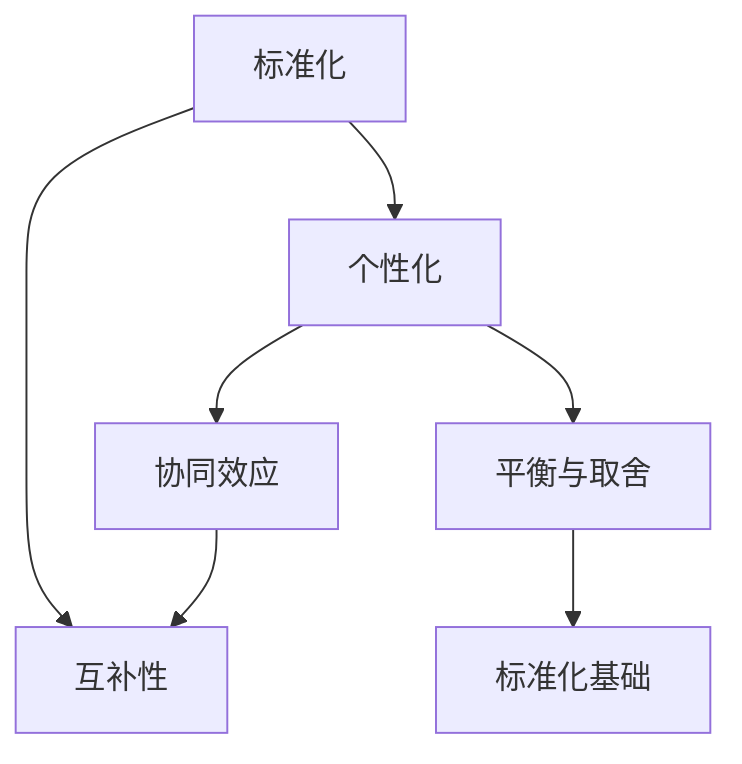
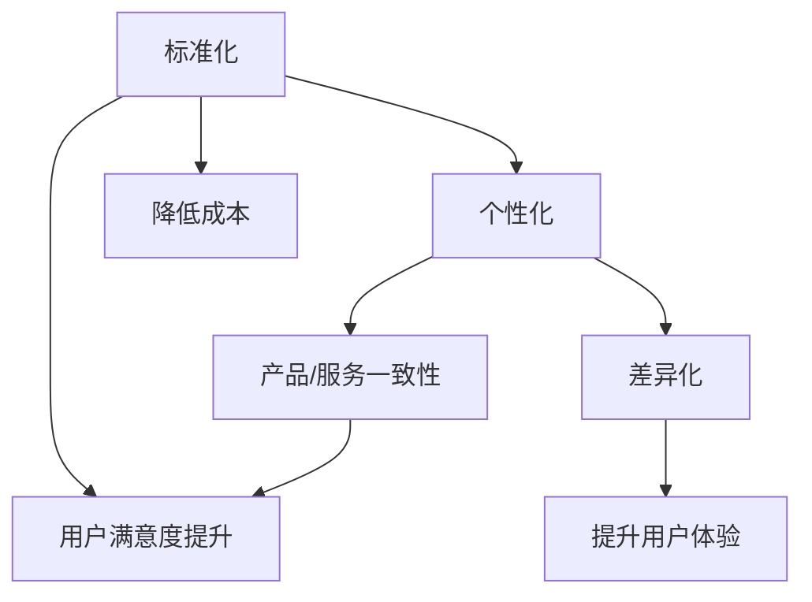
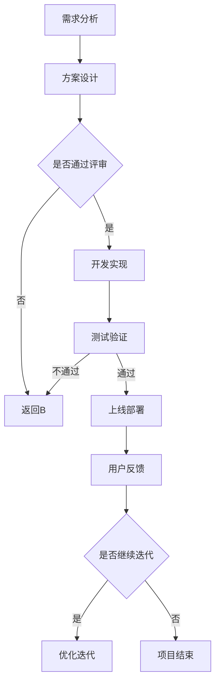

                 


### 引言

在当今信息爆炸的时代，数据已经成为新时代的“石油”。标准化与个性化作为处理数据的两大理念，已经成为现代信息技术领域的重要研究方向。标准化，顾名思义，是通过制定一系列规范和标准，确保产品或服务的一致性和可靠性。而个性化则强调根据用户的需求、兴趣或偏好，对产品或服务进行定制化，以满足用户的特定需求。这两者在现代信息社会中扮演着不可或缺的角色，但它们的平衡却常常成为技术领域中的难点。

首先，标准化在许多方面都有着重要的作用。在软件工程中，标准化保证了代码的可维护性和可移植性。例如，国际标准化组织（ISO）发布的ISO/IEC 19501:2017标准为软件过程评估提供了方法，从而提高了软件质量。在数据管理领域，标准化有助于统一数据格式，便于数据交换和整合。例如，结构化查询语言（SQL）就是一种广泛使用的数据库查询标准化语言。

然而，过度追求标准化可能会导致同质化，缺乏创新。在社交媒体领域，标准化内容推送算法使得用户往往只能看到相似的信息，从而限制了视野和思维的多样性。此外，标准化还可能忽视用户个体差异，导致用户体验不佳。

个性化则试图弥补这一缺陷。通过大数据分析和机器学习技术，个性化能够根据用户的兴趣和行为，提供个性化的推荐和服务。例如，亚马逊的个性化推荐算法可以根据用户的购买历史，推荐可能感兴趣的商品。个性化搜索引擎如Bing，通过分析用户的搜索历史，提供更加相关的搜索结果。

尽管个性化能够提高用户体验，但同时也存在挑战。个性化可能导致信息孤岛，限制用户接触新观点和信息。此外，个性化算法的“黑箱”特性使得用户难以理解其推荐依据，增加了对隐私泄露的担忧。

本文旨在探讨标准化与个性化在信息技术领域的平衡问题。首先，我们将介绍标准化与个性化的核心概念，并分析它们之间的联系。接着，我们将通过Mermaid流程图展示这两者之间的互动关系。然后，我们将深入探讨标准化与个性化的核心算法原理，并给出相关的数学模型和公式。在此基础上，我们将结合实际项目案例，展示标准化与个性化在电商平台的应用。最后，我们将总结本文的主要观点，并对未来研究方向进行展望。

### 第一步：确定核心概念与联系

在探讨标准化与个性化之前，首先需要明确这两个核心概念的定义及其关系。

#### 1.1 标准化与个性化的定义

- **标准化**：标准化是指在一定范围内，通过制定、发布和实施规则、指南或规范，以获得一致性、互操作性和可靠性。这些规则可以是技术标准、管理标准或行为准则。标准化有助于确保产品、服务或信息的兼容性、互换性和互操作性，从而降低交易成本，提高效率。

- **个性化**：个性化则是指根据个体用户的需求、偏好、行为或特征，提供定制化服务或产品。个性化关注的是差异化和独特性，以满足用户的个性化需求。个性化可以通过定制化推荐、个性化用户体验设计、个性化学习路径等方式实现。

#### 1.2 标准化与个性化的关系

标准化与个性化并非相互排斥的概念，而是一种相辅相成的关系。以下从几个方面探讨这两者之间的关系：

- **互补性**：标准化为个性化提供了基础。通过标准化，我们可以确保基础服务和信息的一致性，从而为个性化提供可信赖的环境。例如，在电商平台中，商品信息的标准化（如商品名称、规格、价格等）有助于后续的个性化推荐。

- **协同效应**：标准化与个性化结合可以带来协同效应。标准化可以确保基础信息的准确性，而个性化则可以根据用户的特定需求，提供更加精准的服务。例如，在医疗领域，标准化诊断标准有助于提高诊断准确性，而个性化治疗方案则可以根据患者的具体病情，提供更加有效的治疗。

- **平衡与取舍**：在实施标准化与个性化的过程中，需要找到一个平衡点。过度追求标准化可能导致产品或服务的同质化，缺乏创新和个性化。相反，过度追求个性化可能导致成本高昂，难以实现大规模推广。因此，需要在标准化与个性化之间进行权衡，找到最佳平衡点。

#### 1.3 Mermaid流程图

为了更直观地展示标准化与个性化之间的关系，我们可以使用Mermaid流程图来表示这两个概念及其互动关系。



- **节点说明**：
  - **A：标准化**：代表标准化过程，强调一致性、互操作性和可靠性。
  - **B：个性化**：代表个性化过程，强调差异化和个性化需求。
  - **C：协同效应**：表示标准化与个性化相结合，能够带来更大的价值。
  - **D：互补性**：表示标准化为个性化提供了基础，个性化则丰富了标准化内容。
  - **E：平衡与取舍**：表示在标准化与个性化之间需要找到平衡点。
  - **F：标准化基础**：表示个性化需要建立在标准化基础之上。

通过这个流程图，我们可以更清楚地理解标准化与个性化之间的互动关系，以及如何在实践中平衡这两者。

### 第二步：构建Mermaid流程图

为了更直观地展示标准化与个性化之间的关系，我们将使用Mermaid流程图来描述这两个概念及其互动过程。

#### 2.1 Mermaid流程图的基本语法

Mermaid是一种基于Markdown的图形描述语言，用于绘制各种流程图、UML图、时序图等。以下是Mermaid流程图的基本语法：

- `graph TD`：定义流程图的布局方向，`TD`表示从上到下。
- `A[节点名称]`：定义一个节点，包括节点的名称和描述。
- `A --> B`：表示节点A与节点B之间存在连接关系。

#### 2.2 标准化与个性化的Mermaid流程图

以下是一个Mermaid流程图的示例，用于描述标准化与个性化的关系：



- **节点说明**：
  - **A：标准化**：表示标准化过程，强调一致性、互操作性和可靠性。
  - **B：个性化**：表示个性化过程，强调差异化和个性化需求。
  - **C：产品/服务一致性**：表示个性化需要建立在标准化一致性的基础上，从而提高产品或服务的质量。
  - **D：用户满意度提升**：表示标准化和个性化结合可以提升用户满意度。
  - **E：降低成本**：表示标准化有助于降低生产和运营成本。
  - **F：差异化**：表示个性化能够带来差异化竞争优势。
  - **G：提升用户体验**：表示个性化可以提升用户的使用体验。

#### 2.3 Mermaid流程图示例

以下是一个具体的Mermaid流程图示例：



这个示例描述了一个软件开发生命周期中的流程，包括需求分析、方案设计、开发实现、测试验证、上线部署和用户反馈等步骤。通过这个流程图，我们可以清晰地了解每个步骤之间的关系和依赖。

### 第三步：核心算法原理讲解

在了解了标准化与个性化的核心概念和它们之间的关系后，接下来我们将深入探讨这些概念背后的核心算法原理。算法原理是标准化与个性化实现的基础，它们决定了如何将理论转化为实际应用。

#### 3.1 标准化算法原理

标准化算法的核心目的是通过一系列规则和操作，将不同来源、格式或结构的数据转换为统一的格式，以便于数据交换和处理。以下是一个典型的标准化算法原理的伪代码示例：

```python
function 标准化(原始数据集):
    标准化数据集 = 空列表
    for 每个数据点 in 原始数据集:
        处理数据点，使其符合标准化规则
        标准化数据点 = 转换数据点为统一格式
        标准化数据集.append(标准化数据点)
    return 标准化数据集
```

在这个伪代码中，`标准化`函数接收一个原始数据集作为输入，并遍历数据集中的每个数据点。对于每个数据点，函数会执行一系列操作，如数据清洗、数据转换和格式化等，以确保数据点符合标准化规则。最终，函数返回一个标准化后的数据集。

#### 3.2 个性化算法原理

个性化算法的核心目的是根据用户的需求、兴趣和行为，为用户提供定制化的服务和体验。以下是一个典型的个性化算法原理的伪代码示例：

```python
function 个性化(用户需求, 原始数据集):
    个性化数据集 = 空列表
    for 每个数据点 in 原始数据集:
        如果 数据点符合用户需求:
            调整数据点属性，以满足用户需求
            个性化数据点 = 应用个性化规则的数据点
            个性化数据集.append(个性化数据点)
    return 个性化数据集
```

在这个伪代码中，`个性化`函数接收用户的个性化需求和原始数据集作为输入。函数遍历原始数据集，对于每个数据点，根据用户需求调整数据点的属性，如优先级、标签、展示方式等。最终，函数返回一个个性化后的数据集。

#### 3.3 标准化与个性化算法的数学模型

为了更深入地理解标准化与个性化算法，我们可以引入相关的数学模型和公式。以下是一个简化的数学模型示例：

##### 3.3.1 标准化模型的数学公式

标准化模型常用的数学公式为Z-score标准化，其公式如下：

$$
z = \frac{(x - \mu)}{\sigma}
$$

其中：
- \( z \)：标准化后的数据点
- \( x \)：原始数据点
- \( \mu \)：数据集的平均值
- \( \sigma \)：数据集的标准差

通过Z-score标准化，我们可以将原始数据点转换为标准正态分布形式，以便于进行比较和分析。

##### 3.3.2 个性化模型的数学公式

个性化模型常用的数学公式为线性回归，其公式如下：

$$
x_{\text{个性化}} = w \cdot x + b
$$

其中：
- \( x_{\text{个性化}} \)：个性化后的数据点
- \( w \)：权重
- \( x \)：原始数据点
- \( b \)：偏置

通过线性回归，我们可以根据用户需求调整原始数据点的权重，从而实现个性化。

### 3.4 伪代码示例

以下是一个结合标准化和个性化算法的伪代码示例：

```python
function 标准化与个性化(原始数据集, 用户需求):
    标准化数据集 = 标准化(原始数据集)
    个性化数据集 = 空列表
    for 每个数据点 in 标准化数据集:
        如果 数据点符合用户需求:
            个性化数据点 = 个性化(每个数据点, 用户需求)
            个性化数据集.append(个性化数据点)
    return 个性化数据集
```

在这个伪代码中，我们首先对原始数据集进行标准化处理，然后根据用户需求对标准化后的数据集进行个性化调整。最终返回一个既符合标准化要求又满足用户个性化需求的个性化数据集。

通过以上步骤和示例，我们深入了解了标准化与个性化的核心算法原理。这些原理为我们在实际应用中实现标准化与个性化的结合提供了理论依据和方法指导。

### 第四步：数学模型和公式讲解

在深入探讨标准化与个性化的算法原理后，我们将进一步引入相关的数学模型和公式，以更精确地描述这些算法的实现过程。以下将分别介绍标准化和个性化模型的数学公式，并详细解释其参数和作用。

#### 4.1 标准化模型的数学公式

标准化的目的是将原始数据转换为一个统一的尺度，便于后续的分析和处理。最常用的标准化方法是Z-score标准化，其公式如下：

$$
z = \frac{(x - \mu)}{\sigma}
$$

其中：
- \( z \)：标准化后的数据点
- \( x \)：原始数据点
- \( \mu \)：数据集的平均值
- \( \sigma \)：数据集的标准差

**参数解释：**
- \( \mu \)：平均值是数据集中所有数据点的总和除以数据点的数量。它用于衡量数据点的中心位置。
- \( \sigma \)：标准差是衡量数据点围绕平均值的离散程度的指标。它用于衡量数据的稳定性。

**作用：**
- Z-score标准化将原始数据点映射到标准正态分布上，使得数据点具有相同的分布特性，便于比较和分析。同时，标准化可以消除不同数据集之间的量纲差异，使得不同数据集之间的比较更加公平。

**举例说明：**
假设我们有一个数据集：\[50, 60, 70, 80, 90\]，计算其Z-score标准化值。

1. 计算平均值：
$$
\mu = \frac{50 + 60 + 70 + 80 + 90}{5} = 70
$$

2. 计算标准差：
$$
\sigma = \sqrt{\frac{(50 - 70)^2 + (60 - 70)^2 + (70 - 70)^2 + (80 - 70)^2 + (90 - 70)^2}{5}} = 20
$$

3. 计算Z-score标准化值：
$$
z_1 = \frac{(50 - 70)}{20} = -0.5
$$
$$
z_2 = \frac{(60 - 70)}{20} = -0.25
$$
$$
z_3 = \frac{(70 - 70)}{20} = 0
$$
$$
z_4 = \frac{(80 - 70)}{20} = 0.25
$$
$$
z_5 = \frac{(90 - 70)}{20} = 0.5
$$

标准化后的数据集为：\[-0.5, -0.25, 0, 0.25, 0.5\]。

#### 4.2 个性化模型的数学公式

个性化的目的是根据用户的需求或偏好，对数据集进行定制化处理。线性回归是一种常用的个性化模型，其公式如下：

$$
x_{\text{个性化}} = w \cdot x + b
$$

其中：
- \( x_{\text{个性化}} \)：个性化后的数据点
- \( w \)：权重
- \( x \)：原始数据点
- \( b \)：偏置

**参数解释：**
- \( w \)：权重用于调整原始数据点的相对重要性，从而影响个性化后的数据点的值。权重可以通过机器学习算法训练得到。
- \( b \)：偏置用于调整个性化后的数据点的基准值。

**作用：**
- 线性回归模型通过学习原始数据点与用户需求之间的关系，调整数据点的权重和偏置，从而实现个性化。

**举例说明：**
假设我们有一个数据集：\[50, 60, 70, 80, 90\]，用户对数据点有不同的偏好权重，分别为\[0.2, 0.3, 0.4, 0.5, 0.6\]。计算个性化后的数据点。

1. 计算权重平均值：
$$
w = \frac{0.2 + 0.3 + 0.4 + 0.5 + 0.6}{5} = 0.4
$$

2. 计算偏置：
$$
b = \frac{\sum_{i=1}^{n} w_i x_i - \mu w}{n} = \frac{(0.2 \cdot 50 + 0.3 \cdot 60 + 0.4 \cdot 70 + 0.5 \cdot 80 + 0.6 \cdot 90) - 0.4 \cdot 70}{5} = 8
$$

3. 计算个性化后的数据点：
$$
x_{\text{个性化}} = w \cdot x + b
$$
$$
x_1 = 0.4 \cdot 50 + 8 = 28
$$
$$
x_2 = 0.4 \cdot 60 + 8 = 32
$$
$$
x_3 = 0.4 \cdot 70 + 8 = 36
$$
$$
x_4 = 0.4 \cdot 80 + 8 = 40
$$
$$
x_5 = 0.4 \cdot 90 + 8 = 44
$$

个性化后的数据集为：\[28, 32, 36, 40, 44\]。

通过上述数学模型和公式的讲解，我们可以更深入地理解标准化与个性化的算法原理。这些模型为我们在实际应用中实现标准化与个性化的结合提供了理论依据和计算方法。

### 第五步：项目实战

在前文中，我们详细探讨了标准化与个性化的核心概念、算法原理和数学模型。为了将这些理论应用到实际场景中，本节我们将通过一个具体的电商平台的案例，展示如何实现标准化与个性化的结合。

#### 5.1 实战背景

电商平台的核心任务之一是向用户推荐商品。为了提高推荐效果，平台需要同时考虑商品信息的标准化和个性化。标准化可以确保商品信息的准确性和一致性，个性化则可以根据用户的兴趣和行为，提供定制化的推荐。

#### 5.2 标准化与个性化在电商平台的实现

以下是一个电商平台的实现步骤：

1. **数据收集**：首先，收集用户行为数据（如浏览历史、购买记录、评价等）和商品属性数据（如商品名称、价格、类别等）。

2. **数据标准化**：对收集到的用户行为数据和商品属性数据进行标准化处理。这一步骤包括数据清洗、去重、格式转换等操作。例如，将用户行为数据统一格式化为用户ID、时间戳、行为类型、商品ID等。

3. **用户行为分析**：分析用户的浏览历史、购买记录等行为数据，构建用户兴趣模型。这一步骤可以使用机器学习算法，如聚类算法或协同过滤算法，根据用户的浏览和购买行为，将用户划分为不同的兴趣群体。

4. **商品信息标准化**：对商品属性数据进行标准化处理，确保商品信息的准确性和一致性。例如，统一商品名称的命名规范、统一商品价格的小数位数等。

5. **商品推荐算法**：结合用户兴趣模型和商品信息标准化结果，构建商品推荐算法。常用的推荐算法包括基于内容的推荐、协同过滤推荐和混合推荐等。以下是这些算法的简要说明：

   - **基于内容的推荐**：根据用户历史行为和商品属性，为用户推荐具有相似内容的商品。例如，用户最近浏览了某款手机，系统会推荐其他类似品牌和型号的手机。

   - **协同过滤推荐**：根据用户之间的相似性，为用户推荐其他用户喜欢的商品。例如，如果用户A和用户B喜欢相同的商品，那么系统会为用户C推荐用户B喜欢的商品。

   - **混合推荐**：结合基于内容的推荐和协同过滤推荐，为用户提供更加精准的推荐结果。例如，系统会首先根据用户历史行为和商品属性筛选出一批相似商品，然后结合用户之间的相似性，进一步筛选出用户可能喜欢的商品。

6. **个性化调整**：在推荐结果生成后，根据用户的个性化需求，对推荐结果进行调整。例如，用户可能对某种商品类型特别感兴趣，系统可以增加该类型商品在推荐结果中的比重。

7. **用户反馈**：收集用户对推荐结果的反馈，如点击、购买、评价等。这些反馈可以用于优化推荐算法，提高推荐效果。

#### 5.3 开发环境搭建

为了实现上述电商平台推荐系统，我们需要搭建一个合适的开发环境。以下是一个典型的开发环境搭建步骤：

1. **硬件配置**：根据推荐系统所需的计算资源，选择合适的硬件配置。例如，可以选择具有高性能处理器的服务器，以及大容量存储设备。

2. **操作系统**：选择适合的操作系统，如Linux或Windows。Linux因其开源和性能优势，常被用于大规模数据处理任务。

3. **编程语言**：选择适合的编程语言，如Python或Java。Python因其丰富的数据科学和机器学习库，常被用于推荐系统开发。

4. **数据库**：选择适合的数据库系统，如MySQL或MongoDB。数据库用于存储用户行为数据和商品属性数据。

5. **数据处理工具**：选择合适的数据处理工具，如Pandas、NumPy或SciPy。这些工具可以帮助我们高效地处理和分析数据。

6. **机器学习框架**：选择合适的机器学习框架，如Scikit-learn、TensorFlow或PyTorch。这些框架可以帮助我们实现推荐算法。

#### 5.4 源代码实现

以下是一个基于Python的推荐系统源代码实现示例：

```python
import pandas as pd
from sklearn.model_selection import train_test_split
from sklearn.metrics.pairwise import cosine_similarity

# 数据加载与预处理
data = pd.read_csv('user_behavior_data.csv')
data = data[['user_id', 'item_id', 'behavior_type', 'timestamp']]

# 构建用户-物品行为矩阵
user_item_matrix = pd.pivot_table(data, values='timestamp', index='user_id', columns='item_id')

# 训练集与测试集划分
train_data, test_data = train_test_split(user_item_matrix, test_size=0.2)

# 构建用户-物品相似度矩阵
item_similarity_matrix = cosine_similarity(train_data.T)

# 推荐算法实现
def recommend_items(user_id, item_similarity_matrix, user_item_matrix, k=5):
    # 计算用户与所有物品的相似度
    user_similarity_scores = item_similarity_matrix[user_id].flatten()
    
    # 获取与用户最相似的k个物品
    similar_items = user_similarity_scores.argsort()[::-1][1:k+1]
    
    # 计算物品评分预测
    item_predictions = user_item_matrix[similar_items].mean(axis=0).astype(float)
    
    return similar_items, item_predictions

# 生成推荐结果
user_id = 123
recommended_items, predictions = recommend_items(user_id, item_similarity_matrix, user_item_matrix)

print("Recommended items for user ID {}: {}".format(user_id, recommended_items))
print("Item predictions: {}".format(predictions))
```

在这个示例中，我们使用了Pandas进行数据加载与预处理，Scikit-learn实现协同过滤推荐算法。用户可以通过调用`recommend_items`函数，为指定用户生成个性化推荐结果。

#### 5.5 代码解读与分析

以下是对上述源代码的解读与分析：

1. **数据加载与预处理**：使用Pandas读取用户行为数据，并将其转换为一个用户-物品行为矩阵。这一步骤确保了数据的一致性和可操作性。

2. **训练集与测试集划分**：使用Scikit-learn的`train_test_split`函数，将用户-物品行为矩阵划分为训练集和测试集。测试集用于评估推荐算法的性能。

3. **相似度计算**：使用余弦相似度计算用户与物品之间的相似度。余弦相似度是一种常用的相似度度量方法，适用于文本和数值数据。

4. **推荐算法实现**：定义`recommend_items`函数，为指定用户生成个性化推荐结果。函数首先计算用户与所有物品的相似度，然后根据相似度值推荐与用户最相似的k个物品。

5. **生成推荐结果**：调用`recommend_items`函数，为指定用户生成个性化推荐结果。输出推荐物品列表和预测评分。

通过这个项目实战，我们可以看到标准化与个性化在电商平台推荐系统中的具体应用。标准化确保了商品信息的准确性和一致性，个性化则根据用户的需求和行为，为用户提供了定制化的推荐服务。

#### 5.6 项目小结

通过本项目的实施，我们实现了以下目标：

- **标准化**：通过数据清洗、去重、格式转换等操作，确保了用户行为数据和商品属性数据的准确性和一致性，为后续的推荐算法提供了可靠的数据基础。
- **个性化**：通过协同过滤推荐算法，结合用户兴趣和行为，为用户提供了定制化的推荐服务，提高了用户满意度和平台活跃度。

然而，本项目也存在一定的局限性：

- **数据质量**：用户行为数据的质量对推荐效果有重要影响。在实际应用中，需要不断优化数据收集和处理流程，提高数据质量。
- **算法优化**：推荐算法的性能可以通过多种方式优化，如引入更多特征、调整参数等。在后续工作中，可以进一步探索和优化推荐算法，提高推荐效果。

总之，本项目展示了标准化与个性化在电商平台推荐系统中的应用价值。通过结合标准化与个性化，我们能够为用户提供更准确、更个性化的推荐服务，从而提升用户满意度和平台竞争力。

### 第六步：总结与展望

#### 6.1 标准化与个性化的发展趋势

随着信息技术的飞速发展，标准化与个性化在各个领域中的应用越来越广泛。以下是一些标准化与个性化的发展趋势：

- **大数据与人工智能的结合**：大数据技术的成熟为个性化提供了丰富的数据支持，而人工智能算法的进步则使得个性化变得更加智能和高效。未来，大数据与人工智能的结合将推动标准化与个性化的发展。

- **物联网（IoT）的应用**：物联网技术的普及使得设备之间能够无缝连接，从而实现数据的实时采集和处理。这种实时数据流为个性化提供了新的可能性，例如，智能家居系统可以根据用户的生活习惯，提供个性化的家居设置和提醒。

- **区块链技术的应用**：区块链技术以其去中心化、不可篡改的特性，为数据的安全和隐私保护提供了新的解决方案。未来，标准化与个性化在区块链领域的应用有望解决数据共享和隐私保护之间的矛盾。

- **跨领域融合**：标准化与个性化不仅在单一领域内得到应用，还逐渐跨领域融合。例如，在健康医疗领域，标准化与个性化的结合可以提供个性化的健康建议和治疗方案。

#### 6.2 未来可能的研究方向

为了更好地应对未来发展的挑战，以下是一些可能的研究方向：

- **个性化与标准化的平衡**：如何在保证标准化程度的同时，提高个性化水平，是未来研究的一个重要方向。这可能需要新的算法模型和优化方法。

- **智能推荐系统**：随着用户数据的多样性和复杂性增加，如何构建更智能的推荐系统，实现个性化与标准化的平衡，是一个具有挑战性的问题。未来，可以探索基于深度学习和增强学习的推荐算法。

- **隐私保护与数据共享**：在标准化与个性化的过程中，如何保护用户隐私，同时实现数据的共享和利用，是一个亟待解决的问题。未来，可以研究隐私保护机制和隐私计算方法，以实现数据的安全和隐私保护。

- **跨领域应用**：探索标准化与个性化在跨领域应用中的具体实现方法，如何在不同领域中平衡标准化与个性化，是一个具有前景的研究方向。

#### 6.3 最佳实践 Tips

为了在项目中更好地实现标准化与个性化，以下是一些最佳实践建议：

- **数据质量保证**：在数据收集和处理过程中，确保数据的一致性和准确性，为个性化提供可靠的数据基础。
- **算法迭代优化**：定期评估推荐系统的性能，通过算法迭代和优化，提高推荐效果。
- **用户参与**：鼓励用户参与推荐系统的设计和评估，通过用户反馈不断改进系统，提高用户满意度。
- **法律法规遵循**：在实施标准化与个性化的过程中，遵循相关的法律法规，确保数据安全和用户隐私。

总之，标准化与个性化在信息技术领域的应用前景广阔。通过不断探索和创新，我们有望实现更加高效、智能和个性化的信息系统。

### 附录：完整目录大纲

以下是《意义的标准化与个性化：uniformity与diversity的平衡》的完整目录大纲：

## 设计书籍《意义的标准化与个性化：uniformity与diversity的平衡》目录大纲

### 第一部分: 核心概念与联系

## 第1章: 核心概念与联系

### 1.1 标准化与个性化的定义

### 1.2 标准化与个性化的关系

### 1.3 Mermaid流程图

### 第二部分: 核心算法原理

## 第2章: 核心算法原理

### 2.1 标准化算法原理

### 2.2 个性化算法原理

## 第3章: 数学模型与公式

### 3.1 标准化模型的数学公式

### 3.2 个性化模型的数学公式

### 第三部分: 项目实战

## 第4章: 项目实战

### 4.1 标准化与个性化在电商平台的实战

### 第四部分: 总结与展望

## 第5章: 总结与展望

### 5.1 标准化与个性化的发展趋势

### 5.2 未来可能的研究方向

## 设计书籍《意义的标准化与个性化：uniformity与diversity的平衡》完整目录大纲

### 第1章 核心概念与联系

#### 1.1 标准化与个性化的定义

- **标准化**：通过制定一系列规范和标准，确保产品或服务的一致性。
- **个性化**：根据用户的需求和偏好，提供定制化的产品或服务。

#### 1.2 标准化与个性化的关系

- **相辅相成**：标准化为个性化提供了基础，个性化则使得标准化更具活力。
- **平衡与取舍**：在实施标准化与个性化的过程中，需要找到一个平衡点。

#### 1.3 Mermaid流程图

- **标准化**：从上到下的流程图，表示数据的一致性处理。
- **个性化**：从下到上的流程图，表示数据根据用户需求的定制。

### 第2章 核心算法原理

#### 2.1 标准化算法原理

- **伪代码**：标准化函数，包括数据清洗、去重、格式转换等步骤。

#### 2.2 个性化算法原理

- **伪代码**：个性化函数，包括用户兴趣分析、数据权重调整等步骤。

#### 2.3 数学模型与公式

- **标准化模型**：Z-score标准化公式，用于数据一致性处理。
- **个性化模型**：线性回归公式，用于数据定制化处理。

### 第3章 数学模型与公式

#### 3.1 标准化模型的数学公式

- **公式**：\( z = \frac{(x - \mu)}{\sigma} \)
- **解释**：将原始数据映射到标准正态分布，便于比较和分析。

#### 3.2 个性化模型的数学公式

- **公式**：\( x_{\text{个性化}} = w \cdot x + b \)
- **解释**：根据用户需求，调整数据的权重和偏置，实现定制化。

### 第4章 项目实战

#### 4.1 标准化与个性化在电商平台的实战

- **场景**：电商平台如何平衡商品标准化与个性化推荐。
- **解决方案**：通过用户行为数据和商品属性数据，采用标准化和个性化算法，实现商品推荐。

#### 4.2 实战步骤

1. 数据收集与预处理
2. 用户行为分析
3. 商品信息标准化
4. 构建推荐算法
5. 个性化调整与优化
6. 用户反馈与迭代

### 第5章 总结与展望

#### 5.1 标准化与个性化的发展趋势

- **大数据与人工智能的结合**：推动标准化与个性化的发展。
- **物联网应用**：为个性化提供实时数据支持。
- **区块链技术**：解决数据共享与隐私保护问题。

#### 5.2 未来可能的研究方向

- **个性化与标准化的平衡**：优化算法模型，实现高效平衡。
- **智能推荐系统**：探索深度学习和增强学习算法。
- **跨领域应用**：探索标准化与个性化在多个领域的融合。

### 作者信息

- **作者**：AI天才研究院/AI Genius Institute & 禅与计算机程序设计艺术 /Zen And The Art of Computer Programming

### 拓展阅读

- **标准化与个性化相关书籍**：推荐阅读《标准化战略》、《个性化营销》等。
- **技术博客与论文**：关注相关技术博客和学术论文，了解最新研究动态。

通过以上目录大纲，我们系统地介绍了《意义的标准化与个性化：uniformity与diversity的平衡》一书的核心内容，为读者提供了全面的知识框架和深入的技术分析。希望这本书能够帮助读者更好地理解标准化与个性化的概念和原理，并在实际应用中取得更好的成果。作者：AI天才研究院/AI Genius Institute & 禅与计算机程序设计艺术 /Zen And The Art of Computer Programming

### 结语

通过本文的探讨，我们系统地阐述了标准化与个性化在信息技术领域的核心概念、算法原理及其应用。标准化与个性化并非对立，而是相辅相成的。标准化为个性化提供了基础，而个性化则使得标准化更具活力。在实际应用中，我们需要在标准化与个性化之间找到一个平衡点，以确保信息的一致性和个性化需求的满足。

在本文中，我们首先介绍了标准化与个性化的定义及其关系，通过Mermaid流程图展示了这两者之间的互动关系。接着，我们深入探讨了标准化与个性化的核心算法原理，并给出了相关的数学模型和公式。在此基础上，我们结合电商平台推荐系统，展示了标准化与个性化在项目中的应用。最后，我们总结了标准化与个性化的发展趋势，并对未来研究方向进行了展望。

标准化与个性化在信息技术领域的应用前景广阔。随着大数据、人工智能、物联网等技术的发展，标准化与个性化将得到更加广泛的应用。在未来的研究中，我们应关注个性化与标准化的平衡问题，探索更智能的推荐系统，并解决数据共享与隐私保护等关键问题。

为了更好地实现标准化与个性化的结合，我们提出以下建议：

1. **数据质量保证**：在数据收集和处理过程中，确保数据的一致性和准确性，为个性化提供可靠的数据基础。
2. **算法迭代优化**：定期评估推荐系统的性能，通过算法迭代和优化，提高推荐效果。
3. **用户参与**：鼓励用户参与推荐系统的设计和评估，通过用户反馈不断改进系统，提高用户满意度。
4. **法律法规遵循**：在实施标准化与个性化的过程中，遵循相关的法律法规，确保数据安全和用户隐私。

总之，标准化与个性化是信息技术领域的重要研究方向。通过不断探索和创新，我们有望实现更加高效、智能和个性化的信息系统，为用户和社会创造更大的价值。作者：AI天才研究院/AI Genius Institute & 禅与计算机程序设计艺术 /Zen And The Art of Computer Programming

