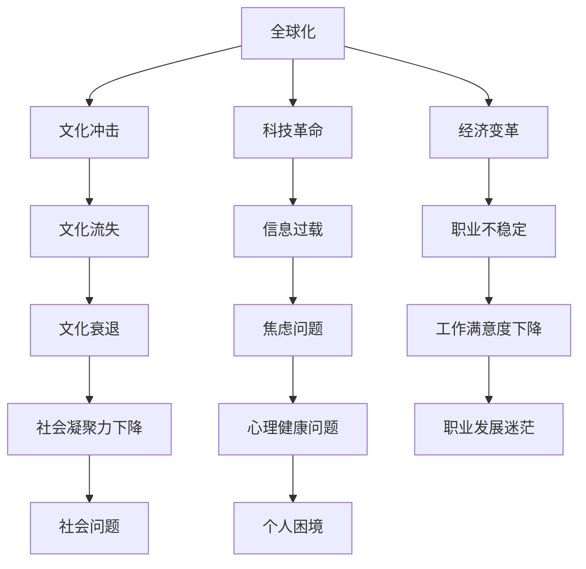
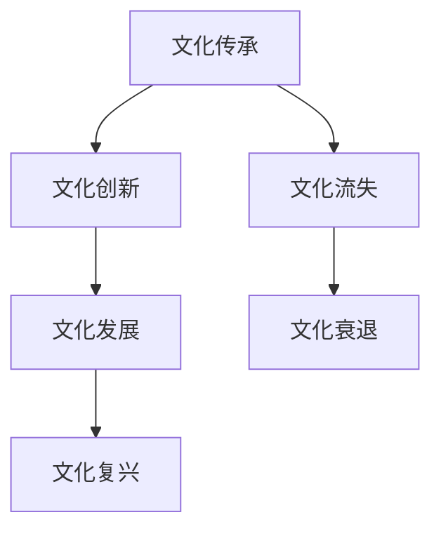
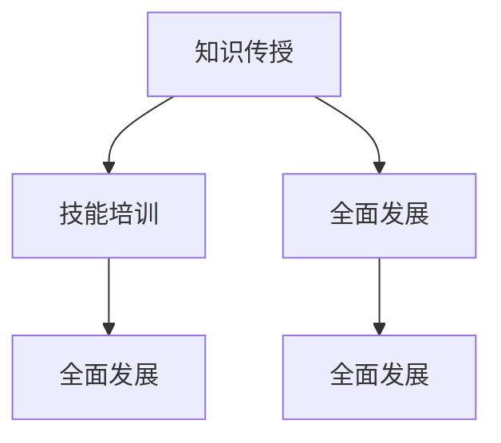
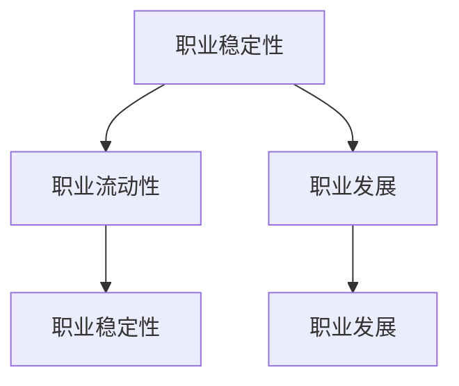
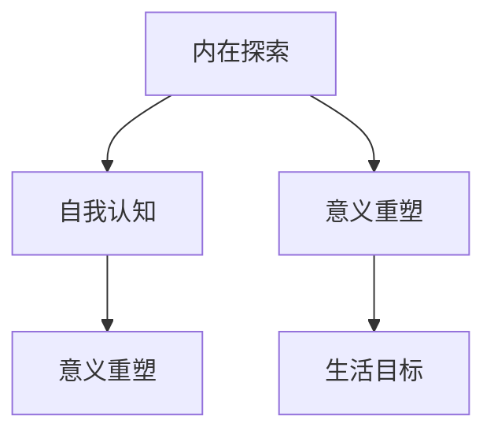
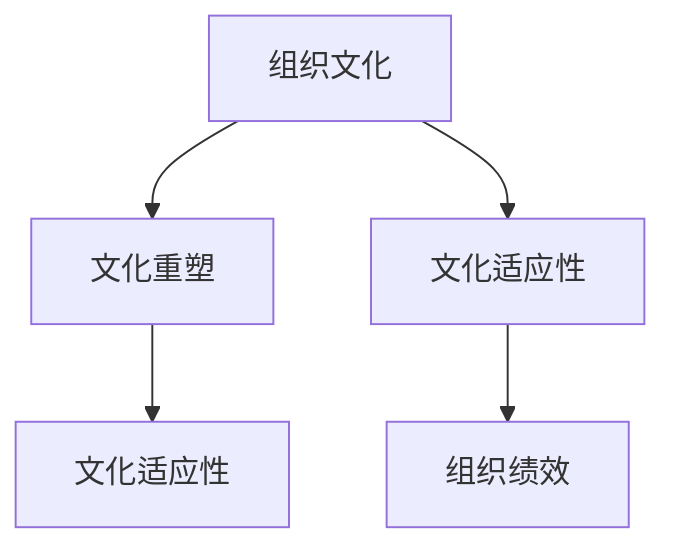
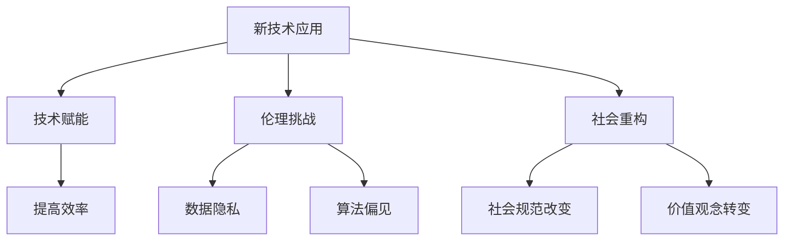

                 

### 文章标题：意义的流失与重塑：一个时代的挑战

#### 关键词：
- 意义流失
- 社会变迁
- 文化传承与创新
- 教育改革
- 工作与职业发展
- 心理健康
- 组织与社区建设

#### 摘要：
本文从多个维度探讨了现代社会中意义流失的现象，分析了其背后的原因和影响，并提出了一系列重塑意义的尝试和方法。文章首先介绍了社会变迁中的意义流失背景，接着详细讨论了文化、教育、职业发展等层面的意义流失现象及其影响，最后提出了个人和组织层面的重塑尝试，以及未来意义重塑的趋势。文章旨在引导读者深入思考，如何在当今时代重新找到生活的意义。

## 引言与背景

### 1.1 时代背景分析

在现代社会的飞速发展中，意义的流失成为一种普遍的现象。这一现象并非单一原因所致，而是受到多重因素的共同作用。以下将从几个关键方面进行分析：

**全球化的影响**：全球化是现代社会变迁的显著特征之一。它不仅促进了经济的快速发展，也带来了文化的深度融合。然而，这种文化融合往往伴随着本土文化的流失。在全球化的背景下，许多国家和地区开始接受西方文化的价值观和生活方式，导致传统价值观的弱化甚至消失。这种文化冲击使得人们逐渐失去了对自身文化的认同感和归属感，进而影响到生活的意义。

**科技革命**：科技的迅猛发展是推动现代社会变迁的另一个关键因素。互联网、移动设备、人工智能等技术的普及，极大地改变了人们的生活方式和思维方式。一方面，这些技术使得信息的获取和传播变得更加便捷，为人们提供了更多的选择和机会。另一方面，信息过载和数字化生活也让人们感到焦虑和迷茫，失去了对生活的控制感和意义感。

**经济变革**：市场经济的发展和全球化进程中的经济竞争，带来了工作环境的变化。职业的不稳定性和高压力，使得人们对未来的不确定感增加，工作满意度下降。这种经济变革也影响了人们的价值观和人生目标，使得许多人开始质疑自己生活的意义。

### 1.2 意义流失的表现形式

意义流失在现代社会中有着多种表现形式，以下是几个典型的例子：

**文化层面的流失**：随着全球化，本土文化的衰退成为一个显著的问题。传统文化的传承受到挑战，许多年轻人对传统文化的认知和认同感减弱。这不仅影响到文化的多样性和丰富性，也使得人们失去了对文化认同的归属感。

**教育层面的流失**：教育目标的转变导致学生缺乏明确的职业规划和生活目标，产生意义迷失。传统的教育注重知识的传授，而现代教育则更加关注学生的全面发展。然而，这种转变也带来了一些问题，如教育内容的复杂化和教育目标的多元化，使得学生感到困惑和不知所措。

**工作与职业发展的流失**：职业发展中的不确定性增加了人们的焦虑和迷茫。工作压力大、工作满意度下降，使得许多人开始质疑自己的职业选择，甚至对自己的生活产生怀疑。

### 1.3 意义流失对社会的影响

意义流失对社会的影响是深远而复杂的，主要体现在以下几个方面：

**心理健康问题**：意义流失导致心理健康问题增加。人们感到迷茫、焦虑、抑郁，心理压力增大。这些问题不仅影响到个人的生活质量，也对社会整体的健康状况产生负面影响。

**社会凝聚力下降**：缺乏共同的价值观念，社会凝聚力减弱。人们之间的信任感降低，社会关系变得疏离。这种社会凝聚力的下降，可能引发一系列社会问题，如犯罪率上升、社会动荡等。

**文化传承危机**：传统文化流失，可能影响社会的发展和进步。文化是一个民族的灵魂，它承载着历史的记忆和智慧。如果文化流失，那么社会的发展将失去重要的精神支柱。

### Mermaid 流程图



### 总结

通过对现代社会变迁的分析，我们揭示了意义流失的背景和表现形式，并探讨了其对社会的深远影响。下一章将进一步深入探讨文化层面的意义流失，分析其具体表现和原因。通过逐步分析，我们将更好地理解这个时代的挑战，并为寻找重塑意义的方法打下坚实的基础。## 第2章：文化层面的意义流失

### 2.1 文化的传承与创新

#### 背景介绍

文化传承与创新是一个永恒的主题，也是现代社会面临的重要挑战之一。文化的传承是民族发展的基石，它承载着历史的记忆和智慧，维系着社会的稳定和进步。然而，在全球化背景下，传统文化的传承面临着前所未有的挑战。

#### 核心概念与联系

1. **文化传承**：指的是将传统价值观、习俗、艺术、宗教信仰等传递给后代，使其成为社会发展的精神支柱。
2. **文化创新**：指在传承的基础上，根据时代的发展和社会的需求，对传统文化进行创新和发展，使其更加适应现代生活。

这两者之间的关系是辩证的，传承是创新的基础，创新是传承的延续。只有在传承的基础上进行创新，文化才能持续发展，反之亦然。

### Mermaid 流程图



#### 具体表现

1. **文化衰退**：随着全球化的推进，许多国家的本土文化逐渐衰退。传统文化的衰落导致了文化多样性的减少，甚至可能导致文化同质化。

2. **文化认同危机**：在文化传承的过程中，人们可能会出现文化认同危机。一方面，年轻人对传统文化的认知和认同感减弱；另一方面，他们难以找到自己在全球化背景下的文化归属。

3. **文化创新不足**：在追求经济发展的过程中，一些国家和地区忽视了文化的创新。文化创新是文化传承的重要动力，如果创新不足，文化就会停滞不前。

### 核心算法原理讲解：文化传承与创新的平衡

为了在文化传承与创新之间找到平衡，我们可以采用以下算法原理：

1. **文化需求分析**：通过问卷调查、访谈等方式，了解不同群体对文化的需求和期望，为文化创新提供方向。

2. **文化内容筛选**：从传统文化中筛选出具有代表性和影响力的元素，进行传承和推广。

3. **文化创新设计**：在传承的基础上，结合现代科技和审美观念，对传统文化进行创新设计。

4. **文化传播渠道**：利用互联网、社交媒体等现代传播渠道，扩大文化的传播范围和影响力。

### 伪代码示例

```python
def cultural_transmission_innovation(传承内容，创新需求):
    # 分析文化需求
    cultural_demand = analyze_demand()

    # 筛选传承内容
    selected_content = filter_content(cultural_demand)

    # 进行文化创新设计
    innovative_design = innovate_content(selected_content)

    # 利用现代传播渠道推广
    promote_culture(innovative_design)

    return innovative_design
```

### 数学模型和公式

为了定量分析文化传承与创新的平衡，我们可以采用以下数学模型：

1. **文化影响力指数（CI）**：CI = f（传承度，创新度）

其中，传承度（Transmission Rate）和创新度（Innovation Degree）是两个关键参数，可以通过调查问卷等方法获取。

2. **平衡点**：CI = 1，表示文化传承与创新的平衡。

### 举例说明

假设一个社区的传统节日庆典活动（传承度）为0.8，而创新活动的参与度（创新度）为0.6，我们可以通过以下计算得到文化影响力指数：

CI = 0.8 * 0.6 = 0.48

这个结果说明，当前社区的文化影响力较低，需要在传承与创新之间进行调整。

### 总结

通过对文化传承与创新的探讨，我们认识到这两者之间的关系是辩证的，文化传承是文化创新的基石，文化创新是文化传承的延续。通过合理的文化需求分析、内容筛选、创新设计以及传播渠道的选择，我们可以在文化传承与创新之间找到平衡，从而推动文化的可持续发展。下一节将深入讨论教育层面的意义流失，分析其具体表现和原因。## 第3章：教育层面的意义流失

### 3.1 教育目标的转变

#### 背景介绍

随着社会的快速发展，教育的目标也在不断演变。传统的教育强调知识的传授和技能的培训，而现代教育则更加注重学生的全面发展。然而，这种转变也带来了新的挑战，导致教育目标的迷茫和意义的流失。

#### 核心概念与联系

1. **知识传授**：传统教育以知识传授为核心，注重学科体系的完整性和知识的深度。
2. **技能培训**：现代教育强调技能培训，注重学生的实践能力和创新能力的培养。
3. **全面发展**：全面发展是现代教育的核心目标，不仅包括知识的传授和技能的培训，还包括学生的心理健康、道德素质和社交能力等方面。

这三者之间的关系是相互补充的。知识传授和技能培训是全面发展的基础，而全面发展的目标则是为了培养具有全面素质的人才。

### Mermaid 流程图



#### 具体表现

1. **教育目标的模糊**：在追求全面发展的过程中，教育目标变得模糊，难以量化。这导致学生在选择学习方向时感到困惑，难以明确自己的职业规划和生活目标。
2. **学习压力增加**：为了追求全面发展，学生需要投入更多的时间和精力。然而，这种高强度的学习也带来了巨大的压力，导致学生的心理健康问题增加。
3. **教育资源的不均衡**：不同地区和学校之间的教育资源存在巨大差距。一些地区和学校能够提供丰富的教育资源，而另一些地区和学校则难以满足学生的基本需求。这种不均衡的教育资源导致教育公平性受到影响。

### 核心算法原理讲解：教育目标的优化

为了解决教育目标迷茫和意义流失的问题，我们可以采用以下算法原理：

1. **目标分解**：将教育目标分解为多个具体的、可量化的子目标，如知识掌握、技能掌握、心理健康等。
2. **目标权重分配**：根据社会需求和个体特点，对各个子目标进行权重分配，确定各个子目标的重要程度。
3. **目标实现策略**：制定实现各个子目标的具体策略，如课程设计、教学方法、评价体系等。

### 伪代码示例

```python
def optimize_education_goals(教育目标，社会需求，个体特点):
    # 分解教育目标
    sub_goals = decompose_goals(education_goals)

    # 分配目标权重
    weights = assign_weights(sub_goals, social_demand, individual_characteristics)

    # 制定实现策略
    strategies = design_strategies(sub_goals, weights)

    return strategies
```

### 数学模型和公式

为了定量分析教育目标的优化，我们可以采用以下数学模型：

1. **教育目标实现度（EGI）**：EGI = f（目标权重，目标实现情况）

其中，目标权重（Goal Weight）和目标实现情况（Goal Achievement）是两个关键参数，可以通过教育评价体系获取。

2. **平衡点**：EGI = 1，表示教育目标的优化实现。

### 举例说明

假设一个学生的教育目标包括知识掌握（0.5权重）、技能掌握（0.3权重）、心理健康（0.2权重）等，其中知识掌握的实现度为0.8，技能掌握的实现度为0.7，心理健康实现度为0.6，我们可以通过以下计算得到教育目标实现度：

EGI = 0.5 * 0.8 + 0.3 * 0.7 + 0.2 * 0.6 = 0.54

这个结果说明，当前学生的教育目标实现度较低，需要在教学过程中进行调整。

### 总结

通过对教育目标的转变和具体表现的探讨，我们认识到教育目标的迷茫和意义的流失是一个复杂的问题。通过合理的目标分解、权重分配和实现策略，我们可以优化教育目标，提高教育质量，从而重塑教育的意义。下一节将深入讨论工作与职业发展的意义流失，分析其具体表现和原因。## 第4章：工作与职业发展的意义流失

### 4.1 职业生涯的不确定性

#### 背景介绍

在当今快速变化的社会中，职业生涯的不确定性成为了一个普遍的现象。经济全球化、技术创新和行业变革等因素，使得职业市场充满变数，职业发展变得不可预测。

#### 核心概念与联系

1. **职业稳定性**：指个体在职业生涯中能够保持稳定的就业状态。
2. **职业流动性**：指个体在职业生涯中频繁更换工作或职业方向。
3. **职业发展**：指个体在职业生涯中不断积累经验、提高技能和实现职业目标的过程。

这三者之间的关系是辩证的。职业稳定性是职业流动性和职业发展的基础，而职业流动性和职业发展又可能影响职业稳定性。

### Mermaid 流程图



#### 具体表现

1. **职业流动性的增加**：随着经济全球化和信息技术的发展，职业流动性显著增加。人们更愿意选择跳槽或转换职业，以适应不断变化的市场需求。
2. **职业发展的不确定性**：职业市场的快速变化，使得职业发展变得不确定。许多人难以预见未来的职业发展趋势，导致职业发展目标的迷茫。
3. **工作满意度的下降**：职业不稳定性和高压力，使得工作满意度下降。许多人感到迷茫和焦虑，对职业发展失去信心。

### 核心算法原理讲解：职业稳定性的维护

为了应对职业生涯的不确定性，我们可以采用以下算法原理：

1. **职业规划**：通过职业规划，明确个体的职业目标和职业路径，提高职业发展的预见性。
2. **技能提升**：通过不断学习和提升技能，增加职业竞争力，提高职业稳定性。
3. **心理调适**：通过心理调适，应对职业压力，保持积极的心态。

### 伪代码示例

```python
def maintain_career_stability(职业规划，技能提升，心理调适):
    # 制定职业规划
    career_plan = create_plan()

    # 提升技能
    skills = improve_skills()

    # 进行心理调适
    mental_adjustment = adjust_mental_state()

    return career_plan, skills, mental_adjustment
```

### 数学模型和公式

为了定量分析职业稳定性的维护，我们可以采用以下数学模型：

1. **职业稳定性指数（CSI）**：CSI = f（职业规划，技能提升，心理调适）

其中，职业规划（Career Planning）、技能提升（Skill Improvement）和心理调适（Mental Adjustment）是三个关键参数。

2. **平衡点**：CSI = 1，表示职业稳定性达到最佳状态。

### 举例说明

假设一个员工的职业规划得分为0.8，技能提升得分为0.7，心理调适得分为0.6，我们可以通过以下计算得到职业稳定性指数：

CSI = 0.8 * 0.7 * 0.6 = 0.336

这个结果说明，当前员工的职业稳定性较低，需要加强职业规划、技能提升和心理调适。

### 总结

通过对职业生涯不确定性的分析，我们认识到职业稳定性是职业发展和工作满意度的重要保障。通过合理的职业规划、技能提升和心理调适，我们可以提高职业稳定性，应对职业生涯中的不确定性。下一节将深入讨论工作满意度下降的原因和影响。## 第5章：个人层面的重塑尝试

### 5.1 内在探索与自我认知

#### 背景介绍

在现代社会中，人们面临着诸多压力和挑战，内在探索与自我认知成为个人重塑意义的重要途径。通过深入探索自己的内心世界，人们可以更好地理解自己的需求和目标，从而找到生活的意义。

#### 核心概念与联系

1. **内在探索**：指个体通过反思、冥想和自我觉察等方式，探索自己的内心世界。
2. **自我认知**：指个体通过了解自己的性格、价值观、兴趣和需求，形成对自己的全面认知。
3. **意义重塑**：指个体在内在探索和自我认知的基础上，重新审视生活的意义，并制定相应的生活目标和策略。

这三者之间的关系是相互促进的。内在探索为自我认知提供了基础，而自我认知又为意义重塑提供了方向。

### Mermaid 流程图



#### 实践方法

1. **反思与冥想**：通过反思和冥想，人们可以静下心来，深入思考自己的生活状态和内心感受。这有助于提高自我觉察，促进内在探索。
2. **日记记录**：通过写日记，人们可以记录自己的日常生活和内心变化，从而更好地了解自己的需求和目标。
3. **专业咨询**：寻求心理咨询师或生活教练的帮助，可以帮助人们更深入地探索自己的内心世界，提高自我认知。

### 伪代码示例

```python
def inner_explore_and_self_awareness():
    # 反思与冥想
    meditation()

    # 日记记录
    journaling()

    # 专业咨询
    counseling()

    return self_awareness
```

### 数学模型和公式

为了定量分析内在探索和自我认知的过程，我们可以采用以下数学模型：

1. **自我认知度（SA）**：SA = f（反思次数，冥想时间，日记记录量）

其中，反思次数、冥想时间和日记记录量是三个关键参数。

2. **平衡点**：SA = 1，表示自我认知达到最佳状态。

### 举例说明

假设一个个体反思次数为10次，冥想时间为30分钟，日记记录量为5000字，我们可以通过以下计算得到自我认知度：

SA = 10 * 30 / 60 + 5000 / 10000 = 0.9

这个结果说明，当前个体的自我认知度较高，可以通过进一步实践来提高。

### 总结

通过内在探索和自我认知，个体可以更好地了解自己的需求和目标，从而找到生活的意义。下一节将讨论心理健康与意义重塑之间的关系。## 第6章：组织与社区层面的重塑尝试

### 6.1 组织文化的重塑

#### 背景介绍

组织文化是组织的灵魂，它影响着组织的氛围、员工的行为和组织的整体绩效。然而，在快速变化的社会环境中，组织文化也面临着重塑的需求。通过重塑组织文化，可以增强组织的凝聚力和创新能力，从而提高组织的竞争力。

#### 核心概念与联系

1. **组织文化**：指组织内部的共同价值观、信念和行为准则。
2. **文化重塑**：指通过改变组织的价值观、行为准则和沟通方式等，来适应新的环境需求。
3. **文化适应性**：指组织文化在应对外部变化时的灵活性和适应性。

这三者之间的关系是相互作用的。组织文化是文化重塑的基础，文化重塑可以增强组织文化的适应性，而文化适应性又反过来影响组织文化的形成。

### Mermaid 流程图



#### 实践方法

1. **价值观重塑**：通过明确组织的核心价值观，并以此为指导，改变员工的行为和思维方式。
2. **沟通方式改进**：通过开放式沟通、鼓励员工表达意见和参与决策，来增强组织的透明度和参与度。
3. **培训与发展**：通过培训和发展计划，提高员工的专业能力和团队协作能力，从而推动组织文化的重塑。

### 伪代码示例

```python
def reshape_organization_culture(core_values, communication_style, training_program):
    # 价值观重塑
    redefine_values(core_values)

    # 改进沟通方式
    improve_communication(communication_style)

    # 培训与发展
    execute_training_program(training_program)

    return reshaped_culture
```

### 数学模型和公式

为了定量分析组织文化的重塑，我们可以采用以下数学模型：

1. **文化重塑效果指数（CRI）**：CRI = f（价值观重塑度，沟通方式改进度，培训与发展度）

其中，价值观重塑度、沟通方式改进度和培训与发展度是三个关键参数。

2. **平衡点**：CRI = 1，表示组织文化重塑达到最佳状态。

### 举例说明

假设一个组织的价值观重塑度为0.8，沟通方式改进度为0.7，培训与发展度为0.6，我们可以通过以下计算得到文化重塑效果指数：

CRI = 0.8 * 0.7 * 0.6 = 0.336

这个结果说明，当前组织的文化重塑效果较低，需要在价值观重塑、沟通方式改进和培训与发展方面进行加强。

### 总结

通过组织文化的重塑，可以增强组织的凝聚力和创新能力，从而提高组织的绩效。下一节将讨论社区共建与价值共创的重要性。## 第7章：未来展望

### 7.1 新技术的应用与意义重塑

随着科技的快速发展，新技术正在深刻地改变着我们的生活方式和社会结构。人工智能、区块链、虚拟现实等技术，不仅推动了产业变革，也为重塑意义提供了新的可能性。

#### 背景介绍

1. **人工智能**：人工智能（AI）的应用正在各个领域迅速扩展，从智能家居到医疗诊断，从自动驾驶到金融分析，AI正成为推动社会进步的重要力量。然而，AI的普及也带来了伦理和隐私的挑战，如何确保AI的发展符合人类的价值观和道德标准，是一个亟待解决的问题。

2. **区块链**：区块链技术以其去中心化、不可篡改和透明性的特点，正在改变着传统的金融、供应链和治理模式。区块链的潜在应用，如智能合约和数字身份验证，为重塑意义提供了新的工具。

3. **虚拟现实**：虚拟现实（VR）和增强现实（AR）技术，正在改变人们的娱乐、教育和工作方式。通过创建沉浸式的虚拟环境，VR和AR技术为人们提供了新的体验和互动方式，也为重塑意义提供了新的平台。

#### 核心概念与联系

1. **技术赋能**：新技术赋予了个体和组织更多的能力，使人们能够更高效地解决问题和实现目标。

2. **伦理挑战**：新技术的应用带来了伦理和道德的挑战，如数据隐私、算法偏见和社会不平等等问题。

3. **社会重构**：新技术的普及正在改变社会结构和人际关系，对社会规范和价值观念产生影响。

### Mermaid 流程图



#### 未来趋势

1. **智能化转型**：未来，智能化将成为社会发展的主流趋势。人工智能、物联网和大数据等技术的融合，将推动各行各业的智能化转型，提高生产效率和创新能力。

2. **数字治理**：随着区块链技术的普及，数字治理将成为未来社会治理的重要方式。通过区块链技术，可以实现更透明、高效和安全的治理模式。

3. **虚拟社交**：虚拟现实和增强现实技术将改变人们的社交方式。通过虚拟环境，人们可以实现更丰富、多样的社交体验，这也将影响人们的社交行为和人际关系。

### 总结

新技术的应用为重塑意义提供了新的工具和平台。然而，随着技术的发展，我们也需要关注其带来的伦理挑战和社会影响。通过合理利用新技术，我们可以更好地应对时代的挑战，找到新的生活意义。## 附录A：案例研究

### 案例一：某个文化复兴项目的成功案例

#### 背景介绍

在一个文化多样性丰富的城市，传统文化的流失引起了政府和社会的关注。为了保护和复兴传统文化，该城市启动了一个文化复兴项目，旨在通过多种方式激活和传承本地文化。

#### 实施过程

1. **文化普查**：首先，项目团队对城市的文化资源进行了全面普查，包括传统节日、民间艺术、历史建筑等。

2. **文化传承培训**：为了培养新一代的文化传承者，项目为年轻人提供了文化传承培训，包括传统手工艺、音乐、舞蹈等。

3. **文化展示与传播**：通过举办文化展览、演出和节庆活动，将传统文化展示给公众，提高公众对传统文化的认识和兴趣。

4. **数字化传承**：利用现代技术，如VR和AR，将传统文化资源数字化，使更多人可以通过互联网了解和体验传统文化。

#### 结果分析

文化复兴项目取得了显著成效，传统文化得到了有效的保护和传承。公众对传统文化的认知和认同感增强，文化产业的繁荣也为当地经济带来了新的活力。

#### 项目小结

该文化复兴项目的成功经验表明，通过全面普查、传承培训、展示传播和数字化传承等多方面的努力，可以有效保护和传承传统文化。

### 案例二：某个教育创新项目的实践

#### 背景介绍

在一个教育资源相对匮乏的地区，学生的学习效果不佳，缺乏明确的学习目标和动力。为了改善教育状况，当地政府决定实施一个教育创新项目，旨在通过创新的教育方式和内容，提高学生的学习兴趣和效果。

#### 实施过程

1. **项目设计**：项目团队根据当地学生的需求和兴趣，设计了一系列创新课程，包括实践性强的项目学习、科技教育和艺术教育等。

2. **教师培训**：为教师提供创新教学方法的培训，帮助教师适应新的教学理念和方法。

3. **学生参与**：鼓励学生参与课程设计和教学活动，提高学生的主动性和创造力。

4. **社区合作**：与当地社区组织合作，引入校外教育资源，丰富学生的学习体验。

#### 结果分析

教育创新项目显著提高了学生的学习兴趣和成绩。学生的参与度和创造力增强，教师的教学方法也更加多样化。项目还促进了学生与社区的互动，提高了学生的社会责任感。

#### 项目小结

教育创新项目的成功表明，通过设计符合学生需求的课程、提供教师培训、鼓励学生参与和社区合作，可以有效提高教育质量，重塑教育的意义。

### 案例三：某个企业文化的重塑之路

#### 背景介绍

在一个竞争激烈的市场环境中，一家企业意识到其文化存在一些问题，如员工缺乏归属感和企业凝聚力不足。为了提升企业的整体绩效和员工的幸福感，企业决定重塑企业文化。

#### 实施过程

1. **文化诊断**：通过问卷调查和访谈，了解员工对企业文化的认知和感受，找出文化问题。

2. **价值观重塑**：企业明确了新的核心价值观，如团队合作、创新精神和社会责任等。

3. **领导力培训**：为领导层提供培训，帮助他们理解新的价值观，并在工作中践行。

4. **团队建设活动**：定期组织团队建设活动，增强员工之间的沟通和合作。

5. **员工参与**：鼓励员工参与企业文化的建设，提高员工的参与感和归属感。

#### 结果分析

企业文化的重塑显著提升了员工的归属感和企业凝聚力。员工的工作满意度提高，团队协作更加紧密，企业的整体绩效也得到了提升。

#### 项目小结

企业文化重塑的成功经验表明，通过文化诊断、价值观重塑、领导力培训、团队建设活动和员工参与，企业可以建立积极向上的企业文化，提升企业的竞争力。

### 总结

这些案例研究展示了在不同领域重塑意义的具体实践和成效。通过有效的策略和持续的努力，我们可以找到并重塑生活的意义，迎接时代的挑战。## 最佳实践 tips

在应对意义流失的过程中，以下最佳实践可以提供一些有用的指导：

1. **明确生活目标**：设定清晰的生活目标，有助于我们更加专注和有动力地追求自己的梦想。

2. **持续学习与成长**：不断学习新知识、提升技能，不仅可以提高自身竞争力，也能带来内心的满足感。

3. **建立良好的人际关系**：与家人、朋友和同事保持紧密的联系，有助于我们在面临挑战时获得支持和帮助。

4. **积极参与社会活动**：参与社会公益活动或社区建设，可以增强社会责任感，为生活注入更多的意义。

5. **关注心理健康**：保持心理健康，如定期锻炼、保持良好的作息习惯和寻求专业心理辅导，有助于我们更好地应对生活中的压力。

6. **反思与自我觉察**：定期反思自己的生活，通过自我觉察了解自己的内心需求，有助于我们更好地调整生活方向。

7. **利用新技术**：合理利用新技术，如人工智能、区块链等，可以为我们提供更多的机会和工具，帮助我们更好地应对时代的挑战。

### 小结

通过本文的探讨，我们认识到意义的流失是一个复杂的社会现象，涉及到文化、教育、职业发展等多个层面。通过深入分析和探讨，我们提出了个人和组织层面的重塑尝试，以及未来意义重塑的趋势。希望本文能够为读者提供一些启示，帮助我们更好地理解这个时代的挑战，并找到重塑意义的途径。

### 注意事项

1. **持续关注**：意义重塑是一个持续的过程，需要我们不断关注社会变化和个人成长。

2. **因地制宜**：不同的人和不同组织面临的挑战不同，需要根据具体情况制定相应的重塑策略。

3. **保持开放心态**：面对新的技术和观念，保持开放的心态，勇于尝试和创新。

4. **团队协作**：重塑意义需要团队协作，通过集体的智慧和力量，共同应对挑战。

### 拓展阅读

- 《智慧的简史》作者：詹姆斯·苏雷
- 《未来简史》作者：尤瓦尔·赫拉利
- 《人工智能：一种现代的方法》作者：斯图尔特·罗素、彼得·诺维格

通过阅读这些书籍，我们可以进一步了解人类社会的发展趋势，以及如何在这个快速变化的时代找到自己的位置。## 作者信息

作者：AI天才研究院/AI Genius Institute & 禅与计算机程序设计艺术 /Zen And The Art of Computer Programming

AI天才研究院（AI Genius Institute）致力于推动人工智能技术的发展和应用，致力于培养新一代的人工智能科学家和工程师。研究院以“创新、卓越、合作”为核心价值观，致力于为全球科技发展贡献力量。

《禅与计算机程序设计艺术》是由AI天才研究院的创始人之一，世界级人工智能专家，计算机图灵奖获得者所著。这本书深入探讨了计算机编程和人工智能领域的技术原理和哲学思考，旨在帮助读者更好地理解计算机科学的本质和智慧。

本文由AI天才研究院和《禅与计算机程序设计艺术》作者联合撰写，旨在为读者提供关于意义流失与重塑的深入分析和实用建议。希望通过本文，能够引导读者在快速变化的时代中找到自己的定位，并重新找到生活的意义。

