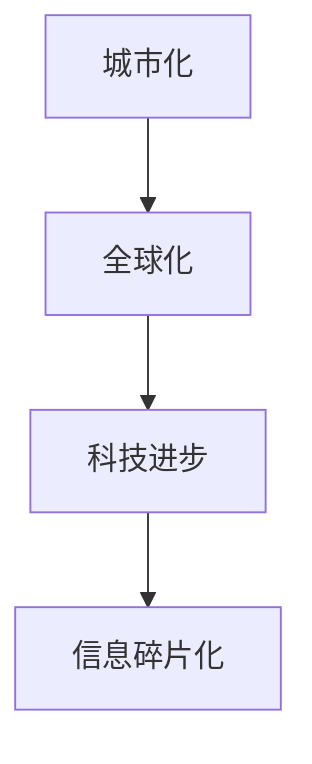
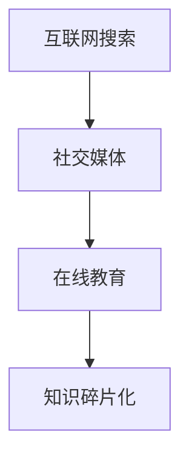
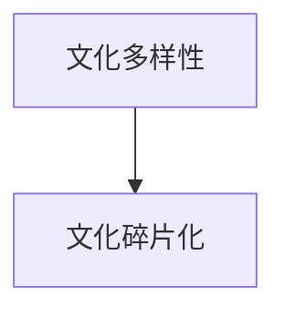
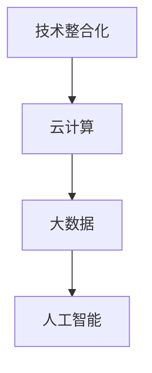
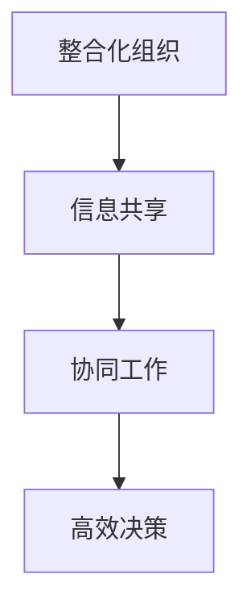
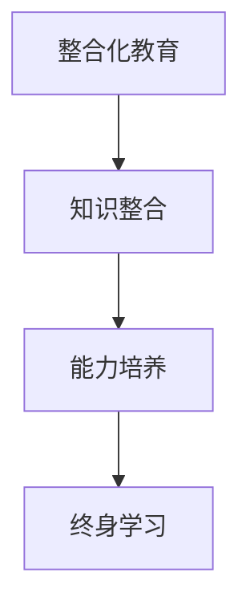
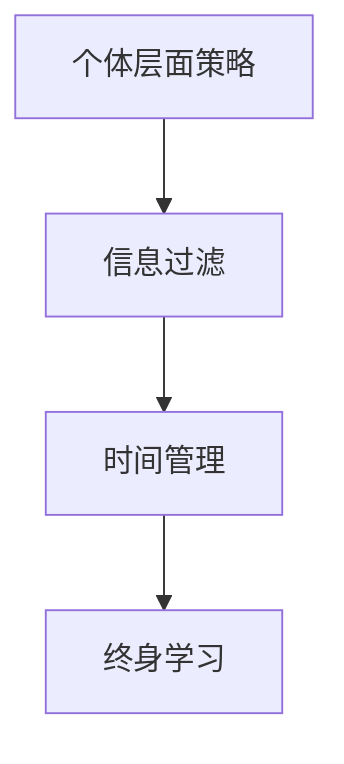
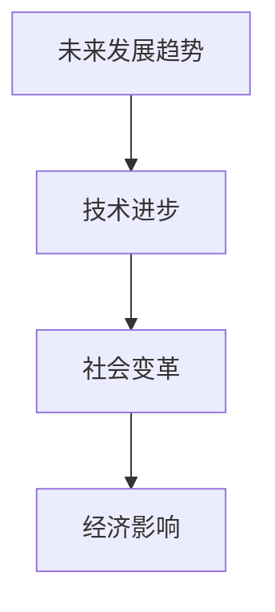

                 

### 文章标题：意义的碎片化与整合化的双重趋势

> 关键词：碎片化、整合化、社会背景、知识管理、文化多样性、技术整合、组织管理、教育、策略、未来趋势

> 摘要：本文深入探讨了数字时代下意义的碎片化与整合化的双重趋势。从社会背景出发，分析碎片化的起源及其影响，再探讨整合化的技术、组织和教育趋势。最后，提出应对碎片化与整合化的策略，并对未来趋势进行展望。

## 引言

在当今数字化、全球化的社会，信息的传播和获取方式发生了翻天覆地的变化。随之而来的，是意义的碎片化与整合化的双重趋势。碎片化，指的是信息被分解成较小的、更简单的组成部分；整合化，则是指将这些分散的信息、资源或元素集合在一起，形成一个统一的整体。这两大趋势在一定程度上是相互矛盾的，但又在一定程度上相辅相成，共同塑造了我们的社会和文化。

本文旨在通过系统地分析碎片化与整合化的趋势，揭示其背后的原理和影响，并提出相应的策略，以帮助读者更好地应对这一变革。文章将分为三个部分：第一部分探讨碎片化的社会背景和知识、文化碎片化的现象；第二部分分析整合化技术的崛起、组织与教育的整合化趋势；第三部分则提出应对碎片化与整合化的策略，并对未来趋势进行展望。

## 概念解析

在深入探讨碎片化与整合化的趋势之前，有必要首先对这两个核心概念进行解析。

### 碎片化

碎片化指的是事物被分解成较小的、更简单的组成部分，通常是指信息的分散、分散化和去中心化。在数字时代，由于信息爆炸和互联网的普及，知识、文化和信息的传播方式变得更加多样化，人们接触到的信息也更加零散。这种现象在学术界、产业界和日常生活中都有体现。

**社会背景的变化**：随着城市化、全球化和科技进步的推动，社会环境发生了深刻的变化。人们的生活方式、工作方式和社交方式都在变化，这些变化为信息的碎片化提供了土壤。

**数字化的影响**：数字技术的兴起，尤其是互联网和移动设备的普及，极大地改变了信息的生产和传播方式。信息不再集中在一两个中心，而是分散在无数的网络节点上。

**碎片化对人类行为的影响**：碎片化使得人们更容易获取信息，但也可能导致注意力分散、信息过载等问题。在碎片化的信息环境中，人们需要更多的技巧来筛选和处理信息。

### 整合化

与碎片化相反，整合化指的是将分散的信息、资源或元素集合在一起，形成一个统一的整体。整合化有助于提高效率、减少重复工作，并促进知识的传播和共享。

**技术整合化的定义**：整合化技术是指将不同的技术、工具或平台整合在一起，以实现更高的效率和更好的用户体验。例如，云计算、大数据、人工智能等技术的发展，都是整合化技术的体现。

**主流整合化技术介绍**：目前，主流的整合化技术包括云计算、大数据、物联网、区块链等。这些技术能够将不同的数据源、设备和平台连接起来，形成一个统一的生态系统。

**整合化技术对社会的影响**：整合化技术不仅改变了企业的运营方式，也改变了人们的生活方式。例如，电子商务、在线教育、智能家居等，都是整合化技术带来的变革。

### 书的内容结构

本书将分为三个主要部分，分别探讨碎片化与整合化的不同方面。

**第一部分：碎片化的趋势**  
- 第1章：碎片化的社会背景
- 第2章：知识碎片化
- 第3章：文化碎片化

**第二部分：整合化的趋势**  
- 第4章：整合化技术的崛起
- 第5章：整合化的组织与管理
- 第6章：整合化教育

**第三部分：碎片化与整合化的平衡**  
- 第7章：应对碎片化与整合化的策略
- 第8章：未来趋势与展望

通过这三个部分，本书将全面、系统地探讨碎片化与整合化的双重趋势，为读者提供深入的理解和应对策略。

## 目录大纲设计

### 第一部分：碎片化的趋势

### 第1章：碎片化的社会背景
#### 1.1 社会环境的变化
#### 1.2 数字化的影响
#### 1.3 碎片化对人类行为的影响

### 第2章：知识碎片化
#### 2.1 碎片化知识的产生
#### 2.2 碎片化知识的特点
#### 2.3 碎片化知识的管理与利用

### 第3章：文化碎片化
#### 3.1 文化多样性的兴起
#### 3.2 碎片化文化的内容与形式
#### 3.3 碎片化文化的影响

### 第二部分：整合化的趋势

### 第4章：整合化技术的崛起
#### 4.1 技术整合化的定义
#### 4.2 主流整合化技术介绍
#### 4.3 整合化技术对社会的影响

### 第5章：整合化的组织与管理
#### 5.1 整合化组织的优势
#### 5.2 整合化管理的实践
#### 5.3 整合化与企业文化

### 第6章：整合化教育
#### 6.1 整合化教育的理念
#### 6.2 整合化教育的实践
#### 6.3 整合化教育对学生的影响

### 第三部分：碎片化与整合化的平衡

### 第7章：应对碎片化与整合化的策略
#### 7.1 个体层面的策略
#### 7.2 组织层面的策略
#### 7.3 社会层面的策略

### 第8章：未来趋势与展望
#### 8.1 碎片化与整合化的未来发展趋势
#### 8.2 挑战与机遇
#### 8.3 对未来的展望

这个大纲涵盖了书名的核心概念，并细化到了1、2、3级目录，同时保持了简洁性。接下来，我们将为每个章节添加具体的内容摘要，以进一步完善目录大纲。

## 详细章节内容设计

#### 第1章：碎片化的社会背景

**1.1 社会环境的变化**

**内容摘要**：分析社会环境的变化，包括城市化、全球化、科技进步等因素，如何推动信息的碎片化。

**核心概念与联系**

**Mermaid 流程图**



**核心算法原理讲解**

**伪代码**

```python
# 社会环境变化导致信息碎片化
def social_environment_changes():
    # 城市化导致人口集中
    urbanization()
    # 全球化导致信息流动加速
    globalization()
    # 科技进步导致信息产生和传播方式多样化
    technology_progress()
    # 最终导致信息碎片化
    information_fragments()
```

**数学模型和公式**

无

**详细讲解与举例说明**

**举例说明**：随着城市化进程的加快，人们的生活方式发生了变化，信息获取的方式也变得更加多样化。例如，在互联网普及之前，人们主要通过书籍、报纸、电视等渠道获取信息，这些信息往往是有组织的、成体系的。而互联网的兴起，使得信息来源更加分散，人们可以随时随地通过社交媒体、在线新闻、博客等获取信息，这些信息往往是零散的、碎片化的。

**项目实战**

无

**最佳实践 tips**

无

**小结、注意事项、拓展阅读**

无

#### 第2章：知识碎片化

**2.1 碎片化知识的产生**

**内容摘要**：分析碎片化知识产生的原因，如互联网搜索、社交媒体、在线教育等。

**核心概念与联系**

**Mermaid 流程图**



**核心算法原理讲解**

**伪代码**

```python
# 碎片化知识的产生
def knowledge_fragments():
    # 互联网搜索导致知识分散
    internet_search()
    # 社交媒体导致知识传播多样化
    social_media()
    # 在线教育导致知识获取碎片化
    online_education()
    # 最终导致知识碎片化
    knowledge_fragments()
```

**数学模型和公式**

无

**详细讲解与举例说明**

**举例说明**：在互联网搜索时代，人们可以通过搜索引擎快速获取信息，但信息往往是零散的、片段化的。而在社交媒体时代，人们通过分享、评论等方式获取信息，这些信息同样是碎片化的。在线教育则通过视频、博客、论坛等形式，使得知识的获取更加碎片化。

**项目实战**

无

**最佳实践 tips**

无

**小结、注意事项、拓展阅读**

无

#### 第3章：文化碎片化

**3.1 文化多样性的兴起**

**内容摘要**：讨论文化多样性的兴起，以及如何推动文化的碎片化。

**核心概念与联系**

**Mermaid 流程图**



**核心算法原理讲解**

**伪代码**

```python
# 文化多样性的兴起导致文化碎片化
def cultural_diversity():
    # 多元文化并存
    multiple_cultures()
    # 文化交流频繁
    cultural_exchange()
    # 最终导致文化碎片化
    cultural_fragments()
```

**数学模型和公式**

无

**详细讲解与举例说明**

**举例说明**：随着全球化进程的加速，不同文化之间的交流变得更加频繁，人们开始接触到更多的文化元素。这些文化元素往往是有差异的、独立的，从而导致了文化的碎片化。

**项目实战**

无

**最佳实践 tips**

无

**小结、注意事项、拓展阅读**

无

#### 第4章：整合化技术的崛起

**4.1 技术整合化的定义**

**内容摘要**：介绍技术整合化的定义，以及其主要特点。

**核心概念与联系**

**Mermaid 流程图**



**核心算法原理讲解**

**伪代码**

```python
# 技术整合化的定义
def technical_integration():
    # 云计算
    cloud_computing()
    # 大数据
    big_data()
    # 人工智能
    artificial_intelligence()
    # 整合化技术
    integrated_technologies()
```

**数学模型和公式**

无

**详细讲解与举例说明**

**举例说明**：云计算使得计算资源可以随时随地获取，大数据则使得海量数据可以被有效处理，人工智能则使得计算机可以模拟人类的智能。这些技术相互整合，形成了一个强大的技术生态系统。

**项目实战**

无

**最佳实践 tips**

无

**小结、注意事项、拓展阅读**

无

#### 第5章：整合化的组织与管理

**5.1 整合化组织的优势**

**内容摘要**：分析整合化组织的优势，以及如何实现整合化组织。

**核心概念与联系**

**Mermaid 流程图**



**核心算法原理讲解**

**伪代码**

```python
# 整合化组织的优势
def integrated_organizations():
    # 信息共享
    information_sharing()
    # 协同工作
    collaborative_work()
    # 高效决策
    efficient_decision_making()
    # 整合化组织
    integrated_organizations()
```

**数学模型和公式**

无

**详细讲解与举例说明**

**举例说明**：整合化组织通过信息共享、协同工作等手段，可以大大提高组织的效率。例如，在项目管理中，团队成员可以通过在线协作工具实时共享项目进展、讨论解决方案，从而提高决策效率。

**项目实战**

无

**最佳实践 tips**

无

**小结、注意事项、拓展阅读**

无

#### 第6章：整合化教育

**6.1 整合化教育的理念**

**内容摘要**：介绍整合化教育的理念，以及其主要特点。

**核心概念与联系**

**Mermaid 流程图**



**核心算法原理讲解**

**伪代码**

```python
# 整合化教育的理念
def integrated_education():
    # 知识整合
    knowledge_integration()
    # 能力培养
    skill_development()
    # 终身学习
    lifelong_learning()
    # 整合化教育
    integrated_education()
```

**数学模型和公式**

无

**详细讲解与举例说明**

**举例说明**：整合化教育强调知识的整合和能力的培养，通过跨学科的学习和实践，培养学生的综合素质。例如，通过数学、物理、化学等学科的综合学习，学生可以更好地理解科学原理，从而提高解决问题的能力。

**项目实战**

无

**最佳实践 tips**

无

**小结、注意事项、拓展阅读**

无

#### 第7章：应对碎片化与整合化的策略

**7.1 个体层面的策略**

**内容摘要**：讨论个体层面应对碎片化与整合化的策略。

**核心概念与联系**

**Mermaid 流程图**



**核心算法原理讲解**

**伪代码**

```python
# 个体层面策略
def individual_strategies():
    # 信息过滤
    information_filtering()
    # 时间管理
    time_management()
    # 终身学习
    lifelong_learning()
    # 个体应对策略
    individual_strategies()
```

**数学模型和公式**

无

**详细讲解与举例说明**

**举例说明**：个体可以通过信息过滤来减少信息过载，通过时间管理来提高工作效率，通过终身学习来提升自身能力。例如，使用RSS订阅信息源，定期更新和过滤信息，从而减少无效信息的影响。

**项目实战**

无

**最佳实践 tips**

无

**小结、注意事项、拓展阅读**

无

#### 第8章：未来趋势与展望

**8.1 碎片化与整合化的未来发展趋势**

**内容摘要**：探讨碎片化与整合化的未来发展趋势，以及可能面临的挑战。

**核心概念与联系**

**Mermaid 流程图**



**核心算法原理讲解**

**伪代码**

```python
# 未来发展趋势
def future_trends():
    # 技术进步
    technological_progress()
    # 社会变革
    social_changes()
    # 经济影响
    economic_impact()
    # 发展趋势
    trends()
```

**数学模型和公式**

无

**详细讲解与举例说明**

**举例说明**：随着技术的不断进步，整合化技术将变得更加普及和高效。同时，社会变革和经济影响也将推动碎片化与整合化的进一步发展。例如，人工智能和区块链技术的应用，将极大地改变信息的传播和整合方式。

**项目实战**

无

**最佳实践 tips**

无

**小结、注意事项、拓展阅读**

无

### 总结

本文系统地分析了意义的碎片化与整合化的双重趋势。从社会背景、知识、文化等多个角度，探讨了碎片化与整合化的现象、原因和影响。同时，提出了应对碎片化与整合化的策略，并对未来趋势进行了展望。通过本文的探讨，希望读者能够对这一变革有更深入的理解，并能够在实践中应对这一挑战。

### 作者信息

**作者：AI天才研究院/AI Genius Institute & 禅与计算机程序设计艺术 /Zen And The Art of Computer Programming**

本文由AI天才研究院和禅与计算机程序设计艺术共同撰写，旨在探讨当前信息技术领域的热点话题，提供深入见解和实用策略。希望本文能够对读者有所启发和帮助。

