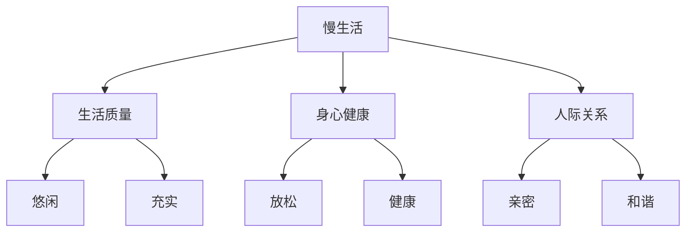
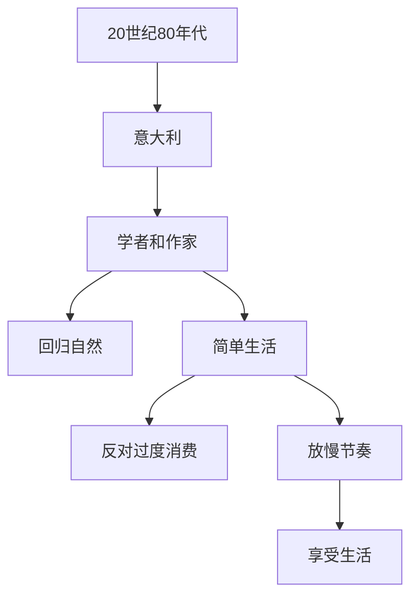
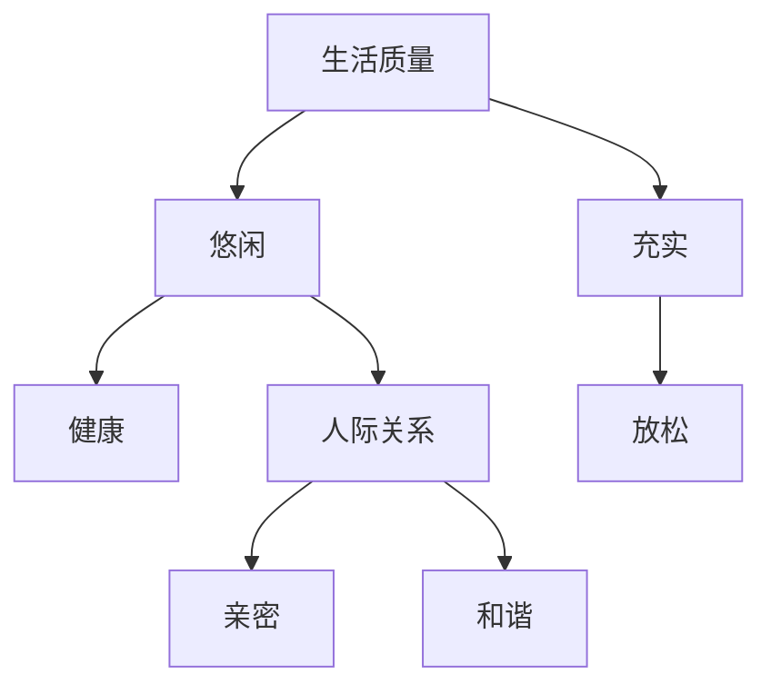
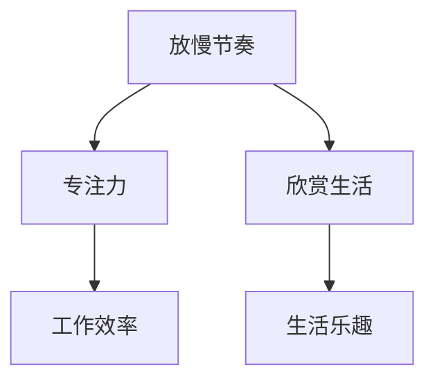
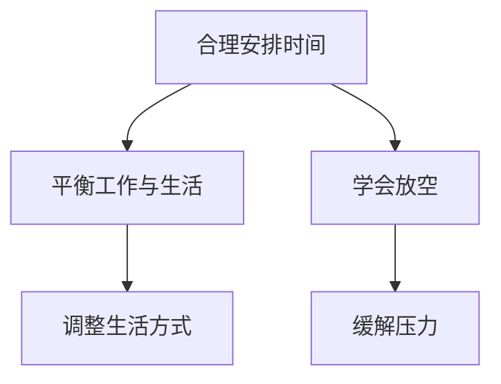

                 

### 文章标题

慢生活运动：在快节奏中寻找内心的平静

> 关键词：慢生活运动、快节奏生活、内心平静、心理健康、生活方式

> 摘要：本文深入探讨了慢生活运动的起源、理念、方法与实践，分析了快节奏生活的挑战与影响，通过具体案例展示了慢生活运动的效果，提出了如何在快节奏中实现内心平静的最佳实践。

---

# 慢生活运动：在快节奏中寻找内心的平静

## 引言

在当今社会，快节奏的生活已成为一种普遍现象。从早到晚，人们都在忙碌于工作、学习、社交等各种活动，几乎没有时间停下来喘口气。然而，这种快节奏的生活方式带来了诸多负面影响，如心理健康问题、身体健康问题等。为了应对这些问题，慢生活运动逐渐兴起。本文将围绕慢生活运动的起源、理念、方法与实践进行深入探讨，旨在帮助读者在快节奏的生活中找到内心的平静。

## 第一部分：慢生活运动的起源与理念

### 第1章：慢生活运动的起源与背景

#### 1.1.1 慢生活的概念

慢生活（Slow Life）是一种追求高质量生活的态度，强调在日常生活中放慢节奏，享受生活带来的乐趣。与快节奏生活相比，慢生活注重生活质量、身心健康和人际关系。

**概念图：**

#### 1.1.2 慢生活运动的发展历程

慢生活运动起源于20世纪80年代的意大利，由一群主张回归自然、追求简单生活的学者和作家发起。他们反对过度消费和竞争，倡导人们在日常生活中放慢节奏，享受生活的美好。

**发展历程图：**

#### 1.1.3 慢生活运动的核心价值观

慢生活运动的核心价值观包括：

1. **生活质量优先**：关注生活品质，追求悠闲、充实、有意义的日常生活。
2. **身心健康**：注重身心健康，通过放慢节奏、锻炼身体、调节情绪等方式保持健康。
3. **人际关系**：强调家庭、朋友和社区关系，注重亲密、和谐的人际交往。

**核心价值观关系图：**

### 第2章：快节奏生活的挑战与影响

#### 2.1 快节奏生活的现状

1. **工作压力**：长时间工作、加班成为常态，导致心理健康问题。
2. **生活节奏**：生活节奏加快，导致睡眠不足、体力透支。
3. **人际关系**：快节奏生活使得人们难以花费时间与家人、朋友建立深度联系。

#### 2.2 快节奏生活的负面影响

1. **健康问题**：长期快节奏生活可能导致高血压、心脏病等健康问题。
2. **心理健康问题**：快节奏生活容易导致焦虑、抑郁等心理问题。
3. **社会问题**：快节奏生活可能加剧社会不公、资源分配不均等问题。

## 第二部分：慢生活运动的方法与实践

### 第3章：慢生活运动的核心方法

#### 3.1 慢生活的七大原则

1. **放慢节奏**：减少工作时间，合理安排生活。
2. **培养专注力**：专注于当下，提高工作效率。
3. **欣赏生活中的美好**：学会发现生活中的美好，享受生活的乐趣。

**七大原则关系图：**

#### 3.2 慢生活的实践技巧

1. **合理安排时间**：制定日程表，平衡工作与生活。
2. **学会放空**：适当休息，缓解压力。
3. **增强自我意识**：了解自己的需求，调整生活方式。

**实践技巧关系图：**

## 第三部分：慢生活运动的案例分析

### 第4章：国内外慢生活运动案例分析

#### 4.1 国内慢生活运动案例

1. **社区慢生活实践**：一些城市推出了慢生活社区，倡导居民放慢节奏，享受生活。
2. **企业慢生活实践**：一些企业开始关注员工身心健康，推行弹性工作时间等政策。
3. **政府政策支持**：政府出台相关政策，鼓励人们过上慢生活。

#### 4.2 国外慢生活运动案例

1. **瑞士的“休闲生活法”**：规定员工每年必须休假，享受慢生活。
2. **日本的“健康生活运动”**：推广健康生活方式，提高国民健康水平。
3. **欧洲的“慢城运动”**：一些城市加入慢城联盟，倡导慢生活理念。

## 第四部分：慢生活运动的影响与未来趋势

### 第5章：慢生活运动的影响与未来趋势

#### 5.1 慢生活运动对社会的影响

1. **经济影响**：慢生活运动有助于提高生活质量，促进消费升级。
2. **文化影响**：慢生活运动传承和弘扬传统文化，推动文化创新。
3. **政策影响**：慢生活运动为政府决策提供了新的思路和方向。

#### 5.2 慢生活运动的未来趋势

1. **技术创新**：人工智能、物联网等技术的发展将为慢生活运动提供新的支持。
2. **政策支持**：政府将进一步出台政策，鼓励和推广慢生活运动。
3. **社会接受度**：随着人们健康意识的提高，慢生活运动将逐渐得到更多人的认可和接受。

## 第五部分：结语

### 第6章：慢生活运动的总结

1. **慢生活运动的核心价值**：追求生活质量、身心健康和人际关系。
2. **慢生活运动的方法与实践**：合理安排时间、培养专注力、欣赏生活中的美好。
3. **慢生活运动的影响**：对社会、经济、文化等方面产生积极影响。

### 第7章：结语

1. **慢生活运动的意义**：帮助人们在快节奏生活中找到内心的平静。
2. **未来展望**：随着社会的发展，慢生活运动将得到更广泛的认可和实践。

## 附录

### 附录A：慢生活运动相关资源

1. **书籍推荐**：介绍慢生活运动的相关书籍，如《慢生活》、《慢的艺术》等。
2. **网站推荐**：提供慢生活运动的官方网站、博客等资源。
3. **实践指南**：分享慢生活运动的实践技巧和案例分析。

---

**作者信息：**

作者：AI天才研究院/AI Genius Institute & 禅与计算机程序设计艺术 /Zen And The Art of Computer Programming

---

以上是文章的初步大纲，接下来将逐步完善每个章节的内容。文章字数预计在8000-12000字左右。

