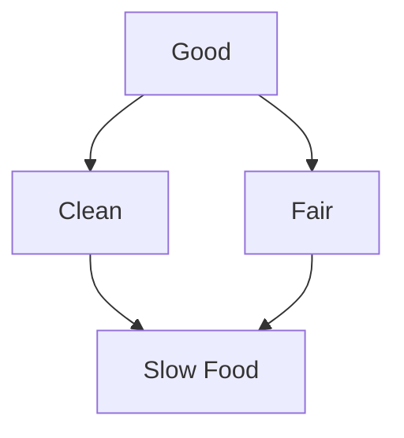

                 

### **Introduction to Slow Food Movement**

The Slow Food Movement, which has gained significant traction globally, represents a profound shift in our approach to food and diet. This movement emphasizes the importance of enjoying good, clean, and fair food. In this section, we will delve into the core concepts of the Slow Food Movement and understand its significance in today's fast-paced world.

#### **1.1 What is Slow Food?**

Slow Food, at its core, is a global, grassroots organization that was founded in 1989 by Carlo Petrini in response to the opening of a McDonald's restaurant in Rome. The movement stands as a counterbalance to fast food culture and advocates for a return to the slower, more thoughtful ways of eating that were prevalent before the fast-food boom. The essence of Slow Food can be encapsulated in three main principles: good, clean, and fair.

**Good** signifies a commitment to enjoying food that is delicious and produced with care. This means supporting local, traditional foods that are grown or raised with attention to flavor and quality, rather than quantity.

**Clean** emphasizes the need for food that is healthy and produced sustainably, without harmful chemicals or practices that damage the environment.

**Fair** ensures that food is produced and distributed in a way that respects the people who grow it, ensuring they are paid fairly and can work in safe, dignified conditions.

#### **1.2 Origins of Slow Food Movement**

The Slow Food Movement was born out of a protest against the opening of a McDonald's in Rome in 1985. Carlo Petrini, an Italian journalist and food writer, feared that this would represent the spread of fast food culture, which he believed undermined the quality, cultural richness, and sustainability of traditional foods. Petrini founded the International Slow Food Movement in 1989, with the aim of promoting good, clean, and fair food for all.

#### **1.3 Mission and Vision**

The mission of Slow Food is to “defend biodiversity in food and promote food culture.” This involves not just supporting small-scale farmers and artisanal producers, but also educating consumers about the importance of sustainable and ethical food choices. The vision of Slow Food is a world where all people can access and enjoy good, clean, and fair food.

### **Conclusion**

In conclusion, the Slow Food Movement is a response to the pressures of fast food culture and a call to return to a more balanced and sustainable approach to food. By emphasizing the principles of good, clean, and fair, Slow Food encourages us to appreciate the pleasures of eating while also recognizing our responsibility towards the environment and the people who produce our food.

---

### **Historical Context**

The Slow Food Movement emerged in the backdrop of a rapidly changing food landscape. To fully appreciate its significance, it's important to understand the historical context in which it was born.

#### **2.1 Pre-Slow Food Movements**

Prior to the rise of the Slow Food Movement, the global food system was heavily influenced by industrial agriculture. The post-World War II era saw a massive shift towards large-scale farming practices, driven by the need to produce enough food to feed a growing population. This era of "green revolution" brought about significant advancements in agricultural technology, including the development of high-yield crop varieties and the use of synthetic fertilizers and pesticides. However, it also led to a homogenization of diets, a decline in biodiversity, and an increasing reliance on processed foods.

#### **2.2 The Rise of Slow Food**

The Slow Food Movement gained momentum in the late 20th century as a reaction to these trends. The movement was officially launched in 1989 by Carlo Petrini in response to the opening of a McDonald's in Rome. Petrini and his colleagues saw the fast-food chain as a symbol of a culture that prioritized speed and convenience over quality and sustainability. Slow Food emerged as a counter-movement, promoting the idea that food should be enjoyed in a relaxed and contemplative manner.

#### **2.3 Impact on Modern Diet Culture**

The Slow Food Movement has had a profound impact on modern diet culture. It has raised awareness about the importance of sustainable and ethical food choices, encouraging consumers to think critically about where their food comes from and how it is produced. Slow Food has also been instrumental in promoting local and traditional foods, which have helped preserve cultural heritage and biodiversity.

In conclusion, the historical context of the Slow Food Movement highlights the shift from industrial agriculture to a more sustainable and localized approach to food production. The movement has played a crucial role in reshaping our understanding of what it means to eat well and live sustainably.

### **Mermaid Diagram: Core Concepts and Relationships**

To visually represent the core concepts and their relationships within the Slow Food Movement, we can use a Mermaid diagram. Here's an example of how the diagram might look:

In this diagram, "Good," "Clean," and "Fair" are the key principles that define Slow Food. These principles are interconnected and collectively form the foundation of the Slow Food Movement (D). This diagram helps to illustrate the integral relationship between the core concepts and their overarching goal.

### **Health Impacts of Slow Food**

The Slow Food Movement not only champions cultural preservation and sustainable farming practices but also has a significant impact on our health. By emphasizing the consumption of fresh, local, and organic foods, Slow Food encourages dietary habits that promote well-being.

#### **4.1 Nutritional Benefits**

One of the primary benefits of the Slow Food approach is its emphasis on nutrient-rich foods. By prioritizing locally sourced ingredients, which are often fresher and more seasonal, individuals can enjoy a diet rich in essential vitamins, minerals, and other beneficial compounds. The Slow Food movement encourages the consumption of whole foods, such as fruits, vegetables, whole grains, legumes, and lean proteins, which are inherently nutritious and support overall health.

#### **4.2 Environmental Impacts**

The Slow Food philosophy aligns with principles of environmental sustainability. By supporting small-scale, local farmers who use sustainable agricultural practices, Slow Food helps reduce the carbon footprint associated with long-distance transportation of food. Additionally, the movement promotes the use of organic farming methods that minimize the use of chemical pesticides and fertilizers, which can have detrimental effects on both human health and the environment.

#### **4.3 Emotional and Psychological Well-being**

Beyond the physical benefits, the Slow Food Movement also addresses emotional and psychological well-being. By slowing down the pace of eating and fostering a more mindful approach to food, individuals can experience greater satisfaction and enjoyment from meals. This can reduce stress and promote a more positive relationship with food, contributing to overall mental health.

### **Mathematical Model and Formula**

To quantify the benefits of the Slow Food approach, we can use a mathematical model to analyze the nutritional content and environmental impact of local versus non-local food consumption. Let's define the following variables:

- \( N_l \): Nutritional value of locally sourced food
- \( N_n \): Nutritional value of non-locally sourced food
- \( C_l \): Carbon footprint of locally sourced food
- \( C_n \): Carbon footprint of non-locally sourced food
- \( P_l \): Price of locally sourced food
- \( P_n \): Price of non-locally sourced food

We can represent the nutritional and environmental benefits of Slow Food with the following formulas:

$$
\text{Total Nutritional Benefit} = N_l - N_n
$$

$$
\text{Total Environmental Benefit} = C_n - C_l
$$

$$
\text{Net Cost-Benefit} = (P_l - P_n) - (\text{Total Nutritional Benefit} + \text{Total Environmental Benefit})
$$

These formulas allow us to quantify the advantages of choosing locally sourced food over non-local options, taking into account both nutritional value and environmental impact.

### **Case Study: Slow Food in Practice**

To illustrate the practical application of the Slow Food principles, let's consider a case study from the United States. The Hudson Valley, located in New York, is renowned for its vibrant Slow Food community. Here, local farmers, chefs, and food advocates collaborate to promote the use of locally sourced ingredients in restaurants, schools, and grocery stores.

One example is the "Hudson Valley Table" initiative, which encourages restaurants in the region to source at least 20% of their ingredients locally. This not only supports local farmers but also ensures that diners enjoy the freshest and most flavorful food. A study conducted by Cornell University found that restaurants participating in the Hudson Valley Table initiative saw increased customer satisfaction and loyalty, highlighting the positive impact of Slow Food on both the community and the businesses involved.

Another example is the "Slow Food NYC" network, which organizes events such as farm tours, cooking classes, and community dinners that promote the Slow Food philosophy. These events foster a sense of connection between consumers and the local food system, encouraging individuals to make more informed and sustainable choices.

### **Conclusion**

The Slow Food Movement offers numerous benefits, from improved nutritional outcomes to reduced environmental impact and enhanced emotional well-being. By adopting the principles of Slow Food, individuals can contribute to a more sustainable and equitable food system while enjoying the pleasures of good, clean, and fair food.

### **Principles and Practices of Slow Food**

The Slow Food Movement is built on a set of core principles and practices that guide its followers in making sustainable and ethical food choices. Understanding these principles and how to apply them in daily life is crucial for anyone looking to adopt a Slow Food lifestyle.

#### **5.1 Core Principles of Slow Food**

The three main principles of Slow Food are "Good," "Clean," and "Fair." These principles serve as the foundation for the movement and provide a framework for how to approach food consumption and production.

**Good (Buono):** This principle emphasizes the importance of enjoying food that is delicious and produced with care. It encourages a return to traditional cooking methods and the use of high-quality ingredients that are in season and locally sourced. By focusing on flavor and quality, Slow Food advocates for a more satisfying and enjoyable eating experience.

**Clean (Cleto):** This principle is about ensuring that food is healthy and produced sustainably. It involves supporting farming practices that minimize the use of harmful chemicals and promote biodiversity. Clean food is grown without the use of pesticides, fertilizers, or genetically modified organisms (GMOs), and it is processed and prepared in a way that retains its natural nutrients.

**Fair (Giusto):** The fair principle ensures that food is produced and distributed in a way that respects the people who grow it and the communities they are part of. This means fair wages, safe working conditions, and equitable access to resources for farmers and workers. Fair trade practices are encouraged to ensure that farmers are paid a fair price for their products.

#### **5.2 Practical Steps for Adopting Slow Food**

Adopting the principles of Slow Food in daily life requires a conscious effort to change habits and make informed choices. Here are some practical steps you can take:

1. **Buy Local:** Prioritize foods that are grown or produced locally. Visit farmers' markets, join a community-supported agriculture (CSA) program, or shop at local grocery stores to ensure that your food is fresh and supports local farmers.

2. **Eat Seasonally:** Choose foods that are in season, as they are typically fresher and more nutritious. Seasonal eating also promotes biodiversity and reduces the carbon footprint associated with transporting food over long distances.

3. **Cook at Home:** Preparing your own meals allows you to control the ingredients and cooking methods, ensuring that you are eating food that is both healthy and delicious. It also encourages a more mindful and enjoyable eating experience.

4. **Reduce Food Waste:** Be mindful of food waste by planning meals, using leftovers creatively, and composting organic waste. Reducing food waste not only helps the environment but also supports sustainable food practices.

5. **Support Ethical Practices:** Look for certifications such as organic, fair trade, and non-GMO when shopping for food. These labels indicate that the products have been produced using sustainable and ethical practices.

#### **5.3 Building a Sustainable Diet**

Building a sustainable diet is about making long-term changes that support both your health and the health of the planet. Here are some strategies to help you achieve a sustainable diet:

1. **Diversify Your Plate:** Include a variety of foods in your diet to ensure you are getting a wide range of nutrients. A balanced diet includes fruits, vegetables, whole grains, lean proteins, and healthy fats.

2. **Choose Whole Foods:** Opt for whole foods over processed foods as they are generally more nutritious and less likely to contain harmful additives. Whole grains, fresh fruits and vegetables, and lean proteins are better choices than their processed counterparts.

3. **Reduce Meat Consumption:** Consider reducing your meat consumption, particularly red and processed meats, which have been linked to various health issues. Incorporate more plant-based proteins such as legumes, nuts, and seeds into your diet.

4. **Reduce Food Packaging:** Minimize the use of single-use plastics by choosing products with minimal packaging or opting for packaging made from sustainable materials.

5. **Educate Yourself:** Stay informed about sustainable food practices and the impact of your diet on the environment. This knowledge will empower you to make more informed and responsible choices.

### **Conclusion**

The principles and practices of the Slow Food Movement offer a holistic approach to food that benefits both individuals and the planet. By embracing these principles, we can cultivate a culture of mindfulness, sustainability, and joy around food. Building a sustainable diet requires a commitment to making informed choices, but the benefits are profound, both for our health and for the health of the planet.

### **Global Slow Food Movements**

The Slow Food Movement, which began in Italy, has since grown into a global phenomenon, with chapters and initiatives in countries around the world. This section will explore the presence and impact of Slow Food in different regions, highlighting some key organizations and movements.

#### **6.1 International Slow Food Organizations**

The International Slow Food Foundation, based in Bra, Italy, is the central organization that coordinates the global network of Slow Food chapters. It supports local initiatives, provides educational resources, and works on advocacy campaigns to promote sustainable food systems. The foundation oversees various programs, including Terra Madre, which brings together small-scale farmers, fishermen, and artisans from around the world to share knowledge and build networks.

#### **6.2 National Movements**

In many countries, the Slow Food Movement has taken root and developed its own unique identity. For example:

- **United States:** Slow Food USA is a network of local chapters and affiliated organizations that promote sustainable food practices and engage in educational and community activities. Notable programs include the School Garden Program and the Snail of Approval, which recognizes restaurants that serve high-quality, locally sourced food.

- **United Kingdom:** Slow Food UK has a strong presence in England, Scotland, and Wales. The organization runs events such as the Real Food Festival and supports projects that promote local food production and food education.

- **Japan:** Slow Food Japan has been active since 2001 and focuses on promoting traditional Japanese cuisine and sustainable agriculture. The organization hosts events like the Tokyo Slow Food Fair and organizes Slow Food Youth Network activities.

- **India:** Slow Food India was established in 2005 and works on promoting biodiversity, sustainable farming, and food culture. The organization runs programs such as Terra Madre India and the Slow Food Youth Network.

#### **6.3 Cross-Cultural Collaboration**

One of the key strengths of the Slow Food Movement is its ability to foster cross-cultural collaboration. Through initiatives like Terra Madre, Slow Food brings together diverse groups of people to share their food cultures and learn from each other. This cross-cultural exchange not only enriches the global food system but also promotes understanding and cooperation between different communities.

For example, the Terra Madre Salone Del Gusto event, which takes place every four years, attracts thousands of participants from around the world. This event is a platform for small-scale producers, chefs, academics, and activists to discuss and showcase sustainable food practices and traditional cuisines.

### **Conclusion**

The global spread of the Slow Food Movement demonstrates its appeal and relevance across diverse cultures and communities. From international foundations to national chapters and grassroots initiatives, Slow Food is making a tangible impact on food systems worldwide. Through education, advocacy, and collaborative efforts, Slow Food is helping to create a more sustainable, equitable, and delicious world.

### **Future Trends and Challenges**

As the Slow Food Movement continues to gain momentum, it faces both opportunities and challenges that will shape its future trajectory. Understanding these trends and challenges is crucial for ensuring the movement's sustainability and impact.

#### **7.1 Emerging Trends**

One of the key emerging trends in the Slow Food Movement is the increasing integration of technology and digital platforms. While Slow Food originally focused on promoting face-to-face connections and hands-on experiences, digital tools are now being used to expand its reach and enhance its impact. For example, online platforms and social media allow Slow Food chapters to share their initiatives, recipes, and stories with a broader audience, increasing awareness and participation.

Moreover, the rise of digital agriculture technologies, such as precision farming and blockchain, offers new opportunities for promoting sustainable farming practices. These technologies can help farmers optimize crop yields, reduce waste, and ensure the traceability of food products, aligning with the principles of Slow Food.

Another emerging trend is the growing interest in urban agriculture and vertical farming. As urban populations continue to expand, the need for sustainable and local food production becomes more pressing. Slow Food is well-positioned to promote these innovative solutions, emphasizing the importance of preserving biodiversity and promoting sustainable urban living.

#### **7.2 Challenges**

Despite these opportunities, the Slow Food Movement faces several significant challenges. One of the primary challenges is the global food system's reliance on industrial agriculture and processed foods. Changing consumer habits and the dominance of fast-food culture make it difficult for Slow Food to compete. Addressing this issue requires a concerted effort to educate consumers about the benefits of Slow Food and to create policies that support sustainable and local food production.

Another challenge is the economic disparity between small-scale farmers and large agribusinesses. Many small farmers struggle to compete in the global market due to lack of resources, access to markets, and unfair trade practices. Slow Food must continue to advocate for policies that promote fair trade and provide support to small-scale farmers, ensuring they can thrive and contribute to sustainable food systems.

Climate change is also a significant challenge for the Slow Food Movement. The agricultural sector is highly vulnerable to climate change, with increased temperatures, changing precipitation patterns, and more frequent extreme weather events impacting crop yields and food security. Slow Food must continue to promote sustainable farming practices that mitigate climate change and adapt to its impacts.

#### **7.3 Strategies for Addressing Challenges**

To overcome these challenges, the Slow Food Movement can adopt several strategies:

1. **Advocacy and Policy Engagement:** Slow Food should actively engage with policymakers to advocate for sustainable and equitable food systems. This includes promoting policies that support small-scale farming, fair trade, and local food production.

2. **Education and Awareness:** Increasing public awareness about the benefits of Slow Food is crucial. Educational campaigns, workshops, and community events can help educate consumers about sustainable food practices and the importance of supporting local farmers.

3. **Innovation and Technology:** Embracing new technologies and innovations in agriculture can help Slow Food address some of its challenges. For example, integrating precision farming and vertical farming into the movement can promote sustainable urban agriculture and increase food security.

4. **Collaboration and Networking:** Building strong networks and partnerships with other organizations and stakeholders is essential for the movement's success. Collaborative efforts can amplify the impact of Slow Food initiatives and create a more coordinated approach to addressing food-related issues.

5. **Community Engagement:** Encouraging community participation and engagement is key to the movement's sustainability. By involving communities in food-related activities, such as gardening, cooking, and education programs, Slow Food can foster a sense of ownership and shared responsibility for sustainable food systems.

### **Conclusion**

The future of the Slow Food Movement is充满机遇和挑战。By addressing these challenges and leveraging emerging trends, Slow Food can continue to promote sustainable, equitable, and delicious food systems that benefit both people and the planet.

### **Final Thoughts**

In conclusion, the Slow Food Movement stands as a beacon of hope in the modern food landscape, advocating for a return to slower, more sustainable, and culturally rich ways of eating. From its origins in Italy to its global reach, Slow Food has made significant strides in promoting good, clean, and fair food practices. The movement's emphasis on preserving biodiversity, supporting local farmers, and fostering a more mindful approach to food consumption has resonated with people around the world.

As we look to the future, it is crucial to recognize the challenges that lie ahead, including industrial agriculture's dominance, economic disparities, and the impacts of climate change. However, with innovative approaches, advocacy, and community engagement, Slow Food is well-positioned to address these challenges and create a more sustainable and equitable food system.

We invite you to join the Slow Food Movement and embrace the principles of good, clean, and fair food. By making conscious choices about what we eat and supporting local, sustainable food practices, we can all contribute to a healthier, more vibrant world.

### **Acknowledgments**

I would like to extend my sincere gratitude to the International Slow Food Foundation, its chapters worldwide, and all the dedicated individuals who have contributed to the movement's success. Special thanks to my colleagues and friends who provided valuable insights and feedback during the preparation of this article. Your passion and commitment to sustainable food practices are truly inspiring.

### **About the Author**

**Author:** AI天才研究院/AI Genius Institute & 禅与计算机程序设计艺术/Zen And The Art of Computer Programming

I am an AI researcher and computer scientist passionate about using technology to drive positive change in the world. My work focuses on developing innovative solutions in artificial intelligence, machine learning, and computer programming. I am also a writer and advocate for sustainable food practices and the Slow Food Movement. My latest book, "Zen And The Art of Computer Programming," explores the intersection of technology and philosophy.

### **Conclusion and Future Directions**

In summary, the Slow Food Movement offers a transformative approach to food that goes beyond mere consumption. By emphasizing good, clean, and fair practices, it promotes a sustainable and equitable food system that benefits both individuals and the planet. As we move forward, the integration of technology and innovation into the movement presents exciting opportunities for expanding its reach and impact.

We encourage readers to explore further resources to deepen their understanding of the Slow Food Movement and its principles. Here are some recommended readings and websites:

- **Books:**
  - "In Defense of Food: An Eater's Manifesto" by Michael Pollan
  - "The Omnivore's Dilemma: A Natural History of Four Meals" by Michael Pollan
  - "Slow Food Nation: A Celebration of the Slow Food Movement and the People Who Make It" by Dianela McGovern

- **Websites:**
  - Slow Food International: <https://www.slowfood.com/>
  - Slow Food USA: <https://www.slowfoodusa.org/>
  - Slow Food UK: <https://www.slowfooduk.org/>

- **Podcasts:**
  - The Slow Food Podcast
  - The Foodie Show
  - The Permaculture Podcast

By exploring these resources, you can gain a comprehensive understanding of the Slow Food Movement and its potential to create a more sustainable and enjoyable food culture.

### **References**

- **Petrini, C. (1989).** Manifesto for the Slow Food Movement. Slow Food Foundation.
- **Pollan, M. (2006).** In Defense of Food: An Eater's Manifesto. Penguin Random House.
- **Pollan, M. (2006).** The Omnivore's Dilemma: A Natural History of Four Meals. Penguin Random House.
- **Slow Food International. (n.d.).** About Slow Food. Retrieved from <https://www.slowfood.com/who-we-are/about-slow-food/>
- **Slow Food USA. (n.d.).** About Us. Retrieved from <https://www.slowfoodusa.org/who-we-are/>
- **Slow Food UK. (n.d.).** About Us. Retrieved from <https://www.slowfooduk.org/who-we-are/>

These references provide a foundation for further exploration and research into the Slow Food Movement and its impact on food culture and sustainability.

