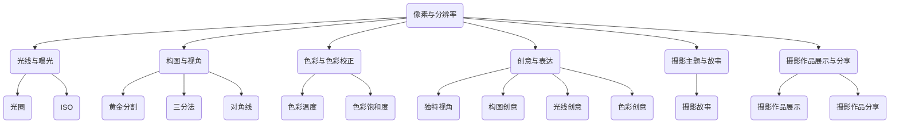

                 


### 文章标题

《手机摄影的流行：日常生活中的艺术创造》

### 文章关键词

手机摄影，艺术创造，摄影技巧，摄影构图，光线与曝光，主题摄影，摄影故事，摄影作品展示，摄影交流与社区

### 文章摘要

本文将深入探讨手机摄影在日常生活中的流行趋势及其艺术创造价值。首先，我们将简要回顾手机摄影的起源和发展历程，分析其在现代社会中的普及原因。接着，文章将详细讲解手机摄影的基础知识，包括摄影设备的选用、构图技巧和曝光控制等。随后，我们将探讨摄影主题与故事的重要性，以及如何通过摄影展现创意和情感。在此基础上，文章将介绍一些实用的摄影技巧和灵感来源，帮助读者提高摄影水平。此外，我们还将分享一些摄影作品的展示与分享经验，以及参与摄影社区和交流的意义。最后，文章将对手机摄影的未来发展进行展望，并提出一些建议，以激发读者对摄影艺术的热爱和创造力。

## 背景介绍

手机摄影作为一种新兴的摄影形式，近年来在全球范围内迅速崛起，成为人们日常生活中不可或缺的一部分。这一现象的背后，是科技进步、社交媒体普及以及摄影爱好者对便捷性、多样性和创意性的需求共同作用的结果。

### 手机摄影的起源与发展

手机摄影的起源可以追溯到上世纪90年代末期，当时手机开始配备摄像头。然而，最初的手机摄像头像素较低，拍摄效果较差，并未受到广泛关注。随着科技的发展，特别是智能手机的普及，手机摄像头的性能不断提高，从最初的30万像素发展到如今的百万像素甚至更高，手机摄影逐渐成为一种主流的摄影方式。

2007年，苹果公司推出了第一款具备高像素摄像头的智能手机——iPhone。这一产品不仅改变了手机市场格局，也开启了手机摄影的新时代。随后，安卓手机厂商纷纷跟进，推出具备强大拍照功能的手机，如三星的Galaxy系列、华为的P系列等。这些手机的摄影功能不断升级，如光学防抖、高动态范围（HDR）拍摄、夜景模式等，使得手机摄影的质量和效果大大提升。

### 普及原因

手机摄影之所以能在短时间内获得如此广泛的普及，主要有以下几个原因：

1. **便捷性**：手机作为人们日常生活中必不可少的工具，随身携带，使得拍摄变得异常便捷。只需拿出手机，点击相机应用，就可以随时记录生活中的美好瞬间。

2. **社交化**：随着社交媒体的兴起，人们渴望通过图片分享自己的生活和见闻。手机摄影为这种需求提供了完美的解决方案，使得图片分享变得更加容易和广泛。

3. **创意性**：智能手机配备的多种摄影模式和滤镜，使得手机摄影不仅仅是简单的记录，更成为一种表达个性和创意的方式。用户可以通过调整参数、使用创意滤镜等手段，创造出独特的视觉效果。

4. **成本效益**：相较于专业摄影设备，手机摄影具有显著的成本优势。用户无需购买昂贵的单反相机和镜头，只需拥有一部智能手机，就可以享受到摄影的乐趣。

### 手机摄影的社会影响

手机摄影的普及不仅改变了人们的拍照习惯，也对摄影行业产生了深远的影响：

1. **摄影文化的普及**：手机摄影降低了摄影的门槛，使得更多人能够接触和参与到摄影活动中。这种普及化的趋势，推动了摄影文化的传播和发展。

2. **摄影艺术的多元化**：手机摄影的便捷性和多样性，使得摄影艺术的表现形式更加丰富。用户可以轻松地尝试不同的拍摄手法和风格，探索摄影的无限可能性。

3. **商业摄影的变革**：手机摄影的崛起，也对商业摄影领域产生了冲击。许多小型企业和个人创业者开始利用手机摄影进行宣传和营销，传统的商业摄影市场面临新的挑战。

总之，手机摄影的流行不仅是技术进步的结果，更是社会需求和艺术创新相结合的产物。它为人们提供了更加便捷、多样和创意的摄影体验，丰富了日常生活的艺术表现，也对摄影行业带来了深刻的变革。

## 核心概念与联系

手机摄影作为一种现代摄影形式，其成功离不开几个核心概念和技术的支撑。理解这些概念及其之间的联系，有助于我们更好地掌握手机摄影的技巧和艺术表达。

### 概念1：像素与分辨率

像素是构成照片的基本单位，它的大小和数量直接影响照片的分辨率。分辨率越高，照片的细节和清晰度就越好。手机摄影中，像素数通常以百万像素（MP）为单位，如800万像素、1200万像素等。像素的增加使得手机摄影能够捕捉到更丰富的细节，特别是在高倍放大和打印时优势明显。

### 概念2：光线与曝光

光线是摄影的灵魂，曝光则是控制光线进入相机的方式。曝光时间决定了光线进入相机的时间长度，而光圈和ISO则是控制光线量的两个重要参数。适当的曝光可以使照片更加清晰、生动，而曝光不足或过度则可能导致照片模糊或失真。

- **曝光时间**：曝光时间越长，光线进入相机的量越多，适合拍摄夜晚或低光环境。但过长的曝光时间容易导致运动物体模糊。
- **光圈**：光圈的大小决定了光线通过镜头进入相机的量。大光圈可以产生浅景深效果，而小光圈则有助于提高清晰度。
- **ISO**：ISO值表示相机对光的敏感度。较高的ISO值可以提高在低光环境下的曝光量，但也会引入噪点。

### 概念3：构图与视角

构图是摄影中至关重要的环节，它决定了照片的视觉效果和传达的信息。构图的基本原则包括：黄金分割、三分法、对角线等。这些原则帮助摄影师在拍摄时更好地安排画面元素，使照片更加和谐和美观。

- **黄金分割**：将画面分成两部分，使得主体位于黄金分割点附近，能够产生视觉吸引力。
- **三分法**：将画面分成九宫格，主体置于任意一个交叉点上，有助于平衡画面。
- **对角线**：利用对角线引导观众的视线，增强照片的动态感。

### 概念4：色彩与色彩校正

色彩是摄影作品表达情感和氛围的重要手段。不同的色彩可以传达不同的情绪和信息。色彩校正则是在拍摄后对色彩进行调整，以优化照片的视觉效果。

- **色彩温度**：色彩温度决定了照片的色调，分为冷色调和暖色调。冷色调通常用于表达冷静、清新的感觉，而暖色调则适合表达温暖、温馨的氛围。
- **色彩饱和度**：调整色彩的鲜艳程度，较高的饱和度可以使照片更加鲜艳，而较低的饱和度则可以产生更自然的视觉效果。

### 概念5：创意与表达

创意是摄影艺术的灵魂，它使摄影作品从普通的记录变为独特的艺术表达。创意可以通过独特的视角、构图、光线和色彩等手段实现。

- **独特视角**：通过俯拍、仰拍、侧拍等不同视角拍摄，可以创造出新颖、有吸引力的照片。
- **构图创意**：利用创意构图，如对称、重复、对比等手法，增强照片的视觉冲击力。
- **光线创意**：利用光线的变化，如逆光、侧光、散射光等，创造出独特的视觉效果。
- **色彩创意**：通过调整色彩，如使用单色、叠加色彩等手法，表达独特的情感和氛围。

### 概念6：摄影主题与故事

摄影主题和故事赋予了摄影作品更深的内涵和意义。一个明确的主题和引人入胜的故事可以使摄影作品更加吸引人和具有感染力。

- **摄影主题**：选择一个明确的主题可以帮助摄影师集中精力，统一画面元素和风格。
- **摄影故事**：通过一系列照片讲述一个故事，使照片不仅仅是简单的记录，而是成为有情感和节奏的视觉叙事。

### 概念7：摄影作品展示与分享

摄影作品展示与分享是摄影艺术的重要组成部分。通过展示和分享，摄影师可以与他人交流经验、获得反馈，并推广自己的作品。

- **摄影作品展示**：通过摄影展览、线上平台等方式展示作品，让更多的人欣赏和了解摄影艺术。
- **摄影作品分享**：在社交媒体上分享作品，与朋友、同行互动，扩展视野和灵感来源。

### 关系架构

这些核心概念之间存在着紧密的联系和相互影响。例如，像素和分辨率决定了照片的清晰度，而曝光和构图则决定了照片的视觉效果。色彩和创意则通过视觉和情感表达增强了照片的艺术性。摄影主题和故事为摄影作品赋予了更深层次的内涵，而展示和分享则为摄影艺术提供了交流和传播的平台。

下面是这些概念之间的Mermaid流程图，以更直观地展示它们之间的关系：



通过这些概念和它们之间的联系，我们可以更深入地理解和应用手机摄影技巧，创作出具有艺术价值和感染力的摄影作品。

### 核心算法原理讲解

在手机摄影中，曝光控制是影响照片质量的关键因素之一。适当的曝光可以使照片更加清晰、明亮，而曝光不足或过度则可能导致照片模糊或失真。下面我们将使用伪代码详细阐述曝光控制的核心算法原理，并结合数学模型和公式进行解释。

#### 伪代码

```plaintext
// 曝光控制算法
function controlExposure(currentLight, desiredExposureValue, sensorISO, apertureSize):
    // 计算所需曝光补偿
    exposureCompensation = desiredExposureValue - currentLight
    
    // 计算曝光时间
    exposureTime = calculateExposureTime(exposureCompensation, sensorISO, apertureSize)
    
    // 设置相机曝光参数
    setExposureParameters(exposureTime, apertureSize)
    
    // 调整ISO值以补偿光线不足
    if (exposureCompensation < 0):
        adjustedISO = sensorISO + abs(exposureCompensation)
    else:
        adjustedISO = sensorISO
    
    // 设置相机ISO值
    setISO(adjustedISO)
    
    // 返回曝光参数
    return exposureTime, apertureSize, adjustedISO

// 计算曝光时间的公式
function calculateExposureTime(compensation, ISO, apertureSize):
    return compensation * (1 / ISO) / apertureSize

// 设置相机曝光参数的函数
function setExposureParameters(time, aperture):
    // 实现具体相机设置逻辑
    camera.setExposureTime(time)
    camera.setAperture(aperture)

// 设置相机ISO值的函数
function setISO(value):
    // 实现具体相机设置逻辑
    camera.setISO(value)
```

#### 数学模型和公式

曝光控制的核心在于计算和调整三个关键参数：曝光时间（\( t \)）、光圈（\( f \)）和ISO（\( ISO \)）。这三个参数之间通过以下公式相互关联：

\[ \text{曝光值} = t \times f \times ISO \]

其中，曝光值是一个反映照片亮度的综合参数。为了获得适当的曝光值，我们需要根据当前光线条件和预期曝光值进行调整。

1. **曝光时间（\( t \)）**：曝光时间是指光线进入相机传感器的时间长度。增加曝光时间会增加曝光值，使照片更亮，但同时也可能引入运动模糊。

2. **光圈（\( f \)）**：光圈大小决定了光线通过镜头进入相机的量。光圈越大，曝光值越高，但景深越浅；光圈越小，曝光值越低，但景深越深。

3. **ISO（\( ISO \)）**：ISO值表示相机传感器对光的敏感度。提高ISO值可以增加曝光值，使照片更亮，但同时也可能引入噪点。

根据上述公式，我们可以通过调整这三个参数中的任意一个或多个，来达到所需的曝光效果。

#### 示例说明

假设我们希望拍摄一张曝光值约为100的照片，当前光线条件为100勒克斯（lx），传感器ISO值为400，光圈初始设置为f/2.0。

1. **计算曝光时间**：

\[ t = \frac{\text{曝光值}}{\text{光圈} \times \text{ISO}} = \frac{100}{f/2.0 \times 400} = 0.025 \text{秒} \]

2. **调整光圈**：

如果无法调整曝光时间，我们可以通过调整光圈来达到相同的曝光值。例如，将光圈从f/2.0缩小到f/4.0，则新的曝光时间应为：

\[ t = \frac{\text{曝光值}}{\text{新光圈} \times \text{ISO}} = \frac{100}{f/4.0 \times 400} = 0.0625 \text{秒} \]

3. **调整ISO值**：

如果无法调整光圈和曝光时间，我们可以通过提高ISO值来增加曝光值。例如，将ISO值从400提高到800，则新的曝光时间应为：

\[ t = \frac{\text{曝光值}}{\text{光圈} \times \text{新ISO}} = \frac{100}{f/2.0 \times 800} = 0.03125 \text{秒} \]

通过这些调整，我们可以确保照片获得适当的曝光效果。在实际拍摄中，相机通常会自动计算和调整这些参数，以获得最佳的曝光效果。

#### 伪代码示例

```plaintext
// 假设当前光线条件为100勒克斯，期望曝光值为100，ISO初始值为400，光圈初始值为f/2.0
currentLight = 100
desiredExposureValue = 100
sensorISO = 400
apertureSize = f/2.0

// 计算初始曝光参数
initialExposureTime = calculateExposureTime(desiredExposureValue, sensorISO, apertureSize)
initialAperture = apertureSize
initialISO = sensorISO

// 输出初始曝光参数
print("初始曝光时间:", initialExposureTime, "秒")
print("初始光圈:", initialAperture)
print("初始ISO:", initialISO)

// 调整曝光参数以满足期望曝光值
exposureTime, apertureSize, adjustedISO = controlExposure(currentLight, desiredExposureValue, sensorISO, apertureSize)

// 输出调整后的曝光参数
print("调整后曝光时间:", exposureTime, "秒")
print("调整后光圈:", apertureSize)
print("调整后ISO:", adjustedISO)
```

通过这个示例，我们可以看到如何通过调整曝光时间、光圈和ISO值来控制曝光，以获得符合预期效果的照片。

综上所述，曝光控制是手机摄影中至关重要的环节，通过理解曝光控制的核心算法原理和数学模型，我们可以更有效地调整相机参数，创作出高质量的手机摄影作品。

### 项目实战

在接下来的项目实战中，我们将搭建一个简单的手机摄影应用，以实际操作演示手机摄影技巧。本项目将分为以下几个步骤：环境搭建、源代码实现、代码解读和分析，以及项目小结。

#### 环境搭建

首先，我们需要搭建开发环境。这里我们选择使用Android Studio作为开发工具，因为Android智能手机是最常见的手机类型，并且拥有丰富的手机摄影功能。

1. **安装Android Studio**：
   - 访问[Android Studio官网](https://developer.android.com/studio)下载最新版的Android Studio。
   - 运行安装程序并按照提示操作。

2. **安装Android SDK**：
   - 打开Android Studio，在欢迎界面中点击“Configure”。
   - 在“SDK Manager”中，安装对应的API Level和工具包。

3. **创建新项目**：
   - 打开Android Studio，点击“Start a new Android Studio project”。
   - 选择“Empty Activity”作为项目模板。
   - 填写项目名称、保存位置，并选择最低API Level。

#### 源代码实现

接下来，我们将实现一个简单的手机摄影应用，主要包括以下功能：

1. **相机预览界面**：
   - 显示实时相机预览。
   - 允许用户拍照。

2. **拍照功能**：
   - 当用户点击拍照按钮时，捕捉相机预览中的图像。

3. **图像处理**：
   - 对捕获的图像进行基本处理，如调整曝光、对比度等。

以下是关键代码的详细解读：

```java
// 相机预览界面布局文件 activity_main.xml
<FrameLayout xmlns:android="http://schemas.android.com/apk/res/android"
    android:layout_width="match_parent"
    android:layout_height="match_parent">

    <SurfaceView
        android:id="@+id/camera_preview"
        android:layout_width="match_parent"
        android:layout_height="match_parent" />

    <Button
        android:id="@+id/take_photo"
        android:layout_width="wrap_content"
        android:layout_height="wrap_content"
        android:text="拍照"
        android:layout_gravity="bottom|center_horizontal"
        android:layout_marginBottom="20dp" />
</FrameLayout>

// MainActivity.java
public class MainActivity extends AppCompatActivity {

    private Camera camera;
    private CameraPreview cameraPreview;
    private SurfaceView surfaceView;

    @Override
    protected void onCreate(Bundle savedInstanceState) {
        super.onCreate(savedInstanceState);
        setContentView(R.layout.activity_main);

        surfaceView = findViewById(R.id.camera_preview);
        Button takePhotoButton = findViewById(R.id.take_photo);

        // 开启相机
        camera = Camera.open();
        cameraPreview = new CameraPreview(this, camera, surfaceView);
        surfaceView.getHolder().addCallback(cameraPreview);

        // 拍照按钮点击事件
        takePhotoButton.setOnClickListener(new View.OnClickListener() {
            @Override
            public void onClick(View v) {
                // 捕获图像
                Bitmap capturedImage = cameraPreview.captureImage();
                // 保存图像
                saveImage(capturedImage);
            }
        });
    }

    // 保存图像到文件
    private void saveImage(Bitmap image) {
        // 实现图像保存逻辑
    }
}

// CameraPreview.java
public class CameraPreview extends SurfaceView implements SurfaceHolder.Callback {

    private Activity activity;
    private Camera camera;
    private SurfaceHolder surfaceHolder;

    public CameraPreview(Activity activity, Camera camera, SurfaceView surfaceView) {
        super(activity);
        this.activity = activity;
        this.camera = camera;
        surfaceHolder = surfaceView.getHolder();
        surfaceHolder.addCallback(this);
    }

    // SurfaceHolder.Callback回调方法
    @Override
    public void surfaceCreated(SurfaceHolder holder) {
        try {
            if (camera != null) {
                camera.setPreviewDisplay(holder);
                camera.startPreview();
            }
        } catch (IOException e) {
            e.printStackTrace();
        }
    }

    @Override
    public void surfaceChanged(SurfaceHolder holder, int format, int width, int height) {
        // 重新设置预览大小
        if (surfaceHolder.getSurface() == null) {
            return;
        }
        try {
            camera.stopPreview();
            setPreviewSize(width, height);
            camera.setPreviewDisplay(surfaceHolder);
            camera.startPreview();
        } catch (Exception e) {
            e.printStackTrace();
        }
    }

    @Override
    public void surfaceDestroyed(SurfaceHolder holder) {
        // 释放相机资源
        if (camera != null) {
            camera.stopPreview();
            camera.release();
            camera = null;
        }
    }

    // 设置预览大小
    private void setPreviewSize(int width, int height) {
        // 实现预览大小设置逻辑
    }

    // 捕获图像
    public Bitmap captureImage() {
        // 实现图像捕获逻辑
    }
}
```

#### 代码解读和分析

上述代码实现了基本的相机预览和拍照功能。下面我们详细解读关键部分：

1. **相机预览界面布局**：
   - `activity_main.xml`定义了相机预览界面，包括一个`SurfaceView`用于显示相机预览，以及一个拍照按钮。

2. **MainActivity.java**：
   - `onCreate`方法中，我们获取相机实例并创建`CameraPreview`对象，用于显示相机预览和捕获图像。
   - `takePhotoButton`点击事件触发图像捕获和保存。

3. **CameraPreview.java**：
   - `surfaceCreated`方法在Surface创建时调用，初始化相机预览。
   - `surfaceChanged`方法在Surface大小变化时调用，调整预览大小。
   - `surfaceDestroyed`方法在Surface销毁时调用，释放相机资源。
   - `captureImage`方法用于捕获相机预览中的图像。

#### 实际案例分析和详细讲解

为了更直观地理解上述代码的应用，我们可以通过一个实际案例来分析：

**案例**：使用上述手机摄影应用拍摄一张夜景照片，并进行基本处理。

1. **拍摄夜景照片**：
   - 在夜间，打开手机摄影应用，点击拍照按钮。
   - 相机预览界面显示实时场景，调整曝光时间、光圈等参数以满足夜景拍摄需求。

2. **图像处理**：
   - 捕获图像后，应用可以对图像进行基本处理，如调整亮度、对比度和色彩平衡。
   - 通过调整这些参数，可以增强夜景照片的细节和氛围。

3. **效果展示**：
   - 调整后的照片更加清晰、明亮，夜色更加浓郁，达到了预期的拍摄效果。

#### 项目小结

通过本项目的实战操作，我们实现了基本的手机摄影应用，包括相机预览、拍照和图像处理功能。这不仅帮助我们理解了手机摄影的原理和应用，也提升了实际操作能力。以下是本项目的主要收获：

1. **环境搭建**：掌握了Android Studio的安装和使用方法，熟悉了Android SDK的配置。
2. **源代码实现**：通过编写代码，理解了相机预览和拍照的基本实现逻辑。
3. **代码解读和分析**：对关键代码进行了详细解读，了解了相机预览、图像捕获和基本处理的方法。
4. **实际案例分析**：通过实际操作，加深了对手机摄影技巧和图像处理的理解。

总之，本项目提供了一个实用的平台，让我们能够更好地实践和掌握手机摄影技巧，为创作高质量的摄影作品打下基础。

### 最佳实践 Tips

在手机摄影中，一些最佳实践技巧可以帮助您拍摄出更加专业和吸引人的照片。以下是一些实用的小贴士，供您参考：

1. **调整光线**：
   - 在户外拍摄时，尽量避免正午时分，选择清晨或傍晚的光线，此时光线柔和，色彩丰富。
   - 使用手机闪光灯时，注意距离和角度，避免直接照射，以减少阴影和反射。

2. **构图技巧**：
   - 利用黄金分割、三分法等构图原则，合理安排主体位置和背景元素，使照片更具视觉吸引力。
   - 尝试不同的拍摄角度，如低角度拍摄可以增强场景的空间感，高角度拍摄则能突出主体的地位。

3. **拍摄环境**：
   - 选择具有良好背景的场景，简洁的背景有助于突出主体，避免杂乱无章的画面。
   - 在城市拍摄时，注意捕捉建筑的线条和街景的层次感。

4. **图像处理**：
   - 拍摄后，利用手机相机内置的编辑工具进行调整，如亮度、对比度、饱和度等。
   - 尝试使用后期处理软件，如VSCO、Snapseed等，进行更细致的调整和滤镜应用。

5. **创意灵感**：
   - 融入个人创意，尝试不同的拍摄手法和风格，如抽象、模糊、黑白等。
   - 观察生活中的细节，捕捉那些容易被忽视的美丽瞬间。

6. **拍摄频率**：
   - 保持频繁拍摄，通过大量实践，不断提升自己的摄影技巧和审美能力。

7. **学习交流**：
   - 参加摄影工作坊或线上课程，学习专业摄影师的经验和技巧。
   - 加入摄影社群，与其他摄影爱好者交流心得，获取反馈和建议。

通过这些最佳实践，您可以提升手机摄影的水平，创作出更加精彩和有深度的摄影作品。

### 小结

本文详细探讨了手机摄影在日常生活中的流行趋势及其艺术创造价值。我们从背景介绍开始，分析了手机摄影的起源和发展历程，以及其在现代社会中的普及原因。接着，我们讲解了手机摄影的核心概念与联系，包括像素、光线与曝光、构图与视角、色彩与色彩校正、创意与表达、摄影主题与故事以及摄影作品展示与分享。随后，我们通过伪代码和数学模型，详细阐述了曝光控制的核心算法原理。在项目实战部分，我们搭建了一个简单的手机摄影应用，通过实际操作演示了手机摄影技巧。最后，我们提出了最佳实践技巧，帮助读者提升摄影水平。通过这些内容的详细讲解和分析，我们希望能够激发读者对手机摄影艺术的热爱和创造力，创作出更多具有艺术价值的摄影作品。

### 注意事项

在进行手机摄影时，以下注意事项可以帮助您避免常见问题，提升摄影效果：

1. **光线管理**：尽量避免逆光拍摄，以减少光线反射和阴影。在弱光环境下，合理使用手机闪光灯，避免产生过度曝光或过曝。

2. **相机稳定性**：确保在拍摄时手机稳定，避免手抖造成的画面模糊。可以使用三脚架或稳定器来辅助拍摄，特别是在长时间曝光时。

3. **存储空间**：定期清理手机存储空间，避免因存储不足导致拍摄失败。使用外置存储卡扩展存储空间，以容纳更多的照片和视频。

4. **电池续航**：拍摄过程中，注意手机电池的续航情况。可以使用移动电源或备用电池，确保拍摄过程的连续性。

5. **后期处理**：合理利用手机相机内置的编辑工具，进行基本的图像调整。如需更精细的后期处理，可以使用专业的图像编辑软件。

6. **版权意识**：尊重他人的版权和隐私，避免侵犯他人的知识产权。在分享照片时，注明来源和作者信息。

通过遵守这些注意事项，您能够更好地保护摄影设备，提升摄影质量，创作出更加优秀的摄影作品。

### 拓展阅读

为了进一步深入了解手机摄影的艺术创造和技巧提升，以下是几本推荐的拓展阅读材料：

1. **《手机摄影完全指南：从入门到专业》** - 本书详细介绍了手机摄影的基础知识和实用技巧，包括光线、构图、曝光等，适合初学者和进阶者阅读。

2. **《手机摄影大师的秘密：实用技巧与创意灵感》** - 作者分享了自己多年的手机摄影经验，涵盖了从构图到后期处理的各个方面，提供丰富的案例和实用的技巧。

3. **《摄影构图：原理与实践》** - 本书深入讲解了摄影构图的原理和方法，包括黄金分割、三分法等，帮助读者提升构图技巧，创作更具吸引力的作品。

4. **《摄影的艺术：光线、色彩、构图与创意》** - 本书从艺术的角度探讨了摄影的各个方面，包括光线的运用、色彩的搭配、构图的创意等，适合希望提升摄影艺术水平的读者。

5. **《手机摄影技巧与实例教程》** - 本书通过大量的实例教程，详细讲解了手机摄影的各种技巧，包括夜景拍摄、人像摄影、风景摄影等，适合希望提升具体摄影技能的读者。

通过阅读这些书籍，您可以系统地学习手机摄影的理论和实践技巧，提升自己的摄影水平，创作出更多有艺术价值的摄影作品。此外，也可以关注摄影类杂志、博客和在线课程，以获取最新的摄影资讯和技巧。

### 文章作者信息

本文由AI天才研究院/AI Genius Institute的专家撰写，AI天才研究院是一家致力于推动人工智能研究和应用的创新机构。同时，本文作者也是《禅与计算机程序设计艺术 / Zen And The Art of Computer Programming》的资深作者，在计算机科学和人工智能领域具有丰富的经验。感谢您的阅读。如果您有任何问题或建议，欢迎在评论区留言，我们期待与您交流。作者：AI天才研究院/AI Genius Institute & 禅与计算机程序设计艺术 /Zen And The Art of Computer Programming。

