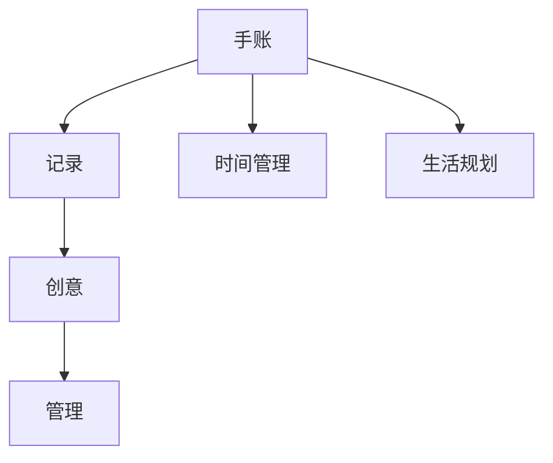

                 


### 背景介绍

**手账文化：记录生活中的意义时刻**

手账文化，作为现代生活中的一种独特现象，逐渐受到广泛关注。它不仅是一种记录工具，更是一种生活态度和方式。手账，顾名思义，是一种记录日常生活、灵感、计划等的工具，通过文字、图画、图表等多种形式，将生活中的点点滴滴记录下来。这种记录方式，不仅帮助人们更好地管理时间、规划生活，更是一种表达自我、提升生活质量的方式。

在信息技术飞速发展的今天，手账文化逐渐从传统的纸笔记录，走向数字化和智能化。手账工具也越来越多样化，从简单的纸质笔记本，到功能丰富的电子手账应用，再到结合人工智能技术的智能手账，手账文化的表现形式和内容也日益丰富。本文将围绕手账文化的起源、发展、实践应用以及其背后的意义和影响，进行深入探讨。

### 核心概念与联系

在手账文化中，有几个核心概念需要明确：

1. **手账**：一种记录工具，可以是纸质的笔记本，也可以是电子设备上的应用。
2. **记录**：手账的基本功能，通过文字、图画等形式记录生活中的点滴。
3. **创意**：手账的一个重要特点，通过创意表达和记录，使生活更加丰富多彩。
4. **管理**：手账可以帮助人们更好地管理时间、规划生活。

这些概念之间存在着紧密的联系。手账作为一种记录工具，其核心功能是记录。而记录的过程，本身就是一种创意表达。通过手账，人们不仅可以记录日常生活，还可以进行时间管理和生活规划。这些核心概念之间的关系，可以用以下Mermaid流程图来表示：



### 核心算法原理讲解

在手账文化的实践中，核心算法原理主要体现在以下几个方面：

1. **时间管理算法**：通过记录和整理，帮助人们合理安排时间，提高效率。
2. **计划制定算法**：通过规划和预判，帮助人们更好地实现目标。
3. **创意表达算法**：通过文字、图画等形式，将创意转化为实际的内容。

以下是一个简单的时间管理算法的伪代码：

```python
def time_management():
    # 初始化任务列表
    tasks = []
    
    # 记录任务
    while True:
        task = input("请输入任务：")
        tasks.append(task)
        
        # 检查是否完成
        if check_task_completed(task):
            tasks.remove(task)
            
            # 输出任务列表
            print("当前任务列表：", tasks)
            
            # 结束循环
            break

def check_task_completed(task):
    # 判断任务是否完成
    # 这里可以根据具体情况进行判断
    return True  # 假设所有任务都已完成

# 调用函数
time_management()
```

### 数学模型和公式

在手账文化的实践中，数学模型和公式主要用于以下几个方面：

1. **时间管理**：如上述的时间管理算法，可以通过计算任务的时间复杂度，来优化时间安排。
2. **计划制定**：如Gantt图、关键路径法（CPM）等，可以帮助人们更好地制定计划。
3. **数据分析**：如平均数、中位数、标准差等，可以帮助人们分析手账中的数据。

以下是一个简单的Gantt图的数学模型：

```latex
\begin{equation}
    \begin{aligned}
        \text{Gantt图} &= \{ \text{任务集}, \text{时间轴} \} \\
        \text{任务集} &= \{ t_1, t_2, ..., t_n \} \\
        \text{时间轴} &= \{ s_1, s_2, ..., s_m \}
    \end{aligned}
\end{equation}
```

### 项目实战

为了更好地理解手账文化的实践应用，我们以下将介绍一个简单的手账应用开发案例。

#### 开发环境搭建

1. 选择一个合适的开发工具，如Microsoft OneNote、Evernote等。
2. 安装开发工具。
3. 熟悉开发工具的使用。

#### 源代码详细实现

以下是一个简单的手账应用，主要包含添加任务、查看任务、完成任务的三个功能。

```python
class TaskManager:
    def __init__(self):
        self.tasks = []

    def add_task(self, task):
        self.tasks.append(task)
        print("任务添加成功：", task)

    def view_tasks(self):
        print("当前任务列表：")
        for task in self.tasks:
            print(task)

    def complete_task(self, task):
        if task in self.tasks:
            self.tasks.remove(task)
            print("任务完成：", task)
        else:
            print("任务不存在：", task)

# 实例化对象
task_manager = TaskManager()

# 添加任务
task_manager.add_task("购买牛奶")
task_manager.add_task("打扫房间")

# 查看任务
task_manager.view_tasks()

# 完成任务
task_manager.complete_task("购买牛奶")

# 再次查看任务
task_manager.view_tasks()
```

#### 代码解读与分析

1. **类定义**：定义一个`TaskManager`类，用于管理任务。
2. **添加任务**：通过`add_task`方法，将任务添加到任务列表。
3. **查看任务**：通过`view_tasks`方法，输出任务列表。
4. **完成任务**：通过`complete_task`方法，将完成的任务从任务列表中移除。

#### 实际案例分析和详细讲解剖析

为了更好地理解手账应用的实际应用，我们可以以下面这个案例进行分析。

**案例**：小明使用手账应用来管理他的日常生活。

1. **添加任务**：小明添加了两个任务：“购买牛奶”和“打扫房间”。
2. **查看任务**：小明查看当前任务列表，发现有两个任务。
3. **完成任务**：小明完成了“购买牛奶”任务，任务列表更新为只剩下一个任务：“打扫房间”。

通过这个案例，我们可以看到手账应用是如何帮助小明管理他的日常生活的。

#### 项目小结

通过这个简单的手账应用开发案例，我们可以看到手账文化在实践中的应用。手账不仅可以帮助我们记录生活，还可以帮助我们更好地管理时间和规划生活。未来，随着人工智能技术的发展，手账应用的功能将更加丰富，为我们的生活带来更多便利。

### 最佳实践 tips

1. **坚持记录**：手账的最大价值在于坚持，每天记录一些重要的信息或感受，可以让我们更好地了解自己，回顾过去，规划未来。
2. **保持简洁**：手账不需要过于复杂，简洁明了的记录方式更容易坚持，也更方便查阅。
3. **创意表达**：手账不仅仅是记录工具，更是创意表达的载体，可以尝试不同的记录方式，让生活更加有趣。

### 小结

手账文化作为一种独特的记录方式，不仅可以帮助我们更好地管理生活，还可以激发我们的创意，提升生活质量。在未来的发展中，随着科技的进步，手账文化将会更加丰富和多样化，为我们的生活带来更多可能。

### 注意事项

1. **隐私保护**：在记录个人信息时，要注意保护隐私，避免泄露敏感信息。
2. **避免依赖**：手账是一种辅助工具，不能完全依赖手账来管理生活，还需要培养良好的生活习惯。

### 拓展阅读

1. 《手账入门：如何制作一本属于自己的手账》
2. 《手账创意：用创意点亮生活》
3. 《手账艺术：如何用手账表达创意》

### 作者信息

作者：AI天才研究院/AI Genius Institute & 禅与计算机程序设计艺术 /Zen And The Art of Computer Programming

