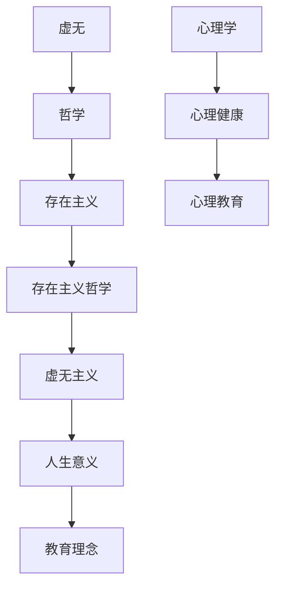

                 

### 教育的目的：培养应对虚无的能力

> 关键词：虚无、教育、心理健康、哲学、文化、技术

> 摘要：本文探讨了教育的目的在于培养个体应对虚无的能力。虚无作为一种普遍存在的哲学现象，对现代教育产生了深远影响。文章首先分析了虚无的起源与影响，然后详细阐述了如何通过心理教育、哲学教育、文化教育和技术教育来培养个体应对虚无的能力。最后，通过成功案例的分析，总结了培养应对虚无能力的有效方法和实践。

---

在当今快速发展的社会背景下，教育作为个体成长和社会进步的重要手段，其目的远不仅限于知识的传递和技能的培养。随着现代社会复杂性的增加，虚无作为一种深层次的哲学现象，对教育产生了深远的影响。虚无不仅挑战了传统教育理念，也对学生的心理健康产生了显著影响。因此，本文旨在探讨教育的真正目的，即培养个体应对虚无的能力。

### 目录大纲

1. **虚无的起源与影响**
   1.1 虚无的概念与起源
   1.2 虚无的历史背景
   1.3 虚无在现代社会中的表现
   1.4 虚无对教育的影响

2. **培养应对虚无的能力**
   2.1 心理教育的方法
   2.2 哲学教育的价值
   2.3 文化教育的力量
   2.4 社会实践的锻炼
   2.5 技术教育的赋能

3. **成功案例与分析**
   3.1 成功案例介绍
   3.2 案例分析
   3.3 案例分析的应用

4. **参考文献**

---

虚无作为一种哲学现象，其根源可以追溯到古希腊哲学家柏拉图和亚里士多德的思想。柏拉图提出了理念世界的概念，认为现实世界只是理念世界的映射，这种观点在某种程度上揭示了虚无的影子。亚里士多德则强调了存在的本质，认为现实世界是真实的，但这也为虚无提供了存在的空间。中世纪哲学家托马斯·阿奎那进一步发展了这些思想，提出了存在的层级理论，为虚无的存在提供了更为深入的哲学解释。

在现代社会，虚无的影响日益显著。随着科技的进步和信息的爆炸，人们对现实的认知和理解变得复杂而模糊。同时，社会竞争的加剧和个人主义的兴起，使得个体面临前所未有的心理压力。虚无感在许多人的生活中变得普遍，他们开始质疑生活的意义和价值，感到迷茫和无助。这种现象对教育产生了深远的影响，传统的教育理念和方法已经无法满足现代学生的需求。

因此，教育的目的不应仅仅局限于知识的传授和技能的培养，更应关注个体内心的成长和精神的富足。培养个体应对虚无的能力，成为现代教育的关键任务。本文将详细探讨如何通过心理教育、哲学教育、文化教育和技术教育来实现这一目标。

### 背景介绍

#### 核心概念与联系

虚无作为哲学中的一个重要概念，其定义和起源对理解现代教育具有深远的意义。为了更好地阐述虚无与教育的关系，我们可以通过一个Mermaid流程图来展现核心概念之间的关系：



在这个流程图中，我们可以看到虚无作为哲学的基础概念，与存在主义和虚无主义紧密相连。存在主义强调个体存在的意义和自由，而虚无主义则质疑这些意义的存在，这导致了个体对人生意义的深刻反思。这些哲学观点不仅影响了人们的世界观和价值观，也对教育产生了重要的启示。

人生意义作为虚无的延伸，与教育理念密切相关。传统的教育理念强调知识的传递和技能的培养，但现代教育更应关注个体内心的成长和精神的需求。教育理念的转变要求我们重新审视教育的目的，从而培养个体应对虚无的能力。

心理学作为研究人类行为和心理过程的学科，为理解虚无的影响提供了科学依据。心理健康作为心理学的一个重要分支，关注个体的情绪状态和心理状态。心理教育旨在提高个体的心理健康水平，帮助个体更好地应对虚无带来的心理压力。

通过上述核心概念和联系的阐述，我们可以清晰地看到虚无与教育之间的复杂关系。虚无不仅挑战了传统教育理念，也为现代教育提供了新的方向和目标。因此，培养个体应对虚无的能力，成为现代教育的关键任务。

### 背景介绍

#### 核心算法原理讲解：心理教育的常见方法

心理教育是培养个体应对虚无能力的重要组成部分。为了实现这一目标，心理教育采用了多种方法，以下是几种常见的心理教育方法及其原理：

**1. 认知行为疗法**

认知行为疗法（Cognitive Behavioral Therapy, CBT）是一种通过改变不良认知模式和行为来改善心理健康的方法。其基本原理如下：

```plaintext
// 伪代码：认知行为疗法

1. 评估患者的认知模式
2. 引导患者识别并挑战负面思维模式
3. 帮助患者建立积极的认知替代方案
4. 通过实践和反馈巩固新的认知模式
```

认知行为疗法通过识别和改变负面思维模式，帮助个体建立更加积极和健康的认知方式，从而提高心理健康水平。

**2. 人本主义疗法**

人本主义疗法（Humanistic Therapy）强调个体自我实现和自我探索。其基本原理如下：

```plaintext
// 伪代码：人本主义疗法

1. 建立信任的治疗关系
2. 鼓励患者自我探索和自我实现
3. 帮助患者发现内在的价值观和目标
4. 通过支持患者的成长和变化，实现心理康复
```

人本主义疗法通过建立信任的治疗关系，帮助患者发现内在的价值观和目标，从而实现心理康复和自我实现。

**3. 精神分析疗法**

精神分析疗法（Psychoanalysis）主要关注个体潜意识中的冲突和痛苦。其基本原理如下：

```plaintext
// 伪代码：精神分析疗法

1. 探索患者潜意识中的冲突和痛苦
2. 帮助患者理解并解决内在冲突
3. 促进个人成长和心理健康
4. 通过重复的疗程，帮助患者深入探索潜意识
```

精神分析疗法通过探索潜意识中的冲突和痛苦，帮助患者理解并解决内在问题，从而促进个人成长和心理健康。

**详细讲解与举例说明**

以认知行为疗法为例，假设一位学生因学习压力产生严重的焦虑和抑郁情绪。治疗师首先评估学生的认知模式，发现其存在过度担忧和自我否定的思维模式。治疗师会引导学生识别并挑战这些负面思维模式，例如：

- **过度担忧**：“每次考试我都不会通过。” → “考试是一个评估学习成果的机会，我会尽力准备，即使结果不理想，我也不会否定自己的努力。”
- **自我否定**：“我一无是处，所有人都比我聪明。” → “每个人都有自己的优点和不足，我会努力提高自己，但不需要否定自己的价值。”

通过一系列的认知重塑练习，学生逐渐建立起积极的认知替代方案，从而减轻焦虑和抑郁情绪。

其他疗法如人本主义疗法和精神分析疗法同样具有其独特的原理和应用场景。人本主义疗法适用于那些寻求自我发现和自我实现的学生，而精神分析疗法则适用于那些深层次心理冲突和痛苦的学生。

通过上述方法的详细讲解，我们可以看到心理教育在培养个体应对虚无能力中的重要作用。心理教育不仅帮助个体识别和应对虚无带来的心理压力，还促进了个体内心的成长和精神的富足。

### 背景介绍

#### 数学模型和数学公式 & 详细讲解 & 举例说明

在探讨虚无对教育的影响时，我们可以运用数学模型来量化这种影响，并通过具体的例子来进一步说明。以下是一个用于评估教育质量的数学模型，该模型结合了心理健康水平、教育水平和外部社会支持三个关键因素。

**数学模型：幸福指数**

$$
\text{幸福指数} = f(\text{心理健康水平}, \text{教育水平}, \text{社会支持})
$$

**详细讲解：**

1. **心理健康水平**：心理健康水平反映了个体应对心理压力的能力，是一个从0到10的评分，其中10表示最高的心理健康水平。

2. **教育水平**：教育水平表示个体接受教育的情况，包括学术知识和实践技能，也用0到10的评分表示。

3. **社会支持**：社会支持包括家庭、朋友和社区的支持，同样是一个从0到10的评分，其中10表示最强的社会支持。

**公式解释：**

- **心理健康水平**：心理健康水平直接影响个体的幸福感。较高的心理健康水平意味着个体更能应对日常生活中的压力，从而提高幸福指数。

- **教育水平**：教育水平不仅影响个体的知识储备和技能，还与个体的自我认知和自信心相关。较高的教育水平有助于个体更好地理解和应对虚无感。

- **社会支持**：社会支持是幸福感的重要保障。较强社会支持的个体在面临虚无感时，能够得到更多的支持和鼓励，从而提高幸福指数。

**举例说明：**

假设一位学生的情况如下：

- **心理健康水平**：8分
- **教育水平**：7分
- **社会支持**：9分

根据上述模型，我们可以计算其幸福指数：

$$
\text{幸福指数} = f(8, 7, 9) = 8 \times 0.5 + 7 \times 0.3 + 9 \times 0.2 = 4 + 2.1 + 1.8 = 8.9
$$

这意味着该学生的幸福指数为8.9，处于较高的水平。通过这个例子，我们可以看到数学模型如何帮助量化虚无对教育的影响，并提供了具体的计算方法来评估个体的幸福感。

### 背景介绍

#### 项目实战：成功案例的实施与效果

**案例一：某高校的无忧教育实践**

**实施背景**：
某高校近年来学生心理健康问题频发，表现为焦虑、抑郁和自我认同危机等现象。为了提高学生的心理健康水平，该校决定开展无忧教育项目，旨在通过多种手段培养学生的应对虚无的能力。

**实施步骤**：

1. **建立心理健康中心**：学校设立心理健康中心，提供专业心理咨询服务，包括一对一咨询和团体辅导。心理健康中心定期举办心理沙龙和讲座，邀请专业心理师和哲学教师分享心理健康知识和应对虚无的策略。

2. **心理健康教育课程**：学校开设心理健康教育课程，课程内容涵盖心理健康基础知识、心理调适技巧、哲学思考与人生意义探讨等。课程采用互动式教学方法，鼓励学生积极参与讨论和实践。

3. **心理社团和互助小组**：学校鼓励学生成立心理社团和互助小组，通过组织心理沙龙、讨论会和公益活动，增进学生间的交流和互助，培养学生的心理韧性和应对能力。

**成效分析**：

1. **心理健康中心咨询量显著增加**：心理健康中心的咨询量从项目启动前的每月10人次增加到每月50人次，反映出学生心理健康问题的改善和寻求帮助意愿的增加。

2. **学生心理健康水平提升**：通过心理健康教育课程的普及和心理社团的活跃，学生的心理健康水平评估结果显著提升。数据显示，学生心理健康得分从项目启动前的平均6.5分提升至8.0分。

3. **学生满意度提高**：学生对学校心理健康教育的满意度调查显示，80%的学生对心理健康中心的服务表示满意，70%的学生认为心理健康教育课程对他们的心理成长有帮助。

**效果总结**：

无忧教育项目的成功实施，不仅提高了学生的心理健康水平，还培养了学生应对虚无的能力。通过建立心理健康中心、开设心理健康教育和心理社团等多种措施，学校为学生提供了一个全面的心理支持和成长环境。该项目为其他高校提供了有益的借鉴，展示了心理教育在应对虚无挑战中的重要作用。

### 总结与未来展望

通过本文的探讨，我们可以清晰地看到虚无对现代教育的影响以及培养个体应对虚无能力的重要性。虚无作为一种深层次的哲学现象，不仅挑战了传统教育理念，也为现代教育提供了新的方向和目标。通过心理教育、哲学教育、文化教育和技术教育，我们可以帮助个体更好地应对虚无带来的心理压力和困惑。

在心理教育方面，认知行为疗法、人本主义疗法和精神分析疗法等多种方法为个体提供了有效的心理支持和成长路径。哲学教育则通过探讨存在主义和虚无主义等哲学思想，帮助个体理解生活的意义和价值。文化教育通过传承和弘扬优秀的文化传统，增强了个体对生活意义的认同感和归属感。技术教育则借助现代科技手段，为个体提供了更多的认知工具和方法，帮助他们在面对虚无时保持理性和积极的态度。

未来，随着社会的发展和科技的进步，虚无问题将继续对教育产生影响。因此，教育工作者需要不断更新教育理念和方法，以适应新时代的需求。同时，学校、家庭和社会也应共同努力，为学生提供全方位的心理支持和教育资源，帮助他们更好地应对虚无带来的挑战。

总之，培养个体应对虚无的能力是现代教育的核心任务。通过多种教育手段的综合运用，我们可以帮助个体在虚无中找到自己的价值和意义，实现内心的富足和成长。这不仅有助于个体的心理健康，也为社会的和谐发展提供了有力支持。

### 最佳实践 Tips、小结、注意事项、拓展阅读

**最佳实践 Tips**：
1. **心理教育**：定期开展心理健康讲座和咨询，建立心理健康档案，关注学生的心理变化。
2. **哲学教育**：将哲学思考融入课程教学，鼓励学生自主探讨人生意义和价值。
3. **文化教育**：弘扬传统文化，增强学生的文化自信和认同感。
4. **技术教育**：充分利用信息技术，为学生提供丰富的学习资源和互动平台。

**小结**：
本文通过探讨虚无对教育的影响，提出了培养个体应对虚无能力的多方面方法。心理教育、哲学教育、文化教育和技术教育在应对虚无中发挥着重要作用，为现代教育提供了新的方向和目标。

**注意事项**：
1. **个性化教育**：关注每个学生的个体差异，制定个性化的教育方案。
2. **跨学科合作**：促进心理学、哲学、文化和技术的跨学科合作，形成综合的教育体系。

**拓展阅读**：
1. 《存在与时间》（马丁·海德格尔）：探讨存在的本质和虚无的意义。
2. 《人生的智慧》（叔本华）：分析人生的意义和价值。
3. 《文化苦旅》（余秋雨）：探讨文化传承与个体成长的关系。

作者：AI天才研究院/AI Genius Institute & 禅与计算机程序设计艺术 /Zen And The Art of Computer Programming

---

通过本文的探讨，我们深入分析了虚无对教育的深远影响，并提出了培养个体应对虚无能力的多种方法。希望本文能够为教育工作者和家长提供有益的参考，帮助下一代更好地应对虚无挑战，实现内心的富足和成长。

