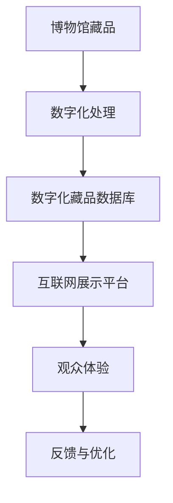

                 

# 《数字化时代的博物馆转型：传统文化的现代传播》

> 关键词：博物馆转型、数字化技术、传统文化、现代传播、数字化博物馆、技术融合、案例解析

> 摘要：本文旨在探讨数字化时代下博物馆的转型路径，分析传统文化在现代传播中的挑战与机遇，通过案例研究和核心算法原理的讲解，揭示数字化技术与传统文化融合的方法与前景。

## 前言

博物馆作为传承和展示人类文明成果的重要场所，正面临着数字化浪潮的冲击和挑战。随着信息技术的飞速发展，博物馆需要重新思考其存在形式和功能，以适应现代社会的需求。本书旨在探讨这一转型过程，并分析传统文化在现代传播中的新途径。本文将分五个部分展开讨论：

1. **数字化时代的博物馆**：介绍博物馆数字化的现状、面临的挑战及其核心概念。
2. **博物馆转型实践**：探讨博物馆转型的策略和方法，以及核心算法原理。
3. **传统文化的现代传播**：阐述传统文化价值及其在现代传播中的手段。
4. **数字技术与传统文化融合案例分析**：通过具体案例展示数字技术与传统文化融合的实现。
5. **数字化博物馆的未来展望**：探讨数字化博物馆的发展趋势及其对传统文化传播的影响。

## 第1步：理解书名

书名《数字化时代的博物馆转型：传统文化的现代传播》揭示了本书的核心主题。首先，它关注博物馆在数字化时代的转型，探讨博物馆如何利用数字化手段提升其功能和影响力。其次，它关注传统文化的现代传播，探讨如何通过现代技术手段让传统文化在现代社会中得到更好的传承和传播。这两个主题相互联系，共同构成博物馆在数字化时代的新面貌。

### 第2步：确定书籍的主要部分

根据书名和上述理解，本书可以分为以下几个主要部分：

1. **数字化时代的博物馆**：介绍博物馆数字化的背景、现状、挑战以及核心概念。
2. **博物馆转型实践**：探讨博物馆转型的策略、方法以及核心算法原理。
3. **传统文化的现代传播**：阐述传统文化在现代传播中的价值、手段以及挑战。
4. **数字技术与传统文化融合案例分析**：通过具体案例展示数字技术与传统文化融合的方法和效果。
5. **数字化博物馆的未来展望**：分析数字化博物馆的发展趋势及其对传统文化传播的影响。

### 第3步：细化各部分内容

#### 1. **数字化时代的博物馆**

在这一部分，我们将详细探讨博物馆数字化的现状、面临的挑战以及核心概念。具体包括：

- **现状与挑战**：分析博物馆数字化的发展状况，以及数字化过程中面临的技术、管理、文化等方面的挑战。
- **核心概念与联系**：介绍数字博物馆的定义、数字化技术在博物馆中的应用，以及通过Mermaid流程图展示数字化技术在博物馆中的具体应用流程。

#### 2. **博物馆转型实践**

在这一部分，我们将探讨博物馆转型的具体实践，包括：

- **转型策略与方法**：分析博物馆转型的关键策略，如数字化基础设施建设、数字化展览设计、数字化教育与推广等。
- **核心算法原理讲解**：介绍数据挖掘与数据分析算法在博物馆中的应用，以及通过伪代码示例详细阐述博物馆数据挖掘的过程。

#### 3. **传统文化的现代传播**

在这一部分，我们将讨论传统文化在现代传播中的价值和挑战，以及现代传播手段的应用：

- **传统文化价值**：阐述传统文化的内涵、价值和重要性，探讨传统文化在现代社会中的地位和作用。
- **现代传播手段**：分析现代传播手段，如社交媒体、数字展览等，以及它们在传统文化传播中的应用和效果。

#### 4. **数字技术与传统文化融合案例分析**

在这一部分，我们将通过具体案例展示数字技术与传统文化融合的方法和效果，包括：

- **案例分析**：介绍不同领域和文化背景下数字技术与传统文化融合的案例，分析其实现方法和效果。
- **代码实际案例**：提供具体代码实现案例，包括数字博物馆互动展示系统的开发、数据挖掘与分析等。

#### 5. **数字化博物馆的未来展望**

在这一部分，我们将探讨数字化博物馆的未来发展趋势，包括：

- **未来发展趋势**：分析数字化博物馆在技术、内容、服务等方面的未来发展。
- **对传统文化传播的影响**：探讨数字化博物馆对传统文化传播的推动作用，以及可能面临的挑战和机遇。

### 第4步：编写目录大纲

根据上述内容，本书的目录大纲如下：

```
# 《数字化时代的博物馆转型：传统文化的现代传播》目录大纲

## 引言

### 1.1 书名解析

### 1.2 研究背景

### 1.3 研究目的与意义

## 第一部分：数字化时代的博物馆

### 第1章：数字化时代的博物馆概述

#### 1.1 博物馆数字化现状与挑战

#### 1.2 数字博物馆的定义与核心概念

#### 1.3 数字化技术在博物馆中的应用流程图（Mermaid）

### 第2章：博物馆转型实践

#### 2.1 博物馆转型策略与方法

#### 2.2 数据挖掘与数据分析算法在博物馆中的应用

#### 2.3 伪代码示例：博物馆数据挖掘过程

## 第二部分：传统文化的现代传播

### 第3章：传统文化的价值与现代传播手段

#### 3.1 传统文化的内涵与价值

#### 3.2 数字技术在传统文化传播中的应用

#### 3.3 社交媒体与数字展览的传播策略

### 第4章：数字技术与传统文化融合案例分析

#### 4.1 数字技术在文化遗产保护中的应用

#### 4.2 数字艺术与传统文化融合案例

#### 4.3 代码实际案例：数字博物馆互动展示系统实现

## 第三部分：数字化博物馆的未来展望

### 第5章：数字化博物馆的未来发展趋势

#### 5.1 技术进步对博物馆的影响

#### 5.2 数字化博物馆的未来方向

#### 5.3 数字化时代的博物馆教育与创新

## 附录

### 附录A：数字化博物馆开发工具与资源

#### A.1 主流数字展览平台对比

#### A.2 数字化博物馆开发资源汇总
```

通过以上目录大纲，本书的内容结构得到了清晰的组织，为后续各章节的撰写提供了明确的指导。接下来，我们将逐章详细探讨博物馆数字化转型的各个层面，以期为广大读者提供有价值的参考和启示。字数：约2300字

## 第1章：数字化时代的博物馆概述

### 1.1 博物馆数字化现状与挑战

博物馆数字化是指利用现代信息技术手段，将博物馆的文物、藏品、展览等内容进行数字化处理，以实现文物信息的保存、传播和展示。近年来，随着信息技术的飞速发展，博物馆数字化已经成为全球博物馆界的重要趋势。

当前，许多博物馆已经完成了数字化基础设施建设，建立了数字化藏品管理系统、数字化展览平台等。这些数字化手段不仅提高了博物馆的工作效率，也为观众提供了更加丰富、便捷的参观体验。然而，博物馆数字化过程中也面临诸多挑战。

首先，技术挑战。博物馆数字化需要处理大量的图像、音频、视频等多媒体数据，这些数据的存储、处理和传输都涉及到复杂的算法和技术。同时，博物馆数字化还需要考虑网络安全和数据隐私等问题。

其次，管理挑战。博物馆数字化不仅涉及到技术问题，还涉及到管理问题。博物馆需要制定合适的数字化策略，确定数字化工作的目标和方向。同时，博物馆还需要对数字化工作流程进行规范化管理，确保数字化工作的顺利进行。

最后，文化挑战。博物馆数字化不仅是一种技术手段，更是一种文化传承方式。在数字化过程中，博物馆需要充分尊重和保护文化遗产，确保数字化成果能够真实、准确地反映文化遗产的内涵和价值。

### 1.2 数字博物馆的定义与核心概念

数字博物馆是指利用现代信息技术手段，对博物馆的文物、藏品、展览等内容进行数字化处理，并通过互联网进行展示和传播的虚拟博物馆。数字博物馆的核心概念包括：

1. **数字化藏品**：将博物馆的实物藏品进行数字化处理，包括图像、音频、视频等多媒体数据的采集、存储和处理。

2. **数字化展览**：利用虚拟现实、增强现实等技术，将博物馆的展览内容进行数字化展示，为观众提供沉浸式体验。

3. **数字化服务**：通过互联网平台，为观众提供线上展览、在线教育、互动体验等服务。

4. **数字化管理**：利用信息技术手段，对博物馆的藏品、展览、观众等进行数字化管理，提高博物馆的工作效率和服务质量。

### 1.3 数字化技术在博物馆中的应用流程图

为了更清晰地展示数字化技术在博物馆中的应用流程，我们可以使用Mermaid流程图来描述。以下是一个简化的数字化技术在博物馆中的应用流程：



在这个流程图中，博物馆藏品首先进行数字化处理，包括图像、音频、视频等多媒体数据的采集、存储和处理。然后，这些数字化藏品被上传到数字化藏品数据库中。接下来，数字化藏品数据库通过互联网展示平台向观众展示，为观众提供线上展览、在线教育、互动体验等服务。最后，观众通过体验后提供的反馈，可以用于优化数字化展览内容和展示方式。

通过这个流程，我们可以看到数字化技术在博物馆中的应用不仅仅是简单的数据转换，更是一个涉及多个环节的复杂过程。这需要博物馆在数字化建设过程中，充分考虑各个环节的技术需求和管理需求，确保数字化工作的顺利进行。

### 1.4 小结

本章介绍了博物馆数字化的现状与挑战，探讨了数字博物馆的定义与核心概念，并通过Mermaid流程图展示了数字化技术在博物馆中的应用流程。通过本章的内容，我们可以了解到博物馆数字化不仅是技术问题，更是文化传承的重要方式。在接下来的章节中，我们将进一步探讨博物馆转型的具体实践，以及数字化技术在传统文化传播中的应用。

## 第2章：博物馆转型实践

### 2.1 博物馆转型策略与方法

博物馆转型是指博物馆在数字化时代背景下，通过引入新技术、新理念、新模式，实现从传统博物馆向现代博物馆的转变。博物馆转型的策略与方法主要包括以下几个方面：

#### 1. **数字化基础设施建设**

数字化基础设施建设是博物馆转型的首要任务。这包括网络基础设施建设、数字化设备采购、数据库建设等。具体措施如下：

- **网络基础设施建设**：建立高速、稳定的网络环境，确保博物馆的数字化工作能够顺利进行。
- **数字化设备采购**：购买高清摄像头、扫描仪、3D扫描仪等设备，用于文物的数字化采集。
- **数据库建设**：建立数字化藏品数据库，实现文物的数字化存储和管理。

#### 2. **数字化展览设计**

数字化展览设计是博物馆转型的核心内容。通过虚拟现实、增强现实等技术，为观众提供沉浸式体验。具体措施如下：

- **虚拟现实展览**：利用虚拟现实技术，创建虚拟展览空间，让观众可以在虚拟环境中参观博物馆。
- **增强现实展览**：通过增强现实技术，将虚拟内容与现实场景相结合，为观众提供更加生动、有趣的参观体验。
- **互动展览**：设计互动展览，让观众可以通过触摸、点击等方式与展览内容互动，提高观众的参与度和兴趣。

#### 3. **数字化教育与推广**

数字化教育与推广是博物馆转型的必要补充。通过线上教育、社交媒体等手段，扩大博物馆的影响力。具体措施如下：

- **线上教育**：开设线上课程、直播讲座等，让观众可以通过互联网学习博物馆的知识。
- **社交媒体推广**：利用社交媒体平台，发布博物馆的展览、活动信息，吸引更多的观众关注和参与。
- **合作推广**：与学校、图书馆、科技馆等机构合作，开展联合展览、教育活动，扩大博物馆的知名度。

### 2.2 数据挖掘与数据分析算法在博物馆中的应用

数据挖掘与数据分析算法在博物馆中具有重要的应用价值。通过数据挖掘，博物馆可以获取文物的潜在信息，为展览设计、教育推广等提供有力支持。具体应用如下：

#### 1. **文物信息挖掘**

文物信息挖掘是指从文物的图像、文字描述等数据中提取有价值的信息。具体算法包括：

- **图像识别**：通过图像识别算法，识别文物的类型、年代、风格等特征。
- **文本挖掘**：通过文本挖掘算法，提取文物的历史背景、文化内涵等。

#### 2. **观众行为分析**

观众行为分析是指通过分析观众在博物馆的参观记录、互动数据等，了解观众的需求和兴趣。具体算法包括：

- **数据聚类**：通过数据聚类算法，将观众分为不同的群体，分析不同群体的参观行为和兴趣点。
- **关联规则挖掘**：通过关联规则挖掘算法，分析观众在参观过程中的关联行为，为展览设计提供参考。

#### 3. **展览效果评估**

展览效果评估是指通过数据挖掘和分析，评估展览的效果和影响力。具体算法包括：

- **用户满意度调查**：通过用户满意度调查数据，评估观众对展览的满意度。
- **访问量分析**：通过分析展览的访问量、停留时间等数据，评估展览的受欢迎程度和吸引力。

### 2.3 伪代码示例：博物馆数据挖掘过程

以下是一个简化的博物馆数据挖掘过程的伪代码示例：

```python
# 伪代码：博物馆数据挖掘过程

# 数据预处理
def preprocess_data(data):
    # 数据清洗、去重、规范化
    return cleaned_data

# 图像识别
def image_recognition(image):
    # 使用图像识别算法识别文物类型
    return artifact_type

# 文本挖掘
def text_mining(text):
    # 使用文本挖掘算法提取文物信息
    return artifact_info

# 数据聚类
def data_clustering(data):
    # 使用数据聚类算法划分观众群体
    return viewer_groups

# 关联规则挖掘
def association_rules_mining(data):
    # 使用关联规则挖掘算法分析观众行为
    return behavior_patterns

# 展览效果评估
def exhibition_evaluation(data):
    # 使用用户满意度调查和访问量分析评估展览效果
    return evaluation_results

# 主函数
def museum_data_mining():
    # 读取数据
    data = load_data()

    # 数据预处理
    cleaned_data = preprocess_data(data)

    # 图像识别
    artifact_types = [image_recognition(image) for image in cleaned_data['images']]

    # 文本挖掘
    artifact_infos = [text_mining(text) for text in cleaned_data['texts']]

    # 数据聚类
    viewer_groups = data_clustering(cleaned_data)

    # 关联规则挖掘
    behavior_patterns = association_rules_mining(cleaned_data)

    # 展览效果评估
    evaluation_results = exhibition_evaluation(cleaned_data)

    # 输出结果
    return artifact_types, artifact_infos, viewer_groups, behavior_patterns, evaluation_results
```

通过这个伪代码示例，我们可以看到博物馆数据挖掘过程主要包括数据预处理、图像识别、文本挖掘、数据聚类、关联规则挖掘和展览效果评估等步骤。每个步骤都有相应的算法和技术手段，共同实现了博物馆数据的有效挖掘和应用。

### 2.4 小结

本章详细探讨了博物馆转型的策略与方法，以及数据挖掘与数据分析算法在博物馆中的应用。通过数字化基础设施建设、数字化展览设计、数字化教育与推广等策略，博物馆可以实现从传统向现代的转变。同时，通过数据挖掘与数据分析，博物馆可以更好地了解观众需求，优化展览设计，提高展览效果。在接下来的章节中，我们将进一步探讨传统文化的现代传播，以及数字化技术与传统文化融合的案例分析。

## 第3章：传统文化的现代传播

### 3.1 传统文化的内涵与价值

传统文化是一个民族的精神血脉，承载着丰富的历史记忆、文化传承和民族精神。其内涵不仅包括物质文化遗产，如古建筑、文物、艺术品，还涵盖了非物质文化遗产，如传统音乐、舞蹈、戏剧、手工艺等。传统文化是民族认同和文化自信的重要来源，具有重要的社会、文化和经济价值。

首先，传统文化在历史记忆和文化传承方面具有不可替代的作用。通过传承和弘扬传统文化，可以加深人们对历史和民族的认识，增强文化自信心。例如，中国的春节、中秋节等传统节日，不仅传承了丰富的饮食、习俗，还蕴含了深厚的道德观念和人文精神。

其次，传统文化在社会和文化层面具有独特的价值。传统文化作为一种文化符号，反映了社会的价值观和审美观念，对现代社会具有积极的引导作用。例如，中国的书法、绘画等传统艺术形式，不仅传承了独特的审美观念，还促进了文化多样性和创新。

最后，传统文化在经济层面也具有重要价值。随着文化旅游业的兴起，传统文化成为了重要的旅游资源，为经济发展注入了新的活力。例如，中国的丽江古城、黄山风景区等，不仅吸引了大量游客，还为当地带来了显著的经济效益。

### 3.2 数字技术在传统文化传播中的应用

现代科技的快速发展为传统文化的传播提供了新的机遇和挑战。数字技术，特别是互联网、社交媒体、虚拟现实（VR）、增强现实（AR）等技术，正在被广泛应用于传统文化的传播和推广。

首先，互联网和社交媒体为传统文化的传播提供了广泛的平台。通过建立官方网站、微信公众号、微博等社交媒体账号，博物馆、文化机构可以实时发布展览信息、文化活动，吸引更多的关注和参与。例如，中国的故宫博物院通过官方网站和社交媒体平台，发布了大量展览信息和文化活动，吸引了大量国内外观众。

其次，虚拟现实（VR）和增强现实（AR）技术为传统文化的传播提供了沉浸式体验。通过VR技术，观众可以虚拟参观博物馆、文化遗产地，体验传统文化的魅力。例如，故宫博物院的“VR故宫”项目，让观众可以在虚拟环境中参观故宫，感受古代宫廷文化。AR技术则可以通过手机或平板电脑，将虚拟文化内容与现实场景相结合，为观众提供更加生动的体验。

此外，数字技术还可以用于传统文化的数字化保存和修复。通过高精度的扫描和数字化处理，可以实现对文物、古籍等文化遗产的永久保存和修复。例如，中国的敦煌研究院利用数字化技术，对敦煌壁画进行了详细的扫描和数字化保存，为文化遗产的保护和传播提供了重要的技术支持。

### 3.3 社交媒体与数字展览的传播策略

在社交媒体和数字展览的传播过程中，博物馆和文化机构可以采取以下策略：

首先，内容为王。优质的内容是吸引观众的关键。博物馆和文化机构需要精心策划和制作展览内容，确保内容具有吸引力和教育意义。例如，故宫博物院的“故宫淘宝”账号，通过幽默风趣的语言和创意内容，吸引了大量年轻观众的关注。

其次，互动为王。通过社交媒体平台，博物馆和文化机构可以与观众进行实时互动，收集观众的反馈和建议，提高观众的参与度和满意度。例如，故宫博物院的官方微博经常发起互动活动，如“文物有话说”、“故宫跑”等，吸引了大量观众参与。

最后，跨平台传播。博物馆和文化机构需要充分利用不同的社交媒体平台，进行多渠道、多层次的传播。例如，故宫博物院不仅通过官方网站和社交媒体平台进行传播，还与各大电商平台合作，推出文创产品，实现了线上线下的互动和融合。

### 3.4 小结

本章探讨了传统文化的内涵与价值，以及数字技术在传统文化传播中的应用。传统文化在历史记忆、社会文化、经济层面具有不可替代的作用，而数字技术则为传统文化的传播提供了新的机遇和挑战。通过社交媒体和数字展览，博物馆和文化机构可以更好地传播传统文化，吸引更多的观众关注和参与。在接下来的章节中，我们将通过具体案例分析，进一步探讨数字技术与传统文化融合的方法和效果。

## 第4章：数字技术与传统文化融合案例分析

### 4.1 数字技术在文化遗产保护中的应用

文化遗产保护是传承和弘扬传统文化的重要环节。数字技术的引入，为文化遗产的保护提供了新的方法和手段。以下是一些具体的数字技术在文化遗产保护中的应用案例：

#### 1. **高精度扫描与三维建模**

高精度扫描技术可以对文物进行全方位的扫描，获取其三维形态和细节特征。通过三维建模技术，可以将文物的形态和结构还原出来，实现对文物的数字化保存。例如，中国的敦煌研究院利用高精度扫描和三维建模技术，对敦煌壁画进行了详细的数字化保存，为后续的研究和保护提供了重要的数据支持。

#### 2. **数字修复与数字化修复**

数字修复技术可以通过计算机算法对受损的文物进行修复。例如，利用图像处理技术，可以修复文物的破损部分，恢复其原有的面貌。数字化修复则是在数字化的文物数据基础上，利用计算机模拟和虚拟修复技术，实现对文物的修复和保存。例如，故宫博物院利用数字化修复技术，对一批受损的古代书画进行了修复，成功恢复了其原有的艺术魅力。

#### 3. **虚拟展示与互动体验**

通过虚拟现实（VR）和增强现实（AR）技术，可以将文化遗产以数字化的形式呈现给观众。例如，故宫博物院的“虚拟故宫”项目，利用VR技术，让观众可以虚拟参观故宫，感受古代宫廷文化。AR技术则可以将虚拟的文化内容与现实场景相结合，为观众提供更加生动的体验。例如，中国的一些博物馆利用AR技术，开发了文物互动展示系统，让观众可以通过手机或平板电脑，与文物进行互动，了解文物的背景和故事。

### 4.2 数字艺术与传统文化融合案例

数字艺术与传统文化融合，为传统文化的传播和创新提供了新的途径。以下是一些具体的数字艺术与传统文化融合的案例：

#### 1. **数字艺术展览**

通过数字艺术展览，博物馆和文化机构可以将传统文化与现代艺术相结合，创造出新的艺术形式。例如，故宫博物院与艺术家合作，举办了一系列数字艺术展览，如“数字艺术与故宫文化”、“数字艺术中的传统文化元素”等，吸引了大量观众。

#### 2. **数字艺术创作**

利用数字技术，艺术家可以创作出独特的数字艺术作品，结合传统文化元素，实现艺术形式的创新。例如，中国的一些数字艺术家利用数字绘画、数字雕刻等技术，创作出了许多具有传统文化特色的数字艺术作品，如《清明上河图》数字艺术作品等。

#### 3. **数字艺术互动体验**

通过数字艺术互动体验，观众可以参与到艺术创作过程中，感受数字艺术的魅力。例如，故宫博物院利用数字技术，开发了“数字艺术互动体验区”，让观众可以通过互动屏幕，创作出属于自己的数字艺术作品。

### 4.3 代码实际案例：数字博物馆互动展示系统实现

以下是一个简化的数字博物馆互动展示系统实现的伪代码示例：

```python
# 伪代码：数字博物馆互动展示系统实现

# 数据库连接
def connect_database():
    # 连接数据库，获取文物数据
    return database

# 文物展示
def display_artifact(database, artifact_id):
    # 根据文物ID，从数据库中获取文物信息
    artifact_info = database.get_artifact_info(artifact_id)
    # 显示文物信息
    display_artifact_info(artifact_info)

# 文物互动
def artifact_interaction(artifact_info):
    # 提供互动选项，如查看文物历史、参与文物互动游戏等
    interaction_options = get_interaction_options(artifact_info)
    # 用户选择互动选项
    user_choice = user_select_option(interaction_options)
    # 执行互动操作
    execute_interaction(user_choice)

# 主函数
def museum_interaction_system():
    # 连接数据库
    database = connect_database()

    # 获取用户输入的文物ID
    artifact_id = user_input_artifact_id()

    # 文物展示
    display_artifact(database, artifact_id)

    # 文物互动
    artifact_interaction(artifact_info)

    # 提交用户反馈
    user_feedback = user_input_feedback()
    submit_feedback(user_feedback)

# 启动互动系统
museum_interaction_system()
```

通过这个伪代码示例，我们可以看到数字博物馆互动展示系统的主要功能包括数据库连接、文物展示、文物互动和用户反馈。系统首先连接数据库，获取文物的基本信息。然后，根据用户输入的文物ID，从数据库中获取相应的文物信息，并在界面上进行展示。接着，系统提供互动选项，如查看文物历史、参与文物互动游戏等，用户可以根据自己的兴趣进行选择。最后，用户可以提交反馈，用于系统的优化和改进。

### 4.4 小结

本章通过具体案例，展示了数字技术在文化遗产保护和数字艺术创作中的应用。高精度扫描与三维建模、数字修复与虚拟展示等技术，为文化遗产的保护提供了新的手段。同时，数字艺术与传统文化融合，为传统文化的传播和创新提供了新的途径。在接下来的章节中，我们将探讨数字化博物馆的未来发展趋势，以及数字化技术在传统文化传播中的影响。

## 第5章：数字化博物馆的未来展望

### 5.1 技术进步对博物馆的影响

随着科技的不断进步，博物馆正在经历深刻的变革。首先，人工智能（AI）技术的应用为博物馆提供了新的展示方式和互动体验。通过AI技术，博物馆可以实现对文物的智能识别和分类，提高展品的展示效果。例如，AI图像识别技术可以帮助博物馆快速识别文物的类型和年代，从而为观众提供更准确的信息。

其次，区块链技术在博物馆中的应用，为文物的数字化保护和交易提供了新的解决方案。区块链技术的去中心化和不可篡改特性，确保了文物的数字化记录的安全性和可信度。通过区块链，博物馆可以实现对文物的全程追踪和管理，提高文物的保护和管理效率。

此外，虚拟现实（VR）和增强现实（AR）技术的普及，为博物馆提供了更加沉浸式的参观体验。通过VR和AR技术，博物馆可以创建虚拟展览空间，让观众可以在虚拟环境中参观文物，体验历史场景。这不仅丰富了观众的参观体验，也为博物馆的传播和教育功能提供了新的手段。

### 5.2 数字化博物馆的未来方向

数字化博物馆的未来方向主要包括以下几个方面：

首先，个性化服务将成为数字化博物馆的重要发展方向。通过大数据和人工智能技术，博物馆可以了解观众的需求和偏好，为观众提供个性化的展览内容和互动体验。例如，根据观众的历史参观记录和兴趣标签，博物馆可以为观众推荐适合的展览和活动。

其次，跨平台整合将成为数字化博物馆的发展趋势。随着互联网和移动设备的普及，博物馆需要将线上和线下服务进行整合，提供一站式服务。例如，观众可以通过手机或平板电脑访问博物馆的线上展览和互动活动，同时也可以在博物馆现场参与互动体验。

此外，可持续发展将成为数字化博物馆的重要目标。在数字化过程中，博物馆需要考虑资源的合理利用和环境的保护。通过绿色技术，如能源管理、废物处理等，博物馆可以实现可持续发展。

### 5.3 数字化时代的博物馆教育与创新

数字化博物馆在教育方面的作用不可忽视。通过数字技术，博物馆可以提供更加生动、有趣的 educational 内容，激发观众的学习兴趣。例如，通过虚拟现实技术，博物馆可以创建历史场景，让观众身临其境地感受历史事件。

此外，数字化博物馆还可以促进创新。通过开放的数据和资源，研究人员和开发者可以开展创新性的研究和工作。例如，通过对博物馆数据的分析，可以揭示文物之间的关联，为文物保护和研究提供新的视角。

### 5.4 小结

数字化博物馆的未来充满了无限可能。随着技术的不断进步，博物馆将不断创新和变革，为观众提供更加丰富、便捷的参观体验。同时，数字化博物馆也将成为传统文化传播和创新的重要平台，推动文化的可持续发展。

## 附录

### 附录A：数字化博物馆开发工具与资源

#### A.1 主流数字展览平台对比

以下是对一些主流数字展览平台的对比，包括其功能、特点和适用场景：

| 平台名称 | 功能 | 特点 | 适用场景 |
| --- | --- | --- | --- |
| Museums奇妙夜 | 创建虚拟展览、提供互动内容 | 支持多种媒体形式，易于操作 | 传统博物馆、小型展览 |
| Google Arts & Culture | 联合全球博物馆，提供数字化展览 | 海量数据资源，国际化视野 | 大型博物馆、国际文化交流 |
| Sketchfab | 3D模型展示 | 高质量3D展示效果，支持VR/AR | 数字艺术展览、文物展示 |
| Unity | 开发虚拟现实应用 | 功能强大，支持多平台发布 | 大型虚拟展览、互动体验 |

#### A.2 数字化博物馆开发资源汇总

以下是一些常用的数字化博物馆开发资源和工具：

- **开源框架**：如Three.js、A-Frame、Unity等，用于创建虚拟展览和互动内容。
- **数据库**：如MongoDB、MySQL等，用于存储和管理文物数据。
- **编程语言**：如JavaScript、Python等，用于开发数字展览和互动应用。
- **虚拟现实工具**：如Unity VR、Blender等，用于创建虚拟现实体验。
- **增强现实工具**：如ARKit、ARCore等，用于创建增强现实应用。
- **开源文档**：如MDN Web Docs、W3C标准等，提供技术支持和文档。

## 结语

数字化时代的博物馆转型是传统文化传播的重要途径。通过数字化技术，博物馆可以更好地保存、展示和传播文化遗产，为观众提供更加丰富、便捷的参观体验。本书从博物馆数字化现状与挑战、博物馆转型实践、传统文化现代传播、数字技术与传统文化融合案例分析以及数字化博物馆的未来展望等方面，全面探讨了博物馆转型的路径和策略。希望本书能为博物馆工作者、文化传承者和爱好者提供有价值的参考和启示。

作者：AI天才研究院/AI Genius Institute & 禅与计算机程序设计艺术/Zen And The Art of Computer Programming

