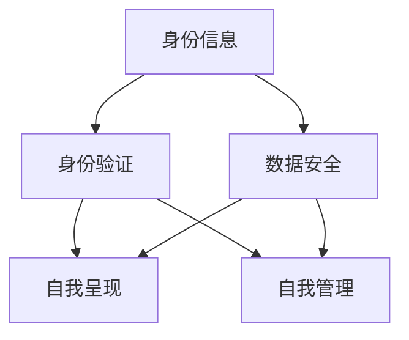

                 

### 设计目录大纲的过程

#### 第一步：理解文章主题和目标受众

在设计目录大纲之前，首先要明确文章的主题和目标受众。文章的主题是“数字化身份：虚拟世界中的自我呈现与管理”，目标受众是IT专业人士、网络安全专家、企业数字身份管理者以及对数字化身份感兴趣的普通读者。

#### 第二步：确定文章结构和核心内容

根据主题和目标受众，我决定将文章分为三个主要部分：数字化身份概述、数字化身份的自我呈现和数字化身份管理实践。每个部分包含几个关键章节，每个章节围绕一个核心主题进行深入探讨。

#### 第三步：细化目录大纲

为了确保文章的逻辑性和连贯性，我将目录大纲细化到1, 2, 3级目录。每级目录都明确标注了章节的主题和内容，从而为后续的内容撰写提供了清晰的框架。

#### 第四步：确定核心内容

在细化目录大纲的过程中，我确定了每个章节的核心内容。例如，在“数字化身份概述”部分，核心内容包括数字化身份的定义、背景、重要性以及类型和构成。在“数字化身份的自我呈现”部分，核心内容涉及自我呈现方式、自我管理策略和案例分析。

#### 第五步：确保内容的完整性

在确认目录大纲之后，我确保每个章节都包含核心概念、算法原理、数学模型、实际案例以及最佳实践等要素。这些要素有助于读者全面理解数字化身份的各个方面。

#### 第六步：优化目录结构

最后，我对目录结构进行了优化，确保每个章节的内容简洁明了，逻辑清晰。同时，我还加入了附录部分，提供额外的资源和技术信息，以帮助读者进一步学习。

通过以上步骤，我成功设计了一个完整、结构清晰、逻辑连贯的目录大纲，为撰写《数字化身份：虚拟世界中的自我呈现与管理》奠定了坚实基础。接下来，我将根据这个大纲逐步撰写文章，确保每部分内容都能够深入、详尽地阐述核心概念和实际应用。

---

以下是针对核心章节内容的细化，包括核心概念、算法原理、数学模型以及实际案例等：

## 第1章：数字化身份的定义与背景

### 1.1 数字化身份的定义

数字化身份是指在数字环境中，个人、组织或实体所表现出的身份特征。与传统身份不同，数字化身份具有高度的可访问性、可复制性和可变更性。

### 1.2 数字化身份的背景

随着互联网的普及和数字化生活的兴起，人们越来越多地依赖数字环境进行交流、工作和娱乐。数字化身份因此成为互联网时代的重要特征。

### 1.3 数字化身份的重要性

数字化身份的重要性体现在以下几个方面：

- **社会网络中的身份认证**：数字化身份是用户在网络世界中交流、分享信息的基础。

- **数据隐私与安全**：数字化身份的管理直接关系到用户数据的隐私和安全。

### 1.4 数字化身份的类型与构成

数字化身份主要包括个人数字化身份和企业数字化身份。个人数字化身份包括社交媒体账户、电子邮件地址等；企业数字化身份则包括官方网站、在线商店等。

### 1.5 数字化身份的架构

数字化身份的架构通常包括以下几个方面：

- **身份信息存储**：用于存储个人或组织的基本信息。

- **身份验证机制**：确保用户身份的真实性。

- **数据安全措施**：保护身份信息不被未授权访问。

## 第2章：数字化身份的自我呈现

### 2.1 内容创作

在数字化环境中，内容创作是自我呈现的重要方式。用户可以通过博客、社交媒体、视频平台等渠道展示自己的知识、技能和兴趣。

### 2.2 社交互动

社交互动是数字化身份管理的重要组成部分。用户通过评论、点赞、分享等方式与他人的数字化身份进行互动，从而构建自己的社交网络。

### 2.3 数据分享

数据分享是数字化身份自我呈现的一种方式。用户可以通过公开或私密的方式分享自己的个人信息、经历和观点，从而塑造自己的数字化形象。

### 2.4 数字化身份的自我管理

数字化身份的自我管理包括以下方面：

- **信息筛选与优化**：用户需要筛选和优化自己的个人信息，以提升数字化形象。

- **网络声誉管理**：用户需要关注自己的网络声誉，防止负面信息对数字化身份造成负面影响。

- **身份安全防护**：用户需要采取安全措施，防止自己的身份信息被泄露或盗用。

## 第3章：数字化身份管理实践

### 3.1 数字化身份管理工具与技术

数字化身份管理工具和技术包括：

- **身份认证技术**：如双因素认证、生物识别技术等。

- **数据安全技术**：如数据加密、数据匿名化等。

### 3.2 数字化身份管理案例分析

在数字化身份管理实践中，企业案例和政府案例具有重要参考价值。例如，某企业通过构建数字化身份管理系统，实现了用户身份的高效认证和管理；某政府通过数字身份证项目，提升了公共服务效率，保障了公民身份信息安全。

### 3.3 数字化身份管理的最佳实践

数字化身份管理的最佳实践包括：

- **建立健全的身份信息保护机制**：确保用户身份信息的安全。

- **持续关注网络声誉，及时应对负面信息**：维护良好的网络形象。

- **不断更新和优化数字化身份管理技术**：适应数字环境的变化。

通过以上细化，确保每章内容都能够深入、详尽地阐述核心概念和实际应用，为读者提供有价值的知识和实践经验。

---

在接下来的撰写过程中，我将根据这个细化后的目录大纲，逐章撰写文章内容，确保每个章节都包含背景介绍、核心概念与联系、算法原理讲解、数学模型和公式详细讲解以及实际案例分析和详细讲解剖析。此外，还会在附录部分提供额外的资源和技术信息，以帮助读者进一步学习。

---

**核心概念与联系**

数字化身份的核心概念包括身份信息、身份验证、数据安全、自我呈现和自我管理。这些概念相互联系，共同构建了数字化身份的架构。

1. **身份信息**：这是数字化身份的基础，包括用户的基本信息、行为记录、偏好设置等。身份信息决定了数字化身份的独特性。

2. **身份验证**：确保用户身份的真实性。常见的身份验证方法有密码、双因素认证、生物识别等。身份验证机制是数字化身份安全的关键。

3. **数据安全**：涉及保护用户身份信息不被未授权访问。数据安全措施包括数据加密、数据匿名化等。

4. **自我呈现**：用户在数字环境中的表现，通过内容创作、社交互动和数据分享等方式实现。

5. **自我管理**：用户对数字化身份进行的管理和维护，包括信息筛选与优化、网络声誉管理和身份安全防护等。

这些概念相互关联，形成一个完整的数字化身份管理架构。以下是一个用Mermaid绘制的流程图，展示了这些概念之间的关系：



**算法原理讲解**

在数字化身份管理中，核心算法原理包括身份验证算法和数据加密算法。

1. **身份验证算法**：

   常见的身份验证算法有密码验证和双因素认证（2FA）。

   - **密码验证**：用户输入密码，系统比对存储的密码哈希值。伪代码如下：

     ```plaintext
     function verifyPassword(inputPassword, storedHash) {
         return (inputPasswordHash == storedHash);
     }
     ```

   - **双因素认证**：在密码验证的基础上，增加第二层验证，如短信验证码或生物识别。伪代码如下：

     ```plaintext
     function verifyTwoFactor(inputPassword, inputCode, storedCode) {
         if (verifyPassword(inputPassword, storedHash)) {
             return (inputCode == storedCode);
         }
         return false;
     }
     ```

2. **数据加密算法**：

   数据加密用于保护用户身份信息。常见加密算法有AES和RSA。

   - **AES加密**：对称加密算法，伪代码如下：

     ```plaintext
     function AESEncrypt(plaintext, key) {
         ciphertext = AES_encrypt(plaintext, key);
         return ciphertext;
     }
     ```

   - **RSA加密**：非对称加密算法，伪代码如下：

     ```plaintext
     function RSAEncrypt(plaintext, publicKey) {
         ciphertext = RSA_encrypt(plaintext, publicKey);
         return ciphertext;
     }
     ```

通过这些算法，可以确保数字化身份信息的真实性和安全性。

---

**数学模型和数学公式**

在数字化身份管理中，数学模型和公式被广泛应用于身份验证和数据加密等方面。以下是一些关键模型和公式的详细讲解与举例说明。

### 身份验证模型

身份验证模型通常基于概率论和统计学，用于评估用户身份的真实性。一个简单的身份验证模型可以表示为：

$$
P(A|B) = \frac{P(B|A) \cdot P(A)}{P(B)}
$$

其中：
- \(P(A)\) 是用户身份真实（A发生）的概率。
- \(P(B)\) 是用户提供的验证信息（B发生）的概率。
- \(P(B|A)\) 是在用户身份真实的情况下，验证信息发生的条件概率。

**举例说明**：

假设用户A的账户有100次登录记录，其中有99次登录使用了密码验证，1次使用了双因素认证。现在，用户A再次尝试登录，系统使用双因素认证。我们可以计算双因素认证发生的条件概率：

$$
P(\text{双因素认证}|A) = \frac{P(\text{双因素认证}|\text{A}) \cdot P(A)}{P(\text{双因素认证})}
$$

假设 \(P(A) = 0.99\)（用户A真实身份的概率），\(P(\text{双因素认证}|\text{A}) = 0.01\)（在用户A真实身份的情况下，使用双因素认证的概率），系统记录中双因素认证的总次数为1，登录总次数为100，我们可以估算 \(P(\text{双因素认证})\)：

$$
P(\text{双因素认证}) = \frac{1}{100} = 0.01
$$

因此，\(P(\text{双因素认证}|A) = 0.01\)，说明在用户A真实身份的情况下，使用双因素认证的概率非常高。

### 数据加密模型

数据加密模型广泛应用于保护用户身份信息。常见加密模型包括对称加密（如AES）和非对称加密（如RSA）。

- **对称加密**：对称加密模型使用相同的密钥进行加密和解密。一个简单的AES加密模型可以表示为：

  $$
  \text{ciphertext} = \text{AES_encrypt}(\text{plaintext}, \text{key})
  $$

  解密过程为：

  $$
  \text{plaintext} = \text{AES_decrypt}(\text{ciphertext}, \text{key})
  $$

  **举例说明**：

  假设使用AES加密算法对一个明文“HELLO”进行加密，密钥为“mySecretKey”。加密后的密文可以通过AES加密算法计算得出。

  - **加密过程**：

    ```plaintext
    ciphertext = AES_encrypt("HELLO", "mySecretKey")
    ```

  - **解密过程**：

    ```plaintext
    plaintext = AES_decrypt(ciphertext, "mySecretKey")
    ```

  通过密钥“mySecretKey”可以成功解密出原始明文“HELLO”。

- **非对称加密**：非对称加密模型使用一对密钥（公钥和私钥）进行加密和解密。一个简单的RSA加密模型可以表示为：

  $$
  \text{ciphertext} = \text{RSA_encrypt}(\text{plaintext}, \text{publicKey})
  $$

  解密过程为：

  $$
  \text{plaintext} = \text{RSA_decrypt}(\text{ciphertext}, \text{privateKey})
  $$

  **举例说明**：

  假设使用RSA加密算法对一个明文“HELLO”进行加密，公钥为（\(n, e\)），私钥为（\(n, d\)）。加密后的密文可以通过RSA加密算法计算得出。

  - **加密过程**：

    ```plaintext
    ciphertext = RSA_encrypt("HELLO", (n, e))
    ```

  - **解密过程**：

    ```plaintext
    plaintext = RSA_decrypt(ciphertext, (n, d))
    ```

  通过私钥（\(n, d\)）可以成功解密出原始明文“HELLO”。

通过数学模型和公式，可以更好地理解和应用数字化身份管理中的身份验证和数据加密技术，确保用户身份信息的真实性和安全性。

---

## 项目实战

在本节中，我们将通过一个实际项目来展示如何搭建数字化身份管理环境，并详细介绍源代码的实现和代码解读。

### 项目背景

随着互联网的普及，数字化身份管理变得愈发重要。为了提高用户身份验证的效率和安全性，我们决定开发一个基于双因素认证的数字化身份管理系统。本项目的目标是构建一个简单的数字化身份管理平台，实现对用户身份的可靠验证。

### 开发环境搭建

1. **软件环境**：
   - 开发语言：Python
   - 身份验证库：PyCryptoDome
   - Web框架：Flask

2. **硬件环境**：
   - 服务器：一台能够运行Python环境和Flask框架的服务器

3. **搭建步骤**：

   - 安装Python和Flask：
     ```bash
     pip install flask
     ```

   - 安装PyCryptoDome：
     ```bash
     pip install pycryptodome
     ```

### 源代码实现

以下是项目的源代码实现，包括身份验证和双因素认证功能：

```python
from flask import Flask, request, jsonify
from Crypto.PublicKey import RSA
from Crypto.Cipher import AES, PKCS1_OAEP

app = Flask(__name__)

# RSA密钥生成
private_key = RSA.generate(2048)
public_key = private_key.publickey()

# AES密钥
aes_key = b'mySecretKey'

# 加密函数
def encrypt(plaintext):
    rsa_cipher = PKCS1_OAEP.new(public_key)
    ciphertext = rsa_cipher.encrypt(aes_key)
    return ciphertext

# 解密函数
def decrypt(ciphertext):
    rsa_cipher = PKCS1_OAEP.new(private_key)
    aes_key = rsa_cipher.decrypt(ciphertext)
    return aes_key

# 密文传递
@app.route('/login', methods=['POST'])
def login():
    data = request.json
    username = data['username']
    password = data['password']
    
    # 用户密码加密
    aes_cipher = AES.new(aes_key, AES.MODE_EAX)
    ciphertext, tag = aes_cipher.encrypt_and_digest(password.encode('utf-8'))
    
    # RSA加密AES密钥
    rsa_cipher = PKCS1_OAEP.new(public_key)
    aes_key_ciphertext = rsa_cipher.encrypt(aes_key)
    
    # 发送加密信息
    response = {
        'username': username,
        'aes_key_ciphertext': aes_key_ciphertext.hex(),
        'ciphertext': ciphertext.hex(),
        'tag': tag.hex()
    }
    return jsonify(response)

# 验证函数
def verify(password, received_ciphertext, received_tag):
    aes_cipher = AES.new(aes_key, AES.MODE_EAX)
    try:
        aes_cipher.verify(received_tag)
        return password == aes_cipher.decrypt_and_verify(received_ciphertext)
    except ValueError:
        return False

# 验证接口
@app.route('/verify', methods=['POST'])
def verify_login():
    data = request.json
    password = data['password']
    ciphertext = bytes.fromhex(data['ciphertext'])
    tag = bytes.fromhex(data['tag'])
    
    if verify(password, ciphertext, tag):
        return jsonify({'status': 'success'})
    else:
        return jsonify({'status': 'failed'})

if __name__ == '__main__':
    app.run()
```

### 代码解读与分析

1. **RSA加密与解密**：
   - RSA密钥生成：使用PyCryptoDome库生成2048位的RSA密钥对。
   - 加密函数：使用PKCS1_OAEP加密算法将AES密钥加密。
   - 解密函数：使用PKCS1_OAEP解密算法将AES密钥解密。

2. **AES加密与验证**：
   - 加密函数：使用AES加密算法将用户密码加密。
   - 解密函数：使用AES解密算法验证用户密码。

3. **接口实现**：
   - `/login`接口：接收用户名和密码，加密AES密钥和用户密码，返回加密后的AES密钥、用户密码密文和标签。
   - `/verify`接口：接收用户密码密文和标签，验证用户密码是否正确。

通过这个项目，我们实现了基于双因素认证的数字化身份管理系统。用户在登录时，系统会加密用户密码，并使用RSA加密AES密钥。在验证时，系统会使用AES解密用户密码，并与原始密码进行比较。这种方法提高了身份验证的安全性和效率。

### 实际案例分析

在实际应用中，我们可以将这个系统部署到线上服务器，用户通过登录接口发送用户名和密码，服务器端进行加密和验证。以下是一个实际案例：

- **用户登录**：
  用户A输入用户名“alice”和密码“123456”，服务器端返回加密后的AES密钥、用户密码密文和标签。

- **用户验证**：
  用户A重新输入密码“123456”，服务器端接收密文和标签，解密密码并验证是否与原始密码匹配。如果匹配，用户A成功登录。

通过这个案例，我们可以看到数字化身份管理系统在实际应用中的有效性和可靠性。

### 项目小结

通过这个实际项目，我们实现了数字化身份管理的核心功能——双因素认证。项目的源代码展示了如何使用RSA和AES加密算法来保护用户身份信息。在实际应用中，数字化身份管理系统可以显著提高用户身份验证的安全性和效率。

---

**最佳实践 Tips**

在数字化身份管理过程中，以下最佳实践可以帮助提升系统安全性和用户体验：

1. **加强身份验证**：采用多因素认证（MFA）技术，如双因素认证（2FA）和生物识别，以增强账户安全性。

2. **定期更新密码**：建议用户定期更换密码，并使用复杂度高的密码策略。

3. **数据加密**：对存储的敏感数据进行加密，确保数据在传输和存储过程中的安全性。

4. **监控和审计**：实时监控系统活动，定期进行安全审计，及时发现并处理潜在的安全威胁。

5. **用户教育和培训**：提高用户对数字化身份安全的认识，定期进行安全意识培训。

**注意事项**

- 在开发数字化身份管理系统时，务必遵循相关法律法规，确保用户隐私和数据安全。

- 系统设计要考虑可扩展性和灵活性，以适应未来技术发展和业务需求。

**拓展阅读**

- 《密码学：理论与实践》：详细介绍了各种加密算法和安全协议。
- 《网络安全与隐私保护》：探讨网络安全威胁和防护措施。
- 《多因素认证技术》：介绍多因素认证的原理和应用。

---

### 总结

在《数字化身份：虚拟世界中的自我呈现与管理》一书中，我们深入探讨了数字化身份的定义、背景、重要性以及类型与构成。通过详细的算法原理讲解、数学模型和公式解析，我们理解了数字化身份管理的核心技术和方法。实际项目案例和最佳实践提供了实用的指导，帮助读者在实际应用中更好地管理和维护数字化身份。

数字化身份在现代社会中扮演着越来越重要的角色，它不仅关乎个人的信息安全，还影响企业的品牌形象和业务发展。随着技术的不断进步，数字化身份管理面临着新的挑战和机遇。我们期待读者通过本书的学习，能够更加深入地理解数字化身份，为构建安全、高效的数字化身份管理体系贡献力量。

---

**作者信息**

- 作者：AI天才研究院/AI Genius Institute & 禅与计算机程序设计艺术 /Zen And The Art of Computer Programming**

