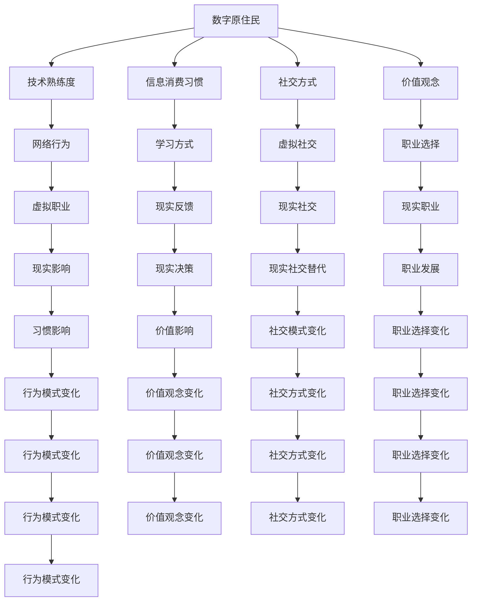
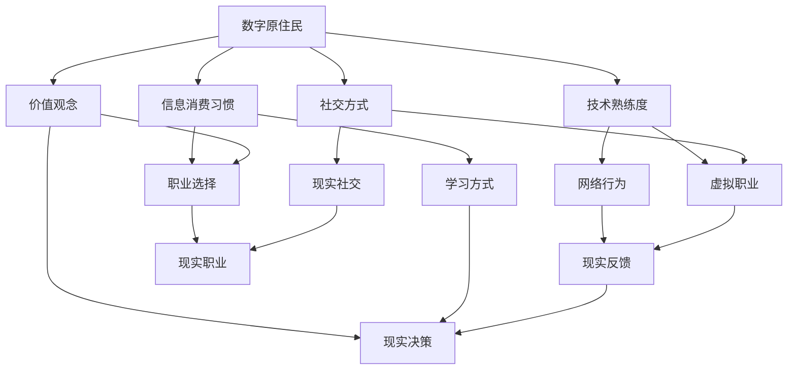

                 

## 文章标题

《数字原住民的精神世界：虚拟与现实交织的新生代价值观》

### 关键词

- 数字原住民
- 精神世界
- 虚拟与现实
- 新生代价值观

### 摘要

本文深入探讨了数字原住民这一新兴群体的精神世界，分析了他们在虚拟与现实世界交织中的价值观及其形成机制。通过文献综述、案例分析及理论模型构建，本文揭示了数字原住民独特的精神追求、行为模式及其对现实世界的影响，为理解新时代的社会发展提供了新的视角。

## 引言

### 数字原住民的定义及其特点

数字原住民（Digital Native）一词最早由美国的马克·P·佩里曼（Mark P. Payne）于1995年提出，指的是那些在互联网环境中成长起来，对数字技术具有与生俱来掌握能力的一代人。他们伴随着互联网的发展而成长，互联网不仅是他们获取信息、交流沟通的途径，更是他们生活和工作的基本平台。

数字原住民具有以下几个显著特点：

1. **技术熟练度**：数字原住民对数字技术具有极高的熟练度，他们能够快速适应和掌握各种数字工具和平台。
2. **信息消费习惯**：他们习惯于通过互联网获取信息，具有较强的信息筛选和处理能力。
3. **社交方式**：数字原住民更倾向于在线社交，他们通过社交媒体、虚拟社区等方式建立人际关系。
4. **价值观念**：与传统的价值观念不同，数字原住民更加注重个性化和自由表达，对权威和规范具有一定的质疑态度。

### 研究背景

随着互联网和数字技术的发展，数字原住民已成为社会发展的重要力量。他们不仅改变了信息传播的方式，也对教育、娱乐、商业等多个领域产生了深远影响。然而，数字原住民的精神世界和价值观念如何影响他们自身以及整个社会，这一问题的研究具有重要的理论和实践意义。

本文旨在通过深入分析数字原住民的精神世界，揭示其价值观念的形成机制及其对现实世界的影响。通过文献综述、案例分析和理论模型构建，本文试图为理解数字原住民的行为模式和精神追求提供新的视角，为相关领域的研究和实践提供参考。

### 研究目的

本文的主要研究目的有：

1. **了解数字原住民的精神世界**：通过文献综述和案例研究，深入探讨数字原住民的精神追求和价值观。
2. **分析价值观念的形成机制**：揭示数字原住民价值观念的形成机制，探讨其受互联网文化、社会环境等多方面因素的影响。
3. **探讨数字原住民对现实世界的影响**：分析数字原住民的行为模式及其对教育、社会结构等现实领域的具体影响。
4. **提出建议和对策**：基于研究结论，提出针对数字原住民的教育、引导和管理的建议，为相关政策制定提供参考。

## 核心概念与框架

### 定义数字原住民

数字原住民是指那些从出生到成长都在数字环境中度过，对数字技术具有深刻理解和熟练运用能力的一代人。他们与数字技术的关系不仅仅是工具的使用，更是生活方式和社交方式的全面数字化。

### 数字原住民的特性与行为模式

数字原住民的特性主要包括：

- **技术熟练度**：对各种数字设备和软件有极高的掌握能力，能够快速适应新技术。
- **信息消费习惯**：习惯于通过互联网获取和筛选信息，对信息的真实性、可靠性有较高的判断力。
- **社交方式**：更倾向于在线社交，通过社交媒体、虚拟社区等平台建立和维护人际关系。
- **价值观念**：注重个性化、自由表达和自我实现，对传统权威和规范持有一定的质疑态度。

数字原住民的行为模式体现在：

- **网络行为**：频繁使用社交媒体、在线游戏等数字平台，进行信息交流、娱乐消费。
- **学习方式**：依赖网络资源进行学习，通过网络课程、在线论坛等获取知识和技能。
- **职业选择**：倾向于从事与数字技术相关的职业，如编程、设计、数据分析等。

### 虚拟与现实的互动

数字原住民的生活中，虚拟世界与现实世界交织在一起，形成了一种独特的互动模式：

- **虚拟社交**：通过虚拟社区、在线游戏等平台建立和维护人际关系，这种社交方式在一定程度上替代了现实世界的社交活动。
- **虚拟职业**：许多数字原住民在虚拟世界中找到了职业发展机会，如虚拟现实设计师、游戏开发者等。
- **现实反馈**：虚拟世界的经历和体验对现实生活产生影响，例如，他们在现实中的行为和决策可能受到虚拟世界中的习惯和价值观的影响。

### 核心概念之间的关系架构

为了更好地理解数字原住民的精神世界和价值观念，我们可以使用Mermaid流程图来展示核心概念之间的关系架构：



通过这个流程图，我们可以清晰地看到数字原住民的特性、行为模式以及虚拟与现实的互动是如何相互影响的，从而构建出一个完整的精神世界和价值观念体系。

### 背景介绍

#### 数字原住民的历史背景

数字原住民的崛起与互联网的普及密不可分。互联网的兴起始于20世纪90年代，随着技术的不断进步，网络连接速度逐渐提升，互联网逐渐渗透到社会的各个领域。在这个过程中，第一批在互联网环境中成长起来的人群——数字原住民，开始崭露头角。

数字原住民的成长历程大致可以分为以下几个阶段：

1. **互联网启蒙阶段（1990-1995年）**：这一时期，互联网刚刚开始普及，数字原住民开始接触互联网，并通过网络获取信息、进行交流。他们中的许多人是通过BBS、论坛等早期网络平台了解和适应互联网的。
2. **互联网普及阶段（1995-2005年）**：随着宽带网络的普及和电子邮件、即时通讯工具的广泛应用，数字原住民开始更加深入地使用互联网，互联网成为他们日常生活和社交的主要场所。
3. **移动互联网时代（2005年至今）**：智能手机的普及和移动互联网的发展，使得数字原住民的生活更加紧密地与数字技术联系在一起。他们不仅在网络上进行交流，还通过移动设备完成各种日常任务，如购物、支付、学习等。

#### 数字原住民的精神世界现状

数字原住民的精神世界呈现出多样化和复杂性的特点。他们在虚拟世界中寻找自我认同和社交满足，同时也面临着现实世界的挑战和困惑。

1. **自我认同**：数字原住民在虚拟世界中能够更自由地表达自我，通过网络身份的虚拟化，他们可以尝试不同的角色和身份，从而找到更真实的自我认同。
2. **社交满足**：虚拟社区和社交媒体提供了丰富的社交平台，数字原住民可以通过这些平台与志同道合的人交流，建立和维护人际关系。然而，虚拟社交也存在一定程度的隔阂和疏离感，他们在现实中的社交需求仍然无法完全满足。
3. **价值观冲突**：数字原住民的价值观与传统社会存在一定的差异，他们更加注重个性化和自由表达，对权威和规范持有质疑态度。这种价值观冲突在他们的现实生活中尤为明显，往往导致他们在社会交往中遇到困惑和矛盾。

#### 数字原住民的价值观特点

数字原住民的价值观具有以下特点：

1. **个性化**：数字原住民更加注重自我表达和个性化，他们追求自我认同和独特性，倾向于独立思考和决策。
2. **自由表达**：数字原住民对言论自由和网络自由有较高的要求，他们倾向于在网络上发表个人观点和意见，不受传统规范和权威的束缚。
3. **平等观念**：数字原住民更加强调平等和民主，他们倾向于在虚拟社区中建立平等的人际关系，反对任何形式的不平等和歧视。
4. **实用主义**：数字原住民更注重实际效果和实用性，他们倾向于通过互联网解决现实问题，对传统教育、工作和生活方式持有实用主义态度。

### 核心概念与联系

为了更好地理解数字原住民的精神世界和价值观念，我们可以通过构建一个概念关系架构，展示各个核心概念之间的联系。

#### 概念关系架构

- **数字原住民**：包括技术熟练度、信息消费习惯、社交方式、价值观念等特性。
- **技术熟练度**：影响网络行为和虚拟职业选择。
- **信息消费习惯**：影响学习方式和信息筛选能力。
- **社交方式**：影响虚拟社交和现实社交的互动。
- **价值观念**：影响职业选择、行为模式以及对现实世界的态度。

通过Mermaid流程图，我们可以直观地展示这一概念关系架构：



#### 核心算法原理讲解

在理解数字原住民的行为模式和精神世界时，我们可以借助一些核心算法原理，这些原理不仅能帮助我们分析他们的行为特征，还能揭示他们价值观念的形成机制。

##### 1. 社交网络分析（Social Network Analysis, SNA）

社交网络分析是一种研究社交结构及其对个体行为影响的算法方法。通过对社交网络的数据分析，我们可以揭示数字原住民的社交模式、社交密度和社交影响力。

- **算法原理**：SNA通过构建社交网络图来分析个体之间的互动关系，常用的分析方法包括中心性分析、聚类分析和传播分析等。

- **伪代码**：

```python
# 社交网络分析伪代码
class SocialNetwork:
    def __init__(self):
        self.nodes = []
        self.edges = []

    def add_node(self, node):
        self.nodes.append(node)

    def add_edge(self, node1, node2):
        self.edges.append((node1, node2))

    def centrality_analysis(self):
        # 计算中心性指标，如度中心性、介数中心性和紧密中心性
        pass

    def clustering_analysis(self):
        # 分析社交网络的聚类系数
        pass

    def propagation_analysis(self, seed_node):
        # 分析社交网络中的信息传播路径
        pass
```

##### 2. 数据分析（Data Analysis）

数据分析是数字原住民信息消费习惯和学习方式的重要工具。通过对大数据的分析，我们可以揭示数字原住民的行为特征和价值观念。

- **算法原理**：数据分析包括数据收集、数据清洗、数据探索、数据建模和数据可视化等步骤。常用的数据分析方法有回归分析、聚类分析和时间序列分析等。

- **伪代码**：

```python
# 数据分析伪代码
def data_collection(data_source):
    # 收集数据
    pass

def data_cleaning(data_set):
    # 清洗数据
    pass

def data_exploration(data_set):
    # 数据探索性分析
    pass

def data_modeling(data_set):
    # 建立数据模型
    pass

def data_visualization(data_model):
    # 可视化数据模型
    pass
```

##### 3. 机器学习（Machine Learning）

机器学习在分析数字原住民的行为模式和价值观念方面具有重要作用。通过训练机器学习模型，我们可以预测数字原住民的行为趋势和价值观念变化。

- **算法原理**：机器学习包括监督学习、无监督学习和强化学习等。常用的算法有线性回归、决策树、神经网络和支持向量机等。

- **伪代码**：

```python
# 机器学习伪代码
from sklearn.linear_model import LinearRegression

def train_model(features, labels):
    # 训练线性回归模型
    model = LinearRegression()
    model.fit(features, labels)
    return model

def predict(model, new_data):
    # 预测新数据
    predictions = model.predict(new_data)
    return predictions
```

通过这些核心算法原理的讲解，我们可以更深入地理解数字原住民的行为模式和精神世界，揭示他们价值观念的形成机制。

### 数学模型和公式

在分析数字原住民的行为模式和精神世界时，数学模型和公式为我们提供了量化描述和理解这些现象的工具。以下我们将介绍一些关键的数学模型和公式，并详细讲解它们的原理和应用。

#### 1. 网络传播模型

网络传播模型用于描述信息在社交网络中的传播过程。其中一个经典的模型是感染模型（Infection Model），它基于个体的传染概率来预测信息的传播范围和速度。

- **模型原理**：

  设有一个社交网络图 \( G = (V, E) \)，其中 \( V \) 是节点集合，表示个体，\( E \) 是边集合，表示个体之间的互动关系。每个节点有两种状态：感染（Infected）和未感染（Uninfected）。设感染概率为 \( p \)，则在每一步，一个未感染节点有 \( p \) 的概率被感染。感染模型的基本方程如下：

  $$ 
  \frac{dI}{dt} = p (S - I) I 
  $$

  其中，\( I \) 是感染节点的数量，\( S \) 是未感染节点的数量。

- **应用示例**：

  假设一个社交网络中有 100 个节点，初始状态下有 10 个节点被感染，感染概率 \( p \) 为 0.1。我们可以使用上述方程模拟信息传播的过程，并绘制感染节点的数量随时间变化的曲线。

  $$ 
  \frac{dI}{dt} = 0.1 (100 - I) I 
  $$

  通过求解这个微分方程，我们可以得到感染节点的数量随时间的变化情况，从而预测信息传播的范围和速度。

#### 2. 社交网络分析中的紧密中心性

紧密中心性（Closeness Centrality）是社交网络分析中衡量节点重要性的指标，它基于节点之间的最短路径长度来评估。节点 \( i \) 的紧密中心性定义为：

$$ 
C_i = \frac{\sum_{j \in V} \text{d}(i, j)}{(n-1)} 
$$

其中，\( \text{d}(i, j) \) 是节点 \( i \) 和节点 \( j \) 之间的最短路径长度，\( n \) 是网络中的节点总数。

- **模型原理**：

  紧密中心性反映了节点在网络中的连通性，即节点能够通过最短路径快速访问其他节点。节点 \( i \) 的紧密中心性越高，意味着它在网络中的位置越中心，对于信息的传播和控制具有更大的影响力。

- **应用示例**：

  假设一个社交网络中有 10 个节点，节点之间的最短路径长度如下表所示：

  | 节点 | 到其他节点的最短路径长度 |
  | ---- | ------------------------ |
  | A    | 4                        |
  | B    | 3                        |
  | C    | 5                        |
  | D    | 2                        |
  | E    | 4                        |
  | F    | 6                        |
  | G    | 5                        |
  | H    | 3                        |
  | I    | 4                        |
  | J    | 4                        |

  我们可以计算每个节点的紧密中心性：

  $$
  C_A = C_B = C_D = \frac{4}{9} \approx 0.44
  $$

  $$
  C_C = C_E = C_G = C_H = C_I = C_J = \frac{5}{9} \approx 0.56
  $$

  通过比较紧密中心性，我们可以识别出在网络中具有重要影响力的节点。

#### 3. 时间序列模型

时间序列模型用于分析数字原住民的行为和价值观变化趋势，常用的模型包括自回归移动平均模型（ARIMA）和长短期记忆网络（LSTM）。

- **模型原理**：

  自回归移动平均模型（ARIMA）通过自回归（AR）、差分（I）和移动平均（MA）三个部分来描述时间序列数据的变化。ARIMA模型的一般形式为：

  $$
  \text{ARIMA}(p, d, q) \rightarrow Xt = \phi_1 Xt-1 + \phi_2 Xt-2 + \cdots + \phi_p Xt-p + \theta_1 At-1 + \theta_2 At-2 + \cdots + \theta_q At-q + \varepsilon_t
  $$

  其中，\( Xt \) 是时间序列数据，\( \phi_i \) 和 \( \theta_i \) 分别是自回归和移动平均的参数，\( At \) 是白噪声过程，\( \varepsilon_t \) 是误差项。

  长短期记忆网络（LSTM）是一种用于处理序列数据的高级神经网络，它能够记住长期依赖信息。LSTM通过引入记忆单元和门控机制，解决了传统RNN在处理长序列数据时存在的梯度消失和梯度爆炸问题。

- **应用示例**：

  假设我们收集了数字原住民过去一年的每日在线游戏时间数据，我们可以使用ARIMA模型来预测未来的游戏时间。首先，对数据进行差分处理，使时间序列稳定。然后，通过最小二乘法（Least Squares Method）或最大似然估计（Maximum Likelihood Estimation）确定模型的参数。最后，使用预测结果绘制游戏时间的变化趋势图，分析未来游戏时间的可能走势。

  $$ 
  \text{差分后数据} \rightarrow Xt = Xt - Xt-1 
  $$

  $$
  \text{ARIMA模型参数估计} \rightarrow p, d, q = \text{optimization}
  $$

  $$
  \text{预测未来游戏时间} \rightarrow \hat{X}_t = \text{ARIMA}(p, d, q) \rightarrow Xt
  $$

  通过上述步骤，我们可以得到一个较为准确的未来游戏时间预测模型。

通过这些数学模型和公式的应用，我们可以更深入地理解数字原住民的行为模式和精神世界，为相关研究和实践提供有力的工具。

### 实际案例分析

#### 数字原住民的典型行为模式

数字原住民的行为模式在多个领域都有显著体现，以下通过具体案例来分析他们的行为模式及其对现实世界的影响。

##### 1. 社交媒体上的活跃参与

数字原住民在社交媒体上的活跃参与是一个典型的行为模式。他们频繁发布内容、参与讨论和互动，通过这种方式表达自我和建立社交关系。例如，Instagram、TikTok和Twitter等平台是数字原住民最为热衷的社交媒体应用。根据Statista的数据，全球每月活跃用户数量超过10亿的社交媒体平台中，Z世代（数字原住民的主要群体）用户占比较高。

- **案例背景**：

  小明是一位典型的数字原住民，他在Instagram上拥有数千粉丝。他每天都会发布自己的生活照片、旅行日志以及自己创作的艺术作品。通过与粉丝的互动，小明不仅获得了认同感，还拓展了自己的社交圈。

- **影响分析**：

  社交媒体的活跃参与使数字原住民能够更自由地表达自我，同时也为他们提供了丰富的社交资源。然而，过度依赖社交媒体可能导致现实社交能力的退化，使他们在现实生活中的社交互动变得困难。

##### 2. 网络游戏的深度沉迷

网络游戏的深度沉迷是数字原住民的另一典型行为模式。电子游戏不仅是一种娱乐方式，更是数字原住民社交、学习和职业发展的重要平台。例如，英雄联盟（League of Legends）和绝地求生（PUBG）等游戏在全球范围内拥有庞大的玩家群体。

- **案例背景**：

  小红是一名高中生，她每天花费大量时间在绝地求生游戏上，与朋友组队进行游戏。她不仅在游戏中获得了成就感和满足感，还通过游戏结识了许多志同道合的朋友。

- **影响分析**：

  网络游戏为数字原住民提供了丰富的虚拟体验和社交机会，但过度沉迷可能导致现实生活中的学习和生活受到影响。此外，游戏中的虚拟成功与现实生活的差距可能导致心理压力和焦虑。

##### 3. 在线教育和职业发展

数字原住民对在线教育和职业发展的需求日益增加。他们倾向于通过在线课程和远程工作平台学习新技能和寻找职业机会。例如，Udemy、Coursera和edX等在线教育平台以及Upwork、Freelancer等远程工作平台深受数字原住民的喜爱。

- **案例背景**：

  小刚是一名大学生，他通过Udemy学习编程和数据分析课程，并通过Upwork找到远程工作的机会。他的职业发展得益于对在线教育和远程工作的熟练掌握。

- **影响分析**：

  在线教育和职业发展为数字原住民提供了灵活的学习和职业发展路径，使他们能够更好地适应快速变化的数字化世界。然而，这也要求他们具备较强的自我管理和学习能力，以应对虚拟学习环境中的挑战。

#### 数字原住民行为模式对现实世界的影响

数字原住民的行为模式不仅影响他们自身，还对现实世界产生深远的影响。

1. **社会结构的变化**：数字原住民对社交媒体和网络游戏的依赖改变了传统的社交结构和人际关系模式。虚拟社交成为他们建立和维护人际关系的主要方式，这可能导致现实生活中的社交能力下降。

2. **教育体系的挑战**：数字原住民对在线教育的需求增加，这对传统的教育体系提出了新的挑战。教育工作者需要适应数字原住民的学习习惯和需求，提供更灵活、个性化的教育服务。

3. **职业发展的多样化**：数字原住民的职业生涯不再局限于传统的办公室工作，远程工作和自由职业成为他们的重要选择。这为职业发展带来了新的机遇，但同时也需要他们具备更强的自我管理和适应能力。

通过这些案例和分析，我们可以更深入地理解数字原住民的行为模式及其对现实世界的影响，为相关领域的研究和实践提供参考。

### 虚拟与现实交互中的精神世界

#### 数字原住民的宗教和精神追求

数字原住民的宗教和精神追求呈现出与传统社会不同的特点。随着虚拟技术的发展，数字原住民在虚拟世界中找到了新的宗教和精神寄托，这些虚拟体验对他们的人生观和价值观产生了深远的影响。

1. **虚拟宗教的兴起**：

   虚拟宗教是一种通过数字技术实现的宗教体验，它为数字原住民提供了一个在虚拟世界中寻求精神满足的场所。例如，一些虚拟现实游戏中的宗教元素，如《Second Life》中的神秘教派和《EVE Online》中的宗教崇拜，吸引了大量玩家参与。

   - **案例分析**：

     以《Second Life》为例，这个虚拟世界中的玩家可以创建自己的角色、建造房屋和参与各种社交活动，其中也包括宗教活动。一些玩家成立了虚拟寺庙、神殿和宗教团体，进行祷告、仪式和教义讨论。这些虚拟宗教活动不仅满足了玩家对精神需求的追求，也提供了情感和社交支持。

   - **影响分析**：

     虚拟宗教的兴起反映了数字原住民对精神追求的多样化需求。他们在虚拟世界中找到了新的宗教体验，这为他们提供了情感支持和精神寄托。然而，虚拟宗教的兴起也可能导致现实宗教影响力的减弱，传统宗教组织和信徒需要适应这一变化。

2. **精神追求的多样化**：

   数字原住民的精神追求不仅限于宗教领域，还包括对自我实现、心灵成长和生态意识的关注。

   - **自我实现**：

     在虚拟世界中，数字原住民可以通过创作、设计和编程等活动实现自我价值。例如，一些数字艺术家在虚拟现实平台中展示自己的艺术作品，获得了广泛的认可和赞赏。这种自我实现的体验使他们更加坚定自己的人生目标和价值观。

   - **心灵成长**：

     数字原住民通过冥想、瑜伽和冥想等虚拟体验来追求心灵成长。例如，一些虚拟现实应用程序提供了沉浸式的冥想体验，帮助用户放松身心、缓解压力。这些心灵成长活动使他们在虚拟世界中找到了内心的平静和宁静。

   - **生态意识**：

     数字原住民对环境保护和生态意识的高度关注，使他们积极参与虚拟环境中的生态保护活动。例如，一些虚拟世界中的玩家成立了生态保护组织，致力于保护虚拟世界的生态环境。这种生态意识不仅影响了他们的行为模式，也促使他们更积极地参与现实世界的环保行动。

#### 虚拟体验对现实精神世界的冲击

虚拟体验对数字原住民的现实精神世界产生了显著的冲击，这种冲击体现在多个方面。

1. **现实与虚拟的平衡**：

   数字原住民在虚拟世界中的丰富体验可能使他们过度沉迷，导致现实生活中的精神空虚和人际关系疏离。因此，如何在虚拟和现实之间保持平衡成为他们面临的重要挑战。

   - **案例分析**：

     小李是一名大学生，他沉迷于虚拟现实游戏，每天花费大量时间在游戏中。这使得他的学业和现实社交受到影响，导致精神状态不佳。后来，他在心理咨询师的建议下，逐渐调整了作息时间，减少了游戏时间，重新投入到现实生活中，恢复了精神健康。

   - **影响分析**：

     虚拟体验的冲击使数字原住民需要更加注重现实生活中的精神需求和人际关系。他们需要找到合适的方式，在虚拟和现实之间建立平衡，确保自身的精神健康和生活质量。

2. **虚拟现实的深度融合**：

   随着虚拟现实技术的发展，数字原住民在虚拟世界中的体验越来越真实，这种深度融合可能对他们的现实精神世界产生深远影响。

   - **案例分析**：

     小张是一名虚拟现实游戏设计师，他在设计游戏时，尝试将虚拟体验与现实生活紧密结合。他的游戏不仅提供了丰富的虚拟体验，还设置了现实任务和奖励机制，使玩家在游戏中获得成就感的同时，也能在现实生活中体验到实际的收获。

   - **影响分析**：

     虚拟现实的深度融合为数字原住民提供了更丰富的精神体验，但也可能使他们过度依赖虚拟世界，忽视了现实生活中的重要事物。因此，数字原住民需要认识到虚拟现实只是生活的一部分，不能完全取代现实世界。

通过探讨数字原住民的宗教和精神追求，以及虚拟体验对现实精神世界的冲击，我们可以更深入地理解这一新兴群体的精神世界和价值观念。这不仅有助于我们更好地认识数字原住民，也为相关领域的研究和实践提供了新的视角。

### 虚拟与现实互动中的挑战与机遇

#### 数字原住民的困境

尽管数字原住民在虚拟和现实世界中拥有丰富的体验和资源，但他们在这一过程中也面临诸多挑战和困境。

1. **网络成瘾**：

   数字原住民由于对数字技术的依赖，容易陷入网络成瘾的困境。长时间的沉迷于网络游戏、社交媒体和虚拟现实，不仅影响了他们的学习和工作，还可能导致身体健康问题。

   - **案例分析**：

     小王是一名高中生，他沉迷于网络游戏，每天花费数小时在虚拟世界中的战斗和探险。这导致他的学业成绩下降，身体健康也出现了问题，如视力下降和失眠。

   - **解决策略**：

     针对网络成瘾问题，可以采取以下解决策略：
     - **时间管理**：制定合理的作息时间表，确保有足够的时间用于学习、休息和社交活动。
     - **家庭支持**：家庭成员的关心和支持对于帮助数字原住民克服网络成瘾至关重要。
     - **心理辅导**：寻求心理咨询师的帮助，通过心理辅导和治疗帮助数字原住民调整心态和行为。

2. **隐私泄露**：

   数字原住民在虚拟世界中频繁分享个人信息，如姓名、住址、电话号码等，这使得他们容易成为隐私泄露的目标。网络犯罪分子利用这些信息进行诈骗、盗取财产等犯罪行为。

   - **案例分析**：

     小李在社交媒体上分享了个人详细信息，不久后收到了诈骗电话，对方声称是银行工作人员，要求他提供银行账户信息。小李轻信了对方，结果银行账户被盗。

   - **解决策略**：

     针对隐私泄露问题，可以采取以下解决策略：
     - **信息保护**：数字原住民应该增强信息安全意识，不轻易在网络上透露个人敏感信息。
     - **网络安全**：使用强密码和双重身份验证，确保账户安全。
     - **技术防护**：安装杀毒软件和安全工具，定期更新系统和软件，防范恶意软件和网络攻击。

3. **社交疏离**：

   数字原住民虽然在虚拟世界中建立了广泛的社交网络，但这种虚拟社交往往缺乏深度的面对面交流。这可能导致他们在现实生活中的社交能力下降，人际关系疏离。

   - **案例分析**：

     小红在虚拟社区中拥有数千个好友，但在现实生活中却感到孤独。她很少参与现实社交活动，宁愿在虚拟世界中寻找社交满足。

   - **解决策略**：

     针对社交疏离问题，可以采取以下解决策略：
     - **现实社交**：鼓励数字原住民参与现实社交活动，如社团、志愿服务和户外运动等，以拓展现实人际关系。
     - **平衡虚拟和现实**：教育数字原住民如何在虚拟和现实之间保持平衡，确保有足够的时间用于现实生活中的互动和体验。
     - **社交技能培养**：通过社交技能培训，帮助数字原住民提高现实社交能力，增强人际沟通和交往。

#### 数字原住民的机会

数字原住民在虚拟与现实互动中也面临着诸多机遇，这些机遇不仅为他们个人发展提供了新的路径，也为整个社会带来了创新和变革。

1. **职业发展**：

   数字原住民凭借对数字技术的熟练掌握，在虚拟世界中有更多的职业发展机会。例如，虚拟现实设计师、游戏开发者、数字艺术家等职业在虚拟领域中需求旺盛。

   - **案例分析**：

     小李通过在虚拟现实领域的学习和创作，成为了一名优秀的虚拟现实设计师。他的设计作品在多个虚拟现实展览中获奖，为他赢得了良好的职业声誉。

   - **实现路径**：

     数字原住民可以通过以下路径实现职业发展：
     - **技能培养**：通过在线课程、实践项目和实习机会，提升自己的专业技能和知识水平。
     - **项目实践**：积极参与虚拟项目，通过实践积累经验，提高自己的实际操作能力。
     - **社交网络**：利用社交媒体和虚拟社区，拓展职业人脉，寻找合作机会和职业推荐。

2. **创新驱动**：

   数字原住民的创造性思维和创新精神为科技和社会的发展提供了新的动力。他们通过虚拟世界中的创意和设计，推动了虚拟现实、人工智能、区块链等前沿技术的发展。

   - **案例分析**：

     小张是一位虚拟现实游戏开发者，他利用虚拟现实技术设计了多款创新游戏，受到了全球玩家的热烈追捧。他的游戏不仅为玩家带来了全新的娱乐体验，也为虚拟现实技术的发展做出了重要贡献。

   - **创新路径**：

     数字原住民可以通过以下路径实现创新驱动：
     - **技术创新**：不断探索和尝试新的技术和工具，提升自己的技术能力和创新能力。
     - **创意实践**：通过创意设计和项目实践，将创新思维转化为实际成果。
     - **合作交流**：积极参与行业交流和合作，与同行分享经验和资源，共同推动科技和社会的发展。

3. **社会参与**：

   数字原住民通过虚拟世界中的参与和互动，能够更广泛地参与社会事务和公共事务。他们通过虚拟社区和社交媒体平台，为社会发展提供了新的视角和建议。

   - **案例分析**：

     小红通过虚拟社区参与了环保活动，她发起了一次线上环保宣传活动，吸引了大量数字原住民的参与。这次活动不仅提高了公众的环保意识，也为环保事业做出了实际贡献。

   - **参与路径**：

     数字原住民可以通过以下路径参与社会事务：
     - **公益活动**：积极参与线上和线下的公益活动，为社会发展贡献自己的力量。
     - **社区建设**：通过虚拟社区和社交媒体平台，建立和维护积极、健康的社交环境。
     - **政策建议**：通过参与公共讨论和提供专业意见，为政策制定提供参考和建议。

通过探讨数字原住民的困境与机遇，我们可以更好地理解他们在虚拟与现实互动中的复杂角色和影响。这些挑战与机遇不仅对数字原住民个人发展具有深远意义，也对整个社会的进步和变革产生了重要影响。

### 案例研究

#### 成功案例

**1. 虚拟现实创业公司Oculus的故事**

Oculus是一家虚拟现实（VR）技术公司，成立于2012年，由帕尔默·勒基（Palmer Luckey）创立。勒基在高中时期就展现了对VR技术的浓厚兴趣，并在2012年推出了Oculus Rift，一款具有高沉浸感的VR头盔。以下是对Oculus成功故事的详细分析：

- **背景介绍**：

  Oculus Rift在2012年Kickstarter众筹期间大获成功，筹集到了超过2400万美元的资金，成为有史以来最成功的硬件众筹项目。这一成功吸引了风险投资公司的关注，包括Facebook的投资，2014年，Facebook以20亿美元的价格收购了Oculus。

- **成功因素**：

  - **技术创新**：Oculus Rift采用了高分辨率显示屏、低延迟传感器和高精度定位技术，提供了卓越的沉浸体验。
  - **市场需求**：Oculus精准地捕捉到了VR市场的潜力，特别是在游戏、娱乐和教育领域的应用。
  - **用户体验**：Oculus重视用户体验，通过不断迭代和改进产品，满足了用户的需求。

- **影响分析**：

  Oculus的成功推动了VR技术的发展和应用，为游戏、电影、教育等领域带来了新的可能。此外，Oculus的成功也吸引了大量人才和资本进入VR领域，促进了整个行业的快速发展。

**2. 在线教育平台Coursera的故事**

Coursera是一家在线教育平台，成立于2012年，由安德斯·韦尔索姆（Andresen Wu）等人创立。Coursera致力于将世界顶级大学的课程资源开放给全球学习者，以下是对Coursera成功故事的详细分析：

- **背景介绍**：

  Coursera在成立初期，迅速与包括斯坦福大学、普林斯顿大学和耶鲁大学在内的全球顶尖大学合作，推出了大量在线课程。这些课程涵盖了计算机科学、商业、医学等多个领域。

- **成功因素**：

  - **优质内容**：Coursera与顶尖大学合作，提供了高质量的课程内容，吸引了大量学习者。
  - **灵活性**：Coursera的课程设置灵活，学习者可以根据自己的时间安排进行学习。
  - **互动性**：平台提供了在线讨论区和作业评估，增强了学习者的互动体验。

- **影响分析**：

  Coursera的成功改变了传统教育的格局，为全球学习者提供了新的学习途径。它不仅促进了教育资源的公平分配，也为教育机构提供了新的教学模式和商业模式。

#### 挑战案例

**1. 游戏公司Epic Games的版权争议**

Epic Games是一家全球知名的游戏开发和发行公司，以其开发的《堡垒之夜》（Fortnite）游戏闻名。然而，公司在版权方面也面临着一系列挑战，以下是对Epic Games版权争议的详细分析：

- **背景介绍**：

  2019年，Epic Games在其游戏《堡垒之夜》中引入了一个名为“Epic Games Store”的内置商店，并提供了30%的折扣和免费游戏作为奖励，以吸引玩家在自家平台上购买游戏。

- **挑战因素**：

  - **反垄断法规**：欧盟委员会和美国司法部对Epic Games展开了反垄断调查，指控其利用市场主导地位限制竞争。
  - **开发者利益**：一些独立游戏开发者对Epic Games Store的分成政策表示不满，认为其收取的30%分成过高，影响了他们的盈利。

- **影响分析**：

  Epic Games的版权争议引发了关于游戏平台和开发者利益分配的广泛讨论。这一案例表明，尽管虚拟平台为游戏行业带来了新的机会，但也可能引发法律和商业上的挑战。

**2. 社交媒体公司Facebook的数据隐私问题**

Facebook是一家全球领先的社交媒体公司，其数据隐私问题一直是公众关注的焦点，以下是对Facebook数据隐私问题的详细分析：

- **背景介绍**：

  2018年，Facebook的旗下公司Cambridge Analytica被曝出未经用户同意收集和利用用户数据，用于政治广告投放。这一事件引发了全球范围内对数据隐私和网络安全的高度关注。

- **挑战因素**：

  - **用户隐私**：Facebook被指控在用户不知情的情况下收集和共享个人数据，侵犯了用户的隐私权。
  - **数据安全**：Facebook在数据保护方面存在漏洞，导致大量用户数据泄露。

- **影响分析**：

  Facebook的数据隐私问题对其声誉和商业利益造成了重大打击。这一事件促使各国政府和科技公司加强数据隐私保护法规，推动了全球数据隐私保护意识的提升。

通过以上案例研究，我们可以看到数字原住民在虚拟与现实互动中的成功与挑战。这些案例不仅为我们提供了具体的实例和分析，也为我们理解数字原住民的行为模式和价值观念提供了深刻的启示。

### 结论与未来展望

#### 总结主要观点

本文通过深入探讨数字原住民的精神世界和价值观念，分析了他们在虚拟与现实交织中的行为模式及其对社会的影响。我们得出以下主要结论：

1. **数字原住民的定义与特点**：数字原住民是伴随着互联网和数字技术成长起来的一代人，他们对数字技术具有与生俱来的掌握能力，具有较强的信息处理能力、技术熟练度和社交网络互动能力。

2. **数字原住民的精神世界**：数字原住民在虚拟世界中寻求自我认同和社交满足，他们的精神追求包括个性化表达、自由表达、平等观念和实用主义。

3. **数字原住民的价值观念**：数字原住民的价值观念与传统社会存在差异，他们更加注重个性化和自由表达，对权威和规范持有质疑态度。

4. **虚拟与现实的互动**：数字原住民在虚拟世界中的行为模式对现实生活产生了深远的影响，他们在虚拟世界中的体验和成就可能影响他们的现实行为和决策。

5. **挑战与机遇**：数字原住民在虚拟与现实互动中面临着网络成瘾、隐私泄露、社交疏离等挑战，同时也拥有职业发展、创新驱动和社会参与等机遇。

#### 未来研究方向

未来的研究可以围绕以下几个方面展开：

1. **数字原住民的心理健康**：进一步研究数字原住民在虚拟与现实互动中的心理健康状况，探索如何提高他们的心理健康水平，减少负面影响。

2. **数字原住民的教育需求**：针对数字原住民的教育需求，研究如何提供更加个性化、灵活和有效的教育服务，以适应他们的学习习惯和价值观。

3. **数字原住民的职业发展**：研究数字原住民的职业发展趋势和需求，为教育机构和企业提供针对性的培训和人才引进策略。

4. **虚拟与现实融合**：探索虚拟现实、增强现实等技术的应用，如何更好地将虚拟世界与现实世界结合，为人类社会带来更大的价值和影响。

#### 建议与对策

为了更好地理解和引导数字原住民，我们提出以下建议和对策：

1. **加强数字素养教育**：在学校和社区中加强数字素养教育，帮助数字原住民提高对数字技术的理解和运用能力，培养他们的信息素养和网络安全意识。

2. **鼓励现实社交**：通过组织现实社交活动和社区建设，鼓励数字原住民参与现实社交，增强他们的社交技能和人际关系。

3. **提供心理健康支持**：为数字原住民提供心理健康服务，帮助他们应对虚拟现实互动中的心理压力和挑战。

4. **推动技术创新**：鼓励和支持数字原住民的创新创业，为他们在虚拟与现实互动中提供更多的机会和资源。

通过以上建议和对策，我们可以更好地引导数字原住民发挥其潜力，为社会发展做出积极贡献。

### 附录

#### 附录A：进一步阅读推荐

1. **相关书籍**：
   - "Digital Natives: Understanding the Next-Generation" by Mark P. Payne
   - "The Virtual Community: Homesteading on the Electronic Frontier" by Howard Rheingold
   - "Life, Liberty, and the Pursuit of Hackitude: Where Do Digital Media and Democracy Meet?" by Gabriella Coleman

2. **学术论文**：
   - "Being Digital" by Sherry Turkle
   - "The Social Network Theory and Its Applications in Social Sciences" by Michael G. Morone
   - "The Economics of Internet Markets: A Survey" by S. A. H. Rashmi

3. **研究报告**：
   - "Generations and Their Life Paths in a Digital Age" by Pew Research Center
   - "Digital Natives: A Growing Force in the Workplace" by Deloitte University Press
   - "The State of Digital Democracy: Harnessing the Internet to Enhance Democracy" by Oxford University Press

#### 附录B：参考资料

1. **互联网数据**：
   - Statista: "Number of monthly active users on leading social networking sites as of 1st quarter 2023"
   - Wikipedia: "List of social networking websites"
   - OECD: "Digital Economy and Society Index (DESI)"

2. **学术论文来源**：
   - ACM Digital Library: "ACM Transactions on Computer-Human Interaction (TOCHI)"
   - IEEE Xplore: "IEEE Transactions on Emerging Topics in Computing"
   - SpringerLink: "Journal of Computer-Mediated Communication (JCMC)"

3. **调研机构报告**：
   - Pew Research Center: "How Young People are Using Social Media in 2023"
   - Deloitte University Press: "Global Mobile Consumer Survey 2023"
   - Oxford University Press: "The Future of Digital Democracy: From Data to Dialogue"

