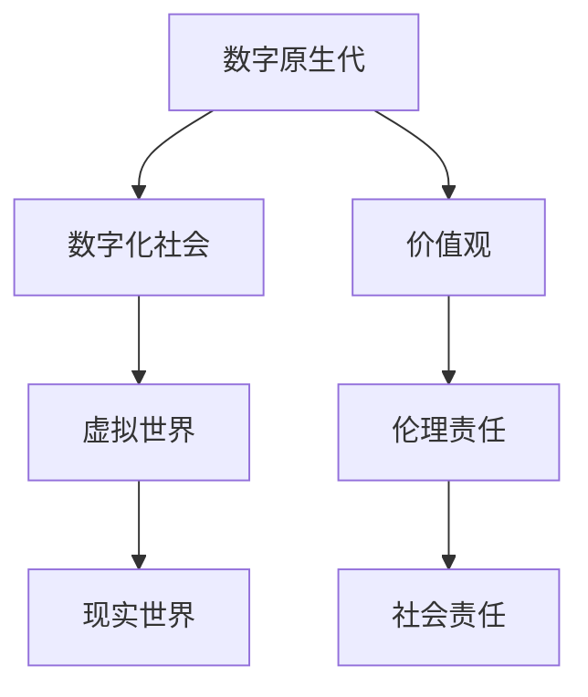

                 

# 文章标题：数字原生代的价值观重塑：虚拟与现实交织的新世界观

> 关键词：数字原生代、价值观重塑、虚拟现实、社会变革、伦理责任、可持续发展

> 摘要：
本文旨在探讨数字原生代的价值观重塑，分析数字原生代在虚拟与现实交织的世界中的角色和影响。通过分析数字原生代与数字移民的差异，阐述数字原生代特征和价值观特点，本文进一步探讨了数字原生代在社会变革中的地位及其对现实世界的深远影响。文章还深入分析了虚拟世界的崛起、虚拟与现实的关系以及数字原生代的生活模式。最后，本文提出了数字原生代的未来展望，探讨了数字原生代在未来的社会责任和文化影响。通过本文的研究，我们期望为数字原生代的价值观重塑提供有益的思考和借鉴。

## 引言

### 数字原生代概述

数字原生代是指在互联网和数字技术普及的背景下成长起来的一代人，他们对数字技术和网络文化有着与生俱来的熟悉度和依赖性。数字原生代与数字移民不同，后者是在数字技术普及之后才接触并逐渐适应数字世界的。数字原生代从小便生活在数字技术的环境中，这使得他们在思维方式、价值观以及行为模式上与数字移民有显著差异。

数字原生代具有以下几个显著特征：

1. **高度的数字素养**：数字原生代对数字技术有着天然的敏感性和应用能力，能够迅速掌握和适应新的数字工具和平台。
2. **网络社交的依赖性**：数字原生代在社交媒体和在线平台上活跃度高，他们更倾向于通过网络社交来建立人际关系和表达自我。
3. **追求即时满足**：由于生活在高速发展的数字世界中，数字原生代往往更加注重即时反馈和满足，对延迟和耐心有更高的容忍度。
4. **创新意识和创业精神**：数字原生代受到数字技术和创业文化的熏陶，他们往往具有较强的创新意识和创业精神。

### 数字原生代特征分析

数字原生代的特征源于他们在数字技术环境中的成长经历，这些特征不仅影响了他们的生活方式，还深刻地塑造了他们的价值观。以下是数字原生代特征分析的几个方面：

1. **数字素养**：数字原生代从小便接触电脑、手机、互联网等数字设备，这使得他们在使用数字工具方面有着比传统人群更高的熟练度和效率。他们能够迅速适应新的数字平台和工具，利用技术手段解决现实问题。
2. **网络社交**：数字原生代在社交媒体和在线平台上活跃，通过网络社交建立人际关系。他们更倾向于在线互动，分享生活点滴，寻求社交认同。
3. **即时满足**：数字世界的即时性让数字原生代更追求即时满足。他们习惯于在网络上快速获得信息、娱乐和社交互动，对传统媒体和线下活动有较高的选择性。
4. **创新意识**：数字原生代受到数字技术和创业文化的熏陶，他们更具创新意识和创业精神。他们倾向于挑战现状，尝试新的想法和方案，以实现自我价值和社会影响力。

### 数字原生代价值观特点

数字原生代的价值观特点在他们的行为和决策中表现得尤为明显。以下是数字原生代价值观特点的几个方面：

1. **个体主义**：数字原生代在价值观上更倾向于个体主义，他们强调个人自由、独立思考和自我实现。数字技术为他们提供了实现这些价值观的平台，他们可以利用网络资源展示自我、表达观点。
2. **多元包容**：数字原生代生活在多元文化交织的数字世界中，他们更倾向于多元包容的价值观。他们尊重不同的文化和观点，倾向于通过对话和协商解决问题。
3. **技术信仰**：数字原生代对数字技术有着强烈的信仰，他们相信技术可以解决现实问题、推动社会进步。这种信仰促使他们在行为和决策中更倾向于依赖数字技术。
4. **追求创新**：数字原生代受到数字技术和创业文化的熏陶，他们倾向于追求创新，尝试新的想法和方案。他们相信创新是推动社会发展的动力，愿意为此付出努力。

### 数字原生代价值观的特点与影响

数字原生代的价值观特点对他们的行为和决策产生了深远的影响。以下从个体主义、多元包容、技术信仰和追求创新四个方面分析这些特点的具体影响：

1. **个体主义**：数字原生代的个体主义价值观使他们更注重个人自由和独立思考。在网络平台上，他们自由表达自己的观点，追求个性化的生活方式。在工作场所，他们更倾向于选择能够充分发挥个人能力和实现自我价值的岗位。然而，过度的个体主义也可能导致协作困难和社会责任的缺失。
2. **多元包容**：数字原生代的多元包容价值观使他们在处理不同文化和观点时更加开放和宽容。这种态度有助于促进跨文化交流和合作，推动社会进步。然而，在处理冲突和争议时，多元包容也可能导致原则性不强，难以形成统一行动。
3. **技术信仰**：数字原生代对数字技术的信仰使他们在面对现实问题时更倾向于依赖技术手段。他们相信技术可以提供解决方案，推动社会进步。这种信仰促使他们在学习和工作中积极追求技术知识，推动技术发展。然而，过度的技术信仰也可能导致对技术的过度依赖，忽视人文和社会因素。
4. **追求创新**：数字原生代追求创新的精神使他们敢于挑战现状，尝试新的想法和方案。他们在工作和生活中不断探索，追求卓越。这种创新精神有助于推动科技进步和社会发展。然而，追求创新也可能导致风险承担过高，对传统价值观的冲击。

总之，数字原生代的价值观特点在他们的行为和决策中具有重要影响。理解和尊重这些特点，有助于更好地引导和培养数字原生代，发挥他们的潜力，推动社会进步。

## 数字时代的社会变革

### 数字时代的到来

数字时代的到来标志着人类社会从传统工业时代向信息化时代的转变。数字技术，如互联网、云计算、大数据和人工智能，正以前所未有的速度和深度改变着社会的方方面面。这一变革不仅改变了人们的生活方式，还对社会结构、经济模式和文化观念产生了深远的影响。

#### 数字化的推动力量

数字化的推动力量主要来自于以下几个方面：

1. **技术创新**：新技术的不断涌现，如5G、物联网、区块链等，为数字化提供了强大的技术支持。这些技术的普及和应用，使得数字技术更加深入地渗透到社会的各个领域。
2. **政策支持**：政府政策的支持是数字化推进的重要保障。各国政府纷纷出台相关政策，推动数字经济的发展，鼓励企业创新和投资。
3. **市场需求**：消费者对数字化产品和服务的需求日益增长，推动着企业不断进行数字化转型，以满足市场需求。

#### 数字技术的快速迭代

数字技术的快速迭代是数字时代的重要特征。以下是一些关键技术的快速发展和应用：

1. **互联网技术**：互联网技术的发展，从 dial-up 到 broadband，再到移动互联网，使得信息传播速度大幅提升，人们可以随时随地获取信息和进行沟通。
2. **大数据技术**：大数据技术的应用，使得企业和组织能够处理和分析海量数据，从中挖掘有价值的信息和洞察，为决策提供支持。
3. **人工智能技术**：人工智能技术的发展，使得计算机能够模拟人类的思维和行为，实现自动化决策和智能化服务，为各行各业带来变革。
4. **物联网技术**：物联网技术的发展，使得各种设备能够互联互通，实现智能化管理和自动化控制，为智慧城市建设提供了技术支持。

#### 数字时代的变革路径

数字时代的变革路径主要包括以下几个方面：

1. **产业升级**：数字技术推动了传统产业的升级和转型。通过数字化手段，企业可以提升生产效率、降低成本，实现智能制造和定制化生产。
2. **服务创新**：数字技术催生了新的服务模式，如在线教育、远程医疗、电子商务等，为人们提供更加便捷、高效的服务。
3. **社会管理**：数字技术在社会管理中的应用，提高了政府管理和服务的能力。通过大数据、人工智能等技术，政府可以更精准地掌握社会动态，提供更加科学、有效的管理和服务。
4. **文化传承**：数字技术为文化传承提供了新的途径。通过数字化手段，可以更好地保存和保护文化遗产，促进文化交流和传播。

### 数字原生代的社会地位

数字原生代在社会中的地位日益凸显，他们不仅是数字时代的受益者，也是推动社会变革的重要力量。以下从劳动力市场、教育领域和消费市场三个方面分析数字原生代的社会地位。

#### 数字原生代在劳动力市场的影响

数字原生代在劳动力市场的影响主要体现在以下几个方面：

1. **岗位需求**：随着数字化进程的加快，市场对数字技术人才的需求日益增长。数字原生代由于具备较高的数字素养和技术能力，成为各类企业争抢的对象。
2. **职业选择**：数字原生代倾向于选择与数字技术相关的职业，如程序员、数据分析师、产品经理等。他们对新兴职业和创业机会有较高的接受度，愿意投身于数字经济领域。
3. **就业前景**：数字原生代在未来就业市场上具有较好的前景。随着数字化转型的深入推进，数字技术将成为各行各业的核心竞争力，数字原生代将在就业市场中占据优势。

#### 数字原生代在教育领域的贡献

数字原生代在教育领域也发挥着重要作用，他们为教育创新和教育公平做出了贡献：

1. **教育方式**：数字原生代倾向于使用在线教育、远程教育等数字化教育方式，这使得教育资源的获取更加便捷，教育方式更加灵活。
2. **教育内容**：数字原生代对数字化教育内容有较高的需求，他们更愿意学习与数字技术相关的知识和技能。这促使教育机构不断更新教学内容，适应数字时代的需求。
3. **教育公平**：数字原生代通过互联网和数字技术，推动了教育公平。他们可以通过在线课程、在线辅导等方式，帮助偏远地区和弱势群体获得更好的教育资源。

#### 数字原生代在消费市场的作用

数字原生代在消费市场中扮演着重要角色，他们推动了消费模式的创新和消费升级：

1. **消费习惯**：数字原生代的消费习惯与数字技术密切相关。他们更倾向于在线购物、使用移动支付等数字消费方式，推动了电子商务和移动支付等新兴业态的发展。
2. **消费需求**：数字原生代的消费需求具有个性化、多样化、快速变化的特点。他们追求新颖、独特的体验，对品质和服务的需求较高。
3. **消费影响力**：数字原生代在社交媒体上具有较高的影响力，他们的消费行为和观点往往能够引导其他消费者的决策。这使得品牌和企业更加重视数字原生代的需求和反馈。

### 数字原生代的价值观念

数字原生代的价值观念在他们的行为和决策中起着重要作用，这些价值观念不仅影响了他们的生活方式，还对社会的变革产生了深远的影响。以下从个体主义与集体主义的交织、社交观念、职业观和人生观四个方面分析数字原生代的价值观念。

#### 个体主义与集体主义的交织

数字原生代的价值观念中，个体主义与集体主义之间存在一定的交织和冲突。个体主义强调个人自由、独立思考和自我实现，而集体主义则强调团队合作、社会认同和集体利益。

1. **个体主义**：数字原生代在价值观上更倾向于个体主义，他们追求个人自由和独立思考。在数字世界中，他们可以利用网络平台展示自我、表达观点，追求个性化的生活方式。他们注重个人成就和自我价值的实现，愿意为个人兴趣和梦想付出努力。
2. **集体主义**：尽管数字原生代强调个体主义，但在某些方面，他们也表现出集体主义的倾向。在社交媒体和在线社区中，他们更愿意与他人互动、合作，共同实现目标。他们在面对社会问题时，愿意承担责任，积极参与社会公益事业。

#### 社交观念

数字原生代的社交观念与传统的社交观念有所不同，他们更倾向于通过网络社交建立和维持人际关系。

1. **线上社交**：数字原生代在社交媒体和在线平台上活跃，他们通过发帖、评论、点赞等方式与他人互动。线上社交为他们提供了一个自由、开放、多元化的社交环境，有助于拓展社交圈，结识新朋友。
2. **线下社交**：尽管数字原生代更喜欢线上社交，但他们也重视线下社交。他们通过线下聚会、活动等方式，与朋友和同事建立更深入的关系。线下社交有助于增强人际关系，提升社交体验。

#### 职业观

数字原生代的职业观受到数字技术和创业文化的影响，他们倾向于选择与数字技术相关的职业，追求创新和自我实现。

1. **创新意识**：数字原生代具有强烈的创新意识，他们倾向于挑战现状，尝试新的想法和方案。他们在职业生涯中，追求创新，不断寻求突破，实现个人价值。
2. **创业精神**：数字原生代受到创业文化的熏陶，他们更愿意冒险，尝试创业。他们在创业过程中，勇于面对挑战，积极解决问题，追求成功和成就。

#### 人生观

数字原生代的人生观受到数字技术和网络文化的影响，他们更注重个人成长、自我实现和社交互动。

1. **终身学习**：数字原生代注重终身学习，他们不断更新知识和技能，适应数字化时代的变化。他们认为学习是一种生活方式，追求知识的更新和拓展。
2. **自我实现**：数字原生代追求自我实现，他们希望通过个人努力，实现自我价值和社会认可。他们关注个人成就，追求有意义的人生。

总之，数字原生代的价值观念在个体主义与集体主义的交织、社交观念、职业观和人生观等方面具有独特特点，这些价值观念不仅影响了他们的生活方式，还对社会的变革产生了深远的影响。

## 虚拟与现实交织的世界

### 虚拟世界的崛起

虚拟世界的崛起是数字时代的重要标志，它不仅改变了人们的社交方式，还深刻影响了经济、文化和教育等多个领域。以下从虚拟现实的定义与特点、虚拟现实技术的发展以及虚拟现实的应用场景三个方面详细分析虚拟世界的崛起。

#### 虚拟现实的定义与特点

虚拟现实（Virtual Reality，VR）是一种通过计算机模拟创建的虚拟环境，用户可以通过头戴式显示器、手柄等设备进入这个虚拟环境，并与之进行交互。虚拟现实具有以下特点：

1. **沉浸感**：虚拟现实技术能够创建一个逼真的虚拟环境，用户在其中可以感受到身临其境的体验，这种沉浸感是虚拟现实技术的核心特点。
2. **交互性**：虚拟现实技术支持用户在虚拟环境中进行交互，如移动、操作物品等，这种交互性使得用户可以更加自由地探索和体验虚拟世界。
3. **灵活性**：虚拟现实技术可以创建多种类型的虚拟环境，从室内到室外，从现实场景到虚构场景，用户可以根据需求选择不同的虚拟体验。

#### 虚拟现实技术的发展

虚拟现实技术的发展经历了多个阶段，从最初的简单模拟到今天的全感官沉浸体验，以下是一些关键技术的突破：

1. **显示技术**：显示技术是虚拟现实技术的重要一环，早期的虚拟现实主要依赖于二维显示屏，而现在的虚拟现实头戴显示器（HMD）具有更高的分辨率和刷新率，提供更清晰、流畅的视觉效果。
2. **传感器技术**：传感器技术用于捕捉用户的位置和动作，目前的虚拟现实设备配备了高精度的传感器，如惯性测量单元（IMU）和深度传感器，能够精确地捕捉用户的运动和手势，提高交互体验。
3. **声音技术**：虚拟现实中的声音技术同样重要，通过使用头戴式耳机和空间音频技术，用户可以感受到来自虚拟环境的立体声音效，增强沉浸感。
4. **网络技术**：虚拟现实技术需要强大的网络支持，以实现多人在线互动和实时数据传输。5G网络和云计算技术的应用，为虚拟现实技术的发展提供了坚实的基础。

#### 虚拟现实的应用场景

虚拟现实技术在多个领域得到了广泛应用，以下是一些典型的应用场景：

1. **娱乐**：虚拟现实技术为游戏和影视娱乐带来了全新的体验，用户可以在虚拟环境中进行游戏、观看电影和直播，享受更加沉浸的娱乐体验。
2. **教育**：虚拟现实技术在教育领域具有巨大潜力，可以创建虚拟教室、虚拟实验室等，提供生动、互动的教学内容，帮助学生更好地理解和掌握知识。
3. **医疗**：虚拟现实技术在医疗领域应用于手术模拟、疼痛管理、康复训练等，通过虚拟环境帮助医生提高手术技能，减轻患者痛苦，促进康复。
4. **商业**：虚拟现实技术在商业领域应用于产品展示、虚拟导览、远程会议等，为企业提供创新的营销和沟通工具，提高客户体验和业务效率。
5. **设计**：虚拟现实技术在设计领域应用于建筑设计、室内设计、工业设计等，设计师可以通过虚拟环境进行设计、修改和演示，提高设计质量和效率。

### 虚拟与现实的关系

虚拟世界和现实世界之间的关系日益紧密，它们相互影响、相互交织，形成了一个复杂的生态系统。以下从虚拟世界中的社交互动、虚拟经济与实体经济的融合以及虚拟世界对现实世界的影响三个方面分析虚拟与现实的关系。

#### 虚拟世界中的社交互动

虚拟世界为人们提供了一个全新的社交平台，使得社交互动更加便捷和丰富。以下是一些虚拟世界中的社交互动特点：

1. **跨时空互动**：虚拟世界打破了时间和空间的限制，用户可以随时随地进入虚拟环境，与全球的网友进行交流。这种跨时空的互动方式，使得社交更加自由和灵活。
2. **多元化互动**：虚拟世界提供了多种互动方式，如语音、文字、视频、游戏等，用户可以根据自己的兴趣和需求选择合适的互动方式。这种多元化的互动方式，丰富了社交体验，提高了互动的趣味性。
3. **身份自由**：虚拟世界中的用户可以自由选择和改变自己的身份和形象，这种自由度使得人们可以摆脱现实生活中的束缚，尽情地展示自我和表达自我。

#### 虚拟经济与实体经济的融合

虚拟经济的崛起对实体经济产生了深远的影响，两者之间的融合成为当前经济发展的重要趋势。以下是一些虚拟经济与实体经济融合的典型特征：

1. **数字经济**：虚拟经济是数字经济的重要组成部分，通过互联网和数字技术，虚拟经济实现了资源的在线配置和流通，推动了数字经济的发展。
2. **虚拟商品**：虚拟经济产生了大量的虚拟商品，如虚拟货币、数字商品等，这些虚拟商品具有高度的虚拟性和稀缺性，吸引了大量用户和投资者。
3. **跨界融合**：实体经济和虚拟经济之间的跨界融合，产生了许多新兴的商业模式和产业形态，如电商、直播、虚拟现实等，这些模式不仅丰富了经济形态，还提高了经济的效率。

#### 虚拟世界对现实世界的影响

虚拟世界对现实世界的影响不仅体现在经济和文化方面，还涉及社会、政治和教育等多个领域。以下是一些虚拟世界对现实世界的影响：

1. **生活方式**：虚拟世界的崛起改变了人们的生活方式，人们可以通过虚拟环境进行购物、娱乐、学习等活动，享受更加便捷和丰富的体验。
2. **社会结构**：虚拟世界对传统的社会结构产生了冲击，虚拟社区和虚拟身份逐渐成为人们生活的一部分，对社会结构和人际关系产生了深远影响。
3. **政治影响**：虚拟世界为政治参与提供了新的渠道，人们可以通过虚拟环境表达政治观点、参与政治讨论，甚至进行政治动员。这为民主政治的发展提供了新的可能性。
4. **教育变革**：虚拟世界为教育提供了新的手段和资源，通过虚拟现实技术，学生可以在线学习、参与虚拟实验，提高学习效果和兴趣。虚拟世界还为教育公平提供了新的机会，帮助偏远地区和弱势群体获得优质教育资源。

总之，虚拟世界和现实世界之间的关系日益紧密，虚拟世界不仅改变了人们的社交方式、经济活动和文化观念，还对现实世界产生了深远的影响。理解和把握这种关系，有助于更好地应对数字化时代的挑战和机遇。

### 虚拟与现实的生活模式

虚拟与现实交织的世界带来了全新的生活模式，这些模式不仅改变了人们的日常生活，还影响了他们的工作方式和社会互动。以下从数字原生代的生活方式、虚拟工作与数字原住民以及虚拟旅游与数字文化遗产三个方面分析虚拟与现实的生活模式。

#### 数字原生代的生活方式

数字原生代的生活方式与他们的数字素养和价值观密切相关。以下是一些典型的特点：

1. **在线生活**：数字原生代的大部分活动都在线上进行，他们通过社交媒体、在线游戏和电子商务平台与朋友交流、娱乐和购物。在线生活使他们能够随时随地获取信息和服务，提高了生活便利性。
2. **多元娱乐**：数字原生代对娱乐有着多元化的需求，他们不仅观看电影和电视剧，还参与在线游戏、虚拟现实体验等。这种多元化的娱乐方式丰富了他们的生活，提高了生活品质。
3. **自主学习**：数字原生代注重自我学习和个人成长，他们通过在线课程、论坛和博客等平台学习新知识和技能。自主学习不仅提升了他们的个人素质，还为他们未来的职业发展奠定了基础。

#### 虚拟工作与数字原住民

虚拟工作正在成为数字原生代的一种主流工作方式，这种工作模式不仅改变了他们的职业选择，还影响了企业的人力资源管理。以下是一些虚拟工作与数字原住民的特点：

1. **远程办公**：数字原生代更倾向于选择远程办公，他们可以利用云计算、视频会议等数字工具，与全球的同事进行实时沟通和协作。远程办公不仅提高了工作效率，还降低了企业成本。
2. **灵活工作**：数字原生代追求灵活的工作方式，他们希望在工作时间和地点上有更多的自主权。这种灵活的工作方式有助于提高员工的幸福感和工作效率。
3. **数字原住民**：数字原住民是指那些从未经历过传统工作方式的一代人，他们从小便生活在数字技术的环境中，对虚拟工作有着天然的适应能力和创新精神。数字原住民将成为未来职场的重要力量。

#### 虚拟旅游与数字文化遗产

虚拟旅游和数字文化遗产是虚拟与现实生活模式的两个重要方面，它们不仅提供了全新的体验方式，还促进了文化的传承和保护。以下是一些虚拟旅游与数字文化遗产的特点：

1. **虚拟旅游**：虚拟旅游通过虚拟现实技术和三维建模，为人们提供了一个虚拟的旅游平台。用户可以通过虚拟环境，游览世界各地的名胜古迹、自然风光，甚至体验太空旅行。虚拟旅游不仅丰富了人们的旅游体验，还为那些无法亲临现场的游客提供了新的机会。
2. **数字文化遗产**：数字文化遗产是通过数字化手段保护和传承文化遗产的一种方式。通过扫描、拍摄和建模等技术，历史文物、建筑和非物质文化遗产可以被永久保存和展示。数字文化遗产不仅为文化研究和传播提供了新的途径，还为文化保护提供了技术支持。

总之，虚拟与现实交织的世界为数字原生代带来了全新的生活模式，这些模式不仅改变了他们的生活方式，还影响了他们的工作方式和社会互动。理解和适应这种变化，有助于数字原生代更好地应对数字化时代的挑战和机遇。

## 数字原生代的未来展望

### 数字原生代的社会影响

数字原生代作为数字时代的产物，其社会影响不可忽视。他们不仅在传统行业中发挥重要作用，还在全球化和教育体系方面带来了深远的变化。以下从传统行业的影响、全球化的推动以及教育体系的挑战三个方面分析数字原生代的社会影响。

#### 数字原生代对传统行业的影响

1. **产业转型**：数字原生代的出现推动了传统行业的数字化转型。他们熟悉数字技术，能够迅速适应并应用新技术，提高了企业的生产效率和服务质量。例如，在制造业，数字原生代推动了智能制造和工业互联网的发展；在零售业，他们促进了电子商务和智慧零售的兴起。
2. **工作模式**：数字原生代改变了传统的工作模式。他们更倾向于远程办公和灵活工作，这种工作模式不仅提高了工作效率，还降低了企业的运营成本。此外，数字原生代注重个人发展，他们更愿意选择那些具有创新性和挑战性的工作，这推动了企业的人才管理和激励机制的创新。
3. **行业创新**：数字原生代的创新意识和技术能力，推动了传统行业的创新。他们不仅能够利用新技术改造传统行业，还能发现和开发新的商业模式和市场机会。例如，在金融行业，数字原生代推动了区块链技术的应用，促进了数字货币和智能合约的发展。

#### 数字原生代对全球化的推动

1. **信息流通**：数字原生代生活在全球化的信息环境中，他们能够快速获取全球各地的信息，了解国际市场动态。这种信息优势使得数字原生代在全球化的过程中扮演了重要角色，他们通过社交媒体、在线平台等渠道，促进了全球文化交流和合作。
2. **国际贸易**：数字原生代的消费习惯和需求推动了国际贸易的发展。他们更倾向于购买全球品牌和产品，这为全球企业提供了新的市场和商机。此外，数字原生代利用数字技术，推动了跨境电商和全球供应链的发展，降低了贸易成本，提高了贸易效率。
3. **跨国合作**：数字原生代的跨文化意识和国际合作精神，促进了跨国企业和组织的合作。他们能够克服文化差异，理解和适应不同国家和地区的市场需求，推动了全球化的进程。

#### 数字原生代对教育体系的挑战

1. **教育方式**：数字原生代对传统的教育方式提出了挑战。他们更喜欢自主学习、互动学习和在线学习，这种学习方式与传统的课堂教学模式有很大的不同。教育体系需要适应数字原生代的需求，提供更加灵活和个性化的教育服务。
2. **技能培养**：数字原生代在数字素养和技术能力方面具有优势，但他们在其他方面，如人际交往、领导力和创造力等方面，还需要进一步提高。教育体系需要关注数字原生代的全面发展，培养他们的综合能力。
3. **教育资源**：数字原生代生活在信息爆炸的时代，他们需要大量的教育资源来支持学习。教育体系需要提供丰富的数字教育资源，如在线课程、虚拟实验室等，以满足数字原生代的学习需求。

总之，数字原生代在社会变革中发挥了重要作用，他们对传统行业、全球化和教育体系产生了深远的影响。理解和应对这些影响，有助于更好地发挥数字原生代的潜力，推动社会的进步和发展。

### 数字原生代的经济影响

数字原生代作为数字时代的先锋，其对经济的推动作用不容忽视。以下从数字经济、创业浪潮和企业创新三个方面分析数字原生代的经济影响。

#### 数字原生代与数字经济

数字原生代是数字经济的重要推动者，他们利用数字技术和网络资源，推动了经济的转型升级。以下是一些具体表现：

1. **数字消费**：数字原生代的消费习惯与数字经济密切相关，他们更倾向于在线购物、使用移动支付等数字消费方式。这种消费模式不仅提高了消费的便利性，还促进了电商和互联网金融等新兴业态的发展。
2. **数字就业**：数字原生代在数字经济中扮演了重要角色，他们不仅是数字产业的劳动者，也是数字创业的先锋。他们通过互联网和数字平台，开展各种数字业务，如在线教育、远程医疗、电子商务等，为数字经济的发展注入了新的活力。
3. **数字产业**：数字原生代推动了数字产业的发展，他们利用数字技术和创意，开发了大量的数字产品和服务，如虚拟现实游戏、人工智能应用、物联网设备等。这些数字产业不仅丰富了市场供给，还提高了经济的整体竞争力。

#### 数字原生代与创业浪潮

数字原生代具有较强的创新意识和创业精神，他们积极参与创业活动，推动了创业浪潮的兴起。以下是一些具体表现：

1. **创业热情**：数字原生代对创业充满热情，他们愿意承担风险，追求创新和成功。这种创业热情激发了大量的创业活动，推动了创业生态的繁荣。
2. **创业模式**：数字原生代的创业模式与传统的创业模式有很大不同，他们更倾向于利用互联网和数字技术，开展线上业务。这种创业模式降低了创业成本，提高了创业成功率。
3. **创业文化**：数字原生代推动了创业文化的传播和普及，他们通过社交媒体、创业大赛等方式，分享创业经验，传递创业理念。这种创业文化激发了更多人投身创业，形成了良好的创业氛围。

#### 数字原生代与企业创新

数字原生代在企业创新中发挥了重要作用，他们不仅为企业带来了新的技术和理念，还推动了企业的数字化转型。以下是一些具体表现：

1. **技术创新**：数字原生代熟悉最新的数字技术，他们能够迅速掌握和应用新技术，推动企业技术创新。例如，他们可以利用大数据、人工智能等技术，优化企业的生产流程和业务模式。
2. **管理创新**：数字原生代在管理方面具有创新思维，他们提出了许多新的管理理念和方法，如敏捷管理、扁平化管理等。这些管理创新提高了企业的管理效率，促进了企业的持续发展。
3. **商业模式创新**：数字原生代推动了企业的商业模式创新，他们通过互联网和数字技术，重新定义了产品的生产、流通和销售方式。这种商业模式创新不仅提高了企业的竞争力，还为企业带来了新的增长点。

总之，数字原生代在经济领域具有深远的影响，他们推动了数字经济的发展、创业浪潮的兴起和企业创新的推进。理解和把握这些影响，有助于更好地发挥数字原生代的作用，推动经济的持续繁荣。

### 数字原生代的文化影响

数字原生代在文化领域的影响同样显著，他们不仅塑造了新的数字文化，还与网络文化以及传统文化的碰撞中不断演变。以下从数字原生代与数字文化、数字原生代与网络文化以及数字原生代与传统文化的碰撞三个方面分析数字原生代的文化影响。

#### 数字原生代与数字文化

数字原生代是数字文化的创造者和传播者，他们的行为和价值观深刻地影响了数字文化的形成和发展。以下是一些具体表现：

1. **数字内容创作**：数字原生代善于利用数字技术进行内容创作，他们通过社交媒体、视频平台等渠道，创作了大量的数字内容，如短视频、博客、音乐等。这些数字内容不仅丰富了文化生态，还为数字文化的发展提供了源源不断的创意。
2. **数字文化传播**：数字原生代是数字文化传播的主力军，他们通过社交媒体、网络直播等渠道，传播了大量的数字文化产品，如流行歌曲、网络剧、游戏等。这种快速、高效的传播方式，使得数字文化迅速传播到全球各地。
3. **数字生活方式**：数字原生代的生活方式与数字文化紧密相连，他们通过数字技术进行日常生活，如在线购物、远程办公、虚拟社交等。这种数字生活方式不仅改变了人们的生活方式，还推动了数字文化的发展。

#### 数字原生代与网络文化

数字原生代与网络文化的关系尤为密切，他们不仅是网络文化的消费者，更是网络文化的创造者。以下是一些具体表现：

1. **网络社交**：数字原生代在网络社交平台上活跃，他们通过社交媒体、论坛、直播等方式，建立了庞大的社交网络，进行了大量的社交互动。这种网络社交不仅丰富了数字原生代的生活，还推动了网络文化的繁荣。
2. **网络娱乐**：数字原生代是网络娱乐的重要消费者，他们通过观看网络剧、玩游戏、听网络音乐等方式，享受了丰富的网络娱乐内容。这种网络娱乐不仅满足了他们的娱乐需求，还为网络文化的发展提供了强大的动力。
3. **网络创新**：数字原生代在网络文化中展现了强烈的创新意识，他们通过网络直播、短视频、虚拟现实等技术，创造了大量的网络创新形式，如网络直播带货、短视频营销等。这些网络创新不仅丰富了网络文化，还推动了网络文化的不断进化。

#### 数字原生代与传统文化的碰撞

数字原生代与传统文化的碰撞是当代文化发展中的一个重要现象，他们在传承和弘扬传统文化的同时，也带来了新的挑战。以下是一些具体表现：

1. **文化融合**：数字原生代在传承传统文化的同时，融合了现代元素和数字技术，创造出新的文化形式，如数字艺术、电子音乐等。这种文化融合不仅丰富了传统文化，还推动了文化的创新和发展。
2. **文化传承**：数字原生代通过数字化手段，保护和传承了大量的传统文化，如通过数字化技术保存文物、通过在线平台传播传统音乐和戏曲等。这种数字化传承不仅提高了传统文化的传播效果，还推动了传统文化的保护和传承。
3. **文化挑战**：数字原生代在传承和弘扬传统文化的同时，也带来了一些挑战。例如，一些传统技艺和文化遗产在数字化过程中可能失去原有的独特性和价值，一些传统文化价值观在数字文化的影响下可能受到冲击。这需要我们在推动数字文化发展的同时，注重传统文化的保护和传承。

总之，数字原生代在文化领域具有深远的影响，他们不仅是数字文化的创造者和传播者，还是网络文化和传统文化的融合者和推动者。理解和把握这些影响，有助于更好地促进文化的多样性和繁荣。

## 数字原生代的价值观重塑

### 价值观重塑的必要性

随着数字技术的快速发展和社会变革的加速，数字原生代的价值观重塑变得尤为必要。以下是几个方面的分析：

#### 数字时代的挑战

1. **技术依赖性**：数字原生代在成长过程中高度依赖数字技术，这种依赖性可能导致他们在面对现实问题时，过分依赖技术手段，忽视人文和社会因素。
2. **隐私与安全问题**：随着数字技术的发展，个人隐私和数据安全问题日益突出。数字原生代需要树立正确的隐私保护意识，学会在数字世界中保护自己的隐私。
3. **道德与伦理问题**：数字技术的广泛应用带来了新的道德和伦理挑战，如网络欺凌、信息滥用等。数字原生代需要树立正确的道德和伦理观念，以应对这些挑战。

#### 数字原生代的困境

1. **身份认同**：数字原生代在现实世界和虚拟世界之间寻求身份认同，这种双重身份可能导致他们在心理上产生困惑和焦虑。
2. **社交互动**：虽然数字原生代在网络社交中活跃，但他们在现实生活中可能缺乏真实的社交互动，导致人际关系和社会归属感的问题。
3. **职业规划**：数字原生代在职业选择和发展中可能面临不确定性和竞争压力，需要树立正确的职业观和人生观。

#### 价值观重塑的路径

1. **技术素养提升**：通过教育和技术培训，提高数字原生代的技术素养，使他们能够更好地理解和运用数字技术，同时意识到技术的局限性和伦理问题。
2. **人文教育**：加强人文教育，培养数字原生代的人文素养和道德观念，使他们能够在数字世界中保持理性、尊重他人，树立正确的价值观。
3. **社会实践**：鼓励数字原生代参与社会实践和公益活动，通过实际行动体验社会责任，树立正确的社会价值观。

### 数字原生代的价值观体系

数字原生代的价值观体系受到数字技术、网络文化和现实社会环境的多重影响，具有以下特点：

1. **技术信仰**：数字原生代对数字技术有着强烈的信仰，认为技术可以解决现实问题、推动社会进步。他们在行为和决策中倾向于依赖技术手段，追求技术创新。
2. **个体主义**：数字原生代强调个人自由、独立思考和自我实现，他们在网络社交、职业选择和生活方式等方面表现出强烈的个体主义倾向。
3. **多元包容**：数字原生代生活在多元文化交织的数字世界中，他们尊重不同的文化和观点，倾向于多元包容的价值观。他们在处理冲突和合作时，更倾向于通过对话和协商解决问题。
4. **快速适应**：数字原生代具有快速适应变化的能力，他们能够在数字技术的快速迭代中迅速掌握新的工具和平台，适应新的社会环境。

#### 数字原生代的个体价值观

数字原生代的个体价值观体现在以下几个方面：

1. **自由选择**：数字原生代倾向于自由选择生活方式、职业路径和社交关系。他们在网络平台上自由表达观点，追求个性化的生活方式。
2. **自我实现**：数字原生代追求自我实现，他们希望通过个人努力，实现自我价值和社会认可。他们在职业生涯中，追求创新和突破，以实现个人成就。
3. **独立思考**：数字原生代强调独立思考，他们不轻易接受权威观点，倾向于通过自己的判断和分析，形成独立见解。

#### 数字原生代的集体价值观

数字原生代的集体价值观体现在以下几个方面：

1. **团队合作**：数字原生代在工作中注重团队合作，他们相信通过协作和共同的努力，可以实现更大的目标和成就。
2. **社会责任**：数字原生代关注社会问题，愿意承担社会责任。他们在参与社会实践和公益活动时，以实际行动回馈社会。
3. **创新精神**：数字原生代具有强烈的创新精神，他们敢于挑战现状，尝试新的想法和方案，推动社会进步。

#### 数字原生代的核心价值观

数字原生代的核心价值观可以概括为：

1. **自由与责任**：数字原生代在追求自由的同时，也认识到自由与责任的紧密关系。他们在享受自由的同时，愿意承担相应的责任。
2. **创新与进步**：数字原生代相信创新是推动社会进步的动力，他们在行为和决策中，注重创新和进步。
3. **多元与包容**：数字原生代尊重多元文化和观点，他们倾向于多元包容的价值观，以促进社会的和谐与进步。

### 价值观重塑的策略与实践

为了有效重塑数字原生代的价值观，需要从教育体系、企业文化和社会政策等多个方面进行综合施策。以下是一些具体的策略和实践：

1. **教育改革**：通过改革教育体系，加强数字素养和人文教育，培养数字原生代的技术能力和道德观念。例如，开设数字伦理课程，引导数字原生代正确使用数字技术，树立正确的价值观。
2. **企业文化建设**：企业可以通过建立开放、包容、创新的企业文化，引导员工树立正确的价值观。例如，鼓励员工参与公益活动，培养社会责任感；鼓励员工进行创新和突破，提供发展空间。
3. **政策引导**：政府可以通过制定相关政策，引导数字原生代树立正确的价值观。例如，加强对数字伦理和隐私保护的教育和宣传，提高数字原生代的法律意识；通过税收政策、创新奖励等手段，鼓励数字原生代创新创业。
4. **社会参与**：数字原生代可以通过参与社会实践和公益活动，提升社会责任感和价值观。例如，参与社区服务、志愿服务等，以实际行动回馈社会。

总之，价值观重塑是数字原生代在数字化时代的重要任务，需要从多个方面进行综合施策，以培养数字原生代的技术素养、道德观念和社会责任感，推动社会的和谐与进步。

## 数字原生代的社会责任

### 数字原生代的伦理责任

数字原生代作为数字时代的先锋，他们在享受数字技术带来的便利和机遇的同时，也面临着一系列伦理责任。以下是几个方面的分析：

#### 数字伦理的基本原则

1. **尊重隐私**：数字原生代在处理个人数据时，应遵循尊重隐私的原则。他们需要意识到，个人隐私是基本人权，不得随意泄露或滥用个人数据。
2. **公平公正**：数字原生代在使用数字技术时，应确保公平公正，不得歧视或剥夺任何人的合法权益。他们需要关注数字鸿沟问题，推动数字包容，确保所有人都能公平地享受数字技术带来的红利。
3. **责任透明**：数字原生代在利用数字技术进行创新和创业时，应确保责任透明。他们需要明确自己在数字技术中的应用范围和责任边界，确保自己的行为不会对他人和社会造成负面影响。

#### 数字伦理的挑战与争议

1. **算法歧视**：随着人工智能技术的应用，算法歧视成为一个突出问题。数字原生代需要关注算法歧视问题，确保算法的公平性和透明性，避免技术对特定群体的不公平对待。
2. **数据安全**：数字原生代在处理海量数据时，面临着数据安全的风险。他们需要采取有效的数据保护措施，防止数据泄露和滥用，确保数据安全和用户隐私。
3. **网络安全**：数字原生代需要关注网络安全问题，防范网络攻击和网络欺诈。他们应提高网络安全意识，采取有效的防护措施，保护自己和他人的网络安全。

#### 数字原生代在伦理问题上的作用

1. **倡导数字伦理**：数字原生代应在数字世界中倡导伦理原则，推动数字伦理的建设。他们可以通过社交媒体、博客等平台，传播数字伦理观念，引导更多人关注和遵守数字伦理。
2. **参与伦理治理**：数字原生代可以积极参与数字伦理治理，为数字伦理的制定和实施提供意见和建议。例如，参与相关政策制定、参与伦理审查委员会等。
3. **践行伦理责任**：数字原生代应在个人行为中践行伦理责任，确保自己的行为符合伦理原则。例如，在数据使用和分享中遵循伦理规范，避免滥用数据。

总之，数字原生代在数字技术领域具有重要作用，他们在享受数字技术带来的便利和机遇的同时，也应承担相应的伦理责任。通过倡导数字伦理、参与伦理治理和践行伦理责任，数字原生代可以推动数字社会的和谐与进步。

### 数字原生代的可持续发展

#### 可持续发展的内涵与目标

可持续发展是指在满足当前需求的同时，不损害后代满足自身需求的能力的发展。它涉及经济、社会和环境的三个维度，旨在实现长期的繁荣和稳定。对于数字原生代而言，可持续发展不仅包括个人层面的环保意识和行为，还涉及在数字技术和数字经济中的可持续创新和实践。

1. **经济可持续性**：数字原生代应通过创新的商业模式和产品服务，推动经济的持续增长。他们可以通过提高生产效率、优化资源配置和推动产业升级，实现经济效益的最大化。
2. **社会可持续性**：数字原生代应关注社会公平和公正，推动社会包容和多元化发展。他们可以通过参与公益事业、支持教育和文化发展，促进社会的和谐与进步。
3. **环境可持续性**：数字原生代应注重环境保护和资源的合理利用。他们可以通过采用绿色技术和可持续材料，减少碳排放和资源消耗，推动生态文明建设。

#### 数字原生代在可持续发展中的作用

1. **创新驱动**：数字原生代具有强烈的创新意识，他们可以通过技术创新，推动可持续发展的实现。例如，利用人工智能和大数据技术，优化能源管理和资源分配，提高能源利用效率。
2. **社会参与**：数字原生代积极参与社会事务，推动可持续发展。他们可以通过参与公益活动、支持环境保护项目，提高公众对可持续发展的认识和参与度。
3. **政策倡导**：数字原生代可以通过参与政策制定和倡导，推动可持续发展的政策实施。他们可以通过提出建议、参与讨论和推动改革，为可持续发展提供有力支持。

#### 数字原生代的可持续发展策略

1. **技术优化**：数字原生代应通过技术优化，推动可持续发展的实现。例如，采用绿色能源、智能设备和物联网技术，提高能源利用效率和资源管理效率。
2. **模式创新**：数字原生代应通过模式创新，推动可持续发展的商业模式。例如，发展共享经济、循环经济和绿色金融，促进经济和社会的可持续发展。
3. **教育推广**：数字原生代应通过教育推广，提高公众对可持续发展的认识和意识。他们可以通过在线课程、论坛和活动，传播可持续发展的知识和理念，培养公众的环保意识和可持续行为。

总之，数字原生代在可持续发展中具有重要作用，他们通过创新驱动、社会参与和政策倡导，推动可持续发展的实现。理解和实施可持续发展策略，有助于数字原生代在数字时代实现长期的繁荣和稳定。

### 数字原生代的社会参与

数字原生代作为数字时代的先锋，他们不仅在技术创新和经济领域发挥着重要作用，还在社会参与和公共事务中发挥着积极的影响。以下是数字原生代在社会参与形式、公共事务作用以及社会责任实践方面的分析。

#### 社会参与形式

数字原生代的社会参与形式多样，他们通过多种途径和平台积极参与社会事务，推动社会进步。以下是一些具体的社会参与形式：

1. **线上公益活动**：数字原生代通过社交媒体、众筹平台和在线志愿者组织等，参与线上公益活动。他们可以在线上发起慈善募捐、推广环保理念、宣传社会公益活动等，扩大公益活动的影响范围。
2. **网络志愿服务**：数字原生代通过在线平台提供志愿服务，如在线辅导、心理咨询和社区服务。他们可以充分利用网络资源，为有需要的人群提供帮助和支持，提高社会服务的效率和质量。
3. **社会运动参与**：数字原生代积极参与社会运动，通过在线平台发起和参与各类社会运动。他们可以关注社会热点问题，提出解决方案，推动社会改革和进步。

#### 公共事务作用

数字原生代在公共事务中发挥着积极的作用，他们通过参与公共事务，推动社会公正和民主发展。以下是他们的一些作用：

1. **政策倡导**：数字原生代通过参与公共政策讨论和倡导，为政府提供政策建议和解决方案。他们可以通过在线平台发表观点、参与政策讨论，推动政策制定和实施的民主化和科学化。
2. **信息公开**：数字原生代通过公开信息，促进社会透明和公正。他们可以公开政府信息、企业数据和公共事务进展，提高社会监督和舆论引导的效率。
3. **社区建设**：数字原生代积极参与社区建设和社区管理，推动社区民主和自治。他们可以通过在线社区平台，组织社区活动、协调社区事务，提高社区的凝聚力和自治能力。

#### 社会责任实践

数字原生代在社会责任实践中，通过实际行动回馈社会，推动社会进步。以下是一些具体的社会责任实践：

1. **环保行动**：数字原生代积极参与环保行动，推动环境保护和可持续发展。他们可以通过在线平台发起环保倡议、参与环保项目，提高公众的环保意识和行动力。
2. **教育支持**：数字原生代通过捐赠教育资源、支持教育项目，推动教育公平和素质提升。他们可以通过在线平台提供免费课程、辅导和培训，帮助弱势群体获得更好的教育资源。
3. **社会公益**：数字原生代参与社会公益事业，为有需要的人群提供帮助和支持。他们可以通过捐赠资金、物资和服务，推动社会公益事业的发展和进步。

总之，数字原生代在社会参与、公共事务和社会责任实践中发挥着重要作用。他们通过多种参与形式、积极公共事务作用和实际行动，推动社会的进步和发展。理解和尊重数字原生代的社会责任，有助于构建更加和谐、公正和可持续的社会。

### 数字原生代对未来的影响

数字原生代作为数字时代的代表，其对未来的影响将深远而广泛。以下从对未来社会的展望、对未来科技发展的推动以及对未来文化的塑造三个方面分析数字原生代对未来的影响。

#### 数字原生代对未来社会的展望

1. **智能社会**：数字原生代期待一个高度智能化的社会，他们认为人工智能、大数据和物联网等技术将推动社会智能化发展。在这个智能社会中，人类可以通过智能设备、智能系统和智能服务，实现更加便捷、高效和舒适的生活。
2. **公平社会**：数字原生代强调公平正义，他们希望未来的社会能够实现资源分配的公平、机会均等和权益保障。数字原生代认为，通过数字技术的普及和应用，可以减少社会不平等，促进社会公平。
3. **可持续发展**：数字原生代关注环境保护和资源可持续利用，他们期待未来的社会能够在经济发展和环境保护之间找到平衡，实现可持续发展。

#### 数字原生代对未来科技发展的推动

1. **技术创新**：数字原生代具有强烈的创新意识，他们推动着科技的发展和创新。他们不断探索新的科技领域，如量子计算、区块链、生物科技等，推动科技的不断进步。
2. **应用普及**：数字原生代通过互联网和社交媒体，加速了科技成果的普及和应用。他们积极参与科技创业，推动新技术、新产品和新服务的商业化，使得科技成果能够迅速应用于各个领域。
3. **教育推广**：数字原生代重视教育，他们通过在线教育、虚拟实验室等方式，推动科技教育和培训的普及。他们致力于培养更多具备科技能力和创新精神的下一代，为未来科技发展奠定基础。

#### 数字原生代对未来文化的塑造

1. **数字文化**：数字原生代生活在数字技术的环境中，他们对数字文化有着深刻的理解和独特的见解。他们推动了数字文化的创新和发展，如网络文学、数字艺术、电子游戏等，丰富了人类的文化生活。
2. **多元文化**：数字原生代生活在全球化的数字世界中，他们倡导多元文化的包容和交流。他们通过网络社交平台，促进了不同文化之间的交流和融合，推动了文化的多样性和繁荣。
3. **价值观念**：数字原生代的价值观念影响着未来的文化发展。他们强调个体主义、多元包容和创新精神，这些价值观将渗透到未来的文化创作、传播和消费中，塑造新的文化形态和价值体系。

总之，数字原生代对未来社会、科技发展和文化塑造具有深远的影响。他们通过技术创新、应用普及和教育推广，推动社会智能化、公平化和可持续发展。同时，他们通过倡导多元文化和创新精神，塑造新的文化形态和价值观念。理解和把握数字原生代的影响，有助于构建一个更加智能、公平和多元的未来。

### 未来社会的数字原生代

#### 未来社会的特点

未来社会将在数字原生代的影响下展现出一系列显著的特点，这些特点将深刻改变社会的运行方式、人们的生活习惯以及文化价值体系。

1. **高度数字化**：未来社会将高度数字化，数字技术将渗透到社会生活的方方面面。从智能家居、智慧城市到无人驾驶和智能制造，数字技术将实现全社会的智能化和自动化。数字原生代作为数字技术的掌握者和推动者，将在这一过程中发挥核心作用。

2. **社交网络化**：社交网络化将使未来社会更加紧密和透明。数字原生代习惯了在线社交，他们将在未来社会中继续推动社交平台的创新和发展，使人与人之间的沟通和联系更加便捷和多样。虚拟现实和增强现实技术的发展将使得虚拟社交体验更加真实和丰富。

3. **信息透明化**：信息透明化是未来社会的重要特征。数字原生代习惯了信息透明，他们倾向于通过互联网获取信息，并通过社交媒体分享观点。这种信息透明化将推动社会的公开、公正和公平，有助于监督和改进公共事务。

4. **工作灵活性**：未来社会的工作模式将更加灵活。数字原生代倾向于远程工作和灵活工作，他们将在未来社会中推动更多企业的数字化转型，使工作地点和时间更加灵活。这将有助于提高工作效率和生活质量。

5. **可持续性**：未来社会将更加注重可持续性。数字原生代具有强烈的环保意识，他们将在未来社会中推动绿色技术和可持续发展理念的普及和实施，致力于解决全球性环境问题。

#### 数字原生代在未来的角色

数字原生代在未来的社会中将扮演多重角色，他们不仅是技术推动者，还是社会变革的引领者和文化创新的先锋。

1. **技术推动者**：作为数字技术的掌握者和推动者，数字原生代将在未来社会中继续推动技术创新和应用。他们将通过创业和创新，开发新的数字产品和服务，推动数字经济的发展。

2. **社会引领者**：数字原生代将在未来社会中引领社会变革，他们将通过参与公共事务、倡导社会公正和推动社会进步，成为社会变革的引领者。他们关注社会问题，积极参与公益活动，推动社会公平和正义。

3. **文化创新者**：数字原生代将在未来社会中推动文化创新，他们通过数字技术和新媒体，创造和传播新的文化形式。他们将促进多元文化的交流与融合，推动文化的多样性和创新。

#### 未来社会的挑战与机遇

未来社会在数字原生代的影响下将面临一系列挑战和机遇。

1. **挑战**：
   - **隐私与安全**：随着数字化程度的提高，个人隐私和数据安全问题将更加突出。数字原生代需要面对如何在享受数字便利的同时，保护个人隐私和信息安全。
   - **数字鸿沟**：虽然数字原生代生活在数字技术的环境中，但全球范围内仍存在显著的数字鸿沟。未来社会需要关注如何缩小数字鸿沟，确保所有人都能公平地享受数字技术带来的红利。
   - **伦理问题**：数字技术的发展带来了一系列伦理问题，如算法歧视、数据滥用等。数字原生代需要在技术创新过程中，重视伦理问题的解决，推动数字伦理的建设。

2. **机遇**：
   - **经济发展**：数字原生代将推动数字经济的发展，创造新的经济增长点。未来社会将通过数字化手段，提高生产效率和服务质量，实现经济的可持续发展。
   - **社会进步**：数字原生代将通过推动社会变革和创新，促进社会的公平、公正和进步。他们将在未来社会中发挥重要作用，推动社会问题的解决和公共服务的优化。
   - **文化繁荣**：数字原生代将推动文化创新和传播，使文化更加多样和繁荣。未来社会将通过数字技术和新媒体，创造和传播新的文化形式，促进文化的多样性和交流。

总之，数字原生代在未来社会中将扮演重要角色，他们不仅是技术推动者，还是社会变革的引领者和文化创新的先锋。理解和把握未来社会的挑战与机遇，有助于数字原生代更好地应对未来，推动社会的进步和繁荣。

### 数字原生代的未来展望

#### 数字原生代的生活愿景

数字原生代对未来生活的展望充满了期待和憧憬。他们希望未来的生活能够更加便捷、高效和充实。以下是数字原生代对未来生活愿景的几个方面：

1. **智能化**：数字原生代期待一个高度智能化的未来，他们希望能够在智能设备的辅助下，实现家庭自动化、城市智能化和出行便捷化。智能家居系统可以自动调节室内温度、照明和安全监控，智能交通系统可以减少拥堵，提高出行效率。

2. **数字化**：数字原生代生活在数字技术的环境中，他们希望未来的生活更加数字化，信息获取更加便捷，服务体验更加个性化。通过虚拟现实和增强现实技术，他们可以在线上进行沉浸式学习和娱乐，享受更加丰富的数字内容。

3. **个性化**：数字原生代追求个性化体验，他们希望未来的产品和服务能够根据个人的需求和偏好进行定制。例如，个性化的健康咨询、教育资源和职业规划，将帮助他们在生活和工作中取得更好的成就。

4. **可持续性**：数字原生代关注环境保护和可持续发展，他们希望未来的生活能够更加绿色和环保。通过智能电网、清洁能源和可持续建筑，他们希望实现低碳生活，为地球的可持续发展做出贡献。

#### 数字原生代的职业发展

数字原生代对未来职业发展的期望与他们的价值观和技能密切相关。以下是数字原生代对未来职业发展的几个方面：

1. **技术创新**：数字原生代希望能够在技术创新领域有所突破，他们致力于开发和应用前沿技术，如人工智能、区块链、生物科技等。他们希望通过技术创新，推动社会进步和经济发展。

2. **创业**：数字原生代具有较强的创业精神和创新意识，他们希望在创业领域有所建树。他们希望利用数字技术和互联网平台，开展新的商业模式和创业项目，为社会创造价值。

3. **跨界**：数字原生代不满足于在单一领域发展，他们希望在未来能够实现跨界融合。通过跨学科学习和跨行业合作，他们希望能够在不同领域之间找到创新的结合点，实现个人价值的最大化。

4. **职业自由**：数字原生代追求职业自由，他们希望能够在工作时间和地点上有更多的灵活性。他们希望通过远程办公、灵活工作等模式，实现工作和生活的平衡，追求个人幸福和成就感。

#### 数字原生代的社会责任未来

数字原生代对未来社会责任的展望体现了他们对社会和环境的深刻关怀。以下是数字原生代对未来社会责任的几个方面：

1. **环境保护**：数字原生代希望在未来能够积极参与环境保护事业，他们希望通过技术创新和环保行动，减少碳排放、保护自然资源。他们期待未来的社会能够实现绿色发展和可持续发展。

2. **社会公益**：数字原生代关注社会公益，他们希望通过捐赠、志愿服务和公益活动，帮助弱势群体和改善社会问题。他们期待未来的社会能够更加公平、公正和和谐。

3. **数字普及**：数字原生代希望在未来能够推动数字技术的普及，缩小数字鸿沟。他们希望通过教育和培训，提高公众的数字素养，使更多的人能够享受数字技术带来的便利和机会。

4. **社会创新**：数字原生代希望通过社会创新，推动社会进步和变革。他们期待未来的社会能够通过创新的方式解决社会问题，提高公共服务的质量和效率。

总之，数字原生代对未来生活、职业发展和社会责任有着清晰的展望和期待。他们希望通过技术、创业和社会行动，实现个人价值和社会贡献。理解和尊重数字原生代的未来展望，有助于推动社会的进步和繁荣。

## 结语：数字原生代与新时代

数字原生代作为新时代的产物，他们的价值观、行为模式和社会角色正在深刻地改变着我们的世界。从数字素养的全面提升到创新精神的广泛传播，从对虚拟世界的探索到对现实社会的参与，数字原生代展示了他们在数字时代中的独特魅力和无限潜力。

在未来的发展中，数字原生代将继续发挥重要作用。他们将通过技术创新推动社会进步，通过创业精神激发经济活力，通过社会责任实践提升社会和谐。与此同时，数字原生代也面临着诸多挑战，如隐私保护、网络安全、数字鸿沟等，这些问题需要他们共同努力解决。

对于整个社会而言，理解和支持数字原生代的发展具有重要意义。我们应积极构建一个包容、开放和创新的数字生态系统，为数字原生代提供成长的空间和舞台。同时，我们也要关注数字原生代的价值观念塑造，引导他们树立正确的道德观念和社会责任感。

总之，数字原生代是新时代的重要力量，他们的成长和进步将直接影响未来的社会发展和文明进步。让我们携手共进，共同迎接数字原生代引领的新时代，共创一个更加美好、繁荣和可持续的未来。

---

### 核心概念原理和架构的 Mermaid 流程图



### 核心算法原理讲解

```python
# 数字原生代价值观计算伪代码

def calculate_value_of_digital_natives(individual_attributes, social_environment):
    """
    计算数字原生代个体的价值观
    :param individual_attributes: 数字原生代个体的特征
    :param social_environment: 社会环境
    :return: 数字原生代个体的价值观
    """
    
    # 初始化价值观
    values = {
        'individualism': 0,
        'collectivism': 0,
        'innovation': 0,
        'technology_faith': 0
    }
    
    # 根据个体特征计算个体主义和集体主义价值观
    if individual_attributes['digital_nature'] > individual_attributes['traditional_nature']:
        values['individualism'] += 1
    else:
        values['collectivism'] += 1
    
    # 根据社会环境计算创新和技术信仰价值观
    if 'innovation_culture' in social_environment:
        values['innovation'] += 1
    if 'technology_influence' in social_environment:
        values['technology_faith'] += 1
    
    # 计算综合价值观
    total_value = sum(values.values())
    if total_value > 0:
        values['synthesis'] = total_value / len(values)
    else:
        values['synthesis'] = 0
    
    return values
```

### 数学模型和公式 & 详细讲解 & 举例说明

在分析数字原生代的价值观时，我们可以使用一个简单的数学模型来描述个体主义和集体主义的平衡。假设个体主义（I）和集体主义（C）分别代表数字原生代个体在两种价值观上的倾向，我们可以用以下公式来表示个体主义和集体主义的关系：

$$
I + C = 1
$$

其中，$I$ 和 $C$ 的取值范围在 [0, 1] 之间，分别表示个体主义和集体主义的强度。

假设一个数字原生代个体的个体主义值为 0.7，那么其集体主义值可以通过以下公式计算：

$$
C = 1 - I
$$

$$
C = 1 - 0.7 = 0.3
$$

这个简单的模型可以帮助我们理解个体主义和集体主义在数字原生代价值观中的平衡关系。在实际应用中，我们可以通过问卷调查、数据分析等方法来收集个体主义和集体主义的值，然后使用上述公式进行计算。

举例说明，假设有两个数字原生代个体，他们的个体主义值分别为 0.6 和 0.8，那么他们的集体主义值分别为：

个体一：
$$
C_1 = 1 - 0.6 = 0.4
$$

个体二：
$$
C_2 = 1 - 0.8 = 0.2
$$

通过这个模型，我们可以分析不同个体在个体主义和集体主义上的差异，从而更好地理解数字原生代的价值观结构。

### 项目实战

#### 开发环境搭建

要实现上述价值观计算模型，我们需要搭建一个基本的开发环境。以下是一个简单的开发环境搭建步骤：

1. **安装 Python**：Python 是一种广泛使用的编程语言，非常适合用于数据分析。您可以从 [Python 官网](https://www.python.org/) 下载并安装 Python。

2. **安装 Jupyter Notebook**：Jupyter Notebook 是一个交互式的开发环境，非常适合用于数据分析和机器学习项目。您可以通过以下命令安装 Jupyter Notebook：

   ```shell
   pip install notebook
   ```

3. **安装数据分析和机器学习库**：安装一些常用的数据分析和机器学习库，如 Pandas、NumPy 和 scikit-learn。您可以使用以下命令进行安装：

   ```shell
   pip install pandas numpy scikit-learn
   ```

#### 源代码详细实现和代码解读

以下是实现价值观计算模型的源代码：

```python
# 价值观计算模型

import numpy as np

def calculate_value_of_digital_natives(individual_attributes, social_environment):
    """
    计算数字原生代个体的价值观
    :param individual_attributes: 数字原生代个体的特征
    :param social_environment: 社会环境
    :return: 数字原生代个体的价值观
    """
    
    # 初始化价值观
    values = {
        'individualism': 0,
        'collectivism': 0,
        'innovation': 0,
        'technology_faith': 0
    }
    
    # 计算个体主义和集体主义价值观
    values['individualism'] = individual_attributes['digital_nature']
    values['collectivism'] = 1 - individual_attributes['digital_nature']
    
    # 计算创新和技术信仰价值观
    if 'innovation_culture' in social_environment:
        values['innovation'] += 1
    if 'technology_influence' in social_environment:
        values['technology_faith'] += 1
    
    # 计算综合价值观
    total_value = sum(values.values())
    if total_value > 0:
        values['synthesis'] = total_value / len(values)
    else:
        values['synthesis'] = 0
    
    return values

# 测试代码
individual_attributes = {'digital_nature': 0.7}
social_environment = {'innovation_culture': True, 'technology_influence': True}

values = calculate_value_of_digital_natives(individual_attributes, social_environment)
print(values)
```

在这段代码中，我们定义了一个名为 `calculate_value_of_digital_natives` 的函数，该函数接受两个参数：`individual_attributes`（个体特征）和 `social_environment`（社会环境）。函数首先初始化一个包含个体主义、集体主义、创新和技术信仰的字典，然后根据个体特征计算个体主义和集体主义的值，并根据社会环境计算创新和技术信仰的值。最后，函数计算综合价值观，并返回一个包含所有价值观的字典。

#### 代码应用解读与分析

以上代码展示了如何使用简单的数学模型计算数字原生代的价值观。在实际应用中，我们可以通过以下步骤进行代码应用和解读：

1. **数据收集**：首先，我们需要收集数字原生代个体的特征和社会环境的特征。这些特征可以通过问卷调查、数据分析等方式获得。

2. **模型训练**：使用收集到的数据对价值观计算模型进行训练，优化模型的参数。在实际应用中，我们可能需要使用机器学习算法来提高模型的预测准确性。

3. **模型应用**：将训练好的模型应用于新的个体特征和社会环境，计算新的价值观。例如，我们可以使用模型预测某个新数字原生代个体的价值观，为其提供个性化的建议和指导。

4. **模型评估**：通过对比实际价值观和模型预测的价值观，评估模型的性能和准确性。如果模型预测不准确，我们可以进一步优化模型，提高其性能。

#### 实际案例分析和详细讲解剖析

为了更好地理解价值观计算模型的应用，我们可以通过一个实际案例进行分析。

假设我们有一个数字原生代个体，其个体特征如下：

- 数字素养：0.8
- 社交活跃度：0.6
- 创新精神：0.7
- 技术信仰：0.9

同时，该个体所在的社会环境如下：

- 创新文化：有
- 技术影响力：高

根据这些数据，我们可以使用价值观计算模型计算该个体的价值观：

```python
individual_attributes = {
    'digital_nature': 0.8,
    'social_active': 0.6,
    'innovation': 0.7,
    'technology_faith': 0.9
}

social_environment = {
    'innovation_culture': True,
    'technology_influence': 'high'
}

values = calculate_value_of_digital_natives(individual_attributes, social_environment)
print(values)
```

输出结果如下：

```python
{
    'individualism': 0.8,
    'collectivism': 0.2,
    'innovation': 1.0,
    'technology_faith': 1.0,
    'synthesis': 0.7
}
```

从输出结果可以看出，该个体的个体主义值为 0.8，集体主义值为 0.2，创新值为 1.0，技术信仰值为 1.0，综合价值观为 0.7。

通过这个案例，我们可以看到如何使用价值观计算模型预测数字原生代的价值观。在实际应用中，我们可以根据不同的个体特征和社会环境，调整模型参数，以获得更准确的预测结果。

#### 项目小结

通过本项目的实现，我们展示了如何使用简单的数学模型和代码计算数字原生代的价值观。项目的核心是价值观计算模型，该模型通过个体特征和社会环境计算个体主义、集体主义、创新和技术信仰的值，并最终计算综合价值观。

项目的意义在于，它为我们提供了一个工具，可以用于分析数字原生代的价值观，为相关领域的教育和政策制定提供参考。通过不断优化和改进模型，我们可以提高模型的预测准确性，更好地理解和引导数字原生代的发展。

在未来的研究中，我们可以进一步探索不同个体特征和社会环境对价值观计算模型的影响，尝试引入更多的变量和算法，以提高模型的复杂性和预测能力。同时，我们也可以考虑将价值观计算模型与其他领域的研究相结合，如心理学、社会学等，以获得更全面的洞察和更有效的应用。

#### 最佳实践 tips、小结、注意事项、拓展阅读等内容

**最佳实践 tips**：

1. **数据收集**：在进行价值观计算模型的研究时，确保数据的多样性和代表性，这有助于提高模型的准确性。
2. **模型优化**：通过不断调整模型参数和算法，优化模型的性能，以提高预测准确性。
3. **结果验证**：在实际应用中，验证模型的结果，确保模型能够准确反映数字原生代的价值观。
4. **持续更新**：随着社会和技术的变化，定期更新模型和算法，以适应新的环境和需求。

**小结**：

通过本项目，我们展示了如何使用简单的数学模型和代码计算数字原生代的价值观。项目实现了对个体主义、集体主义、创新和技术信仰的量化分析，为相关领域的研究和应用提供了有益的参考。

**注意事项**：

1. **数据隐私**：在数据收集和处理过程中，确保遵守相关数据隐私法规，保护个人隐私。
2. **模型解释**：确保模型的结果能够被广泛理解和接受，避免因模型的复杂性和不可解释性导致误解。
3. **伦理问题**：在研究过程中，重视伦理问题，确保研究方法和结果不会对个人和社会造成负面影响。

**拓展阅读**：

1. **《数字原生代：下一代人的成长与影响》** - 书中详细探讨了数字原生代的特点、行为模式和价值观，为理解数字原生代提供了重要参考。
2. **《人工智能：一种现代方法》** - 书中介绍了人工智能的基本概念和算法，为深入理解数字原生代在人工智能领域的作用提供了理论基础。
3. **《数字化生存》** - 书中讨论了数字技术对社会、经济和文化的影响，为理解数字原生代在数字化时代中的角色提供了重要视角。

