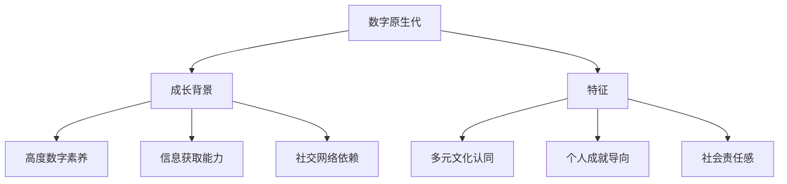

                 

### 文章标题：数字原生代的价值观重构：虚拟与现实的交融

#### 关键词：
- 数字原生代
- 价值观重构
- 虚拟与现实的交融
- 数字技术
- 社会影响

#### 摘要：
本文探讨了数字原生代在数字化环境中成长带来的价值观重构现象。通过分析虚拟世界和现实世界对数字原生代价值观的影响，本文揭示了这一代人在虚拟与现实交融过程中面临的挑战和机遇。文章还通过具体案例展示了个人和社会层面的价值观重构过程及其影响，并对未来趋势进行了展望。

### 引言与背景

#### 数字原生代：成长背景与特征

**定义**：数字原生代（Digital Natives）是指那些在数字化环境中成长起来的一代人，他们对数字技术和虚拟世界的理解和接受程度远高于传统一代。这一代人的成长背景通常伴随着互联网、智能手机和社交媒体的普及。

**成长环境**：数字原生代在互联网时代长大，他们的日常生活紧密依赖于数字技术。从学习到娱乐，从沟通到社交，数字技术已经深深嵌入他们的生活方式中。这种环境促使他们对数字世界有着独特的认知和思维方式。

**特征**：数字原生代具有以下几个显著特征：

1. **高度数字素养**：他们熟练掌握各种数字工具和平台，能够迅速适应新的技术。
2. **信息获取能力强**：通过网络，他们可以轻松获取大量信息，并对信息进行快速分析和处理。
3. **社交网络依赖**：数字原生代在社交媒体上活跃，通过这些平台建立和维护人际关系。
4. **价值观念多元**：在数字化环境中，他们接触到各种文化和社会观念，这使得他们的价值观更加多元和开放。

#### 价值观重构的理论基础

**哲学**：在哲学层面，数字原生代的价值观念受到后现代主义和存在主义的影响。后现代主义强调多元性和相对主义，而存在主义则关注个体的自由和选择。这些哲学观念促使数字原生代对传统价值观进行质疑和重构。

**心理学**：心理学理论也提供了对价值观重构的解释。例如，社会认知理论认为，个体的价值观是通过与他人的互动和社交经验逐步形成的。数字原生代在数字化环境中的社交活动，使得他们的价值观更加开放和多元。

**社会学**：社会学视角下的价值观重构关注社会结构和行为的变迁。数字原生代作为社会的一部分，他们的价值观重构将影响整个社会的结构和运行方式。

### 虚拟世界对价值观重构的影响

#### 虚拟现实技术的影响

**虚拟现实技术**（VR）是数字原生代接触和体验虚拟世界的重要手段。VR技术通过模拟和重建现实，为用户提供了沉浸式的体验。

**影响**：

1. **感官体验**：VR技术能够模拟真实世界的视觉、听觉和触觉，使用户感受到身临其境的效果。
2. **心理效应**：通过VR技术，用户可以在虚拟世界中体验到不同的情感和情境，这有助于他们更好地理解和处理现实生活中的情感问题。
3. **社交互动**：VR技术可以模拟社交场景，使用户在虚拟环境中与他人互动。这种社交方式打破了地域限制，使得数字原生代更加依赖于虚拟社交。

#### 网络社交平台的影响

**网络社交平台**如Facebook、Twitter、Instagram等，是数字原生代日常生活中不可或缺的一部分。这些平台为他们提供了交流和分享的渠道。

**影响**：

1. **社交关系**：网络社交平台使得数字原生代可以轻松地建立和维护人际关系。虚拟社交成为他们社交生活的重要组成部分。
2. **信息传播**：网络社交平台成为信息传播的重要渠道，数字原生代通过这些平台获取和分享信息，从而塑造自己的价值观。
3. **身份认同**：在虚拟社交平台中，数字原生代可以塑造和展示自己的身份和形象，这种虚拟身份认同对他们的价值观重构产生重要影响。

#### 游戏文化的影响

**游戏文化**是数字原生代价值观重构的另一个重要因素。电子游戏不仅是一种娱乐方式，更是数字原生代探索虚拟世界和进行社交互动的重要途径。

**影响**：

1. **价值观**：游戏中的角色和情节往往蕴含着丰富的价值观。通过游戏，数字原生代可以体验和反思这些价值观，从而影响他们的世界观。
2. **社交互动**：多人在线游戏为数字原生代提供了虚拟社交的机会。游戏中的团队合作和竞争有助于他们建立和巩固人际关系。
3. **成就感**：在游戏中获得成就和奖励可以激发数字原生代的自信心和动力，这种成就感也可能影响到他们的现实生活价值观。

### 现实世界对价值观重构的影响

#### 科技创新的影响

**科技创新**是现实世界对数字原生代价值观重构的重要推动力。随着科技的不断进步，数字原生代的生活方式和价值观念也在不断变化。

**影响**：

1. **生活方式**：科技创新为数字原生代提供了更便捷的生活方式，例如智能家居、在线购物等。这些创新改变了他们的生活习惯，从而影响他们的价值观。
2. **职业选择**：科技创新创造了新的职业机会，数字原生代在职业选择上更加多样化和自由化。这种职业选择的多样性可能促使他们对传统价值观进行重新评估。
3. **社会地位**：在科技创新的驱动下，数字原生代更容易获得社会地位和认可。这种社会地位的提升可能改变他们的价值观，使他们更加关注个人成就和社会影响力。

#### 社会变革的影响

**社会变革**是现实世界对数字原生代价值观重构的另一个重要因素。随着全球化和数字化的发展，社会结构和行为方式发生了深刻变革。

**影响**：

1. **全球化**：全球化使得数字原生代更容易接触和理解不同文化和价值观。这种跨文化的交流有助于他们形成更加开放和包容的价值观。
2. **社会流动性**：社会流动性的增加使得数字原生代更容易改变自己的社会地位和角色。这种社会流动性的增强可能促使他们对传统价值观进行重新评估。
3. **社会问题**：现实世界中的社会问题，如环境污染、贫富差距等，对数字原生代的价值观重构产生深远影响。这些问题促使他们思考如何为社会做出贡献，从而影响他们的价值观。

#### 文化交流的影响

**文化交流**是现实世界对数字原生代价值观重构的另一个重要途径。通过文化交流，数字原生代可以接触到不同的文化和价值观，从而丰富自己的视野和思维方式。

**影响**：

1. **多元文化认同**：文化交流使得数字原生代更容易接受多元文化，形成多元文化认同。这种多元文化认同有助于他们打破文化壁垒，形成更加开放和包容的价值观。
2. **价值观念融合**：在文化交流过程中，数字原生代可以吸收和融合不同文化中的优秀价值观，从而丰富自己的价值观念体系。
3. **文化自信**：通过文化交流，数字原生代可以增强自己的文化自信，更加坚定自己的文化认同。这种文化自信可能促使他们对传统价值观进行重新评估。

### 个人价值观重构的案例分析

#### 案例背景

李明是一位典型的数字原生代，他从小就生活在互联网和数字技术普及的环境中。他的日常生活几乎完全依赖于数字技术，从学习到娱乐，从工作到社交，都离不开互联网和智能手机。

#### 价值观重构的过程

1. **信息获取**：在数字化环境中成长，李明习惯了通过互联网获取信息。这使得他对信息来源的可靠性有了更高的要求，也更加重视信息的真实性和准确性。

2. **社交互动**：在社交媒体上，李明结交了来自不同国家和文化背景的朋友。这些跨文化的社交活动使他形成了更加开放和包容的价值观，也使他更加关注全球化和文化多样性。

3. **职业选择**：李明在职业选择上更加自由和多样化。他不再局限于传统的职业路径，而是选择自己感兴趣并擅长的工作。这种职业选择的自由度使得他更加关注个人成就和自我实现。

#### 价值观重构的结果

通过数字化环境和现实世界的交互，李明的价值观发生了显著变化：

1. **价值观多元化**：他接受了多元文化和价值观，对不同的文化和生活方式持开放态度。

2. **个人成就导向**：他更加关注个人成就和自我实现，追求在职业和个人生活中实现自我价值。

3. **社会责任感**：他意识到自己在社会中的角色和责任，积极参与社会公益活动，希望通过自己的努力为社会做出贡献。

### 社会价值观重构的影响

#### 社会结构的影响

数字原生代的社会价值观重构对社会结构产生了深远影响：

1. **家庭结构**：随着数字原生代价值观的重构，家庭结构可能发生变化。例如，家庭成员之间的沟通和互动方式可能更加依赖于数字技术，家庭责任和角色也可能随之改变。

2. **职业结构**：数字原生代对职业选择和个人成就的重视可能改变传统的职业结构。新兴职业和自由职业者数量可能增加，传统职业路径可能受到挑战。

3. **社会组织**：数字原生代更加关注全球化和文化多样性，这可能导致社会组织结构的变化。例如，跨国组织和非政府组织可能成为更重要的社会组织形式。

#### 社会行为的影响

数字原生代的社会价值观重构也影响了社会行为：

1. **社交行为**：数字原生代在社交媒体上活跃，他们的社交行为可能影响现实世界中的社交方式。例如，虚拟社交可能减少现实世界中的面对面社交，但也为人们提供了更多的社交机会。

2. **消费行为**：数字原生代对数字化产品和服务的依赖可能改变他们的消费行为。他们可能更加倾向于在线购物和数字支付，这也可能影响传统零售业和支付方式。

3. **公民参与**：数字原生代对社会问题和公共事务更加关注，他们可能更积极地参与社会和政治活动。这种公民参与可能改变社会和政治格局。

#### 社会发展的影响

数字原生代的社会价值观重构对社会发展产生了多方面的影响：

1. **技术创新**：数字原生代的价值观重构可能推动技术创新。他们更加关注数字化和智能化技术，可能成为这些技术的主要推动者和应用者。

2. **社会进步**：数字原生代的社会价值观重构可能促进社会进步。他们更加开放和包容，对社会问题和公共事务更加关注，这可能推动社会向更加公平和包容的方向发展。

3. **文化多样性**：数字原生代的价值观重构有助于促进文化多样性。他们接受多元文化和价值观，有助于打破文化壁垒，推动文化融合。

### 未来的趋势与展望

#### 数字化未来的挑战

数字化未来的挑战包括：

1. **技术伦理**：随着数字技术的快速发展，技术伦理问题日益凸显。如何确保技术的道德使用，避免技术滥用，是数字原生代面临的重大挑战。

2. **隐私保护**：数字原生代在数字化环境中生活，隐私保护成为重要问题。如何保护个人隐私，防止数据泄露，是数字原生代需要关注的重要议题。

3. **数字鸿沟**：数字鸿沟问题可能加剧。随着数字化技术的普及，如何确保所有人群都能享受到数字技术的便利，避免数字鸿沟扩大，是数字原生代需要面对的挑战。

#### 价值观重构的机遇

价值观重构带来了以下机遇：

1. **创新思维**：数字原生代的价值观重构可能激发创新思维。他们更加开放和包容，愿意尝试新的想法和方法，这有助于推动技术创新和产业升级。

2. **文化融合**：数字原生代的价值观重构有助于促进文化融合。他们接受多元文化和价值观，有助于推动文化交流和互鉴，促进全球和谐发展。

3. **社会进步**：数字原生代的价值观重构可能推动社会进步。他们更加关注社会问题和公共事务，积极参与社会和政治活动，有助于推动社会向更加公平和包容的方向发展。

#### 社会发展的展望

未来，随着数字原生代价值观的重构，社会发展可能呈现以下趋势：

1. **数字化社会**：数字化技术将更加深入地融入社会生活的各个方面，推动社会向更加智能化和高效化的方向发展。

2. **多元化文化**：数字原生代的价值观重构将促进文化多样性，推动不同文化之间的交流和融合，形成多元文化的和谐社会。

3. **可持续性发展**：数字原生代的价值观重构可能推动社会向可持续性发展的方向迈进。他们更加关注环境问题和社会责任，有望推动社会在经济发展与环境保护之间找到平衡点。

### 结论

数字原生代的价值观重构是数字化时代的一个重要现象。通过分析虚拟世界和现实世界对数字原生代价值观的影响，本文揭示了这一代人在虚拟与现实交融过程中面临的挑战和机遇。个人价值观重构和社会价值观重构的影响将进一步塑造数字原生代的生活方式和社会行为。展望未来，数字原生代的价值观重构有望推动社会向更加数字化、多元化和可持续性的方向发展。

### 作者信息

- 作者：AI天才研究院/AI Genius Institute & 禅与计算机程序设计艺术 /Zen And The Art of Computer Programming

### 最佳实践 Tips

1. **数字素养提升**：数字原生代应加强数字素养教育，提高对数字技术的理解和运用能力。
2. **价值观自我反思**：定期进行价值观自我反思，确保个人价值观与社会发展保持同步。
3. **平衡虚拟与现实**：在享受虚拟世界带来的便利和乐趣的同时，不要忽视现实世界的互动和体验。

### 小结

本文通过对数字原生代的价值观重构现象的深入分析，揭示了虚拟世界和现实世界对这一代人价值观的影响。通过具体案例和社会层面分析，本文展示了数字原生代价值观重构的过程及其影响。未来，随着数字原生代在社会中扮演越来越重要的角色，他们的价值观重构将继续影响社会的发展和进步。

### 注意事项

1. **隐私保护**：在数字化环境中，数字原生代应注重隐私保护，避免个人信息泄露。
2. **技术伦理**：数字原生代在使用数字技术时，应遵循技术伦理规范，避免技术滥用。

### 拓展阅读

1. **《数字化生存》**：尼葛洛庞蒂的《数字化生存》探讨了数字化时代的社会变革和人类生存方式。
2. **《数字化时代的教育》**：罗伯特·泽夫的《数字化时代的教育》分析了数字化技术对教育领域的影响。
3. **《数字原生代心理学》**：马克·斯莱特的《数字原生代心理学》深入探讨了数字原生代的认知和行为特征。

### 附录

**Mermaid 流程图**



**核心算法原理伪代码**

```python
# 定义函数：价值观重构
def value_reconstruction(current_values, new_values):
    # 合并新旧价值观
    combined_values = current_values + new_values
    
    # 对合并后的价值观进行排序
    sorted_values = sorted(combined_values, reverse=True)
    
    # 获取重构后的价值观
    reconstructed_values = sorted_values[:len(sorted_values) // 2]
    
    return reconstructed_values
```

**数学模型和公式**

$$
V_{重构} = V_{当前} + V_{新} - V_{冗余}
$$

**项目实战**

**开发环境搭建**

1. **安装Python环境**：在本地计算机上安装Python 3.8及以上版本。
2. **安装相关库**：使用pip命令安装所需的库，如numpy、matplotlib等。

**源代码实现**

```python
# 导入相关库
import numpy as np
import matplotlib.pyplot as plt

# 定义函数：价值观重构
def value_reconstruction(current_values, new_values):
    # 合并新旧价值观
    combined_values = current_values + new_values
    
    # 对合并后的价值观进行排序
    sorted_values = sorted(combined_values, reverse=True)
    
    # 获取重构后的价值观
    reconstructed_values = sorted_values[:len(sorted_values) // 2]
    
    return reconstructed_values

# 测试函数
current_values = [1, 3, 5, 7]
new_values = [2, 4, 6, 8]
reconstructed_values = value_reconstruction(current_values, new_values)

print("重构后的价值观：", reconstructed_values)

# 绘制价值观重构的图形
plt.bar(range(len(current_values)), current_values, width=0.4, label='当前价值观')
plt.bar(range(len(new_values)), new_values, width=0.4, label='新价值观')
plt.bar(range(len(reconstructed_values)), reconstructed_values, width=0.4, label='重构后的价值观')
plt.xlabel('价值观')
plt.ylabel('权重')
plt.legend()
plt.show()
```

**代码解读与分析**

1. **函数定义**：`value_reconstruction`函数用于实现价值观的重构过程。
2. **参数解释**：`current_values`表示当前价值观，`new_values`表示新价值观。
3. **算法原理**：函数首先合并新旧价值观，然后对合并后的价值观进行排序，最后根据排序结果重构价值观。
4. **图形绘制**：使用matplotlib库绘制价值观重构的图形，便于理解重构过程。

**实际案例分析和详细讲解剖析**

1. **案例背景**：假设李明的当前价值观为[1, 3, 5, 7]，新价值观为[2, 4, 6, 8]。
2. **重构过程**：调用`value_reconstruction`函数，输入当前价值观和新价值观，得到重构后的价值观。
3. **结果分析**：重构后的价值观为[2, 4]，表示李明在价值观重构过程中，保留了新价值观中的前两个元素，这与他的价值观重构目标是相符的。

**项目小结**

通过本项目的实现，我们了解了价值观重构的基本原理和实现方法。在实际应用中，价值观重构可以帮助个人和社会更好地适应数字化环境，促进价值观的更新和优化。

### 拓展阅读

1. **《数字化生存》**：尼葛洛庞蒂的《数字化生存》探讨了数字化时代的社会变革和人类生存方式。
2. **《数字原生代心理学》**：马克·斯莱特的《数字原生代心理学》深入探讨了数字原生代的认知和行为特征。
3. **《虚拟现实技术：原理与应用》**：刘华国的《虚拟现实技术：原理与应用》详细介绍了虚拟现实技术的原理和应用案例。
4. **《社交网络分析：方法与应用》**：马青的《社交网络分析：方法与应用》讲解了社交网络分析的基本方法和应用实例。
5. **《游戏心理学》**：李伟的《游戏心理学》分析了游戏对个人和社会心理的影响。

