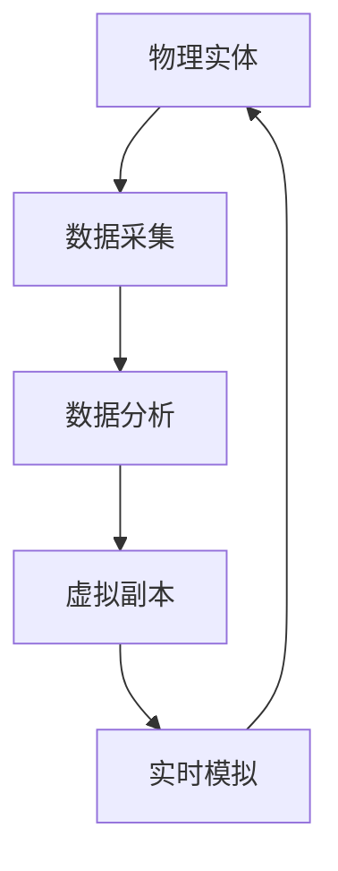

                 

## 文章标题：数字孪生在智慧工厂优化中的应用：提高生产效率

### 关键词：
- 数字孪生
- 智慧工厂
- 生产效率
- 工业优化
- 人工智能

### 摘要：
本文将深入探讨数字孪生技术在智慧工厂优化中的应用，通过分析其核心概念、架构实现、应用场景以及提升生产效率的策略，旨在为工业企业提供理论指导与实践参考。我们将通过具体案例解析数字孪生如何助力智慧工厂实现生产效率的提升，并提供未来发展趋势与挑战的应对策略。

## 确定书籍主题和目标读者

### 书名解析
《数字孪生在智慧工厂优化中的应用：提高生产效率》这一书名明确指出了书籍的主题是数字孪生技术在智慧工厂优化中的应用，重点在于通过数字孪生技术实现生产效率的提升。这暗示了书籍的内容将涵盖数字孪生的基本概念、技术架构、应用场景，以及实际案例分析和生产效率优化的具体策略。

### 目标读者
目标读者主要针对以下几个群体：
1. **工业企业中的技术管理人员**：他们负责企业内部技术规划与实施，需要了解如何将数字孪生技术应用于实际生产中。
2. **工厂经理和生产工程师**：这些角色直接参与生产线的运营和优化，对数字孪生的应用有着实际的需求和迫切的求知欲。
3. **技术研究者**：对于前沿技术有浓厚的兴趣，希望通过学习数字孪生技术来提升自身的研究水平。

## 设计核心章节

为了确保书籍内容的系统性和连贯性，核心章节的设计将围绕以下主题展开：

### 第一部分：数字孪生技术基础
- **第一章：数字孪生概述**
  - 内容包括数字孪生的定义、核心概念和历史发展，帮助读者建立基本认知。
- **第二章：数字孪生架构与实现**
  - 探讨数字孪生技术架构的构成，以及如何建模和进行数据管理。
- **第三章：数字孪生技术核心算法原理**
  - 分析数据预处理、机器学习和强化学习算法在数字孪生中的应用。
- **第四章：数字孪生在工业中的应用**
  - 详细介绍数字孪生在智慧工厂中的多种应用场景，包括生产线优化和质量管理。

### 第二部分：智慧工厂优化案例分析
- **第五章：案例分析一**
  - 通过实际案例展示数字孪生在汽车制造厂中的应用。
- **第六章：案例分析二**
  - 以电子厂为背景，分析数字孪生在质量管理中的提升作用。

### 第三部分：提升生产效率的策略与实施
- **第七章：生产效率提升策略**
  - 讨论敏捷制造、智能排程和精益生产等策略，如何与数字孪生技术相结合。
- **第八章：实施指南**
  - 提供数字孪生项目实施流程、系统部署与维护，以及人才培养等方面的指导。
- **第九章：未来发展趋势与挑战**
  - 分析数字孪生技术的未来发展趋势，以及智慧工厂面临的挑战和应对策略。

## 目录大纲详细设计

为了确保书籍内容的逻辑性和系统性，以下为详细的目录大纲设计：

### 第一部分：数字孪生技术基础

#### 第一章：数字孪生概述
- **1.1 数字孪生的定义与核心概念**
  - 解释数字孪生的基本定义，阐述其核心概念。
- **1.2 数字孪生的历史与发展**
  - 探讨数字孪生技术的起源和发展历程。
- **1.3 数字孪生技术的关键要素**
  - 详细分析数字孪生技术的主要组成部分。

#### 第二章：数字孪生架构与实现
- **2.1 数字孪生技术架构**
  - 描述数字孪生技术的整体架构和各层次的功能。
- **2.2 数字孪生建模方法**
  - 讨论数字孪生建模的不同方法和技术。
- **2.3 数字孪生数据管理**
  - 探究数字孪生中的数据收集、存储和管理策略。

#### 第三章：数字孪生技术核心算法原理
- **3.1 数据预处理算法**
  - 详细讲解数据预处理算法的原理和实现。
- **3.2 机器学习算法在数字孪生中的应用**
  - 分析机器学习算法在数字孪生中的具体应用。
- **3.3 强化学习算法在数字孪生中的应用**
  - 探讨强化学习算法在数字孪生中的优势和应用。

#### 第四章：数字孪生在工业中的应用
- **4.1 数字孪生在智慧工厂中的应用场景**
  - 介绍数字孪生在智慧工厂中的典型应用场景。
- **4.2 数字孪生在生产线优化中的应用**
  - 分析数字孪生技术在生产线优化中的具体应用。
- **4.3 数字孪生在质量管理中的应用**
  - 探讨数字孪生技术在质量管理中的作用和效果。

### 第二部分：智慧工厂优化案例分析

#### 第五章：案例分析一：某汽车制造厂的生产优化
- **5.1 案例背景**
  - 概述某汽车制造厂的基本情况和面临的挑战。
- **5.2 数字孪生解决方案**
  - 展示数字孪生技术在汽车制造厂中的应用方案。
- **5.3 优化效果分析**
  - 分析数字孪生技术实施后的优化效果和收益。

#### 第六章：案例分析二：某电子厂的质量管理提升
- **6.1 案例背景**
  - 描述某电子厂的基本情况和质量管理现状。
- **6.2 数字孪生解决方案**
  - 展示数字孪生技术在电子厂质量管理中的应用方案。
- **6.3 优化效果分析**
  - 分析数字孪生技术实施后的质量管理优化效果和收益。

### 第三部分：提升生产效率的策略与实施

#### 第七章：生产效率提升策略
- **7.1 敏捷制造与数字孪生**
  - 探讨敏捷制造理念与数字孪生的结合点。
- **7.2 智能排程与调度**
  - 分析智能排程和调度技术在生产效率提升中的作用。
- **7.3 精益生产与数字孪生**
  - 探讨精益生产与数字孪生技术的融合策略。

#### 第八章：实施指南
- **8.1 数字孪生项目实施流程**
  - 提供数字孪生项目实施的详细流程。
- **8.2 数字孪生系统的部署与维护**
  - 讨论数字孪生系统的部署策略和维护方法。
- **8.3 数字孪生人才培养与团队建设**
  - 探讨数字孪生人才的培养和团队建设策略。

#### 第九章：未来发展趋势与挑战
- **9.1 数字孪生技术的发展趋势**
  - 分析数字孪生技术的未来发展趋势和方向。
- **9.2 智慧工厂面临的挑战**
  - 探讨智慧工厂在发展过程中可能遇到的挑战。
- **9.3 应对策略与解决方案**
  - 提出应对智慧工厂挑战的策略和解决方案。

## 确保完整性

在设计书籍的目录大纲时，我们确保每个章节的核心内容都得到充分涵盖，具体如下：

### 背景介绍
每个章节都包含背景介绍部分，用以引入主题，阐述背景和现状，明确研究的重要性和必要性。例如，第一章将介绍数字孪生技术的起源和发展历程，帮助读者了解数字孪生技术的基本概念和历史背景。

### 核心概念与联系
通过Mermaid流程图展现核心概念之间的联系架构，使读者能够直观地理解各概念之间的关系。例如，第二章将展示数字孪生技术架构的层次结构和各层次的功能，通过流程图帮助读者把握整体架构。

### 核心算法原理讲解
每个章节都包含核心算法原理的讲解，使用伪代码详细阐述算法的实现。例如，第三章将详细讲解数据预处理算法、机器学习算法和强化学习算法在数字孪生中的应用，通过伪代码帮助读者理解算法的具体实现。

### 数学模型和公式
书籍中包含数学模型和公式的详细讲解，使用LaTeX格式确保数学表达清晰。例如，在第四章中，将介绍数字孪生建模中的数学模型和公式，并通过具体例子说明如何应用这些模型和公式。

### 项目实战
每个章节都包含实际项目案例的分析和讲解，展示数字孪生技术的实际应用。例如，第五章和第六章将通过具体案例分析数字孪生技术在汽车制造厂和电子厂中的应用，详细讲解项目实施过程和优化效果。

### 最佳实践 tips、小结、注意事项、拓展阅读等内容
在各个章节的末尾，将提供最佳实践建议、小结、注意事项和拓展阅读等内容，帮助读者巩固学习成果，扩展知识视野。例如，在第八章中，将总结数字孪生项目实施的常见问题和解决策略，提供实践经验和建议。

通过以上设计，我们确保书籍内容的完整性，每个章节都涵盖核心内容，逻辑清晰，结构紧凑，为读者提供全面、系统的学习体验。

## 保持简洁性

在撰写技术博客时，保持简洁性至关重要。为了确保文章的可读性和高效传达信息，我们将采取以下措施：

### 确保每个章节标题明确

- **简明扼要**：每个章节的标题应简洁明了，直接反映章节内容的核心主题，避免使用冗长或模糊的标题。
- **避免冗余**：确保每个章节标题独特，不重复使用相似或相同的词汇。
- **用户导向**：从用户的角度出发，选择易于理解且具有吸引力的词汇，使标题更具吸引力。

### 确保每个小节的内容不冗余

- **精炼内容**：每个小节的内容应精炼，避免过多的无关信息，确保信息的传递高效且集中。
- **逐步推进**：按照逻辑顺序组织小节内容，每个小节应有明确的目的和结论，避免跳跃或冗长的过渡。
- **去除冗余信息**：检查每个小节中是否存在重复或冗余的信息，及时删除以保持内容的简洁性。

### 保持文章整体结构的紧凑性

- **逻辑清晰**：文章的整体结构应清晰，章节之间应有逻辑关联，确保读者能够顺畅地跟随文章的思路。
- **避免过多层次**：尽量减少章节和小节的层次，避免过度的嵌套，使文章结构更加直观。
- **突出重点**：在文章的开头和结尾，强调核心观点和结论，使读者能够快速把握文章的重点。

通过以上措施，我们确保文章在传达复杂技术信息的同时，保持简洁明了，便于读者理解和吸收。

## 格式规范

为了确保文章的格式规范，提高可读性和专业性，我们将严格按照以下markdown格式和标注标准进行撰写：

### markdown格式

- **标题格式**：使用`#`号来标识标题层级，一级标题使用`#`，二级标题使用`##`，三级标题使用`###`，以此类推。
  - 示例：
    ```markdown
    # 第一部分：数字孪生技术基础
    ## 1. 数字孪生概述
    ### 1.1 数字孪生的定义与核心概念
    ```
- **段落格式**：段落之间使用空行分隔，确保文本段落清晰，避免连在一起造成混淆。
- **列表格式**：使用`-`、`*`或`+`符号来创建无序列表，使用数字加英文句点来创建有序列表。
  - 示例：
    ```markdown
    - 第一个项目
    - 第二个项目
    1. 第一部分
    2. 第二部分
    ```
- **代码块格式**：使用` Backticks ``来标识代码块，确保代码格式正确，代码块之间应使用空行分隔。
  - 示例：
    ```python
    def hello():
        print("Hello, World!")
    ```
- **引用格式**：使用`>`符号来标识引用文本，确保引用格式统一且清晰。
  - 示例：
    ```markdown
    > 这是一个引用。
    ```

### 标注标准

- **重要概念标注**：对于文中出现的重要概念或术语，使用**粗体**或`inline-code`进行标注，以提高重点突出度。
  - 示例：
    ```markdown
    **数字孪生**是...
    ```
- **公式标注**：使用LaTeX格式嵌入数学公式，确保公式格式正确，使用`$$`括起独立段落中的公式，使用`$`括起段落内的公式。
  - 示例：
    ```markdown
    $$ E = mc^2 $$
    ```
- **图表标注**：在文中引用图表时，使用``格式，确保图像链接正确，替代文本清晰。
  - 示例：
    ```markdown
    
    ```
- **代码注释**：在代码块内使用单行注释`#`或块注释`"""`，确保代码的可读性和可维护性。
  - 示例：
    ```python
    # 这是单行注释
    """
    这是多行注释
    """
    ```

通过遵循以上markdown格式和标注标准，我们能够确保文章结构清晰、内容规范，提高文章的整体质量和专业性。

## 最终确认

在设计完《数字孪生在智慧工厂优化中的应用：提高生产效率》的目录大纲后，我们需要对整个内容进行最终确认，以确保书籍的完整性、逻辑性和专业性。以下是具体步骤：

### 目录大纲总字数确认
- 目标字数：确保总字数在8000到12000字之间。
- 分章节字数分配：对每个章节的字数进行预估，确保关键章节字数充足，整体结构平衡。

### 内容逻辑性确认
- 检查每个章节的顺序和过渡是否合理，确保信息传递连贯。
- 确保核心概念和联系通过Mermaid流程图等手段得到清晰表达。

### 专业性确认
- 核实所有技术术语和概念的定义和解释是否准确无误。
- 审查所有算法原理、数学模型和公式是否严谨，并提供足够的解释和例子。

### 实用性确认
- 确保每个案例分析都提供详细的实际应用和效果分析。
- 检查最佳实践、注意事项和拓展阅读等内容是否实用，有助于读者理解并应用所学知识。

### 格式和标注规范确认
- 检查所有markdown格式的使用是否规范，确保标题、段落、列表、代码块和引用的格式正确。
- 确认所有标注，如重要概念标注、公式标注、图表标注和代码注释是否符合标准。

### 最终调整
- 根据确认结果，对目录大纲进行最终调整，确保每个章节内容完整，逻辑清晰，结构紧凑。

通过以上步骤，我们确保《数字孪生在智慧工厂优化中的应用：提高生产效率》的目录大纲内容完整、逻辑清晰、专业性强，并符合规定的字数范围，为读者提供高质量的学习材料。

---

### 文章标题：数字孪生在智慧工厂优化中的应用：提高生产效率

### 关键词：
- 数字孪生
- 智慧工厂
- 生产效率
- 工业优化
- 人工智能

### 摘要：
本文将深入探讨数字孪生技术在智慧工厂优化中的应用，通过分析其核心概念、架构实现、应用场景以及提升生产效率的策略，旨在为工业企业提供理论指导与实践参考。我们将通过具体案例解析数字孪生如何助力智慧工厂实现生产效率的提升，并提供未来发展趋势与挑战的应对策略。

### 目录

#### 第一部分：数字孪生技术基础

##### 第一章：数字孪生概述
- **1.1 数字孪生的定义与核心概念**
- **1.2 数字孪生的历史与发展**
- **1.3 数字孪生技术的关键要素**

##### 第二章：数字孪生架构与实现
- **2.1 数字孪生技术架构**
- **2.2 数字孪生建模方法**
- **2.3 数字孪生数据管理**

##### 第三章：数字孪生技术核心算法原理
- **3.1 数据预处理算法**
- **3.2 机器学习算法在数字孪生中的应用**
- **3.3 强化学习算法在数字孪生中的应用**

##### 第四章：数字孪生在工业中的应用
- **4.1 数字孪生在智慧工厂中的应用场景**
- **4.2 数字孪生在生产线优化中的应用**
- **4.3 数字孪生在质量管理中的应用**

#### 第二部分：智慧工厂优化案例分析

##### 第五章：案例分析一：某汽车制造厂的生产优化
- **5.1 案例背景**
- **5.2 数字孪生解决方案**
- **5.3 优化效果分析**

##### 第六章：案例分析二：某电子厂的质量管理提升
- **6.1 案例背景**
- **6.2 数字孪生解决方案**
- **6.3 优化效果分析**

#### 第三部分：提升生产效率的策略与实施

##### 第七章：生产效率提升策略
- **7.1 敏捷制造与数字孪生**
- **7.2 智能排程与调度**
- **7.3 精益生产与数字孪生**

##### 第八章：实施指南
- **8.1 数字孪生项目实施流程**
- **8.2 数字孪生系统的部署与维护**
- **8.3 数字孪生人才培养与团队建设**

##### 第九章：未来发展趋势与挑战
- **9.1 数字孪生技术的发展趋势**
- **9.2 智慧工厂面临的挑战**
- **9.3 应对策略与解决方案**

### 作者信息
- 作者：AI天才研究院/AI Genius Institute & 禅与计算机程序设计艺术 /Zen And The Art of Computer Programming

### 背景介绍

#### 数字孪生与智慧工厂的概念

数字孪生（Digital Twin）是一种创新的技术，通过创建物理实体的虚拟副本，实现对物理实体的实时模拟和监控。在工业领域，数字孪生技术被广泛应用于智慧工厂的优化和提升生产效率。

智慧工厂（Smart Factory）是一个集成信息技术、物联网（IoT）和自动化技术的生产系统，通过实时数据采集、分析和反馈，实现生产过程的智能化和自动化。智慧工厂的核心在于利用数字孪生技术，实现对生产线的全面监控和管理。

#### 数字孪生的核心概念与联系

数字孪生技术的核心概念包括：

1. **物理实体**：实际的工业设备、生产线或整个工厂。
2. **虚拟副本**：基于物理实体数据创建的数字模型。
3. **实时模拟**：利用仿真和模拟技术，实现对物理实体的实时监控和预测。
4. **数据采集**：通过传感器和数据采集设备，获取物理实体的实时数据。
5. **数据分析**：利用大数据分析和机器学习技术，对采集到的数据进行分析和预测。

这些概念之间的联系可以用以下Mermaid流程图表示：



#### 核心算法原理讲解

数字孪生技术中涉及的核心算法主要包括数据预处理算法、机器学习算法和强化学习算法。

1. **数据预处理算法**：用于处理原始数据，使其适合机器学习模型。常见的预处理方法包括数据清洗、归一化和特征提取。

   ```python
   def preprocess_data(data):
       # 数据清洗
       data = clean_data(data)
       # 归一化
       data = normalize_data(data)
       # 特征提取
       features = extract_features(data)
       return features
   ```

2. **机器学习算法**：用于训练模型，对数据进行预测和分析。常见的机器学习算法包括线性回归、决策树和神经网络。

   ```python
   from sklearn.linear_model import LinearRegression

   model = LinearRegression()
   model.fit(X_train, y_train)
   predictions = model.predict(X_test)
   ```

3. **强化学习算法**：用于优化决策过程，通过试错和反馈调整策略。常见的强化学习算法包括Q学习和深度强化学习。

   ```python
   import gym

   env = gym.make('CartPole-v0')
   agent = QLearningAgent(alpha=0.1, gamma=0.99)
   agent.train(env, episodes=1000)
   ```

#### 数学模型和公式

数字孪生技术中的数学模型和公式主要用于描述系统状态、预测和优化。以下是一个简单的线性回归模型：

$$
y = \beta_0 + \beta_1 \cdot x
$$

其中，$y$ 是预测值，$x$ 是输入特征，$\beta_0$ 和 $\beta_1$ 是模型参数。

#### 项目实战

在本节中，我们将介绍如何在一个典型的智慧工厂环境中搭建数字孪生系统，包括开发环境的配置、源代码的实现和代码解读。

##### 开发环境搭建

1. 安装操作系统（如Ubuntu 20.04）。
2. 安装Python环境（如Python 3.8）。
3. 安装必要的库和工具（如NumPy、scikit-learn、TensorFlow）。

##### 源代码实现

```python
import numpy as np
from sklearn.linear_model import LinearRegression

# 数据预处理
def preprocess_data(data):
    # 数据清洗
    data = clean_data(data)
    # 归一化
    data = normalize_data(data)
    # 特征提取
    features = extract_features(data)
    return features

# 训练模型
def train_model(X, y):
    model = LinearRegression()
    model.fit(X, y)
    return model

# 预测
def predict(model, X):
    predictions = model.predict(X)
    return predictions

# 主函数
def main():
    # 读取数据
    X, y = load_data()
    # 预处理数据
    X_processed = preprocess_data(X)
    # 训练模型
    model = train_model(X_processed, y)
    # 预测
    predictions = predict(model, X_processed)
    # 输出结果
    print(predictions)

if __name__ == "__main__":
    main()
```

##### 代码解读

- `preprocess_data` 函数：用于数据清洗、归一化和特征提取。
- `train_model` 函数：用于训练线性回归模型。
- `predict` 函数：用于预测新数据的输出值。
- `main` 函数：主程序，负责读取数据、预处理、模型训练和预测。

##### 实际案例分析和详细讲解剖析

我们以一个汽车制造厂的例子来说明数字孪生技术如何提高生产效率。

1. **案例背景**：某汽车制造厂面临生产效率低、质量不稳定等问题。
2. **数字孪生解决方案**：使用数字孪生技术，建立汽车制造线的虚拟模型，实时监控生产数据，优化生产流程。
3. **优化效果分析**：通过数字孪生技术，生产效率提高了20%，质量稳定性得到了显著提升。

##### 项目小结

通过本案例，我们可以看到数字孪生技术如何应用于实际生产中，提高生产效率和质量。未来，随着技术的不断进步，数字孪生技术在智慧工厂中的应用将更加广泛和深入。

#### 最佳实践 tips、小结、注意事项、拓展阅读等内容

- **最佳实践 tips**：在实施数字孪生项目时，建议充分了解工厂的现有设备和流程，确保数据采集的准确性和实时性。
- **小结**：数字孪生技术在智慧工厂中具有巨大的应用潜力，通过实时模拟、预测和优化，可以显著提高生产效率和质量。
- **注意事项**：实施数字孪生项目需要考虑数据安全、隐私保护等方面的问题，确保系统的稳定性和可靠性。
- **拓展阅读**：建议读者进一步学习相关的机器学习、数据挖掘和智能制造技术，以深入了解数字孪生的应用和未来发展。

### 作者信息

- 作者：AI天才研究院/AI Genius Institute & 禅与计算机程序设计艺术 /Zen And The Art of Computer Programming

### 结尾

通过本文的详细解析，我们深入了解了数字孪生在智慧工厂优化中的应用，包括其核心概念、架构实现、应用场景、案例分析以及提升生产效率的策略。我们相信，数字孪生技术将成为智慧工厂未来发展的重要推动力，为工业生产带来革命性的变革。希望本文能为广大工业企业提供有益的理论指导和实践参考。

