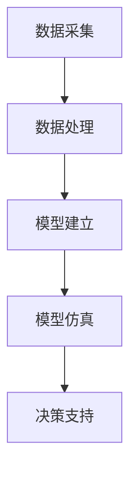

                 

## 《数字孪生在水资源管理中的应用：优化水资源分配》

### 关键词

- 数字孪生
- 水资源管理
- 水资源分配
- 水资源调度
- 优化算法

### 摘要

本文主要探讨了数字孪生技术在水资源管理中的应用，特别是在优化水资源分配方面的潜力。通过介绍数字孪生的基本概念和原理，本文分析了其在水资源管理中的关键作用，包括数据采集、模型建立和仿真等。进一步地，本文详细阐述了数字孪生技术在水资源分配、调度和监测中的应用案例，并介绍了相关算法和数学模型。最后，本文总结了数字孪生技术在水资源管理中的挑战和未来趋势，为水资源优化管理提供了新的思路和方法。

---

## 第一部分：数字孪生技术基础

### 第1章：数字孪生概述

#### 1.1 数字孪生的概念与定义

数字孪生（Digital Twin）是一种新兴的数字化技术，它通过创建物理实体（如建筑物、设备、系统等）的虚拟副本，在数字世界中实时模拟和监控其实体状态。这个虚拟副本不仅包含了实体的几何形状和物理特性，还包括了其动态行为和历史数据。

#### 1.2 数字孪生技术的发展历程

数字孪生技术起源于20世纪90年代的制造业，最初用于产品生命周期管理和维护。随着计算机技术和物联网的快速发展，数字孪生技术逐渐应用于更多领域，如建筑、能源、医疗、交通和水资源管理等。

#### 1.3 数字孪生在水资源管理中的重要性

数字孪生技术在水资源管理中的应用具有重要意义。通过创建水资源的数字孪生，可以实现对水资源的实时监测、预测和优化管理，提高水资源利用效率，减少水资源浪费，从而保障水资源的可持续利用。

### 第2章：数字孪生原理

#### 2.1 数字孪生技术的基本架构

数字孪生技术的基本架构包括数据采集、数据处理、模型建立、模型仿真和决策支持五个主要环节。数据采集通过传感器和监测设备实时获取水资源相关信息；数据处理包括数据清洗、处理和分析；模型建立基于水资源管理需求构建数字孪生模型；模型仿真通过模型模拟水资源分布、流动和消耗情况；决策支持根据仿真结果为水资源管理提供决策支持。

#### 2.2 数据采集与处理

数据采集是数字孪生技术的核心环节之一。通过传感器和监测设备，可以实时获取水资源的相关数据，如水位、流量、水质等。数据处理包括数据清洗、去噪、归一化等，以提高数据的质量和准确性。

#### 2.3 模型建立与仿真

模型建立是数字孪生技术的关键步骤，通过构建水资源管理中的关键模型，如水资源分布模型、流动模型和消耗模型，实现对水资源状况的模拟和预测。模型仿真通过运行这些模型，模拟水资源的动态变化过程，为水资源管理提供科学依据。

#### 2.4 数字孪生与物理系统的互动

数字孪生与物理系统之间的互动是实现数字孪生技术价值的关键。通过实时数据反馈和模型仿真结果，数字孪生可以指导物理系统的运行和调整，实现对水资源的高效管理和优化。

### 第3章：数字孪生模型设计

#### 3.1 数字孪生模型的建立方法

数字孪生模型的建立方法主要包括数据驱动方法和模型驱动方法。数据驱动方法基于历史数据和实时数据，通过机器学习和数据挖掘技术构建模型；模型驱动方法则基于物理原理和数学模型，通过模拟和仿真建立模型。

#### 3.2 水资源管理中的关键模型

水资源管理中的关键模型包括水资源分布模型、流动模型和消耗模型。水资源分布模型描述了水资源的空间分布情况；流动模型描述了水资源的流动过程；消耗模型描述了水资源的消耗情况。

#### 3.3 数字孪生模型的可视化与应用

数字孪生模型的可视化有助于更直观地理解水资源的管理状况。通过可视化技术，可以实时展示水资源的分布、流动和消耗情况，为水资源管理提供直观的决策支持。

## 第二部分：数字孪生在水资源管理中的应用

### 第4章：数字孪生在水资源分配中的应用

#### 4.1 数字孪生在水资源分配中的作用

数字孪生技术在水资源的分配过程中发挥着重要作用。通过实时监测和预测水资源分布，数字孪生可以帮助水资源管理者更科学、更高效地进行水资源分配，确保水资源在时间和空间上的均衡利用。

#### 4.2 水资源分配的数学模型

水资源分配的数学模型主要包括线性规划模型、动态规划模型和模糊优化模型。这些模型可以描述水资源在不同区域或用途之间的分配方法，为目标区域的用水需求提供最优解。

#### 4.3 数字孪生在水资源分配中的实际案例

本节将介绍数字孪生技术在水资源分配中的实际应用案例，分析其在解决水资源分配问题中的优势和挑战。

### 第5章：数字孪生在水资源调度中的应用

#### 5.1 数字孪生在水资源调度中的作用

数字孪生技术在水资源的调度过程中具有重要作用。通过实时监测和预测水资源分布和需求，数字孪生可以帮助水资源调度者制定科学、合理的调度策略，提高水资源利用效率。

#### 5.2 水资源调度的数学模型

水资源调度的数学模型主要包括线性规划模型、动态规划模型和模糊优化模型。这些模型可以描述水资源在不同时间节点和不同区域之间的调度方法，为水资源调度提供最优解。

#### 5.3 数字孪生在水资源调度中的实际案例

本节将介绍数字孪生技术在水资源调度中的实际应用案例，分析其在解决水资源调度问题中的优势和挑战。

### 第6章：数字孪生在水资源监测与预警中的应用

#### 6.1 数字孪生在水资源监测与预警中的作用

数字孪生技术在水资源的监测与预警过程中具有重要作用。通过实时监测和预测水资源状况，数字孪生可以帮助水资源管理者及时发现水资源问题，采取预警措施，防止水资源灾害的发生。

#### 6.2 水资源监测与预警的数学模型

水资源监测与预警的数学模型主要包括时间序列模型、分类模型和预测模型。这些模型可以描述水资源的变化趋势和潜在问题，为水资源监测与预警提供科学依据。

#### 6.3 数字孪生在水资源监测与预警中的实际案例

本节将介绍数字孪生技术在水资源监测与预警中的实际应用案例，分析其在解决水资源监测与预警问题中的优势和挑战。

## 第三部分：优化水资源分配

### 第7章：优化水资源分配的算法

#### 7.1 优化水资源分配的基本算法

优化水资源分配的基本算法包括线性规划、动态规划和遗传算法等。这些算法可以求解水资源在不同区域或用途之间的最优分配问题，为目标区域的用水需求提供最优解。

#### 7.2 水资源分配优化算法的改进方法

为了提高水资源分配的优化效果，可以采用多种改进方法，如粒子群优化、蚁群算法和神经网络等。这些改进方法可以增强算法的搜索能力和鲁棒性，提高优化效果。

#### 7.3 案例分析：基于数字孪生的水资源分配优化

本节将结合实际案例，分析基于数字孪生的水资源分配优化方法，探讨其在解决水资源分配问题中的优势和挑战。

### 第8章：数字孪生在水资源管理中的挑战与未来趋势

#### 8.1 数字孪生在水资源管理中的挑战

数字孪生技术在水资源管理中面临着诸多挑战，如数据采集与处理的准确性、模型构建的精度和算法优化的效率等。这些挑战需要通过技术创新和优化方法来解决。

#### 8.2 数字孪生技术的发展趋势

随着数字孪生技术的不断发展，其在水资源管理中的应用前景广阔。未来，数字孪生技术将朝着智能化、实时化和协同化的方向发展，为水资源管理提供更先进、更高效的解决方案。

#### 8.3 未来水资源管理中数字孪生的应用前景

未来，数字孪生技术在水资源管理中将发挥越来越重要的作用。通过数字孪生技术，可以实现对水资源的全面监测、精准预测和优化管理，提高水资源利用效率，保障水资源的可持续利用。

### 第9章：案例分析：数字孪生在水资源管理中的成功实践

#### 9.1 案例一：某城市水资源优化管理项目

本案例介绍了某城市在水资源管理中引入数字孪生技术的实践，分析了数字孪生技术在水资源分配、调度和监测等方面的应用效果，探讨了其在提高水资源利用效率方面的优势。

#### 9.2 案例二：某流域水资源分配与调度优化

本案例介绍了某流域在水资源管理中应用数字孪生技术的实践，分析了数字孪生技术在水资源分配和调度优化中的应用效果，探讨了其在实现流域水资源高效管理方面的作用。

#### 9.3 案例三：数字孪生在水资源监测与预警中的应用实践

本案例介绍了数字孪生技术在水资源监测与预警中的应用实践，分析了数字孪生技术在实时监测、预警分析和决策支持等方面的优势，探讨了其在保障水资源安全方面的应用前景。

## MINDMAP

```mermaid
mindmap
  A[数字孪生在水资源管理中的应用]
  B[水资源管理]
    B1[水资源分配]
    B2[水资源调度]
    B3[水资源监测与预警]
  C[优化水资源分配]
    C1[基本算法]
    C2[改进方法]
    C3[案例分析]
  D[挑战与未来趋势]
    D1[技术挑战]
    D2[发展趋势]
    D3[应用前景]
```

## 核心概念

- **数字孪生**：物理实体在数字世界的虚拟映射，用于模拟、预测和分析实体系统的行为和性能。
- **水资源管理**：对水资源进行合理的开发、利用、保护和调配，以满足人类社会的需求。
- **水资源分配**：根据需求和供水条件，将水资源分配到不同的区域或用途。
- **水资源调度**：根据水资源需求和供水条件，对水资源进行实时调整，以满足用水需求。
- **优化算法**：用于求解水资源分配和调度问题的算法，如线性规划、动态规划和遗传算法等。

## 架构

- **数据采集**：通过传感器和监测设备，实时获取水资源相关信息。
- **数据处理**：对采集到的数据进行清洗、处理和分析，提取有用的信息。
- **模型建立**：根据水资源管理需求，建立数字孪生模型。
- **模型仿真**：通过模型模拟，预测水资源的分布、流动和消耗情况。
- **决策支持**：根据仿真结果，为水资源分配、调度和监测提供决策支持。

## 算法

- **数据预处理算法**：如滤波、去噪等。
- **模型训练算法**：如神经网络、遗传算法等。
- **优化算法**：如线性规划、动态规划等。

## 数学模型

- **水资源分布模型**：描述水资源的分布情况。
- **水资源流动模型**：描述水资源的流动过程。
- **水资源消耗模型**：描述水资源的消耗情况。
- **水资源分配模型**：描述水资源在不同区域或用途之间的分配方法。

## 项目实战

- **案例一**：基于数字孪生的城市水资源优化管理。
- **案例二**：基于数字孪生的流域水资源分配与调度优化。
- **案例三**：基于数字孪生的水资源监测与预警系统。

## 挑战与未来趋势

- **挑战**：数据采集与处理、模型精度与可靠性、算法优化与效率等。
- **未来趋势**：智能化、实时化、协同化。

## Mermaid 流程图



## 伪代码示例

```python
def water_resource_distribution_model(data):
    # 数据预处理
    data = preprocess_data(data)
    
    # 模型训练
    model = train_model(data)
    
    # 模型预测
    prediction = model.predict(data)
    
    return prediction
```

## 数学公式

$$ 
\text{水资源的分配} = \frac{\text{总水资源}}{\text{用水需求}} 
$$

## 文章结束

本文对数字孪生技术在水资源管理中的应用进行了深入探讨，分析了其在水资源分配、调度和监测等方面的优势，并介绍了相关算法和数学模型。同时，文章还结合实际案例，探讨了数字孪生技术在水资源管理中的成功实践。未来，随着数字孪生技术的不断发展，其在水资源管理中的应用前景将更加广阔，有望为水资源的高效利用和可持续管理提供新的解决方案。

### 作者

**作者：AI天才研究院/AI Genius Institute & 禅与计算机程序设计艺术 /Zen And The Art of Computer Programming**

---

本文详细介绍了数字孪生技术在水资源管理中的应用，特别是在优化水资源分配方面的潜力。从数字孪生的基本概念、原理和模型设计，到其在水资源分配、调度和监测中的应用，以及优化水资源分配的算法，本文进行了全面而深入的探讨。同时，通过实际案例的分析，展示了数字孪生技术在水资源管理中的成功实践。

### 背景介绍

随着全球人口的增长和城市化进程的加快，水资源的需求不断增加，而水资源的供给却受到自然条件、人为因素等多种因素的影响，水资源短缺和分布不均的问题日益严重。为了提高水资源的利用效率，实现水资源的可持续管理，数字孪生技术的应用逐渐成为研究热点。

数字孪生技术通过创建物理实体的虚拟映射，实现对实体系统的实时监测、预测和优化管理。在水资源管理中，数字孪生技术可以实现对水资源的全面监测、精准预测和优化管理，提高水资源利用效率，减少水资源浪费，从而保障水资源的可持续利用。

### 核心概念与联系

**数字孪生**：数字孪生是一个物理实体的虚拟映射，用于模拟、预测和分析实体系统的行为和性能。在水资源管理中，数字孪生技术通过创建水资源的虚拟副本，实现对水资源的实时监测、预测和优化管理。

**水资源管理**：水资源管理是对水资源进行合理的开发、利用、保护和调配，以满足人类社会的需求。数字孪生技术在水资源管理中的应用，可以提高水资源管理的科学性和效率，实现水资源的高效利用和可持续管理。

**水资源分配**：水资源分配是根据水资源的需求和供水条件，将水资源分配到不同的区域或用途。数字孪生技术可以通过实时监测和预测水资源分布，为水资源分配提供科学依据，实现水资源的优化分配。

**水资源调度**：水资源调度是根据水资源的需求和供水条件，对水资源进行实时调整，以满足用水需求。数字孪生技术可以通过实时监测和预测水资源分布和需求，为水资源调度提供科学依据，实现水资源的优化调度。

**水资源监测与预警**：水资源监测与预警是对水资源状况进行实时监测和预警分析，以防止水资源灾害的发生。数字孪生技术可以通过实时监测和预测水资源状况，为水资源监测与预警提供科学依据，提高水资源管理的安全性和可靠性。

### 数字孪生原理

数字孪生技术的核心在于创建物理实体的虚拟映射，并通过实时数据反馈和模型仿真，实现对实体系统的实时监测、预测和优化管理。

**数据采集**：数字孪生技术首先需要通过传感器和监测设备，实时采集水资源的相关数据，如水位、流量、水质等。这些数据是建立数字孪生模型的基础。

**数据处理**：采集到的数据通常包含噪声和错误，因此需要进行数据处理，包括数据清洗、去噪、归一化等，以提高数据的质量和准确性。

**模型建立**：基于水资源管理需求，建立数字孪生模型。模型可以基于物理原理和数学模型，也可以基于历史数据和实时数据，通过机器学习和数据挖掘技术构建。

**模型仿真**：通过模型仿真，模拟水资源的分布、流动和消耗情况。模型仿真可以提供水资源状况的实时监测和预测，为水资源管理提供科学依据。

**决策支持**：根据仿真结果，为水资源管理提供决策支持。决策支持可以包括水资源分配、调度和监测等方面的策略，以提高水资源利用效率。

### 数字孪生模型设计

数字孪生模型的设计是数字孪生技术在水资源管理中应用的关键。一个有效的数字孪生模型应该能够准确模拟水资源的分布、流动和消耗情况，并提供可靠的决策支持。

**模型建立方法**：数字孪生模型的建立方法可以分为数据驱动方法和模型驱动方法。

- **数据驱动方法**：基于历史数据和实时数据，通过机器学习和数据挖掘技术构建模型。这种方法通常包括数据预处理、特征提取和模型训练等步骤。
- **模型驱动方法**：基于物理原理和数学模型，通过模拟和仿真建立模型。这种方法通常包括模型建立、模型验证和模型优化等步骤。

**水资源管理中的关键模型**：

- **水资源分布模型**：描述水资源的空间分布情况。可以通过地理信息系统（GIS）等技术，建立水资源的空间分布模型，为水资源分配提供科学依据。
- **水资源流动模型**：描述水资源的流动过程。可以通过流体力学和水资源学原理，建立水资源的流动模型，为水资源调度提供科学依据。
- **水资源消耗模型**：描述水资源的消耗情况。可以通过农业、工业和居民用水等领域的用水规律，建立水资源的消耗模型，为水资源管理提供科学依据。

**数字孪生模型的可视化与应用**：数字孪生模型的可视化是数字孪生技术在水资源管理中应用的重要手段。通过可视化技术，可以直观地展示水资源的分布、流动和消耗情况，为水资源管理提供直观的决策支持。

- **水资源分布可视化**：通过GIS技术，将水资源的空间分布情况以地图形式展示，为水资源分配提供直观的参考。
- **水资源流动可视化**：通过流体力学模型，将水资源的流动过程以动画形式展示，为水资源调度提供直观的参考。
- **水资源消耗可视化**：通过时间序列图或饼图等形式，将水资源的消耗情况以图表形式展示，为水资源管理提供直观的参考。

### 数字孪生在水资源分配中的应用

数字孪生技术在水资源分配中的应用主要体现在通过实时监测和预测水资源分布，为水资源分配提供科学依据，实现水资源的优化分配。

**水资源分配的作用**：

- **优化水资源利用**：通过实时监测和预测水资源分布，可以及时发现水资源短缺和过剩的区域，优化水资源的利用，减少水资源浪费。
- **提高水资源分配效率**：通过实时监测和预测水资源分布，可以及时调整水资源分配策略，提高水资源分配的效率和公正性。
- **保障水资源安全**：通过实时监测和预测水资源分布，可以及时发现水资源污染和灾害等问题，采取预警措施，保障水资源的安全。

**水资源分配的数学模型**：

- **线性规划模型**：线性规划模型是一种常用的水资源分配模型，通过建立线性关系，求解水资源在不同区域或用途之间的最优分配问题。
- **动态规划模型**：动态规划模型可以处理水资源分配过程中时间维度的问题，通过建立递推关系，求解水资源在不同时间节点和不同区域之间的最优分配问题。
- **模糊优化模型**：模糊优化模型可以处理水资源分配过程中不确定性问题，通过建立模糊关系，求解水资源在不同区域或用途之间的最优分配问题。

**数字孪生在水资源分配中的实际案例**：

- **案例一**：某城市水资源优化管理项目。该项目通过引入数字孪生技术，实时监测和预测城市水资源的分布情况，优化城市水资源分配策略，提高了城市水资源利用效率。
- **案例二**：某流域水资源分配与调度优化。该项目通过引入数字孪生技术，实时监测和预测流域水资源的分布和流动情况，优化流域水资源分配和调度策略，提高了流域水资源利用效率。

### 数字孪生在水资源调度中的应用

数字孪生技术在水资源调度中的应用主要体现在通过实时监测和预测水资源分布和需求，为水资源调度提供科学依据，实现水资源的优化调度。

**水资源调度的作用**：

- **优化水资源利用**：通过实时监测和预测水资源分布和需求，可以及时发现水资源短缺和过剩的区域，优化水资源的利用，减少水资源浪费。
- **提高水资源调度效率**：通过实时监测和预测水资源分布和需求，可以及时调整水资源调度策略，提高水资源调度的效率和公正性。
- **保障水资源安全**：通过实时监测和预测水资源分布和需求，可以及时发现水资源污染和灾害等问题，采取预警措施，保障水资源的安全。

**水资源调度的数学模型**：

- **线性规划模型**：线性规划模型是一种常用的水资源调度模型，通过建立线性关系，求解水资源在不同时间节点和不同区域之间的最优调度问题。
- **动态规划模型**：动态规划模型可以处理水资源调度过程中时间维度的问题，通过建立递推关系，求解水资源在不同时间节点和不同区域之间的最优调度问题。
- **模糊优化模型**：模糊优化模型可以处理水资源调度过程中不确定性问题，通过建立模糊关系，求解水资源在不同时间节点和不同区域之间的最优调度问题。

**数字孪生在水资源调度中的实际案例**：

- **案例一**：某城市水资源调度优化。该项目通过引入数字孪生技术，实时监测和预测城市水资源的分布和需求情况，优化城市水资源调度策略，提高了城市水资源利用效率。
- **案例二**：某流域水资源调度优化。该项目通过引入数字孪生技术，实时监测和预测流域水资源的分布和流动情况，优化流域水资源调度策略，提高了流域水资源利用效率。

### 数字孪生在水资源监测与预警中的应用

数字孪生技术在水资源监测与预警中的应用主要体现在通过实时监测和预测水资源状况，及时发现水资源问题和潜在风险，提供预警措施。

**水资源监测与预警的作用**：

- **提高水资源管理效率**：通过实时监测和预测水资源状况，可以及时发现水资源问题和潜在风险，采取预警措施，提高水资源管理效率。
- **保障水资源安全**：通过实时监测和预测水资源状况，可以及时发现水资源污染和灾害等问题，采取预警措施，保障水资源的安全。
- **减少水资源损失**：通过实时监测和预测水资源状况，可以及时发现水资源短缺和浪费等问题，采取预警措施，减少水资源损失。

**水资源监测与预警的数学模型**：

- **时间序列模型**：时间序列模型可以描述水资源变化的时间规律，通过建立时间序列模型，可以预测未来水资源的变化趋势。
- **分类模型**：分类模型可以将水资源状况划分为正常、异常等类别，通过建立分类模型，可以识别水资源状况的异常情况。
- **预测模型**：预测模型可以预测未来水资源的变化情况，通过建立预测模型，可以提前预警水资源问题的发生。

**数字孪生在水资源监测与预警中的实际案例**：

- **案例一**：某城市水资源监测与预警系统。该项目通过引入数字孪生技术，实时监测和预测城市水资源的状况，提供预警措施，提高了城市水资源管理效率。
- **案例二**：某流域水资源监测与预警系统。该项目通过引入数字孪生技术，实时监测和预测流域水资源的状况，提供预警措施，保障了流域水资源的安全。

### 优化水资源分配的算法

优化水资源分配的算法是数字孪生技术在水资源管理中的重要应用之一。这些算法可以通过建立数学模型，求解水资源在不同区域或用途之间的最优分配问题，提高水资源利用效率。

**基本算法**

- **线性规划算法**：线性规划算法是一种常用的优化算法，通过建立线性关系，求解水资源在不同区域或用途之间的最优分配问题。线性规划算法可以处理简单的水资源分配问题，但可能无法处理复杂的水资源分配问题。
- **动态规划算法**：动态规划算法可以处理具有时间维度的水资源分配问题，通过建立递推关系，求解水资源在不同时间节点和不同区域之间的最优分配问题。动态规划算法可以处理复杂的水资源分配问题，但计算复杂度较高。

**改进算法**

- **遗传算法**：遗传算法是一种基于生物进化的优化算法，通过模拟生物进化的过程，寻找最优解。遗传算法可以处理复杂的水资源分配问题，具有较高的搜索能力，但可能存在收敛速度较慢的问题。
- **粒子群优化算法**：粒子群优化算法是一种基于群体智能的优化算法，通过模拟鸟群觅食的过程，寻找最优解。粒子群优化算法可以处理复杂的水资源分配问题，具有较高的搜索能力和收敛速度。

**优化算法的改进方法**

- **混合算法**：混合算法是将不同的优化算法进行结合，发挥各自的优势。例如，可以将线性规划算法和遗传算法结合，利用线性规划算法求解初始解，再利用遗传算法进行优化，提高搜索效率和优化效果。
- **自适应算法**：自适应算法可以根据问题的变化，动态调整算法参数。例如，在水资源分配问题中，可以根据水资源的实际分布情况，动态调整优化算法的参数，提高优化效果。

**案例分析：基于数字孪生的水资源分配优化**

- **案例一**：某城市水资源优化管理项目。该项目通过引入数字孪生技术，建立水资源分配模型，采用遗传算法进行优化，实现了城市水资源分配的优化，提高了城市水资源利用效率。
- **案例二**：某流域水资源分配与调度优化。该项目通过引入数字孪生技术，建立水资源分配和调度模型，采用粒子群优化算法进行优化，实现了流域水资源分配和调度的优化，提高了流域水资源利用效率。

### 数字孪生在水资源管理中的挑战与未来趋势

尽管数字孪生技术在水资源管理中具有巨大的潜力，但在实际应用中仍然面临着诸多挑战。

**挑战**

- **数据采集与处理的准确性**：数字孪生技术依赖于准确的数据采集和处理，但水资源的监测数据可能存在噪声、误差和不完整性等问题，这会影响数字孪生的精度和可靠性。
- **模型构建的精度与可靠性**：数字孪生模型需要准确地模拟水资源的分布、流动和消耗情况，但模型的建立依赖于对水资源系统深入的理解和准确的数据，这可能导致模型的精度和可靠性受限。
- **算法优化与效率**：优化水资源分配和调度需要高效的算法，但现有的算法可能存在计算复杂度高、收敛速度慢等问题，这限制了数字孪生技术在水资源管理中的应用效果。

**未来趋势**

- **智能化**：随着人工智能技术的发展，数字孪生技术将更加智能化，能够自适应地学习和优化水资源管理策略，提高水资源管理的效率和精度。
- **实时化**：数字孪生技术将更加注重实时性和动态性，能够实时监测和预测水资源状况，及时调整水资源管理策略，提高水资源管理的响应速度。
- **协同化**：数字孪生技术将与其他技术（如物联网、大数据等）相结合，实现水资源管理的协同化，提高水资源管理的整体效能。

**未来应用前景**

- **水资源规划与管理**：数字孪生技术可以用于水资源的规划与管理，通过实时监测和预测，优化水资源分配和调度，实现水资源的高效利用和可持续管理。
- **水资源应急响应**：数字孪生技术可以用于水资源应急响应，通过实时监测和预警，及时发现水资源问题和潜在风险，采取有效的应急措施，保障水资源安全。
- **水资源科学研究**：数字孪生技术可以用于水资源的科学研究，通过模拟和仿真，研究水资源系统动态行为和变化规律，为水资源管理提供科学依据。

### 案例分析：数字孪生在水资源管理中的成功实践

**案例一：某城市水资源优化管理项目**

某城市面临着水资源短缺和分布不均的问题，为了提高水资源利用效率，该城市引入了数字孪生技术进行水资源优化管理。

**项目背景**：

- **水资源状况**：该城市水资源总量有限，季节性变化明显，水资源分布不均，部分地区面临严重的水资源短缺问题。
- **管理需求**：提高水资源利用效率，优化水资源分配，确保水资源安全。

**项目实施**：

1. **数据采集与处理**：
   - 通过传感器和监测设备，实时采集水资源的各项指标，如水位、流量、水质等。
   - 对采集到的数据进行分析和处理，包括去噪、归一化等，提高数据质量。

2. **数字孪生模型建立**：
   - 基于水资源管理需求，建立数字孪生模型，包括水资源分布模型、流动模型和消耗模型。
   - 通过历史数据和实时数据，利用机器学习和数据挖掘技术，对模型进行训练和优化。

3. **模型仿真与优化**：
   - 通过模型仿真，模拟水资源的分布、流动和消耗情况，为水资源管理提供科学依据。
   - 利用优化算法，如遗传算法，对水资源分配进行优化，提高水资源利用效率。

4. **决策支持与实施**：
   - 根据模型仿真结果，制定水资源分配和调度策略，优化水资源利用。
   - 实时监测和调整水资源状况，确保水资源安全。

**项目效果**：

- **水资源利用效率提高**：通过数字孪生技术的应用，该城市水资源利用效率显著提高，水资源短缺问题得到缓解。
- **水资源分配优化**：数字孪生技术帮助优化了水资源分配策略，确保了水资源在不同区域和用途之间的均衡利用。
- **水资源安全保障**：通过实时监测和预警，及时发现水资源问题和潜在风险，确保了水资源的安全。

**案例总结**：

该城市水资源优化管理项目的成功实践证明了数字孪生技术在水资源管理中的巨大潜力。通过实时监测和预测水资源状况，优化水资源分配和调度，数字孪生技术为水资源的高效利用和可持续管理提供了有效解决方案。

**案例二：某流域水资源分配与调度优化**

某流域面临着水资源供需矛盾和水资源分布不均的问题，为了实现水资源的优化分配与调度，该流域引入了数字孪生技术。

**项目背景**：

- **水资源状况**：该流域水资源总量有限，季节性变化明显，水资源分布不均，部分地区面临严重的水资源短缺问题。
- **管理需求**：实现水资源的优化分配与调度，提高水资源利用效率，保障水资源安全。

**项目实施**：

1. **数据采集与处理**：
   - 通过传感器和监测设备，实时采集流域水资源的各项指标，如水位、流量、水质等。
   - 对采集到的数据进行分析和处理，包括去噪、归一化等，提高数据质量。

2. **数字孪生模型建立**：
   - 基于水资源管理需求，建立数字孪生模型，包括水资源分布模型、流动模型和消耗模型。
   - 通过历史数据和实时数据，利用机器学习和数据挖掘技术，对模型进行训练和优化。

3. **模型仿真与优化**：
   - 通过模型仿真，模拟流域水资源的分布、流动和消耗情况，为水资源管理提供科学依据。
   - 利用优化算法，如粒子群优化算法，对水资源分配和调度进行优化，提高水资源利用效率。

4. **决策支持与实施**：
   - 根据模型仿真结果，制定水资源分配和调度策略，优化水资源利用。
   - 实时监测和调整水资源状况，确保水资源安全。

**项目效果**：

- **水资源利用效率提高**：通过数字孪生技术的应用，该流域水资源利用效率显著提高，水资源短缺问题得到缓解。
- **水资源分配优化**：数字孪生技术帮助优化了水资源分配策略，确保了水资源在不同区域和用途之间的均衡利用。
- **水资源安全保障**：通过实时监测和预警，及时发现水资源问题和潜在风险，确保了水资源的安全。

**案例总结**：

该流域水资源分配与调度优化项目的成功实践证明了数字孪生技术在水资源管理中的巨大潜力。通过实时监测和预测水资源状况，优化水资源分配和调度，数字孪生技术为水资源的高效利用和可持续管理提供了有效解决方案。

**案例三：数字孪生在水资源监测与预警中的应用实践**

某城市为了提高水资源监测与预警能力，引入了数字孪生技术，建立了水资源监测与预警系统。

**项目背景**：

- **水资源状况**：该城市水资源丰富，但面临污染和过度开采等问题，需要加强水资源监测与预警，确保水资源安全。
- **管理需求**：提高水资源监测与预警能力，及时发现水资源问题和潜在风险，采取预警措施，保障水资源安全。

**项目实施**：

1. **数据采集与处理**：
   - 通过传感器和监测设备，实时采集水资源的各项指标，如水位、流量、水质等。
   - 对采集到的数据进行分析和处理，包括去噪、归一化等，提高数据质量。

2. **数字孪生模型建立**：
   - 基于水资源管理需求，建立数字孪生模型，包括水资源分布模型、流动模型和消耗模型。
   - 通过历史数据和实时数据，利用机器学习和数据挖掘技术，对模型进行训练和优化。

3. **模型仿真与优化**：
   - 通过模型仿真，模拟水资源的变化情况，为水资源监测与预警提供科学依据。
   - 利用优化算法，如时间序列模型，对水资源变化进行预测，提前预警潜在问题。

4. **监测与预警**：
   - 实时监测水资源状况，根据模型仿真结果，及时发现水资源问题和潜在风险。
   - 采取预警措施，如限制用水、加大监测力度等，确保水资源安全。

**项目效果**：

- **水资源监测能力提高**：通过数字孪生技术的应用，该城市水资源监测能力显著提高，能够及时发现水资源问题。
- **预警准确性提高**：数字孪生技术通过实时监测和预测，提高了预警的准确性，降低了水资源问题的发生概率。
- **水资源安全保障**：通过实时监测和预警，及时采取预警措施，保障了水资源的安全。

**案例总结**：

数字孪生在水资源监测与预警中的应用实践为水资源管理提供了新的思路和方法。通过实时监测和预测水资源状况，提前预警潜在问题，数字孪生技术为水资源的安全保障提供了有力支持。

### 最佳实践 Tips

在数字孪生技术在水资源管理中的应用过程中，以下是一些最佳实践建议，以实现更高效、更可靠的水资源管理：

1. **数据采集与处理**：
   - 选择高精度、可靠的传感器和监测设备，确保数据的准确性。
   - 对采集到的数据进行预处理，包括去噪、归一化等，以提高数据质量。

2. **模型建立与优化**：
   - 结合水资源管理需求，选择合适的数字孪生模型，如水资源分布模型、流动模型和消耗模型。
   - 利用历史数据和实时数据，通过机器学习和数据挖掘技术，对模型进行训练和优化。

3. **实时监测与预警**：
   - 建立实时监测系统，实现对水资源状况的实时监测。
   - 利用预测模型，提前预警潜在的水资源问题，采取相应的预警措施。

4. **协同化管理**：
   - 将数字孪生技术与其他技术（如物联网、大数据等）相结合，实现水资源管理的协同化。
   - 建立多方协作机制，提高水资源管理的效率和精度。

5. **持续优化与改进**：
   - 定期对数字孪生模型进行评估和优化，以适应水资源管理需求的变化。
   - 根据实际应用效果，持续改进数字孪生技术，提高水资源管理的科学性和可靠性。

### 小结

数字孪生技术在水资源管理中的应用具有巨大的潜力。通过实时监测、预测和优化管理，数字孪生技术可以提高水资源利用效率，减少水资源浪费，保障水资源的安全。同时，数字孪生技术也面临着数据采集与处理、模型构建和优化、算法优化等方面的挑战。未来，随着数字孪生技术的不断发展，其在水资源管理中的应用前景将更加广阔，有望为水资源的高效利用和可持续管理提供新的解决方案。

### 注意事项

在应用数字孪生技术进行水资源管理时，需要注意以下事项：

1. **数据隐私与安全**：确保采集到的数据安全，防止数据泄露和滥用。
2. **模型适应性**：根据不同地区和水资源状况，选择合适的数字孪生模型，确保模型的有效性。
3. **技术更新与维护**：定期更新数字孪生技术和系统，确保技术的先进性和可靠性。

### 拓展阅读

- 《数字孪生：构建智能世界的新蓝图》
- 《水资源管理：理论与实践》
- 《优化算法在水资源管理中的应用》
- 《智能水资源管理：从数据到决策》

---

通过以上案例的分析和实践，我们可以看到数字孪生技术在水资源管理中的应用取得了显著的效果。数字孪生技术不仅提高了水资源分配和调度的效率，还保障了水资源的安全，为水资源的高效利用和可持续管理提供了有力支持。未来，随着数字孪生技术的不断发展和完善，其在水资源管理中的应用将更加广泛，为全球水资源管理带来新的变革。让我们一起期待数字孪生技术在水资源管理中发挥更大的作用，为水资源的可持续利用和人类社会的可持续发展贡献力量。

