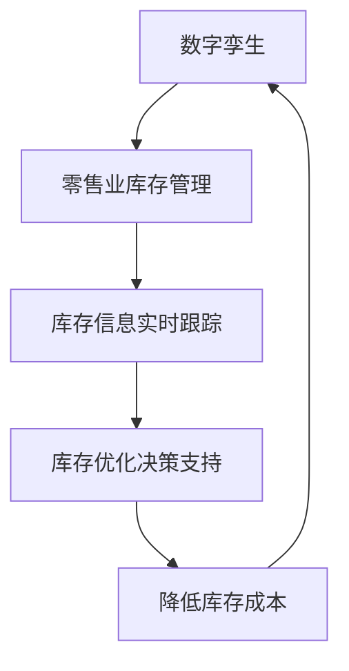

                 

# 数字孪生在零售业中的应用：优化库存管理

> 关键词：数字孪生、零售业、库存管理、预测算法、优化算法

> 摘要：本文将探讨数字孪生在零售业中的应用，特别是在优化库存管理方面的潜力。通过分析核心概念、算法原理和数学模型，结合实际项目案例，本文旨在为读者提供一个全面的技术解析。

## 引言

在当今的零售行业中，库存管理是一个至关重要的环节。不当的库存管理可能导致库存过剩或短缺，从而影响企业的运营效率和客户满意度。随着大数据和人工智能技术的快速发展，数字孪生作为一种创新的解决方案，为零售业的库存管理带来了全新的可能性。本文将深入探讨数字孪生在零售业中的应用，特别是在优化库存管理方面的具体措施和效果。

## 核心概念与联系

### 数字孪生

数字孪生是一种基于物联网、大数据和仿真技术的创新方法，旨在创建一个虚拟的、数字化的实体副本，用以模拟和分析物理实体。在零售业中，数字孪生可以模拟实际的库存系统，为库存管理提供精确的数据支持和决策依据。

### 零售业库存管理

零售业库存管理涉及对商品库存的监控、预测和优化。传统的库存管理方法主要依赖于手工记录和经验判断，而现代的库存管理则依赖于数字化技术和数据分析。

### 数字孪生与库存管理的联系

数字孪生在库存管理中的应用主要体现在以下几个方面：

1. **实时监控**：通过数字孪生模型，零售商可以实时监控库存变化，及时发现异常情况。
2. **预测需求**：数字孪生可以利用历史数据和算法模型，预测未来的库存需求，帮助零售商做出更准确的库存决策。
3. **优化库存**：数字孪生可以模拟不同的库存策略，评估其效果，从而帮助零售商找到最优的库存管理方案。
4. **降低成本**：通过精确的库存管理，零售商可以减少库存过剩或短缺的情况，降低库存成本。

### Mermaid流程图

下面是一个Mermaid流程图，展示了数字孪生和库存管理之间的联系：



## 核心算法原理讲解

### 预测算法

在数字孪生中，预测算法是核心组件之一。它用于预测未来的库存需求，为库存管理提供数据支持。以下是一个简单的预测算法伪代码：

```python
# 预测算法伪代码

def predict_inventory(current_inventory, historical_data):
    # 输入：当前库存水平（current_inventory）、历史库存数据（historical_data）
    # 输出：预测的未来库存水平
    
    # 1. 分析历史数据，提取库存变化趋势
    trend = analyze_trend(historical_data)
    
    # 2. 根据库存趋势和当前库存水平，预测未来库存
    predicted_inventory = current_inventory + trend
    
    # 3. 返回预测结果
    return predicted_inventory
```

### 优化算法

优化算法用于确定最佳的库存策略，以最小化库存成本。以下是一个简单的优化算法伪代码：

```python
# 优化算法伪代码

def optimize_inventory(predicted_inventory, cost_function):
    # 输入：预测的未来库存水平（predicted_inventory）、成本函数（cost_function）
    # 输出：最优库存策略
    
    # 1. 定义目标函数，用于评估不同的库存策略
    objective_function = lambda x: cost_function(predicted_inventory, x)
    
    # 2. 使用优化算法，如线性规划、遗传算法等，找到最优解
    optimal_strategy = optimize(objective_function)
    
    # 3. 返回最优库存策略
    return optimal_strategy
```

## 数学模型和数学公式

### 需求预测模型

需求预测模型用于预测未来的库存需求。以下是一个需求预测模型：

$$
\text{需求预测模型} = f(\text{历史需求数据}, \text{市场环境变量})
$$

其中，$f$ 代表预测函数，它将历史需求数据和市场环境变量作为输入，输出未来需求量的预测值。

### 库存优化模型

库存优化模型用于确定最佳的库存策略。以下是一个库存优化模型：

$$
\text{库存优化模型} = \min_{x} \sum_{i=1}^{n} c_{i} x_{i}
$$

其中，$x_{i}$ 代表第 $i$ 项库存的成本，$c_{i}$ 代表第 $i$ 项库存的权重，目标是最小化总库存成本。

## 项目实战

### 项目名称

基于数字孪生的智能库存管理系统

### 项目目标

通过构建数字孪生模型，实现对零售店库存的实时监控和优化，降低库存成本。

### 项目步骤

1. **数据收集**：收集零售店的库存数据、销售数据、市场环境数据等。
2. **构建数字孪生模型**：使用历史数据训练预测算法和优化算法，构建数字孪生模型。
3. **实时监控与预测**：通过数字孪生模型，实时监控库存变化，预测未来的库存水平。
4. **优化库存策略**：根据预测结果，调整库存策略，实现库存的优化。
5. **系统部署与维护**：将智能库存管理系统部署到零售店，进行实时监控和优化，持续维护系统。

### 代码实现与解读

```python
# 数据收集
data = collect_data()

# 构建数字孪生模型
model = build.digital twin.model(data)

# 实时监控与预测
while True:
    current_inventory = get_current_inventory()
    predicted_inventory = model.predict(current_inventory)
    
    # 优化库存策略
    optimal_inventory = model.optimize(predicted_inventory)
    
    # 更新库存
    update_inventory(optimal_inventory)

    # 持续监控
    time.sleep(prediction_interval)
```

### 项目小结

通过实际项目案例，我们可以看到数字孪生在零售业库存管理中的应用具有很大的潜力。数字孪生模型可以帮助零售商实现实时监控、需求预测和库存优化，从而降低库存成本，提高运营效率。

## 最佳实践 tips

1. **数据质量**：确保收集的数据质量高，这对于预测和优化的准确性至关重要。
2. **算法选择**：根据业务需求和数据特点，选择合适的预测和优化算法。
3. **系统维护**：定期更新和维护数字孪生模型，以适应市场的变化。

## 小结

数字孪生在零售业中的应用，特别是在库存管理方面，展示出了巨大的潜力。通过构建数字孪生模型，零售商可以实现实时监控、需求预测和库存优化，从而降低库存成本，提高运营效率。未来，随着技术的不断发展，数字孪生在零售业中的应用将更加广泛和深入。

## 作者信息

作者：AI天才研究院/AI Genius Institute & 禅与计算机程序设计艺术 /Zen And The Art of Computer Programming

