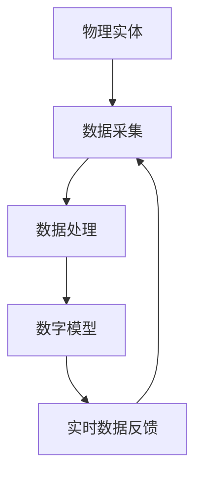
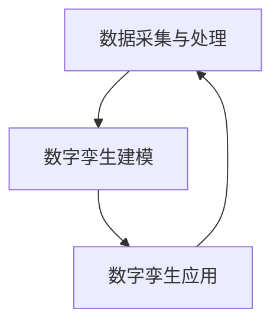

                 

# 数字孪生技术在智慧医院管理中的应用

## 关键词
数字孪生，智慧医院，管理应用，技术架构，算法原理，数据采集，数据处理，患者管理，医疗资源管理，医疗质量与安全，医院运营管理，发展趋势

## 摘要
本文探讨了数字孪生技术在智慧医院管理中的应用，首先介绍了数字孪生技术的基础概念和其在医疗领域的应用前景，随后详细阐述了数字孪生技术的架构，包括数据采集与处理、数字孪生建模和应用等环节。接着，本文聚焦于智慧医院管理的具体应用，分别从患者管理、医疗资源管理、医疗质量与安全和医院运营管理等方面，展示了数字孪生技术的实际应用案例。最后，对数字孪生技术在未来智慧医院管理中的发展趋势进行了展望。

## 引言

随着信息技术的飞速发展，医疗行业正经历着一场深刻的变革。传统的医院管理模式已经无法满足现代医疗的需求，智慧医院的概念应运而生。智慧医院是指通过信息技术手段，实现医疗资源的优化配置、医疗服务流程的优化以及患者体验的提升。数字孪生技术作为一种先进的信息技术，其与智慧医院的结合，为医院管理提供了新的思路和方法。

数字孪生技术通过建立一个与物理实体高度相似的数字模型，实时反映实体的运行状态，从而实现对实体的监控、预测和优化。在智慧医院管理中，数字孪生技术可以应用于患者管理、医疗资源管理、医疗质量与安全和医院运营管理等多个方面，提高医院的管理效率和服务质量。

本文将首先介绍数字孪生技术的基础概念和其在医疗领域的应用前景，随后详细阐述数字孪生技术的架构，包括数据采集与处理、数字孪生建模和应用等环节。接着，本文将分别从患者管理、医疗资源管理、医疗质量与安全和医院运营管理等方面，展示数字孪生技术的实际应用案例。最后，对数字孪生技术在未来智慧医院管理中的发展趋势进行展望。

## 数字孪生技术概述

### 核心概念与联系

数字孪生技术（Digital Twin Technology）是一种通过数字模型来模拟和反映物理实体的技术。其核心概念包括三个主要组成部分：物理实体、数字模型和实时数据。

- **物理实体**：指现实世界中的实际物体或系统，如患者、医疗设备和医院设施等。
- **数字模型**：指通过数字化手段建立的与物理实体相对应的虚拟模型，包括结构、功能和状态等。
- **实时数据**：指通过传感器、监测设备和信息系统等实时收集的物理实体的运行数据。

这三者之间的关系可以用一个Mermaid流程图来表示：



在这个流程图中，物理实体通过数据采集模块实时收集数据，经过数据处理模块处理后，输入到数字模型中，数字模型根据实时数据进行模拟和预测，并将结果反馈给物理实体，实现闭环控制。

### 数字孪生技术的发展历程

数字孪生技术的概念最早可以追溯到2002年，由美国密歇根大学的研究员Michael Grieves首次提出。早期的数字孪生技术主要应用于航空航天领域，用于模拟和预测飞行器的运行状态。

随着信息技术的不断发展，数字孪生技术的应用范围逐渐扩大。2010年，美国国家航空航天局（NASA）提出了“数字地球”计划，将数字孪生技术应用于地球科学领域。随后，数字孪生技术逐渐渗透到制造业、交通运输、建筑和医疗等多个领域。

在医疗领域，数字孪生技术的应用始于2016年，当时美国梅奥诊所（Mayo Clinic）首次提出将数字孪生技术应用于患者管理。自此以后，数字孪生技术在医疗领域的应用逐渐增多，涉及患者管理、医疗设备管理、医院设施管理和医疗质量与安全等多个方面。

### 数字孪生技术在医疗领域的应用前景

数字孪生技术在医疗领域的应用前景非常广阔。首先，在患者管理方面，数字孪生技术可以通过建立患者数字模型，实时反映患者的健康状况，为医生提供精准的治疗方案。其次，在医疗设备管理方面，数字孪生技术可以模拟和预测医疗设备的运行状态，提前发现设备故障，降低设备故障率。

此外，数字孪生技术还可以应用于医院设施管理，通过建立医院设施数字模型，实时监控医院设施的运行状态，优化设施的使用效率。在医疗质量与安全方面，数字孪生技术可以实现对医疗流程的实时监控和分析，提高医疗质量与安全水平。

总之，数字孪生技术在智慧医院管理中的应用，将为医院提供更加高效、精准和安全的医疗服务，推动医疗行业向智能化、数字化方向发展。

## 数字孪生技术架构

### 数据采集与处理

数字孪生技术的核心在于对物理实体的实时监控和数据采集。数据采集是指通过传感器、监测设备和信息系统等手段，实时收集物理实体的运行数据。这些数据包括患者的生命体征、医疗设备的运行状态、医院设施的能耗数据等。

- **数据采集模块**：负责实时收集物理实体的数据，通过传感器、监测设备和信息系统等，将数据转化为数字信号。
- **数据处理模块**：负责对采集到的数据进行清洗、转换和存储，以便后续分析和建模。

数据采集与处理模块的伪代码如下：

```python
# 数据采集与处理伪代码
def dataCollection():
    # 采集物理实体数据
    data = sensorData()
    return data

def dataProcessing(data):
    # 数据清洗
    cleaned_data = cleanData(data)
    # 数据转换
    transformed_data = transformData(cleaned_data)
    # 数据存储
    storeData(transformed_data)
```

### 数字孪生建模

数字孪生建模是指通过数字化手段，建立与物理实体高度相似的虚拟模型。这个模型不仅包含了物理实体的结构、功能和状态，还可以模拟和预测物理实体的行为。

- **模型构建**：根据物理实体的特点和需求，选择合适的建模方法和工具，构建数字模型。
- **模型训练**：使用采集到的数据对数字模型进行训练，使其能够准确反映物理实体的状态和行为。

数字孪生建模的数学模型可以表示为：

$$ 数字孪生建模 = f(数据输入，算法参数) $$

其中，数据输入是采集到的物理实体数据，算法参数是用于训练模型的参数。

### 数字孪生应用

数字孪生应用是指将数字孪生技术应用于实际场景，实现对物理实体的监控、预测和优化。在智慧医院管理中，数字孪生应用可以应用于患者管理、医疗资源管理、医疗质量与安全和医院运营管理等多个方面。

- **患者管理**：通过建立患者数字模型，实时监控患者的健康状况，为医生提供精准的治疗方案。
- **医疗资源管理**：通过建立医疗设备数字模型，实时监控设备的运行状态，提前发现设备故障，提高设备使用效率。
- **医疗质量与安全**：通过建立医院设施数字模型，实时监控医院设施的运行状态，优化医疗流程，提高医疗质量与安全水平。
- **医院运营管理**：通过建立医院运营数字模型，实时监控医院的运营状态，优化资源配置，提高运营效率。

### 数据采集与处理、数字孪生建模和数字孪生应用之间的关系

数据采集与处理、数字孪生建模和数字孪生应用是数字孪生技术的三个核心环节，它们之间紧密相连，形成一个完整的闭环。

- **数据采集与处理**为数字孪生建模提供了基础数据，这些数据的质量和准确性直接影响数字孪生建模的效果。
- **数字孪生建模**基于采集到的数据，构建出与物理实体高度相似的数字模型，这个模型可以模拟和预测物理实体的行为。
- **数字孪生应用**将数字模型应用于实际场景，实现对物理实体的监控、预测和优化。

这三者之间的关系可以用以下Mermaid流程图表示：



通过这个闭环，数字孪生技术可以实现对物理实体的实时监控和优化，提高智慧医院的管理效率和医疗服务质量。

## 患者管理

### 患者管理概述

患者管理是智慧医院管理中的重要环节，涉及患者的健康状况、治疗过程和康复过程等多个方面。数字孪生技术可以通过建立患者数字模型，实现对患者的实时监控和个性化管理，提高医疗服务的质量和效率。

### 患者数字孪生建模

患者数字孪生建模是指通过数字化手段，建立与患者健康状况相对应的虚拟模型。这个模型可以包括患者的生命体征、疾病信息、用药记录和治疗方案等多个方面。

- **模型构建**：根据患者的特点和需求，选择合适的建模方法和工具，构建患者数字模型。
- **模型训练**：使用采集到的患者数据对数字模型进行训练，使其能够准确反映患者的健康状况。

患者数字孪生建模的数学模型可以表示为：

$$ 患者数字孪生建模 = f(健康数据，算法参数) $$

其中，健康数据是采集到的患者生命体征、疾病信息和用药记录等数据，算法参数是用于训练模型的参数。

### 患者管理应用案例

以下是一个基于数字孪生技术的患者管理应用案例：

#### 案例背景

某三甲医院计划引入数字孪生技术，对患者进行实时监控和个性化管理，以提高医疗服务的质量和效率。

#### 案例实施

1. **数据采集与处理**：医院通过传感器和监测设备，实时采集患者的生命体征数据（如心率、血压、体温等）和疾病信息（如CT、MRI等检查结果）。
2. **数字孪生建模**：医院使用患者数据，通过机器学习和数据挖掘等方法，构建患者数字模型，包括患者的健康状况、疾病发展趋势和治疗方案等。
3. **患者管理**：医院将患者数字模型应用于实际场景，实现对患者的实时监控和个性化管理。具体措施包括：
   - **实时监控**：通过患者数字模型，实时监控患者的健康状况，及时发现异常情况，并通知医生进行干预。
   - **个性化管理**：根据患者数字模型，为患者制定个性化的治疗方案和康复计划，提高治疗效果。

#### 案例效果

通过数字孪生技术的应用，医院实现了对患者的实时监控和个性化管理，取得了显著的效果：
- **提高了医疗服务的质量**：通过实时监控和个性化管理，医生可以更准确地判断患者的健康状况，制定合适的治疗方案，提高了医疗服务的质量和效率。
- **降低了医疗成本**：通过实时监控和个性化管理，医院可以提前发现患者病情变化，减少不必要的检查和治疗，降低了医疗成本。
- **提高了患者满意度**：通过个性化管理和及时干预，患者感受到更贴心的医疗服务，提高了患者满意度。

### 患者管理小结

患者管理是智慧医院管理中的重要环节，数字孪生技术通过建立患者数字模型，实现对患者的实时监控和个性化管理，提高了医疗服务的质量和效率。通过具体案例的实施，我们看到了数字孪生技术在患者管理中的巨大潜力。未来，随着数字孪生技术的不断发展，患者管理将更加智能化和个性化，为医疗行业带来更多的变革。

## 医疗资源管理

### 医疗资源管理概述

医疗资源管理是智慧医院管理中的重要组成部分，涉及医疗设备、药品、医务人员和医院设施等多个方面。有效的医疗资源管理可以提高医院的运营效率和服务质量，确保患者获得最佳的医疗服务。

### 医疗资源数字孪生建模

医疗资源数字孪生建模是指通过数字化手段，建立与医疗资源运行状态相对应的虚拟模型。这个模型可以包括医疗设备的运行状态、药品的库存情况、医务人员的排班情况和医院设施的维护状况等多个方面。

- **模型构建**：根据医疗资源的种类和特点，选择合适的建模方法和工具，构建医疗资源数字模型。
- **模型训练**：使用采集到的医疗资源数据对数字模型进行训练，使其能够准确反映医疗资源的运行状态。

医疗资源数字孪生建模的数学模型可以表示为：

$$ 医疗资源数字孪生建模 = f(资源数据，算法参数) $$

其中，资源数据是采集到的医疗设备的运行状态、药品的库存情况、医务人员的排班情况和医院设施的维护状况等数据，算法参数是用于训练模型的参数。

### 医疗资源管理应用案例

以下是一个基于数字孪生技术的医疗资源管理应用案例：

#### 案例背景

某大型医院计划引入数字孪生技术，对医疗资源进行实时监控和优化管理，以提高医院的运营效率和服务质量。

#### 案例实施

1. **数据采集与处理**：医院通过传感器、监测设备和信息系统等手段，实时采集医疗设备的运行状态、药品的库存情况、医务人员的排班情况和医院设施的维护状况等数据。
2. **数字孪生建模**：医院使用医疗资源数据，通过机器学习和数据挖掘等方法，构建医疗资源数字模型，包括医疗设备的运行状态、药品的库存情况、医务人员的排班情况和医院设施的维护状况等。
3. **医疗资源管理**：医院将医疗资源数字模型应用于实际场景，实现对医疗资源的实时监控和优化管理。具体措施包括：
   - **实时监控**：通过医疗资源数字模型，实时监控医疗设备的运行状态、药品的库存情况、医务人员的排班情况和医院设施的维护状况，及时发现异常情况并通知相关人员处理。
   - **资源优化**：根据医疗资源数字模型，优化医疗设备的配置、药品的库存管理和医务人员的排班，提高医疗资源的利用效率。

#### 案例效果

通过数字孪生技术的应用，医院实现了对医疗资源的实时监控和优化管理，取得了显著的效果：
- **提高了医疗资源利用效率**：通过实时监控和资源优化，医院可以更合理地配置医疗资源，减少资源浪费，提高医疗资源的利用效率。
- **降低了运营成本**：通过实时监控和资源优化，医院可以降低医疗设备的维护成本、药品的库存成本和医务人员的薪酬成本，降低运营成本。
- **提高了服务质量**：通过实时监控和资源优化，医院可以更好地满足患者的需求，提高服务质量。

### 医疗资源管理小结

医疗资源管理是智慧医院管理中的重要环节，数字孪生技术通过建立医疗资源数字模型，实现对医疗资源的实时监控和优化管理，提高了医院的运营效率和服务质量。通过具体案例的实施，我们看到了数字孪生技术在医疗资源管理中的巨大潜力。未来，随着数字孪生技术的不断发展，医疗资源管理将更加智能化和高效化，为医疗行业带来更多的变革。

## 医疗质量与安全

### 医疗质量与安全概述

医疗质量与安全是智慧医院管理的核心目标之一，关系到患者的生命安全和医疗服务的整体水平。数字孪生技术通过建立医院设施和医疗流程的数字模型，实现对医疗质量与安全的实时监控和优化，提高了医疗服务的安全性和可靠性。

### 医疗质量数字孪生建模

医疗质量数字孪生建模是指通过数字化手段，建立与医疗质量相关的虚拟模型。这个模型可以包括医院设施的运行状态、医疗流程的执行情况、医疗安全事件的发生情况等多个方面。

- **模型构建**：根据医疗质量和安全的要求，选择合适的建模方法和工具，构建医疗质量数字模型。
- **模型训练**：使用采集到的医疗质量数据对数字模型进行训练，使其能够准确反映医疗质量与安全的情况。

医疗质量数字孪生建模的数学模型可以表示为：

$$ 医疗质量数字孪生建模 = f(质量数据，算法参数) $$

其中，质量数据是采集到的医院设施的运行状态、医疗流程的执行情况和医疗安全事件的发生情况等数据，算法参数是用于训练模型的参数。

### 医疗质量与安全应用案例

以下是一个基于数字孪生技术的医疗质量与安全应用案例：

#### 案例背景

某大型医院计划引入数字孪生技术，对医疗质量和安全进行实时监控和优化管理，以提高医疗服务的安全性和可靠性。

#### 案例实施

1. **数据采集与处理**：医院通过传感器、监测设备和信息系统等手段，实时采集医院设施的运行状态、医疗流程的执行情况和医疗安全事件的发生情况等数据。
2. **数字孪生建模**：医院使用医疗质量数据，通过机器学习和数据挖掘等方法，构建医疗质量数字模型，包括医院设施的运行状态、医疗流程的执行情况和医疗安全事件的发生情况等。
3. **医疗质量与安全监控**：医院将医疗质量数字模型应用于实际场景，实现对医疗质量和安全的实时监控和优化管理。具体措施包括：
   - **实时监控**：通过医疗质量数字模型，实时监控医院设施的运行状态、医疗流程的执行情况和医疗安全事件的发生情况，及时发现异常情况并通知相关人员处理。
   - **质量优化**：根据医疗质量数字模型，优化医院设施的配置、医疗流程的执行和医疗安全的管理，提高医疗质量与安全水平。

#### 案例效果

通过数字孪生技术的应用，医院实现了对医疗质量和安全的实时监控和优化管理，取得了显著的效果：
- **提高了医疗服务安全性**：通过实时监控和优化管理，医院可以及时发现和处理医疗安全事件，降低医疗安全风险，提高医疗服务安全性。
- **提高了医疗服务可靠性**：通过实时监控和优化管理，医院可以确保医院设施和医疗流程的正常运行，提高医疗服务的可靠性。
- **提高了医疗质量水平**：通过实时监控和优化管理，医院可以不断改进医疗流程和设施配置，提高医疗质量水平。

### 医疗质量与安全小结

医疗质量与安全是智慧医院管理的核心目标，数字孪生技术通过建立医疗质量数字模型，实现对医疗质量和安全的实时监控和优化管理，提高了医疗服务的安全性和可靠性。通过具体案例的实施，我们看到了数字孪生技术在医疗质量与安全中的巨大潜力。未来，随着数字孪生技术的不断发展，医疗质量与安全将更加智能化和高效化，为医疗行业带来更多的变革。

## 医院运营管理

### 医院运营管理概述

医院运营管理是指对医院的日常运营活动进行计划、组织、协调和控制，以确保医院提供高质量的医疗服务。数字孪生技术可以通过建立医院运营数字模型，实现对医院运营的实时监控和优化，提高医院的运营效率和服务质量。

### 医院运营数字孪生建模

医院运营数字孪生建模是指通过数字化手段，建立与医院运营状态相对应的虚拟模型。这个模型可以包括医院的业务流程、资源配置、患者流量、医疗质量等多个方面。

- **模型构建**：根据医院运营的特点和需求，选择合适的建模方法和工具，构建医院运营数字模型。
- **模型训练**：使用采集到的医院运营数据对数字模型进行训练，使其能够准确反映医院运营的状态。

医院运营数字孪生建模的数学模型可以表示为：

$$ 医院运营数字孪生建模 = f(运营数据，算法参数) $$

其中，运营数据是采集到的医院业务流程、资源配置、患者流量、医疗质量等数据，算法参数是用于训练模型的参数。

### 医院运营管理应用案例

以下是一个基于数字孪生技术的医院运营管理应用案例：

#### 案例背景

某大型医院计划引入数字孪生技术，对医院运营进行实时监控和优化管理，以提高医院的运营效率和服务质量。

#### 案例实施

1. **数据采集与处理**：医院通过传感器、监测设备和信息系统等手段，实时采集医院的业务流程、资源配置、患者流量、医疗质量等数据。
2. **数字孪生建模**：医院使用医院运营数据，通过机器学习和数据挖掘等方法，构建医院运营数字模型，包括医院的业务流程、资源配置、患者流量、医疗质量等。
3. **医院运营管理**：医院将医院运营数字模型应用于实际场景，实现对医院运营的实时监控和优化管理。具体措施包括：
   - **实时监控**：通过医院运营数字模型，实时监控医院的业务流程、资源配置、患者流量、医疗质量等，及时发现异常情况并通知相关人员处理。
   - **运营优化**：根据医院运营数字模型，优化医院的业务流程、资源配置和患者流量管理，提高医院运营效率和服务质量。

#### 案例效果

通过数字孪生技术的应用，医院实现了对医院运营的实时监控和优化管理，取得了显著的效果：
- **提高了运营效率**：通过实时监控和运营优化，医院可以更有效地利用资源，优化业务流程，提高运营效率。
- **提高了服务质量**：通过实时监控和运营优化，医院可以更好地满足患者的需求，提高服务质量。
- **降低了运营成本**：通过实时监控和运营优化，医院可以降低资源的浪费，提高资源利用效率，降低运营成本。

### 医院运营管理小结

医院运营管理是智慧医院管理的重要组成部分，数字孪生技术通过建立医院运营数字模型，实现对医院运营的实时监控和优化管理，提高了医院的运营效率和服务质量。通过具体案例的实施，我们看到了数字孪生技术在医院运营管理中的巨大潜力。未来，随着数字孪生技术的不断发展，医院运营管理将更加智能化和高效化，为医疗行业带来更多的变革。

## 数字孪生技术在智慧医院管理中的应用前景

数字孪生技术在智慧医院管理中的应用前景非常广阔。随着信息技术的不断发展，数字孪生技术将在以下几个方面进一步深化和拓展：

### 一、精细化管理和个性化服务

通过建立患者数字模型和医疗资源数字模型，医院可以实现精细化管理和个性化服务。医院可以根据患者的健康状况、医疗需求和医疗资源的利用情况，为患者提供个性化的治疗方案和医疗资源分配方案，提高医疗服务的质量和效率。

### 二、预测性和前瞻性决策

数字孪生技术可以通过实时监控和数据分析，提供预测性和前瞻性的决策支持。医院可以通过对医疗资源的使用情况、患者流量的变化趋势等进行预测，提前制定应对措施，优化资源配置，提高医疗服务的能力和水平。

### 三、跨学科协作和智慧医疗团队建设

数字孪生技术可以促进跨学科协作和智慧医疗团队的建设。通过数字孪生模型，医生、护士、药师和其他医疗专业人员可以共享患者的健康数据和医疗资源信息，协同制定和实施治疗方案，提高医疗服务的整体水平和效果。

### 四、医疗质量与安全提升

数字孪生技术可以通过对医疗流程、医疗设备和医院设施的实时监控，提高医疗质量与安全。医院可以通过数字孪生模型，及时发现和纠正医疗过程中存在的问题，降低医疗风险，提高医疗服务的安全性和可靠性。

### 五、医院运营效率提升

数字孪生技术可以通过对医院运营的实时监控和数据分析，提高医院的运营效率。医院可以通过优化业务流程、资源配置和患者流量管理，提高医院的运营效率和医疗服务质量。

总之，数字孪生技术在智慧医院管理中的应用前景广阔，将为医疗行业带来深刻的变革。随着数字孪生技术的不断发展和完善，智慧医院的管理水平将不断提高，为患者提供更加高效、精准和优质的医疗服务。

## 总结与展望

数字孪生技术在智慧医院管理中的应用，为医疗行业带来了前所未有的变革。通过对患者、医疗资源、医疗质量和医院运营的实时监控和优化，数字孪生技术显著提高了医疗服务的质量和效率，降低了医疗成本，提升了患者满意度。

### 一、核心技术优势

数字孪生技术的核心优势在于其高度仿真性和实时性。通过建立物理实体的数字模型，可以实现对实体状态的实时监控和预测，为医院管理提供了科学依据。同时，数字孪生技术可以实现数据驱动决策，提高医院运营的精细化水平。

### 二、最佳实践

在数字孪生技术的应用中，以下是一些最佳实践：

1. **数据采集与处理**：确保数据采集的全面性和准确性，对采集到的数据及时进行清洗、转换和存储。
2. **数字孪生建模**：根据实际需求，选择合适的建模方法和工具，构建高精度的数字模型。
3. **应用场景选择**：优先选择对患者和医院运营有直接影响的应用场景，如患者管理、医疗资源管理和医院运营管理等。
4. **持续优化**：根据应用效果，不断优化数字孪生模型和应用策略，提高应用效果。

### 三、注意事项

1. **数据安全**：在应用数字孪生技术时，需确保数据的安全性，防止数据泄露和滥用。
2. **隐私保护**：患者数据的隐私保护至关重要，需遵循相关法律法规，确保患者隐私得到充分保护。
3. **技术更新**：数字孪生技术发展迅速，医院需持续关注技术动态，及时更新技术架构和应用方案。

### 四、拓展阅读

1. **《数字孪生：定义、架构与实践》**：详细介绍了数字孪生的概念、架构和应用实践。
2. **《智慧医院建设与运营管理》**：探讨了智慧医院的建设和运营管理策略。
3. **《大数据在医院管理中的应用》**：介绍了大数据在医疗行业中的应用，包括数据分析、预测和优化等。

数字孪生技术为智慧医院管理带来了新的思路和方法，随着技术的不断进步，其应用将更加广泛和深入，为医疗行业带来更多的创新和变革。未来，数字孪生技术与人工智能、物联网等技术的深度融合，将进一步提升医疗服务的智能化水平，为人类健康事业贡献力量。

## 作者信息

作者：AI天才研究院/AI Genius Institute & 禅与计算机程序设计艺术 /Zen And The Art of Computer Programming

AI天才研究院致力于推动人工智能技术的发展和应用，研究领域涵盖机器学习、深度学习、自然语言处理等。同时，作者还著有《禅与计算机程序设计艺术》一书，深入探讨了计算机编程的哲学和艺术。本文结合了作者在人工智能和医疗领域的研究成果，旨在为读者呈现数字孪生技术在智慧医院管理中的应用现状和未来发展趋势。

