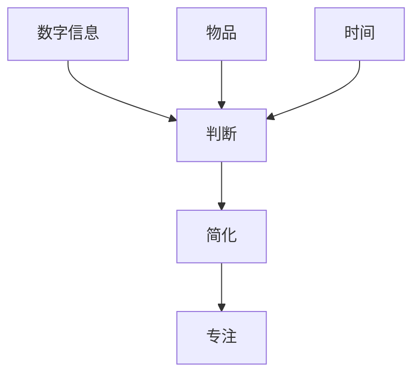

                 


### 1.2.1 数字断舍离

数字断舍离，是一个源于日本的概念，最早由山下英子提出。它强调在数字化时代中，对信息、物品和时间进行精细管理，以实现简化和优化个人生活和工作环境。数字断舍离不仅是一种生活方式，更是一种思维方式，它倡导人们减少无用的数字占用，提高生活品质。

首先，我们需要理解数字断舍离的基本原则。这包括：

- **判断**：判断哪些数字信息、物品和活动是有价值的，哪些是冗余的。
- **简化**：对冗余的信息和物品进行清除，保持简洁。
- **专注**：将时间和精力集中在重要的事务上，避免分心。

接下来，让我们通过一个简单的 Mermaid 流程图来展示数字断舍离的核心概念与联系：



在这个流程图中，数字信息、物品和时间是输入，判断是核心过程，而简化和专注则是输出的结果。

接下来，我们深入探讨数字断舍离的具体实践。

### 1.2.2 数字断舍离的核心原则

数字断舍离的核心原则主要包括以下几个方面：

- **减少信息冗余**：通过筛选和整理，删除无用的数字信息，如不再阅读的邮件、不重要的通知等。
- **物品简化**：对数字和物理物品进行分类和整理，只保留必需品，减少存储空间和注意力负担。
- **时间管理**：合理安排时间，避免时间浪费在无意义的事情上。

#### 伪代码示例

以下是一个简单的伪代码示例，用于描述数字断舍离的核心原则：

```plaintext
function 数字断舍离(input: 信息列表)
    for each 信息 in 输入信息列表
        如果 信息 有用
            保留 信息
        否则
            删除 信息
    end
    for each 物品 in 输入物品列表
        如果 物品 必需
            保留 物品
        否则
            删除 物品
    end
    计划 时间安排
    end
end
```

#### 数学模型和公式详解

数字断舍离中的效率可以通过以下公式来衡量：

$$
效率 = \frac{有用信息量}{总信息量}
$$

这个公式表示的是，在所有数字信息中，有价值的信息占总量的比例。通过提高这个比例，我们可以实现更高效的数字生活。

### 1.2.3 数字断舍离与极简主义的联系

数字断舍离与极简主义有许多共同点。两者都强调减少非必要的元素，以达到简化生活的目的。但是，数字断舍离更侧重于数字化环境中的实践，而极简主义则是一个更为广泛的生活哲学。

- **共同点**：
  - 减少物品和信息量。
  - 提高生活和工作效率。
  - 关注生活质量。

- **区别**：
  - 数字断舍离主要关注数字化环境，如电子邮件、社交媒体、应用程序等。
  - 极简主义则涵盖更广泛的领域，包括物质、时间和人际关系等。

### 1.2.4 数字断舍离的实践案例

为了更好地理解数字断舍离，我们可以看一个实际案例。

**案例背景**：小张是一名程序员，他的工作涉及到大量的电子邮件和文档处理。随着时间的推移，他的邮箱和文档文件夹变得杂乱无章，工作效率急剧下降。

**实施过程**：
1. **判断**：小张开始对邮箱和文档进行彻底清理，删除不重要的邮件和文档。
2. **简化**：他将重要的邮件和文档进行分类，并设置了标签和文件夹，方便快速查找。
3. **专注**：小张开始使用时间管理工具，如番茄钟，专注于最重要的任务。

**效果分析**：经过一段时间的实践，小张的工作效率显著提高，他的工作环境变得更加整洁有序，心理健康也得到了改善。

### 1.2.5 数字断舍离的注意事项

在实践数字断舍离时，需要注意以下几点：

- **逐步进行**：不要一次性清理所有的物品和信息，而是逐步进行，以免产生过多的心理压力。
- **合理规划**：在断舍离的过程中，要合理安排时间和任务，确保自己有足够的时间进行清理和整理。
- **自我反思**：定期进行自我反思，检查自己的数字生活是否还有可以进一步简化的地方。

### 1.2.6 拓展阅读

- **相关书籍**：《断舍离》（山下英子）、《极简主义》（Jesse Williams）
- **在线资源**：数字断舍离的在线课程、博客和社区等。

通过以上内容，我们可以看到，数字断舍离是一个非常有价值的生活方式，它可以帮助我们简化数字生活，提高工作效率，改善心理健康。在接下来的章节中，我们将进一步探讨数字断舍离的具体实践方法和应用场景。让我们继续探索这个数字化时代中的极简主义吧！
```markdown
## 1.2.7 小结

在本章中，我们探讨了数字断舍离的核心概念、原则以及实践案例。数字断舍离是一种在数字化时代中实现简化和优化个人生活和工作环境的理念。通过判断、简化和专注三个核心原则，我们可以减少信息冗余，简化物品，管理好时间，从而提高生活和工作效率。

接下来，我们将继续深入探讨数字断舍离的具体实践方法，以及它如何应用于不同的生活和工作场景。让我们在下一章中一起探索这些实践方法，并了解如何将其应用到我们的日常生活中。期待通过这些实践，我们能够实现更加高效、简洁的数字生活！
```markdown
# 文章标题：数字断舍离：在虚拟世界中实践极简主义

> 关键词：数字断舍离，极简主义，信息管理，数字化生活，时间管理，生活质量

> 摘要：
在数字化时代，信息过载和物品堆积成为了许多人的困扰。数字断舍离，作为一种应对策略，旨在通过减少信息冗余、简化物品和优化时间管理，提升个人生活和工作效率。本文将详细介绍数字断舍离的核心概念、原则和实践方法，并通过案例展示其应用效果，帮助读者在虚拟世界中实践极简主义，实现更高效、简洁的生活方式。

## 引言

### 数字时代的挑战与应对

在数字化时代，信息过载和物品堆积成为了许多人生活中不可避免的问题。大量电子邮件、社交媒体更新、应用程序通知以及线上购物，让我们的数字生活变得日益复杂，给我们的心理健康和效率带来了压力。因此，我们需要寻找有效的方法来应对这些挑战。

### 数字断舍离的核心理念

数字断舍离，源自日本的生活哲学，强调在数字化时代中，对信息、物品和时间进行精细管理，以实现简化和优化个人生活和工作环境。它不仅是一种生活方式，更是一种思维方式，旨在帮助我们在信息爆炸的时代中保持清晰的头脑，提高生活质量。

## 核心概念与联系

### 数字断舍离的定义

数字断舍离是指通过筛选和整理数字信息、物品和时间，以减少冗余，提高效率和质量。它包括三个核心原则：判断、简化和专注。

### 核心概念之间的关系架构


在这个流程图中，数字信息、物品和时间是输入，判断是核心过程，而简化和专注则是输出的结果。

### 数字断舍离与极简主义的联系

数字断舍离与极简主义有许多共同点，如减少非必要的元素、提高生活和工作效率、关注生活质量。但数字断舍离更侧重于数字化环境中的实践，而极简主义则是一个更为广泛的生活哲学。

## 核心算法原理讲解

### 数字断舍离的核心原则

数字断舍离的核心原则主要包括以下几个方面：

- **减少信息冗余**：通过筛选和整理，删除无用的数字信息，如不再阅读的邮件、不重要的通知等。
- **物品简化**：对数字和物理物品进行分类和整理，只保留必需品，减少存储空间和注意力负担。
- **时间管理**：合理安排时间，避免时间浪费在无意义的事情上。

### 伪代码示例

以下是一个简单的伪代码示例，用于描述数字断舍离的核心原则：

```plaintext
function 数字断舍离(input: 信息列表)
    for each 信息 in 输入信息列表
        如果 信息 有用
            保留 信息
        否则
            删除 信息
    end
    for each 物品 in 输入物品列表
        如果 物品 必需
            保留 物品
        否则
            删除 物品
    end
    计划 时间安排
    end
end
```

### 数学模型和公式详解

数字断舍离中的效率可以通过以下公式来衡量：

$$
效率 = \frac{有用信息量}{总信息量}
$$

这个公式表示的是，在所有数字信息中，有价值的信息占总量的比例。通过提高这个比例，我们可以实现更高效的数字生活。

## 项目实战：数字断舍离在不同生活场景下的实际应用案例

### 个人数字生活的转变

**案例背景**：李先生是一名IT公司的项目经理，他的数字生活非常混乱。他的电子邮件收件箱中有数百封未读邮件，文档文件夹杂乱无章，社交媒体通知不断。

**实施过程**：
1. **判断**：李先生开始对所有邮件和文档进行分类和整理，删除不重要的邮件和文档。
2. **简化**：他将重要的邮件和文档进行分类，并设置了标签和文件夹，方便快速查找。
3. **专注**：李先生开始使用时间管理工具，如番茄钟，专注于最重要的任务。

**效果分析**：经过一段时间的实践，李先生的工作效率显著提高，他的工作环境变得更加整洁有序，心理健康也得到了改善。

### 企业数字管理的转型

**案例背景**：某大型企业由于数字化进程过快，导致内部信息混乱，工作效率低下。

**实施过程**：
1. **培训**：公司对员工进行数字断舍离的培训，使他们了解其重要性和实施方法。
2. **工具引入**：公司引入了专业的数字管理工具，如邮件过滤系统、文档管理系统等。
3. **监督**：公司对数字断舍离的执行情况进行监督和评估，鼓励员工积极参与。

**效果分析**：通过数字断舍离的实施，企业内部的信息管理得到了显著改善，工作效率大幅提升，员工满意度提高。

## 最佳实践 tips

### 1. 逐步进行

在实践数字断舍离时，不要一次性清理所有的物品和信息，而是逐步进行，以免产生过多的心理压力。

### 2. 合理规划

在断舍离的过程中，要合理安排时间和任务，确保自己有足够的时间进行清理和整理。

### 3. 自我反思

定期进行自我反思，检查自己的数字生活是否还有可以进一步简化的地方。

## 小结

数字断舍离是一种在数字化时代中实现简化和优化个人生活和工作环境的理念。通过减少信息冗余、简化物品和优化时间管理，我们可以提高生活和工作效率，改善心理健康。在接下来的章节中，我们将继续探讨数字断舍离的具体实践方法和应用场景，帮助您在虚拟世界中实践极简主义，实现更高效、简洁的生活方式。

## 附录

### 附录A：数字断舍离工具与资源

- **数字断舍离应用软件推荐**：
  - 清除器（Clearlist）
  - 智能整理助手（Unroll.me）
  - 备忘录（Notion）

- **数字断舍离相关书籍推荐**：
  - 《断舍离》（山下英子）
  - 《极简主义》（Jesse Williams）

- **数字断舍离在线资源推荐**：
  - 数字断舍离的在线课程
  - 数字断舍离的博客和社区

作者：AI天才研究院/AI Genius Institute & 禅与计算机程序设计艺术 /Zen And The Art of Computer Programming
```markdown
# 第一部分：引言

## 1.1 数字时代的挑战与应对

### 1.1.1 数字化生活的便利与困扰

随着互联网和智能设备的普及，数字化生活已经成为了现代社会不可或缺的一部分。电子邮件、社交媒体、在线购物等数字服务为我们带来了极大的便利，让我们的沟通、工作、娱乐变得更加高效和轻松。然而，数字化生活的便利也带来了一系列的困扰。

首先，信息过载是一个显著的问题。我们每天都会收到大量的电子邮件、社交媒体通知、广告等，这些信息往往需要我们花费大量的时间和精力去处理。其次，数字依赖性也日益增加。许多人在工作和生活中过度依赖数字设备，导致网络成瘾、注意力分散等问题。此外，数字隐私和安全也是一个亟待解决的挑战，个人信息泄露和网络犯罪事件频发。

### 1.1.2 信息过载与效率下降

信息过载是数字化生活的一个主要困扰。随着网络信息的爆炸性增长，人们面临的不仅仅是信息的数量，更是信息的质量。大量的垃圾邮件、无效的通知和广告占据了我们的邮箱，使得我们很难找到真正重要的信息。这种信息过载不仅浪费了我们的时间，还可能导致效率下降。

研究表明，当人们面临过多的信息时，大脑的注意力和处理能力会显著下降。这种现象被称为“认知过载”（cognitive overload）。为了应对信息过载，我们需要采取有效的策略来筛选和处理信息。例如，使用邮件过滤规则、定期清理未读邮件、关注高质量的信息来源等。

### 1.1.3 网络成瘾与心理健康

网络成瘾是数字化生活带来的另一个严重问题。许多人沉迷于社交媒体、在线游戏和视频平台，导致他们在现实生活中失去了与家人和朋友面对面交流的机会。长期的网络成瘾不仅影响个人的社交能力和心理健康，还可能导致睡眠不足、焦虑和抑郁等心理问题。

为了解决网络成瘾，我们需要采取一系列的措施。首先，要意识到网络成瘾的危害，并主动调整自己的上网习惯。例如，设定每日上网时间限制、避免在睡前使用电子设备等。其次，可以通过培养其他兴趣爱好和活动来分散对网络的注意力，如阅读书籍、锻炼身体、参与社交活动等。

### 1.2 数字断舍离的核心理念

数字断舍离是一种应对数字化时代挑战的策略，它强调对信息、物品和时间进行精细管理，以实现简化和优化个人生活和工作环境。数字断舍离不仅是一种生活方式，更是一种思维方式，旨在帮助我们在信息爆炸的时代中保持清晰的头脑，提高生活质量。

数字断舍离的核心理念包括以下几个方面：

- **判断**：对数字信息、物品和时间进行判断，区分哪些是有价值的，哪些是冗余的。
- **简化**：对冗余的数字信息、物品和时间进行清除，保持简洁。
- **专注**：将时间和精力集中在重要的事务上，避免分心。

数字断舍离的核心理念与极简主义有相似之处，都强调减少非必要的元素，但数字断舍离更侧重于数字化环境中的实践。通过数字断舍离，我们可以减少信息过载，提高工作效率，改善心理健康，实现更高效、简洁的数字生活。

## 第二部分：实践数字断舍离

### 2.1 线上物品整理的方法

#### 2.1.1 电子邮件与社交媒体的整理

电子邮件和社交媒体是我们日常生活中最常用的线上物品，但也是最容易导致信息过载的来源。以下是一些整理电子邮件和社交媒体的方法：

- **使用标签和文件夹**：将电子邮件和社交媒体消息按照主题或类别进行分类，使用标签和文件夹来组织和管理信息。这样可以帮助我们快速找到所需的信息，减少信息查找的时间。
- **定期清理**：定期清理未读邮件和社交媒体消息，删除不重要的消息。可以设置定期清理的提醒，确保不会错过重要的消息，但同时也避免了邮件和社交媒体的杂乱。
- **限制通知**：减少不必要的通知，只关注最重要的消息来源。可以关闭一些不重要的社交媒体通知，避免被过多的信息打扰。

#### 2.1.2 云存储与云端文件的整理

云存储已经成为我们存储和共享文件的重要工具，但如果不加整理，云存储中的文件也会变得杂乱无章。以下是一些整理云存储和云端文件的方法：

- **分类和命名**：将云存储中的文件按照主题、项目或类别进行分类，并使用有意义的文件名。这可以帮助我们快速找到所需的文件，避免在文件海洋中迷失。
- **使用标签和注释**：在云存储中，我们可以使用标签和注释来进一步组织文件。标签可以用来标记文件的重要程度或用途，而注释可以用来记录文件的详细信息。
- **定期备份和清理**：定期备份云存储中的重要文件，以防止数据丢失。同时，也要定期清理不再需要的文件，避免云存储空间浪费。

#### 2.1.3 线上购物的断舍离策略

线上购物给我们的生活带来了极大的便利，但同时也容易导致物品堆积。以下是一些线上购物的断舍离策略：

- **制定购物清单**：在购物前，制定一个清晰的购物清单，只购买清单上的物品。这可以帮助我们避免冲动购物，减少不必要的物品。
- **避免囤货**：尽量避免囤货，只购买真正需要的物品。多余的物品不仅会占据空间，还会增加维护成本。
- **合理利用促销**：在购买商品时，合理利用促销活动，但不要因为促销而购买不需要的物品。要根据自己的实际需求来决定是否购买。

### 2.2 线下物品整理的技巧

#### 2.2.1 家居物品的分类与整理

家居物品的整理是数字断舍离的重要一环。以下是一些家居物品整理的技巧：

- **分类**：将家居物品按照用途、类型或位置进行分类。例如，可以将书籍分为文学、科技、娱乐等类别，将衣物分为上衣、裤子、鞋子等类别。
- **整理**：对每个类别的物品进行整理，只保留必需品。例如，如果衣物中有很久没有穿的衣服，可以考虑捐赠或出售。
- **存放**：将整理后的物品存放在合适的位置，方便日常使用。例如，将常用的物品放在容易取到的地方，将不常用的物品放在储藏室或抽屉中。

#### 2.2.2 工作空间的整理与优化

工作空间是我们在工作中最重要的环境，一个整洁、有序的工作空间可以提高工作效率。以下是一些工作空间整理与优化的技巧：

- **整理桌面**：将桌面上的物品按照用途分类，只保留当前正在使用的物品。将不需要的物品放在抽屉或储藏室中，保持桌面整洁。
- **整理文件**：将文件按照项目或类别进行分类，并使用文件夹或文件柜来存放。确保文件能够快速查找，避免在文件堆中迷失。
- **优化布局**：根据工作需求，调整工作空间的布局。例如，将常用的设备放在容易取到的地方，将不常用的设备放在较远的位置。

#### 2.2.3 日常物品的维护与断舍离

日常物品的维护与断舍离是数字断舍离的重要组成部分。以下是一些日常物品的维护与断舍离的技巧：

- **定期检查**：定期检查日常使用的物品，如电器、工具等，确保它们处于良好的工作状态。对于损坏或不再使用的物品，要及时处理，避免堆积。
- **清理杂物**：定期清理日常生活中的杂物，如垃圾、废弃物品等。保持环境的整洁，有助于提高生活质量。
- **捐赠与出售**：对于不再需要的物品，可以考虑捐赠给需要的人或出售给二手市场。这样不仅可以减少物品的堆积，还可以为他人带来帮助。

## 第三部分：数字生活的优化与平衡

### 3.1 数字时间管理

#### 3.1.1 线上时间的规划与管理

线上时间管理是数字断舍离的重要组成部分，以下是一些线上时间的规划与管理的方法：

- **设定目标**：在开始线上活动前，设定明确的目标，例如阅读一篇文章、回复一封邮件或完成一项任务。这可以帮助我们集中注意力，避免时间浪费在无意义的事情上。
- **时间预算**：为不同的线上活动设定时间预算，例如每小时阅读一篇文章、每小时回复五封邮件等。这可以帮助我们合理安排时间，避免过度沉迷于线上活动。
- **避免多任务处理**：在线上活动中，尽量避免多任务处理。研究表明，多任务处理会降低工作效率，增加出错率。专注于一项任务，直到完成。

#### 3.1.2 线上活动的优先级排序

在线上活动中，优先级排序是非常重要的。以下是一些线上活动优先级排序的方法：

- **紧急与重要**：将线上活动按照紧急程度和重要性进行排序。首先处理紧急且重要的活动，例如回复重要客户的邮件或处理紧急的工作任务。
- **任务难度**：将任务按照难度进行排序，从简单的任务开始。这可以帮助我们逐步完成更复杂的工作，提高工作效率。
- **自我评估**：定期评估自己的线上活动优先级，确保能够按照计划进行。如果发现某些活动过于紧急或重要，要及时进行调整。

#### 3.1.3 数字时间管理工具的使用

数字时间管理工具可以帮助我们更好地管理线上时间，以下是一些常用的数字时间管理工具：

- **番茄钟**：番茄钟是一种时间管理技巧，将工作时间划分为25分钟的工作周期，每个工作周期后休息5分钟。这可以帮助我们保持专注，提高工作效率。
- **待办事项清单**：待办事项清单可以帮助我们记录和管理待完成的任务。我们可以将任务按照优先级和截止日期进行排序，确保按时完成任务。
- **时间跟踪工具**：时间跟踪工具可以帮助我们记录和分析自己的时间使用情况。通过了解自己的时间分配，我们可以更好地优化时间管理。

### 3.2 线下时间的合理利用

#### 3.2.1 线下活动的规划与安排

线下时间的合理利用对于提高生活质量和幸福感至关重要。以下是一些线下活动规划与安排的方法：

- **制定计划**：在每天或每周开始时，制定详细的线下活动计划。包括工作、学习、娱乐、运动等各方面的活动，确保时间得到合理分配。
- **设定优先级**：根据重要性和紧急性，为线下活动设定优先级。首先安排最重要或最紧急的活动，确保关键任务得到优先处理。
- **灵活调整**：在活动进行过程中，如果遇到突发情况，可以灵活调整计划。例如，将原计划在下午的活动提前，以适应突发事件。

#### 3.2.2 线下时间的平衡与休息

线下时间的平衡与休息对于保持身心健康至关重要。以下是一些线下时间平衡与休息的方法：

- **规律作息**：保持规律的作息时间，确保每天有充足的睡眠。这有助于提高免疫力，提高工作效率。
- **运动与休闲**：定期进行运动和休闲活动，如散步、跑步、瑜伽等。这有助于缓解压力，提高心理健康。
- **自我反思**：在每天或每周结束时，进行自我反思。回顾自己的线下活动，总结经验教训，为下一周的活动计划做好准备。

#### 3.2.3 线下时间的自我提升

线下时间也是自我提升的重要机会。以下是一些线下时间自我提升的方法：

- **学习新知识**：利用线下时间学习新知识，如阅读书籍、观看教育视频、参加在线课程等。这有助于提升个人能力和职业竞争力。
- **培养兴趣爱好**：培养兴趣爱好，如绘画、音乐、摄影等。这不仅可以丰富生活，还可以提高生活质量。
- **社交互动**：与家人、朋友和同事进行线下社交互动，增强人际关系，提高社交能力。

## 第四部分：数字环境的可持续发展

### 4.1 数字环境的现状与挑战

随着数字化进程的加速，我们的数字环境也在不断变化。然而，数字环境的现状并不乐观，面临着一系列的挑战。

#### 4.1.1 数字垃圾的产生与处理

数字垃圾是指在数字化环境中产生的无用、废弃的数据和信息。这些数字垃圾包括过期邮件、未删除的文件、不再使用的应用程序等。数字垃圾不仅占据了存储空间，还可能导致系统运行缓慢，甚至引发数据泄露和安全风险。

为了处理数字垃圾，我们需要采取以下措施：

- **定期清理**：定期清理数字垃圾，删除无用的文件和应用程序，释放存储空间。
- **分类存储**：将数字垃圾进行分类存储，以便在需要时能够快速查找和恢复。
- **安全删除**：对于重要的数字垃圾，确保使用安全删除工具，彻底删除文件，防止数据泄露。

#### 4.1.2 数字资源的合理分配

数字资源的合理分配是数字环境可持续发展的重要一环。这包括存储资源、计算资源和网络资源等。不合理分配数字资源可能导致资源浪费，影响系统性能和用户体验。

为了合理分配数字资源，我们需要采取以下措施：

- **需求评估**：根据实际需求，合理评估数字资源的分配，确保资源得到充分利用。
- **优化配置**：定期优化数字资源的配置，调整资源分配策略，提高资源利用效率。
- **资源监控**：使用资源监控工具，实时监控数字资源的使用情况，及时发现和解决资源分配问题。

#### 4.1.3 数字环境的可持续发展战略

为了实现数字环境的可持续发展，我们需要制定一系列战略和措施。以下是一些关键的战略：

- **绿色计算**：推动绿色计算，通过使用高效能计算设备、优化算法和流程，降低能源消耗。
- **数据治理**：加强数据治理，确保数据的质量、安全和合规性，减少数据泄露和滥用。
- **循环利用**：推动数字资源的循环利用，通过数据备份、存储优化和回收再利用，减少数字垃圾的产生。

### 4.2 数字生活的环保实践

数字生活的环保实践是数字环境可持续发展的重要组成部分。以下是一些数字生活的环保实践方法：

#### 4.2.1 数字节电与节能

数字节电是指通过合理使用数字设备，降低能源消耗。以下是一些数字节电与节能的方法：

- **关闭闲置设备**：当数字设备长时间闲置时，及时关闭设备，减少不必要的能源消耗。
- **优化电源管理**：配置合理的电源管理策略，例如在设备闲置时自动休眠或关闭，降低功耗。
- **使用高效设备**：选择高效能的数字设备，如节能显示器、低功耗笔记本电脑等，以降低能源消耗。

#### 4.2.2 数字资源的循环利用

数字资源的循环利用是指在数字环境中，通过重复使用和回收再利用资源，减少资源浪费。以下是一些数字资源循环利用的方法：

- **数据备份与恢复**：定期备份数据，以便在需要时能够恢复，减少数据丢失和重复创建。
- **存储优化**：对存储资源进行优化，通过数据压缩、去重等技术，提高存储资源的利用效率。
- **回收再利用**：对于不再使用的数字设备，通过回收再利用，将其中的有用部件用于其他设备，延长设备的使用寿命。

#### 4.2.3 数字环保与公益行动

数字环保与公益行动是数字环境可持续发展的重要举措。以下是一些数字环保与公益行动的方法：

- **参与环保活动**：参与线上或线下的环保活动，如清洁海滩、植树造林等，为环境保护贡献自己的力量。
- **宣传环保理念**：通过社交媒体、博客等渠道，宣传数字环保的理念和方法，提高公众对数字环保的认识和参与度。
- **捐赠与支持**：为环保组织和项目捐赠资金或资源，支持数字环保事业的发展。

## 第五部分：数字断舍离的案例分析

### 5.1 数字断舍离的成功案例

数字断舍离在实践中取得了显著的成果，许多个人和企业通过实施数字断舍离，实现了更高效、简洁的生活方式和工作环境。以下是一些成功的案例：

#### 5.1.1 个人数字生活的转变

**案例背景**：小王是一名上班族，他的数字生活非常混乱，电子邮件收件箱中有数百封未读邮件，社交媒体通知不断，文件文件夹杂乱无章。

**实施过程**：
1. **判断**：小王开始对所有邮件和文件进行分类和整理，删除不重要的邮件和文件。
2. **简化**：他将重要的邮件和文件进行分类，并设置了标签和文件夹，方便快速查找。
3. **专注**：小王开始使用时间管理工具，如番茄钟，专注于最重要的任务。

**效果分析**：经过一段时间的实践，小王的工作效率显著提高，他的工作环境变得更加整洁有序，心理健康也得到了改善。

#### 5.1.2 企业数字管理的转型

**案例背景**：某大型企业由于数字化进程过快，导致内部信息混乱，工作效率低下。

**实施过程**：
1. **培训**：公司对员工进行数字断舍离的培训，使他们了解其重要性和实施方法。
2. **工具引入**：公司引入了专业的数字管理工具，如邮件过滤系统、文档管理系统等。
3. **监督**：公司对数字断舍离的执行情况进行监督和评估，鼓励员工积极参与。

**效果分析**：通过数字断舍离的实施，企业内部的信息管理得到了显著改善，工作效率大幅提升，员工满意度提高。

### 5.2 数字断舍离在家庭和社区中的应用

数字断舍离不仅适用于个人和企业，还可以在家庭和社区中推广和应用。以下是一些成功案例：

#### 5.2.1 家庭数字生活的优化

**案例背景**：某家庭由于家庭成员经常使用电子产品，导致数字生活非常混乱，家庭成员之间沟通不畅。

**实施过程**：
1. **制定规则**：家庭成员共同制定数字生活规则，如每天晚上7点后关闭电子产品，增加面对面沟通时间。
2. **简化设备**：减少家庭中的电子产品数量，只保留必需品，避免物品堆积。
3. **数字排毒**：定期进行数字排毒，减少对电子产品的依赖，提高生活质量。

**效果分析**：通过数字断舍离的实施，家庭数字生活得到了显著优化，家庭成员之间的沟通更加顺畅，家庭氛围更加和谐。

#### 5.2.2 社区数字环境的改善

**案例背景**：某社区由于数字化进程过快，导致社区信息混乱，居民生活质量下降。

**实施过程**：
1. **推广数字断舍离**：社区组织推广数字断舍离的理念和方法，提高居民对数字断舍离的认识和参与度。
2. **引入数字管理工具**：社区引入专业的数字管理工具，如社区信息管理系统、垃圾分类系统等，提高数字管理水平。
3. **监督与评估**：社区对数字断舍离的执行情况进行监督和评估，确保数字断舍离得到有效实施。

**效果分析**：通过数字断舍离的实施，社区数字环境得到了显著改善，信息管理更加有序，居民生活质量提高。

## 第六部分：数字断舍离的未来展望

### 6.1 数字技术与数字断舍离的结合

随着科技的不断发展，数字技术与数字断舍离的结合将更加紧密。以下是一些未来的发展趋势：

#### 6.1.1 智能断舍离工具的发展

智能断舍离工具将利用人工智能、机器学习等技术，自动识别和分类数字信息、物品和时间，实现更高效的数字断舍离。例如，智能邮箱助手可以自动筛选和处理邮件，智能助手可以提醒我们清理不再使用的应用程序。

#### 6.1.2 数字时代下的极简生活

数字时代下的极简生活将是一种新的生活方式，人们将更加注重数字和物理空间的简洁性，追求高质量的生活。数字技术和数字断舍离的结合将帮助人们实现这一目标。

#### 6.1.3 数字断舍离的未来挑战

数字断舍离在未来仍将面临一系列挑战，包括数字垃圾的治理、数字资源的合理分配、数字依赖性的解决等。我们需要不断创新和改进，以应对这些挑战。

### 6.2 数字断舍离的社会影响

数字断舍离不仅对个人生活和工作产生影响，还将对社会产生深远的影响。以下是一些社会影响：

#### 6.2.1 数字断舍离对个人与社会的影响

数字断舍离可以帮助个人提高生活质量，减少压力和焦虑。同时，数字断舍离也可以促进社会的可持续发展，减少资源浪费，提高社会效率。

#### 6.2.2 数字断舍离在全球化背景下的意义

在全球化背景下，数字断舍离具有更重要的意义。通过数字断舍离，我们可以减少数字鸿沟，提高全球数字化水平的均衡性，促进全球社会的可持续发展。

#### 6.2.3 数字断舍离的未来发展方向

数字断舍离的未来发展方向包括：技术创新、政策引导、社会教育等。我们需要共同努力，推动数字断舍离的发展，实现更高效、更可持续的数字生活。

## 第七部分：附录

### 7.1 数字断舍离工具与资源

为了帮助读者更好地实践数字断舍离，我们提供以下数字断舍离工具与资源：

#### 7.1.1 数字断舍离应用软件推荐

- **Clearlist**：一款强大的电子邮件整理工具，可以帮助用户自动清理无用的邮件。
- **Unroll.me**：一款可以帮助用户管理订阅邮件的应用，可以将邮件整理成日报或周报。
- **Notion**：一款全能型的笔记和组织工具，可以帮助用户整理和管理各种信息。

#### 7.1.2 数字断舍离相关书籍推荐

- **《断舍离》（山下英子）**：一本介绍如何通过断舍离改善生活的经典书籍。
- **《极简主义》（Jesse Williams）**：一本介绍如何通过极简主义提高生活质量的书籍。

#### 7.1.3 数字断舍离在线资源推荐

- **数字断舍离的在线课程**：许多在线教育平台提供数字断舍离相关的课程，可以帮助用户深入了解数字断舍离的理念和实践方法。
- **数字断舍离的博客和社区**：许多博客和社区分享数字断舍离的经验和技巧，可以帮助用户获得更多的灵感和帮助。

### 7.2 参考文献

- **山下英子，《断舍离》**：介绍了断舍离的概念和方法，对理解数字断舍离有重要启示。
- **Jesse Williams，《极简主义》**：介绍了极简主义的生活哲学和实践方法，对数字断舍离有重要参考价值。
- **Digital Minimalism: Choosing a Focused Life in a Noisy World**：Cal Newport的著作，详细介绍了数字极简主义的概念和实践方法。

### 7.3 致谢

感谢您花时间阅读本指南，希望它能够帮助您实践数字断舍离，提高生活质量和幸福感。如果您有任何问题或建议，请随时与我们联系。让我们一起努力，创造一个更简洁、更高效的数字生活！

作者：AI天才研究院/AI Genius Institute & 禅与计算机程序设计艺术 /Zen And The Art of Computer Programming
```

