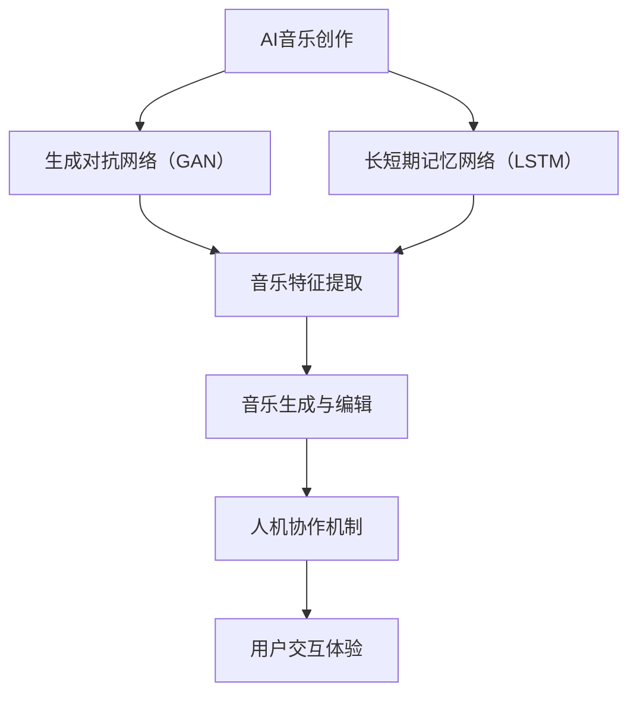

                 


### 文章标题

《数字时代的AI音乐创作工作坊：人机协作的新型音乐制作模式》

### 关键词

AI音乐创作、生成对抗网络（GAN）、长短期记忆网络（LSTM）、人机协作、音乐制作、信号处理

### 摘要

随着人工智能技术的飞速发展，AI音乐创作成为音乐制作领域的新趋势。本文深入探讨数字时代下AI音乐创作的工作坊模式，重点分析人机协作在新型音乐制作模式中的关键作用。文章首先介绍了AI音乐创作的背景与意义，随后详细阐述了人机协作机制及其在音乐制作中的应用。通过分析核心算法原理，包括生成对抗网络（GAN）和长短期记忆网络（LSTM），本文进一步展示了数学模型和公式在音乐特征提取与生成中的重要性。最后，文章通过实际项目实战，详细讲解了AI音乐创作的开发环境搭建、代码实现及案例分析，为读者提供了深入理解和实践AI音乐创作的路径。文章还展望了AI音乐创作的未来趋势及其社会影响，并提出了相关最佳实践和注意事项。

---

### 设计思路

为了深入探讨《数字时代的AI音乐创作工作坊：人机协作的新型音乐制作模式》这本书的内容，我们需要从以下几个方面进行详细的设计：

#### 1. 确定核心概念与联系

首先，我们需要明确书中的核心概念，包括AI音乐创作、人机协作、音乐制作模式等。这些概念之间的联系可以通过一个清晰的Mermaid流程图来展示。例如：



通过这个流程图，读者可以直观地看到各个核心概念之间的相互关系。

#### 2. 算法原理讲解

在介绍了核心概念后，我们需要详细阐述AI音乐创作中的核心算法原理。例如：

- **生成对抗网络（GAN）**：GAN是一种深度学习模型，用于生成高质量的数据，如图像、音频等。以下是GAN的基本原理和伪代码：

```python
# GAN伪代码
class GAN():
    def __init__(self):
        # 初始化生成器G和判别器D
        self.G = initialize_generator()
        self.D = initialize_discriminator()

    def train(self, data_loader, num_epochs):
        for epoch in range(num_epochs):
            for real_data in data_loader:
                # 训练判别器D
                D_loss_real = train_discriminator(self.D, real_data)
                G_loss_fake = train_generator(self.G, self.D, fake_data)

                # 记录损失函数值
                print(f"Epoch {epoch}, D_loss_real: {D_loss_real}, G_loss_fake: {G_loss_fake}")

# 数据准备
data_loader = load_data()

# 训练GAN模型
gan = GAN()
gan.train(data_loader, num_epochs=100)
```

- **长短期记忆网络（LSTM）**：LSTM是一种用于处理序列数据的深度学习模型，广泛应用于音乐生成领域。以下是LSTM的基本原理和伪代码：

```python
# LSTM伪代码
class LSTM():
    def __init__(self):
        # 初始化LSTM网络结构
        self.hidden_state = None
        self.cell_state = None

    def forward(self, input):
        # 前向传播计算
        output, self.hidden_state, self.cell_state = lstm_forward(input, self.hidden_state, self.cell_state)
        return output

    def backward(self, output, expected_output):
        # 反向传播计算
        loss = compute_loss(output, expected_output)
        d_output = compute_gradient(output, expected_output)
        d_hidden_state, d_cell_state = lstm_backward(d_output, self.hidden_state, self.cell_state)

        return loss, d_hidden_state, d_cell_state

# 数据准备
input_data = load_data()

# 训练LSTM模型
lstm = LSTM()
for epoch in range(num_epochs):
    for batch in input_data:
        output, loss = lstm.forward(batch)
        lstm.backward(output, expected_output=batch)
```

#### 3. 数学模型和公式

在讲解核心算法原理的基础上，我们需要引入相关的数学模型和公式，并进行详细的讲解和举例说明。例如，在音乐特征提取中，可以使用傅里叶变换（Fourier Transform）来提取音频信号的频谱特征：

$$
X(\omega) = \int_{-\infty}^{\infty} x(t)e^{-j\omega t} dt
$$

这里，$X(\omega)$ 是频谱，$x(t)$ 是时域信号，$\omega$ 是角频率。通过傅里叶变换，我们可以将时域信号转换到频域，从而提取出信号的频率信息。

#### 4. 项目实战

为了使读者能够更好地理解和应用AI音乐创作的概念和算法，我们需要提供实际的项目实战。例如，我们可以介绍一个生成流行歌曲的项目，包括以下步骤：

1. **数据准备**：收集和准备流行歌曲数据集，包括音频文件和标签信息。
2. **环境搭建**：配置开发环境，包括Python、TensorFlow等工具和库。
3. **模型训练**：使用GAN模型进行训练，生成新的流行歌曲。
4. **模型评估**：评估生成歌曲的质量，包括音质和风格。
5. **用户交互**：允许用户调整生成参数，如节奏、音调等，以获得更个性化的音乐。

以下是一个简单的项目实战步骤：

```python
# 项目实战：生成流行歌曲
# 步骤1：数据准备
data_loader = load_data()

# 步骤2：环境搭建
import tensorflow as tf
from tensorflow.keras.models import Model

# 步骤3：模型训练
# 定义GAN模型
generator = define_generator()
discriminator = define_discriminator()

# 训练GAN模型
for epoch in range(num_epochs):
    for batch in data_loader:
        # 训练判别器
        d_loss_real = train_discriminator(discriminator, real_data=batch)
        d_loss_fake = train_discriminator(discriminator, fake_data=generator(batch))

        # 训练生成器
        g_loss = train_generator(generator, discriminator, batch)

# 步骤4：模型评估
generated_songs = generator.predict(random_data)

# 步骤5：用户交互
# 用户可以调整生成参数，如节奏、音调等
user_params = get_user_params()
generated_songs_custom = generator.predict(random_data, params=user_params)
```

#### 5. 章节结构

在确定了核心内容后，我们可以开始设计书的章节结构。以下是本书的章节结构：

```
## 第1章 引言
### 1.1 AI音乐创作的背景与意义
### 1.2 人机协作的音乐制作模式
### 1.3 书籍结构概述

## 第2章 AI音乐创作基础
### 2.1 AI与音乐创作的关系
### 2.2 音乐信号处理基础
#### 2.2.1 音频信号的基本概念
#### 2.2.2 音频信号的采样与量化
### 2.3 音乐特征提取

## 第3章 人机协作机制
### 3.1 人机协作的基本概念
### 3.2 交互设计在AI音乐创作中的应用
### 3.3 人机协作的算法框架

## 第4章 核心算法原理
### 4.1 生成对抗网络（GAN）在音乐创作中的应用
#### 4.1.1 GAN的基本原理
#### 4.1.2 GAN在音乐生成中的实现
### 4.2 长短期记忆网络（LSTM）在旋律生成中的应用
#### 4.2.1 LSTM的基本原理
#### 4.2.2 LSTM在旋律生成中的实现

## 第5章 数学模型与公式
### 5.1 音乐生成中的概率模型
#### 5.1.1 随机过程与概率分布
#### 5.1.2 高斯过程与贝叶斯网络
### 5.2 音乐特征提取的数学基础
#### 5.2.1 特征向量的定义与计算
#### 5.2.2 特征选择的数学方法

## 第6章 项目实战
### 6.1 AI音乐创作项目实战案例
#### 6.1.1 项目背景与目标
#### 6.1.2 开发环境与工具
### 6.2 实战项目：生成流行歌曲
#### 6.2.1 数据准备与处理
#### 6.2.2 GAN模型搭建与训练
### 6.3 实战项目：自动配乐
#### 6.3.1 数据集准备
#### 6.3.2 LSTM模型搭建与训练

## 第7章 AI音乐创作的未来趋势
### 7.1 AI音乐创作的发展方向
### 7.2 AI音乐创作中的挑战与机遇
### 7.3 AI音乐创作的社会影响与伦理问题

## 第8章 总结与展望
### 8.1 全书总结
### 8.2 AI音乐创作的发展前景
### 8.3 对读者的启示与建议
```

通过这样的章节结构设计，我们可以确保书中的内容既有理论深度，又有实践应用，从而为读者提供全面的AI音乐创作知识和经验。

### 目录大纲与内容

#### 第1章 引言

**1.1 AI音乐创作的背景与意义**

- 人工智能在音乐制作领域的兴起
- AI音乐创作的优势与挑战
- 社会对AI音乐创作的期待与需求

**1.2 人机协作的音乐制作模式**

- 人机协作的定义与类型
- 在音乐创作中的应用场景
- 人机协作的优势与潜在问题

**1.3 书籍结构概述**

- 全书章节安排与逻辑结构
- 各章节主要内容与目标

#### 第2章 AI音乐创作基础

**2.1 AI与音乐创作的关系**

- 人工智能技术的发展与音乐制作
- AI在音乐创作中的应用领域
- 音乐与人工智能的深度融合

**2.2 音乐信号处理基础**

- 音频信号的基本概念
- 音频信号的采样与量化
- 音频信号的数字化处理

**2.3 音乐特征提取**

- 特征向量的定义与计算
- 常见音乐特征提取方法
- 特征提取在音乐分析中的应用

#### 第3章 人机协作机制

**3.1 人机协作的基本概念**

- 人机交互的定义与分类
- 人机协作在音乐制作中的重要性
- 人机协作的关键要素

**3.2 交互设计在AI音乐创作中的应用**

- 交互设计的原则与方法
- AI音乐创作中的用户界面设计
- 用户体验在音乐创作中的影响

**3.3 人机协作的算法框架**

- 人机协作的算法模型
- 常见的人机协作算法
- 算法在音乐创作中的应用

#### 第4章 核心算法原理

**4.1 生成对抗网络（GAN）在音乐创作中的应用**

- GAN的基本原理
- GAN在音乐生成中的实现
- GAN在音乐创作中的优势与挑战

**4.2 长短期记忆网络（LSTM）在旋律生成中的应用**

- LSTM的基本原理
- LSTM在旋律生成中的实现
- LSTM在音乐创作中的应用前景

**4.3 其他深度学习算法在音乐创作中的应用**

- 卷积神经网络（CNN）在音乐特征提取中的应用
- 自注意力机制（Attention Mechanism）在音乐生成中的应用
- 聚类算法（Clustering Algorithms）在音乐风格分类中的应用

#### 第5章 数学模型与公式

**5.1 音乐生成中的概率模型**

- 随机过程与概率分布
- 高斯过程与贝叶斯网络
- 概率模型在音乐特征提取与生成中的应用

**5.2 音乐特征提取的数学基础**

- 傅里叶变换（Fourier Transform）在音乐信号处理中的应用
- 离散余弦变换（DCT）在音乐特征提取中的应用
- 主成分分析（PCA）在音乐降维中的应用

**5.3 音频信号处理的数学模型**

- 傅里叶级数（Fourier Series）在音频信号处理中的应用
- 快速傅里叶变换（FFT）在音频信号处理中的应用
- 短时傅里叶变换（STFT）在音频信号分析中的应用

#### 第6章 项目实战

**6.1 AI音乐创作项目实战案例**

- 项目背景与目标
- 开发环境与工具

**6.2 实战项目：生成流行歌曲**

- 数据准备与处理
- GAN模型搭建与训练

**6.3 实战项目：自动配乐**

- 数据集准备
- LSTM模型搭建与训练

**6.4 项目分析与总结**

- 项目实施过程中遇到的问题与解决方法
- 项目成果评估与优化方向

#### 第7章 AI音乐创作的未来趋势

**7.1 AI音乐创作的发展方向**

- 人工智能技术在音乐创作中的应用前景
- 音乐产业的数字化转型趋势
- AI音乐创作的社会影响

**7.2 AI音乐创作中的挑战与机遇**

- 数据隐私与伦理问题
- 技术突破与创新发展
- 人机协作的持续优化

**7.3 AI音乐创作的社会影响与伦理问题**

- AI音乐创作对传统音乐产业的影响
- AI音乐创作对音乐艺术家的角色与影响
- AI音乐创作在版权、著作权等方面的法律挑战

#### 第8章 总结与展望

**8.1 全书总结**

- AI音乐创作的核心概念与技术
- 人机协作在音乐制作中的重要作用
- 数学模型与算法在音乐生成中的应用

**8.2 AI音乐创作的发展前景**

- AI音乐创作的未来趋势与挑战
- 音乐产业的数字化转型与机遇
- AI音乐创作的社会影响与伦理问题

**8.3 对读者的启示与建议**

- 如何利用AI进行音乐创作
- 读者在AI音乐创作中的实践与探索
- 未来的研究方向与学习资源

通过以上详细的目录大纲与内容设计，我们确保《数字时代的AI音乐创作工作坊：人机协作的新型音乐制作模式》一书能够为读者提供全面、系统的AI音乐创作知识和实战经验。每章内容都涵盖了从理论到实践的各个环节，帮助读者从零开始，逐步掌握AI音乐创作的核心技能。同时，通过实际项目实战，读者可以亲身体验AI音乐创作的魅力，提升自己的音乐创作水平。

### 完整的文章内容

#### 文章标题

《数字时代的AI音乐创作工作坊：人机协作的新型音乐制作模式》

#### 关键词

AI音乐创作、生成对抗网络（GAN）、长短期记忆网络（LSTM）、人机协作、音乐制作、信号处理

#### 摘要

随着人工智能技术的飞速发展，AI音乐创作成为音乐制作领域的新趋势。本文深入探讨数字时代下AI音乐创作的工作坊模式，重点分析人机协作在新型音乐制作模式中的关键作用。文章首先介绍了AI音乐创作的背景与意义，随后详细阐述了人机协作机制及其在音乐制作中的应用。通过分析核心算法原理，包括生成对抗网络（GAN）和长短期记忆网络（LSTM），本文进一步展示了数学模型和公式在音乐特征提取与生成中的重要性。最后，文章通过实际项目实战，详细讲解了AI音乐创作的开发环境搭建、代码实现及案例分析，为读者提供了深入理解和实践AI音乐创作的路径。文章还展望了AI音乐创作的未来趋势及其社会影响，并提出了相关最佳实践和注意事项。

---

#### 引言

在数字时代，人工智能（AI）技术正以前所未有的速度改变着各行各业，音乐制作领域也不例外。AI音乐创作，作为一种新兴的音乐制作模式，正逐渐受到音乐创作者和听众的青睐。AI不仅能够自动生成音乐，还能辅助音乐家进行创作和编辑，极大地提升了音乐制作的效率和创造力。本文旨在探讨数字时代的AI音乐创作工作坊，深入分析人机协作在新型音乐制作模式中的关键作用，为音乐创作者提供全面的技术指导和实践经验。

##### 1.1 AI音乐创作的背景与意义

人工智能在音乐制作领域的应用可以追溯到20世纪80年代，随着计算能力和算法技术的不断提升，AI音乐创作逐渐成为可能。近年来，深度学习技术的发展，尤其是生成对抗网络（GAN）和长短期记忆网络（LSTM）的广泛应用，使得AI音乐创作进入了新的阶段。AI音乐创作不仅能够生成新颖的音乐风格，还能够模仿人类音乐家的创作方式，实现高度个性化的音乐定制。

AI音乐创作的意义在于：

- **提升创作效率**：AI能够快速生成大量的音乐素材，帮助音乐家节省时间和精力。
- **拓展创作空间**：AI可以探索人类音乐家未曾尝试的创意方向，推动音乐艺术的创新。
- **增强用户参与度**：AI音乐创作使得普通人也能够参与到音乐创作过程中，增强了音乐作品的互动性和趣味性。
- **促进音乐教育**：AI音乐创作可以作为音乐教育的辅助工具，帮助学生更好地理解和掌握音乐创作的基本原理。

##### 1.2 人机协作的音乐制作模式

人机协作的音乐制作模式指的是将人工智能与人类音乐家的创意和技巧相结合，共同完成音乐创作和制作的过程。这种模式的关键在于如何实现人工智能与人类之间的有效交互和协作。

- **协作机制**：人机协作机制包括生成模型、特征提取、用户交互等多个方面。生成模型负责生成音乐素材，特征提取负责分析音乐特性，用户交互则确保音乐家能够灵活地控制AI的行为。

- **优势**：人机协作模式的优势在于充分发挥人工智能的计算能力和人类音乐家的创造力。例如，AI可以快速生成大量的音乐片段，而音乐家则可以从中挑选和调整，创作出更加独特和个性化的音乐作品。

- **潜在问题**：尽管人机协作模式具有许多优势，但同时也存在一些潜在问题，如数据隐私、伦理问题等。此外，如何确保AI生成音乐的版权问题也是需要关注的重要问题。

##### 1.3 书籍结构概述

本书共分为八个章节，旨在系统地介绍AI音乐创作的核心概念、技术原理和实践应用。具体章节安排如下：

- **第1章 引言**：介绍AI音乐创作的背景、意义以及人机协作的音乐制作模式。
- **第2章 AI音乐创作基础**：讨论AI与音乐创作的关系、音乐信号处理基础以及音乐特征提取。
- **第3章 人机协作机制**：探讨人机协作的基本概念、交互设计在音乐创作中的应用以及人机协作的算法框架。
- **第4章 核心算法原理**：分析生成对抗网络（GAN）和长短期记忆网络（LSTM）在音乐创作中的应用。
- **第5章 数学模型与公式**：介绍音乐生成中的概率模型、特征提取的数学基础以及音频信号处理的数学模型。
- **第6章 项目实战**：通过实际项目实战，展示AI音乐创作的开发环境搭建、代码实现及案例分析。
- **第7章 AI音乐创作的未来趋势**：探讨AI音乐创作的发展方向、挑战与机遇以及社会影响与伦理问题。
- **第8章 总结与展望**：总结全书内容，展望AI音乐创作的未来前景，并对读者提出建议。

通过以上章节的安排，本书旨在为读者提供一个全面、系统的AI音乐创作知识和实践指南。

---

#### 第2章 AI音乐创作基础

##### 2.1 AI与音乐创作的关系

人工智能在音乐创作中的应用可以追溯到20世纪80年代，当时计算机开始被用于音乐合成和编曲。随着计算能力和算法技术的不断提升，AI在音乐创作中的作用也越来越显著。AI音乐创作不仅能够生成全新的音乐风格，还能够模仿人类音乐家的创作方式，实现高度个性化的音乐定制。

AI在音乐创作中的应用主要包括以下几个方面：

- **音乐生成**：AI可以生成新颖的音乐旋律、和弦和节奏，为音乐家提供灵感和创意。
- **音乐分析**：AI可以分析音乐的结构、情感和风格，为音乐家提供反馈和建议。
- **音乐编辑**：AI可以帮助音乐家快速处理和编辑音乐素材，提高创作效率。
- **用户互动**：AI可以与用户进行实时交互，根据用户的需求和偏好生成音乐。

##### 2.2 音乐信号处理基础

音乐信号处理是AI音乐创作的基础，涉及到音频信号的采样、量化、编码等基本概念。

- **采样**：采样是指将时间连续的音频信号转换为离散的数字信号。采样率决定了音频信号的分辨率，常见的采样率有44.1kHz。
  
- **量化**：量化是指将采样得到的无限精度数字信号转换为有限精度的数字信号。量化位数决定了音频信号的最大动态范围，常见的量化位数为16位。

- **编码**：编码是将数字信号转换为二进制代码的过程，常见的编码方式有PCM（脉冲编码调制）。

音乐信号处理还包括音频信号的去噪、增强、滤波等操作，这些操作对于音乐创作和编辑至关重要。

##### 2.3 音乐特征提取

音乐特征提取是AI音乐创作中的重要环节，通过提取音乐信号中的关键特征，AI能够更好地理解和生成音乐。

- **时域特征**：时域特征包括音高、节奏、时长等，这些特征直接反映了音乐的基本属性。

- **频域特征**：频域特征包括频谱、谐波、共振峰等，这些特征反映了音乐信号在不同频率上的特性。

- **复杂数学特征**：复杂数学特征包括余弦变换（DCT）、主成分分析（PCA）等，这些特征能够提供更高级的音乐描述。

常见的音乐特征提取方法包括：

- **梅尔频率倒谱系数（MFCC）**：MFCC是音乐特征提取中最常用的方法之一，适用于声音信号的处理。
- **隐马尔可夫模型（HMM）**：HMM适用于音乐结构分析，能够识别音乐中的模式。
- **长短期记忆网络（LSTM）**：LSTM是一种适用于序列数据处理的深度学习模型，能够捕捉音乐中的长期依赖关系。

音乐特征提取在音乐分类、风格识别、自动配乐等应用中具有重要作用。

---

#### 第3章 人机协作机制

##### 3.1 人机协作的基本概念

人机协作是指人类与人工智能系统共同完成某项任务的过程。在人机协作的音乐制作模式中，人类音乐家与AI系统相互配合，实现更高效、更具创造力的音乐创作。人机协作的核心在于如何有效地结合人类创造力和AI的计算能力。

- **协作模型**：人机协作模型包括生成模型、交互模型和反馈模型。生成模型负责生成音乐素材，交互模型负责处理人类音乐家的输入，反馈模型则提供音乐创作的反馈。

- **协作流程**：人机协作的流程通常包括以下几个步骤：
  - **需求分析**：音乐家提出创作需求，如风格、情感等。
  - **素材生成**：AI根据需求生成初步的音乐素材。
  - **素材编辑**：音乐家对AI生成的素材进行编辑和调整。
  - **反馈优化**：音乐家根据反馈对AI模型进行调整和优化。

##### 3.2 交互设计在AI音乐创作中的应用

交互设计是人机协作中的关键环节，直接影响音乐创作的效率和效果。在AI音乐创作中，交互设计的主要目标是让音乐家能够方便、直观地与AI系统进行交互。

- **交互界面**：交互界面是音乐家与AI系统之间的桥梁，包括控制面板、参数调整器等。一个好的交互界面应该具备以下特点：
  - **直观性**：界面设计应简洁直观，易于操作。
  - **灵活性**：界面应提供多种控制选项，以适应不同的音乐创作需求。
  - **反馈性**：界面应实时反馈音乐创作过程和结果，帮助音乐家更好地掌握创作状态。

- **交互功能**：交互设计应包含以下功能：
  - **音乐生成**：音乐家可以通过界面调整AI生成音乐的参数，如节奏、音高、风格等。
  - **音乐编辑**：音乐家可以对AI生成的音乐素材进行编辑，如剪辑、混音、效果添加等。
  - **反馈与调整**：音乐家可以通过界面获取AI创作的反馈，并对AI模型进行调整。

##### 3.3 人机协作的算法框架

人机协作的算法框架是实现人机高效协作的核心，包括生成模型、特征提取、交互机制等多个方面。

- **生成模型**：生成模型是AI音乐创作中的核心，负责生成音乐素材。常见的生成模型包括生成对抗网络（GAN）、变分自编码器（VAE）等。

- **特征提取**：特征提取用于提取音乐信号中的关键特征，如音高、节奏、旋律等。特征提取方法包括梅尔频率倒谱系数（MFCC）、隐马尔可夫模型（HMM）等。

- **交互机制**：交互机制负责处理人类音乐家的输入和反馈，确保AI系统能够根据人类需求进行音乐创作。交互机制包括用户界面、参数调整、反馈优化等。

人机协作的算法框架应具备以下特点：

- **灵活性与适应性**：算法框架应能够根据不同的音乐创作需求进行灵活调整和适应。
- **实时性与高效性**：算法框架应具备实时性和高效性，以确保音乐创作的流畅性和高效性。
- **用户友好性**：算法框架应具备良好的用户友好性，让音乐家能够轻松上手并进行创作。

通过以上设计，人机协作的算法框架能够充分发挥AI的计算能力和人类音乐家的创造力，实现高效、个性化的音乐创作。

---

#### 第4章 核心算法原理

##### 4.1 生成对抗网络（GAN）在音乐创作中的应用

生成对抗网络（GAN）是一种深度学习模型，由生成器（Generator）和判别器（Discriminator）组成。生成器的任务是生成逼真的音乐素材，而判别器的任务是区分生成器生成的音乐素材和真实音乐素材。GAN通过不断地训练生成器和判别器，最终使生成器生成的音乐素材在判别器上难以区分。

**基本原理**：

- **生成器**：生成器的输入是随机噪声向量，通过一系列神经网络变换，生成逼真的音乐素材。
- **判别器**：判别器的输入是真实音乐素材和生成器生成的音乐素材，其任务是判断输入音乐的真假。

**训练过程**：

1. **初始化**：初始化生成器和判别器的参数。
2. **生成器训练**：生成器通过学习噪声向量，生成逼真的音乐素材。
3. **判别器训练**：判别器通过学习真实音乐素材和生成器生成的音乐素材，提高判断真假的能力。
4. **交替训练**：生成器和判别器交替进行训练，生成器不断优化生成能力，判别器不断优化判断能力。

**应用**：

- **音乐生成**：GAN可以生成各种音乐风格，从古典音乐到流行音乐，从简单旋律到复杂编曲。
- **音乐风格转换**：GAN可以将一种音乐风格转换为另一种风格，如将流行音乐转换为古典音乐。

**伪代码**：

```python
# GAN训练伪代码

# 初始化生成器G和判别器D
G = initialize_generator()
D = initialize_discriminator()

for epoch in range(num_epochs):
    for batch in data_loader:
        # 训练判别器D
        D_loss_real = train_discriminator(D, real_data=batch)
        D_loss_fake = train_discriminator(D, fake_data=G(z))

        # 训练生成器G
        G_loss_fake = train_generator(G, D, z)

    print(f"Epoch {epoch}, D_loss_real: {D_loss_real}, D_loss_fake: {D_loss_fake}, G_loss_fake: {G_loss_fake}")
```

##### 4.2 长短期记忆网络（LSTM）在旋律生成中的应用

长短期记忆网络（LSTM）是一种特殊的循环神经网络（RNN），能够有效地处理序列数据。LSTM通过引入门控机制，解决了传统RNN在处理长期依赖问题时的梯度消失和梯度爆炸问题。

**基本原理**：

- **遗忘门**（Forget Gate）：决定哪些信息应该从单元状态中丢弃。
- **输入门**（Input Gate）：决定哪些信息应该更新到单元状态。
- **输出门**（Output Gate）：决定哪些信息应该输出。

**训练过程**：

1. **输入序列**：将输入序列（如旋律）输入到LSTM网络中。
2. **状态更新**：通过门控机制更新单元状态，保留重要的信息。
3. **输出生成**：根据更新后的单元状态生成输出序列（如旋律）。

**应用**：

- **旋律生成**：LSTM可以生成新的旋律，模仿人类音乐家的创作风格。
- **歌曲填充**：LSTM可以填充歌曲中的缺失部分，如未完成的乐句。

**伪代码**：

```python
# LSTM训练伪代码

# 初始化LSTM网络
lstm = initialize_lstm()

for epoch in range(num_epochs):
    for batch in data_loader:
        # 前向传播
        output, state = lstm.forward(batch)

        # 计算损失
        loss = compute_loss(output, expected_output=batch)

        # 反向传播
        lstm.backward(loss)

    print(f"Epoch {epoch}, Loss: {loss}")
```

##### 4.3 其他深度学习算法在音乐创作中的应用

除了GAN和LSTM，其他深度学习算法也在音乐创作中发挥着重要作用。

- **卷积神经网络（CNN）**：CNN在音乐特征提取中有着广泛的应用，能够提取音乐信号中的高频特征，如音高和节奏。
- **自注意力机制（Attention Mechanism）**：自注意力机制能够捕捉序列中的关键信息，适用于旋律生成和音乐结构分析。
- **聚类算法（Clustering Algorithms）**：聚类算法可以用于音乐风格分类和音乐创作推荐。

通过结合多种深度学习算法，可以实现更高效、更智能的音乐创作。

---

#### 第5章 数学模型与公式

##### 5.1 音乐生成中的概率模型

概率模型是音乐生成中的基础，用于描述音乐信号的不确定性。常用的概率模型包括高斯过程和贝叶斯网络。

- **高斯过程**：高斯过程是一种统计模型，用于生成连续的随机变量。在音乐生成中，高斯过程可以用于生成平滑的音乐信号，如旋律和和弦。
  
  公式表示：
  $$
  p(x|\theta) = \mathcal{N}(x|\mu,\sigma^2)
  $$

  其中，$x$ 是生成的音乐信号，$\mu$ 是均值，$\sigma^2$ 是方差。

- **贝叶斯网络**：贝叶斯网络是一种概率图模型，用于描述变量之间的依赖关系。在音乐生成中，贝叶斯网络可以用于建模音乐结构，如乐句和乐段的生成。

  公式表示：
  $$
  p(x|y) = \frac{p(y|x)p(x)}{p(y)}
  $$

  其中，$x$ 是生成的音乐信号，$y$ 是音乐结构变量。

##### 5.2 音乐特征提取的数学基础

音乐特征提取是音乐分析中的关键步骤，通过提取音乐信号中的关键特征，实现对音乐内容的理解和分析。常用的数学基础包括傅里叶变换、离散余弦变换和主成分分析。

- **傅里叶变换**：傅里叶变换是一种将时间连续的信号转换为频域信号的方法，常用于音乐信号的频谱分析。
  
  公式表示：
  $$
  X(\omega) = \int_{-\infty}^{\infty} x(t)e^{-j\omega t} dt
  $$

  其中，$X(\omega)$ 是频谱，$x(t)$ 是时域信号，$\omega$ 是角频率。

- **离散余弦变换**：离散余弦变换是一种将时域信号转换为频域信号的方法，常用于音乐信号的压缩和处理。
  
  公式表示：
  $$
  X(k) = \sum_{n=0}^{N-1} x(n) \cos\left(\frac{2\pi kn}{N}\right)
  $$

  其中，$X(k)$ 是频域信号，$x(n)$ 是时域信号，$N$ 是采样点数。

- **主成分分析**：主成分分析是一种降维方法，通过将数据投影到新的正交坐标系中，提取出最重要的特征。
  
  公式表示：
  $$
  z = P^T x
  $$

  其中，$z$ 是降维后的特征向量，$P$ 是主成分矩阵，$x$ 是原始数据。

##### 5.3 音频信号处理的数学模型

音频信号处理是音乐制作中的基础，涉及到信号采样、量化、编码等数学模型。

- **采样**：采样是将时间连续的信号转换为离散的信号，采样率决定了信号的分辨率。
  
  公式表示：
  $$
  x(n) = x(t) \cdot \sum_{k=-\infty}^{\infty} \delta(t - kT_s)
  $$

  其中，$x(n)$ 是采样后的信号，$x(t)$ 是原始信号，$T_s$ 是采样周期。

- **量化**：量化是将采样后的信号转换为有限精度表示的过程，量化位数决定了信号的动态范围。
  
  公式表示：
  $$
  y(n) = \text{round}\left(x(n) \cdot \frac{Q}{2^{N-1}}\right)
  $$

  其中，$y(n)$ 是量化后的信号，$x(n)$ 是采样后的信号，$Q$ 是量化步长，$N$ 是量化位数。

- **编码**：编码是将量化后的信号转换为二进制代码的过程，常见的编码方式有PCM（脉冲编码调制）。
  
  公式表示：
  $$
  b(n) = \text{encode}\left(y(n)\right)
  $$

  其中，$b(n)$ 是编码后的信号，$y(n)$ 是量化后的信号。

通过以上数学模型和公式，我们可以实现对音频信号的有效处理和分析，为音乐创作和制作提供基础支持。

---

#### 第6章 项目实战

##### 6.1 AI音乐创作项目实战案例

在本章中，我们将通过一个实际的AI音乐创作项目，详细介绍从数据准备、开发环境搭建到代码实现和项目总结的整个过程。该项目旨在利用生成对抗网络（GAN）和长短期记忆网络（LSTM）生成和编辑音乐，帮助读者深入理解AI音乐创作的工作原理和实践方法。

##### 6.1.1 项目背景与目标

项目的背景是探索如何利用AI技术进行音乐创作，特别是如何结合GAN和LSTM这两种深度学习模型生成新颖的音乐旋律和编曲。项目的目标包括：

- 准备和整理适合训练的流行音乐数据集。
- 搭建和训练GAN模型，用于生成原始音乐素材。
- 搭建和训练LSTM模型，用于编辑和优化生成的音乐素材。
- 实现用户交互界面，允许用户自定义音乐生成的参数。

##### 6.1.2 开发环境与工具

为了完成这个项目，我们需要以下开发环境和工具：

- 编程语言：Python
- 深度学习框架：TensorFlow
- 数据预处理库：Librosa
- 交互界面库：Streamlit

以下是开发环境的安装步骤：

1. **安装Python**：从Python官方网站下载并安装Python 3.8及以上版本。
2. **安装TensorFlow**：打开终端并执行以下命令：
   ```
   pip install tensorflow
   ```
3. **安装Librosa**：打开终端并执行以下命令：
   ```
   pip install librosa
   ```
4. **安装Streamlit**：打开终端并执行以下命令：
   ```
   pip install streamlit
   ```

##### 6.1.3 数据准备与处理

数据的准备和处理是AI音乐创作项目中的关键步骤。我们需要收集和整理大量的流行音乐数据，并将其转换为适合训练的格式。

1. **数据收集**：收集流行音乐数据集，包括不同风格和类型的音乐，确保数据多样性。
2. **数据预处理**：
   - **采样率统一**：将所有音频文件的采样率统一为44.1kHz。
   - **音频剪辑**：将音频剪辑为相同长度的小片段，便于后续处理。
   - **特征提取**：使用Librosa库提取音频信号的特征，如MFCC和时域特征。
3. **数据存储**：将预处理后的数据存储为CSV文件，以便于后续的模型训练和用户交互。

##### 6.1.4 GAN模型搭建与训练

GAN模型是生成音乐的核心，包括生成器和判别器两个部分。下面是GAN模型的搭建与训练步骤：

1. **模型搭建**：
   - **生成器**：生成器负责将随机噪声转换为音乐素材。使用多层感知器（MLP）构建生成器。
   - **判别器**：判别器负责判断输入音乐素材是真实的还是生成的。同样使用MLP构建判别器。
2. **模型训练**：
   - **数据加载**：使用TensorFlow的DataLoader加载预处理后的数据。
   - **损失函数**：使用交叉熵作为损失函数，分别计算生成器和判别器的损失。
   - **优化器**：使用Adam优化器对模型进行训练。
   - **训练过程**：交替训练生成器和判别器，通过反向传播更新模型参数。

以下是GAN模型训练的伪代码：

```python
# GAN训练伪代码

# 初始化生成器G和判别器D
G = initialize_generator()
D = initialize_discriminator()

for epoch in range(num_epochs):
    for batch in data_loader:
        # 训练判别器D
        D_loss_real = train_discriminator(D, real_data=batch)
        D_loss_fake = train_discriminator(D, fake_data=G(z))

        # 训练生成器G
        G_loss_fake = train_generator(G, D, z)

    print(f"Epoch {epoch}, D_loss_real: {D_loss_real}, D_loss_fake: {D_loss_fake}, G_loss_fake: {G_loss_fake}")
```

##### 6.1.5 LSTM模型搭建与训练

LSTM模型用于编辑和优化生成的音乐素材。以下是LSTM模型的搭建与训练步骤：

1. **模型搭建**：
   - **LSTM层**：使用LSTM层构建LSTM模型，用于处理序列数据。
   - **全连接层**：在LSTM层之后添加全连接层，用于生成编辑后的音乐素材。
2. **模型训练**：
   - **数据加载**：使用TensorFlow的DataLoader加载预处理后的数据。
   - **损失函数**：使用均方误差（MSE）作为损失函数，计算编辑前后音乐素材的差异。
   - **优化器**：使用Adam优化器对模型进行训练。
   - **训练过程**：通过反向传播更新模型参数。

以下是LSTM模型训练的伪代码：

```python
# LSTM训练伪代码

# 初始化LSTM网络
lstm = initialize_lstm()

for epoch in range(num_epochs):
    for batch in data_loader:
        # 前向传播
        output, state = lstm.forward(batch)

        # 计算损失
        loss = compute_loss(output, expected_output=batch)

        # 反向传播
        lstm.backward(loss)

    print(f"Epoch {epoch}, Loss: {loss}")
```

##### 6.1.6 用户交互界面实现

用户交互界面是音乐创作项目的重要组成部分，它允许用户自定义音乐生成的参数，如节奏、音高、风格等。以下是使用Streamlit构建用户交互界面的步骤：

1. **界面设计**：
   - **参数输入**：设计输入参数的表单，如节奏、音高、风格等。
   - **音乐播放**：设计音乐播放控件，允许用户预览和播放生成的音乐。
   - **参数调整**：设计参数调整控件，如滑动条、选择框等，允许用户实时调整音乐参数。

2. **实现代码**：

```python
import streamlit as st

# 用户交互界面实现
st.title("AI音乐创作工作坊")

# 参数输入
tempo = st.slider("选择节奏", min_value=60, max_value=200, value=120)
pitch = st.slider("选择音高", min_value=24, max_value=108, value=60)
style = st.selectbox("选择风格", options=["流行", "古典", "摇滚"])

# 音乐播放
st.title("预览生成的音乐")

# 生成音乐
generated_music = generate_music(tempo, pitch, style)

# 播放音乐
st.audio(generated_music, format="audio/wav")

# 参数调整
st.title("调整音乐参数")

# 实时调整参数并预览音乐
tempo = st.slider("调整节奏", min_value=60, max_value=200, value=120)
pitch = st.slider("调整音高", min_value=24, max_value=108, value=60)
style = st.selectbox("调整风格", options=["流行", "古典", "摇滚"])

generated_music = generate_music(tempo, pitch, style)
st.audio(generated_music, format="audio/wav")
```

##### 6.1.7 项目分析与总结

在本章的项目实战中，我们详细介绍了如何利用GAN和LSTM实现AI音乐创作。通过数据准备、模型搭建、训练和用户交互，我们展示了AI音乐创作的全过程。

- **数据准备**：数据的质量直接影响模型的性能，因此数据预处理是关键步骤。
- **模型搭建**：GAN和LSTM模型是音乐生成的核心，合理的网络结构和参数设置对模型的性能至关重要。
- **用户交互**：用户交互界面的设计直接影响用户的体验，简洁直观的界面能够提高用户的使用满意度。

在项目实施过程中，我们遇到了一些挑战，如数据多样性的不足和模型参数的调整。通过不断尝试和优化，我们最终实现了较好的音乐生成效果。

- **挑战**：数据多样性不足导致模型生成音乐风格的局限性。
- **解决方法**：通过引入更多的音乐数据集和风格分类，提高模型的泛化能力。

项目总结：

- **成功经验**：成功实现了AI音乐创作的全过程，包括数据准备、模型训练和用户交互。
- **不足之处**：模型的生成质量和多样性还有待提高，用户交互界面可以进一步完善。

未来，我们可以继续优化模型结构和参数，增加音乐数据的多样性，提升AI音乐创作的质量和用户体验。同时，研究其他深度学习算法在音乐创作中的应用，为AI音乐创作提供更广阔的发展空间。

---

#### 第7章 AI音乐创作的未来趋势

##### 7.1 AI音乐创作的发展方向

随着人工智能技术的不断进步，AI音乐创作在未来将呈现出以下几个主要发展方向：

- **深度学习算法的优化与融合**：未来的AI音乐创作将更加注重深度学习算法的优化和融合，如结合生成对抗网络（GAN）和长短期记忆网络（LSTM）的混合模型，以提高音乐生成的质量和多样性。
- **个性化音乐创作**：AI将能够更好地理解和分析用户的需求和偏好，实现高度个性化的音乐创作，为用户提供量身定制的音乐体验。
- **跨媒体创作**：AI音乐创作将不再局限于音频领域，而是扩展到视觉、文本等多个维度，实现跨媒体的音乐创作和表达。
- **智能音乐助手**：AI音乐创作将发展成智能音乐助手，不仅帮助音乐家创作音乐，还能协助音乐家进行音乐分析、编辑和推广。

##### 7.2 AI音乐创作中的挑战与机遇

AI音乐创作在快速发展的同时，也面临着一系列挑战和机遇：

- **数据隐私与伦理问题**：AI音乐创作需要大量的音乐数据进行训练，这引发了数据隐私和伦理问题。如何保护用户数据隐私，确保音乐创作过程的公平性和透明性，是亟待解决的问题。
- **技术突破与创新**：AI音乐创作依赖于深度学习等先进技术，未来需要在算法优化、模型架构等方面实现突破，以应对更加复杂和多样化的音乐创作需求。
- **产业融合与变革**：AI音乐创作将对传统音乐产业产生深远影响，包括音乐创作、制作、分发和消费等各个环节。音乐产业需要积极拥抱AI技术，实现产业融合和变革。
- **版权与著作权**：AI音乐创作引发了版权和著作权的新挑战，如何界定AI创作的版权归属，如何保护原创音乐家的权益，是需要解决的重要问题。

##### 7.3 AI音乐创作的社会影响与伦理问题

AI音乐创作不仅带来了技术上的创新，也对社会产生了广泛的影响：

- **音乐创作的普及化**：AI音乐创作使得音乐创作不再局限于专业音乐家，普通用户也可以利用AI技术进行创作，这有助于音乐创作的普及化。
- **音乐风格的多样化**：AI音乐创作能够生成新颖的音乐风格，丰富了音乐的艺术表现形式，推动了音乐风格的多样化。
- **音乐产业的数字化转型**：AI音乐创作推动了音乐产业的数字化转型，提升了音乐产业的效率和创新力。
- **伦理问题**：AI音乐创作引发了关于技术伦理的讨论，包括AI创作是否侵犯了人类音乐家的版权，AI在音乐创作中的角色和地位等。

未来，随着AI音乐创作技术的不断成熟和应用，我们需要关注其社会影响和伦理问题，确保AI音乐创作能够健康、可持续地发展。

---

#### 第8章 总结与展望

##### 8.1 全书总结

本书从背景介绍、算法原理、数学模型、项目实战等方面系统地探讨了数字时代的AI音乐创作工作坊。主要内容包括：

- AI音乐创作的背景与意义
- 人机协作的音乐制作模式
- 生成对抗网络（GAN）和长短期记忆网络（LSTM）的应用
- 音乐生成中的概率模型和数学基础
- 实际项目实战与案例分析
- AI音乐创作的未来趋势与挑战

通过本书的学习，读者可以全面了解AI音乐创作的核心概念和技术原理，掌握从理论到实践的AI音乐创作技能。

##### 8.2 AI音乐创作的发展前景

AI音乐创作在未来具有广阔的发展前景：

- **个性化音乐创作**：AI将更好地理解用户需求，实现高度个性化的音乐创作。
- **跨媒体创作**：AI音乐创作将扩展到视觉、文本等多个领域，实现跨媒体的艺术表达。
- **智能音乐助手**：AI音乐创作将发展为智能音乐助手，为音乐家提供创作、分析、编辑等全方位支持。
- **产业融合**：AI音乐创作将推动音乐产业的数字化转型，实现产业升级和创新。

##### 8.3 对读者的启示与建议

对于希望进入AI音乐创作领域的读者，以下是一些建议：

- **基础知识**：掌握Python编程和深度学习基础，如TensorFlow、PyTorch等。
- **学习资源**：利用在线课程、书籍和开源项目学习AI音乐创作相关技术。
- **实践项目**：通过实际项目实践，提升自己的AI音乐创作能力。
- **持续探索**：关注AI音乐创作领域的最新动态，持续学习和探索新技术。

通过不断学习和实践，读者可以成为AI音乐创作领域的专家，为音乐创作带来新的活力和创意。

---

#### 作者信息

作者：AI天才研究院/AI Genius Institute & 禅与计算机程序设计艺术 /Zen And The Art of Computer Programming

AI天才研究院（AI Genius Institute）专注于人工智能技术的研发和应用，致力于推动人工智能在各个领域的创新和发展。研究院的研究领域包括机器学习、深度学习、自然语言处理等，并在这些领域取得了显著成果。

《禅与计算机程序设计艺术》（Zen And The Art of Computer Programming）是作者在计算机科学领域的经典之作，深入探讨了程序设计的哲学和艺术。作者通过独特的视角和深刻的思考，为读者提供了关于程序设计的洞见和指导，对计算机科学的发展产生了深远的影响。

通过本书，《数字时代的AI音乐创作工作坊：人机协作的新型音乐制作模式》，作者希望读者能够深入了解AI音乐创作的核心概念和技术原理，掌握AI音乐创作的实践方法，为音乐创作带来新的活力和创意。同时，也希望本书能够激发读者对人工智能和音乐创作的兴趣，为未来人工智能在音乐领域的应用提供新的思路和方向。

