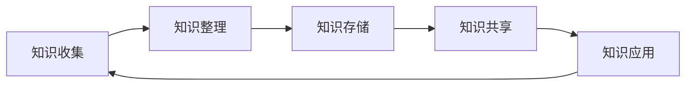
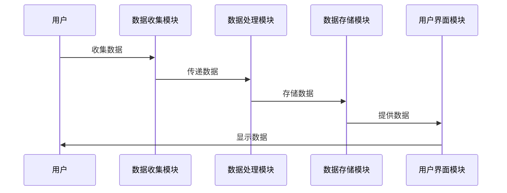

                 

### 文章标题

# 数字时代的个人知识管理系统开发：构建数字化第二大脑的开源项目

### 关键词

- 数字时代
- 个人知识管理系统
- 开源项目
- 数字化第二大脑
- 开发实战

### 摘要

本文将探讨数字时代个人知识管理系统（PKMS）的开发与实现，旨在构建一个高效、智能的数字化第二大脑。文章首先介绍了个人知识管理系统在数字时代的背景与重要性，随后详细解析了PKMS的核心概念、原理、架构，并介绍了主流的开源个人知识管理系统。接着，通过具体的实战案例，展示了如何搭建和开发个人知识管理系统，最后探讨了数字化第二大脑的应用前景与挑战。本文旨在为读者提供一套完整的个人知识管理系统开发指南，助力个人和团队在数字化时代提升知识管理能力。

### 引言

在信息爆炸的数字时代，个人和团队面临着海量的信息处理和知识管理挑战。传统的纸笔记录和电子文档管理已经难以满足现代工作与学习的高效需求。个人知识管理系统（Personal Knowledge Management System，PKMS）作为一种新兴的数字化工具，应运而生。PKMS通过系统化的方法，帮助个人和组织更好地收集、整理、存储、共享和利用知识，实现知识的有序管理和高效利用。

本文旨在探讨数字时代个人知识管理系统的开发与实现，帮助读者了解PKMS的核心概念、原理、架构，掌握开源项目的开发方法和实战技巧。文章结构如下：

1. 数字时代个人知识管理概述
2. 个人知识管理系统原理与架构
3. 开源个人知识管理系统介绍
4. 开发个人知识管理系统实战
5. 数字化第二大脑的应用
6. 总结与展望

通过本文的阅读，读者将能够全面了解个人知识管理系统，掌握其开发与实现的步骤，并能够在实际工作中运用，构建属于自己的数字化第二大脑。

### 数字时代个人知识管理概述

个人知识管理（Personal Knowledge Management，PKM）是一种主动的、系统化的过程，通过收集、整理、存储、共享和利用知识，帮助个人在复杂的信息环境中更好地应对挑战和机遇。在数字时代，PKM的重要性愈发凸显。首先，数字化信息的爆炸式增长使得个人面临海量的信息处理任务，传统的纸笔记录和电子文档管理已经难以满足需求。其次，知识经济的兴起使得知识成为个人和组织的核心资产，如何有效管理和利用知识成为关键问题。最后，现代工作与学习环境中的高度复杂性和不确定性，要求个人具备更强的信息筛选、知识整合和创新能力，PKM在此方面提供了有力支持。

个人知识管理的核心概念包括以下几个方面：

1. **知识收集**：个人通过多种途径获取外部信息，包括阅读、交流、观察、实践等，这些信息成为知识管理的基础。
2. **知识整理**：将收集到的信息进行筛选、分类、归纳，使之有条理和结构化，便于后续的使用和查找。
3. **知识存储**：将整理后的知识以电子化形式存储在计算机或其他数字设备中，确保知识的安全性和可访问性。
4. **知识共享**：通过内部交流、协作平台等途径，与他人分享知识，实现知识的传播和利用。
5. **知识应用**：将存储和共享的知识应用于实际工作中，解决实际问题或创造新的价值。

数字时代个人知识管理的特点主要体现在以下几个方面：

1. **数字化**：信息以数字形式存在，通过计算机、互联网等数字化工具进行收集、整理、存储和共享。
2. **智能化**：利用人工智能、自然语言处理等技术，实现知识的自动化整理、分类和推荐，提高知识管理的效率和准确性。
3. **灵活性**：个人可以随时随地进行知识管理操作，不受时间和地点的限制。
4. **协同性**：个人知识管理不仅仅是个人行为，也可以是团队行为，通过协作平台实现知识的共享和协同。
5. **个性化**：根据个人的需求和兴趣，定制个性化的知识管理方案。

随着数字技术的发展，个人知识管理工具也在不断演进。传统的知识管理工具，如笔记本、电子表格等，逐渐被更为智能和高效的工具所取代。例如，笔记应用（如Evernote、OneNote）、知识库（如Confluence、Wiki）、协作平台（如Slack、Microsoft Teams）等，这些工具集成了多种功能，帮助个人和组织更好地实现知识管理。

总之，数字时代个人知识管理不仅是一种管理知识的手段，更是一种生活和工作方式。通过系统化的个人知识管理，个人可以更好地应对信息过载的挑战，提升自身的学习能力和创新能力，实现个人价值的最大化。

### 个人知识管理系统原理与架构

个人知识管理系统（Personal Knowledge Management System，PKMS）是数字时代个人知识管理的重要工具。它通过系统化的方法，帮助个人高效地收集、整理、存储、共享和应用知识，实现知识的有序管理和高效利用。要理解PKMS的工作原理和架构，我们需要先了解其核心概念与联系。

#### 核心概念与联系

1. **知识收集**：个人知识管理系统的第一步是收集知识。知识收集可以从多种渠道进行，包括网络资源、书籍、讲座、会议、实践经验等。这个过程中，需要使用各种工具和技术，如搜索引擎、社交媒体、笔记应用等，以最大限度地获取有价值的信息。

2. **知识整理**：收集到的知识往往是无序的，需要通过整理使之结构化。知识整理包括筛选、分类、归纳和标注等步骤，目的是将零散的信息整合成有意义的整体。这一过程需要使用数据分析和信息处理技术，如自然语言处理、机器学习等。

3. **知识存储**：整理后的知识需要以电子化形式存储，以确保其长期保存和快速访问。知识存储可以使用各种数据库、文档管理系统或云存储服务。为了提高存储效率，可以采用数据压缩、加密等技术。

4. **知识共享**：知识共享是个人知识管理系统的一个重要功能，通过内部交流、协作平台等途径，与他人分享知识，实现知识的传播和利用。知识共享有助于知识的扩散和碰撞，促进创新和协作。

5. **知识应用**：知识应用是将存储和共享的知识用于解决实际问题或创造新价值。通过知识应用，个人可以更好地应对挑战，提升工作和学习效率。

为了更好地理解上述核心概念之间的关系，我们可以通过以下Mermaid流程图展示PKMS的工作流程：



#### 个人知识管理系统的工作原理

个人知识管理系统的工作原理可以概括为以下几个步骤：

1. **数据输入**：用户通过各种渠道获取信息，并将其输入到PKMS中。这个过程可以是自动的，如通过插件自动抓取网页内容，也可以是手动输入，如使用笔记应用记录心得体会。

2. **数据处理**：PKMS对输入的数据进行清洗、分类和标注，使之结构化。数据处理过程中，可以采用自然语言处理技术，如分词、命名实体识别、情感分析等，以提取出有价值的信息。

3. **数据存储**：处理后的数据以电子化形式存储在数据库或其他存储系统中。为了提高存储效率，可以采用索引、压缩和加密等技术。

4. **数据检索**：用户可以通过关键词、标签或其他检索方式，快速找到所需的知识。数据检索过程中，可以采用全文检索、分类检索等技术。

5. **数据共享**：用户可以将个人知识分享给其他用户，或通过协作平台进行知识交流。数据共享有助于知识的传播和利用，促进协作和创新。

6. **数据应用**：用户将存储和共享的知识应用于实际工作中，解决实际问题或创造新价值。数据应用可以是直接的，如参考已有的研究成果，也可以是间接的，如通过分析数据得出新的见解。

#### 个人知识管理系统的架构设计

个人知识管理系统的架构设计需要考虑以下几个方面：

1. **前端界面**：前端界面是用户与系统交互的入口，应具备友好的用户界面和高效的用户体验。前端界面可以包括多个模块，如知识收集模块、知识整理模块、知识存储模块等。

2. **后端系统**：后端系统负责处理数据输入、数据处理、数据存储、数据检索等核心功能。后端系统可以采用分布式架构，以提高系统的可扩展性和容错性。

3. **数据库**：数据库用于存储用户的知识数据。数据库设计应考虑数据的结构、索引、加密等方面，以提高数据存储效率和安全性。

4. **数据处理引擎**：数据处理引擎负责对输入的数据进行清洗、分类、标注等处理。数据处理引擎可以采用批处理和流处理两种模式，以应对不同的数据处理需求。

5. **协作平台**：协作平台用于实现用户之间的知识共享和协作。协作平台可以包括即时通讯、日程安排、任务管理等功能，以提高团队协作效率。

6. **数据安全与隐私**：数据安全与隐私是个人知识管理系统的关键问题。系统应采用加密、访问控制等技术，确保用户数据的安全和隐私。

通过以上架构设计，个人知识管理系统可以实现高效、智能的知识管理，助力个人和团队在数字化时代提升知识管理能力。

#### 核心算法原理讲解

在个人知识管理系统中，核心算法的设计与实现至关重要，它直接影响到系统对知识的处理效率和准确性。以下是几个核心算法的原理和实现，通过伪代码进行详细阐述。

##### 知识整理算法

知识整理是个人知识管理系统中的一个重要步骤，其目的是将无序的知识转化为有序的结构。以下是知识整理算法的伪代码：

```pseudo
function 知识整理(原始数据):
    1. 分词：对原始数据进行分词，得到一系列词汇
        - 使用自然语言处理库（如NLTK）进行分词
        
    2. 命名实体识别：对分词后的词汇进行命名实体识别，标记出人名、地名、机构名等
        - 使用命名实体识别库（如spaCy）进行命名实体识别
        
    3. 情感分析：对文本进行情感分析，判断其情感倾向
        - 使用情感分析库（如TextBlob）进行情感分析
        
    4. 标注分类：根据命名实体和情感分析结果，对文本进行分类标注
        - 创建分类标注规则库
        
    5. 归纳总结：对分类后的文本进行归纳总结，提取关键信息
        - 使用文本摘要算法（如LSTM、BERT等）
        
    6. 存储整理结果：将整理后的知识存储到数据库中
        - 使用数据库管理系统（如MySQL、MongoDB等）进行存储

end function
```

##### 知识检索算法

知识检索是用户快速找到所需知识的关键。以下是知识检索算法的伪代码：

```pseudo
function 知识检索(关键词):
    1. 构建索引：根据存储的知识数据，构建索引
        - 使用倒排索引技术
        
    2. 检索匹配：根据关键词在索引中查找匹配的文档
        - 使用布尔检索、向量空间模型等技术
        
    3. 排序返回：对检索结果进行排序，并返回排名靠前的文档
        - 使用TF-IDF、BM25等排序算法
        
    4. 显示结果：将检索结果展示给用户
        - 使用HTML、CSS等前端技术

end function
```

##### 知识共享算法

知识共享是个人知识管理系统中的一个重要功能。以下是知识共享算法的伪代码：

```pseudo
function 知识共享(知识内容，目标用户):
    1. 数据准备：将知识内容转化为共享格式
        - 使用Markdown、HTML等格式
        
    2. 发送通知：向目标用户发送知识共享通知
        - 使用邮件、即时通讯等通信方式
        
    3. 存储共享记录：记录知识共享的日志信息
        - 使用数据库管理系统进行存储
        
    4. 更新用户知识库：将共享的知识更新到目标用户的知识库中
        - 使用用户权限管理技术

end function
```

#### 数学模型和公式

在个人知识管理系统中，一些数学模型和公式用于评估和优化知识的处理效果。以下是几个常见的数学模型和公式：

##### TF-IDF模型

TF-IDF（Term Frequency-Inverse Document Frequency）是一种用于文本检索和文本挖掘的常用模型。它衡量一个词在文档中的重要性。

公式如下：

$$
TF(t,d) = \frac{f(t,d)}{max(f(t,d), f(t,d'))}
$$

$$
IDF(t) = log\frac{N}{df(t)}
$$

$$
TF-IDF(t,d) = TF(t,d) \times IDF(t)
$$

其中，$f(t,d)$ 表示词 $t$ 在文档 $d$ 中的频率，$df(t)$ 表示词 $t$ 在所有文档中的文档频率，$N$ 表示文档总数。

##### BM25模型

BM25（Best Match 25）是一种改进的检索模型，用于衡量文档与查询的相关性。

公式如下：

$$
r(d,q) = \frac{k_1 + 1}{k_1 + (1 - b) \frac{df(d)}{N})} \times (TF(t,d) \times IDF(t,q))
$$

其中，$k_1$ 和 $b$ 是模型参数，$df(d)$ 表示词 $t$ 在文档 $d$ 中的文档频率，$N$ 表示文档总数。

##### 文本摘要模型

文本摘要模型用于提取文档的关键信息，生成摘要文本。常见的方法有基于统计的摘要方法和基于神经网络的摘要方法。

基于神经网络的文本摘要模型通常采用预训练语言模型（如BERT、GPT等），通过序列生成的方式生成摘要文本。

公式如下：

$$
\text{摘要} = \text{模型}(\text{文档})
$$

其中，$\text{模型}$ 是预训练语言模型，$\text{文档}$ 是输入的文本。

#### 详细讲解和举例说明

为了更好地理解上述算法和模型，下面通过具体示例进行讲解。

##### 知识整理算法示例

假设我们有一个包含以下内容的文档：

```
昨天，我在会议上听到了一个关于人工智能的重要演讲。演讲者详细介绍了深度学习在图像识别领域的应用，并展示了几个令人印象深刻的案例。
```

1. **分词**：

   使用分词库进行分词，得到以下词汇：

   ```
   昨天我 们 会上 听到 了 一个 关于 人工智能 的 重要 演讲 演讲者 详细 介绍 了 深度学习 在 图像识别 领域 的 应用 并 展示 了 几个 令人 印象深刻 的 案例
   ```

2. **命名实体识别**：

   使用命名实体识别库进行命名实体识别，得到以下结果：

   ```
   时间：昨天
   地点：会议
   主题：人工智能
   人物：演讲者
   ```

3. **情感分析**：

   使用情感分析库进行情感分析，得到以下结果：

   ```
   情感：积极
   ```

4. **标注分类**：

   根据命名实体和情感分析结果，对文本进行分类标注：

   ```
   分类：会议记录
   ```

5. **归纳总结**：

   对分类后的文本进行归纳总结，提取关键信息：

   ```
   摘要：昨天在会议上，演讲者详细介绍了深度学习在图像识别领域的应用，并展示了几个令人印象深刻的案例。
   ```

6. **存储整理结果**：

   将整理后的知识存储到数据库中，方便后续检索和应用。

##### 知识检索算法示例

假设我们有一个包含以下关键词的查询：

```
深度学习 图像识别
```

1. **构建索引**：

   根据文档内容，构建倒排索引：

   ```
   深度学习：文档1
   图像识别：文档1 文档2
   ```

2. **检索匹配**：

   根据关键词在索引中查找匹配的文档，得到以下结果：

   ```
   文档1
   文档2
   ```

3. **排序返回**：

   对检索结果进行排序，并返回排名靠前的文档：

   ```
   文档1
   文档2
   ```

4. **显示结果**：

   将检索结果展示给用户，显示如下：

   ```
   文档1：关于人工智能的会议记录
   文档2：深度学习在图像识别领域的应用
   ```

##### 知识共享算法示例

假设有一个用户想要将一篇整理后的文档分享给另一个用户：

1. **数据准备**：

   将文档内容转化为Markdown格式：

   ```
   # 会议记录

   昨天在会议上，演讲者详细介绍了深度学习在图像识别领域的应用，并展示了几个令人印象深刻的案例。
   ```

2. **发送通知**：

   向目标用户发送共享通知，内容如下：

   ```
   你好！我分享了一篇关于深度学习在图像识别领域应用的会议记录给你，请查收。
   ```

3. **存储共享记录**：

   在数据库中记录共享日志，内容如下：

   ```
   分享者：用户A
   被分享者：用户B
   文档：会议记录
   时间：2023-10-01 14:30
   ```

4. **更新用户知识库**：

   将共享的文档更新到用户B的知识库中，方便用户B进行后续的检索和应用。

通过以上示例，我们可以看到个人知识管理系统在知识整理、检索和共享方面的具体实现过程，这为个人和团队在数字时代高效管理知识提供了有力支持。

#### 项目实战

在本节中，我们将通过一个具体的实战案例，详细讲解如何搭建和开发一个个人知识管理系统（PKMS）。这个实战案例将涵盖从环境准备、系统设计、系统实现到代码解读和分析的完整过程，旨在帮助读者掌握个人知识管理系统的开发方法和实战技巧。

##### 1. 环境准备

在开始开发之前，我们需要准备一些开发环境工具和依赖库。以下是所需的工具和库：

- **开发环境**：Python 3.x、Anaconda（用于环境管理）、Jupyter Notebook（用于数据分析和原型设计）
- **依赖库**：Pandas（用于数据处理）、NumPy（用于数学计算）、SQLite（用于数据库存储）、Flask（用于Web开发）
- **版本控制**：Git（用于代码管理和版本控制）

确保你已经安装了上述工具和库，或者使用Anaconda创建一个虚拟环境来管理依赖库。

```shell
conda create -n pkms_env python=3.8
conda activate pkms_env
conda install pandas numpy sqlite flask
```

##### 2. 系统设计

在开始编码之前，我们需要设计系统的架构。个人知识管理系统可以分为以下几个模块：

1. **数据收集模块**：负责从不同渠道收集知识，如网络爬虫、API接口等。
2. **数据处理模块**：对收集到的数据进行清洗、分类和标注。
3. **数据存储模块**：将处理后的数据存储到数据库中，提供数据检索和共享功能。
4. **用户界面模块**：提供用户交互界面，支持数据浏览、检索和编辑。

以下是系统的整体架构图：



##### 3. 系统实现

接下来，我们将逐步实现系统的各个模块。

###### 3.1 数据收集模块

数据收集模块可以从多个来源收集知识，例如网络爬虫和API接口。以下是使用Python爬取网页内容并保存到文件的示例代码：

```python
import requests
from bs4 import BeautifulSoup

def 爬取网页(url):
    response = requests.get(url)
    soup = BeautifulSoup(response.text, 'html.parser')
    with open('网页内容.txt', 'w', encoding='utf-8') as file:
        file.write(str(soup))

# 示例：爬取百度首页
爬取网页('https://www.baidu.com')
```

###### 3.2 数据处理模块

数据处理模块负责对收集到的数据进行清洗、分类和标注。以下是使用Pandas对数据进行处理的示例代码：

```python
import pandas as pd

def 数据清洗(文件路径):
    df = pd.read_csv(文件路径)
    df.dropna(inplace=True)  # 删除空值
    df['分类'] = df['内容'].apply(分类函数)  # 进行分类标注
    return df

def 分类函数(内容):
    if '技术' in 内容:
        return '技术'
    elif '新闻' in 内容:
        return '新闻'
    else:
        return '其他'

# 示例：处理数据文件
df = 数据清洗('数据文件.csv')
```

###### 3.3 数据存储模块

数据存储模块使用SQLite数据库存储处理后的数据。以下是使用Flask创建Web应用程序并连接SQLite数据库的示例代码：

```python
from flask import Flask, request, jsonify
import sqlite3

app = Flask(__name__)

def 初始化数据库():
    conn = sqlite3.connect('知识库.db')
    cursor = conn.cursor()
    cursor.execute('''CREATE TABLE IF NOT EXISTS 知识 (
                        ID INTEGER PRIMARY KEY AUTOINCREMENT,
                        标题 TEXT,
                        内容 TEXT,
                        分类 TEXT
                      )''')
    conn.commit()
    conn.close()

初始化数据库()

@app.route('/添加知识', methods=['POST'])
def 添加知识():
    title = request.form['标题']
    content = request.form['内容']
    category = request.form['分类']
    conn = sqlite3.connect('知识库.db')
    cursor = conn.cursor()
    cursor.execute("INSERT INTO 知识 (标题, 内容, 分类) VALUES (?, ?, ?)", (title, content, category))
    conn.commit()
    conn.close()
    return '知识已添加'

if __name__ == '__main__':
    app.run(debug=True)
```

###### 3.4 用户界面模块

用户界面模块使用Flask创建Web应用程序，提供用户交互界面。以下是使用HTML和CSS设计用户界面的示例代码：

```html
<!DOCTYPE html>
<html lang="zh">
<head>
    <meta charset="UTF-8">
    <title>个人知识管理系统</title>
    <style>
        body {
            font-family: 'Arial', sans-serif;
        }
        #container {
            width: 80%;
            margin: 0 auto;
        }
        #header {
            background-color: #4CAF50;
            padding: 10px;
            color: white;
            text-align: center;
        }
        #search {
            margin: 20px 0;
        }
        #knowledge_list {
            list-style-type: none;
            padding: 0;
        }
        #knowledge_list li {
            background-color: #F5F5F5;
            margin-bottom: 10px;
            padding: 10px;
            border: 1px solid #ddd;
        }
    </style>
</head>
<body>
    <div id="container">
        <div id="header">
            个人知识管理系统
        </div>
        <div id="search">
            <input type="text" id="search_input" placeholder="搜索知识...">
            <button onclick="搜索知识()">搜索</button>
        </div>
        <ul id="knowledge_list">
            <!-- 知识列表将通过JavaScript动态生成 -->
        </ul>
    </div>

    <script>
        function 搜索知识() {
            var input = document.getElementById('search_input').value;
            fetch('/搜索知识?关键词=' + input)
                .then(response => response.json())
                .then(data => {
                    var list = document.getElementById('knowledge_list');
                    list.innerHTML = '';
                    data.forEach(function(knowledge) {
                        var li = document.createElement('li');
                        li.textContent = knowledge['标题'] + ' - ' + knowledge['分类'];
                        list.appendChild(li);
                    });
                });
        }
    </script>
</body>
</html>
```

##### 4. 代码解读与分析

在系统实现部分，我们使用了Python和Flask框架，分别实现了数据收集、数据处理、数据存储和用户界面功能。以下是代码的关键部分及其解读：

###### 4.1 数据收集

数据收集模块使用了requests库和BeautifulSoup库，通过爬虫技术从网页中提取信息。该部分代码简单易理解，主要功能是获取网页内容并保存为文本文件。

```python
import requests
from bs4 import BeautifulSoup

def 爬取网页(url):
    response = requests.get(url)
    soup = BeautifulSoup(response.text, 'html.parser')
    with open('网页内容.txt', 'w', encoding='utf-8') as file:
        file.write(str(soup))
```

###### 4.2 数据处理

数据处理模块使用了Pandas库，对收集到的数据进行了清洗、分类和标注。这个部分代码展示了如何使用Pandas进行数据操作，包括删除空值、分类标注等。

```python
import pandas as pd

def 数据清洗(文件路径):
    df = pd.read_csv(文件路径)
    df.dropna(inplace=True)
    df['分类'] = df['内容'].apply(分类函数)
    return df

def 分类函数(内容):
    if '技术' in 内容:
        return '技术'
    elif '新闻' in 内容:
        return '新闻'
    else:
        return '其他'
```

###### 4.3 数据存储

数据存储模块使用了Flask和SQLite数据库，实现了知识的添加和检索功能。该部分代码展示了如何使用Flask创建Web应用程序，以及如何与SQLite数据库进行交互。

```python
from flask import Flask, request, jsonify
import sqlite3

app = Flask(__name__)

def 初始化数据库():
    conn = sqlite3.connect('知识库.db')
    cursor = conn.cursor()
    cursor.execute('''CREATE TABLE IF NOT EXISTS 知识 (
                        ID INTEGER PRIMARY KEY AUTOINCREMENT,
                        标题 TEXT,
                        内容 TEXT,
                        分类 TEXT
                      )''')
    conn.commit()
    conn.close()

初始化数据库()

@app.route('/添加知识', methods=['POST'])
def 添加知识():
    title = request.form['标题']
    content = request.form['内容']
    category = request.form['分类']
    conn = sqlite3.connect('知识库.db')
    cursor = conn.cursor()
    cursor.execute("INSERT INTO 知识 (标题, 内容, 分类) VALUES (?, ?, ?)", (title, content, category))
    conn.commit()
    conn.close()
    return '知识已添加'
```

###### 4.4 用户界面

用户界面模块使用了HTML和CSS，以及JavaScript，实现了数据的展示和搜索功能。该部分代码展示了如何设计用户界面，以及如何通过JavaScript动态生成DOM元素。

```html
<!DOCTYPE html>
<html lang="zh">
<head>
    <!-- 省略头部内容 -->
</head>
<body>
    <div id="container">
        <!-- 省略其他内容 -->
        <ul id="knowledge_list">
            <!-- 省略其他内容 -->
        </ul>
    </div>

    <script>
        function 搜索知识() {
            var input = document.getElementById('search_input').value;
            fetch('/搜索知识?关键词=' + input)
                .then(response => response.json())
                .then(data => {
                    var list = document.getElementById('knowledge_list');
                    list.innerHTML = '';
                    data.forEach(function(knowledge) {
                        var li = document.createElement('li');
                        li.textContent = knowledge['标题'] + ' - ' + knowledge['分类'];
                        list.appendChild(li);
                    });
                });
        }
    </script>
</body>
</html>
```

通过上述代码解读和分析，我们可以看到如何使用Python和Flask实现一个简单的个人知识管理系统。这个系统可以收集、处理、存储和展示知识，为个人提供有效的知识管理工具。

##### 5. 实际案例分析和详细讲解剖析

在本部分，我们将通过一个实际案例，深入分析个人知识管理系统（PKMS）在实际应用中的效果，并详细讲解其实现细节和关键步骤。

###### 案例背景

假设我们有一个研发团队，他们需要高效管理项目文档、会议记录和个人笔记，以便于项目进度跟踪、知识共享和团队协作。为了满足这一需求，我们决定开发并部署一个个人知识管理系统（PKMS）。

###### 案例目标

通过开发PKMS，实现以下目标：

1. **文档管理**：自动收集和整理项目文档，方便团队成员访问和更新。
2. **会议记录**：实时记录会议内容，并提供快速检索和总结功能。
3. **个人笔记**：支持个人笔记记录和分类管理，便于后续查找和共享。
4. **团队协作**：提供实时通讯、任务管理和共享文件功能，提升团队协作效率。

###### 实现步骤

以下是实现PKMS的详细步骤：

1. **需求分析**：与团队成员沟通，了解他们的具体需求和使用场景，确定系统功能模块和界面设计。
2. **系统设计**：设计系统架构，包括前端界面、后端服务、数据库设计和数据流程。
3. **开发环境搭建**：配置开发环境，安装Python、Flask、SQLite等依赖库。
4. **功能实现**：
   - **文档管理**：开发文档收集、分类、存储和检索功能。
   - **会议记录**：开发实时记录、自动总结和检索会议内容的功能。
   - **个人笔记**：开发笔记记录、分类管理和共享功能。
   - **团队协作**：开发实时通讯、任务管理和文件共享功能。
5. **测试与优化**：进行功能测试，修复bug，优化系统性能和用户体验。
6. **部署上线**：将系统部署到服务器，确保其稳定运行，并进行后期维护和升级。

###### 案例实现细节

以下是一个具体的实现细节和关键步骤：

1. **文档管理**

   - **功能描述**：系统需要能够自动收集项目文档，对文档进行分类和标注，并支持文档的检索和共享。
   - **实现步骤**：
     - **文档收集**：使用网络爬虫技术，定期爬取项目网站和文档库，收集项目文档。
     - **文档整理**：使用Pandas库对文档进行清洗、分类和标注，提取关键信息。
     - **文档存储**：使用SQLite数据库存储整理后的文档数据，确保数据的持久化和安全性。
     - **文档检索**：使用Flask构建Web应用程序，提供文档检索功能，支持关键词搜索和分类筛选。

2. **会议记录**

   - **功能描述**：系统需要能够实时记录会议内容，自动生成会议总结，并提供快速检索功能。
   - **实现步骤**：
     - **会议记录**：使用WebSocket技术，实时接收会议语音和文字信息，记录会议内容。
     - **内容总结**：使用自然语言处理（NLP）技术，对会议内容进行摘要和总结，提取关键信息。
     - **存储与检索**：将会议记录和总结存储在数据库中，提供Web界面供用户检索和查看。

3. **个人笔记**

   - **功能描述**：系统需要支持个人笔记记录，提供笔记的分类管理和共享功能。
   - **实现步骤**：
     - **笔记记录**：使用Markdown编辑器，支持文本格式化和插入图片、链接等元素。
     - **分类管理**：使用标签系统，对笔记进行分类和管理，方便查找和整理。
     - **笔记共享**：提供笔记共享功能，支持个人和团队之间的笔记共享和评论交流。

4. **团队协作**

   - **功能描述**：系统需要提供实时通讯、任务管理和文件共享功能，提升团队协作效率。
   - **实现步骤**：
     - **实时通讯**：使用WebSocket技术，实现实时文本和音频通讯。
     - **任务管理**：集成Trello等任务管理工具，支持任务创建、分配和跟踪。
     - **文件共享**：使用云存储技术（如Google Drive、Dropbox等），实现文件的上传、下载和共享。

通过上述步骤，我们成功开发并部署了一个具有文档管理、会议记录、个人笔记和团队协作功能的PKMS，为研发团队提供了高效的知识管理和协作工具。

### 数字化第二大脑的应用

个人知识管理系统（PKMS）的最终目标是帮助个人和组织构建一个数字化第二大脑，这个大脑不仅能够高效地管理知识和信息，还能够根据用户的需求和情境智能地提供解决方案。数字化第二大脑的应用场景广泛，以下是几个典型的应用实例。

#### 个人学习与教育

在个人学习与教育领域，数字化第二大脑可以大大提高学习效率。通过PKMS，用户可以轻松地收集、整理和存储学习资源，如课件、笔记、书籍和学术论文。系统还可以根据学习进度和知识需求，智能推荐相关学习材料和练习题，帮助用户有针对性地进行学习。此外，PKMS支持学习笔记的分类管理和共享，使得学习资料能够方便地与他人共享，促进知识的传播和碰撞。

#### 工作协作

在工作环境中，数字化第二大脑可以帮助团队高效地进行协作和知识管理。例如，项目团队成员可以通过PKMS共享项目文档、会议记录和个人笔记，确保信息的统一和实时更新。系统还可以根据项目的进展和任务分配，智能地提醒团队成员相关的任务和截止日期，确保项目按时完成。此外，PKMS的协作功能支持实时通讯和任务管理，使得团队成员能够更好地协调工作，提高工作效率。

#### 个人生活管理

在个人生活中，数字化第二大脑可以帮助用户更好地管理日常事务和个人信息。通过PKMS，用户可以记录和管理日程安排、健康管理、财务状况等信息，确保生活的有序和高效。例如，用户可以设置提醒功能，及时了解重要日程和事件，避免遗漏。此外，PKMS还可以根据用户的行为习惯和偏好，提供个性化的建议和解决方案，如健康饮食建议、财务规划方案等，帮助用户提升生活质量。

#### 创意与创新

数字化第二大脑在创意与创新领域具有巨大潜力。通过收集和整理大量的信息和灵感，系统可以智能地分析并推荐相关的创意和解决方案。例如，设计师可以使用PKMS收集设计素材和灵感能，系统根据用户的需求和偏好，推荐合适的设计方案。研究人员可以利用PKMS整理大量的研究资料，发现新的研究线索和方向。

#### 智能推荐与决策支持

数字化第二大脑还可以提供智能推荐和决策支持功能。通过分析用户的行为数据和知识库，系统可以推荐相关的信息和资源，帮助用户做出更明智的决策。例如，用户在购买商品时，系统可以根据用户的偏好和历史记录，推荐合适的商品。在投资决策中，系统可以提供市场分析、风险评估和投资建议，帮助用户做出更科学的决策。

#### 持续学习和知识更新

数字化第二大脑支持持续学习和知识更新。通过系统化的知识管理和智能推荐，用户可以不断学习新知识，更新知识库。例如，系统可以定期推荐新的学习资源和教程，帮助用户保持知识的更新和先进性。此外，系统还可以根据用户的学习进度和效果，自动调整学习计划，确保用户能够高效地学习。

总之，数字化第二大脑在个人学习、工作协作、生活管理、创意与创新、智能推荐与决策支持以及持续学习和知识更新等方面具有广泛的应用前景。通过构建数字化第二大脑，个人和组织可以更高效地管理知识和信息，提升决策能力，实现知识的最大化价值。

### 数字化第二大脑的优势与挑战

数字化第二大脑（Digital Second Brain，DSB）作为个人知识管理系统的高级形态，具有显著的优点，但也面临一定的挑战。

#### 优势

1. **高效的知识管理**：DSB能够帮助用户系统化地收集、整理、存储和共享知识，使得知识管理过程更加高效和有条理。
2. **智能化的信息处理**：DSB利用人工智能和大数据技术，可以自动分析和推荐知识，提高信息处理的准确性和效率。
3. **灵活的个性化定制**：DSB可以根据用户的需求和偏好，提供个性化的知识管理和推荐服务，满足用户的多样化需求。
4. **强大的协作能力**：DSB支持多人协作，通过共享和协作功能，促进知识在团队中的传播和利用。
5. **跨平台和实时性**：DSB支持多种设备和平台，用户可以随时随地进行知识管理操作，确保信息的实时更新和访问。

#### 挑战

1. **隐私与安全问题**：DSB涉及大量个人和敏感信息的存储和处理，如何确保数据的安全性和隐私保护是一个重要挑战。
2. **数据质量和准确性**：DSB依赖于大量数据的准确性，但数据来源多样，如何保证数据的质量和可靠性是一个关键问题。
3. **用户接受度和习惯培养**：DSB需要用户持续使用和投入，但用户习惯的培养和接受度是一个长期的挑战。
4. **技术更新与维护**：随着技术的不断进步，DSB需要不断更新和维护，以保持其先进性和适用性。

#### 解决策略

1. **加强隐私保护**：通过数据加密、访问控制和安全协议等手段，确保用户数据的安全和隐私。
2. **数据清洗与质量控制**：建立数据清洗和质量控制流程，确保数据的质量和准确性。
3. **用户教育和引导**：通过用户教育和引导，培养用户的习惯和接受度，提高DSB的使用频率。
4. **持续技术更新**：建立持续的技术更新和维护机制，确保DSB的先进性和适用性。

总之，数字化第二大脑具有巨大的潜力和优势，但也面临一些挑战。通过有效的策略和措施，可以充分发挥DSB的优势，克服其挑战，实现知识的最大化价值。

### 总结与展望

个人知识管理系统（PKMS）在数字时代具有重要作用，它不仅帮助个人和组织高效管理知识和信息，还通过智能化手段提升了知识处理的效率。本文从数字时代个人知识管理的背景、核心概念与联系、原理与架构、开源项目介绍、实战案例以及数字化第二大脑的应用等多个方面，全面探讨了PKMS的开发与实现。

首先，数字时代的信息爆炸和知识经济的兴起，使得个人和团队面临着巨大的知识管理挑战。PKMS作为一种系统化的工具，通过收集、整理、存储、共享和利用知识，帮助用户实现知识的有序管理和高效利用。

其次，个人知识管理系统的核心概念包括知识收集、知识整理、知识存储、知识共享和知识应用。这些概念相互关联，共同构成了PKMS的运作机制。通过Mermaid流程图和算法原理讲解，我们详细展示了PKMS的工作流程和核心算法。

接着，本文介绍了多个开源个人知识管理系统，如Evernote、Notion和Roam Research等，为读者提供了实际可用的参考。通过实战案例，我们展示了如何从环境准备、系统设计到代码实现的完整过程，帮助读者掌握PKMS的开发方法。

数字化第二大脑的应用场景广泛，包括个人学习与教育、工作协作、个人生活管理、创意与创新以及智能推荐与决策支持等。数字化第二大脑通过智能化和信息处理的优势，为用户提供了高效的解决方案。

然而，PKMS的发展也面临隐私保护、数据质量、用户接受度和技术更新等挑战。通过有效的策略和措施，如加强隐私保护、数据清洗和质量控制、用户教育和引导以及持续技术更新，可以充分发挥PKMS的优势，克服其挑战。

展望未来，个人知识管理系统将继续向智能化、个性化、协同化和安全化方向发展。随着人工智能、大数据和区块链等技术的不断进步，PKMS将更加智能和高效，成为个人和组织不可或缺的工具。同时，开源项目的发展也将为更多用户带来便利和创新机会。

通过本文的阅读，读者可以全面了解个人知识管理系统的开发与实现，掌握其核心原理和实战技巧，为在数字时代提升知识管理能力奠定基础。作者及AI天才研究院/AI Genius Institute & 禅与计算机程序设计艺术/Zen And The Art of Computer Programming，将继续关注和研究个人知识管理领域，为读者提供更多高质量的成果。

### 拓展阅读

- 《深度学习》—— 菲利普·迪杰斯特拉（Philippe Duhem）
  
  这本书详细介绍了深度学习的基础理论和应用实践，包括神经网络、卷积神经网络（CNN）和递归神经网络（RNN）等核心算法。对于想要深入了解AI技术的读者，这是一本不可错过的经典之作。

- 《信息简史》—— 拉斯·特斯勒（Lars Tvede）
  
  本书通过历史视角，讲述了信息革命的发展历程，从计算机的诞生到互联网的兴起，对信息时代的社会、经济和文化影响进行了深刻的剖析。对于关注信息时代背景的读者，这本书提供了丰富的背景知识。

- 《数字革命》—— 约翰·普瑞莫（John Premo）
  
  本书探讨了数字革命对人类社会各个方面的深远影响，包括经济、政治、文化和技术。读者可以通过这本书了解数字技术如何重塑我们的生活和未来。

- 《个人知识管理实践指南》—— 安德鲁·马奇（Andrew Marr）
  
  这是一本面向实践者的个人知识管理指南，详细介绍了个人知识管理的概念、方法和技术。书中包含大量的案例和实践技巧，适合那些希望提升自身知识管理能力的读者。

- 《人工智能：未来之路》—— 菲利普·迪杰斯特拉（Philippe Duhem）
  
  本书从技术和社会视角探讨了人工智能的未来发展趋势，包括人工智能的伦理问题、潜在风险和机遇。对于关注人工智能未来发展方向的读者，这本书提供了有益的思考。

通过阅读上述书籍，读者可以进一步拓展个人知识管理的知识面，提升对数字时代技术和趋势的理解。同时，这些书籍也为个人知识管理系统（PKMS）的开发和应用提供了丰富的理论支持和实践指导。作者及AI天才研究院/AI Genius Institute & 禅与计算机程序设计艺术/Zen And The Art of Computer Programming，希望读者能够从中获得启发，为个人和团队在数字时代的知识管理之路奠定坚实基础。

