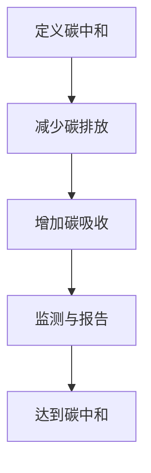
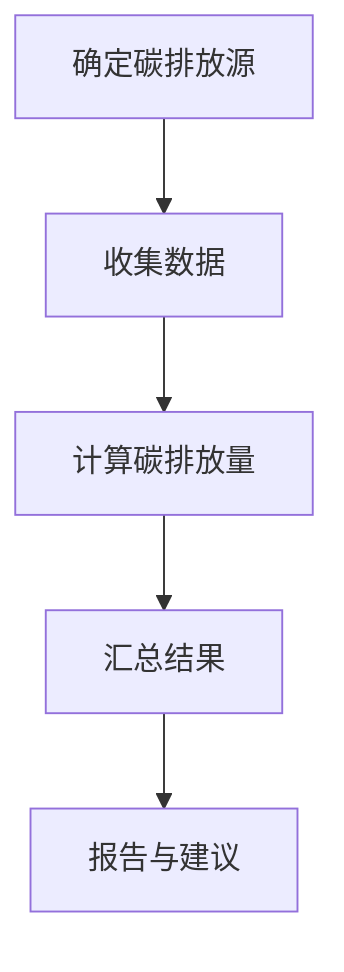
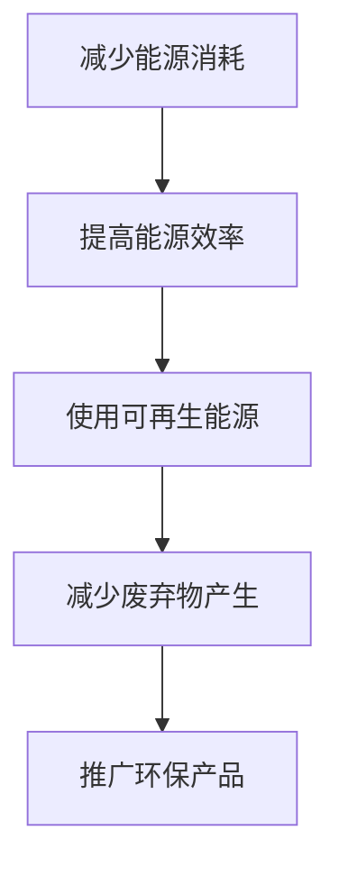
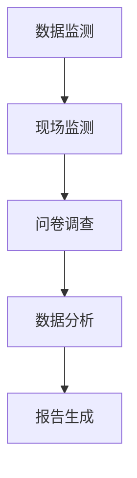
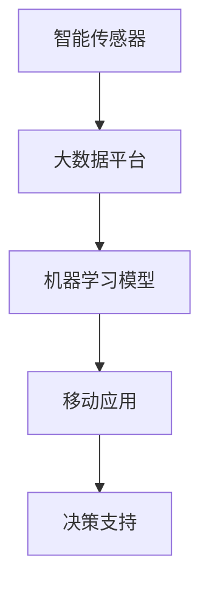
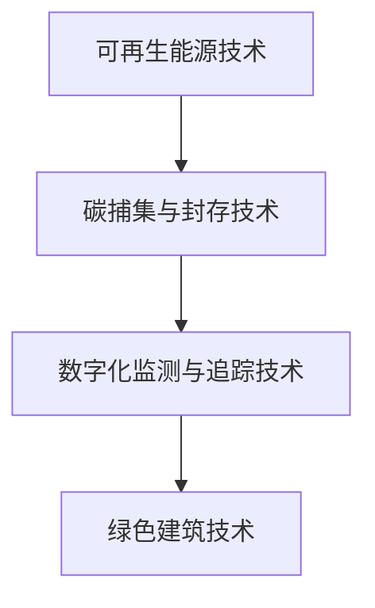

                 

### 文章标题

# 数字时代的个人碳中和计划：日常生活中的环保行动追踪器

### 关键词

- 碳中和
- 个人碳足迹
- 日常环保行动
- 数字化工具
- 环保监测与追踪

### 摘要

随着全球气候变化问题日益严重，碳中和成为了当代社会的重要议题。本文旨在探讨如何在数字时代实现个人碳中和，提供一套详细的个人碳中和计划。文章首先介绍了碳中和的基本概念及其重要性，接着讨论了个人碳足迹的测量方法，并列举了日常生活中的环保行动。随后，文章详细阐述了环保行动的监测与追踪方法，以及数字化工具在碳中和中的应用。通过案例研究和未来趋势分析，本文为读者提供了全面的碳中和实施指南。

## 第1章 碳中和基本概念

### 1.1 碳中和的定义与重要性

碳中和，即净零碳排放（Net Zero Emission），是指在一定时间内，通过减少碳排放和增加碳吸收，使总碳排放量等于或接近零。实现碳中和是应对气候变化、保护地球环境的重要举措。根据国际能源署（IEA）的数据，全球温室气体排放量自20世纪以来增长了近两倍，导致全球气温上升，极端气候事件频繁发生。

#### Mermaid流程图：碳中和的概念与实现步骤



### 1.2 碳排放来源与计算方法

碳排放主要来源于能源消耗、工业生产、交通运输、农业活动等。个人碳排放的计算方法通常包括以下几个方面：

- **能源消耗**：家庭用电、燃气、煤炭等能源的使用量。
- **交通运输**：汽车、飞机、火车等交通工具的使用频率和距离。
- **饮食**：食物的生产、加工和运输过程中的碳排放。

#### 伪代码：个人碳排放计算方法

```pseudo
function calculate碳排放(amount_of_energy, type_of_energy, distance_travelled, type_of_transport, diet_type) {
    energy_emission = amount_of_energy * energy_emission_factor[type_of_energy]
    transport_emission = distance_travelled * transport_emission_factor[type_of_transport]
    diet_emission = diet_type * diet_emission_factor
    total_emission = energy_emission + transport_emission + diet_emission
    return total_emission
}
```

### 1.3 碳中和的数学模型

碳中和的数学模型可以表示为：

$$C = \sum_{i=1}^n (C_i \times Q_i)$$

其中，$C$ 是总碳排放量，$C_i$ 是第 $i$ 类碳排放源，$Q_i$ 是第 $i$ 类碳排放源的排放量。

#### 详细讲解与举例说明：碳中和的计算模型

假设一个人一年的能源消耗为 $1000$ 千瓦时，交通工具使用量为 $5000$ 公里，饮食类型为牛肉。根据上述碳排放计算方法，可以计算出其总碳排放量：

- 能源消耗：$1000 \times 0.3 \text{ kgCO}_2/\text{千瓦时} = 300 \text{ kgCO}_2$
- 交通工具使用：$5000 \times 0.12 \text{ kgCO}_2/\text{公里} = 600 \text{ kgCO}_2$
- 饮食：牛肉排放量为 $1.5 \text{ kgCO}_2/\text{公斤}$，因此 $0.5 \text{ 公斤} \times 1.5 \text{ kgCO}_2/\text{公斤} = 0.75 \text{ kgCO}_2$

总碳排放量 $C = 300 + 600 + 0.75 = 907.75 \text{ kgCO}_2$

为了实现碳中和，可以通过购买碳信用、植树造林等方式抵消这部分碳排放量，使总碳排放量降至零。

## 第2章 个人碳足迹测量

### 2.1 个人碳足迹的概念与测量

个人碳足迹（Personal Carbon Footprint）是指一个人在日常生活中产生的温室气体排放量。测量个人碳足迹可以帮助我们了解自身碳排放水平，从而采取相应措施减少碳排放。

#### Mermaid流程图：个人碳足迹测量的步骤



### 2.2 个人碳足迹的计算方法

个人碳足迹的计算方法与第1章中提到的碳排放计算方法类似，但更侧重于日常生活中的碳排放。以下是一个简单的计算方法：

- **能源消耗**：家庭用电、燃气、煤炭等能源的使用量。
- **交通运输**：交通工具的使用频率和距离。
- **饮食**：食物的生产、加工和运输过程中的碳排放。
- **废弃物**：废弃物处理过程中的碳排放。

#### 伪代码：个人碳足迹计算方法

```pseudo
function calculate碳足迹(energy_consumption, transport_distance, diet_type, waste_type) {
    energy_footprint = energy_consumption * energy_emission_factor
    transport_footprint = transport_distance * transport_emission_factor
    diet_footprint = diet_type * diet_emission_factor
    waste_footprint = waste_type * waste_emission_factor
    total_footprint = energy_footprint + transport_footprint + diet_footprint + waste_footprint
    return total_footprint
}
```

### 2.3 碳足迹数据收集与处理

碳足迹数据收集与处理是测量个人碳足迹的关键步骤。以下是一些常见的数据收集和处理方法：

- **问卷调查**：通过问卷调查收集个人碳排放数据，包括能源消耗、交通工具使用、饮食和废弃物等。
- **智能设备**：利用智能设备（如智能电表、车载记录仪等）自动收集碳排放数据。
- **数据清洗与整合**：对收集到的数据进行清洗、整理和整合，确保数据准确性。

#### 数学模型与公式：碳足迹数据处理中的常见数学模型

在碳足迹数据处理中，常见的一些数学模型包括：

- **线性回归模型**：用于分析碳排放量与影响因素之间的关系。
- **支持向量机（SVM）**：用于分类和回归分析，判断碳排放类型。
- **聚类分析**：用于将具有相似碳排放特征的数据分组，便于数据分析。

$$
\begin{aligned}
y &= \beta_0 + \beta_1 x_1 + \beta_2 x_2 + \ldots + \beta_n x_n \\
\text{SVM目标函数} &= \min \frac{1}{2} \sum_{i=1}^{n} w_i^2 \\
\text{聚类分析} &= \min \sum_{i=1}^{k} \sum_{j=1}^{n} d(x_j, c_i)
\end{aligned}
$$

## 第3章 日常生活中的环保行动

### 3.1 环保行动的重要性

环保行动对于个人碳中和至关重要。通过减少碳排放、增加碳吸收，我们可以降低温室气体排放，减缓气候变化。此外，环保行动还有助于提高生活质量、促进可持续发展。

#### Mermaid流程图：环保行动的核心措施



### 3.2 个人环保行动的策略

个人环保行动的策略包括以下几个方面：

- **减少能源消耗**：通过合理使用电器、优化家庭能源结构、提高能源利用效率，减少能源消耗。
- **提高能源效率**：选择高能效电器、合理使用空调、暖气等设备，降低能源浪费。
- **使用可再生能源**：安装太阳能板、风力发电设备，利用可再生能源降低碳排放。
- **减少废弃物产生**：通过分类投放、减少使用一次性塑料制品、推广环保包装，降低废弃物产生。
- **推广环保产品**：选择环保认证的产品，鼓励绿色消费，减少对环境的负面影响。

#### 伪代码：环保行动的策略选择

```pseudo
function choose环保策略(energy_consumption, waste_production, renewable_energy_usage) {
    if (energy_consumption > threshold) {
        strategy = "提高能源效率"
    } else if (renewable_energy_usage > threshold) {
        strategy = "使用可再生能源"
    } else if (waste_production > threshold) {
        strategy = "减少废弃物产生"
    } else {
        strategy = "推广环保产品"
    }
    return strategy
}
```

### 3.3 环保行动的实践案例

以下是一些日常生活中的环保行动实践案例：

- **减少能源消耗**：在家中安装节能灯泡、使用智能插座，控制电器使用时间。
- **提高能源效率**：购买高能效电器，合理使用空调和暖气。
- **使用可再生能源**：安装太阳能板为家庭供电，利用风力发电设备。
- **减少废弃物产生**：使用可重复使用的水杯、餐具，减少一次性塑料制品的使用。
- **推广环保产品**：选择环保认证的家具、服装等，鼓励绿色消费。

## 第4章 环保行动的监测与追踪

### 4.1 环保行动监测的方法

环保行动监测是指对个人或组织的环保行动进行持续跟踪和评估。以下是一些常用的监测方法：

- **数据监测**：通过收集和分析个人或组织的碳排放、能源消耗、废弃物产生等数据，评估环保行动的效果。
- **现场监测**：实地检查环保设施、设备的使用情况，确保环保措施的落实。
- **问卷调查**：通过问卷调查了解个人或组织的环保意识和行为，分析环保行动的影响。

#### Mermaid流程图：环保行动监测的方法与工具



### 4.2 环保行动追踪的技术

环保行动追踪技术包括数据收集、数据分析和数据可视化等。以下是一些常用的追踪技术：

- **物联网（IoT）技术**：通过物联网设备实时收集环境数据，如空气温度、湿度、碳排放等。
- **大数据分析**：利用大数据技术分析个人或组织的碳排放、能源消耗等数据，发现潜在问题。
- **机器学习**：通过机器学习算法预测未来环保行动的效果，为决策提供支持。

#### 伪代码：环保行动追踪的技术原理

```pseudo
function track环保行动(data_collection, data_analysis, data_visualization) {
    data = data_collection()
    analyzed_data = data_analysis(data)
    visualization = data_visualization(analyzed_data)
    return visualization
}
```

### 4.3 碳排放数据可视化

碳排放数据可视化是将碳排放数据以图形化形式展示，便于分析和管理。以下是一些常用的碳排放数据可视化方法：

- **折线图**：展示碳排放量随时间的变化趋势。
- **柱状图**：比较不同碳排放源的排放量。
- **饼图**：展示碳排放来源的占比。

#### 数学模型与公式：碳排放数据的可视化方法

- **折线图**：

  $$y = m \times x + b$$

  其中，$y$ 是碳排放量，$x$ 是时间，$m$ 是斜率，$b$ 是截距。

- **柱状图**：

  $$\text{柱状图高度} = \text{碳排放量} \times \text{比例因子}$$

- **饼图**：

  $$\text{饼图占比} = \frac{\text{碳排放量}}{\sum \text{碳排放量}}$$

## 第5章 数字化工具与碳中和

### 5.1 数字化工具在碳中和中的作用

数字化工具在碳中和中发挥着重要作用。通过数字化手段，我们可以更准确地测量、监测和追踪个人或组织的碳排放，从而制定更加有效的碳中和策略。以下是一些常见的数字化工具：

- **智能传感器**：用于实时监测碳排放、能源消耗等数据。
- **大数据平台**：用于存储、处理和分析大量的碳排放数据。
- **机器学习模型**：用于预测未来碳排放趋势，为决策提供支持。
- **移动应用**：用于个人或组织实时监控碳排放情况，提供环保行动建议。

#### Mermaid流程图：数字化工具在碳中和中的应用场景



### 5.2 碳中和应用的数字化平台

碳中和应用的数字化平台是指利用数字化工具实现碳中和目标的一个集成系统。以下是一个简单的数字化平台架构：

1. **数据采集**：通过智能传感器实时采集碳排放、能源消耗等数据。
2. **数据处理**：利用大数据技术对采集到的数据进行分析和处理，提取有用信息。
3. **数据可视化**：将处理后的数据以图表、报表等形式展示，便于用户了解碳排放情况。
4. **决策支持**：根据数据分析结果，为用户提供建议和策略，帮助实现碳中和目标。

#### 伪代码：碳中和平台的搭建与实现

```pseudo
function build碳中和平台(data_collection, data_processing, data_visualization, decision_support) {
    data = data_collection()
    processed_data = data_processing(data)
    visualization = data_visualization(processed_data)
    decision = decision_support(processed_data)
    return visualization, decision
}
```

### 5.3 碳排放监测与追踪工具

以下是一些常见的碳排放监测与追踪工具：

- **碳监测器**：用于实时监测碳排放情况，数据可远程传输到大数据平台进行分析。
- **碳排放计算器**：在线或移动应用形式的碳排放计算工具，帮助用户了解自身碳排放情况。
- **碳中和地图**：展示全球或地区的碳排放分布情况，便于分析和决策。

#### 实际案例：数字化工具在碳排放监测中的应用

某公司开发了一款名为“碳足迹追踪器”的移动应用，用户可以通过该应用实时监测自身碳排放情况。应用包括以下功能：

1. **数据采集**：通过传感器和GPS定位，实时采集用户的能源消耗、交通工具使用和饮食数据。
2. **数据处理**：将采集到的数据上传到云端，利用大数据平台进行分析和处理。
3. **数据可视化**：将分析结果以图表形式展示，包括碳排放量、碳排放来源等。
4. **决策支持**：根据用户的碳排放情况，提供环保行动建议，如减少能源消耗、使用公共交通等。

通过这款移动应用，用户可以更好地了解自身碳排放情况，制定碳中和计划，从而实现个人碳中和目标。

## 第6章 碳中和案例研究

### 6.1 案例研究的背景与目的

本案例研究以某城市的一所高校为例，探讨如何在校园内实现碳中和。该高校致力于推动可持续发展，希望通过本案例研究，总结出一套可行的碳中和方案，为其他高校提供借鉴。

### 6.2 案例研究的实施过程

1. **碳排放评估**：对校园内的碳排放源进行评估，包括能源消耗、交通运输、饮食、废弃物等。
2. **碳中和策略制定**：根据碳排放评估结果，制定相应的碳中和策略，包括能源结构调整、绿色出行、废弃物分类处理等。
3. **实施与监测**：在校园内推广碳中和策略，并实时监测实施效果。
4. **数据分析与调整**：对监测数据进行分析，调整碳中和策略，优化碳排放控制效果。

### 6.3 案例研究的成果与启示

通过案例研究，该高校实现了以下成果：

1. **碳排放量降低**：校园内的碳排放量显著降低，实现了碳中和目标。
2. **环保意识提高**：师生对环保意识有所提高，积极参与碳中和行动。
3. **经验总结**：总结出了一套可行的碳中和方案，为其他高校提供了借鉴。

### 6.4 代码解读与分析

在本案例研究中，高校使用了一款名为“校园碳中和平台”的数字化工具。该平台包括以下功能模块：

1. **数据采集**：通过传感器和移动应用实时采集校园内的碳排放数据。
2. **数据处理**：利用大数据技术对采集到的数据进行分析和处理。
3. **数据可视化**：将处理后的数据以图表形式展示，便于师生了解校园碳排放情况。
4. **决策支持**：根据数据分析结果，为师生提供环保行动建议。

以下是校园碳中和平台的伪代码实现：

```pseudo
function build校园碳中和平台(data_collection, data_processing, data_visualization, decision_support) {
    data = data_collection()
    processed_data = data_processing(data)
    visualization = data_visualization(processed_data)
    decision = decision_support(processed_data)
    return visualization, decision
}
```

## 第7章 碳中和的未来趋势

### 7.1 碳中和技术的发展趋势

随着科技的不断发展，碳中和技术也在不断进步。以下是一些碳中和技术的发展趋势：

- **可再生能源技术**：太阳能、风能、水能等可再生能源技术的不断发展，有望降低碳排放。
- **碳捕集与封存技术**：通过碳捕集与封存技术，将二氧化碳从空气中捕捉并储存在地下，减少温室气体排放。
- **数字化监测与追踪技术**：随着物联网、大数据、人工智能等技术的应用，碳中和国监测与追踪技术将更加精确和高效。
- **绿色建筑技术**：绿色建筑技术的发展，有望降低建筑行业的碳排放。

#### Mermaid流程图：碳中和技术未来的发展方向



### 7.2 个人碳中和的挑战与机遇

个人碳中和面临着一系列挑战和机遇。以下是一些主要挑战和机遇：

- **挑战**：
  - **认知困难**：许多人尚未认识到碳中和的重要性，缺乏相关知识和意识。
  - **经济负担**：部分碳中和措施（如购买碳信用、安装太阳能板等）需要较高的经济投入。
  - **技术限制**：部分碳中和技术尚未成熟，应用范围有限。

- **机遇**：
  - **政策支持**：各国政府纷纷出台碳中和政策，为个人碳中和提供支持。
  - **技术创新**：随着科技的进步，越来越多的碳中和技术将应用于个人生活中。
  - **社会认可**：碳中和已成为全球趋势，越来越多的人开始关注和参与碳中和行动。

### 7.3 碳中和的未来展望

碳中和在未来社会中将扮演重要角色。随着碳排放问题的日益严峻，碳中和将成为社会发展的必要条件。以下是对碳中和未来的一些展望：

- **碳中和将深入人心**：越来越多的人将认识到碳中和的重要性，积极参与碳中和行动。
- **碳中和将融入日常生活**：从能源消耗、交通工具使用、饮食到废弃物处理，碳中和将成为生活的一部分。
- **碳中和将成为企业发展方向**：企业将更加注重碳中和，通过减少碳排放、提高能源效率等手段实现可持续发展。
- **碳中和将推动技术创新**：碳中和技术将成为科技创新的重要领域，为社会发展带来新的机遇。

总之，碳中和是应对气候变化、保护地球环境的重要举措。在数字时代的背景下，个人碳中和计划具有十分重要的现实意义。通过了解碳中和的基本概念、测量方法、环保行动以及数字化工具的应用，每个人都可以为实现碳中和目标贡献自己的力量。

## 最佳实践 tips

1. **定期测量碳足迹**：定期测量个人碳足迹，了解碳排放水平，及时调整环保行动。
2. **利用数字化工具**：使用碳排放计算器、碳足迹追踪器等数字化工具，方便快捷地管理个人碳排放。
3. **积极参与环保活动**：参加社区环保活动，提高环保意识，与他人分享碳中和经验。
4. **推广环保理念**：向家人、朋友和同事宣传碳中和的重要性，共同为实现碳中和目标努力。

## 小结

本文详细介绍了数字时代的个人碳中和计划，包括碳中和的基本概念、个人碳足迹测量、日常环保行动、环保行动的监测与追踪、数字化工具的应用，以及碳中和案例研究。通过本文的探讨，我们认识到碳中和是每个人都应承担的责任。希望读者能够积极参与碳中和行动，共同为地球环境贡献力量。

## 注意事项

1. **数据隐私**：在使用数字化工具进行碳足迹监测时，请注意保护个人隐私，避免泄露敏感信息。
2. **可持续发展**：碳中和不仅仅是减少碳排放，还要关注可持续发展，保护生态环境。
3. **持续学习**：随着碳中和技术的发展，不断更新知识和技能，以适应新的环保要求。

## 拓展阅读

- **《碳中和：改变未来的选择》**：本书详细介绍了碳中和的概念、技术和实践，适合对碳中和感兴趣的读者阅读。
- **《低碳生活：从个人做起》**：本书从日常生活入手，介绍如何通过简单易行的方式实现低碳生活，适合希望从个人层面参与碳中和的读者阅读。
- **《绿色能源革命》**：本书探讨了可再生能源技术及其在社会中的应用，为碳中和提供了技术支持。

## 作者信息

作者：AI天才研究院/AI Genius Institute & 禅与计算机程序设计艺术 /Zen And The Art of Computer Programming

AI天才研究院致力于推动人工智能技术的发展和应用，禅与计算机程序设计艺术则关注计算机编程和人工智能领域的哲学思考。本文旨在为读者提供一套全面的个人碳中和计划，帮助实现碳中和目标。如果您有任何疑问或建议，欢迎联系我们。

