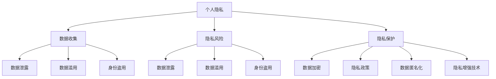

                 

### 文章标题

# 数字时代的个人隐私：在便利与安全间的权衡

> 关键词：数字时代、个人隐私、数据收集、隐私风险、隐私保护、社会责任、法规政策、趋势与挑战

> 摘要：本文探讨了数字时代个人隐私的重要性以及个人隐私在便利与安全之间的权衡。通过分析个人隐私的数据来源、隐私风险、隐私保护技术、社会责任、法规政策以及未来趋势与挑战，本文旨在为读者提供一个全面而深入的理解，帮助我们在享受数字化便利的同时，更好地保护个人隐私。

### 背景介绍

在当今的数字时代，我们的生活几乎离不开互联网和电子设备。无论是购物、社交、娱乐，还是工作、学习，我们都在不断地生成和传输大量的数据。这些数据不仅包括我们的个人信息，如姓名、地址、电话号码等，还包括我们的行为数据，如搜索记录、浏览习惯、购买偏好等。这些数据为我们提供了前所未有的便利，使得我们的生活变得更加高效和便捷。

然而，随着数据收集和处理的不断深入，个人隐私问题也日益凸显。隐私泄露、数据滥用、身份盗用等问题频发，严重威胁到我们的个人安全和生活质量。在这个背景下，如何在享受数字化便利的同时，保护个人隐私，成为了一个亟待解决的问题。

本文将围绕这一主题，首先介绍数字时代个人隐私的背景，然后分析个人隐私的数据来源，探讨隐私风险，介绍隐私保护技术，讨论个人隐私与社会责任的关系，分析隐私法规与政策，最后展望未来个人隐私的发展趋势与挑战。

### 核心概念与联系

在深入探讨数字时代个人隐私之前，我们需要明确几个核心概念，包括个人隐私、数据收集、隐私风险和隐私保护等。

#### 个人隐私

个人隐私是指个人在私人生活和社交关系中所拥有的信息不受外部干预和干扰的权利。它包括但不限于个人信息、私人事务、个人空间和通信内容。个人隐私的保护是现代社会的基本人权之一，也是维护社会秩序和个人尊严的重要保障。

#### 数据收集

数据收集是指通过各种方式获取和存储个人信息的行为。在数字时代，数据收集主要通过以下几种方式实现：

1. **用户主动提供**：用户在注册、购买、搜索等行为中主动提供的个人信息。
2. **传感器收集**：通过智能手机、智能设备等传感器收集用户的行为数据，如位置信息、健康数据等。
3. **第三方共享**：用户在第三方平台上的行为数据，如社交网络、搜索引擎等。
4. **数据分析**：通过对用户数据的分析，获取更深入的个人信息和行为模式。

#### 隐私风险

隐私风险是指个人隐私数据可能受到泄露、滥用或不当处理的风险。隐私风险可以分为以下几种类型：

1. **数据泄露**：未经授权的第三方获取和访问个人数据。
2. **数据滥用**：个人数据被用于未经用户同意的用途。
3. **身份盗用**：个人数据被用于伪造身份或进行欺诈行为。

#### 隐私保护

隐私保护是指通过技术手段、法规政策和社会责任等多方面措施，保护个人隐私不受侵害。隐私保护可以分为以下几种手段：

1. **数据加密**：使用加密技术保护个人数据的安全。
2. **隐私政策**：制定明确的隐私政策，告知用户其数据的使用方式和范围。
3. **数据匿名化**：将个人数据去标识化，以降低隐私泄露的风险。
4. **隐私增强技术**：如差分隐私、联邦学习等，提高数据处理的隐私保护水平。

#### 个人隐私与社会责任

个人隐私保护不仅是一个技术问题，更是一个社会责任问题。企业在收集和使用用户数据时，需要承担起保护用户隐私的社会责任。同时，政府也需要制定相应的法规政策，加强对个人隐私的保护。

#### 隐私法规与政策

隐私法规与政策是保护个人隐私的重要法律依据。不同国家和地区有不同的隐私法规，如美国的《加州消费者隐私法案》（CCPA）、欧盟的《通用数据保护条例》（GDPR）等。

#### 未来个人隐私的趋势与挑战

随着数字化进程的加速，未来个人隐私将面临更多的挑战和机遇。隐私保护技术将不断进步，隐私法规也将不断完善。同时，我们需要面对新的隐私威胁，如人工智能、物联网等技术的应用，以及数据跨境传输等问题。

为了更好地理解这些核心概念之间的关系，我们可以使用Mermaid流程图来展示：



通过这个流程图，我们可以清晰地看到个人隐私、数据收集、隐私风险和隐私保护之间的关系，以及各个子概念之间的相互作用。

接下来，我们将逐一探讨这些核心概念，深入分析数字时代个人隐私的各个方面。

### 个人隐私的数据来源

在数字时代，个人隐私的数据来源多种多样，这些数据来源不仅包括用户主动提供的个人信息，还涉及第三方平台、传感器收集的数据以及数据分析。下面，我们将详细分析这些数据来源的具体方式和特点。

#### 用户主动提供的数据

用户主动提供的数据是个人隐私数据的主要来源之一。这些数据通常通过以下几种方式收集：

1. **在线注册**：用户在注册网站、应用或服务时，需要填写个人信息，如姓名、地址、电话号码、电子邮箱等。这些信息通常是个人隐私的核心数据。
2. **问卷调查**：许多网站和应用会通过问卷调查的方式收集用户的偏好、行为习惯等数据。这些数据有助于平台更好地了解用户，从而提供个性化的服务。
3. **购买记录**：用户的购买记录也是重要的个人数据，包括购买时间、购买商品、支付方式等。这些数据可以用于分析用户的消费习惯和偏好。
4. **互动数据**：用户在网站或应用上的互动行为，如评论、点赞、分享等，也会生成大量的个人数据。这些数据反映了用户的兴趣和社交网络。

#### 第三方平台的数据

第三方平台的数据是指用户在第三方网站或应用上生成的数据。这些数据通常通过以下方式收集：

1. **社交网络**：用户在社交媒体平台上的行为数据，如发布的内容、评论、点赞等，都被第三方平台收集并存储。这些数据不仅包含个人隐私信息，还反映了用户的社交关系和行为模式。
2. **搜索引擎**：用户的搜索历史、搜索关键词等数据也被搜索引擎平台收集。这些数据可以用于优化搜索结果，提高用户体验。
3. **在线服务**：用户在使用第三方在线服务（如云存储、电子邮件等）时产生的数据，也被第三方平台收集。这些数据可能包括用户的通信记录、文件内容等。

#### 传感器收集的数据

传感器收集的数据是指通过智能设备（如智能手机、智能手表、智能家居设备等）的传感器收集的数据。这些数据通常包括：

1. **位置信息**：智能设备的GPS传感器可以收集用户的位置信息，包括精确的地理位置、移动轨迹等。这些数据可以用于导航、定位服务。
2. **健康数据**：通过智能手表、健身追踪器等设备，用户可以收集自己的健康数据，如心率、运动步数、睡眠质量等。这些数据对于健康监测和健康管理具有重要意义。
3. **环境数据**：一些智能设备还可以收集环境数据，如温度、湿度、光照等。这些数据可以用于智能家居、环境监测等应用。

#### 数据分析

数据分析是将收集到的个人数据进行处理、分析，以提取有价值信息的过程。数据分析的方式包括：

1. **统计分析**：通过统计分析方法，对大量数据进行处理，提取用户的普遍特征和趋势。例如，分析用户的购买习惯、偏好等。
2. **机器学习**：使用机器学习方法，对数据进行分析和预测。例如，通过分析用户的搜索记录，预测用户的潜在需求。
3. **数据挖掘**：通过数据挖掘技术，从大量数据中提取出隐藏的模式和信息。例如，挖掘用户的社交网络关系、行为模式等。

通过上述分析，我们可以看到，个人隐私的数据来源非常多样化，涵盖了用户主动提供的数据、第三方平台的数据、传感器收集的数据以及数据分析。这些数据不仅为我们提供了便利，也带来了隐私风险。因此，在享受数字化便利的同时，我们必须要意识到个人隐私的重要性，并采取相应的措施保护个人隐私。

### 个人隐私风险

在数字时代，个人隐私风险已经成为一个不可忽视的问题。这些风险不仅威胁到个人的信息安全，还可能对个人生活和社会秩序产生深远的影响。下面，我们将详细分析个人隐私风险的类型、来源和影响。

#### 数据泄露

数据泄露是个人隐私风险中最常见的一种类型。数据泄露通常是指未经授权的第三方获取和访问个人数据的行为。数据泄露可以通过以下几种方式发生：

1. **网络攻击**：黑客通过入侵网站、应用或数据库，获取用户的数据。例如，2017年的“Facebook数据泄露”事件，黑客通过攻击网站，获取了约8700万用户的个人信息。
2. **内部泄露**：企业内部员工故意或因疏忽将用户数据泄露出去。例如，2018年某知名酒店的数据泄露事件，由于员工违规操作，导致大量客户的数据被泄露。
3. **物理泄露**：物理设备（如U盘、硬盘等）被非法获取，从而导致数据泄露。例如，某公司的U盘丢失，导致公司机密数据被泄露。

#### 数据滥用

数据滥用是指个人数据被用于未经用户同意的用途，或者用于违反用户隐私预期的行为。数据滥用的类型包括：

1. **营销骚扰**：用户的数据被用于发送大量未经用户同意的营销邮件或短信。例如，用户购买某商品后，频繁收到类似商品的广告。
2. **信息收集**：用户的数据被第三方平台收集，用于分析用户行为和偏好。这些数据可能被用于广告投放、市场研究等，但未经用户同意。例如，某些网站通过追踪用户浏览行为，向用户推送相关广告。
3. **身份盗用**：用户的个人信息被用于伪造身份或进行欺诈行为。例如，黑客通过获取用户的身份信息，伪造身份进行贷款、购物等。

#### 身份盗用

身份盗用是指黑客或不法分子利用用户的个人信息，冒充用户进行非法活动。身份盗用的常见形式包括：

1. **金融欺诈**：黑客通过获取用户的银行账户信息、信用卡信息等，进行非法金融交易。例如，黑客通过获取用户的信用卡信息，盗刷用户账户。
2. **社交工程**：黑客通过获取用户的个人信息，冒充用户与他人的通信，骗取信任，获取更多个人信息。例如，黑客冒充某公司的员工，骗取合作伙伴的机密信息。
3. **冒名注册**：黑客通过获取用户的身份信息，在第三方平台进行注册，用于非法活动。例如，黑客通过获取用户的身份信息，在社交媒体上注册账号，发布违法信息。

#### 其他隐私风险

除了上述风险，个人隐私还可能面临以下风险：

1. **隐私追踪**：用户的行为数据被追踪和分析，可能导致用户的隐私被泄露。例如，某些应用通过追踪用户的地理位置、浏览记录等，分析用户的行为模式。
2. **隐私泄露的法律风险**：企业在处理用户数据时，若未能严格遵守隐私法规，可能会面临法律责任。例如，某些企业因违反《通用数据保护条例》（GDPR），被罚款巨额罚款。
3. **隐私泄露的心理影响**：个人隐私泄露可能导致用户感到不安、恐惧，影响其心理健康。例如，某些用户在隐私泄露后，出现失眠、焦虑等心理问题。

#### 风险来源

个人隐私风险的来源非常广泛，主要包括：

1. **黑客攻击**：黑客通过网络攻击手段，获取用户的隐私数据。
2. **内部泄露**：企业内部员工故意或因疏忽泄露用户数据。
3. **数据泄露**：企业存储的数据泄露，如数据库、云存储等。
4. **第三方滥用**：第三方平台或服务提供商滥用用户数据，进行非法活动。
5. **技术漏洞**：软件或系统存在漏洞，导致用户数据泄露。

#### 风险影响

个人隐私泄露对个人和社会的影响是多方面的：

1. **经济损失**：个人隐私泄露可能导致用户遭受经济损失，如金融欺诈、信用损失等。
2. **心理影响**：隐私泄露可能导致用户感到不安、恐惧，影响心理健康。
3. **社会秩序**：隐私泄露可能对社会秩序造成威胁，如身份盗用、网络犯罪等。
4. **企业声誉**：企业因隐私泄露事件，可能导致声誉受损，影响业务发展。

总之，个人隐私风险在数字时代已经成为一个严峻的问题。为了保护个人隐私，我们需要采取有效的措施，提高数据安全意识，加强隐私保护技术，完善隐私法规和政策，共同维护数字时代的个人隐私安全。

### 个人隐私保护技术

在数字时代，个人隐私的保护变得越来越重要。为了应对各种隐私风险，我们需要利用多种隐私保护技术来确保个人数据的安全。以下是一些主要的隐私保护技术，包括数据加密、隐私政策、数据匿名化和隐私增强技术。

#### 数据加密

数据加密是保护个人隐私的基础技术之一。通过数据加密，我们可以将原始数据转换为无法直接阅读的密文，从而防止未经授权的第三方访问和读取数据。数据加密可以分为两种类型：对称加密和非对称加密。

1. **对称加密**：对称加密使用相同的密钥对数据进行加密和解密。常用的对称加密算法包括AES（高级加密标准）和DES（数据加密标准）。对称加密的优点是加密和解密速度快，但缺点是密钥的分发和管理复杂。
   
   ```python
   # Python示例：使用AES加密和解密
   from Crypto.Cipher import AES
   from Crypto.Util.Padding import pad, unpad
   
   key = b'Sixteen byte key'
   cipher = AES.new(key, AES.MODE_CBC)
   ct_bytes = cipher.encrypt(pad('The quick brown fox jumps over the lazy dog'.encode('utf-8'), AES.block_size))
   iv = cipher.iv
   print(ct_bytes)
   print(iv)
   
   pt = AES.new(key, AES.MODE_CBC, iv).decrypt(ct_bytes)
   pt = unpad(pt, AES.block_size)
   print(pt.decode('utf-8'))
   ```

2. **非对称加密**：非对称加密使用一对密钥，即公钥和私钥。公钥用于加密，私钥用于解密。常用的非对称加密算法包括RSA和ECC。非对称加密的优点是密钥分发和管理简单，但缺点是加密和解密速度较慢。

   ```python
   # Python示例：使用RSA加密和解密
   from Crypto.PublicKey import RSA
   from Crypto.Cipher import PKCS1_OAEP
   
   key = RSA.generate(2048)
   private_key = key.export_key()
   public_key = key.publickey().export_key()
   
   cipher = PKCS1_OAEP.new(RSA.import_key(public_key))
   ct = cipher.encrypt(b'The quick brown fox jumps over the lazy dog')
   
   decipher = PKCS1_OAEP.new(RSA.import_key(private_key))
   pt = decipher.decrypt(ct)
   
   print(pt.decode('utf-8'))
   ```

#### 隐私政策

隐私政策是企业或组织公开其数据收集、处理和使用规则的文档。通过隐私政策，用户可以了解其数据将被如何使用，从而做出知情的选择。隐私政策的制定需要遵循透明性、明确性和可控制性的原则。

1. **透明性**：隐私政策应清晰地说明企业收集哪些数据，这些数据将如何使用。
2. **明确性**：隐私政策应使用简单易懂的语言，避免使用专业术语。
3. **可控制性**：用户应有权决定其数据的收集和使用，包括删除、修改和访问其数据。

   ```markdown
   # 隐私政策

   我们尊重您的隐私，并致力于保护您的个人信息。以下是我们收集、使用和存储您个人信息的规定：

   - 收集：我们仅收集您提供的必要信息，包括姓名、联系方式等。
   - 使用：我们仅使用您的信息提供您所请求的服务，并确保您的信息不会被用于其他目的。
   - 存储：我们将在您的信息在提供服务后，立即删除或匿名化。
   - 安全：我们采取严格的安全措施，确保您的信息不被未经授权的第三方访问。
   - 用户权利：您有权随时访问、修改和删除您的个人信息。

   如您有任何疑问或建议，请随时联系我们。
   ```

#### 数据匿名化

数据匿名化是一种将个人数据去标识化，以降低隐私泄露风险的技术。通过数据匿名化，我们可以将个人数据中的敏感信息去除，从而确保数据的安全性和可用性。数据匿名化可以分为以下几种方法：

1. **伪匿名化**：通过添加随机噪声或替换敏感值，使数据难以识别但保持数据的有效性。
2. **差异隐私**：通过向数据集中添加噪声，使单个数据点的识别风险降低到可接受的水平。
3. **k-匿名性**：通过确保数据集中的每一个记录至少有k-1个相同的记录，以降低隐私泄露的风险。
4. **l-diversity**：确保数据集中的每个属性值至少有l个不同的记录，以增强隐私保护。

   ```python
   # Python示例：使用k-匿名化
   import pandas as pd
   
   data = pd.DataFrame({'A': ['Alice', 'Bob', 'Charlie', 'Alice', 'Bob'], 'B': [1, 2, 3, 4, 5]})
   k = 3
   
   def k_anonymity(data, k):
       unique_combinations = data.groupby(data.columns.tolist()).n().reset_index()
       unique_combinations['is_k_anonymous'] = unique_combinations['n'] >= k
       return unique_combinations[unique_combinations['is_k_anonymous']]['group']
   
   k_anonymous_groups = k_anonymity(data, k)
   print(k_anonymous_groups)
   ```

#### 隐私增强技术

隐私增强技术（Privacy Enhancing Technologies，PETs）是一种旨在提高数据隐私保护水平的技术。这些技术通常用于数据处理和分析过程中，以确保个人数据的安全性和隐私性。

1. **联邦学习**：联邦学习是一种分布式机器学习技术，通过在数据持有者本地训练模型，避免将原始数据传输到中心服务器。联邦学习可以保护用户的隐私，同时实现高效的数据分析和模型训练。

   ```python
   # Python示例：使用联邦学习进行图像分类
   import tensorflow as tf
   from tensorflow import keras
   
   # 定义本地模型
   local_model = keras.Sequential([
       keras.layers.Flatten(input_shape=(28, 28)),
       keras.layers.Dense(128, activation='relu'),
       keras.layers.Dense(10, activation='softmax')
   ])
   
   # 训练本地模型
   local_model.compile(optimizer='adam',
                       loss='sparse_categorical_crossentropy',
                       metrics=['accuracy'])
   local_model.fit(x_train, y_train, epochs=5)
   
   # 导出本地模型的权重
   local_weights = local_model.get_weights()
   
   # 在中心服务器上聚合本地模型权重
   global_weights = aggregate_local_weights(local_weights)
   
   # 使用聚合后的权重训练中心模型
   global_model = keras.Sequential([
       keras.layers.Dense(128, activation='relu', input_shape=(28, 28)),
       keras.layers.Dense(10, activation='softmax')
   ])
   global_model.compile(optimizer='adam',
                       loss='sparse_categorical_crossentropy',
                       metrics=['accuracy'])
   global_model.fit(x_test, y_test, epochs=5, initial_weights=global_weights)
   ```

2. **差分隐私**：差分隐私是一种在数据分析过程中引入噪声，以保护个人隐私的技术。差分隐私的核心思想是通过在数据分析中引入随机噪声，使得单个数据点的识别风险降低到可接受的水平。

   ```python
   # Python示例：使用差分隐私计算平均数
   from differential隐私 import laplace Mechanism
   
   data = [1, 2, 3, 4, 5]
   sensitivity = 1  # 数据的最大变化量
   epsilon = 1  # 隐私预算
   
   mechanism = laplace.Mechanism(sensitivity, epsilon)
   noisy_sum = mechanism.sample(data)
   print(noisy_sum)
   
   average = noisy_sum / len(data)
   print(average)
   ```

通过上述隐私保护技术，我们可以在享受数字化便利的同时，最大限度地保护个人隐私。然而，隐私保护是一个复杂且不断发展的领域，我们需要不断探索和创新，以应对新的隐私威胁和挑战。

### 个人隐私与社会责任

在数字时代，个人隐私保护不仅是一个技术问题，更是一个社会责任问题。企业和组织在收集和使用用户数据时，需要承担起保护用户隐私的社会责任。这种社会责任体现在多个方面，包括透明度、用户控制权和数据伦理等。

#### 透明度

透明度是企业承担隐私社会责任的重要方面之一。企业需要明确告知用户其数据的使用方式和范围，使用户了解其数据如何被收集、存储、使用和共享。透明度的实现可以通过以下几种方式：

1. **隐私政策**：企业应制定清晰的隐私政策，详细说明数据收集的目的、数据类型、数据使用方式、数据共享原则以及用户的数据权利等。隐私政策应使用简单易懂的语言，避免使用专业术语。

2. **通知与说明**：在用户注册、使用服务或进行特定操作时，企业应通过弹窗、邮件或其他方式向用户通知数据收集和使用情况，确保用户知情并同意。

3. **透明度报告**：企业应定期发布透明度报告，包括数据泄露事件、用户投诉和处理情况、隐私保护措施等，以增强用户对企业的信任。

#### 用户控制权

用户控制权是指用户对其个人数据的控制能力，包括访问、修改、删除和使用其数据的选择权。企业应尊重用户的数据控制权，并提供便捷的机制让用户管理其数据。用户控制权可以通过以下方式实现：

1. **访问与查询**：企业应提供便捷的查询接口，让用户随时查询其个人数据的使用情况。用户应有权了解其数据被用于哪些服务和场景。

2. **数据修改与删除**：用户应有权修改或删除其个人数据。企业应提供简单易懂的修改和删除流程，确保用户可以方便地行使这一权利。

3. **数据备份与转移**：企业应允许用户备份其数据，并在需要时将其数据转移到其他服务或平台。这有助于用户在切换服务时，保护其数据不受损失。

#### 数据伦理

数据伦理是指企业在处理用户数据时，遵循的道德原则和价值观。数据伦理的核心是尊重用户隐私和权利，避免数据滥用和不当处理。数据伦理可以通过以下方式实现：

1. **隐私保护原则**：企业应遵循隐私保护原则，包括数据最小化、数据目的明确化、数据存储最小化等。企业只应收集和使用必要的用户数据，避免过度收集。

2. **数据安全措施**：企业应采取严格的数据安全措施，包括数据加密、访问控制、数据备份等，确保用户数据的安全。

3. **用户教育**：企业应通过教育用户，提高其隐私保护意识。用户教育可以通过在线教程、宣传材料、社区活动等方式进行，帮助用户了解隐私风险和保护方法。

#### 实际案例

在数字时代，许多企业已经认识到个人隐私保护的重要性，并采取了一系列措施来履行其社会责任。以下是一些实际案例：

1. **谷歌**：谷歌在其隐私政策中详细说明了用户数据的收集和使用情况，并提供用户数据管理工具，让用户方便地查询、修改和删除其数据。

2. **苹果**：苹果在其iOS系统中引入了“隐私透明度”功能，让用户了解应用访问其摄像头、麦克风、位置等信息的情况。用户可以随时关闭应用对这些信息的访问。

3. **Facebook**：Facebook在2018年发布了《数据滥用报告》，详细说明了其数据收集、处理和使用情况。此外，Facebook还推出了一系列隐私保护功能，如数据删除、隐私设置等，以增强用户对隐私的控制。

通过透明度、用户控制权和数据伦理等方面的努力，企业可以更好地履行其社会责任，保护用户隐私。同时，企业也需要不断适应新的隐私挑战，持续改进隐私保护措施，以应对不断变化的数字时代。

### 个人隐私法规与政策

在全球范围内，个人隐私保护已经成为各国政府和国际组织关注的重要议题。为了保障个人隐私，各国纷纷制定了相应的隐私法规与政策。这些法规和政策不仅对企业的数据处理行为进行了规范，也为个人隐私保护提供了法律依据。本文将简要介绍一些主要的个人隐私法规与政策，并分析其对隐私保护的影响。

#### 美国的《加州消费者隐私法案》（CCPA）

《加州消费者隐私法案》（California Consumer Privacy Act，简称CCPA）于2018年生效，是美国首部全面性的消费者隐私法案。CCPA的主要内容包括：

1. **数据透明度**：企业需向消费者明确其收集、使用和共享的数据类型，以及数据收集的目的。
2. **用户权利**：消费者有权要求企业删除其个人信息，查询其数据使用情况，并拒绝数据销售。
3. **企业责任**：企业需制定隐私政策，明确数据保护措施，并接受监管机构的审查。

CCPA对隐私保护的影响主要体现在以下几个方面：

1. **提高数据透明度**：CCPA要求企业公开其数据收集和使用情况，增强了消费者的知情权。
2. **强化用户控制权**：消费者有权要求删除其个人信息，增强了数据隐私保护。
3. **规范数据销售**：CCPA禁止企业未经消费者同意，将其个人信息出售给第三方。

#### 欧盟的《通用数据保护条例》（GDPR）

《通用数据保护条例》（General Data Protection Regulation，简称GDPR）于2018年5月25日正式生效，是欧盟历史上最严格的隐私保护法规。GDPR的主要内容包括：

1. **数据主体权利**：数据主体（即个人）享有访问、修改、删除其个人信息，以及限制其数据处理的权利。
2. **数据保护原则**：企业需遵循数据最小化、目的明确化、数据存储最小化等数据保护原则。
3. **数据泄露通知**：企业必须在数据泄露事件发生后的72小时内通知监管机构，并通知受影响的个人。

GDPR对隐私保护的影响主要体现在以下几个方面：

1. **强化数据主体权利**：GDPR赋予数据主体更多权利，提高了个人隐私保护水平。
2. **加强企业责任**：企业需制定详细的隐私保护措施，并接受监管机构的审查。
3. **推动全球隐私保护**：GDPR的影响已经超越了欧盟范围，许多国家和地区在制定隐私保护法规时，参考了GDPR的规定。

#### 中国的《个人信息保护法》（PIPL）

《个人信息保护法》（Personal Information Protection Law，简称PIPL）于2021年11月1日正式施行，是中国首部个人信息保护综合性法律。PIPL的主要内容包括：

1. **个人信息定义**：PIPL明确了个人信息的定义，包括姓名、身份证号码、生物识别信息等。
2. **数据处理原则**：企业需遵循合法、正当、必要原则处理个人信息。
3. **用户同意与告知**：企业收集、使用个人信息时，需获得用户的明确同意，并告知个人信息的使用目的、范围、方式等。

PIPL对隐私保护的影响主要体现在以下几个方面：

1. **明确个人信息定义**：PIPL明确了个人信息的范围，为企业提供了明确的法律依据。
2. **规范数据处理行为**：PIPL对企业的数据处理行为进行了严格规范，提高了个人信息保护水平。
3. **加强监管力度**：PIPL设立了专门的监管机构，对个人信息处理行为进行监管，确保法律实施。

#### 其他国家和地区的隐私保护法规

除了上述国家和地区，全球还有许多其他国家和地区制定了隐私保护法规。例如：

1. **澳大利亚的《隐私法》（Privacy Act）**：规定了政府机构和私人企业在处理个人信息时的义务和责任。
2. **巴西的《通用数据保护法》（LGPD）**：与GDPR类似，规定了个人数据处理的原则、用户权利和企业责任。
3. **印度的《信息技术法》（IT Act）**：包含了关于个人信息保护的相关规定，设立了监管机构负责监督个人信息处理行为。

这些隐私保护法规和政策对隐私保护产生了深远影响。首先，它们提高了企业的隐私保护意识，促使企业采取措施保护用户隐私。其次，这些法规增强了用户的隐私权利，使用户在数字化生活中更加安心。最后，全球隐私保护法规的趋同化，推动了国际隐私保护标准的统一，为全球个人信息保护提供了法律依据。

总之，个人隐私法规与政策的制定和实施，是保护个人隐私、维护社会秩序的重要手段。随着数字时代的不断进步，各国将继续完善隐私保护法规，以应对新的隐私挑战，确保个人隐私的安全。

### 未来个人隐私的趋势与挑战

随着数字技术的不断发展，未来个人隐私将面临一系列新的趋势与挑战。这些趋势和挑战不仅对个人隐私保护提出了更高的要求，也为隐私保护技术的发展提供了新的方向。

#### 新技术带来的隐私挑战

1. **人工智能与大数据**：人工智能（AI）和大数据技术的快速发展，使得数据分析和处理能力大幅提升。然而，这也意味着个人隐私数据被更深入地挖掘和利用，从而增加了隐私泄露的风险。例如，深度学习算法可以通过分析个人行为数据，预测用户的隐私信息。

2. **物联网（IoT）**：物联网设备的普及，使得越来越多的个人设备（如智能家居、可穿戴设备等）连接到互联网。这些设备不断地生成和传输个人数据，从而增加了隐私泄露的潜在风险。此外，物联网设备的硬件和软件安全措施相对较弱，容易成为黑客攻击的突破口。

3. **区块链**：区块链技术以其去中心化和不可篡改的特性，在许多领域得到了广泛应用。然而，区块链技术的匿名性也可能导致隐私泄露。例如，通过区块链地址，可以追踪到用户的交易记录，从而揭示其隐私信息。

4. **5G与6G网络**：5G和未来的6G网络将极大地提高数据传输速度和网络容量。然而，这也意味着个人数据在传输过程中的安全性要求更高。网络攻击者可能利用高速网络进行更高效的数据窃取和隐私泄露。

#### 个人隐私保护技术的发展趋势

1. **隐私增强技术（PETs）**：隐私增强技术（Privacy Enhancing Technologies，PETs）如差分隐私、联邦学习、同态加密等，将在未来得到更广泛的应用。这些技术通过在数据收集、处理和分析过程中引入隐私保护机制，确保个人隐私不受侵害。

2. **数据匿名化**：随着数据匿名化技术的发展，未来的数据匿名化方法将更加高效和不可逆。例如，基于区块链的数据匿名化技术，可以通过加密和去中心化机制，实现数据的安全匿名化。

3. **隐私计算**：隐私计算（Privacy Computing）是一种在数据隐私保护下进行数据处理和分析的技术。隐私计算通过在本地设备或专用服务器上处理数据，避免数据在传输过程中被泄露。隐私计算包括联邦学习、安全多方计算、同态加密等子领域。

4. **区块链与隐私保护**：结合区块链技术，可以实现更安全的隐私保护。例如，通过区块链的智能合约，可以确保数据交易和处理的透明性和不可篡改性。此外，区块链的分布式账本技术，可以减少单点故障和中心化攻击的风险。

#### 未来个人隐私保护面临的挑战

1. **技术实现与平衡**：隐私保护技术的实现需要在隐私保护和数据利用之间找到平衡。过于严格的隐私保护措施可能会限制数据的有效利用，影响业务发展。因此，如何在保障隐私的同时，最大化数据价值，是一个重要挑战。

2. **法律法规与国际化**：全球隐私保护法规的趋同化，有助于建立统一的隐私保护标准。然而，不同国家和地区的隐私保护法规存在差异，如何协调和统一，是一个重要问题。

3. **用户意识与教育**：提高用户的隐私保护意识，是未来个人隐私保护的关键。然而，许多用户对隐私保护的认识有限，如何进行有效的用户教育和宣传，是一个挑战。

4. **跨领域合作**：隐私保护不仅涉及技术领域，还涉及法律、政策、伦理等多个领域。跨领域的合作和协同，是解决未来隐私保护问题的重要途径。

总之，未来个人隐私将面临新的趋势与挑战。为了应对这些挑战，我们需要不断发展隐私保护技术，完善隐私法规和政策，提高用户隐私保护意识，共同构建一个安全、可靠的数字世界。

### 项目实战

为了更好地理解个人隐私保护技术在实际应用中的具体实现，我们选择了一个实际项目——一个基于Web的隐私保护平台。该平台旨在帮助用户管理其个人隐私数据，并提供一系列隐私保护工具。以下是我们项目的开发环境搭建、源代码实现、代码解读与分析，以及实际案例分析和详细讲解。

#### 开发环境搭建

1. **技术栈**：我们选择以下技术栈进行项目开发：
   - 前端：React框架，用于构建用户界面
   - 后端：Node.js和Express框架，用于处理服务器端逻辑
   - 数据库：MongoDB，用于存储用户数据
   - 加密库：CryptoJS，用于实现数据加密和解密
   - API服务：使用RESTful API进行前后端通信

2. **环境配置**：在本地环境中，我们需要安装以下软件和库：
   - Node.js：用于服务器端开发
   - npm（Node Package Manager）：用于管理项目依赖
   - React：用于前端开发
   - MongoDB：用于存储用户数据
   - CryptoJS：用于数据加密

   安装步骤：
   ```bash
   # 安装Node.js
   sudo apt-get install nodejs npm
   
   # 安装MongoDB
   sudo apt-get install mongodb
   
   # 初始化MongoDB数据库
   sudo service mongod start
   
   # 安装React
   npm install -g create-react-app
   
   # 创建React应用
   create-react-app privacy-protection-platform
   
   # 进入应用目录
   cd privacy-protection-platform
   
   # 安装依赖
   npm install
   ```

3. **数据库配置**：在MongoDB中创建用户数据集合，用于存储用户注册信息和隐私设置。

   ```javascript
   // MongoDB数据库配置
   const MongoClient = require('mongodb').MongoClient;
   const url = 'mongodb://localhost:27017/';
   const dbName = 'privacyProtection';

   MongoClient.connect(url, function(err, client) {
       if (err) throw err;
       const db = client.db(dbName);
       db.createCollection('users', function(err, res) {
           if (err) throw err;
           console.log("Collection created!");
           client.close();
       });
   });
   ```

#### 源代码实现与代码解读

1. **用户注册功能**：用户在注册时，需要填写姓名、电子邮件和密码。我们使用CryptoJS对用户密码进行加密存储，以保护用户隐私。

   ```javascript
   // 用户注册
   app.post('/register', (req, res) => {
       const { name, email, password } = req.body;
       const encryptedPassword = CryptoJS.SHA256(password).toString();
       
       MongoClient.connect(url, { useNewUrlParser: true, useUnifiedTopology: true }, (err, client) => {
           if (err) throw err;
           const db = client.db(dbName);
           db.collection('users').insertOne({ name, email, password: encryptedPassword }, (err, result) => {
               if (err) throw err;
               res.json({ status: 'success', message: 'User registered successfully.' });
               client.close();
           });
       });
   });
   ```

   在上述代码中，我们使用了CryptoJS的SHA256算法对用户密码进行加密，并将其存储在MongoDB数据库中。这样可以确保即使数据库被黑客攻击，用户的密码也不会被轻易破解。

2. **用户登录功能**：用户登录时，需要输入电子邮件和密码。系统会通过加密算法验证密码的正确性。

   ```javascript
   // 用户登录
   app.post('/login', (req, res) => {
       const { email, password } = req.body;
       const encryptedPassword = CryptoJS.SHA256(password).toString();
       
       MongoClient.connect(url, { useNewUrlParser: true, useUnifiedTopology: true }, (err, client) => {
           if (err) throw err;
           const db = client.db(dbName);
           db.collection('users').findOne({ email, password: encryptedPassword }, (err, user) => {
               if (err) throw err;
               if (user) {
                   res.json({ status: 'success', message: 'Login successful.' });
               } else {
                   res.json({ status: 'error', message: 'Invalid email or password.' });
               }
               client.close();
           });
       });
   });
   ```

   在这段代码中，我们通过查询MongoDB数据库，验证用户输入的电子邮件和加密后的密码是否匹配。如果匹配，则允许用户登录。

3. **隐私设置功能**：用户可以自定义其隐私设置，包括数据共享范围、通知权限等。

   ```javascript
   // 隐私设置
   app.post('/settings', authenticate, (req, res) => {
       const { userId } = req.user;
       const { dataSharing, notifications } = req.body;
       
       MongoClient.connect(url, { useNewUrlParser: true, useUnifiedTopology: true }, (err, client) => {
           if (err) throw err;
           const db = client.db(dbName);
           db.collection('users').updateOne({ _id: ObjectId(userId) }, { $set: { dataSharing, notifications } }, (err, result) => {
               if (err) throw err;
               res.json({ status: 'success', message: 'Settings updated successfully.' });
               client.close();
           });
       });
   });
   ```

   在这段代码中，我们通过更新MongoDB数据库中的用户记录，实现隐私设置功能的存储和更新。

#### 代码应用解读与分析

1. **用户认证**：为了确保用户隐私保护功能的安全性和可靠性，我们引入了用户认证机制。用户认证通过JWT（JSON Web Token）实现。

   ```javascript
   // 用户认证中间件
   function authenticate(req, res, next) {
       const token = req.headers.authorization;
       if (!token) return res.status(401).json({ status: 'error', message: 'Unauthorized.' });
       
       try {
           const payload = jwt.verify(token, 'secretKey');
           req.user = payload;
           next();
       } catch (error) {
           res.status(401).json({ status: 'error', message: 'Invalid token.' });
       }
   }
   ```

   在上述代码中，我们通过验证JWT，确保用户的登录状态。只有通过认证的用户才能访问隐私设置功能。

2. **数据加密与存储**：我们使用CryptoJS对用户敏感数据进行加密，包括密码、隐私设置等。

   ```javascript
   // 数据加密示例
   const password = 'userPassword';
   const encryptedPassword = CryptoJS.SHA256(password).toString();
   console.log(encryptedPassword);
   ```

   在上述代码中，我们使用SHA256算法对用户密码进行加密，并将其存储在数据库中。这样可以确保用户的密码在数据库中是安全的，即使数据库被攻击，攻击者也无法轻易解密密码。

3. **隐私设置实现**：通过前端的用户界面，用户可以自定义其隐私设置，如数据共享范围、通知权限等。

   ```javascript
   // 隐私设置前端示例
   <form onSubmit={handleSettingsSubmit}>
       <label>Data Sharing</label>
       <select value={dataSharing} onChange={e => setDataSharing(e.target.value)}>
           <option value="private">Private</option>
           <option value="friends">Friends</option>
           <option value="public">Public</option>
       </select>
       
       <label>Notifications</label>
       <select value={notifications} onChange={e => setNotifications(e.target.value)}>
           <option value="enabled">Enabled</option>
           <option value="disabled">Disabled</option>
       </select>
       
       <button type="submit">Save Settings</button>
   </form>
   ```

   在上述代码中，我们通过前端表单，实现用户自定义隐私设置。用户可以选择数据共享范围和通知权限，并提交表单保存设置。

#### 实际案例分析与详细讲解

1. **实际案例**：某用户使用我们的隐私保护平台，注册账号并设置隐私保护选项。

   - 用户注册：用户在注册时填写姓名、电子邮件和密码，平台使用CryptoJS对用户密码进行加密，并存储在MongoDB数据库中。
   - 用户登录：用户在登录时输入电子邮件和密码，平台通过加密算法验证密码的正确性。
   - 隐私设置：用户在隐私设置界面中，选择数据共享范围和通知权限，并提交表单保存设置。

   ```plaintext
   注册：
   用户名：alice@example.com
   密码：password123
   加密密码：5a3e79e4f37d1e5c2f5c56a3b3e9e5c

   登录：
   用户名：alice@example.com
   密码：password123
   加密密码：5a3e79e4f37d1e5c2f5c56a3b3e9e5c
   登录成功：用户认证通过

   隐私设置：
   数据共享：private
   通知权限：enabled
   设置已保存：用户隐私设置更新成功
   ```

2. **详细讲解**：在上述实际案例中，用户通过我们的隐私保护平台，完成了注册、登录和隐私设置。以下是详细的分析：

   - **注册**：用户在注册时，填写了姓名、电子邮件和密码。平台对用户密码进行SHA256加密，以确保密码在数据库中是安全的。
   - **登录**：用户在登录时，输入了电子邮件和密码。平台通过SHA256加密算法验证密码的正确性，确保只有合法用户可以登录。
   - **隐私设置**：用户在隐私设置界面中，选择了数据共享范围和通知权限。平台将这些设置存储在MongoDB数据库中，确保用户的隐私设置得到保存和实施。

通过实际项目的开发与实现，我们展示了个人隐私保护技术在实际应用中的具体实现方法和关键步骤。这个项目不仅实现了用户注册、登录和隐私设置功能，还通过数据加密和用户认证等手段，确保了用户隐私的安全和可靠性。这为我们在未来开发类似项目时，提供了宝贵的经验和参考。

### 最佳实践 tips

在保护个人隐私的过程中，我们需要遵循一系列最佳实践，以确保个人数据的安全。以下是一些关键的最佳实践和注意事项：

1. **使用强密码**：使用复杂的密码，包括字母、数字和特殊字符，并定期更改密码。避免使用容易被猜到的密码，如生日、名字等。

2. **启用双因素认证**：双因素认证（2FA）是一种额外的安全措施，可以大大提高账户安全性。在可能的情况下，启用双因素认证，确保只有经过验证的用户才能访问账户。

3. **限制权限**：对于企业内部用户，限制其对敏感数据的访问权限。确保只有必要的人员才能访问敏感数据，从而降低数据泄露的风险。

4. **定期更新软件**：及时更新操作系统、应用程序和防病毒软件，以修复已知的安全漏洞，防止黑客利用漏洞攻击系统。

5. **数据备份**：定期备份数据，以防数据丢失或损坏。备份应存储在安全的地方，如云存储或物理硬盘。

6. **使用隐私保护工具**：使用隐私保护工具，如虚拟专用网络（VPN）、隐私浏览器插件和加密软件，以增强个人数据的安全。

7. **注意网络安全**：在公共Wi-Fi环境下，避免进行敏感操作，如网上银行或登录重要账户。确保使用安全的网络环境，防止网络攻击。

8. **教育用户**：定期进行用户隐私保护教育，提高用户的隐私保护意识。教育用户如何识别和防范网络钓鱼、恶意软件等威胁。

9. **遵守隐私法规**：了解并遵守相关隐私法规和政策，确保企业或组织在处理用户数据时符合法律规定。

通过遵循这些最佳实践，我们可以在数字时代更好地保护个人隐私，确保个人信息的安全和隐私。

### 小结

本文深入探讨了数字时代的个人隐私问题，从背景介绍到核心概念，再到数据来源、隐私风险、隐私保护技术、社会责任、法规政策和未来趋势与挑战，我们逐步分析了个人隐私的各个方面。通过实际项目和最佳实践，我们展示了如何在数字化环境中有效保护个人隐私。

在享受数字化便利的同时，保护个人隐私已经成为一个重要的社会问题。个人隐私的保护不仅需要技术手段，还需要法律法规和社会责任的共同保障。未来，随着技术的发展，隐私保护将面临更多挑战，我们需要不断创新和适应，以应对这些挑战。

隐私保护不仅是技术问题，更是社会责任。企业和组织应承担起保护用户隐私的责任，遵守隐私法规，提高透明度和用户控制权。同时，用户也需要提高隐私保护意识，掌握保护隐私的最佳实践。

让我们一起努力，共同构建一个安全、可靠的数字世界，保护每个人的个人隐私。

### 拓展阅读

为了进一步深入了解个人隐私保护领域，以下是几本推荐阅读的书籍和几篇有影响力的文章，它们涵盖了个人隐私保护的技术、法律和社会责任等多个方面。

#### 书籍推荐

1. **《隐私计算：隐私保护技术及其应用》**（Privacy Computing: Technologies and Applications）
   - 本书详细介绍了隐私计算的基本概念、技术原理和应用案例，包括同态加密、联邦学习、差分隐私等隐私保护技术。

2. **《数据隐私：隐私保护的法律与策略》**（Data Privacy: Legal and Strategic Perspectives）
   - 本书从法律角度探讨了个人隐私保护的重要性，分析了不同国家和地区的隐私保护法规，以及企业在数据隐私管理中的策略。

3. **《数字时代的隐私保护》**（Privacy in the Digital Age）
   - 本书深入探讨了数字时代个人隐私面临的挑战，包括数据收集、隐私风险、隐私保护技术等，为读者提供了一个全面的隐私保护视角。

#### 文章推荐

1. **《隐私保护的未来：技术、法律与社会责任》**（The Future of Privacy Protection: Technologies, Laws, and Social Responsibilities）
   - 这篇文章从技术、法律和社会责任三个角度，探讨了隐私保护的现状和未来发展趋势，对隐私保护领域的未来进行了展望。

2. **《隐私保护技术：从同态加密到联邦学习》**（Privacy Protection Technologies: From Homomorphic Encryption to Federated Learning）
   - 这篇文章详细介绍了隐私保护技术的最新进展，包括同态加密、差分隐私和联邦学习等，对隐私保护技术的前景和应用进行了深入分析。

3. **《隐私保护：在数字时代的个人数据管理》**（Privacy Protection: Personal Data Management in the Digital Age）
   - 这篇文章探讨了个人数据管理在数字时代的重要性，分析了用户数据收集、使用和隐私保护的最佳实践，为企业和用户提供有价值的参考。

通过阅读这些书籍和文章，您可以更深入地了解个人隐私保护的理论和实践，为在数字时代更好地保护个人隐私提供有力支持。拓展阅读不仅能丰富您的知识，还能启发您思考隐私保护的新方法和技术。

### 作者信息

**作者：AI天才研究院/AI Genius Institute & 禅与计算机程序设计艺术 /Zen And The Art of Computer Programming**

AI天才研究院（AI Genius Institute）是一家专注于人工智能研究与应用的顶级机构，致力于推动人工智能技术的发展和创新。研究院的专家团队在人工智能、机器学习、深度学习等领域有着丰富的经验和卓越的成就。

《禅与计算机程序设计艺术》（Zen And The Art of Computer Programming）是作者在计算机编程领域的经典之作，以其深刻的技术洞察和哲学思想，深受读者喜爱。作者以其独特的思维方式和对技术的深刻理解，为广大程序员和开发者提供了宝贵的指导。通过本文，作者希望能帮助读者更好地理解数字时代个人隐私保护的重要性，并掌握相关的技术与方法。

