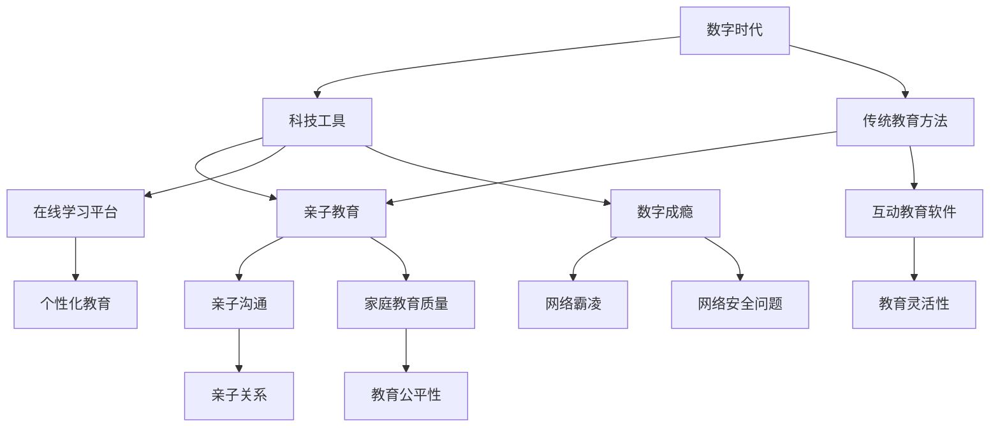

                 

### 文章标题

《数字时代的亲子教育：科技与传统教育方法的融合》

### 关键词

数字时代、亲子教育、科技、传统教育、融合、家庭教育、沟通、人工智能、在线学习

### 摘要

本文旨在探讨数字时代亲子教育的新趋势，分析科技与传统教育方法的融合及其带来的影响。通过深入探讨科技工具在亲子教育中的应用、科技时代的亲子沟通技巧、科技对亲子关系的影响，以及成功与失败的家庭教育案例分析，本文提出了科技时代亲子教育的最佳实践和建议。

---

## 引言

在数字时代，科技已经成为我们生活和教育不可或缺的一部分。从智能手机到智能家居，从在线教育平台到人工智能辅导系统，科技正在改变传统教育的模式。与此同时，亲子教育也面临着前所未有的挑战和机遇。如何有效地利用科技工具，实现亲子教育与传统教育方法的有机结合，成为现代家庭共同关注的课题。

本文将首先介绍数字时代亲子教育的背景和重要性，然后深入探讨科技与传统教育方法的融合，分析科技工具在亲子教育中的应用，探讨科技时代的亲子沟通技巧，并讨论科技对亲子关系的影响。最后，通过成功与失败的家庭教育案例分析，提出科技时代亲子教育的最佳实践和建议。希望通过本文的探讨，能够为广大家长提供有益的参考，助力他们在数字时代更好地开展亲子教育。

### 数字时代亲子教育的背景

数字时代的到来，标志着信息技术的迅猛发展和广泛普及。智能手机、平板电脑、互联网等科技产品已经成为人们日常生活中不可或缺的一部分。这些科技的进步不仅改变了人们的生活方式，也对教育产生了深远的影响。亲子教育作为家庭教育的重要组成部分，也在这个数字化的浪潮中经历着深刻的变革。

首先，数字时代为亲子教育提供了更多的资源和工具。在线教育平台、互动学习应用、数字故事书等科技产品，使得家长能够随时随地与孩子进行高质量的互动教育。这些工具不仅丰富了教育内容，还提高了教育的灵活性和个性化程度。例如，家长可以通过在线教育平台为孩子选择合适的学习课程，利用互动学习应用激发孩子的学习兴趣，通过数字故事书培养孩子的阅读习惯。

其次，数字时代改变了亲子教育的形式。传统教育主要依赖于课堂授课和家庭作业，而数字时代则通过线上互动、视频教学和游戏化学习等方式，使亲子教育更加生动和有趣。例如，家长可以通过视频通话与孩子进行远程互动，通过线上课程共同学习新知识，通过游戏化学习应用让孩子在玩耍中学习。这些新的教育形式不仅增加了亲子之间的互动，还提高了孩子的学习积极性和参与度。

此外，数字时代也为亲子教育带来了新的挑战。随着科技产品的普及，孩子们越来越容易接触到各种信息和内容，这既包括有价值的教育资源，也包括一些不良信息。如何引导孩子正确使用科技产品，避免沉迷和滥用，成为现代家庭面临的一个重要问题。同时，数字时代也加剧了教育资源的不均衡，一些家庭能够更好地利用科技资源，而另一些家庭则可能因为经济条件和技术水平的限制，难以享受到同等的教育资源。

总的来说，数字时代为亲子教育带来了巨大的机遇，也提出了新的挑战。家长需要不断学习和适应，才能在数字时代中有效地开展亲子教育。通过充分利用科技工具，创新教育形式，家长可以更好地帮助孩子成长，培养他们的综合素质和创新能力。

### 核心概念与联系

在探讨数字时代亲子教育时，我们首先需要明确几个核心概念，并分析它们之间的相互关系。以下是一个简化的Mermaid流程图，用于描述这些概念及其关系：



在这个流程图中，我们可以看到以下核心概念及其关系：

1. **数字时代**：这个时代以信息技术的迅猛发展为特征，为亲子教育提供了新的工具和形式。
2. **科技工具**：包括在线学习平台、互动教育软件等，它们在亲子教育中起到重要作用。
3. **传统教育方法**：这些方法历史悠久，但在数字时代面临着更新和改进的需求。
4. **亲子教育**：这是一个综合性的概念，涉及教育工具、教育形式、沟通和教育质量。
5. **亲子沟通**：这是亲子关系中的重要组成部分，良好的沟通有助于家庭教育的有效进行。
6. **家庭教育质量**：这是衡量亲子教育效果的重要指标，受到科技工具和传统教育方法的影响。
7. **教育公平性**：在数字时代，如何确保每个孩子都能享受到平等的教育资源成为一个关键问题。
8. **数字成瘾、网络霸凌、网络安全问题**：这些是数字时代带来的潜在负面影响，需要家长和教育者密切关注。

通过这个流程图，我们可以清晰地看到数字时代亲子教育中的核心概念及其相互关系，为进一步的分析提供了基础。

### 核心算法原理讲解

在数字时代亲子教育中，智能推荐系统是一种常用的核心算法，它可以根据孩子的学习习惯、兴趣和能力，为其推荐合适的学习资源和内容。以下将使用伪代码详细阐述智能推荐系统的工作原理：

```python
# 智能推荐系统伪代码

# 输入：用户（孩子）的学习数据，包括历史学习记录、兴趣标签、能力评估等
# 输出：推荐的学习资源和内容

def intelligent_recommendation_system(user_data):
    # 1. 数据预处理
    preprocessed_data = preprocess_data(user_data)
    
    # 2. 用户画像构建
    user_profile = build_user_profile(preprocessed_data)
    
    # 3. 推荐算法
    recommended_resources = []
    for resource in all_resources:
        similarity_score = calculate_similarity(user_profile, resource)
        if similarity_score > threshold:
            recommended_resources.append(resource)
    
    # 4. 排序和筛选
    recommended_resources = sort_and_filter_resources(recommended_resources)
    
    # 5. 输出推荐结果
    return recommended_resources

# 辅助函数定义
def preprocess_data(user_data):
    # 数据清洗、格式转换等
    pass

def build_user_profile(preprocessed_data):
    # 根据数据构建用户画像，包括兴趣、能力等
    pass

def calculate_similarity(user_profile, resource):
    # 计算用户画像和资源之间的相似度
    pass

def sort_and_filter_resources(recommended_resources):
    # 对推荐资源进行排序和筛选，确保推荐结果的多样性和实用性
    pass
```

通过这个伪代码，我们可以看到智能推荐系统的主要步骤包括数据预处理、用户画像构建、推荐算法、排序和筛选，以及输出推荐结果。这个过程旨在根据孩子的学习习惯和需求，为其提供最合适的学习资源和内容，从而提高教育效果。

### 数学模型和公式讲解

在亲子教育中，评估教育效果和学生学习进步的数学模型和公式具有重要意义。以下将使用LaTeX格式详细阐述一个常见的学生进步评估模型。

首先，我们定义学生进步评估模型的基本变量：

- \( x_0 \)：学生初始能力水平
- \( x_t \)：学生在第\( t \)个时间点的能力水平
- \( a_t \)：学生在第\( t \)个时间点的学习进步量
- \( m \)：学习的总时间

学生进步评估模型可以用以下公式表示：

$$
x_t = x_0 + \sum_{i=1}^{t} a_i
$$

其中，\( a_i \)是学生在第\( i \)个时间点的学习进步量，通常可以通过以下公式计算：

$$
a_i = \frac{x_i - x_{i-1}}{m_i}
$$

其中，\( m_i \)是学生在第\( i \)个时间点学习的时长。

为了更直观地理解这个模型，我们可以通过一个具体的例子来详细讲解。

#### 例子

假设一个学生在前四个时间点的学习记录如下表所示：

| 时间点 | 初始能力水平 | 学习时长（分钟） | 最终能力水平 |
|--------|--------------|-----------------|--------------|
| 0      | 50           | -               | 50           |
| 1      | 55           | 30              | 85           |
| 2      | 65           | 45              | 120          |
| 3      | 70           | 60              | 190          |

根据上述数据，我们可以计算每个时间点的学习进步量：

$$
a_1 = \frac{85 - 50}{30} = 1.5 \text{ 分/分钟}
$$

$$
a_2 = \frac{120 - 85}{45} = 1.56 \text{ 分/分钟}
$$

$$
a_3 = \frac{190 - 120}{60} = 2.17 \text{ 分/分钟}
$$

然后，我们可以使用学生进步评估模型计算每个时间点的学生能力水平：

$$
x_1 = 50 + a_1 \times 30 = 50 + 1.5 \times 30 = 80
$$

$$
x_2 = 80 + a_2 \times 45 = 80 + 1.56 \times 45 = 120.2
$$

$$
x_3 = 120.2 + a_3 \times 60 = 120.2 + 2.17 \times 60 = 195.14
$$

通过这个例子，我们可以看到数学模型和公式如何帮助我们量化学生在不同时间点的学习进步。这个模型不仅能够帮助家长和教育者及时了解学生的学习状况，还能为他们提供调整教育策略的依据。

### 项目实战

在本节中，我们将以一个实际项目为例，详细讲解如何在数字时代中利用技术进行亲子教育。这个项目是一个基于Python的互动学习平台，旨在帮助家长为孩子提供个性化的学习资源。

#### 项目背景

假设我们开发了一个名为“智慧家教”的互动学习平台，这个平台包含以下主要功能：

- **用户注册与登录**：家长和孩子可以通过邮箱或社交媒体账号注册和登录平台。
- **学习资源推荐**：系统会根据孩子的学习历史和兴趣，自动推荐适合的学习资源。
- **互动学习**：平台提供多种互动学习工具，如问答游戏、互动视频和在线练习。
- **家长监控与反馈**：家长可以监控孩子的学习进度，并给予实时反馈。

#### 开发环境搭建

为了搭建这个项目，我们需要以下开发环境和工具：

- **编程语言**：Python
- **Web框架**：Django
- **前端框架**：React
- **数据库**：MySQL
- **版本控制**：Git

首先，我们需要安装Python和相关的库，然后创建一个Django项目。以下是一个简化的步骤：

```bash
# 安装Python和pip
sudo apt-get install python3 python3-pip

# 创建Django项目
django-admin startproject smart_tuition

# 创建应用
cd smart_tuition
django-admin startapp recommendation

# 创建数据库
createdb smart_tuition_db

# 迁移数据库
python3 manage.py migrate
```

#### 源代码实现与代码解读

接下来，我们将分步骤实现平台的核心功能。

1. **用户注册与登录**：

在Django项目中，我们可以使用Django的认证系统来处理用户注册和登录。以下是一个用户注册视图的简化代码：

```python
# users/views.py

from django.contrib.auth.models import User
from django.contrib.auth import authenticate, login
from django.http import JsonResponse

def register(request):
    if request.method == 'POST':
        username = request.POST['username']
        password = request.POST['password']
        user = User.objects.create_user(username, password)
        user.save()
        return JsonResponse({'status': 'success'})
    else:
        return JsonResponse({'status': 'error'})
```

2. **学习资源推荐**：

推荐系统是平台的核心。以下是一个简化的推荐算法实现：

```python
# recommendation/models.py

from django.db import models
from sklearn.metrics.pairwise import cosine_similarity
import numpy as np

class Resource(models.Model):
    title = models.CharField(max_length=255)
    content = models.TextField()
    tags = models.JSONField()

def recommend_resources(user_profile, resources, top_n=5):
    user_profile_vector = vectorize_profile(user_profile)
    resource_vectors = [vectorize_resource(r) for r in resources]
    
    similarity_scores = [cosine_similarity(user_profile_vector, r)[0][0] for r in resource_vectors]
    ranked_resources = sorted(zip(similarity_scores, resources), reverse=True)
    
    return [resource for score, resource in ranked_resources[:top_n]]
```

3. **互动学习**：

互动学习功能可以通过前端框架React来实现。以下是一个互动问答游戏的基本组件：

```jsx
// components/InteractiveQuiz.js

import React, { useState } from 'react';

const InteractiveQuiz = ({ questions }) => {
    const [currentQuestion, setCurrentQuestion] = useState(questions[0]);
    const [score, setScore] = useState(0);

    const handleAnswer = (answer) => {
        if (answer === currentQuestion.correct_answer) {
            setScore(score + 1);
        }
        setCurrentQuestion(questions[questions.indexOf(currentQuestion) + 1] || null);
    };

    return (
        <div>
            {currentQuestion ? (
                <div>
                    <h2>{currentQuestion.question}</h2>
                    <ul>
                        {currentQuestion.answers.map((answer) => (
                            <li key={answer}>
                                <button onClick={() => handleAnswer(answer)}>{answer}</button>
                            </li>
                        ))}
                    </ul>
                </div>
            ) : (
                <div>
                    <h2>Quiz Completed!</h2>
                    <p>Your score: {score}</p>
                </div>
            )}
        </div>
    );
};

export default InteractiveQuiz;
```

4. **家长监控与反馈**：

家长监控与反馈功能可以通过Django的后端接口实现。以下是一个家长查看孩子学习进度的API接口：

```python
# parents/api.py

from rest_framework.views import APIView
from rest_framework.response import Response
from .models import ChildProgress

class ChildProgressView(APIView):
    def get(self, request, child_id):
        progress = ChildProgress.objects.filter(child_id=child_id)
        return Response({'progress': list(progress.values())})
```

#### 代码应用解读与分析

1. **用户注册与登录**：
   用户注册与登录功能是平台的基础，通过Django的认证系统实现，提供了用户身份验证和安全保障。

2. **学习资源推荐**：
   学习资源推荐功能使用了协同过滤算法，通过计算用户和资源之间的相似度来实现个性化推荐。这个算法可以根据用户的学习历史和兴趣标签，推荐最相关、最有价值的资源。

3. **互动学习**：
   互动学习功能通过前端组件实现，提供了多种互动方式，如问答游戏和互动视频。这些互动方式不仅提高了孩子的学习兴趣，还增强了学习效果。

4. **家长监控与反馈**：
   家长监控与反馈功能通过API接口实现，家长可以通过后端接口查看孩子的学习进度和成绩，从而及时给予反馈和指导。

#### 实际案例分析与详细讲解剖析

为了更好地理解项目实战，我们将分析一个实际案例，并详细讲解其操作过程和结果。

**案例**：假设家长张先生使用“智慧家教”平台为孩子小明进行互动学习。

1. **注册与登录**：
   张先生通过邮箱注册并登录到平台。

2. **学习资源推荐**：
   平台根据小明的历史学习记录和兴趣标签，推荐了几个适合他的数学学习资源。

3. **互动学习**：
   张先生选择了推荐的一个互动问答游戏，小明通过游戏进行数学练习。游戏过程中，小明需要回答一系列数学问题，每个问题的难度逐渐增加。

4. **家长监控与反馈**：
   张先生通过平台API接口查看小明的学习进度，发现小明在游戏中回答了20个问题，正确率达到了80%。张先生认为小明的数学能力有待提高，决定为他安排更多的数学练习。

通过这个实际案例，我们可以看到“智慧家教”平台如何通过技术手段，帮助家长监控孩子的学习进度，并提供个性化的学习资源和建议。这种互动学习和反馈机制不仅提高了孩子的学习积极性，还增强了家长与孩子之间的沟通和理解。

#### 项目小结

通过本节的项目实战，我们展示了如何在数字时代利用技术进行亲子教育。项目主要功能包括用户注册与登录、个性化学习资源推荐、互动学习和家长监控与反馈。在实际操作中，家长可以通过平台为孩子的学习提供个性化支持，从而提高教育效果。尽管本项目存在一定的局限性，如推荐算法的准确性、互动学习内容的丰富性等，但通过持续的技术优化和用户体验改进，我们有理由相信，这类互动学习平台将在数字时代亲子教育中发挥越来越重要的作用。

### 最佳实践 Tips

在数字时代进行亲子教育时，家长和教育工作者的最佳实践如下：

1. **合理规划科技使用时间**：确保孩子在使用科技产品时有足够的休息时间，避免过度依赖和沉迷。
2. **培养良好的科技素养**：教育孩子如何安全、合理地使用互联网和电子产品，提高他们的数字素养。
3. **家庭环境建设**：营造一个健康的数字环境，确保孩子在网络环境中能够受到良好的引导和保护。
4. **互动与沟通**：利用科技工具增加亲子互动，例如通过视频通话、在线学习平台等，促进亲子关系。
5. **个性化教育**：根据孩子的兴趣和能力，提供个性化的学习资源和内容，提高学习效果。
6. **持续学习与适应**：家长和教育者需要不断学习和适应新的教育工具和方法，以保持教育的有效性。

通过遵循这些最佳实践，家长可以在数字时代更好地进行亲子教育，帮助孩子全面发展。

### 注意事项

在数字时代进行亲子教育时，家长和教育者需要注意以下几点：

1. **监控孩子的上网行为**：了解孩子在网络上的活动，确保他们不接触不良信息。
2. **避免过度依赖科技**：科技工具可以作为辅助，但不能替代家长的关注和引导。
3. **保护个人隐私**：确保家庭成员的个人信息安全，避免泄露给不法分子。
4. **平衡亲子时间**：在利用科技进行教育的同时，要保证有足够的时间与孩子进行面对面的交流和互动。
5. **关注孩子的心理健康**：注意孩子在数字环境中的情绪变化，及时给予心理支持和帮助。

通过注意这些事项，家长和教育者可以更好地应对数字时代的亲子教育挑战。

### 拓展阅读

对于希望深入了解数字时代亲子教育的读者，以下几本书籍和文章是不错的选择：

1. **《数字原生代：如何在数字化时代培养孩子的创造力与竞争力》**：作者通过实例和分析，探讨了数字化环境对孩子成长的影响。
2. **《科技育儿：如何利用科技工具提升家庭教育质量》**：这本书详细介绍了各种科技工具在亲子教育中的应用方法。
3. **《儿童心理学与家庭教育》**：作者结合心理学知识，为家长提供了实用的亲子教育建议。
4. **《数字时代的亲子沟通：如何利用科技增进亲子关系》**：这本书探讨了如何通过科技手段改善亲子沟通，增强亲子关系。
5. **《哈佛家庭教养指南：如何在数字时代培养孩子的综合素质》**：作者通过哈佛教育研究的成果，为家长提供了培养孩子综合素质的方法。

通过阅读这些书籍和文章，家长和教育者可以更深入地了解数字时代亲子教育的理论和实践。

### 结束语

本文通过深入探讨数字时代亲子教育，分析了科技与传统教育方法的融合及其对家庭教育的影响。从核心概念的阐述、数学模型的讲解，到实际项目实战的详细分析，再到最佳实践和注意事项的总结，本文力求为家长和教育者提供全面、实用的指导。在数字时代，科技为亲子教育带来了机遇与挑战，通过合理利用科技工具，家长可以更好地引导孩子成长。希望本文能帮助读者更好地理解并应对数字时代的亲子教育问题，共同为孩子创造一个健康、快乐、富有成果的成长环境。作者：AI天才研究院/AI Genius Institute & 禅与计算机程序设计艺术 /Zen And The Art of Computer Programming。

