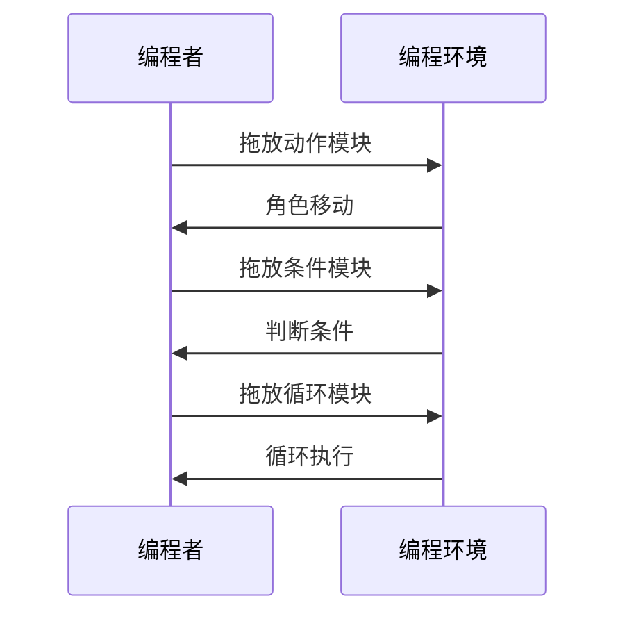

                 

### 文章标题

在数字时代，编程已经不再仅仅是IT专业人士的专利，它逐渐成为了一种通用的技能。亲子编程夏令营作为一种新型的家庭教育活动，旨在通过寓教于乐的方式，让家长和孩子共同体验编程的乐趣，同时提升家庭STEM教育的质量。本文将深入探讨亲子编程夏令营的背景、意义、基础知识、实践方法及其与STEM教育的关系，为家长和孩子提供一份全面的技术指南。

### 关键词

- 数字时代
- 亲子编程
- STEM教育
- 家庭教育
- 编程夏令营

### 摘要

本文将带领读者了解亲子编程夏令营的背景和意义，解释编程的基本概念和工具，展示亲子编程的实际操作，探讨编程与STEM教育的联系，以及编程如何在家庭互动中发挥作用。通过本文，读者将获得如何开展亲子编程活动、选择合适的编程资源与工具的实用建议。

### 第一部分：引言

#### 1.1 亲子编程夏令营的背景和意义

随着全球数字化进程的加快，计算机科学和技术已经成为现代社会不可或缺的一部分。编程不仅是一项专业技能，更是解决复杂问题、创新思维和创造力培养的重要手段。近年来，STEM（科学、技术、工程和数学）教育在全球范围内受到了越来越多的关注。STEM教育注重跨学科的整合，鼓励学生通过实践和探究来学习，培养他们的逻辑思维和解决问题的能力。

亲子编程夏令营作为一种创新的家庭教育活动，旨在通过亲子互动的形式，让家长和孩子共同参与编程学习，体验编程的乐趣。这种活动不仅有助于提高孩子的编程技能，还能增进家庭成员之间的沟通和合作，同时激发孩子对科学和技术的兴趣。

亲子编程夏令营的意义主要体现在以下几个方面：

1. **培养编程兴趣**：通过亲子编程活动，孩子可以在轻松愉快的氛围中学习编程，培养对编程的兴趣和热情。
2. **增进家庭关系**：亲子编程活动提供了一个共同学习的平台，有助于增进家庭成员之间的互动和沟通。
3. **促进STEM教育**：亲子编程活动与STEM教育理念高度契合，有助于孩子在科学、技术、工程和数学领域全面发展。
4. **提高问题解决能力**：编程过程中需要不断地思考问题、设计解决方案，这有助于提高孩子的逻辑思维和问题解决能力。
5. **增强创造力**：编程活动鼓励孩子创新和创造，有助于培养他们的创造力和想象力。

#### 1.2 亲子编程与数字时代

数字时代是一个以计算机技术和互联网为核心的时代。随着人工智能、大数据、云计算等技术的迅速发展，编程已经不再是少数人的专利，它逐渐成为每个人都需要掌握的基本技能。在数字时代，编程不仅是技术的需要，更是生活的需要。

亲子编程与数字时代的联系主要体现在以下几个方面：

1. **技术普及**：数字时代提供了丰富的编程资源和工具，使得编程学习更加便捷和普及。
2. **线上教育**：互联网使得教育资源得以广泛传播，家长和孩子可以在线上找到丰富的编程学习资源。
3. **编程应用**：数字时代中，编程已经广泛应用于各个领域，如游戏开发、网页设计、数据分析等，这为亲子编程活动提供了丰富的实践场景。
4. **编程思维**：数字时代强调创新思维和解决问题能力，编程作为一种重要的思维工具，能够帮助孩子更好地适应未来。

#### 1.3 家庭STEM教育的理念和实践

家庭STEM教育是一种以家庭为基地，以科学、技术、工程和数学为核心的教育模式。与传统的学校教育不同，家庭STEM教育注重实际操作和探究学习，鼓励孩子通过动手实践来学习知识。亲子编程夏令营正是家庭STEM教育的一种有效形式。

家庭STEM教育的理念主要包括：

1. **探究式学习**：鼓励孩子通过自主探究来学习新知识，培养他们的好奇心和探究精神。
2. **跨学科整合**：强调各学科之间的相互联系和整合，培养孩子的综合素养。
3. **实践应用**：将理论知识与实际操作相结合，培养孩子的实践能力和创新能力。
4. **家庭参与**：家长积极参与孩子的学习过程，提供指导和支持，增进家庭互动和沟通。

家庭STEM教育的实践方法主要包括：

1. **家庭实验室**：在家中设立一个简单的实验环境，让孩子进行科学实验和工程实践。
2. **项目式学习**：通过完成具体的项目任务，让孩子在实际操作中学习知识。
3. **亲子互动**：通过亲子共同参与学习活动，增进家庭成员之间的互动和合作。
4. **线上资源**：利用线上教育资源，如编程课程、实验视频等，丰富家庭学习内容。

### 第二部分：亲子编程基础知识

#### 2.1 编程语言入门

编程语言是用于编写计算机程序的语言，不同的编程语言适用于不同的应用场景。对于亲子编程来说，选择易于学习和操作的编程语言非常重要。

##### 2.1.1 Scratch编程语言

Scratch是一种面向儿童的图形化编程语言，由麻省理工学院开发。它使用积木式的编程模块，让孩子们通过拖放模块的方式来编写程序。Scratch非常适合初学者，因为它不仅简单易懂，而且功能强大，可以创建各种有趣的互动项目。

Scratch的核心概念包括：

1. **事件处理**：事件是程序运行过程中的触发点，如鼠标点击、键盘按键等。
2. **动作和声音**：动作用于控制角色移动、旋转等，声音用于添加背景音乐和音效。
3. **控制结构**：包括条件语句和循环语句，用于控制程序的执行流程。
4. **变量和列表**：变量用于存储数据，列表用于存储多个数据项。

以下是一个简单的Scratch示例：



##### 2.1.2 Python编程语言

Python是一种广泛使用的编程语言，以其简洁的语法和强大的功能而著称。Python适合各个层次的编程者，包括初学者。Python可以用于各种应用场景，如数据分析、机器学习、网络编程等。

Python的核心概念包括：

1. **变量和数据类型**：变量用于存储数据，数据类型包括整数、浮点数、字符串等。
2. **控制结构**：包括条件语句（if-else）和循环语句（for、while）。
3. **函数和模块**：函数用于封装代码，模块用于组织代码和共享功能。
4. **错误处理**：包括try-except语句，用于处理程序运行中的错误。

以下是一个简单的Python示例：

```python
# 定义一个函数
def greet(name):
    return "Hello, " + name

# 调用函数
print(greet("Alice"))

# 使用循环
for i in range(5):
    print(i)
```

##### 2.1.3 其他编程语言简介

除了Scratch和Python，还有许多其他适合亲子编程的编程语言，如：

1. **JavaScript**：用于网页开发，可以创建动态网页和交互式应用。
2. **Java**：适用于企业级应用开发，如安卓应用开发。
3. **C++**：适用于系统编程和游戏开发。

每种编程语言都有其独特的特点和适用场景，家长可以根据孩子的兴趣和需求选择合适的编程语言。

#### 2.2 编程工具与平台

编程工具和平台是亲子编程活动的重要支持。选择合适的编程工具和平台可以帮助家长和孩子更好地进行编程学习。

##### 2.2.1 编程教育平台的比较

目前市场上存在许多编程教育平台，如Scratch、Code.org、Tynker、Khan Academy等。这些平台各有特色，适合不同年龄段和不同水平的编程学习者。

以下是几个常见编程教育平台的比较：

1. **Scratch**：适合初学者，特别是儿童，提供图形化编程环境和丰富的项目库。
2. **Code.org**：提供免费的编程课程和挑战，适合各个年龄段的学习者。
3. **Tynker**：提供图形化和文本编程环境，适合初学者和有一定编程基础的学生。
4. **Khan Academy**：提供全面的编程课程，适合初学者和有一定编程基础的学习者。

##### 2.2.2 编程工具的选择和使用

在选择编程工具时，家长需要考虑以下因素：

1. **易用性**：选择界面友好、操作简单的编程工具，降低学习门槛。
2. **功能丰富**：选择功能强大的编程工具，能够支持各种编程项目和实验。
3. **社区支持**：选择有良好社区支持的编程工具，方便家长和孩子获取帮助和资源。

以下是一些常用的编程工具：

1. **Visual Studio Code**：一款轻量级且功能强大的文本编辑器，支持多种编程语言。
2. **PyCharm**：一款专业的Python编程工具，提供丰富的功能和良好的用户体验。
3. **Eclipse**：一款支持多种编程语言的集成开发环境，适用于初学者和高级开发者。

#### 2.3 编程基础概念

了解编程的基础概念是进行编程活动的前提。以下是几个核心概念：

##### 2.3.1 变量与数据类型

变量是编程中最基本的概念，用于存储数据。不同的数据类型有不同的存储方式和操作方法。Python中的数据类型包括：

- **整数（int）**：用于存储整数，如1、2、3等。
- **浮点数（float）**：用于存储浮点数，如1.0、2.5等。
- **字符串（str）**：用于存储文本，如"Hello"、"World"等。
- **列表（list）**：用于存储一系列元素，如[1, 2, 3]等。
- **字典（dict）**：用于存储键值对，如{'name': 'Alice', 'age': 30}等。

以下是一个简单的变量示例：

```python
# 定义变量
name = "Alice"
age = 30
height = 1.75
is_student = True

# 打印变量
print("Name:", name)
print("Age:", age)
print("Height:", height)
print("Is student:", is_student)
```

##### 2.3.2 控制结构

控制结构用于控制程序的执行流程。Python中的控制结构包括：

- **条件语句（if-else）**：用于根据条件执行不同的代码块。
- **循环语句（for、while）**：用于重复执行代码块。

以下是一个简单的条件语句和循环语句示例：

```python
# 条件语句
if age > 18:
    print("You are an adult.")
else:
    print("You are a child.")

# 循环语句
for i in range(5):
    print(i)
```

##### 2.3.3 函数与模块

函数用于封装代码，提高代码的可读性和复用性。模块是Python中用于组织代码和共享功能的重要机制。

以下是一个简单的函数和模块示例：

```python
# 定义函数
def greet(name):
    return "Hello, " + name

# 导入模块
import math

# 调用函数和模块
print(greet("Alice"))
print(math.sqrt(16))
```

### 第三部分：亲子编程实践

#### 3.1 亲子编程活动设计

亲子编程活动的设计是亲子编程夏令营的核心。一个成功的亲子编程活动需要明确的目标、合理的规划和丰富的内容。以下是设计亲子编程活动的一些关键步骤：

##### 3.1.1 亲子编程活动规划

1. **确定活动目标**：首先需要明确活动目标，如提高编程技能、培养团队合作精神、增强亲子关系等。
2. **选择编程语言和工具**：根据活动目标和参与者的编程基础，选择合适的编程语言和工具。
3. **设计活动内容**：根据目标，设计一系列符合年龄段和编程基础的编程项目，如制作简单的游戏、开发小程序、解决实际问题等。
4. **制定活动计划**：制定详细的活动计划，包括活动时间、地点、参与人员、活动流程等。

##### 3.1.2 亲子编程活动案例

以下是一个亲子编程活动的案例：

**活动名称**：制作电子贺卡

**活动目标**：通过制作电子贺卡，让孩子学习基本的编程知识和技能，同时增进亲子关系。

**活动内容**：

1. **活动准备**：家长和孩子共同准备制作电子贺卡的素材，如图片、音乐等。
2. **编程学习**：家长和孩子一起学习Python编程语言的基础知识，如变量、条件语句、循环语句等。
3. **编写代码**：家长和孩子共同编写代码，实现电子贺卡的功能，如显示图片、播放音乐等。
4. **调试与优化**：对编写的代码进行调试和优化，确保电子贺卡能够正常运行。

**活动流程**：

1. **热身活动**：家长和孩子一起观看编程相关的教学视频，了解编程的基本概念。
2. **编程实践**：家长和孩子分别编写代码，制作电子贺卡的各个部分。
3. **协作完成**：家长和孩子共同调试代码，整合各个部分，完成电子贺卡的制作。
4. **展示与分享**：家长和孩子一起展示制作的电子贺卡，分享制作过程中的心得体会。

#### 3.2 编程项目实战

##### 3.2.1 简单项目实例

以下是一个简单的Python编程项目实例：

**项目名称**：计算器

**项目描述**：编写一个简单的计算器程序，实现加、减、乘、除等基本运算功能。

**伪代码**：

```
# 定义加法函数
def add(a, b):
    return a + b

# 定义减法函数
def subtract(a, b):
    return a - b

# 定义乘法函数
def multiply(a, b):
    return a * b

# 定义除法函数
def divide(a, b):
    return a / b

# 主函数
def main():
    print("Welcome to the Calculator!")
    while True:
        print("请选择运算：1.加法 2.减法 3.乘法 4.除法 5.退出")
        choice = input("您的选择是：")
        if choice == "1":
            a = float(input("请输入第一个数："))
            b = float(input("请输入第二个数："))
            print("结果是：", add(a, b))
        elif choice == "2":
            a = float(input("请输入第一个数："))
            b = float(input("请输入第二个数："))
            print("结果是：", subtract(a, b))
        elif choice == "3":
            a = float(input("请输入第一个数："))
            b = float(input("请输入第二个数："))
            print("结果是：", multiply(a, b))
        elif choice == "4":
            a = float(input("请输入第一个数："))
            b = float(input("请输入第二个数："))
            print("结果是：", divide(a, b))
        elif choice == "5":
            print("谢谢使用，再见！")
            break
        else:
            print("无效输入，请重新选择。")

# 调用主函数
main()
```

##### 3.2.2 复杂项目实现

以下是一个复杂的Python编程项目实例：

**项目名称**：在线考试系统

**项目描述**：开发一个在线考试系统，实现考生报名、考试、评分等功能。

**技术栈**：Python + Flask + MySQL

**伪代码**：

```python
# 导入Flask库
from flask import Flask, request, render_template

# 创建Flask应用
app = Flask(__name__)

# 数据库连接
import pymysql
conn = pymysql.connect(host='localhost', user='root', password='password', database='exam_system')

# 登录页面路由
@app.route('/')
def login():
    return render_template('login.html')

# 登录验证
@app.route('/login', methods=['POST'])
def login():
    username = request.form['username']
    password = request.form['password']
    cursor = conn.cursor()
    cursor.execute("SELECT * FROM users WHERE username = %s AND password = %s", (username, password))
    user = cursor.fetchone()
    if user:
        return "登录成功"
    else:
        return "用户名或密码错误"

# 考生报名页面路由
@app.route('/register')
def register():
    return render_template('register.html')

# 考生报名
@app.route('/register', methods=['POST'])
def register():
    username = request.form['username']
    password = request.form['password']
    cursor = conn.cursor()
    cursor.execute("INSERT INTO users (username, password) VALUES (%s, %s)", (username, password))
    conn.commit()
    return "报名成功"

# 考试页面路由
@app.route('/exam')
def exam():
    return render_template('exam.html')

# 提交考试
@app.route('/submit_exam', methods=['POST'])
def submit_exam():
    score = 0
    for question in request.form:
        if question.endswith("_answer"):
            correct_answer = request.form[question.replace("_answer", "_correct_answer")]
            user_answer = request.form[question]
            if user_answer == correct_answer:
                score += 1
    return "得分：{score}".format(score=score)

# 主函数
if __name__ == '__main__':
    app.run()
```

##### 3.2.3 编程项目评估

编程项目的评估是亲子编程活动的重要环节。通过评估，可以了解项目的完成情况，发现问题和不足，为后续的编程学习提供指导。

评估的方法包括：

1. **代码审查**：家长和老师对编写的代码进行审查，检查代码的规范性、可读性和可维护性。
2. **功能测试**：运行编写的程序，测试各个功能的实现情况，确保程序能够正常运行。
3. **用户反馈**：收集参与者的反馈，了解他们对编程项目的感受和意见，为后续的改进提供参考。

### 第四部分：亲子编程与STEM教育

#### 4.1 亲子编程与STEM教育的关系

STEM教育是一种以科学、技术、工程和数学为核心的教育模式，旨在培养学生的创新思维和实际问题解决能力。亲子编程作为STEM教育的一部分，具有独特的优势和作用。

##### 4.1.1 STEM教育的重要性

STEM教育在全球范围内受到了越来越多的关注，主要原因包括：

1. **经济需求**：随着科技的快速发展，STEM领域成为了推动经济增长的重要力量。STEM教育能够培养具备创新能力和技术素养的人才，满足社会对STEM专业人才的需求。
2. **教育改革**：STEM教育强调跨学科的整合和实践，有助于打破传统教育的局限性，培养学生的综合素养和合作精神。
3. **国家战略**：许多国家都将STEM教育作为国家战略，通过政策和资金支持，推动STEM教育的普及和发展。
4. **个人发展**：STEM教育能够培养孩子的逻辑思维、问题解决能力和创新能力，为他们的未来发展奠定坚实的基础。

##### 4.1.2 亲子编程在STEM教育中的应用

亲子编程在STEM教育中具有以下应用：

1. **科学教育**：编程项目可以涉及生物学、物理学、化学等科学领域，通过编程实验和项目，让学生了解科学原理和实验方法。
2. **技术教育**：编程项目可以涉及计算机科学、网络技术、人工智能等领域，让学生了解技术的原理和应用。
3. **工程教育**：编程项目可以涉及机械工程、电子工程、建筑学等领域，通过编程设计和实现，让学生了解工程原理和工程实践。
4. **数学教育**：编程项目可以涉及数学建模、算法设计、数据分析等领域，通过编程计算和验证，让学生了解数学的应用和数学思维。

#### 4.2 亲子编程课程设计

亲子编程课程设计是实施亲子编程教育的重要环节。一个成功的亲子编程课程需要明确的教学目标、合理的课程内容和有效的教学方法。

##### 4.2.1 课程目标与内容

亲子编程课程的目标主要包括：

1. **培养编程兴趣**：通过丰富的编程项目和游戏，激发学生对编程的兴趣和热情。
2. **掌握编程技能**：学习编程语言的基础知识和编程技能，掌握编程的基本概念和算法设计。
3. **培养创新思维**：通过编程项目的设计和实现，培养学生的创新思维和解决问题的能力。
4. **增强团队合作**：通过亲子互动和团队合作，培养学生的合作精神和团队意识。

亲子编程课程的内容主要包括：

1. **编程语言基础**：学习Python、Scratch等编程语言的基础知识，包括变量、数据类型、控制结构等。
2. **编程项目实践**：通过简单的编程项目，如计算器、小游戏等，掌握编程的基本技能。
3. **算法设计与分析**：学习基本的算法设计方法和算法分析技巧，提高编程效率和代码质量。
4. **创新项目开发**：通过创新项目的开发和实现，培养学生的创新思维和实际问题解决能力。

##### 4.2.2 教学方法与评估

亲子编程的教学方法主要包括：

1. **探究式学习**：鼓励学生通过自主探究和实验来学习编程，培养他们的好奇心和探究精神。
2. **项目式学习**：通过完成具体的项目任务，让学生在实际操作中学习知识，提高实践能力和创新能力。
3. **合作学习**：鼓励亲子互动和团队合作，通过共同解决问题和协作完成任务，培养合作精神和团队意识。
4. **个性化教学**：根据学生的兴趣和需求，提供个性化的教学方案，帮助学生更好地学习和成长。

亲子编程的评估方法主要包括：

1. **过程评估**：通过观察学生在编程学习过程中的表现，如编程态度、问题解决能力等，评估学生的学习效果。
2. **作品评估**：通过评估学生的编程作品，如功能实现、代码质量、创新程度等，评估学生的编程能力。
3. **考试评估**：通过编程考试，评估学生的编程知识和技能水平。
4. **家长反馈**：收集家长的反馈意见，了解学生在家庭编程学习中的表现和成长。

### 第五部分：亲子编程与家庭互动

#### 5.1 亲子编程与家庭沟通

亲子编程活动为家长和孩子提供了一个共同学习和交流的平台，有助于增进家庭沟通和理解。通过编程活动，家长可以更好地了解孩子的兴趣和需求，孩子也可以更亲近地与家长交流。

##### 5.1.1 增进亲子关系的编程活动

以下是一些有助于增进亲子关系的编程活动：

1. **共同编程项目**：家长和孩子共同参与编程项目，如制作电子贺卡、小游戏等，通过合作和沟通，增进亲子关系。
2. **编程竞赛**：家长和孩子可以参加编程竞赛，共同解决问题和完成任务，培养竞争意识和团队合作精神。
3. **编程故事会**：家长和孩子可以一起编写编程故事，通过讲述和讨论，增进理解和沟通。

##### 5.1.2 编程活动中的家庭角色分工

在亲子编程活动中，家长和孩子可以有不同的角色分工：

1. **家长角色**：家长可以担任指导者、监督者和支持者的角色，帮助孩子解决问题、提供学习资源和技术支持。
2. **孩子角色**：孩子可以担任编程者、创新者和实践者的角色，通过自主学习和实践，提高编程能力和创新能力。
3. **互动角色**：家长和孩子可以共同担任互动者的角色，通过交流和合作，增进理解和沟通。

#### 5.2 亲子编程与家庭生活

亲子编程不仅限于编程学习，还可以融入家庭生活的各个方面，为家庭生活增添乐趣和创新。

##### 5.2.1 家庭编程项目实践

以下是一些家庭编程项目实践：

1. **智能家居**：通过编程实现家居设备的智能控制，如智能灯光、智能门锁等，提高家庭生活的便利性。
2. **家庭财务管理**：通过编程实现家庭财务的自动化管理，如记账、预算规划等，提高家庭财务管理效率。
3. **健康监控**：通过编程实现健康数据的监控和分析，如体重、运动量等，提高家庭健康水平。

##### 5.2.2 编程在家庭生活中的应用

编程在家庭生活中的应用不仅限于上述项目，还可以应用于：

1. **家庭游戏**：通过编程开发家庭游戏，如棋类游戏、解谜游戏等，丰富家庭娱乐活动。
2. **家庭教育**：通过编程开发教育软件和游戏，如语言学习软件、数学游戏等，提高家庭教育的效果。
3. **家庭安全**：通过编程实现家庭安全监控和报警系统，提高家庭安全性。

### 第六部分：亲子编程资源与工具

#### 6.1 适合家庭的编程资源

为了支持亲子编程活动，家长需要了解和利用各种编程资源。以下是一些适合家庭的编程资源：

##### 6.1.1 在线编程平台推荐

1. **Scratch**：麻省理工学院开发的图形化编程平台，适合儿童学习编程。
2. **Code.org**：提供免费的编程课程和挑战，适合各个年龄段的学习者。
3. **Tynker**：提供图形化和文本编程环境，适合初学者和有一定编程基础的学生。
4. **Khan Academy**：提供全面的编程课程，适合初学者和有一定编程基础的学习者。

##### 6.1.2 硬件编程工具介绍

1. **Arduino**：一款开源硬件平台，适用于电子工程和物联网项目。
2. **Raspberry Pi**：一款小型计算机，适用于各种编程项目和电子工程项目。
3. **Micro:bit**：一款适用于儿童和初学者的硬件编程平台。

#### 6.2 编程教育资源库

为了方便家长和孩子获取编程教育资源，可以建立一个编程教育资源库。以下是编程教育资源库的构建方法：

##### 6.2.1 教育资源分类与索引

1. **编程语言教程**：分类整理各种编程语言的教程，如Python、Java、C++等。
2. **编程项目实例**：收集各种编程项目实例，如小游戏、数据分析、物联网项目等。
3. **编程工具介绍**：介绍各种编程工具的使用方法和技巧，如集成开发环境、版本控制工具等。
4. **编程竞赛资源**：收集各种编程竞赛的资源，如竞赛规则、编程题目、参考答案等。

##### 6.2.2 教育资源的使用与评估

1. **制定学习计划**：根据孩子的兴趣和需求，制定详细的学习计划，确保教育资源能够有效利用。
2. **监督与指导**：家长需要监督孩子的学习进度，提供必要的指导和支持，帮助孩子解决问题。
3. **评估学习效果**：通过编程作品、考试成绩等方式，评估孩子的学习效果，为后续的学习提供参考。

### 第七部分：结语

#### 7.1 亲子编程夏令营的总结

亲子编程夏令营作为一种新型的家庭教育活动，已经受到了越来越多的关注。通过亲子编程夏令营，家长和孩子不仅共同体验了编程的乐趣，还培养了编程技能和创新思维，增进了家庭互动和理解。以下是亲子编程夏令营的总结：

1. **编程技能提升**：通过夏令营的编程学习，家长和孩子的编程技能得到了显著提升，掌握了各种编程语言和工具。
2. **家庭关系增进**：亲子编程活动为家长和孩子提供了一个共同学习和交流的平台，增进了家庭互动和理解。
3. **STEM教育推进**：亲子编程夏令营与STEM教育理念高度契合，有助于孩子全面发展科学、技术、工程和数学素养。
4. **创新思维培养**：通过编程项目的设计和实现，家长和孩子的创新思维和解决问题的能力得到了锻炼和提高。
5. **教育资源丰富**：亲子编程夏令营提供了丰富的编程教育资源，为家长和孩子的编程学习提供了有力支持。

#### 7.1.1 夏令营的收获与反思

夏令营的收获主要体现在以下几个方面：

1. **编程技能**：家长和孩子通过夏令营的学习，掌握了各种编程语言和工具，提高了编程技能。
2. **团队合作**：在夏令营的编程项目中，家长和孩子共同协作，培养了团队合作精神和解决问题的能力。
3. **创新思维**：通过编程项目的设计和实现，家长和孩子的创新思维得到了锻炼和提高。
4. **家庭关系**：亲子编程活动增进了家长和孩子之间的互动和理解，促进了家庭关系的和谐发展。

反思方面，夏令营存在以下不足之处：

1. **时间安排**：夏令营的时间安排较为紧张，家长和孩子可能无法充分利用每一分钟进行编程学习。
2. **资源利用**：部分家长和孩子可能对编程资源的利用不够充分，需要进一步指导和支持。
3. **个性化教学**：夏令营的授课内容较为统一，可能无法完全满足每个孩子的个性化需求。

#### 7.1.2 亲子编程的未来展望

未来，亲子编程将继续发挥其在家庭教育中的重要作用，主要体现在以下几个方面：

1. **教育普及**：随着编程教育的普及，更多家长和孩子将参与亲子编程活动，提高编程技能和创新能力。
2. **教育创新**：亲子编程将不断引入新的教育理念和教学方法，如混合式学习、项目式学习等，提高教育效果。
3. **教育支持**：政府、学校和社会将提供更多支持和资源，推动亲子编程教育的普及和发展。
4. **跨学科整合**：亲子编程将与其他学科如科学、技术、工程和数学等相结合，推动STEM教育的全面发展。

通过亲子编程夏令营，家长和孩子不仅共同体验了编程的乐趣，还培养了编程技能和创新思维，增进了家庭互动和理解。我们相信，在未来的发展中，亲子编程将继续发挥其重要作用，为家庭教育注入新的活力。

