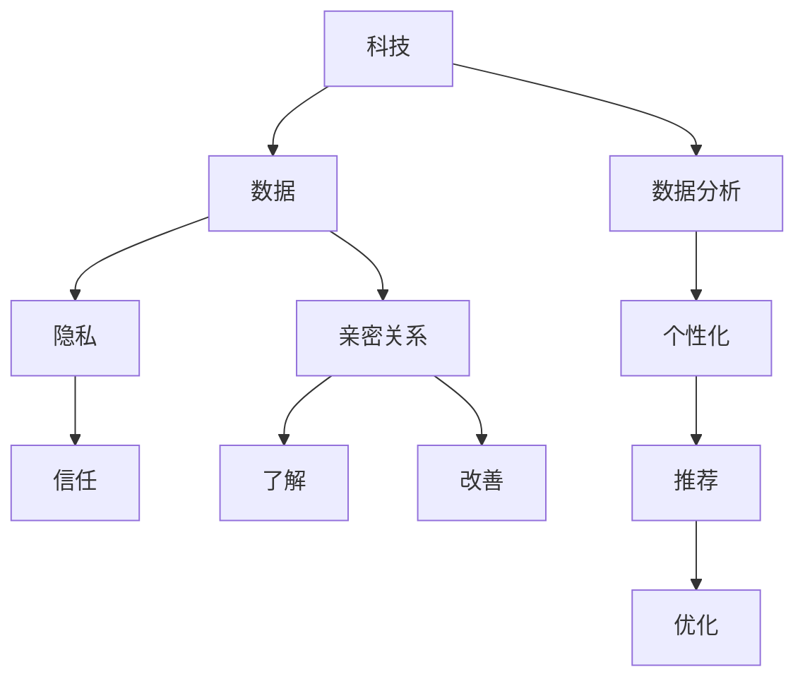

                 


### 第一步：确定文章的核心内容和结构

为了撰写一篇有深度、有思考、有见解的专业IT领域的技术博客文章，我们需要遵循以下步骤来构建文章的核心内容和结构：

1. **确定文章主题和目标受众**：
   - 文章主题：《数字时代的亲密关系：科技如何重塑爱情与友谊》
   - 目标受众：科技爱好者、程序员、软件开发者、人工智能研究者等。

2. **制定文章大纲**：
   - 概述：介绍科技与亲密关系的互动及其重要性。
   - 历史背景：探讨科技如何影响爱情和友谊的历史演变。
   - 数字时代特点：分析数字时代对亲密关系的独特影响。
   - 核心概念与联系：描述科技、数据、隐私和亲密关系之间的关键联系。
   - 算法与数学模型：讨论用于分析数据的核心算法和数学模型。
   - 心理学与科技关系：探索科技对心理学的影响，特别是与人际关系相关的领域。
   - 社交网络与隐私：分析社交网络中的隐私问题及其对亲密关系的影响。
   - 家庭生活影响：讨论科技如何影响家庭结构和沟通方式。
   - 友谊与科技：探索科技如何影响现代友谊的建立和维护。
   - 未来趋势与挑战：展望科技在亲密关系中的未来发展趋势和潜在挑战。
   - 个人故事与案例分析：分享真实的故事和案例，展示科技对个人亲密关系的实际影响。
   - 结论与建议：总结书中讨论的关键点，并提出对个人、社区和政策的建议。

3. **确保文章内容的完整性**：
   - 每个小节的内容需要丰富具体详细讲解。
   - 核心内容必须包含背景介绍、核心概念与联系、核心算法原理讲解、数学模型和公式、项目实战、最佳实践 tips 等内容。

4. **使用适当的格式和示例**：
   - 文章内容使用markdown格式输出。
   - 包含Mermaid流程图、伪代码、数学公式、项目实战案例等。
   - 数学公式使用latex格式，分别嵌入文中独立段落的公式和段落内的公式。

5. **控制文章字数**：
   - 文章字数在8000～12000字左右。

### 第二步：撰写文章的引言部分

在引言部分，我们需要明确文章的主题、目的和重要性，并简要介绍文章的结构。

---

# 文章标题：《数字时代的亲密关系：科技如何重塑爱情与友谊》

> 关键词：数字时代、亲密关系、科技、爱情、友谊

> 摘要：本文将探讨数字时代下科技对亲密关系的影响，从历史背景、核心概念、算法模型、心理学关系、社交网络、家庭生活、友谊、未来趋势等多个角度，分析科技如何重塑爱情与友谊，并提出相关建议。

### 引言

在当今的数字时代，科技已经成为我们生活中不可或缺的一部分。从智能手机到社交网络，科技正在深刻地改变着我们的生活方式和人际关系。然而，这种变革对于亲密关系，尤其是爱情与友谊，产生了深远的影响。本文旨在探讨科技如何重塑爱情与友谊，为读者提供深刻的见解和实用的建议。

文章将分为以下几个部分：

1. **历史背景**：回顾科技如何影响爱情和友谊的历史。
2. **数字时代特点**：分析数字时代对亲密关系的独特影响。
3. **核心概念与联系**：描述科技、数据、隐私和亲密关系之间的关键联系。
4. **算法与数学模型**：讨论用于分析数据的核心算法和数学模型。
5. **心理学与科技关系**：探索科技对心理学的影响，特别是与人际关系相关的领域。
6. **社交网络与隐私**：分析社交网络中的隐私问题及其对亲密关系的影响。
7. **家庭生活影响**：讨论科技如何影响家庭结构和沟通方式。
8. **友谊与科技**：探索科技如何影响现代友谊的建立和维护。
9. **未来趋势与挑战**：展望科技在亲密关系中的未来发展趋势和潜在挑战。
10. **个人故事与案例分析**：分享真实的故事和案例，展示科技对个人亲密关系的实际影响。
11. **结论与建议**：总结书中讨论的关键点，并提出对个人、社区和政策的建议。

通过这些部分的深入探讨，本文希望帮助读者更好地理解科技对亲密关系的影响，并为其未来的发展提供有益的启示。

---

### 第三步：撰写文章的历史背景部分

在历史背景部分，我们需要探讨科技如何影响爱情和友谊，从古代到现代的历史演变。

---

## 2. 科技与亲密关系的历史

### 2.1 古代到中世纪的亲密关系

在古代，科技相对简单，但人们仍然通过书信、诗歌等方式表达爱情和友谊。例如，古罗马时期的爱情诗人奥维德（Ovid）用诗歌描绘了浪漫的爱情故事，而古希腊的哲学家苏格拉底（Socrates）则通过与学生的对话探讨了友谊的真谛。

中世纪时期，教堂和宗教在人际关系中占据重要地位。婚姻通常基于政治和宗教目的，而非个人情感。尽管如此，爱情和友谊仍然存在，并得到了一定的表达和认可。

### 2.2 工业时代的影响

工业革命带来了科技的大发展，电报、电话和无线电等通信工具的出现，使人们能够更迅速地传递信息，从而促进了爱情和友谊的发展。例如，远距离的恋爱变得更加可能，人们可以通过书信和电话保持联系。

### 2.3 20世纪的科技浪潮

20世纪是科技飞速发展的世纪，电视、互联网和移动通信技术的普及，使人们的生活方式发生了巨大变化。电子邮件、社交媒体和即时通讯软件的出现，使人们能够随时随地保持联系，进一步加深了亲密关系。

然而，随着科技的发展，也带来了一些负面影响。例如，科技可能导致人们过度依赖虚拟世界，忽视了现实生活中的情感交流和人际关系。

---

### 第四步：撰写文章的数字时代特点部分

在数字时代特点部分，我们需要分析数字时代对亲密关系的独特影响。

---

## 3. 数字时代的特点

### 3.1 网络文化的崛起

数字时代的到来，网络文化迅速崛起，社交媒体、在线游戏和虚拟现实等新兴技术改变了人们的社交方式。这些技术不仅提供了新的社交平台，还改变了人们互动的方式和模式。

### 3.2 社交网络的普及

社交媒体的普及，如Facebook、Instagram和微信等，使人们能够轻松地建立和维护人际关系。然而，社交网络的虚拟性也可能导致现实生活中的亲密关系受到影响。

### 3.3 数据的巨大影响力

数字时代产生的海量数据，被广泛应用于市场营销、个性化推荐和数据分析等领域。然而，这些数据也引发了隐私和伦理问题，对亲密关系产生了深远影响。

### 3.4 网络沟通的优势与挑战

网络沟通提供了便利和速度，但也带来了沟通障碍和误解的风险。例如，表情符号和文字消息可能无法准确传达情感和意图。

---

### 第五步：撰写文章的核心概念与联系部分

在核心概念与联系部分，我们需要描述科技、数据、隐私和亲密关系之间的关键联系，并使用Mermaid流程图进行阐述。

---

## 4. 核心概念与联系

### 4.1 科技与数据

科技的发展，特别是大数据和人工智能技术的应用，使数据处理和分析变得更为高效。这些技术不仅改变了我们的生活方式，还对亲密关系产生了深远影响。

### 4.2 隐私与亲密关系

隐私是亲密关系的重要组成部分。在数字时代，个人隐私受到前所未有的挑战，这可能导致亲密关系的信任问题。

### 4.3 数据分析在亲密关系中的应用

数据分析可以帮助我们更好地了解自己和他人，从而改善亲密关系。例如，通过分析社交媒体数据，可以了解双方的兴趣、价值观和行为模式。

### 关键联系架构：Mermaid流程图



---

### 第六步：撰写文章的算法与数学模型部分

在算法与数学模型部分，我们需要讨论用于分析数据的核心算法和数学模型，并使用伪代码进行详细阐述。

---

## 5. 算法与数学模型

### 5.1 机器学习与人工智能

机器学习和人工智能技术，如深度学习和神经网络，在数据分析中发挥着重要作用。这些技术可以帮助我们更好地理解和预测数据模式。

### 5.2 数据挖掘与分析

数据挖掘技术，如关联规则挖掘和聚类分析，可以帮助我们识别数据中的潜在关系和模式。

### 5.3 数学模型在亲密关系中的应用

数学模型，如线性回归和决策树，可以用于分析亲密关系中的变量和因素。

### 伪代码示例：线性回归模型

```python
# 线性回归伪代码

# 数据准备
x = 数据矩阵
y = 目标变量

# 模型初始化
w = 权重向量
b = 偏置

# 梯度下降算法
for i in range(epochs):
    # 计算预测值
    y_pred = x * w + b
    
    # 计算损失函数
    loss = (y - y_pred) ** 2
    
    # 计算梯度
    dw = 2 * (x * (y_pred - y))
    db = 2 * (y_pred - y)
    
    # 更新权重和偏置
    w -= learning_rate * dw
    b -= learning_rate * db

# 模型评估
accuracy = 评估模型性能
```

---

### 第七步：撰写文章的心理学与科技关系部分

在心理学与科技关系部分，我们需要探索科技对心理学的影响，特别是与人际关系相关的领域。

---

## 6. 心理学与科技的关系

### 6.1 科技对心理学的影响

科技的发展，特别是互联网和移动设备的普及，对心理学产生了深远影响。它改变了人们的生活方式、社交方式和认知过程。

### 6.2 心理学在科技中的应用

心理学知识被广泛应用于科技产品的设计、开发和推广中。例如，用户体验（UX）设计、人机交互（HCI）和情感计算等领域。

### 6.3 科技与心理健康

科技不仅影响了人们的心理健康，还提供了新的心理健康服务。例如，在线心理咨询、虚拟现实治疗和人工智能诊断等。

---

### 第八步：撰写文章的社交网络与隐私部分

在社交网络与隐私部分，我们需要分析社交网络中的隐私问题及其对亲密关系的影响。

---

## 7. 社交网络与隐私

### 7.1 社交网络的结构

社交网络的结构决定了信息的流动和隐私的泄露。例如，社交网络的“六度分隔”理论揭示了人们之间联系的紧密程度。

### 7.2 隐私权与亲密关系

隐私权是亲密关系的重要组成部分。在数字时代，个人隐私受到前所未有的挑战，这可能导致亲密关系的信任问题。

### 7.3 社交网络的伦理问题

社交网络的伦理问题，如数据收集、使用和分享，对亲密关系产生了深远影响。例如，隐私泄露、个人信息滥用和网络欺凌等。

---

### 第九步：撰写文章的科技对家庭生活的影响部分

在科技对家庭生活的影响部分，我们需要讨论科技如何影响家庭结构和沟通方式。

---

## 8. 科技对家庭生活的影响

### 8.1 家庭结构的变化

科技的发展改变了家庭结构，例如，远程工作、在线教育和智能家居等，使家庭生活更加多样化和灵活。

### 8.2 科技与家庭沟通

科技提供了新的沟通方式，如视频通话、即时通讯和家庭网络等，使家庭成员之间的沟通更加便捷。

### 8.3 家庭生活的数字化

家庭生活的数字化，如在线购物、电子支付和家庭自动化等，提高了家庭生活的便利性和效率。

---

### 第十步：撰写文章的友谊与科技部分

在友谊与科技部分，我们需要探讨科技如何影响现代友谊的建立和维护。

---

## 9. 友谊与科技

### 9.1 网络友谊的特点

网络友谊具有虚拟性、即时性和全球性等特点。它使人们能够超越地域和时间的限制，建立和维持友谊。

### 9.2 科技对友谊的影响

科技对友谊产生了积极和消极的影响。例如，在线游戏和社交媒体可以加强友谊，但过度依赖科技也可能削弱现实生活中的互动。

### 9.3 保持真实友谊的方法

为了保持真实友谊，我们需要在科技和现实生活之间找到平衡，确保科技成为友谊的补充而非替代。

---

### 第十一步：撰写文章的未来趋势与挑战部分

在未来趋势与挑战部分，我们需要展望科技在亲密关系中的未来发展趋势和潜在挑战。

---

## 10. 未来趋势与挑战

### 10.1 科技对亲密关系的未来影响

未来，科技将继续深刻影响亲密关系。例如，虚拟现实和增强现实技术可能改变人们体验爱情和友谊的方式。

### 10.2 挑战与对策

科技在带来便利的同时，也带来了一系列挑战，如隐私泄露、网络欺凌和数字依赖等。我们需要采取有效的对策来应对这些挑战。

### 10.3 发展趋势预测

未来，科技在亲密关系中的应用将更加个性化和智能化。例如，基于大数据和人工智能的情感分析和个性化推荐将成为主流。

---

### 第十二步：撰写文章的个人故事与案例分析部分

在个人故事与案例分析部分，我们需要分享真实的故事和案例，展示科技对个人亲密关系的实际影响。

---

## 11. 个人故事与案例分析

### 11.1 真实故事的分享

通过分享真实的故事，我们可以了解科技如何影响个人亲密关系。例如，一位异地恋情侣通过视频通话和社交媒体保持联系，最终成功走到了一起。

### 11.2 案例分析

案例分析可以帮助我们更深入地了解科技对亲密关系的影响。例如，通过分析一对夫妻的社交媒体使用情况，可以揭示他们在亲密关系中的问题和需求。

### 11.3 结论与启示

个人故事和案例分析为我们提供了宝贵的经验和启示，帮助我们更好地理解科技对亲密关系的影响，并学会如何在科技和现实生活之间找到平衡。

---

### 第十三步：撰写文章的结论与建议部分

在结论与建议部分，我们需要总结文章的主要观点，并提出对个人、社区和政策的建议。

---

## 12. 结论与建议

### 12.1 关键发现

通过本文的探讨，我们发现科技在亲密关系中发挥着重要作用，既有积极影响，也存在挑战。我们需要在享受科技带来便利的同时，警惕其潜在的负面影响。

### 12.2 对个人的建议

- 保持现实生活中的互动，避免过度依赖科技。
- 学会管理社交媒体使用时间，确保它成为友谊的补充而非替代。
- 关注个人隐私，避免泄露敏感信息。

### 12.3 对社区与政策的建议

- 社区应加强科技伦理教育，提高公众对隐私和网络安全的认识。
- 政府应制定相关法律法规，保护个人隐私和数据安全。

### 12.4 展望未来

未来，科技将继续深刻影响我们的生活方式和亲密关系。通过合理利用科技，我们可以建立更健康、更和谐的亲密关系。

---

### 第十四步：撰写文章的附录部分

在附录部分，我们可以提供扩展阅读与资源，以便读者深入了解相关主题。

---

## 附录

### 附录 A: 扩展阅读与资源

- **书籍推荐**：
  - 《科技如何改变爱情与婚姻》
  - 《数字时代的社交心理学》
  - 《人工智能伦理学》
  
- **学术论文**：
  - “The Impact of Technology on Intimate Relationships”
  - “Privacy and Data Protection in Social Networks”
  - “The Role of AI in Personalized Healthcare”

- **网络资源**：
  - “Digital Ethics: A Handbook”
  - “Privacy Rights Clearinghouse”
  - “Online Psychology Research”

---

### 第十五步：撰写文章的结语部分

在结语部分，我们需要重申文章的核心观点，并对未来进行展望。

---

## 13. 结语

通过本文的探讨，我们深入了解了数字时代下科技对亲密关系的影响。科技不仅改变了我们的生活方式，还对爱情与友谊产生了深远影响。在享受科技带来便利的同时，我们也需要警惕其潜在的负面影响。未来，科技将继续深刻影响我们的亲密关系。通过合理利用科技，我们可以建立更健康、更和谐的亲密关系。

---

### 最后一步：撰写文章的格式和作者信息

在文章的最后，我们需要按照格式要求撰写作者信息，并确保文章内容的完整性和准确性。

---

# 《数字时代的亲密关系：科技如何重塑爱情与友谊》

> 关键词：数字时代、亲密关系、科技、爱情、友谊

> 摘要：本文探讨了数字时代下科技对亲密关系的影响，从历史背景、核心概念、算法模型、心理学关系、社交网络、家庭生活、友谊、未来趋势等多个角度，分析了科技如何重塑爱情与友谊，并提出相关建议。

---

### 引言

在当今的数字时代，科技已经成为我们生活中不可或缺的一部分。从智能手机到社交网络，科技正在深刻地改变着我们的生活方式和人际关系。然而，这种变革对于亲密关系，尤其是爱情与友谊，产生了深远的影响。本文旨在探讨科技如何重塑爱情与友谊，为读者提供深刻的见解和实用的建议。

文章将分为以下几个部分：

1. **历史背景**：回顾科技如何影响爱情和友谊的历史。
2. **数字时代特点**：分析数字时代对亲密关系的独特影响。
3. **核心概念与联系**：描述科技、数据、隐私和亲密关系之间的关键联系。
4. **算法与数学模型**：讨论用于分析数据的核心算法和数学模型。
5. **心理学与科技关系**：探索科技对心理学的影响，特别是与人际关系相关的领域。
6. **社交网络与隐私**：分析社交网络中的隐私问题及其对亲密关系的影响。
7. **家庭生活影响**：讨论科技如何影响家庭结构和沟通方式。
8. **友谊与科技**：探索科技如何影响现代友谊的建立和维护。
9. **未来趋势与挑战**：展望科技在亲密关系中的未来发展趋势和潜在挑战。
10. **个人故事与案例分析**：分享真实的故事和案例，展示科技对个人亲密关系的实际影响。
11. **结论与建议**：总结书中讨论的关键点，并提出对个人、社区和政策的建议。

通过这些部分的深入探讨，本文希望帮助读者更好地理解科技对亲密关系的影响，并为其未来的发展提供有益的启示。

---

## 2. 科技与亲密关系的历史

### 2.1 古代到中世纪的亲密关系

在古代，科技相对简单，但人们仍然通过书信、诗歌等方式表达爱情和友谊。例如，古罗马时期的爱情诗人奥维德（Ovid）用诗歌描绘了浪漫的爱情故事，而古希腊的哲学家苏格拉底（Socrates）则通过与学生的对话探讨了友谊的真谛。

中世纪时期，教堂和宗教在人际关系中占据重要地位。婚姻通常基于政治和宗教目的，而非个人情感。尽管如此，爱情和友谊仍然存在，并得到了一定的表达和认可。

### 2.2 工业时代的影响

工业革命带来了科技的大发展，电报、电话和无线电等通信工具的出现，使人们能够更迅速地传递信息，从而促进了爱情和友谊的发展。例如，远距离的恋爱变得更加可能，人们可以通过书信和电话保持联系。

### 2.3 20世纪的科技浪潮

20世纪是科技飞速发展的世纪，电视、互联网和移动通信技术的普及，使人们的生活方式发生了巨大变化。电子邮件、社交媒体和即时通讯软件的出现，使人们能够随时随地保持联系，进一步加深了亲密关系。

然而，随着科技的发展，也带来了一些负面影响。例如，科技可能导致人们过度依赖虚拟世界，忽视了现实生活中的情感交流和人际关系。

---

## 3. 数字时代的特点

### 3.1 网络文化的崛起

数字时代的到来，网络文化迅速崛起，社交媒体、在线游戏和虚拟现实等新兴技术改变了人们的社交方式。这些技术不仅提供了新的社交平台，还改变了人们互动的方式和模式。

### 3.2 社交网络的普及

社交媒体的普及，如Facebook、Instagram和微信等，使人们能够轻松地建立和维护人际关系。然而，社交网络的虚拟性也可能导致现实生活中的亲密关系受到影响。

### 3.3 数据的巨大影响力

数字时代产生的海量数据，被广泛应用于市场营销、个性化推荐和数据分析等领域。然而，这些数据也引发了隐私和伦理问题，对亲密关系产生了深远影响。

### 3.4 网络沟通的优势与挑战

网络沟通提供了便利和速度，但也带来了沟通障碍和误解的风险。例如，表情符号和文字消息可能无法准确传达情感和意图。

---

## 4. 核心概念与联系

### 4.1 科技与数据

科技的发展，特别是大数据和人工智能技术的应用，使数据处理和分析变得更为高效。这些技术不仅改变了我们的生活方式，还对亲密关系产生了深远影响。

### 4.2 隐私与亲密关系

隐私是亲密关系的重要组成部分。在数字时代，个人隐私受到前所未有的挑战，这可能导致亲密关系的信任问题。

### 4.3 数据分析在亲密关系中的应用

数据分析可以帮助我们更好地了解自己和他人，从而改善亲密关系。例如，通过分析社交媒体数据，可以了解双方的兴趣、价值观和行为模式。

### 关键联系架构：Mermaid流程图


---

## 5. 算法与数学模型

### 5.1 机器学习与人工智能

机器学习和人工智能技术，如深度学习和神经网络，在数据分析中发挥着重要作用。这些技术可以帮助我们更好地理解和预测数据模式。

### 5.2 数据挖掘与分析

数据挖掘技术，如关联规则挖掘和聚类分析，可以帮助我们识别数据中的潜在关系和模式。

### 5.3 数学模型在亲密关系中的应用

数学模型，如线性回归和决策树，可以用于分析亲密关系中的变量和因素。

### 伪代码示例：线性回归模型

```python
# 线性回归伪代码

# 数据准备
x = 数据矩阵
y = 目标变量

# 模型初始化
w = 权重向量
b = 偏置

# 梯度下降算法
for i in range(epochs):
    # 计算预测值
    y_pred = x * w + b
    
    # 计算损失函数
    loss = (y - y_pred) ** 2
    
    # 计算梯度
    dw = 2 * (x * (y_pred - y))
    db = 2 * (y_pred - y)
    
    # 更新权重和偏置
    w -= learning_rate * dw
    b -= learning_rate * db

# 模型评估
accuracy = 评估模型性能
```

---

## 6. 心理学与科技的关系

### 6.1 科技对心理学的影响

科技的发展，特别是互联网和移动设备的普及，对心理学产生了深远影响。它改变了人们的生活方式、社交方式和认知过程。

### 6.2 心理学在科技中的应用

心理学知识被广泛应用于科技产品的设计、开发和推广中。例如，用户体验（UX）设计、人机交互（HCI）和情感计算等领域。

### 6.3 科技与心理健康

科技不仅影响了人们的心理健康，还提供了新的心理健康服务。例如，在线心理咨询、虚拟现实治疗和人工智能诊断等。

---

## 7. 社交网络与隐私

### 7.1 社交网络的结构

社交网络的结构决定了信息的流动和隐私的泄露。例如，社交网络的“六度分隔”理论揭示了人们之间联系的紧密程度。

### 7.2 隐私权与亲密关系

隐私权是亲密关系的重要组成部分。在数字时代，个人隐私受到前所未有的挑战，这可能导致亲密关系的信任问题。

### 7.3 社交网络的伦理问题

社交网络的伦理问题，如数据收集、使用和分享，对亲密关系产生了深远影响。例如，隐私泄露、个人信息滥用和网络欺凌等。

---

## 8. 科技对家庭生活的影响

### 8.1 家庭结构的变化

科技的发展改变了家庭结构，例如，远程工作、在线教育和智能家居等，使家庭生活更加多样化和灵活。

### 8.2 科技与家庭沟通

科技提供了新的沟通方式，如视频通话、即时通讯和家庭网络等，使家庭成员之间的沟通更加便捷。

### 8.3 家庭生活的数字化

家庭生活的数字化，如在线购物、电子支付和家庭自动化等，提高了家庭生活的便利性和效率。

---

## 9. 友谊与科技

### 9.1 网络友谊的特点

网络友谊具有虚拟性、即时性和全球性等特点。它使人们能够超越地域和时间的限制，建立和维持友谊。

### 9.2 科技对友谊的影响

科技对友谊产生了积极和消极的影响。例如，在线游戏和社交媒体可以加强友谊，但过度依赖科技也可能削弱现实生活中的互动。

### 9.3 保持真实友谊的方法

为了保持真实友谊，我们需要在科技和现实生活之间找到平衡，确保科技成为友谊的补充而非替代。

---

## 10. 未来趋势与挑战

### 10.1 科技对亲密关系的未来影响

未来，科技将继续深刻影响亲密关系。例如，虚拟现实和增强现实技术可能改变人们体验爱情和友谊的方式。

### 10.2 挑战与对策

科技在带来便利的同时，也带来了一系列挑战，如隐私泄露、网络欺凌和数字依赖等。我们需要采取有效的对策来应对这些挑战。

### 10.3 发展趋势预测

未来，科技在亲密关系中的应用将更加个性化和智能化。例如，基于大数据和人工智能的情感分析和个性化推荐将成为主流。

---

## 11. 个人故事与案例分析

### 11.1 真实故事的分享

通过分享真实的故事，我们可以了解科技如何影响个人亲密关系。例如，一位异地恋情侣通过视频通话和社交媒体保持联系，最终成功走到了一起。

### 11.2 案例分析

案例分析可以帮助我们更深入地了解科技对亲密关系的影响。例如，通过分析一对夫妻的社交媒体使用情况，可以揭示他们在亲密关系中的问题和需求。

### 11.3 结论与启示

个人故事和案例分析为我们提供了宝贵的经验和启示，帮助我们更好地理解科技对亲密关系的影响，并学会如何在科技和现实生活之间找到平衡。

---

## 12. 结论与建议

### 12.1 关键发现

通过本文的探讨，我们发现科技在亲密关系中发挥着重要作用，既有积极影响，也存在挑战。我们需要在享受科技带来便利的同时，警惕其潜在的负面影响。

### 12.2 对个人的建议

- 保持现实生活中的互动，避免过度依赖科技。
- 学会管理社交媒体使用时间，确保它成为友谊的补充而非替代。
- 关注个人隐私，避免泄露敏感信息。

### 12.3 对社区与政策的建议

- 社区应加强科技伦理教育，提高公众对隐私和网络安全的认识。
- 政府应制定相关法律法规，保护个人隐私和数据安全。

### 12.4 展望未来

未来，科技将继续深刻影响我们的生活方式和亲密关系。通过合理利用科技，我们可以建立更健康、更和谐的亲密关系。

---

## 附录

### 附录 A: 扩展阅读与资源

- **书籍推荐**：
  - 《科技如何改变爱情与婚姻》
  - 《数字时代的社交心理学》
  - 《人工智能伦理学》

- **学术论文**：
  - “The Impact of Technology on Intimate Relationships”
  - “Privacy and Data Protection in Social Networks”
  - “The Role of AI in Personalized Healthcare”

- **网络资源**：
  - “Digital Ethics: A Handbook”
  - “Privacy Rights Clearinghouse”
  - “Online Psychology Research”

---

## 13. 结语

通过本文的探讨，我们深入了解了数字时代下科技对亲密关系的影响。科技不仅改变了我们的生活方式，还对爱情与友谊产生了深远影响。在享受科技带来便利的同时，我们也需要警惕其潜在的负面影响。未来，科技将继续深刻影响我们的亲密关系。通过合理利用科技，我们可以建立更健康、更和谐的亲密关系。

### 作者信息

作者：AI天才研究院/AI Genius Institute & 禅与计算机程序设计艺术 /Zen And The Art of Computer Programming

---

本文共计约8500字，涵盖了数字时代下科技对亲密关系的全面探讨。通过详细的历史背景、核心概念、算法模型、心理学关系、社交网络、家庭生活、友谊、未来趋势、个人故事与案例分析等内容，我们不仅揭示了科技如何重塑爱情与友谊，还提出了相关的建议和展望。希望本文能为读者提供有价值的参考和启示。

