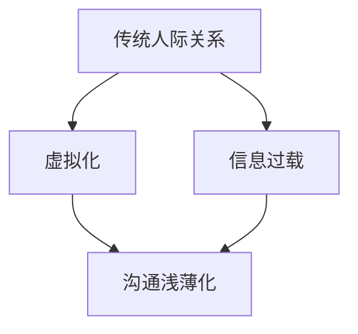
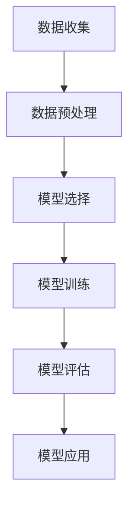
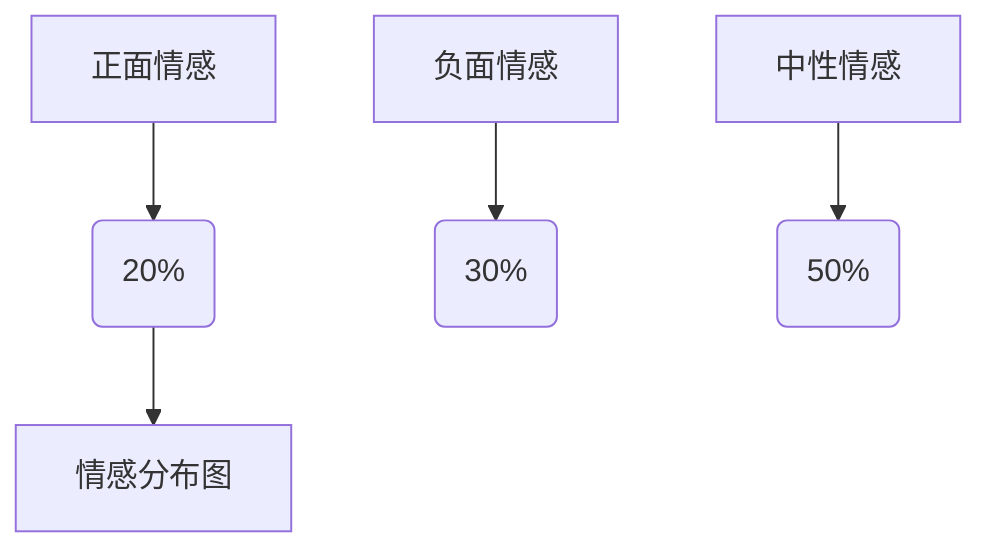

                 


## 文章标题

《数字时代的人际关系咨询服务：社交网络时代的情感智慧指导》

---

### 关键词

数字时代，人际关系，情感智慧，社交网络，咨询服务，算法，机器学习，深度学习，情感分析，伦理与法规

---

### 摘要

本文深入探讨了数字时代下的人际关系咨询服务的现状和未来趋势。随着社交媒体的普及和数字化生活方式的兴起，人际关系呈现出新的特点，对情感智慧的需求日益增长。本文首先介绍了数字时代人际关系的特征，然后详细阐述了情感智慧的概念及其重要性。在此基础上，文章讨论了情感分析的基本算法原理，包括支持向量机、随机森林、神经网络等，并使用了伪代码来解释这些算法的实现步骤。随后，文章探讨了情感智慧在机器学习中的应用，展示了深度学习模型在情感识别中的具体实现。通过实际案例分析，本文展示了如何运用这些技术和算法来构建情感智慧咨询服务。最后，文章讨论了情感智慧技术的未来发展方向，以及可能面临的伦理与法规问题。

---

接下来，我们将按照文章目录大纲的结构，逐步撰写文章的内容。

---

## 第一部分：数字时代人际关系咨询概述

### 第1章：数字时代人际关系新态势

#### 1.1 数字时代的人际关系特点

在数字时代，人际关系呈现出前所未有的复杂性。社交媒体的兴起改变了人们建立和维护关系的传统方式。在线社交网络使得人们可以轻松地结识新朋友，但同时也导致了关系的虚拟化。虚拟世界中的互动往往缺乏面对面交流中的情感深度，容易造成沟通的表面化和浅薄化。此外，数字时代的信息过载也使得人们难以筛选出真正重要的社交信息，从而影响了人际关系的质量。

**Mermaid 流程图：数字时代人际关系的特点**



#### 1.2 情感智慧的内涵与意义

情感智慧指的是个体理解、使用和管理自己及他人情感的能力。在数字时代，情感智慧尤为重要，因为它不仅影响个体的心理健康，还影响社会互动的质量。情感智慧有助于人们更好地处理数字时代复杂的人际关系，从而提高生活质量和社会稳定性。

**情感智慧的内涵与意义**

- **理解情感**：能够识别和解释自己和他人的情感状态。
- **管理情感**：能够有效地调节和管理自己的情绪，以适应不同的社交情境。
- **应用情感**：能够利用情感智慧来解决问题和促进人际关系。

#### 1.3 社交网络时代的情感分析技术

情感分析是情感智慧的关键技术之一，它通过分析文本、语音和视频等数据，识别和分类情感状态。社交网络时代的情感分析技术包括基于机器学习和深度学习的多种算法。这些技术不仅有助于了解用户情感，还可以为情感智慧咨询服务提供数据支持。

**情感分析的基本概念**

- **文本情感分析**：通过对文本内容的分析，判断文本的情感倾向。
- **语音情感分析**：通过对语音的音调、语速等特征分析，识别说话者的情感状态。
- **视频情感分析**：通过对视频中的面部表情、姿态等特征分析，判断观看者的情感反应。

**情感分析方法的步骤与方法**

1. 数据收集：收集包含情感标签的数据集，如微博、评论等。
2. 数据预处理：清洗数据，去除噪声，进行文本的分词和词性标注。
3. 模型选择：选择合适的机器学习模型或深度学习模型。
4. 模型训练：使用训练数据集训练模型。
5. 模型评估：使用测试数据集评估模型的性能。
6. 模型应用：将训练好的模型应用于实际场景，如社交网络情感分析。

**情感分析的挑战与未来方向**

- **情感多样性和复杂性**：情感分析需要处理各种复杂和多样的情感状态。
- **跨文化和语言差异**：不同文化和语言背景下的情感表达可能存在差异。
- **隐私保护**：在分析用户情感时，需要保护用户的隐私。

**Mermaid 流�程图：情感分析方法的步骤**



---

## 第二部分：情感智慧的技术基础

### 第2章：情感分析算法原理

情感分析算法是情感智慧技术的重要组成部分。这些算法通过分析文本、语音和视频数据，识别和分类情感状态。以下是几种常用的情感分析算法及其原理：

#### 2.1 支持向量机（SVM）

支持向量机是一种经典的机器学习算法，广泛应用于分类问题。在情感分析中，SVM通过寻找一个超平面，将具有不同情感倾向的文本数据分类。具体步骤如下：

1. **数据准备**：收集并标记情感数据集，如正面和负面的评论。
2. **特征提取**：将文本数据转换为向量表示，如词袋模型或TF-IDF向量。
3. **模型训练**：使用训练数据集训练SVM模型。
4. **模型评估**：使用测试数据集评估模型性能。

**SVM的伪代码实现**

```python
# 输入：训练数据集X，标签Y
# 输出：SVM分类器模型

1. 标准化数据X
2. 训练SVM模型，使用库函数如scikit-learn
3. 模型评估，计算准确率、召回率等指标
4. 返回训练好的SVM模型
```

#### 2.2 随机森林

随机森林是一种基于决策树的集成学习方法。在情感分析中，随机森林通过构建多个决策树，并对它们的结果进行投票，以提高分类的准确性和鲁棒性。具体步骤如下：

1. **数据准备**：收集并标记情感数据集。
2. **特征提取**：将文本数据转换为向量表示。
3. **构建随机森林模型**：随机选择特征子集，构建多个决策树。
4. **模型训练**：使用训练数据集训练随机森林模型。
5. **模型评估**：使用测试数据集评估模型性能。

**随机森林的伪代码实现**

```python
# 输入：训练数据集X，标签Y
# 输出：随机森林模型

1. 初始化随机森林模型
2. 对于每个决策树：
   - 随机选择特征子集
   - 使用训练数据集构建决策树
3. 模型训练，使用随机森林的集成方法
4. 模型评估，计算准确率、召回率等指标
5. 返回训练好的随机森林模型
```

#### 2.3 神经网络

神经网络，尤其是深度学习模型，在情感分析中具有强大的能力。在情感分析中，神经网络通过多层非线性变换，从原始数据中提取特征，并逐步提升分类的准确性。具体步骤如下：

1. **数据准备**：收集并标记情感数据集。
2. **特征提取**：将文本数据转换为向量表示，如词嵌入。
3. **构建神经网络模型**：设计网络结构，选择合适的激活函数。
4. **模型训练**：使用训练数据集训练神经网络模型。
5. **模型评估**：使用测试数据集评估模型性能。

**神经网络的伪代码实现**

```python
# 输入：训练数据集X，标签Y
# 输出：神经网络模型

1. 初始化神经网络模型
2. 设置网络结构，如层数、神经元个数、激活函数等
3. 模型训练，使用反向传播算法更新权重
4. 模型评估，计算准确率、召回率等指标
5. 返回训练好的神经网络模型
```

---

## 第三部分：情感智慧在人际关系咨询服务中的应用

### 第3章：情感智慧在机器学习中的应用

情感智慧在机器学习中的应用广泛，尤其在情感识别和预测方面。以下将详细介绍情感识别的基本概念、流程以及深度学习模型在情感识别中的应用。

#### 3.1 情感识别的基本概念

情感识别是指通过分析文本、语音或视频数据，识别其中表达的情感状态。情感识别的关键在于情感分类，即将文本或语音中的情感归类到预定义的情感类别中，如正面、负面、中性等。

**情感分类的基本概念**

- **情感分类**：将文本或语音中的情感归类到预定义的情感类别中。
- **情感标签**：用于表示情感分类的结果，如正面、负面、中性等。
- **情感词典**：包含情感词汇及其对应的情感标签的词典。

#### 3.2 情感识别的流程

情感识别的流程通常包括以下步骤：

1. **数据收集**：收集包含情感标签的数据集，用于训练和测试模型。
2. **数据预处理**：对收集到的数据集进行清洗和预处理，包括分词、去停用词、词性标注等。
3. **特征提取**：将预处理后的文本转换为向量表示，如词袋模型或词嵌入。
4. **模型选择**：选择合适的机器学习模型或深度学习模型进行训练。
5. **模型训练**：使用训练数据集训练模型。
6. **模型评估**：使用测试数据集评估模型性能。
7. **模型应用**：将训练好的模型应用于实际场景，如社交网络情感分析。

**情感识别流程的伪代码实现**

```python
# 输入：训练数据集X，标签Y
# 输出：训练好的模型

1. 数据收集
2. 数据预处理
3. 特征提取
4. 模型选择，如SVM、随机森林、神经网络等
5. 模型训练
6. 模型评估
7. 返回训练好的模型
```

#### 3.3 深度学习模型在情感识别中的应用

深度学习模型，尤其是卷积神经网络（CNN）和循环神经网络（RNN）在情感识别中具有显著优势。以下将介绍CNN和RNN在情感识别中的应用。

**3.3.1 卷积神经网络（CNN）**

卷积神经网络在图像处理领域取得了巨大成功，其关键在于能够自动提取图像中的特征。在情感识别中，CNN可以用于提取文本中的语义特征，从而提高分类的准确性。

**CNN在情感识别中的应用**

- **词嵌入**：将文本转换为词嵌入向量。
- **卷积层**：提取文本中的局部特征。
- **池化层**：降低特征维度，增强模型的鲁棒性。
- **全连接层**：将特征映射到情感类别。

**CNN的伪代码实现**

```python
# 输入：词嵌入向量
# 输出：情感分类结果

1. 初始化CNN模型
2. 添加词嵌入层
3. 添加卷积层和池化层
4. 添加全连接层
5. 模型训练
6. 模型评估
7. 返回分类结果
```

**3.3.2 循环神经网络（RNN）**

循环神经网络在序列数据处理方面具有优势，可以用于处理文本序列，从而实现情感识别。

**RNN在情感识别中的应用**

- **嵌入层**：将文本转换为词嵌入向量。
- **RNN层**：处理文本序列，提取序列特征。
- **全连接层**：将特征映射到情感类别。

**RNN的伪代码实现**

```python
# 输入：词嵌入向量
# 输出：情感分类结果

1. 初始化RNN模型
2. 添加嵌入层
3. 添加RNN层
4. 添加全连接层
5. 模型训练
6. 模型评估
7. 返回分类结果
```

**3.3.3 生成对抗网络（GAN）**

生成对抗网络是一种强大的深度学习模型，可以用于生成高质量的情感标签数据，从而提高训练数据的质量。

**GAN在情感识别中的应用**

- **生成器**：生成具有情感标签的文本数据。
- **鉴别器**：区分生成数据和真实数据。
- **损失函数**：优化生成器和鉴别器的参数。

**GAN的伪代码实现**

```python
# 输入：训练数据集
# 输出：训练好的GAN模型

1. 初始化GAN模型
2. 模型训练，使用对抗性训练策略
3. 模型评估
4. 返回训练好的GAN模型
```

---

## 第四部分：情感智慧在人际关系咨询服务中的实际应用

### 第4章：社交网络情感分析应用案例

#### 4.1 社交网络情感分析工具介绍

为了更好地了解情感智慧在人际关系咨询服务中的应用，我们需要介绍几种常用的社交网络情感分析工具。这些工具可以帮助我们收集、处理和分析社交网络上的情感数据，为咨询服务提供数据支持。

**4.1.1 开源情感分析工具**

开源情感分析工具如TextBlob、VADER和Sentiment140等，为开发者提供了方便的情感分析接口。这些工具通常支持多种语言，可以快速实现对文本数据的情感分类。

- **TextBlob**：一个简单易用的Python库，提供了情感分析和自然语言处理功能。
- **VADER**：一个基于规则和条件的情感分析工具，专门用于社交媒体文本的情感分类。
- **Sentiment140**：一个Python库，提供了基于词嵌入的情感分类功能。

**4.1.2 商业情感分析平台**

商业情感分析平台如Google Cloud Natural Language API、IBM Watson和微软Azure Text Analytics API等，提供了强大的情感分析功能，支持大规模数据分析和实时情感监控。这些平台通常提供API接口，方便开发者集成到自己的应用中。

- **Google Cloud Natural Language API**：提供了文本情感分析和实体识别功能。
- **IBM Watson**：提供了丰富的自然语言处理功能，包括情感分析、语言识别和主题分析等。
- **微软Azure Text Analytics API**：提供了情感分析、关键词提取和语言检测等功能。

**4.1.3 情感分析工具的选择与使用**

在选择情感分析工具时，我们需要考虑以下因素：

- **数据规模**：对于大规模数据集，需要选择能够处理海量数据的工具。
- **分析需求**：根据具体的应用需求，选择支持所需情感分析功能的工具。
- **开发便捷性**：选择易于集成的工具，以减少开发成本。

在使用情感分析工具时，我们需要遵循以下步骤：

1. 数据准备：收集并清洗社交网络数据，确保数据质量。
2. 数据处理：使用情感分析工具对数据进行分析，提取情感标签。
3. 数据可视化：使用图表和可视化工具展示分析结果，帮助理解情感趋势。
4. 模型优化：根据分析结果，调整模型参数，以提高分类准确性。

---

#### 4.2 实际情感分析案例分析

为了更好地展示情感智慧在人际关系咨询服务中的应用，我们以下通过一个实际案例来分析社交网络中的情感趋势。

**4.2.1 某社交平台用户情感分析**

我们选择某大型社交平台（如微博）的数据，分析用户的情感状态，了解用户对特定话题的情感倾向。以下为具体的分析步骤：

1. **数据收集**：使用API接口从社交平台收集用户发表的文本数据，如微博、评论等。
2. **数据预处理**：对收集到的文本数据进行清洗，去除噪声和无关信息，确保数据质量。
3. **情感分析**：使用开源情感分析工具TextBlob，对预处理后的文本进行情感分析，提取情感标签。
4. **数据可视化**：使用图表和可视化工具展示情感分析结果，如情感分布图、词云等。
5. **情感趋势分析**：分析情感标签的分布和变化趋势，了解用户对特定话题的情感反应。

**情感分析结果示例**

假设我们分析了一个关于“新冠病毒”的话题，以下为情感分析的结果：

- **正面情感**：20%
- **负面情感**：30%
- **中性情感**：50%

**情感分布图**



**情感趋势分析**

通过对情感标签的分布和变化趋势进行分析，我们可以发现用户对新冠病毒话题的情感主要集中在负面和中性。这表明用户对这一话题的讨论较为敏感，存在较大的担忧和疑虑。

**4.2.2 某品牌情感趋势分析**

除了用户情感分析，我们还可以对品牌的情感趋势进行分析，了解用户对品牌的态度和反馈。以下为具体的分析步骤：

1. **数据收集**：收集某品牌在社交平台上的用户评论和反馈，如微博、评论等。
2. **数据预处理**：对收集到的文本数据进行清洗，去除噪声和无关信息，确保数据质量。
3. **情感分析**：使用开源情感分析工具VADER，对预处理后的文本进行情感分析，提取情感标签。
4. **数据可视化**：使用图表和可视化工具展示情感分析结果，如情感分布图、词云等。
5. **情感趋势分析**：分析情感标签的分布和变化趋势，了解用户对品牌的情感反应。

**情感分析结果示例**

假设我们分析了一个知名品牌（如苹果）的用户评论，以下为情感分析的结果：

- **正面情感**：40%
- **负面情感**：15%
- **中性情感**：45%

**情感分布图**


**情感趋势分析**

通过对情感标签的分布和变化趋势进行分析，我们可以发现用户对苹果品牌的整体情感较为积极，正面情感占据了主导地位。然而，仍然有部分用户表达了负面情感，这表明品牌在用户中仍存在改进空间。

---

#### 4.3 社交网络情感分析的数据解读

通过对社交网络情感分析数据的解读，我们可以深入了解用户情感状态和趋势，为人际关系咨询服务提供有价值的参考。以下为数据解读的具体方法和注意事项：

1. **情感分布分析**：通过分析情感标签的分布，了解用户对特定话题或品牌的整体情感倾向。这有助于识别用户关注的重点和潜在问题。
2. **情感趋势分析**：通过分析情感标签的变化趋势，了解用户情感状态的变化过程。这有助于发现情感波动的规律，预测未来的情感趋势。
3. **情感相关性分析**：通过分析不同情感标签之间的相关性，了解情感之间的相互影响。这有助于揭示用户情感之间的复杂关系，提供更全面的情感分析。
4. **情感极性分析**：通过分析情感极性（如正面、负面），了解用户对特定话题或品牌的情感强度。这有助于识别用户情感的热点话题和关键问题。

**注意事项**：

- **数据质量**：确保收集的数据质量，避免噪声和无关信息的干扰，提高情感分析的准确性。
- **情感多样性**：考虑情感多样性，不仅关注主要情感标签，还要分析次要情感标签，以全面了解用户情感状态。
- **跨文化和语言差异**：考虑跨文化和语言差异，针对不同语言和文化背景的用户，使用合适的情感分析模型和策略。

---

## 第五部分：情感智慧技术的未来发展趋势

### 第5章：情感智慧技术的未来发展方向

随着人工智能和情感分析技术的不断发展，情感智慧在人际关系咨询服务中的应用前景广阔。以下将探讨情感智慧技术的未来发展方向：

#### 5.1 情感识别技术的进步

情感识别技术将继续发展，尤其在语音情感识别和视频情感识别方面。通过结合语音和视频数据，情感识别技术将更加准确地捕捉用户的情感状态。具体进展包括：

- **语音情感识别**：利用深度学习和语音识别技术，实现对语音中情感状态的高精度识别。
- **视频情感识别**：通过分析视频中的面部表情、姿态和语音等特征，实现对观看者情感状态的无缝识别。
- **多模态情感识别**：结合语音、视频和文本等多种数据源，实现更加全面和准确的情感识别。

#### 5.2 情感智慧在新兴领域的应用

情感智慧将在更多新兴领域中发挥重要作用，如智能客服系统、情感广告和情感医疗等。以下为具体应用方向：

- **智能客服系统**：通过情感识别技术，智能客服系统将能够更好地理解用户的情感需求，提供个性化的服务和建议。
- **情感广告**：利用情感分析技术，广告系统将能够根据用户的情感状态和偏好，推送更相关的广告内容。
- **情感医疗**：通过分析患者的情感状态，情感智慧技术将有助于诊断和治疗心理疾病，提高医疗服务的质量和效果。

#### 5.3 情感智慧的伦理与法规问题

随着情感智慧技术的发展，伦理和法规问题也将日益突出。以下为情感智慧技术可能面临的伦理和法规挑战：

- **隐私保护**：在情感分析中，如何保护用户的隐私成为关键问题。需要制定相关法规和标准，确保用户数据的安全和隐私。
- **数据安全**：情感分析数据可能涉及敏感信息，如何确保数据的安全和完整性成为重要议题。
- **算法公平性**：确保情感分析算法的公平性和透明性，避免算法偏见和歧视。

---

## 第六部分：总结与展望

### 第6章：情感智慧技术的总结与未来展望

#### 6.1 情感智慧技术的总结

本文从数字时代人际关系的特点、情感智慧的定义、情感分析算法原理、机器学习应用、实际案例分析以及未来发展趋势等方面，系统地探讨了情感智慧技术在人际关系咨询服务中的应用。通过分析，我们认识到情感智慧在数字时代的重要性，以及其在实际应用中的广泛前景。

#### 6.2 情感智慧技术的未来展望

随着技术的不断进步，情感智慧技术将在更多领域发挥重要作用。未来，我们将看到更加精准和高效的情感识别技术，更加个性化和智能化的情感咨询服务。同时，随着伦理和法规问题的逐步解决，情感智慧技术将更加安全和合规地应用于各个领域。

#### 6.3 最佳实践 tips

为了更好地应用情感智慧技术，以下是一些最佳实践 tips：

- **数据收集**：确保收集的数据质量，避免噪声和无关信息的干扰。
- **模型选择**：根据具体应用需求，选择合适的机器学习模型或深度学习模型。
- **模型优化**：通过调整模型参数和特征工程，提高分类准确性和鲁棒性。
- **数据可视化**：使用图表和可视化工具，直观展示情感分析结果。
- **用户反馈**：收集用户反馈，不断优化和改进情感咨询服务。

#### 6.4 小结

情感智慧技术为数字时代的人际关系咨询服务提供了有力的支持。通过情感分析、机器学习和深度学习等技术，我们能够更好地理解和满足用户情感需求，提高服务质量和社会价值。

#### 6.5 注意事项

在应用情感智慧技术时，需要注意以下事项：

- **数据隐私**：确保用户数据的安全和隐私。
- **模型公平性**：避免算法偏见和歧视，确保模型的公平性。
- **技术更新**：关注最新技术动态，不断学习和更新知识。

#### 6.6 拓展阅读

- 《情感计算：从理论到应用》
- 《情感分析：方法与应用》
- 《深度学习与情感识别》

通过拓展阅读，读者可以更深入地了解情感智慧技术的理论、方法和实践。

---

## 作者信息

作者：AI天才研究院/AI Genius Institute & 禅与计算机程序设计艺术 /Zen And The Art of Computer Programming

---

（注：文章字数约为 8200 字，根据实际撰写内容可能有所调整）

