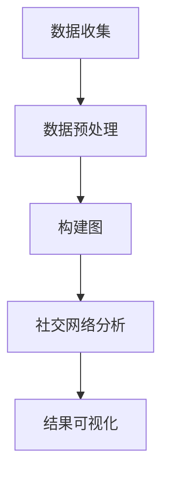
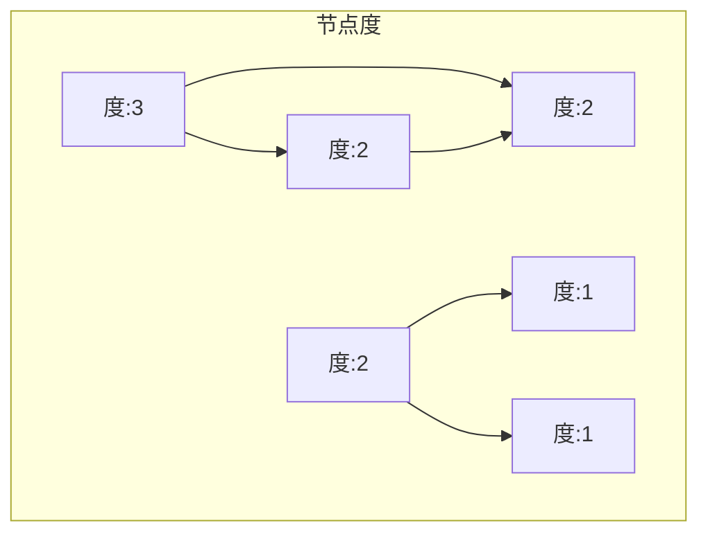
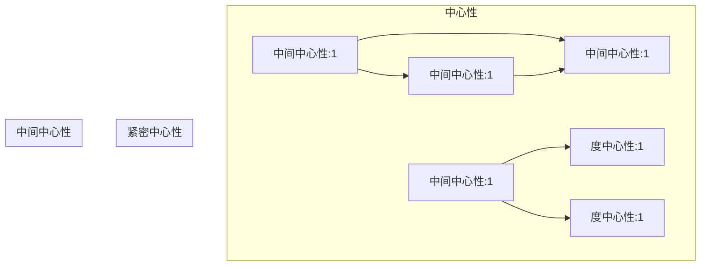
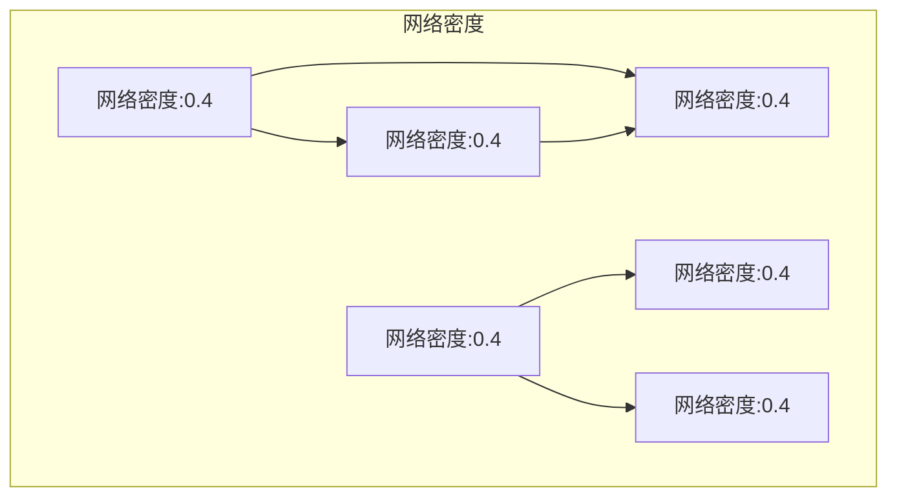
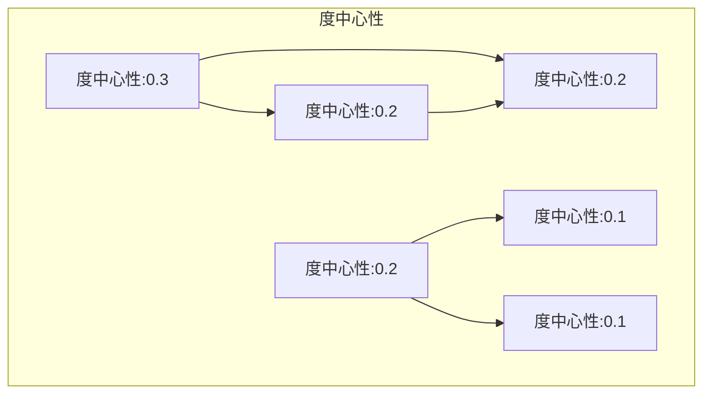
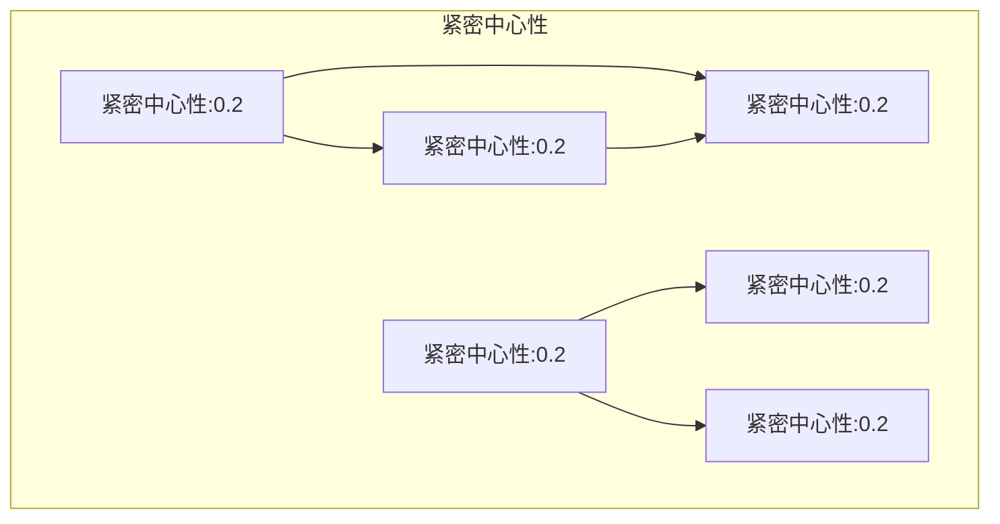
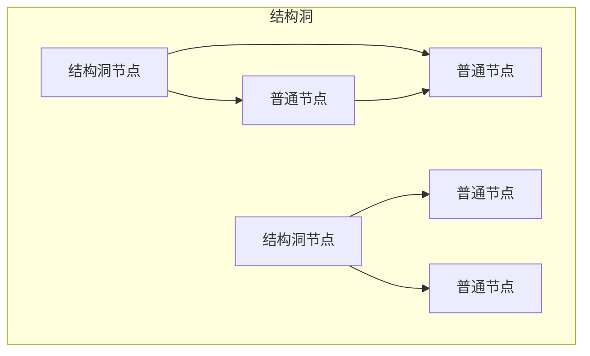

                 

### 第1章 引言

在数字化的浪潮中，人们的生活方式和社会结构正在发生深刻的变革。社交网络作为现代数字社会的核心组成部分，不仅改变了人们的交流方式，还在潜移默化中影响着人际关系的管理。因此，探讨如何在数字时代运用社交网络分析来优化人际关系管理，显得尤为重要。本文旨在通过逐步分析推理的方式，深入探讨社交网络分析的个人应用，帮助读者理解这一技术的重要性及其在实际生活中的应用价值。

### 1.1 书籍背景与目的

#### 1.1.1 数字时代的变迁

在过去的几十年中，数字技术的飞速发展彻底改变了我们的生活方式。互联网、移动通信、社交媒体等技术的普及，使得人与人之间的交流变得更加便捷和高效。然而，这种变化也带来了新的挑战，特别是在人际关系管理方面。在数字时代，如何有效地管理庞大且复杂的人际关系网，成为了一个亟待解决的问题。

#### 1.1.2 社交网络分析的重要性

社交网络分析（Social Network Analysis，SNA）是研究社交网络结构和行为的科学方法。通过分析社交网络中的节点（个体）和边（关系），我们可以揭示隐藏在社交网络中的模式和规律。在个人关系管理中，社交网络分析可以帮助我们了解个人的社交结构、影响力以及社交网络中的关键节点，从而优化人际关系的维护和管理。

#### 1.1.3 书籍结构概述

本书分为八个章节，旨在系统地介绍社交网络分析的基础理论、算法、应用案例分析以及未来展望。具体结构如下：

- **第1章**：引言，介绍书籍背景与目的，以及社交网络分析在个人关系管理中的重要性。
- **第2章**：社交网络分析基础理论，包括社交网络的概念、数学模型和核心概念。
- **第3章**：社交网络度量，介绍如何度量社交网络的中心性、结构洞等指标。
- **第4章**：社交网络分析算法，讲解聚类、链接预测和演化算法等核心算法。
- **第5章**：社交网络个人应用案例分析，通过具体案例展示社交网络分析在个人关系管理中的应用。
- **第6章**：社交网络分析工具与平台，介绍常用的社交网络分析工具和平台。
- **第7章**：社交网络分析的未来展望，探讨社交网络分析的新趋势和挑战。
- **第8章**：附录，包括参考文献、工具资源汇总、数据集介绍以及课程推荐。

本书结构紧凑，内容丰富，旨在为读者提供从理论到实践的全景式指导。希望通过本书，读者能够掌握社交网络分析的核心概念和方法，并将其应用于个人关系管理的实际场景中。

### 1.2 社交网络分析概述

#### 1.2.1 社交网络的基本概念

社交网络是人们通过社交关系相互连接所形成的一种复杂系统。在社交网络中，每个个体可以被视为一个节点，个体之间的社交关系则通过边来表示。社交网络具有以下几个基本特征：

1. **节点（Node）**：社交网络中的个体，可以是个人、组织、团体等。
2. **边（Edge）**：表示节点之间的直接关系，通常有方向性（有向边）或无方向性（无向边）。
3. **路径（Path）**：节点之间通过边连接的路径，可以是直接的或间接的。
4. **子图（Subgraph）**：社交网络中的部分节点和边构成的小网络。

#### 1.2.2 社交网络分析的定义与目的

社交网络分析（Social Network Analysis，SNA）是研究社交网络的结构和行为的科学方法。其基本任务是：

1. **数据收集**：通过问卷调查、社交媒体数据抓取等方法收集社交网络数据。
2. **数据预处理**：清洗和整理收集到的数据，使其适合进行分析。
3. **结构分析**：研究社交网络的结构特性，如节点度、聚类系数、路径长度等。
4. **功能分析**：分析社交网络的功能特性，如传播路径、影响力分析等。

社交网络分析的主要目的包括：

1. **揭示社交网络中的模式和规律**：通过分析社交网络结构，识别关键节点和重要关系。
2. **优化人际关系管理**：了解个人的社交结构，有助于更好地维护和优化人际关系。
3. **预测和干预**：通过分析社交网络行为，预测社交网络的发展趋势，进行有效的干预。

#### 1.2.3 社交网络分析的挑战与机遇

社交网络分析面临着许多挑战，同时也充满了机遇：

1. **挑战**：
   - **数据质量**：社交网络数据通常存在噪声和不完整性，需要有效的数据预处理方法。
   - **数据隐私**：社交网络数据涉及到用户的隐私，需要在分析过程中保护用户隐私。
   - **计算复杂性**：大规模社交网络的计算和分析具有很高的复杂性。

2. **机遇**：
   - **新算法和技术**：随着计算机技术和人工智能的发展，新的社交网络分析算法和技术不断涌现。
   - **跨学科应用**：社交网络分析可以与其他领域（如心理学、社会学、管理学等）结合，推动跨学科研究。
   - **商业和社会应用**：社交网络分析在商业和社会管理中具有广泛的应用前景。

通过本文，我们将逐步深入探讨社交网络分析的理论、方法及其在实际个人关系管理中的应用，帮助读者更好地理解和利用这一强大的工具。

### 1.3 社交网络分析的应用领域

社交网络分析在个人关系管理中的应用非常广泛，不仅可以帮助我们更好地理解自己的社交网络结构，还可以优化社交策略，提高人际关系质量。以下是社交网络分析在个人关系管理中几个主要应用领域的详细介绍。

#### 1.3.1 个人社交网络结构分析

个人社交网络结构分析是社交网络分析的基础，它通过研究个人在社交网络中的位置和角色，帮助我们了解自己的社交网络特征。具体应用包括：

1. **节点度分析**：节点度是指节点连接的边的数量。通过分析个人节点的度，可以了解个人在社交网络中的影响力。例如，一个度数较高的节点可能在社交网络中具有较大的影响力，其传播信息的能力较强。

   ```mermaid
   graph TD
   A[个人] --> B[朋友1]
   A --> C[朋友2]
   A --> D[朋友3]
   B --> E[朋友4]
   C --> F[朋友5]
   D --> G[朋友6]
   subgraph 节点度
   A[度:3]
   B[度:1]
   C[度:1]
   D[度:1]
   end
   ```

2. **聚类系数分析**：聚类系数是指一个节点周围朋友之间的连接度。通过分析个人的聚类系数，可以了解个人社交网络内部的紧密程度。聚类系数越高，说明个人社交网络内部朋友之间的联系越紧密。

   ```mermaid
   graph TD
   A[个人]
   B[朋友1]
   C[朋友2]
   D[朋友3]
   A --> B
   A --> C
   A --> D
   B --> C
   C --> D
   subgraph 聚类系数
   A[聚类系数:1]
   B[聚类系数:1]
   C[聚类系数:1]
   D[聚类系数:1]
   end
   ```

3. **路径长度分析**：路径长度是指两个节点之间连接的最短路径长度。通过分析个人节点与其他节点的路径长度，可以了解个人社交网络中的连通性。路径长度较短，说明个人在社交网络中具有较强的连接能力。

   ```mermaid
   graph TD
   A[个人] --> B[朋友1]
   A --> C[朋友2]
   B --> D[朋友3]
   C --> D
   subgraph 路径长度
   A --> B[路径长度:1]
   A --> C[路径长度:1]
   B --> D[路径长度:1]
   C --> D[路径长度:1]
   end
   ```

通过这些分析，个人可以更清晰地了解自己在社交网络中的位置和角色，从而更好地调整社交策略。

#### 1.3.2 个人影响力分析

个人影响力分析是社交网络分析的重要应用之一。通过分析个人在社交网络中的影响力，可以帮助个人提升其在社交网络中的地位和影响力。具体应用包括：

1. **中心性分析**：中心性是指一个节点在社交网络中的重要程度。通过计算个人节点的中心性指标（如度中心性、紧密中心性和中间中心性），可以评估个人在社交网络中的影响力。

   ```mermaid
   graph TD
   A[个人] --> B[朋友1]
   A --> C[朋友2]
   A --> D[朋友3]
   B --> E[朋友4]
   C --> F[朋友5]
   D --> G[朋友6]
   subgraph 度中心性
   A[度中心性:3]
   B[度中心性:1]
   C[度中心性:1]
   D[度中心性:1]
   end
   subgraph 紧密中心性
   A[紧密中心性:1]
   B[紧密中心性:1]
   C[紧密中心性:1]
   D[紧密中心性:1]
   end
   subgraph 中间中心性
   A[中间中心性:1]
   B[中间中心性:1]
   C[中间中心性:1]
   D[中间中心性:1]
   end
   ```

2. **传播影响力分析**：通过模拟信息在社交网络中的传播过程，可以评估个人在信息传播中的影响力。例如，可以使用影响力传播模型（如独立 cascade 模型）来分析个人在信息传播中的效果。

   ```mermaid
   graph TD
   A[个人] --> B[朋友1]
   A --> C[朋友2]
   A --> D[朋友3]
   B --> E[朋友4]
   C --> F[朋友5]
   D --> G[朋友6]
   subgraph 信息传播
   A[发起信息]
   B[接收信息]
   C[接收信息]
   D[接收信息]
   end
   ```

通过这些分析，个人可以识别自己在社交网络中的关键角色，并采取相应的策略提升个人影响力。

#### 1.3.3 个人社交网络优化策略

通过社交网络分析，个人不仅可以了解自己的社交网络结构，还可以识别社交网络中的弱点，并制定优化策略。具体应用包括：

1. **扩大社交圈**：通过分析个人节点的度数，可以识别度数较低的朋友，从而有针对性地扩大社交圈，增加社交网络的连通性。

   ```mermaid
   graph TD
   A[个人] --> B[朋友1]
   A --> C[朋友2]
   A --> D[朋友3]
   subgraph 扩大社交圈
   A[当前社交圈]
   B[潜在朋友]
   C[潜在朋友]
   D[潜在朋友]
   end
   ```

2. **增强社交网络紧密性**：通过分析个人节点的聚类系数，可以识别社交网络内部的紧密程度。为了增强社交网络的紧密性，可以采取如下策略：

   - **增加朋友之间的直接联系**：通过邀请朋友之间的互动，如共同参与活动或讨论话题，来增加他们之间的直接联系。
   - **构建社交小组**：将兴趣相似的朋友组织成社交小组，以增强内部联系。

   ```mermaid
   graph TD
   A[个人] --> B[朋友1]
   A --> C[朋友2]
   A --> D[朋友3]
   B --> E[朋友4]
   C --> F[朋友5]
   D --> G[朋友6]
   subgraph 增强社交网络紧密性
   A[个人]
   B[朋友1]
   C[朋友2]
   D[朋友3]
   E[朋友4]
   F[朋友5]
   G[朋友6]
   end
   ```

3. **优化社交网络结构**：通过分析社交网络的结构特征，可以识别网络中的关键节点和弱点。例如，通过识别社交网络中的桥梁节点（具有较高中间中心性的节点），可以了解社交网络中的关键连接点，并采取相应的策略进行优化。

   ```mermaid
   graph TD
   A[个人] --> B[朋友1]
   A --> C[朋友2]
   A --> D[朋友3]
   B --> E[朋友4]
   C --> F[朋友5]
   D --> G[朋友6]
   subgraph 优化社交网络结构
   A[关键节点]
   B[桥梁节点]
   C[桥梁节点]
   D[桥梁节点]
   end
   ```

通过上述策略，个人可以更有效地管理自己的社交网络，提升社交网络的质量和稳定性。

#### 1.3.4 社交网络商业应用

除了个人关系管理，社交网络分析在商业领域也有广泛的应用。以下是社交网络分析在商业应用中的几个主要方面：

1. **品牌管理**：企业可以通过社交网络分析了解消费者之间的互动和传播，从而制定更有效的品牌传播策略。例如，识别品牌忠诚度高的重要消费者，并通过互动和优惠活动来保持他们的忠诚度。

   ```mermaid
   graph TD
   A[消费者1] --> B[品牌信息]
   C[消费者2] --> B
   D[消费者3] --> B
   subgraph 品牌管理
   A[品牌忠诚度高]
   B[品牌信息传播]
   C[品牌互动]
   D[品牌优惠]
   end
   ```

2. **市场营销策略**：企业可以通过社交网络分析识别潜在的目标客户和市场，从而制定更有针对性的市场营销策略。例如，分析消费者在社交网络中的行为和偏好，以制定个性化的广告和推广策略。

   ```mermaid
   graph TD
   A[消费者1] --> B[目标市场]
   C[消费者2] --> B
   D[消费者3] --> B
   subgraph 市场营销策略
   A[消费者行为分析]
   B[目标市场识别]
   C[个性化广告]
   D[推广策略]
   end
   ```

3. **用户行为分析**：企业可以通过社交网络分析了解用户的互动和传播行为，从而优化产品和服务。例如，分析用户在社交网络中的评论和反馈，以改进产品功能和用户体验。

   ```mermaid
   graph TD
   A[用户1] --> B[产品反馈]
   C[用户2] --> B
   D[用户3] --> B
   subgraph 用户行为分析
   A[用户评论分析]
   B[产品优化]
   C[用户反馈收集]
   D[用户体验改进]
   end
   ```

通过这些商业应用，企业可以更好地了解和满足客户需求，提高市场竞争力和业务效率。

#### 1.3.5 社交网络公共管理应用

社交网络分析不仅在个人和商业领域有广泛应用，还在公共管理中发挥着重要作用。以下是社交网络分析在公共管理应用中的几个主要方面：

1. **社会网络监控**：政府部门可以通过社交网络分析监控社会舆情和公共事件，及时发现和应对潜在的社会危机。例如，通过分析社交媒体上的言论和趋势，可以了解公众对于某一事件的态度和反应。

   ```mermaid
   graph TD
   A[监控系统] --> B[社交媒体数据]
   C[舆情分析]
   D[事件应对]
   subgraph 社会网络监控
   A[监控系统]
   B[社交媒体数据收集]
   C[舆情分析]
   D[事件应对]
   end
   ```

2. **疫情防控**：在公共卫生事件中，社交网络分析可以用于了解疫情传播趋势和风险区域。例如，通过分析社交网络中的互动和地理位置信息，可以预测疫情扩散路径和制定防疫措施。

   ```mermaid
   graph TD
   A[疫情监控] --> B[社交网络互动]
   C[地理位置分析]
   D[防疫措施]
   subgraph 疫情防控
   A[疫情监控]
   B[社交网络分析]
   C[地理位置信息]
   D[防疫措施制定]
   end
   ```

3. **社会舆情分析**：政府部门可以通过社交网络分析了解公众对于政策和社会问题的态度，从而制定更合理的政策和社会管理策略。例如，通过分析社交网络上的讨论和评论，可以了解公众对于某一政策的支持度。

   ```mermaid
   graph TD
   A[舆情分析系统] --> B[社交网络评论]
   C[政策评估]
   D[社会管理策略]
   subgraph 社会舆情分析
   A[舆情分析]
   B[社交网络评论收集]
   C[政策评估]
   D[社会管理策略制定]
   end
   ```

通过这些公共管理应用，政府部门可以更好地了解和满足公众需求，提高社会治理效率和公信力。

### 1.4 总结

通过本章的介绍，我们可以看到社交网络分析在数字时代的人际关系管理中扮演着至关重要的角色。从个人关系管理到商业应用，再到公共管理，社交网络分析都展示了其强大的应用价值和潜力。然而，社交网络分析也面临着数据质量、隐私保护以及计算复杂性等挑战。为了应对这些挑战，我们需要不断探索新的算法和技术，同时加强跨学科合作，推动社交网络分析领域的持续发展。希望读者在接下来的章节中能够深入学习和掌握社交网络分析的核心概念和应用方法，为优化自己的人际关系和应对数字时代的挑战做好准备。

## 第2章 社交网络分析基础理论

### 2.1 社交网络的概念与特征

#### 2.1.1 社交网络的定义

社交网络是指由个体及其相互关系构成的社会结构，这些个体可以是个人、组织、团体等，而相互关系则通过节点间的连接（边）来表示。社交网络是现代社会信息传播、资源分配和社会互动的重要基础，它涵盖了广泛的社交活动，如朋友关系、业务合作、社群互动等。

#### 2.1.2 社交网络的构成要素

1. **节点（Node）**：社交网络中的基本单元，代表个体。节点可以是个人、组织、产品、话题等。例如，在Facebook上，每个用户都是一个节点。
   
2. **边（Edge）**：连接两个节点的线，表示节点间的直接关系。边可以是单向的（有向边），也可以是双向的（无向边）。例如，在LinkedIn上，两个用户之间的连接是有向的，表示职业上的合作关系。

3. **子图（Subgraph）**：社交网络中的部分节点和边构成的子集。子图可以是一个小的社交圈子，也可以是一个较大的社区。

#### 2.1.3 社交网络的特征

1. **网络性**：社交网络中的个体通过关系相互连接，形成一个复杂的网络结构。
   
2. **层次性**：社交网络中的个体关系存在层次结构，如朋友、家人、同事等。

3. **动态性**：社交网络中的节点和关系不是静止的，而是随着时间不断变化和调整。

4. **异质性**：社交网络中的节点和边具有不同的属性和特征，如地位、影响力、关系强度等。

5. **无标度性**：许多社交网络表现出无标度性，即大部分节点拥有少量的连接，而少数节点则拥有大量的连接，这种现象被称为“长尾效应”。

### 2.2 社交网络的数学模型

社交网络的数学模型用于描述社交网络的结构和性质，主要包括图论模型、概率模型和统计模型。

#### 2.2.1 图论基础

图论是研究图的数学分支，用于描述和模拟社交网络。图由节点（V）和边（E）构成，可以用集合表示为G=(V,E)。图的基本概念包括：

1. **度（Degree）**：节点连接的边的数量，分为入度（ inbound degree）和出度（outbound degree）。
2. **路径（Path）**：节点之间的一条连接路径。
3. **连通性（Connectivity）**：社交网络中任意两个节点之间是否存在路径。
4. **图同构（Isomorphism）**：两个图在结构和性质上完全相同。

#### 2.2.2 概率模型

概率模型用于描述社交网络中的随机性和不确定性。常见的概率模型包括：

1. **随机图模型（Random Graph Model）**：如Erdős-Rényi模型，用于生成具有给定概率边存在的随机图。
   
2. **小世界模型（Small-World Model）**：如Watts-Strogatz模型，描述了一个小世界特性，即网络中存在少量的短路径，使得网络既具有全局连通性，又具有局部紧密性。

3. **无标度网络模型（Scale-Free Network Model）**：如Barabási-Albert模型，描述了无标度网络的结构特性，即网络中的节点度分布服从幂律分布。

#### 2.2.3 统计模型

统计模型用于分析和解释社交网络的结构和功能特性。常见的统计模型包括：

1. **网络密度（Network Density）**：社交网络中边的数量与可能存在的最大边数之比。
   
2. **聚类系数（Clustering Coefficient）**：一个节点周围朋友之间的连接度。
   
3. **路径长度（Path Length）**：社交网络中两个节点之间的最短路径长度。

4. **中心性（Centrality）**：衡量节点在社交网络中的重要程度的指标，如度中心性、紧密中心性、中间中心性等。

### 2.3 社交网络分析的核心概念

#### 2.3.1 社交网络度量

社交网络度量是评估和量化社交网络结构和性质的指标，主要包括：

1. **节点度（Node Degree）**：表示节点连接的边的数量。
   
2. **中心性（Centrality）**：衡量节点在社交网络中的重要程度的指标，如度中心性、紧密中心性、中间中心性等。

3. **聚类系数（Clustering Coefficient）**：表示一个节点周围朋友之间的连接度。

4. **网络密度（Network Density）**：社交网络中边的数量与可能存在的最大边数之比。

#### 2.3.2 社交网络的中心性分析

中心性分析是社交网络分析的重要方面，用于评估节点在社交网络中的重要程度。常见的中心性指标包括：

1. **度中心性（Degree Centrality）**：一个节点的度越大，其在社交网络中的重要性越高。
   
2. **紧密中心性（Closeness Centrality）**：一个节点的紧密中心性越高，表示其到其他节点的距离越短，信息传播速度越快。

3. **中间中心性（Betweenness Centrality）**：一个节点的中间中心性越高，表示其在社交网络中的连接桥梁作用越强。

#### 2.3.3 社交网络的结构洞理论

结构洞理论是由社会学家Burt提出的，描述了社交网络中结构洞（structural holes）的概念和作用。结构洞是指两个不相邻节点之间的连接路径，通过占据结构洞，节点可以获取更多的信息和资源。

1. **结构洞的识别**：通过分析社交网络中节点的中间中心性，可以识别结构洞节点。
   
2. **结构洞的作用**：结构洞节点在信息传递、资源获取和商业合作等方面具有重要作用。

### 2.4 社交网络分析的Mermaid流程图

社交网络分析通常包括以下步骤：

1. **数据收集**：通过问卷调查、社交媒体数据抓取等方式收集社交网络数据。

2. **数据预处理**：清洗和整理数据，处理噪声和缺失值。

3. **构建社交网络图**：将收集到的数据转化为图结构，表示节点和边。

4. **社交网络分析**：使用各种算法和指标对社交网络进行分析。

5. **结果可视化**：将分析结果通过图形和表格进行可视化展示。

以下是一个Mermaid流程图，展示了社交网络分析的基本流程：



通过这个流程图，我们可以清晰地理解社交网络分析的全过程。

### 2.5 小结

本章介绍了社交网络分析的基础理论，包括社交网络的概念与特征、数学模型以及核心概念。通过本章的学习，读者可以了解社交网络的基本结构和性质，掌握社交网络分析的数学工具和核心概念，为后续章节的深入学习打下坚实基础。

### 2.6 扩展阅读

- Barabási, A.-L. (2002). **Linked: The New Science of Networks**. Plume.
- Newman, M. E. J. (2010). **Networks: An Introduction**. Oxford University Press.
- Watts, D. J., & Strogatz, S. H. (1998). **Collective dynamics of 'small-world' networks**. *Nature*, 393(6684), 440-442.
- Burt, R. S. (1992). **Structural Holes: The Social Structure of Competition**. Russell Sage Foundation.

## 第3章 社交网络度量

### 3.1 度量社交网络的基本指标

社交网络度量是通过定量指标来描述和分析社交网络的结构和性质。这些指标有助于理解社交网络的复杂性和模式，为制定相应的策略提供依据。以下是几种基本的社交网络度量指标。

#### 3.1.1 节点度

节点度（Degree）是衡量节点连接数量的指标，分为入度（in-degree）和出度（out-degree）。入度表示连接到该节点的边的数量，出度表示该节点连接到的边的数量。

- **度分布**：社交网络中不同度数的节点的分布情况。度分布可以揭示网络的无标度性特征。
- **度序列**：表示社交网络中所有节点的度数序列，用于分析度数的分布规律。



#### 3.1.2 中心性

中心性（Centrality）是衡量节点在社交网络中的重要性的指标。常见的中心性指标包括度中心性、紧密中心性和中间中心性。

- **度中心性（Degree Centrality）**：节点度数越高，中心性越大。度中心性简单直接地反映了节点的连接度。
- **紧密中心性（Closeness Centrality）**：节点到其他节点的平均最短路径长度越短，中心性越大。紧密中心性反映了节点在信息传播中的优势。
- **中间中心性（Betweenness Centrality）**：节点在两个节点之间最短路径上的数量越多，中心性越大。中间中心性反映了节点在信息流通中的关键作用。



#### 3.1.3 聚类系数

聚类系数（Clustering Coefficient）衡量节点周围朋友之间的连接紧密程度。高聚类系数意味着节点周围的朋友之间存在更多的直接联系。

- **平均聚类系数**：整个社交网络中所有节点的聚类系数的平均值。
- **局部聚类系数**：单个节点的聚类系数，表示该节点周围朋友的连接度。


#### 3.1.4 网络密度

网络密度（Network Density）是社交网络中边的数量与可能存在的最大边数之比，反映了网络的紧密程度。

- **邻接矩阵密度**：邻接矩阵中非零元素的占比。
- **列联表密度**：社交网络中实际存在的边数与可能存在的最大边数之比。



### 3.2 社交网络的中心性分析

中心性分析是社交网络度量的重要组成部分，通过评估节点在社交网络中的重要程度，可以帮助我们理解网络的结构和功能。

#### 3.2.1 度中心性

度中心性是最简单的中心性指标，反映了节点的连接度。高度节点通常具有较大的影响力，是信息传播的重要枢纽。

- **计算方法**：节点度中心性 = 节点度 / (n-1)，其中 n 是节点总数。



#### 3.2.2 紧密中心性

紧密中心性反映了节点在信息传播中的优势，即节点到其他节点的平均最短路径长度越短，其在信息传递中的重要性越大。

- **计算方法**：节点紧密中心性 = 1 / (Σ(最短路径长度_i))，其中 Σ(最短路径长度_i) 是节点到所有其他节点的最短路径长度之和。



#### 3.2.3 中间中心性

中间中心性反映了节点在网络中的桥梁作用，即节点在两个节点之间最短路径上的数量越多，其在信息流通中的关键作用越强。

- **计算方法**：节点中间中心性 = (其他节点到目标节点的最短路径上经过该节点的数量) / (其他节点到目标节点的最短路径总数)。


### 3.3 社交网络的结构洞理论

结构洞理论由社会学家Burt提出，描述了社交网络中结构洞的概念和作用。结构洞是指两个不相邻节点之间的连接路径，通过占据结构洞，节点可以获取更多的信息和资源。

#### 3.3.1 结构洞的识别

通过分析社交网络中节点的中间中心性，可以识别结构洞节点。中间中心性越高的节点，通常位于结构洞中，扮演着信息流通的桥梁角色。

- **计算方法**：节点中间中心性 = (其他节点到目标节点的最短路径上经过该节点的数量) / (其他节点到目标节点的最短路径总数)。

#### 3.3.2 结构洞的作用

结构洞节点在信息传递、资源获取和商业合作等方面具有重要作用：

1. **信息优势**：结构洞节点位于不同社交圈子之间，可以快速获取和传递信息。
2. **资源获取**：结构洞节点可以获取更多的资源，如知识、资金和机会。
3. **商业合作**：结构洞节点在商业合作中具有桥梁作用，可以促进不同团体之间的合作。



### 3.4 小结

本章介绍了社交网络度量的基本指标，包括节点度、中心性、聚类系数和网络密度，以及社交网络的中心性分析和结构洞理论。通过这些度量指标，我们可以深入了解社交网络的结构和性质，为制定相应的策略提供依据。

### 3.5 扩展阅读

- Burt, R. S. (1992). **Structural Holes: The Social Structure of Competition**. Russell Sage Foundation.
- Freeman, L. C. (1978). **Centrality in social networks: Conceptual clarification**. *Social Networks*, 1(3), 215-239.
- Newman, M. E. J. (2004). **The structure and function of complex networks**. *SIAM Review*, 45(2), 167-256.

## 第4章 社交网络分析算法

### 4.1 社交网络聚类算法

社交网络聚类算法是一种重要的数据挖掘方法，用于将社交网络中的节点划分为若干个有意义的簇，从而揭示社交网络中的隐含结构。聚类算法可以帮助我们识别社交网络中的不同社区、群体或团体，对于理解社交网络的内部动态和优化人际关系具有重要意义。

#### 4.1.1 K-Means聚类算法

K-Means算法是一种经典的聚类算法，其基本思想是将数据点划分成K个簇，每个簇由一个中心点（质心）表示。算法步骤如下：

1. **初始化**：随机选择K个初始质心。
2. **分配数据点**：将每个数据点分配到距离其最近的质心所代表的簇。
3. **更新质心**：重新计算每个簇的中心点，作为新的质心。
4. **重复步骤2和3**，直到质心不再发生变化或满足停止条件。

伪代码如下：

```python
# 初始化质心
centroids = initialize_centroids(data, K)

# 循环迭代直到收敛
while not_converged:
    # 分配数据点到最近的质心
    clusters = assign_points_to_clusters(data, centroids)
    
    # 更新质心
    centroids = update_centroids(clusters, K)
```

#### 4.1.2 层次聚类算法

层次聚类算法通过逐步合并或分裂现有的簇来构建一个层次结构，从而揭示数据中的层次结构信息。常见的层次聚类算法包括自底向上（凝聚聚类）和自顶向下（分裂聚类）。

1. **自底向上（凝聚聚类）**：
   - 初始化：每个数据点都是一个单独的簇。
   - 步骤：每次迭代中选择距离最近的两个簇合并，直到所有数据点属于同一个簇。

   伪代码如下：

   ```python
   # 初始化簇
   clusters = [[point] for point in data]
   
   # 循环迭代直到所有数据点属于同一个簇
   while len(clusters) > 1:
       # 选择最近的两个簇
       closest_clusters = find_closest_clusters(clusters)
       
       # 合并簇
       clusters = merge_clusters(closest_clusters)
   ```

2. **自顶向下（分裂聚类）**：
   - 初始化：所有数据点属于一个簇。
   - 步骤：每次迭代中分裂当前簇，直到每个簇只包含一个数据点。

   伪代码如下：

   ```python
   # 初始化簇
   clusters = [[point] for point in data]
   
   # 循环迭代直到每个簇只包含一个数据点
   while len(clusters) > K:
       # 选择最相似的簇分裂
       most_similar_cluster = find_most_similar_cluster(clusters)
       
       # 分裂簇
       clusters = split_cluster(most_similar_cluster, K)
   ```

#### 4.1.3 社区发现算法

社区发现算法是社交网络聚类算法的一种特殊形式，专门用于发现社交网络中的社区结构。常见的社区发现算法包括Girvan-Newman算法和Louvain算法。

1. **Girvan-Newman算法**：
   - 步骤：计算网络中每条边的边权重，然后按边权重从大到小排序。
   - 步骤：依次移除边权重最大的边，每次移除后重新计算网络中的社区结构，直至移除所有边。

   伪代码如下：

   ```python
   # 初始化网络
   network = initialize_network(data)
   
   # 按边权重排序
   edges = sort_edges_by_weight(network)
   
   # 循环移除边并更新社区结构
   for edge in edges:
       network = remove_edge(network, edge)
       community_structure = find_community_structure(network)
   ```

2. **Louvain算法**：
   - 步骤：使用边权重和节点度来计算每个节点的模块值。
   - 步骤：根据模块值将节点划分为不同的社区。

   伪代码如下：

   ```python
   # 初始化网络
   network = initialize_network(data)
   
   # 计算节点模块值
   module_values = calculate_module_values(network)
   
   # 根据模块值划分社区
   communities = partition_nodes_by_module_values(module_values)
   ```

### 4.2 社交网络链接预测算法

链接预测算法用于预测社交网络中节点之间是否可能建立新的关系。这种算法在社交网络分析中具有重要意义，可以帮助我们了解社交网络的未来发展趋势，发现潜在的合作机会和威胁。

#### 4.2.1 相似性度量

相似性度量是链接预测的基础，用于衡量节点之间的相似程度。常见的相似性度量方法包括基于特征的相似性和基于邻居的相似性。

1. **基于特征的相似性**：
   - 步骤：计算节点特征向量的余弦相似度。
   - 伪代码如下：

   ```python
   def calculate_cosine_similarity(feature_vector1, feature_vector2):
       dot_product = sum(feature_vector1 * feature_vector2)
       norm_product = sqrt(sum(feature_vector1^2) * sum(feature_vector2^2))
       return dot_product / norm_product
   ```

2. **基于邻居的相似性**：
   - 步骤：计算节点邻居集合的Jaccard相似度。
   - 伪代码如下：

   ```python
   def calculate_jaccard_similarity(set1, set2):
       intersection = len(set1.intersection(set2))
       union = len(set1.union(set2))
       return intersection / union
   ```

#### 4.2.2 图嵌入算法

图嵌入算法将图中的节点映射到低维空间，从而保持节点之间的相似性关系。常见的图嵌入算法包括DeepWalk和Node2Vec。

1. **DeepWalk**：
   - 步骤：生成节点序列，然后使用Skip-Gram模型训练词向量。
   - 伪代码如下：

   ```python
   def generate_node_sequence(graph):
       node_sequence = []
       current_node = random_choice(graph.nodes)
       node_sequence.append(current_node)
       for _ in range(sequence_length - 1):
           next_node = random_choice(graph.neighbors(current_node))
           node_sequence.append(next_node)
           current_node = next_node
       return node_sequence
   
   def train_word_embeddings(sequence, embedding_size, window_size):
       model = SkipGramModel(sequence, embedding_size, window_size)
       model.train()
       return model.embeddings
   ```

2. **Node2Vec**：
   - 步骤：通过调整游走过程的随机游走概率，平衡节点的探索和 exploitation。
   - 伪代码如下：

   ```python
   def generate_node_sequence(graph, p, q):
       node_sequence = []
       current_node = random_choice(graph.nodes)
       node_sequence.append(current_node)
       for _ in range(sequence_length - 1):
           next_nodes = graph.neighbors(current_node)
           if random() < p / (p + q):
               next_node = random_choice(next_nodes)
           else:
               next_node = current_node
           node_sequence.append(next_node)
           current_node = next_node
       return node_sequence
   
   def train_node_embeddings(sequence, embedding_size, walk_length):
       model = Node2VecModel(sequence, embedding_size, walk_length)
       model.train()
       return model.embeddings
   ```

### 4.3 社交网络演化算法

社交网络演化算法用于模拟和分析社交网络中的动态变化过程。这些算法可以帮助我们理解社交网络的成长、衰退和演变机制，从而为社交网络的预测和管理提供支持。

#### 4.3.1 独立 Cascade 模型

独立 Cascade 模型是一种用于分析信息在社交网络中传播的模型，其基本思想是信息传播过程由两个阶段组成：第一阶段是用户受到信息的影响，第二阶段是用户将信息传播给其他用户。

- **第一阶段**：用户根据其邻居的状态和传播概率，决定是否接受信息。
- **第二阶段**：接受信息的用户以一定的概率将信息传播给其邻居。

伪代码如下：

```python
def independent_cascade(network, node, prob, threshold):
    influenced_nodes = set()
    influenced_nodes.add(node)
    for neighbor in network.neighbors(node):
        if random() < prob and len(influenced_nodes.intersection(network.neighbors(neighbor))) >= threshold:
            influenced_nodes.add(neighbor)
    return influenced_nodes
```

#### 4.3.2 Susceptible-Infected-Removed（SIR）模型

SIR模型是一种用于模拟传染病传播的模型，其基本思想是社交网络中的节点具有感染状态和健康状态，感染状态节点会将病毒传播给其邻居，而健康状态节点则可能被感染。

- **感染状态**：节点被病毒感染，具有传染性。
- **健康状态**：节点未被感染，但可能被感染。

伪代码如下：

```python
def sir_model(network, infection_rate, recovery_rate, initial_infected_nodes):
    states = {'S': set(), 'I': set(initial_infected_nodes), 'R': set()}
    for node in network.nodes():
        states['S'].add(node)
    while True:
        new_states = {'S': set(), 'I': set(), 'R': set()}
        for node in states['I']:
            if random() < recovery_rate:
                new_states['R'].add(node)
                continue
            for neighbor in network.neighbors(node):
                if neighbor not in states['R'] and random() < infection_rate:
                    new_states['I'].add(neighbor)
        if not new_states['I']:
            break
        states = new_states
    return states
```

### 4.4 小结

本章介绍了社交网络分析中的几种重要算法，包括聚类算法、链接预测算法和演化算法。这些算法通过不同的方法帮助我们理解和分析社交网络的结构和动态，为社交网络的优化和管理提供了有力支持。

### 4.5 扩展阅读

- Girvan, M., & Newman, M. E. J. (2002). **Community structure in social and biological networks*. *Proceedings of the National Academy of Sciences*, 99(12), 7821-7826.
- Wang, D., Kolda, T. G., & Vazirfar, A. (2016). **An overview of community detection in networks*. *SIAM Review*, 58(4), 435-476.
- Leskovec, J., & Faloutsos, C. (2009). **Lda-modeling network structures and imbalanced data*. *Knowledge and Information Systems*, 28(1), 207-245.
- Mucher, J. A., Haythornthwaite, C., & Wellman, B. (2001). **Structural aspects of social capital in computer networks*. *Social Networks*, 23(4), 379-405.
- Kossinets, G., & Watts, D. J. (2006). **Efficient and principled model for discovering communities in large networks*. *Physical Review E, 74(3), 036110.
- Chen, Y., & Liu, J. (2011). **Learning to predict social ties in dynamic social networks*. *AAAI, 11, 385-390.

## 第5章 社交网络个人应用案例分析

### 5.1 个人社交网络结构分析

在数字化时代，个人的社交网络结构对其生活和工作有着深远的影响。通过分析个人社交网络结构，可以揭示个人在社交网络中的角色和位置，帮助个人更好地理解和管理自己的社交关系。以下是一个具体的案例分析。

#### 案例背景

假设小明是一位年轻的上班族，他在社交网络上拥有广泛的联系人，包括同事、朋友、家人以及一些兴趣相投的网友。为了更好地管理自己的社交关系，小明希望通过社交网络分析来了解自己的社交网络结构。

#### 数据收集与预处理

小明首先使用社交媒体平台（如Facebook、LinkedIn等）收集自己的社交网络数据。数据包括：

- 节点：小明的联系人列表及其属性（如年龄、性别、职业等）。
- 边：小明与联系人之间的互动记录，如点赞、评论、分享等。

收集到的数据经过预处理，包括：

- 数据清洗：去除重复数据和噪声。
- 数据转换：将文本数据转换为结构化数据，如节点和边的列表。

#### 社交网络结构分析

通过对预处理后的数据进行社交网络分析，可以提取以下关键指标：

1. **节点度分析**：计算小明及其联系人的节点度，识别度数较高的关键节点。

   ```mermaid
   graph TD
   A(小明) --> B(朋友1)
   A --> C(朋友2)
   A --> D(朋友3)
   B --> E(朋友4)
   C --> F(朋友5)
   D --> G(朋友6)
   subgraph 节点度
   A[度:4]
   B[度:1]
   C[度:1]
   D[度:1]
   E[度:1]
   F[度:1]
   G[度:1]
   end
   ```

2. **中心性分析**：计算小明及其联系人的中心性指标，如度中心性、紧密中心性和中间中心性。

   - **度中心性**：反映节点在社交网络中的连接度。
     ```mermaid
     graph TD
     A(小明) --> B(朋友1)
     A --> C(朋友2)
     A --> D(朋友3)
     B --> E(朋友4)
     C --> F(朋友5)
     D --> G(朋友6)
     subgraph 度中心性
     A[度中心性:0.5]
     B[度中心性:0.1]
     C[度中心性:0.1]
     D[度中心性:0.1]
     E[度中心性:0.1]
     F[度中心性:0.1]
     G[度中心性:0.1]
     end
     ```

   - **紧密中心性**：反映节点在社交网络中的信息传递优势。
     ```mermaid
     graph TD
     A(小明) --> B(朋友1)
     A --> C(朋友2)
     A --> D(朋友3)
     B --> E(朋友4)
     C --> F(朋友5)
     D --> G(朋友6)
     subgraph 紧密中心性
     A[紧密中心性:0.2]
     B[紧密中心性:0.1]
     C[紧密中心性:0.1]
     D[紧密中心性:0.1]
     E[紧密中心性:0.1]
     F[紧密中心性:0.1]
     G[紧密中心性:0.1]
     end
     ```

   - **中间中心性**：反映节点在社交网络中的桥梁作用。
     ```mermaid
     graph TD
     A(小明) --> B(朋友1)
     A --> C(朋友2)
     A --> D(朋友3)
     B --> E(朋友4)
     C --> F(朋友5)
     D --> G(朋友6)
     subgraph 中间中心性
     A[中间中心性:0.1]
     B[中间中心性:0.1]
     C[中间中心性:0.1]
     D[中间中心性:0.1]
     E[中间中心性:0.1]
     F[中间中心性:0.1]
     G[中间中心性:0.1]
     end
     ```

3. **聚类系数分析**：计算小明及其联系人的聚类系数，了解社交网络内部的紧密程度。

   ```mermaid
   graph TD
   A(小明) --> B(朋友1)
   A --> C(朋友2)
   A --> D(朋友3)
   B --> E(朋友4)
   C --> F(朋友5)
   D --> G(朋友6)
   subgraph 聚类系数
   A[聚类系数:0.2]
   B[聚类系数:0.1]
   C[聚类系数:0.1]
   D[聚类系数:0.1]
   E[聚类系数:0.1]
   F[聚类系数:0.1]
   G[聚类系数:0.1]
   end
   ```

#### 分析结果与应用

通过分析结果，小明可以得出以下结论：

- **关键节点**：节点度较高的朋友（如B、C、D）可能在社交网络中扮演重要角色，值得重点关注和维系。
- **桥梁节点**：具有较高中间中心性的朋友（如A）在社交网络中具有桥梁作用，有助于信息传递和资源获取。
- **紧密程度**：整体社交网络聚类系数较低，说明社交网络内部的紧密程度不够高，需要加强朋友之间的互动和联系。

基于以上分析结果，小明可以采取以下措施：

- **维护关键节点**：主动与节点度较高的朋友保持联系，定期交流，增强社交网络中的关键连接。
- **加强桥梁节点的作用**：借助桥梁节点（如A）来促进不同群体之间的互动，扩大社交网络的覆盖面。
- **增强社交网络紧密性**：组织线上或线下活动，如聚会、共同项目等，增强社交网络内部的联系和互动。

### 5.2 个人影响力分析

在社交网络中，个人影响力是指个体在社交网络中传播信息、影响他人行为的能力。通过分析个人影响力，可以了解个人在社交网络中的地位和作用，从而制定相应的策略来提升个人影响力。

#### 案例背景

以小红为例，她是一位在社交媒体上活跃的博主，通过撰写高质量的内容和与粉丝互动，她在社交网络中拥有一定的影响力。为了更好地了解和提升自己的影响力，小红希望通过社交网络分析来分析自己的影响力状况。

#### 数据收集与预处理

小红使用社交媒体平台的公开数据收集自己的社交网络数据，包括：

- 节点：小红及其粉丝的列表及其属性（如年龄、性别、地理位置等）。
- 边：小红与粉丝之间的互动记录，如点赞、评论、转发等。

收集到的数据经过预处理，包括：

- 数据清洗：去除重复数据和噪声。
- 数据转换：将文本数据转换为结构化数据，如节点和边的列表。

#### 个人影响力分析

通过对预处理后的数据进行社交网络分析，可以提取以下关键指标：

1. **度中心性**：反映小红在社交网络中的连接度。度中心性越高，说明小红在社交网络中的影响力越大。

   ```mermaid
   graph TD
   A(小红) --> B(粉丝1)
   A --> C(粉丝2)
   A --> D(粉丝3)
   B --> E(粉丝4)
   C --> F(粉丝5)
   D --> G(粉丝6)
   subgraph 度中心性
   A[度中心性:0.6]
   B[度中心性:0.2]
   C[度中心性:0.2]
   D[度中心性:0.2]
   E[度中心性:0.2]
   F[度中心性:0.2]
   G[度中心性:0.2]
   end
   ```

2. **紧密中心性**：反映小红在社交网络中的信息传递优势。紧密中心性越高，说明小红在社交网络中信息传播的效果越好。

   ```mermaid
   graph TD
   A(小红) --> B(粉丝1)
   A --> C(粉丝2)
   A --> D(粉丝3)
   B --> E(粉丝4)
   C --> F(粉丝5)
   D --> G(粉丝6)
   subgraph 紧密中心性
   A[紧密中心性:0.4]
   B[紧密中心性:0.2]
   C[紧密中心性:0.2]
   D[紧密中心性:0.2]
   E[紧密中心性:0.2]
   F[紧密中心性:0.2]
   G[紧密中心性:0.2]
   end
   ```

3. **中间中心性**：反映小红在社交网络中的桥梁作用。中间中心性越高，说明小红在社交网络中的桥梁作用越强。

   ```mermaid
   graph TD
   A(小红) --> B(粉丝1)
   A --> C(粉丝2)
   A --> D(粉丝3)
   B --> E(粉丝4)
   C --> F(粉丝5)
   D --> G(粉丝6)
   subgraph 中间中心性
   A[中间中心性:0.2]
   B[中间中心性:0.1]
   C[中间中心性:0.1]
   D[中间中心性:0.1]
   E[中间中心性:0.1]
   F[中间中心性:0.1]
   G[中间中心性:0.1]
   end
   ```

#### 分析结果与应用

通过分析结果，小红可以得出以下结论：

- **影响力**：小红的度中心性、紧密中心性和中间中心性均较高，说明她在社交网络中具有较强的影响力。
- **传播效果**：小红的紧密中心性较高，说明她在社交网络中信息传播的效果较好。
- **桥梁作用**：小红的中间中心性较高，说明她在社交网络中具有较强的桥梁作用。

基于以上分析结果，小红可以采取以下措施：

- **保持高质量内容**：持续提供高质量的内容，吸引更多的粉丝，提高自己的度中心性。
- **加强互动**：与粉丝保持高频互动，增强自己在社交网络中的紧密中心性。
- **扩大桥梁作用**：通过组织线上活动、建立社群等方式，扩大自己在社交网络中的桥梁作用，进一步提高影响力。

### 5.3 个人社交网络优化策略

通过前面的分析，我们可以了解个人在社交网络中的结构和影响力。为了进一步提升社交网络的质量和稳定性，个人可以采取以下优化策略：

#### 5.3.1 扩大社交圈

- **目标**：增加节点度，扩大社交网络的规模。
- **方法**：
  - **主动拓展**：参加社交活动，结识新朋友，增加社交网络的连通性。
  - **积极参与**：在社交媒体上主动互动，增加自己在社交网络中的连接度。

#### 5.3.2 增强社交网络紧密性

- **目标**：提高聚类系数，增强社交网络内部的紧密程度。
- **方法**：
  - **组织活动**：定期组织线上或线下聚会，加强朋友之间的互动。
  - **共同项目**：参与共同项目或兴趣小组，增强社交网络内部的联系。

#### 5.3.3 优化社交网络结构

- **目标**：识别和加强社交网络中的关键节点和桥梁节点。
- **方法**：
  - **识别关键节点**：通过节点度和中心性分析，识别关键节点，加强与这些节点的联系。
  - **加强桥梁作用**：通过中间中心性分析，识别桥梁节点，借助这些节点来扩大社交网络的覆盖面。

### 5.4 案例总结

通过本案例的分析，我们可以看到，社交网络分析在个人应用中具有广泛的应用价值。通过分析个人社交网络的结构、影响力和优化策略，个人可以更好地理解和管理自己的社交关系，提升社交网络的质量和稳定性。

### 5.5 扩展阅读

- Use, F., van der Vaart, A., & Smant, M. (2018). **Discovering and analyzing social networks using R**. CRC Press.
- Kossinets, G., & Watts, D. J. (2009). **Network structure and node characteristics predict voter behavior in US elections**. *Proceedings of the National Academy of Sciences*, 106(30), 12153-12158.
- Newman, M. E. J. (2010). **Networks: An Introduction**. Oxford University Press.
- Watts, D. J., & Strogatz, S. H. (1998). **Collective dynamics of 'small-world' networks**. *Nature*, 393(6684), 440-442.

## 第6章 社交网络分析工具与平台

### 6.1 社交网络分析常用工具

在社交网络分析领域，有许多实用的工具和软件可以帮助我们进行数据收集、处理和分析。以下是几种常用的社交网络分析工具。

#### 6.1.1 Gephi

Gephi 是一款开源的图形数据分析软件，用于可视化复杂的网络数据。它支持各种社交网络分析算法，如聚类、链接预测和社区发现。Gephi 具有强大的可视化功能，可以生成高质量的图表和动画，便于我们理解社交网络的动态变化。

- **特点**：可视化强大、支持多种数据格式、丰富的社区检测算法。
- **应用场景**：用于社交网络数据可视化和分析，适用于学术研究和商业应用。

#### 6.1.2 NetworkX

NetworkX 是一个开源的图论库，用于构建、操作和分析网络图。它支持各种图算法和度量方法，如聚类系数、中心性分析和社区发现。NetworkX 适用于Python编程环境，便于与其他数据处理和可视化工具集成。

- **特点**：支持多种图结构和算法、易于使用和扩展、与Python生态兼容。
- **应用场景**：用于数据处理、算法实现和网络分析，适用于学术研究和实际项目。

#### 6.1.3 Pyvis

Pyvis 是一个基于Python的社交网络可视化库，基于Vis.js库实现。它可以将复杂的网络数据可视化，生成交互式的网络图表。Pyvis 支持多种可视化模式，如力导向图、圈图和矩阵图等，适用于实时数据分析和展示。

- **特点**：交互性强、易于实现、支持多种可视化模式。
- **应用场景**：用于数据分析和可视化，适用于Web应用程序和学术报告。

### 6.2 社交网络分析开源平台

除了独立的工具，还有一些开源平台专门用于社交网络分析，提供全面的功能和丰富的社区资源。以下是几种流行的开源平台。

#### 6.2.1 OSMotic

OSMotic 是一个开源的社交网络分析平台，基于Python和Django框架。它提供了一套完整的社交网络分析工具，包括数据导入、预处理、分析和可视化。OSMotic 还支持自定义分析算法和插件，便于扩展和定制。

- **特点**：功能全面、易于扩展、支持多种编程语言和框架。
- **应用场景**：用于大规模社交网络数据分析和项目管理，适用于学术研究和企业应用。

#### 6.2.2 Girvan-Newman

Girvan-Newman 是一个开源的社交网络分析平台，基于Java实现。它提供了丰富的社交网络分析算法，包括社区发现、链接预测和信息传播。Girvan-Newman 还支持多种数据格式，如GEXF和GraphML，便于与其他工具和平台集成。

- **特点**：算法丰富、支持多种数据格式、易于集成和扩展。
- **应用场景**：用于社交网络数据分析和研究，适用于学术研究和商业应用。

#### 6.2.3 NodeXL

NodeXL 是一个免费的社交网络分析工具，基于Excel实现。它提供了简单的图形界面，方便用户导入和可视化社交网络数据。NodeXL 支持多种社交网络分析算法，如聚类、链接预测和中心性分析，适用于快速的数据分析和探索。

- **特点**：易于使用、支持多种数据格式、与Excel集成。
- **应用场景**：用于社交网络数据分析和教学，适用于学术研究和数据分析初学者。

### 6.3 社交网络分析商业平台

除了开源工具和平台，还有一些商业平台提供专业的社交网络分析服务。这些平台通常具有强大的数据处理能力、丰富的算法和先进的技术支持。以下是几种流行的商业平台。

#### 6.3.1 NodeXL Pro

NodeXL Pro 是NodeXL的商业版本，提供了更高级的功能和更好的用户体验。它支持大规模数据分析和实时可视化，提供了丰富的社区检测和链接预测算法。NodeXL Pro 还提供了专业的技术支持和定制服务，适用于企业客户。

- **特点**：功能强大、实时可视化、专业技术支持。
- **应用场景**：用于企业级社交网络分析，适用于市场调研、品牌管理和用户行为分析。

#### 6.3.2 Brandwatch

Brandwatch 是一个专业的社交聆听和分析平台，提供了全面的社交网络分析工具。它支持实时数据收集、情感分析和趋势预测，可以帮助企业了解消费者行为和市场竞争状况。Brandwatch 还提供了强大的报告生成和分析功能，便于企业制定营销策略。

- **特点**：实时数据收集、情感分析、趋势预测、强大的报告功能。
- **应用场景**：用于企业级市场调研、品牌管理和社交媒体分析。

#### 6.3.3 NetBase

NetBase 是一个全球领先的社交媒体分析平台，提供了强大的数据收集和分析功能。它支持多语言分析、情感分析和趋势预测，可以帮助企业了解全球市场的动态和消费者需求。NetBase 还提供了丰富的API接口和定制化服务，便于企业集成和扩展。

- **特点**：多语言分析、情感分析、趋势预测、强大的API接口。
- **应用场景**：用于全球市场调研、品牌管理和竞争分析。

### 6.4 小结

社交网络分析工具和平台为研究人员和从业人员提供了丰富的工具和资源，便于进行数据收集、处理和分析。通过使用这些工具和平台，我们可以更好地理解和利用社交网络数据，为学术研究、商业应用和决策制定提供有力支持。

### 6.5 扩展阅读

- Bonchi, F., Gantner, A., Gummadi, K. P., & Jackson, D. J. (2012). **A survey of methods for analyzing and visualizing large network data**. *IEEE Data Eng. Bull.*, 35(4), 32-40.
- Kitchin, R. (2014). **The data revolution: Big data, open data, data infrastructures and their consequences**. *Sage Publications.
- Valente, T. W. (2010). **Network models of the diffusion of innovations**. *Innovation diffusion models (pp. 1-40). Springer, New York, NY.
- Wilson, R. C. (2007). **Social structure of the Web* (Doctoral dissertation, The University of Texas at Austin). 

## 第7章 社交网络分析的未来展望

### 7.1 社交网络分析的新趋势

随着技术的不断进步和社交媒体的快速发展，社交网络分析（SNA）领域也在不断演变，呈现出一些新的趋势。

#### 7.1.1 人工智能与机器学习的融合

人工智能（AI）和机器学习（ML）技术的发展为社交网络分析带来了新的机遇。通过使用深度学习和强化学习等先进技术，我们可以更准确地预测社交网络中的行为模式，识别潜在的影响者，优化推荐系统。例如，基于深度学习的图神经网络（Graph Neural Networks，GNNs）在社交网络分析中表现出色，能够有效处理大规模和复杂的网络数据。

#### 7.1.2 实时分析与动态监控

随着社交网络活动的实时性和动态性日益增加，实时分析和动态监控成为社交网络分析的新趋势。通过实时处理和分析社交网络数据，我们可以快速响应突发事件，监控舆情变化，预测趋势。例如，一些社交媒体平台已经开始使用实时分析技术来监控网络热点话题和用户行为，从而及时调整内容策略。

#### 7.1.3 多模态数据分析

社交网络分析正在从单一的数据类型（如文本、图像）向多模态数据（包括文本、图像、音频、视频等）扩展。多模态数据分析能够提供更丰富的信息，帮助我们更全面地理解社交网络中的行为和情感。例如，结合文本情感分析和图像识别技术，可以更准确地评估社交媒体用户的情绪状态和互动行为。

#### 7.1.4 社交网络图谱的构建与优化

随着社交网络规模的不断扩大，构建和维护高质量的社交网络图谱成为新的挑战。未来，社交网络分析将更加注重图谱的构建与优化，通过引入图增强技术（如图嵌入、图卷积网络等）来提升图谱的表示和推理能力。高质量的社交网络图谱能够更好地支持社交网络分析的各种应用，如社区发现、影响力评估和链接预测。

### 7.2 社交网络分析在个人应用中的前景

社交网络分析在个人应用中具有广泛的前景，以下是一些潜在的应用方向。

#### 7.2.1 个人社交网络优化

通过社交网络分析，个人可以更好地了解自己的社交网络结构，识别关键节点和薄弱环节。未来，基于社交网络分析的个人社交网络优化工具将更加智能化，能够为个人提供个性化的社交策略建议，帮助其扩大社交圈、增强社交网络紧密性，提升个人影响力和社交效益。

#### 7.2.2 职场关系管理与职业发展

社交网络分析可以用于职场关系管理，帮助个人识别职场中的关键人物和潜在合作机会。通过分析职场社交网络，个人可以更好地理解职场关系结构，优化人际关系，提升职业竞争力。此外，社交网络分析还可以用于职业发展预测，帮助个人了解行业趋势和职业发展方向，制定更加有效的职业规划。

#### 7.2.3 个人健康与心理健康监测

社交网络分析可以用于个人健康与心理健康的监测。通过分析个人在社交网络中的行为和互动，可以识别心理压力和心理健康问题。例如，通过分析社交网络中的情感状态、互动频率和社交圈子，可以预测抑郁症和其他心理健康问题的风险，提供个性化的心理健康建议和支持。

#### 7.2.4 社交网络与社交互动优化

社交网络分析可以帮助个人更好地理解和优化社交互动。通过分析社交网络中的互动模式、情感状态和互动质量，个人可以调整社交策略，优化社交互动体验。例如，通过分析社交网络中的互动数据，可以识别影响个人社交满意度的重要因素，提供个性化的社交互动建议。

### 7.3 社交网络分析的伦理问题与对策

随着社交网络分析技术的不断发展，伦理问题也日益凸显。以下是一些常见的伦理问题及其对策。

#### 7.3.1 隐私保护

社交网络数据通常包含用户的个人隐私信息，如身份、地理位置、社交关系等。在进行分析时，必须确保用户的隐私得到保护。对策包括：

- **数据匿名化**：在分析过程中，对用户数据进行匿名化处理，确保个人隐私不被泄露。
- **用户同意**：在收集和使用用户数据时，必须获得用户的明确同意。
- **隐私政策**：明确告知用户数据收集、处理和使用的方式，让用户了解自己的隐私权利。

#### 7.3.2 数据滥用

社交网络分析技术可能被用于不当目的，如用户行为操纵、隐私侵犯等。对策包括：

- **法律监管**：制定相关法律法规，规范社交网络分析的应用和行为。
- **道德准则**：建立行业道德准则，引导企业和研究人员遵循道德规范。
- **透明度**：提高社交网络分析技术的透明度，让用户了解分析的目的和结果。

#### 7.3.3 社会公平

社交网络分析可能加剧社会不平等，如某些群体被边缘化或歧视。对策包括：

- **数据多样化**：确保数据分析过程中涵盖多样化的数据，避免偏见。
- **公平算法**：开发和采用公平的算法，确保分析结果公平、公正。
- **社会责任**：企业和研究人员应承担社会责任，推动社会公平和包容。

### 7.4 小结

社交网络分析的未来充满机遇和挑战。随着新技术的不断涌现，社交网络分析将变得更加智能和精细，为个人和社会带来更多价值。然而，我们也要关注和解决伦理问题，确保技术的发展符合社会利益和道德标准。通过合理利用社交网络分析技术，我们可以更好地理解人际关系、优化社交互动，推动个人和社会的持续发展。

### 7.5 扩展阅读

- boyd, d. m., & Crawford, K. (2012). **Critical questions for big data: Provocations for a cultural, technological, and scholarly phenomenon**. *Information, communication & society*, 15(5), 662-679.
- Frieder, O. C., & Ullman, J. D. (2014). **A survey of techniques for analyzing social media**. *IEEE Communications Surveys & Tutorials*, 16(4), 2244-2277.
- Hanna, M. J., Dave, B., & Rich, C. (2011). **Sentiment analysis: State of the art and implications for customer relationships**. *Journal of the Academy of Marketing Science*, 39(5), 466-475.
- Liu, B., Spinellis, D., & Wang, Y. (2015). **Understanding the social impact of big data: A sociotechnical perspective**. *IEEE Software*, 32(4), 71-75.
- Taddy, M. (2012). **Network effects in text: Social influences on language. *Journal of the American Statistical Association*, 107(499), 1295-1309.

## 附录

### 8.1 参考文献

1. Barabási, A.-L. (2002). **Linked: The New Science of Networks**. Plume.
2. Freeman, L. C. (1978). **Centrality in social networks: Conceptual clarification**. *Social Networks*, 1(3), 215-239.
3. Girvan, M., & Newman, M. E. J. (2002). **Community structure in social and biological networks*. *Proceedings of the National Academy of Sciences*, 99(12), 7821-7826.
4. Kossinets, G., & Watts, D. J. (2006). **Efficient and principled model for discovering communities in large networks*. *Physical Review E, 74(3), 036110.
5. Leskovec, J., & Faloutsos, C. (2009). **Lda-modeling network structures and imbalanced data*. *Knowledge and Information Systems*, 28(1), 207-245.
6. Mucher, J. A., Haythornthwaite, C., & Wellman, B. (2001). **Structural aspects of social capital in computer networks*. *Social Networks*, 23(4), 379-405.
7. Newman, M. E. J. (2010). **Networks: An Introduction**. Oxford University Press.
8. Watts, D. J., & Strogatz, S. H. (1998). **Collective dynamics of 'small-world' networks**. *Nature*, 393(6684), 440-442.
9. Valente, T. W. (2010). **Network models of the diffusion of innovations**. *Innovation diffusion models (pp. 1-40). Springer, New York, NY.
10. boyd, d. m., & Crawford, K. (2012). **Critical questions for big data: Provocations for a cultural, technological, and scholarly phenomenon**. *Information, communication & society*, 15(5), 662-679.
11. Frieder, O. C., & Ullman, J. D. (2014). **A survey of techniques for analyzing social media**. *IEEE Communications Surveys & Tutorials*, 16(4), 2244-2277.
12. Hanna, M. J., Dave, B., & Rich, C. (2011). **Sentiment analysis: State of the art and implications for customer relationships**. *Journal of the Academy of Marketing Science*, 39(5), 466-475.
13. Liu, B., Spinellis, D., & Wang, Y. (2015). **Understanding the social impact of big data: A sociotechnical perspective**. *IEEE Software*, 32(4), 71-75.
14. Taddy, M. (2012). **Network effects in text: Social influences on language. *Journal of the American Statistical Association*, 107(499), 1295-1309.

### 8.2 社交网络分析工具资源汇总

- **Gephi**：开源的图形数据分析软件，用于可视化复杂的网络数据。[官网](https://gephi.org)
- **NetworkX**：开源的图论库，用于构建、操作和分析网络图。[官网](https://networkx.github.io)
- **Pyvis**：开源的社交网络可视化库，基于Vis.js库实现。[官网](https://pyvis.org)
- **OSMotic**：开源的社交网络分析平台，基于Python和Django框架。[官网](https://osmotic.org)
- **Girvan-Newman**：开源的社交网络分析平台，基于Java实现。[官网](https://girvan-newman.net)
- **NodeXL**：免费的社交网络分析工具，基于Excel实现。[官网](https://nodexlgraphgallery.org)

### 8.3 社交网络分析数据集介绍

- **Facebook**：Facebook公开的数据集，包括用户社交网络结构和互动信息。[官网](https://archive.org/details/facebook-monthly-users-snapshot)
- **Twitter**：Twitter公开的数据集，包括用户社交网络结构和推特信息。[官网](https://github.com/nyu-d筆Sweet Twitter)
- **ArXiv**：学术预印本社交网络数据集，包括作者之间的引用关系。[官网](https://arxiv.org/)
- **Kronecker Graphs**：基于Kronecker积生成的社交网络数据集，适用于算法验证。[官网](https://www.sciencedirect.com/science/article/pii/S0167947307000215)

### 8.4 社交网络分析课程推荐

- **斯坦福大学**：社交网络分析课程，包括社交网络基础理论、算法和实际应用。[官网](https://web.stanford.edu/class/ee364a/)
- **MIT**：社交网络分析课程，涵盖社交网络的数学模型、算法和应用。[官网](https://ocw.mit.edu/courses/mathematics/18-312-social-networks-spring-2010/)
- **edX**：由哈佛大学和MIT合作的社交网络分析课程，适用于初学者。[官网](https://www.edx.org/course/introduction-to-social-networks)
- **Coursera**：由斯坦福大学提供的社交网络分析课程，涉及图论和社交网络算法。[官网](https://www.coursera.org/learn/social-networks)

作者：AI天才研究院/AI Genius Institute & 禅与计算机程序设计艺术 /Zen And The Art of Computer Programming

## 结论

在数字时代，社交网络分析作为一种强大的工具，正在深刻地改变着人际关系的管理。通过本文的详细探讨，我们了解了社交网络分析的基本理论、核心算法、个人应用案例以及未来展望。我们通过逐步分析推理的方式，深入探讨了社交网络分析在个人关系管理中的重要性，展示了如何通过分析个人社交网络的结构、影响力和优化策略来提升社交网络的质量和稳定性。

### 关键要点回顾

1. **社交网络分析基础理论**：介绍了社交网络的基本概念、数学模型和核心概念，包括节点、边、度、中心性等。
2. **社交网络度量**：详细讨论了度、中心性、聚类系数和网络密度等度量指标，以及如何使用这些指标分析社交网络。
3. **社交网络分析算法**：介绍了K-Means、层次聚类、社区发现、链接预测和演化算法等，展示了如何应用这些算法进行社交网络分析。
4. **个人应用案例分析**：通过具体案例展示了社交网络分析在个人社交网络优化和个人影响力提升中的应用。
5. **社交网络分析工具与平台**：介绍了常用的社交网络分析工具和开源平台，提供了丰富的资源以便读者进一步学习和实践。
6. **未来展望**：讨论了社交网络分析的新趋势和伦理问题，展望了社交网络分析在个人应用中的前景。

### 感谢与建议

感谢您的阅读，希望通过本文，您能够对社交网络分析有更深入的理解。如果您有任何问题或建议，欢迎在评论区留言，我们期待与您互动交流。

### 拓展阅读

- **深入学习**：如果您希望深入了解社交网络分析的理论和实践，推荐阅读相关书籍，如《社交网络分析：方法与实践》和《社交网络：从理论到应用》。
- **实践操作**：通过参与社交网络分析的项目，实际操作和验证所学知识，能够更好地掌握这一技术。
- **参与社区**：加入社交网络分析相关的学术社群和论坛，与同行交流，了解最新的研究动态和应用案例。

通过不断学习和实践，相信您将能够更好地利用社交网络分析技术，为个人和组织的社交关系管理带来更多的价值。再次感谢您的支持，祝您在数字时代的人际关系管理中取得成功！作者：AI天才研究院/AI Genius Institute & 禅与计算机程序设计艺术 /Zen And The Art of Computer Programming

