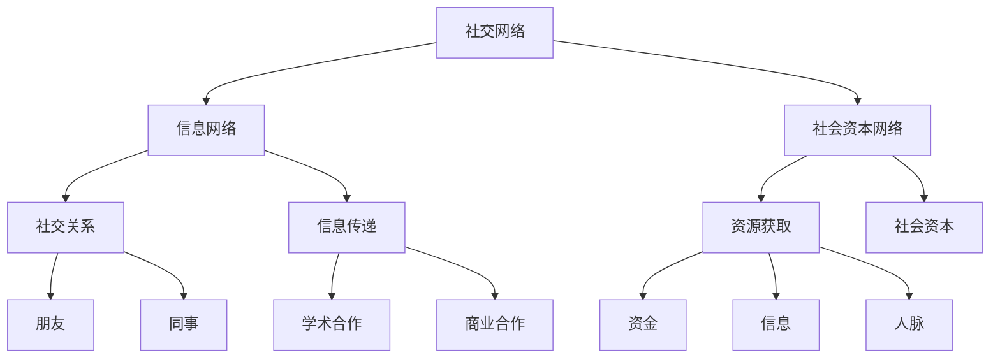

                 

### 文章标题：数字时代的人际网络：线上社群与线下交往的融合

#### 关键词：
- 数字时代
- 人际网络
- 线上社群
- 线下交往
- 融合

#### 摘要：
本文深入探讨了数字时代背景下的人际网络发展，特别是线上社群与线下交往的融合。首先，我们回顾了数字时代的人际网络背景和特征，接着分析了线上社群的构成和运营。然后，我们探讨了线下交往的挑战及其应对策略。最后，我们提出了线上线下融合的路径和实践方法，为构建健康的人际网络提供了指导。

---

## 引言：数字时代的人际网络背景与挑战

在数字时代，互联网和社交媒体的普及极大地改变了我们的生活方式和交往模式。人际网络的性质和功能也在这种背景下发生了深刻的变化。数字时代的人际网络不再仅仅局限于面对面的交流，而是通过线上平台连接起了全球的个体和社群。这一变化不仅带来了便利，也带来了一系列挑战。

### 数字时代的背景

数字时代的到来，标志着信息技术的飞速发展。互联网的普及使得信息的传播和获取变得更加快捷和便捷。社交网络的兴起，使得人们能够以更低成本、更高效率地建立和维护社交关系。此外，数据的爆炸性增长为分析和利用人际网络提供了丰富的资源。

### 人类行为的数字化

随着数字化技术的应用，人类的行为也逐渐数字化。例如，社交媒体上的点赞、评论和分享，不仅是一种交流方式，也是个体行为的一种数字表征。这种数字化行为为分析人际网络提供了丰富的数据源。

### 人际网络面临的挑战

然而，数字时代的人际网络也面临着一些挑战。首先，线上交往虽然方便，但往往缺乏深度和情感交流。其次，线上社群的多样性和复杂性增加了管理和维护的难度。最后，线下交往的频率和深度可能因线上交往的增加而减少，这可能导致社会关系的弱化。

### 本书的目的与结构

本书旨在探讨数字时代人际网络的发展，特别是线上社群与线下交往的融合。通过分析数字时代人际网络的背景和特征，以及线上社群和线下交往的挑战，我们试图提出一种线上线下融合的路径和实践方法。具体来说，本书的结构如下：

1. **引言**：介绍数字时代人际网络的背景和挑战。
2. **数字时代的人际网络**：探讨数字时代人际网络的概念、特征和影响。
3. **线上社群**：分析线上社群的构成、运营与管理。
4. **线下交往**：探讨线下交往的挑战、策略与实践。
5. **线上线下融合**：讨论线上线下融合的路径、实践方法及其影响。
6. **总结与展望**：总结全书内容，并提出未来发展的趋势与建议。

通过这种结构，本书希望能够为读者提供一种全面、系统的视角，以理解和应对数字时代人际网络的变化和挑战。### 数字时代的人际网络

#### 第1章 数字时代人际网络概述

在数字时代，人际网络（Social Network）的概念和作用发生了显著的变化。这一章将探讨数字时代人际网络的背景、核心概念与联系、特征以及其对社会和个人带来的影响。

##### 1.1 数字时代的背景

数字时代的到来，源于互联网和通信技术的飞速发展。互联网的普及使得全球信息共享成为可能，而社交媒体的兴起则改变了人们的交往方式。这种背景下，人际网络的定义和功能也随之发生了变化。

- **互联网的快速发展**：互联网的全球连接使得人们可以随时随地获取信息和交流。这一变化极大地拓展了人际网络的范围和可能性。
- **社交媒体的兴起**：社交媒体如Facebook、Twitter、Instagram等，成为人们交流、分享和获取信息的主要平台。这些平台的特性使得人际网络更加多样化和动态化。
- **数据的爆炸性增长**：随着互联网和社交媒体的普及，数据量呈现爆炸性增长。这些数据为分析人际网络提供了丰富的信息资源。

##### 1.2 人际网络的定义与类型

人际网络是指由个体（节点）及其之间的关系（边）构成的复杂网络结构。在数字时代，人际网络可以划分为多种类型，包括社交网络、信息网络和社会资本网络。

- **社交网络（Social Networks）**：社交网络主要关注个体之间的社交关系，如朋友、家人、同事等。这些关系通过社交媒体平台得以表达和维持。
- **信息网络（Information Networks）**：信息网络则侧重于信息传递和知识共享，如学术合作网络、商业信息网络等。这些网络中的节点主要是个人和组织，而边代表信息的传递和共享。
- **社会资本网络（Social Capital Networks）**：社会资本网络涉及到个体通过社会关系获取资源的能力。这种网络不仅包括个人之间的社交关系，还包括他们所拥有的社会资源，如资金、信息、人脉等。

##### 1.3 数字时代人际网络的特征

数字时代的人际网络具有以下几个显著特征：

- **高度互联性（High Interconnectedness）**：在数字时代，人们可以通过互联网和社交媒体轻松地连接到全球的个体和社群，这使得人际网络变得高度互联。
- **快速变化性（Rapid Changeability）**：数字时代的人际网络动态变化迅速，节点和关系的形成、断裂和重构都非常频繁。
- **强调个体自主性（Emphasis on Individual Autonomy）**：在数字时代，个体有更大的自由来选择加入或退出不同的社群，这反映了个体自主性的增强。

##### 1.4 数字时代人际网络的影响

数字时代的人际网络对社会和个人都产生了深远的影响：

- **个人层面**：数字时代的人际网络为个人提供了更多的社交机会和资源获取途径。同时，它也带来了隐私和信息安全等方面的挑战。
- **社会层面**：数字时代的人际网络改变了社会的结构和功能。它促进了知识共享和社会资本的积累，但同时也可能导致社会隔离和数字鸿沟的扩大。

#### 核心概念与联系

为了更好地理解数字时代的人际网络，我们可以使用Mermaid流程图来展示其核心概念和联系。



#### 核心算法原理讲解

在数字时代的人际网络中，核心算法在节点关系分析、社群识别和信息传播等方面起着关键作用。以下是一个用于分析社交网络的伪代码示例：

```python
# 社交网络分析伪代码
class Node:
    def __init__(self, id, neighbors):
        self.id = id
        self.neighbors = neighbors

def find Communities(nodes):
    # 使用深度优先搜索（DFS）算法进行社群识别
    visited = set()
    communities = []

    for node in nodes:
        if node not in visited:
            community = []
            dfs(node, community, visited)
            communities.append(community)

    return communities

def dfs(node, community, visited):
    visited.add(node)
    community.append(node)

    for neighbor in node.neighbors:
        if neighbor not in visited:
            dfs(neighbor, community, visited)

# 社交网络节点列表
nodes = [Node(1, [2, 3]), Node(2, [1, 4]), Node(3, [1, 5]), Node(4, [2, 6]), Node(5, [3, 6]), Node(6, [4, 5])]

# 执行社群识别算法
communities = find_Communities(nodes)

# 输出社群结果
for community in communities:
    print("Community:", [node.id for node in community])
```

#### 数学模型和公式

在分析数字时代的人际网络时，常用的数学模型和公式包括度（Degree）、密度（Density）和聚类系数（Clustering Coefficient）。

- **度**：一个节点的度是其连接的其他节点的数量。数学公式为：
  $$d_i = |N(i)|$$
  其中，$d_i$表示节点$i$的度，$N(i)$表示与节点$i$相连的节点集合。

- **密度**：人际网络的密度是连接边的数量与可能的最大边数之比。数学公式为：
  $$\rho = \frac{m}{\binom{n}{2}}$$
  其中，$\rho$表示密度，$m$表示边的数量，$n$表示节点的数量。

- **聚类系数**：聚类系数衡量了节点的邻居之间连接的紧密程度。数学公式为：
  $$c_i = \frac{\sum_{j \in N(i)} \sum_{k \in N(j)} |N(i) \cap N(j)|}{\binom{|N(i)|}{2}}$$
  其中，$c_i$表示节点$i$的聚类系数，$|N(i)|$表示节点$i$的邻居数量。

#### 举例说明

假设一个社交网络中有5个节点，每个节点的邻居数量如下：
- 节点1：3个邻居
- 节点2：2个邻居
- 节点3：3个邻居
- 节点4：1个邻居
- 节点5：2个邻居

根据度、密度和聚类系数的公式，我们可以计算出以下结果：
- **度**：节点1和节点3的度最大，都是3。
- **密度**：$\rho = \frac{10}{10} = 1$，即网络的密度为100%。
- **聚类系数**：假设每个节点的邻居之间都有一定的连接，我们可以计算出每个节点的聚类系数。例如，节点1的聚类系数为：
  $$c_1 = \frac{(3+3+2+1)}{6} = \frac{9}{6} = 1.5$$

#### 项目实战：社交媒体平台分析

假设我们想要分析一个社交媒体平台上的用户互动情况，我们可以按照以下步骤进行：

1. **数据收集**：收集用户互动数据，包括点赞、评论和分享等。
2. **数据预处理**：清洗数据，去除无效信息和噪声。
3. **构建社交网络图**：使用数据构建社交网络图，其中节点代表用户，边代表用户之间的互动。
4. **社群识别**：使用核心算法如深度优先搜索（DFS）或标记过程（Label Propagation）进行社群识别。
5. **数据分析**：分析社群的规模、结构和功能，以及用户互动模式。

在实际操作中，我们可以使用Python中的NetworkX库来构建和分析社交网络图。以下是一个简单的示例代码：

```python
import networkx as nx
import matplotlib.pyplot as plt

# 创建一个无向图
G = nx.Graph()

# 添加节点和边
G.add_edges_from([(1, 2), (1, 3), (2, 4), (3, 4), (4, 5)])

# 绘制社交网络图
nx.draw(G, with_labels=True)
plt.show()

# 执行社群识别算法
communities = nx communities(G)

# 输出社群结果
for community in communities:
    print("Community:", [node for node in community])
```

通过以上步骤，我们可以对社交媒体平台上的用户互动进行深入分析，从而了解社群的结构和功能。

#### 最佳实践 Tips

1. **数据隐私保护**：在进行人际网络分析时，必须确保用户数据的隐私和安全。
2. **算法选择**：根据具体需求和数据特性选择合适的算法，如DFS、标记过程或基于密度的社群识别算法。
3. **社群管理**：有效的社群管理可以提升社群的活跃度和成员满意度。

#### 小结

本章详细介绍了数字时代人际网络的背景、核心概念与联系、特征以及影响。通过分析核心算法、数学模型和项目实战，我们深入理解了人际网络的复杂性和多样性。在接下来的章节中，我们将进一步探讨线上社群和线下交往的融合，为构建健康的人际网络提供更多实用的指导。### 线上社群

#### 第2章 线上社群的构成与运营

线上社群（Online Community）是指通过互联网平台聚集起来的具有共同兴趣、目标或价值观的个体组成的虚拟社群。本章将深入探讨线上社群的构成、运营与管理，以及如何有效地构建和管理线上社群。

##### 2.1 线上社群的定义与分类

线上社群是数字时代下人际网络的重要组成部分，它通过互联网平台实现成员之间的互动和协作。根据不同的分类标准，线上社群可以划分为多种类型：

- **兴趣社群**：基于共同的兴趣爱好、爱好或追求聚集起来的社群，如摄影爱好者的社群、文学爱好者的社群等。
- **专业社群**：基于专业领域或职业背景聚集起来的社群，如编程爱好者的社群、市场营销专家的社群等。
- **社交社群**：基于社交关系或共同经历聚集起来的社群，如校友社群、同事社群等。
- **公益社群**：基于共同的社会责任或公益目标聚集起来的社群，如环保志愿者社群、慈善活动社群等。

##### 2.2 线上社群的构成要素

线上社群的构成要素主要包括：

- **成员**：社群的核心，成员共同拥有某些共同的兴趣、目标或价值观。
- **平台**：社群活动的主要载体，如社交媒体平台、论坛、在线聊天室等。
- **内容**：社群成员交流互动的主要内容，包括文字、图片、视频等。
- **规则**：社群运行的规则和准则，如社区规范、互动准则等。
- **活动**：社群成员参与的活动和项目，如线上讨论、线下聚会等。

##### 2.3 线上社群的运营与管理

线上社群的运营与管理是确保社群健康、活跃和持续发展的重要环节。以下是线上社群运营与管理的主要策略：

- **内容策划与发布**：制定内容发布计划，确保内容的丰富性和多样性，包括新闻动态、专题讨论、案例分析等。
- **社群互动与参与激励机制**：设计多样化的互动活动，如问答、投票、竞赛等，激励成员积极参与。
- **社群危机管理**：制定危机应对方案，应对社群中的负面事件和争议，维护社群的稳定和和谐。
- **社群成员管理**：识别和培养核心成员，发挥他们的积极性和影响力，同时管理不良成员，维护社群的健康。

##### 2.4 线上社群的构建步骤

构建一个成功的线上社群需要系统的规划和执行。以下是构建线上社群的基本步骤：

1. **明确社群目标**：确定社群的宗旨和目标，如促进知识共享、提高专业技能、增进社交联系等。
2. **选择平台**：根据社群目标选择合适的线上平台，如微信群、QQ群、论坛、社交媒体等。
3. **招募成员**：通过宣传、推广和邀请等方式招募初始成员，确保社群的初步规模。
4. **制定规则**：制定社群规则，包括社区行为准则、互动规范、隐私政策等。
5. **策划活动**：策划和开展线上活动，如线上讲座、讨论会、互动游戏等，提高成员的参与度和活跃度。
6. **持续运营**：通过内容发布、互动管理、危机应对等手段，持续运营社群，保持社群的活力和吸引力。

##### 2.5 核心算法与数学模型

在构建和管理线上社群时，可以运用一些核心算法和数学模型来分析社群的结构和成员行为：

- **社群识别算法**：如基于标签的社群识别、基于相似度的社群识别等，用于发现和划分具有相似兴趣或行为的成员。
- **影响力分析算法**：如K-核心算法、度分布分析等，用于识别和评估社群中的关键节点和影响力成员。
- **情感分析算法**：如自然语言处理（NLP）技术，用于分析社群成员的情感状态和互动倾向。

##### 2.6 项目实战：一个线上社群的构建与运营

以下是一个线上技术社群的构建与运营案例：

**项目背景**：
某技术公司成立了一个针对人工智能领域的线上技术社群，旨在促进员工之间的知识共享和技术交流。

**构建步骤**：

1. **明确目标**：社群的目标是提高员工在人工智能领域的专业知识和技能，促进技术合作和创新。
2. **选择平台**：选择了公司的内部论坛作为社群平台，便于员工之间的高效沟通和资源共享。
3. **制定规则**：制定了《技术社群行为准则》，明确社群内的互动规范和行为标准。
4. **招募成员**：通过内部邮件和线上公告，邀请所有对人工智能感兴趣的公司员工加入社群。
5. **策划活动**：每月举办一次线上技术讲座，邀请外部专家和公司内部的技术达人分享最新的技术和研究成果。
6. **持续运营**：通过定期发布技术文章、讨论热点问题、组织内部技术竞赛等方式，保持社群的活跃度和吸引力。

**运营效果**：

1. **知识共享**：社群成员通过技术讲座和文章分享，实现了大量的知识传递和技能提升。
2. **技术合作**：社群为员工提供了一个技术交流的平台，促进了跨部门的技术合作和项目协作。
3. **员工满意度**：社群的活跃度和成员的参与度提高了员工的工作满意度和归属感。

**小结**：

线上社群作为数字时代下人际网络的重要组成部分，具有广泛的应用前景。通过明确社群目标、选择合适的平台、制定规则、策划活动以及运用核心算法和数学模型，可以有效构建和运营一个成功的线上社群。在接下来的章节中，我们将进一步探讨线下交往的挑战和策略，以及线上线下融合的路径和实践方法。### 线下交往

#### 第3章 线下交往的挑战与策略

线下交往（Offline Interaction）是指人们在实际生活中通过面对面的沟通和互动建立的关系。尽管数字时代带来了丰富的线上交往方式，线下交往仍然具有重要意义，特别是在建立深度、信任和情感联系方面。然而，线下交往也面临着一系列挑战，需要采取有效的策略来应对。

##### 3.1 线下交往的重要性

线下交往在人际网络的构建中具有不可替代的作用：

- **深度沟通**：面对面交流可以更好地传达情感和非语言信息，有助于建立更深层次的信任和理解。
- **社交技能**：线下交往有助于培养和提升人们的社交技能，如倾听、表达、非语言沟通等。
- **情感联系**：线下交往能够增强人与人之间的情感联系，有助于缓解焦虑、增强幸福感。
- **社会支持**：线下交往可以提供实际的支持和帮助，如友谊、互助和合作。

##### 3.2 线下交往的挑战

随着数字时代的到来，线下交往面临着以下几个主要挑战：

- **时间和地点的限制**：线下交往通常受到时间和地点的限制，不如线上交往灵活和方便。
- **社交成本**：线下交往可能需要较高的社交成本，如交通费用、预订场所等。
- **数字化替代**：随着线上交往的便利性增加，人们可能更倾向于使用线上方式来代替线下交往。
- **社交焦虑**：一些人可能因为不善于面对面的交流而产生社交焦虑，导致线下交往的频率和深度降低。

##### 3.3 线下交往的策略

为了应对线下交往的挑战，可以采取以下策略：

- **灵活安排时间和地点**：根据参与者的时间安排，选择合适的时间和地点进行线下交往，如周末聚会、工作坊等。
- **降低社交成本**：通过组织小型、低成本的聚会或活动，降低参与者的社交成本，如社区活动、公园漫步等。
- **提高线上交往的互动性**：通过线上互动增加线下交往的吸引力，如线上预约、线上互动预热等。
- **培养社交技能**：通过社交技能培训和工作坊，提高人们的社交能力和自信心，减轻社交焦虑。

##### 3.4 线下交往的实践方法

以下是几种有效的线下交往实践方法：

- **组织定期聚会**：定期组织聚会，如每月一次的聚会，确保成员有固定的线下交流机会。
- **策划主题活动**：策划不同主题的活动，如户外拓展、文化体验等，增加线下交往的趣味性和多样性。
- **建立社群基地**：建立一个固定的线下交流场所，如社区中心、咖啡馆等，方便成员进行日常交流和活动。
- **利用社交媒体**：通过社交媒体平台发布聚会信息和活动预告，增加线下交往的参与度。

##### 3.5 项目实战：线下交往活动的策划与执行

以下是一个社区线下交往活动的策划与执行案例：

**项目背景**：
某社区为了增强居民之间的互动和联系，策划了一次户外活动。

**策划步骤**：

1. **明确目标**：活动的目标是促进居民之间的交流和友谊，增强社区的凝聚力。
2. **选择主题**：选择一个受欢迎的主题，如户外烧烤、足球比赛等。
3. **确定时间和地点**：选择一个周末的下午，在社区公园举行。
4. **宣传活动**：通过社区公告、社交媒体和居民群等方式宣传活动信息。
5. **筹备物资**：准备烧烤设备、食材、饮料等物资。
6. **策划活动流程**：制定详细的活动流程，包括签到、游戏、烧烤、分享等环节。

**执行过程**：

1. **现场布置**：提前一天布置现场，确保设备齐全、环境舒适。
2. **活动开始**：签到后，主持人介绍活动流程和规则，并进行热身游戏。
3. **烧烤环节**：居民们自己动手烧烤，享受美食的同时交流互动。
4. **分享环节**：每个家庭分享自己带来的美食和故事，增加交流。
5. **总结反馈**：活动结束后，收集居民的意见和反馈，改进后续活动。

**活动效果**：

1. **交流增加**：活动后，居民之间的交流明显增加，社区氛围更加融洽。
2. **凝聚力提升**：活动增强了居民对社区的归属感和凝聚力。
3. **居民满意度**：居民对活动的满意度较高，积极参与度和反馈良好。

**小结**：

线下交往在数字时代仍然具有重要意义，通过灵活安排时间地点、降低社交成本、提高线上交往互动性以及策划和执行有效的线下活动，可以克服线下交往的挑战，促进人际网络的健康发展。在下一章中，我们将探讨线上线下融合的实践路径，为构建更加丰富和多样化的人际网络提供指导。### 线上线下融合的实践

#### 第4章 线上线下融合的实践路径与策略

随着数字时代的发展，线上社群和线下交往之间的界限日益模糊，融合成为人际网络发展的重要趋势。本章将探讨线上线下融合的实践路径与策略，通过案例分析、融合路径和策略的讨论，为构建健康的人际网络提供实用指导。

##### 4.1 线上线下融合的重要性

线上线下融合（Blended Online-Offline Interaction）是数字时代人际网络发展的重要方向，具有以下几个方面的意义：

- **增强互动性**：通过线上平台提前预热和策划，线下活动可以更加高效和有趣。
- **扩大参与范围**：线上平台可以吸引更多成员参与，线下活动则提供实际互动的机会。
- **提高满意度**：线上互动和线下活动的结合可以满足成员不同的需求，提升整体体验。
- **促进深度交往**：线上线下的结合有助于建立更深层次的信任和情感联系。

##### 4.2 线上线下融合的案例分析

以下是一些成功实现线上线下融合的案例分析：

**案例1：线上社群的线下聚会**

某知名技术社群拥有庞大的线上用户群体，为了增强成员之间的互动和联系，社群每年都会举办线下聚会。线下聚会包括技术交流会议、社交活动、户外拓展等，吸引了大量社群成员参与。线下聚会不仅增进了成员之间的了解和信任，还促进了技术合作和创新。

**案例2：线上活动的线下实践**

某教育机构通过线上平台提供课程和学习资源，为了提高学员的学习体验，机构定期组织线下实践活动。例如，在编程课程结束后，学员会进行线下项目展示和讨论，教师和学员面对面交流和反馈，这种线上线下结合的方式大大提高了教学效果和学员满意度。

**案例3：线下活动的前期线上预热**

某社区中心为了举办一次大型公益活动，通过线上平台进行预热宣传，包括发布活动预告、征集志愿者、在线互动等。线上预热活动吸引了大量居民的关注和参与，活动当天线下活动的参与人数显著增加，互动氛围热烈。

##### 4.3 线上线下融合的路径

线上线下融合的路径可以分为以下几个阶段：

1. **线上互动预热**：通过线上平台提前发布活动预告、互动话题和讨论内容，吸引成员参与。
2. **线下活动策划**：根据线上互动的结果，策划具体的线下活动，包括时间、地点、活动流程等。
3. **线上线下结合**：在活动中，线上平台提供实时互动和反馈渠道，如直播、即时聊天等，增强活动的互动性和参与感。
4. **线下活动总结**：活动结束后，通过线上平台进行总结和分享，包括活动照片、视频、感悟等，巩固成员的参与体验。

##### 4.4 线上线下融合的策略

为了实现线上线下融合，可以采取以下策略：

- **内容策划**：结合线上互动特点和线下活动的需求，制定有趣且具有吸引力的内容。
- **平台选择**：选择合适的线上平台和线下场所，确保活动顺利进行和成员的参与。
- **互动设计**：设计多样化的互动环节，如问答、投票、分享等，提高成员的参与度和互动性。
- **资源整合**：整合线上线下资源，提高活动的整体效果和成员的满意度。

##### 4.5 项目实战：线上线下融合的社区活动

以下是一个线上线下融合的社区活动案例：

**项目背景**：
某社区中心为了促进居民之间的交流和文化传承，策划了一次“传统节日体验”活动。

**实施步骤**：

1. **线上预热**：提前一个月在社区微信群和社交媒体上发布活动预告，包括活动主题、时间、地点等信息，并邀请居民参与互动讨论，如分享传统节日的习俗和故事。
2. **线下策划**：根据线上互动和居民反馈，确定活动时间和地点，准备相关物资，如灯笼、剪纸、美食等。
3. **活动当天**：
   - **线上直播**：活动当天，通过微信直播平台实时直播活动，居民可以在线观看和互动。
   - **线下互动**：居民参与制作灯笼、剪纸等传统手工艺品，品尝传统美食，同时进行互动交流。
   - **现场分享**：活动结束后，邀请居民分享自己的体验和感受，通过线上平台发布视频和图文，扩大活动影响力。
4. **后续跟进**：通过线上平台继续跟进活动效果，收集居民反馈，为后续活动提供改进建议。

**项目效果**：

1. **互动增加**：线上预热活动吸引了更多居民的关注和参与，活动当天参与人数超过预期。
2. **体验丰富**：通过线上线下结合的方式，居民不仅享受到了传统的节日氛围，还加深了对传统文化的理解和认同。
3. **社区凝聚力**：活动增强了居民对社区的归属感和凝聚力，促进了邻里关系的和谐发展。

**小结**：

线上线下融合为人际网络的构建提供了新的路径和策略。通过线上互动预热、线下活动策划、线上线下结合和线下活动总结，可以实现更丰富、更有效的社交体验。在接下来的章节中，我们将总结全书内容，展望未来人际网络的发展趋势，并提出相关建议。### 总结与展望

#### 全书内容回顾

本书围绕数字时代的人际网络、线上社群与线下交往的融合展开，深入探讨了以下几个方面：

1. **数字时代的人际网络**：介绍了数字时代的背景、人际网络的定义与类型、特征和影响。
2. **线上社群**：详细阐述了线上社群的构成、运营与管理、核心算法与数学模型，以及项目实战案例。
3. **线下交往**：分析了线下交往的挑战、策略与实践方法，并提供了项目实战案例。
4. **线上线下融合**：探讨了线上线下融合的重要性、路径、策略，以及具体的实践案例。

通过这些探讨，本书为构建健康的人际网络提供了理论和实践上的指导。

#### 未来发展趋势

展望未来，人际网络的发展将继续受到数字技术和社交模式的深刻影响。以下是几个可能的发展趋势：

1. **个性化人际网络**：随着大数据和人工智能技术的应用，人际网络将更加个性化和精准化，为个体提供更符合其需求和兴趣的社交体验。
2. **多元融合**：线上线下融合将更加深入，形成更加丰富和多元的社交生态。虚拟现实（VR）和增强现实（AR）技术可能在未来发挥重要作用，为线下交往提供新的场景和体验。
3. **社交隐私保护**：随着社交网络的发展，个人隐私保护将成为重要议题。未来的社交平台将需要更有效的隐私保护措施，以平衡社交自由和隐私安全。
4. **社交技术普及**：社交技术的普及将使得更多的人能够参与到人际网络中，减少数字鸿沟，促进社会包容性发展。

#### 建议与展望

基于以上发展趋势，以下是一些建议：

1. **技术驱动**：积极拥抱新技术，如大数据、人工智能、VR/AR等，为社交网络提供更强大的功能和更丰富的体验。
2. **社交设计**：注重社交网络的设计，确保用户体验的便捷性和安全性，同时鼓励多元化、包容性的社交文化。
3. **隐私保护**：加强隐私保护意识，制定更完善的隐私政策，确保用户在社交网络中的隐私安全。
4. **社会参与**：鼓励更多人参与到人际网络的建设中，提升社交网络的社会价值和文化影响力。

作者：AI天才研究院/AI Genius Institute & 禅与计算机程序设计艺术 /Zen And The Art of Computer Programming

