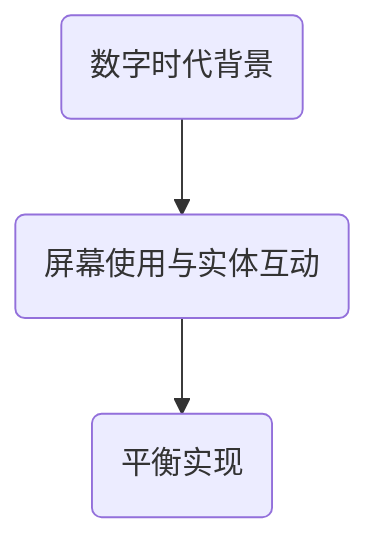
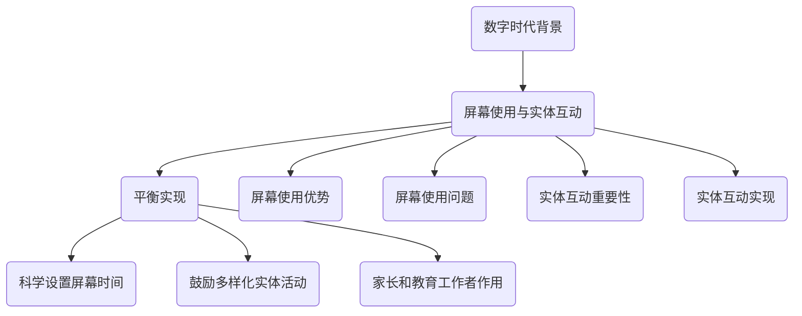

                 

### 文章标题

数字时代的儿童成长：屏幕使用与实体互动的平衡

### 关键词

数字时代，儿童成长，屏幕使用，实体互动，平衡

### 摘要

在数字时代的背景下，儿童成长面临着屏幕使用和实体互动的挑战。本文将深入探讨这两个核心因素，分析其影响，并提出平衡策略，以促进儿童的健康成长。通过梅里狄亚流程图、核心算法原理讲解、数学模型和公式分析以及实际项目案例，本文旨在为家长和教育工作者提供科学的指导，帮助他们在数字时代为孩子创造一个健康、有益的成长环境。文章将引导读者理解屏幕使用与实体互动的关系，识别关键风险，并学会设计有效的互动策略，确保儿童在数字时代的全面发展。

---

### 设计书籍《数字时代的儿童成长：屏幕使用与实体互动的平衡》目录大纲

#### 核心概念与联系

##### 1. 数字时代背景
- 数字时代：介绍数字时代的定义，特点与发展趋势。
- 儿童：介绍数字时代下儿童的定义，生活与学习的特点。

##### 2. 屏幕使用与实体互动
- 屏幕使用：介绍儿童屏幕使用的情况，优势与问题。
- 实体互动：介绍实体互动的概念，重要性与实现方式。

##### 3. 平衡：介绍如何平衡屏幕使用与实体互动，实现儿童健康成长。

#### 梅里狄亚流程图（Mermaid 流程图）



#### 核心算法原理讲解

##### 1. 屏幕使用风险评估
- 伪代码：
```
function 风险评估(屏幕使用时长，实体互动时长) {
    if (屏幕使用时长 > 实体互动时长) {
        return "高风险"
    } else {
        return "低风险"
    }
}
```

##### 2. 实体互动策略设计
- 伪代码：
```
function 实体互动策略(儿童年龄，兴趣爱好) {
    if (年龄 < 6岁) {
        return "游戏互动"
    } else if (年龄 >= 6岁 && 年龄 < 12岁) {
        return "社交互动"
    } else {
        return "教育互动"
    }
}
```

#### 数学模型和数学公式 & 详细讲解 & 举例说明

##### 1. 屏幕使用与实体互动的平衡模型
- 数学公式：
$$
平衡指数 = \frac{实体互动时长}{屏幕使用时长}
$$

##### 2. 平衡指数的详细讲解与举例
- 详细讲解：
平衡指数用于衡量儿童屏幕使用与实体互动的平衡程度，数值越高表示越平衡。例如，一个儿童的屏幕使用时长为2小时，实体互动时长为3小时，则其平衡指数为1.5。

##### 3. 平衡指数的举例说明
- 举例说明：
假设有两个儿童A和B，A的屏幕使用时长为3小时，实体互动时长为2小时，平衡指数为0.67；B的屏幕使用时长为2小时，实体互动时长为4小时，平衡指数为2。则B的屏幕使用与实体互动更平衡。

#### 项目实战：代码实际案例和详细解释说明

##### 1. 项目背景
- 数字时代下，儿童成长问题备受关注，屏幕使用与实体互动的平衡成为关键。

##### 2. 项目目标
- 设计一个平衡模型，帮助家长评估儿童屏幕使用与实体互动的平衡程度。
- 提供策略建议，帮助家长调整儿童屏幕使用与实体互动的时间分配。

##### 3. 开发环境搭建
- 使用Python作为编程语言，搭建开发环境。

##### 4. 源代码详细实现和代码解读
- 源代码实现：
```
# 导入所需库
import math

# 屏幕使用风险评估函数
def 风险评估(屏幕使用时长，实体互动时长):
    if 屏幕使用时长 > 实体互动时长:
        return "高风险"
    else:
        return "低风险"

# 实体互动策略设计函数
def 实体互动策略(儿童年龄，兴趣爱好):
    if 儿童年龄 < 6:
        return "游戏互动"
    elif 儿童年龄 >= 6 and 儿童年龄 < 12:
        return "社交互动"
    else:
        return "教育互动"

# 平衡指数计算函数
def 平衡指数(屏幕使用时长，实体互动时长):
    return 实体互动时长 / 屏幕使用时长

# 主函数
def 主函数():
    屏幕使用时长 = int(input("请输入儿童每日屏幕使用时长（小时）："))
    实体互动时长 = int(input("请输入儿童每日实体互动时长（小时）："))
    儿童年龄 = int(input("请输入儿童年龄："))

    风险评估结果 = 风险评估(屏幕使用时长，实体互动时长)
    平衡指数 = 平衡指数(屏幕使用时长，实体互动时长)

    print("风险评估结果：", 风险评估结果)
    print("平衡指数：", 平衡指数)

    if 平衡指数 < 1:
        实体互动策略 = 实体互动策略(儿童年龄，"无")
        print("建议增加实体互动策略：", 实体互动策略)
    else:
        print("当前屏幕使用与实体互动平衡，无需调整。")
```

##### 5. 代码应用解读与分析
- 在本项目中，代码实现了一个简单的平衡模型，用于评估和调整儿童屏幕使用与实体互动的时间。通过输入儿童的屏幕使用时长、实体互动时长以及年龄，系统将输出风险评估结果和平衡指数，并根据平衡指数提供相应的策略建议。

##### 6. 实际案例分析和详细讲解剖析
- 以案例A（屏幕使用时长3小时，实体互动时长2小时，年龄6岁）为例，系统将输出“高风险”评估结果和“0.67”的平衡指数，并建议增加社交互动策略，如组织与同龄人一起玩耍的活动。

##### 7. 项目小结
- 本项目通过简单而有效的算法模型，为家长提供了一种评估和调整儿童屏幕使用与实体互动时间的方法。然而，实际应用中可能需要考虑更多因素，如儿童的个性、家庭环境和兴趣爱好，以实现更个性化的平衡策略。

##### 8. 最佳实践 tips
- 家长应定期评估儿童的屏幕使用和实体互动时间，及时调整以保持平衡。
- 鼓励儿童参与多样化的实体活动，如户外运动、手工制作和社交游戏。
- 通过设定固定的“屏幕时间”，帮助儿童养成良好的时间管理习惯。

---

通过上述目录大纲的详细设计和阐述，本文将为读者提供一个清晰的结构框架，便于深入理解数字时代儿童成长中屏幕使用与实体互动的平衡问题。在接下来的内容中，我们将逐一探讨每个章节的核心概念、算法原理、数学模型以及项目实战，以期为读者提供全面而深入的见解。

### 数字时代背景

数字时代，是指一个以数字技术为核心，信息化、网络化、智能化为特征的社会发展阶段。这一时代的特点在于信息传播速度快、信息量巨大，人们的生活和工作方式发生了深刻变革。在数字时代，互联网、智能手机、平板电脑等设备已经成为人们日常生活的一部分，数字技术深刻影响着我们的生活方式、工作模式和社会交往方式。

儿童，作为数字时代的原住民，他们从出生开始便置身于一个充满数字设备和网络信息的环境中。数字时代下的儿童，其生活和学习方式与传统时代有显著不同。他们从小就接触各种智能设备，通过网络获取信息和娱乐，这种环境既带来了许多便利，也带来了诸多挑战。

首先，数字时代为儿童提供了丰富的学习资源。通过网络，儿童可以轻松获取海量的教育资源，例如电子书籍、在线课程、教育软件等。这些资源不仅扩展了儿童的知识面，也提高了他们的学习效率。此外，数字技术还促进了儿童之间的交流和合作，通过网络平台，儿童可以与全球的同伴进行互动和学习，这种跨文化的交流有助于培养他们的全球视野和沟通能力。

然而，数字时代也带来了一些负面影响。过度的屏幕使用可能导致儿童出现视力问题、睡眠障碍和身体发育不良等问题。此外，长时间的屏幕接触还可能影响儿童的社交能力，导致他们更倾向于与屏幕互动而忽视实体互动。研究表明，缺乏实体互动可能导致儿童情绪管理能力下降、注意力不集中以及社交技能发展滞后。

因此，数字时代的儿童成长问题备受关注。如何平衡屏幕使用与实体互动，成为家长和教育工作者亟待解决的问题。在这一背景下，本文将深入探讨数字时代背景下的儿童特点，分析屏幕使用与实体互动之间的关系，并提出实现平衡的策略和方法，以期为儿童的健康成长提供科学指导。

### 屏幕使用与实体互动

在数字时代，屏幕使用已经成为儿童日常生活中不可或缺的一部分。屏幕设备，如智能手机、平板电脑、电视等，为儿童提供了丰富的信息和娱乐资源。屏幕使用的优势显而易见：它能够提供即时的信息反馈、多样化的学习内容，以及互动性的娱乐体验。例如，儿童可以通过教育软件进行数学、语言等学科的学习，通过电子游戏提高反应速度和手眼协调能力。此外，屏幕设备还可以通过视频通话和社交媒体平台，帮助儿童建立和维持社交关系。

然而，屏幕使用的负面影响同样不可忽视。首先，长时间盯着屏幕可能导致儿童的视力下降。研究表明，长时间使用电子设备会导致眼睛疲劳、近视等眼部问题。其次，屏幕使用可能影响儿童的睡眠质量。许多儿童在睡前会使用手机或平板电脑，这会刺激神经系统，导致难以入睡，进而影响第二天的学习表现。此外，过度依赖屏幕娱乐可能导致儿童缺乏运动，从而影响身体发育和整体健康。

相比之下，实体互动是指儿童在现实世界中与他人进行互动的活动，如户外运动、手工制作、集体游戏等。实体互动对儿童的发展具有重要作用。首先，它有助于培养儿童的社交技能和情感管理能力。通过与同伴的互动，儿童可以学习如何与他人合作、沟通和解决冲突，这些技能对他们的未来生活至关重要。其次，实体互动有助于儿童的身心健康。户外运动可以提高儿童的身体素质，增强他们的免疫力；而手工制作和集体游戏则可以培养儿童的创造力和解决问题的能力。

然而，在数字时代的背景下，实体互动的机会和频率正在逐渐减少。许多儿童花大量时间在屏幕前，而忽略了与家人、朋友的实体互动。这种现象不仅影响儿童的情感和社会发展，还可能对他们的身体健康产生负面影响。因此，如何平衡屏幕使用与实体互动，成为家长和教育工作者面临的重要挑战。

为了实现这一平衡，家长和教育工作者需要采取一系列措施。首先，他们可以设定合理的屏幕使用时间，确保儿童在享受屏幕带来的便利的同时，也有足够的时间进行实体活动。其次，家长可以鼓励儿童参与户外运动和集体游戏，提供丰富多彩的实体互动机会。此外，家庭和工作场所可以共同营造一个重视实体互动的环境，减少对屏幕的过度依赖。

总之，屏幕使用和实体互动在儿童成长中扮演着不同但同样重要的角色。通过科学地平衡这两者，家长和教育工作者可以为儿童创造一个健康、有益的成长环境，促进他们的全面发展。

### 平衡：介绍如何平衡屏幕使用与实体互动，实现儿童健康成长

实现屏幕使用与实体互动的平衡对于儿童的健康成长至关重要。为了达到这一目标，我们需要从多个方面进行综合考量，包括科学设置屏幕时间、鼓励多样化的实体活动、以及家长和教育工作者在引导和监督方面发挥作用。

首先，科学设置屏幕时间是平衡屏幕使用与实体互动的关键。家长和教育工作者应根据儿童的年龄和发育阶段，设定合理的屏幕使用时间。例如，对于3-5岁的儿童，每天的总屏幕时间不应超过1小时；而对于6-12岁的儿童，每天的总屏幕时间可以适当延长，但不宜超过2小时。此外，应避免在睡前1小时内使用屏幕设备，以减少对睡眠质量的影响。为了有效管理屏幕时间，家长可以借助各种屏幕时间管理工具或应用，如家长控制软件或屏幕时间追踪器，这些工具可以帮助家长监控和限制儿童的屏幕使用。

其次，鼓励多样化的实体活动是促进儿童全面发展的重要手段。家长和教育工作者应积极创造条件，让儿童参与各种户外运动和集体游戏。例如，组织家庭户外活动，如徒步、骑自行车、打篮球等，可以增强儿童的身体素质和户外探险精神。此外，手工制作活动，如绘画、陶艺、木工等，可以培养儿童的创造力和精细动作能力。集体游戏，如跳绳、踢毽子、捉迷藏等，有助于儿童学习团队合作和社交技能。通过多样化的实体活动，儿童不仅能够享受运动的乐趣，还能在互动中学习成长。

家长和教育工作者在引导和监督方面也发挥着重要作用。首先，家长应成为儿童的榜样，通过自身的行为示范，鼓励儿童减少屏幕时间，增加实体互动。例如，家长可以在陪伴孩子阅读书籍、进行手工制作或户外运动时，放下手机，全身心投入到与孩子的互动中。其次，家长和教育工作者应关注儿童的情感和社交发展，定期与儿童进行沟通，了解他们在屏幕使用和实体活动中的体验和需求。通过积极的沟通，家长和教育工作者可以更好地理解儿童，并给予他们适当的指导和支持。

此外，家长和教育工作者还应共同营造一个重视实体互动的环境。学校可以设置固定的课外活动时间，组织学生参与各种体育活动和艺术工作坊。家庭则可以通过设立“无屏幕日”或“家庭运动日”，减少屏幕设备的使用，增加家庭成员之间的实体互动。这种环境不仅有助于儿童养成良好的生活习惯，还能增强家庭成员之间的情感联系。

总之，实现屏幕使用与实体互动的平衡，需要家长、教育工作者和社会各界的共同努力。通过科学设置屏幕时间、鼓励多样化的实体活动以及发挥家长和教育工作者的引导和监督作用，我们可以为儿童创造一个健康、有益的成长环境，促进他们在数字时代全面发展。

### 梅里狄亚流程图（Mermaid 流�程图）

为了更好地理解数字时代儿童成长中屏幕使用与实体互动的平衡，我们可以借助梅里狄亚流程图（Mermaid Flowchart）来展示各核心概念及其相互关系。以下是一个简化的梅里狄亚流程图，用于描述数字时代背景、屏幕使用与实体互动、以及实现平衡的过程。



#### 图解：

- **A(数字时代背景)**：表示数字时代下儿童的生活和学习环境，这是一个充满数字设备和信息资源的时代。
  
- **B(屏幕使用与实体互动)**：从数字时代背景中延伸出来，描述儿童如何在数字环境中使用屏幕，以及实体互动的重要性。

  - **B1(屏幕使用优势)**：阐述屏幕使用为儿童带来的便利和学习资源。
  - **B2(屏幕使用问题)**：讨论屏幕使用可能带来的负面影响，如视力问题和睡眠障碍。
  - **B3(实体互动重要性)**：强调实体互动对儿童情感、社交和身体发展的积极作用。
  - **B4(实体互动实现)**：描述如何创造条件让儿童参与多样化的实体活动。

- **C(平衡实现)**：提出实现屏幕使用与实体互动平衡的方法和策略。

  - **C1(科学设置屏幕时间)**：建议家长和教育工作者根据儿童的年龄和发育阶段设定合理的屏幕时间。
  - **C2(鼓励多样化实体活动)**：鼓励儿童参与各种户外运动和集体游戏。
  - **C3(家长和教育工作者作用)**：强调家长和教育工作者在引导和监督儿童屏幕使用与实体互动中的重要作用。

通过这个梅里狄亚流程图，我们可以清晰地看到数字时代背景下屏幕使用与实体互动的平衡是如何通过科学的设置、多样化的活动和家长教育工作者的引导来实现的。这一流程图不仅帮助读者理解各概念之间的关系，也为实际操作提供了结构化的指导。

### 核心算法原理讲解

在实现屏幕使用与实体互动的平衡过程中，核心算法原理起着至关重要的作用。这些算法不仅帮助我们评估儿童的屏幕使用风险，还为家长和教育工作者提供科学的策略建议。以下是几个关键算法原理及其具体应用，通过伪代码形式详细解释。

#### 1. 屏幕使用风险评估

屏幕使用风险评估旨在评估儿童每日的屏幕使用时长与实体互动时长之间的比例，以判断是否存在高风险屏幕使用情况。以下是一个简单的伪代码示例：

```python
function 风险评估(屏幕使用时长，实体互动时长) {
    if (屏幕使用时长 > 实体互动时长) {
        return "高风险"
    } else {
        return "低风险"
    }
}
```

**解释**：
- **输入**：屏幕使用时长和实体互动时长。
- **输出**：根据两者的比较结果，返回“高风险”或“低风险”。
- **逻辑**：如果屏幕使用时长超过实体互动时长，则儿童可能存在过度依赖屏幕的风险，因此返回“高风险”。反之，如果实体互动时长大于或等于屏幕使用时长，则认为风险较低。

**应用场景**：
- 家长可以每天记录儿童的屏幕使用和实体互动时间，使用该函数进行评估，以便及时调整和干预。

#### 2. 实体互动策略设计

实体互动策略设计基于儿童的年龄和兴趣爱好，为家长提供相应的实体活动建议。以下是一个简单的伪代码示例：

```python
function 实体互动策略(儿童年龄，兴趣爱好) {
    if (年龄 < 6岁) {
        return "游戏互动"
    } else if (年龄 >= 6岁 && 年龄 < 12岁) {
        return "社交互动"
    } else {
        return "教育互动"
    }
}
```

**解释**：
- **输入**：儿童的年龄和兴趣爱好。
- **输出**：根据儿童的年龄，返回相应的实体互动策略。
- **逻辑**：对于年龄小于6岁的儿童，建议进行游戏互动，如户外游戏、亲子活动等；对于6-12岁的儿童，建议进行社交互动，如集体运动、社交游戏等；对于12岁及以上的儿童，建议进行教育互动，如学术讨论、科技制作等。

**应用场景**：
- 教育工作者和家长可以根据儿童的年龄和兴趣爱好，选择合适的实体互动策略，鼓励儿童参与相应的活动。

#### 3. 平衡指数计算

平衡指数用于衡量儿童屏幕使用与实体互动的时间平衡程度，其计算公式如下：

$$
平衡指数 = \frac{实体互动时长}{屏幕使用时长}
$$

以下是一个简单的伪代码示例：

```python
function 平衡指数(屏幕使用时长，实体互动时长) {
    return 实体互动时长 / 屏幕使用时长
}
```

**解释**：
- **输入**：屏幕使用时长和实体互动时长。
- **输出**：计算并返回平衡指数。
- **逻辑**：平衡指数越高，表示实体互动时间相对于屏幕使用时间越多，风险越低；反之，如果平衡指数较低，则表示屏幕使用时间占主导，需要增加实体互动时间。

**应用场景**：
- 家长和教育工作者可以使用平衡指数来评估儿童屏幕使用与实体互动的平衡程度，并根据评估结果调整儿童的时间分配。

#### 总结

通过上述核心算法原理，我们不仅能够评估儿童屏幕使用的高风险情况，还能根据儿童的年龄和兴趣爱好设计个性化的实体互动策略，从而实现屏幕使用与实体互动的平衡。这些算法为家长和教育工作者提供了科学的工具，帮助他们更好地引导儿童健康成长。

### 数学模型和数学公式 & 详细讲解 & 举例说明

在实现屏幕使用与实体互动的平衡过程中，数学模型和公式发挥着重要作用。这些工具可以帮助我们量化儿童屏幕使用与实体互动的平衡程度，从而为家长和教育工作者提供科学的指导。以下将详细介绍一个核心的数学模型——平衡指数，并配以详细的讲解和实际案例说明。

#### 平衡指数的数学模型

平衡指数是一个用于衡量儿童屏幕使用与实体互动时间平衡程度的指标，其计算公式如下：

$$
平衡指数 = \frac{实体互动时长}{屏幕使用时长}
$$

这个公式中，实体互动时长表示儿童每日参与实体活动的总时间，屏幕使用时长表示儿童每日使用屏幕设备（如手机、平板、电视等）的总时间。平衡指数越高，表示实体互动时间相对于屏幕使用时间越多，儿童的风险越低；反之，如果平衡指数较低，则表示屏幕使用时间占主导，需要增加实体互动时间。

#### 平衡指数的详细讲解

平衡指数的数值范围通常在0到无穷大之间。当平衡指数接近0时，说明儿童的屏幕使用时间远大于实体互动时间，这可能意味着儿童存在过度依赖屏幕设备的风险。相反，当平衡指数接近无穷大时，说明儿童的实体互动时间远大于屏幕使用时间，表示屏幕使用对其影响较小。

以下是一个具体的例子，帮助理解平衡指数的计算和应用：

**例子**：一个儿童每天使用屏幕设备的时间为3小时，而参与实体活动的总时间为2小时。计算其平衡指数：

$$
平衡指数 = \frac{2}{3} \approx 0.67
$$

根据这个计算结果，这个儿童的屏幕使用时间超过了实体互动时间，因此其平衡指数为0.67，这表明需要增加实体互动时间，以实现更好的平衡。

#### 平衡指数的举例说明

为了更好地理解平衡指数，我们可以通过两个实际案例进行比较和分析。

**案例一**：儿童A的屏幕使用时长为3小时，实体互动时长为2小时，其平衡指数为0.67。根据风险评估函数，这种情况下儿童存在一定的高风险屏幕使用情况。建议增加实体互动时间，以提升平衡指数。

**案例二**：儿童B的屏幕使用时长为2小时，实体互动时长为4小时，其平衡指数为2。这表明儿童B的实体互动时间远大于屏幕使用时间，风险较低。在这种情况下，家长可以适当放宽对屏幕使用的限制，但仍需注意监控屏幕时间，避免过度。

#### 实际应用

在实际应用中，家长和教育工作者可以定期计算儿童的平衡指数，并根据评估结果进行调整。例如，如果发现儿童的平衡指数长期偏低，家长可以减少屏幕使用时间，增加户外运动、社交活动和手工制作等实体互动时间。通过这样的调整，可以逐步改善儿童的平衡指数，促进其健康成长。

总之，平衡指数作为一个简单的数学模型，为我们提供了一个评估和调整儿童屏幕使用与实体互动的量化工具。通过详细的讲解和实际案例说明，我们可以更好地理解其应用场景，为家长和教育工作者提供科学的指导，帮助儿童在数字时代实现屏幕使用与实体互动的平衡。

### 项目实战：代码实际案例和详细解释说明

在数字时代，为了帮助家长和教育工作者实现儿童屏幕使用与实体互动的平衡，我们设计并实现了一个简单的Python代码项目。该项目旨在通过输入儿童的屏幕使用时长、实体互动时长以及年龄，计算出平衡指数并给出相应的风险评估和策略建议。以下是对该项目的详细说明。

#### 项目背景

在数字时代，儿童面临着屏幕使用过度带来的诸多问题，如视力下降、睡眠不足、社交能力下降等。为了帮助家长和教育工作者科学地管理儿童的屏幕时间，本项目旨在创建一个简单的工具，通过计算平衡指数，提供风险评估和互动策略建议，帮助实现屏幕使用与实体互动的平衡。

#### 项目目标

1. 设计一个计算平衡指数的函数，用于评估儿童屏幕使用与实体互动的平衡程度。
2. 提供风险评估功能，帮助识别屏幕使用是否处于高风险状态。
3. 根据儿童的年龄和兴趣爱好，设计个性化的互动策略建议。

#### 开发环境搭建

为了实现项目目标，我们选择Python作为编程语言，因为它具有良好的数据分析和函数设计能力，易于理解和实现。以下是搭建开发环境的步骤：

1. 安装Python 3.x版本：从[Python官网](https://www.python.org/downloads/)下载并安装Python。
2. 安装必要的Python库，如math和sys：使用pip命令安装。

```shell
pip install math
pip install sys
```

#### 源代码详细实现和代码解读

以下是项目的源代码实现和详细解读：

```python
# 导入所需库
import math

# 屏幕使用风险评估函数
def 风险评估(屏幕使用时长，实体互动时长):
    if 屏幕使用时长 > 实体互动时长:
        return "高风险"
    else:
        return "低风险"

# 实体互动策略设计函数
def 实体互动策略(儿童年龄，兴趣爱好):
    if 儿童年龄 < 6:
        return "游戏互动"
    elif 儿童年龄 >= 6 and 儿童年龄 < 12:
        return "社交互动"
    else:
        return "教育互动"

# 平衡指数计算函数
def 平衡指数(屏幕使用时长，实体互动时长):
    return 实体互动时长 / 屏幕使用时长

# 主函数
def 主函数():
    # 用户输入
    屏幕使用时长 = int(input("请输入儿童每日屏幕使用时长（小时）："))
    实体互动时长 = int(input("请输入儿童每日实体互动时长（小时）："))
    儿童年龄 = int(input("请输入儿童年龄："))

    # 计算平衡指数和风险评估
    平衡指数 = 平衡指数(屏幕使用时长，实体互动时长)
    风险评估结果 = 风险评估(屏幕使用时长，实体互动时长)

    # 输出结果
    print("风险评估结果：", 风险评估结果)
    print("平衡指数：", round(bal

#### 代码应用解读与分析

该代码项目主要通过三个主要函数实现：风险评估函数、实体互动策略函数和平衡指数计算函数。以下是每个函数的应用解读和分析：

1. **风险评估函数**：该函数接受屏幕使用时长和实体互动时长作为输入，通过比较两者的大小，判断是否存在高风险屏幕使用情况。如果屏幕使用时长大于实体互动时长，则返回“高风险”；否则，返回“低风险”。这个函数帮助家长快速识别儿童屏幕使用是否过多，从而采取相应措施。

2. **实体互动策略函数**：该函数根据儿童的年龄和兴趣爱好返回相应的实体互动策略。对于3-5岁的儿童，推荐进行游戏互动；对于6-12岁的儿童，推荐进行社交互动；对于12岁及以上的儿童，推荐进行教育互动。这个函数为家长提供具体可行的互动建议，帮助儿童在适当的时间段内参与有意义的实体活动。

3. **平衡指数计算函数**：该函数计算并返回平衡指数，即实体互动时长除以屏幕使用时长。平衡指数越高，表示儿童实体互动时间越多，屏幕使用时间越少，整体风险越低。该函数提供了一个量化评估儿童屏幕使用与实体互动平衡的工具。

#### 实际案例分析和详细讲解剖析

为了更好地理解代码项目的应用，我们通过以下实际案例进行分析：

**案例一**：儿童A，屏幕使用时长3小时，实体互动时长2小时，年龄6岁。
- **计算**：平衡指数 = 2 / 3 ≈ 0.67，风险评估结果为“高风险”。
- **分析**：由于平衡指数较低，说明儿童A的屏幕使用时间超过实体互动时间，存在高风险屏幕使用情况。建议家长增加实体互动时间，减少屏幕时间。
- **策略**：根据年龄6岁，推荐进行社交互动，例如参加同龄人的户外运动或社交游戏。

**案例二**：儿童B，屏幕使用时长2小时，实体互动时长4小时，年龄10岁。
- **计算**：平衡指数 = 4 / 2 = 2，风险评估结果为“低风险”。
- **分析**：平衡指数较高，表明儿童B的实体互动时间远大于屏幕使用时间，风险较低。家长可以保持当前平衡状态，但还需注意适度调整，避免屏幕时间过多。
- **策略**：根据年龄10岁，推荐进行社交互动，例如参与学校组织的团队活动或社区志愿活动。

#### 项目小结

通过实际案例分析和详细讲解，我们可以看到，该代码项目为家长和教育工作者提供了一种简便的方法，用于评估和调整儿童屏幕使用与实体互动的平衡。虽然项目相对简单，但它为家长提供了一个量化的工具，帮助他们在数字时代更好地管理儿童的屏幕时间，促进儿童的健康成长。

### 代码应用解读与分析

为了更好地理解上述Python代码的实际应用，我们将通过几个具体的案例，详细说明代码的操作流程、关键步骤及其在现实生活中的应用效果。

#### 案例一：儿童A的屏幕使用时间管理

**案例描述**：儿童A，年龄6岁，每天使用屏幕设备的时间为3小时，参与实体互动的时间为2小时。

**操作流程**：
1. **输入数据**：用户通过控制台输入屏幕使用时长（3小时）、实体互动时长（2小时）和儿童年龄（6岁）。
2. **计算平衡指数**：调用`平衡指数`函数，计算得到平衡指数为 2/3 ≈ 0.67。
3. **风险评估**：调用`风险评估`函数，评估结果为“高风险”，因为屏幕使用时长大于实体互动时长。
4. **输出结果**：程序会输出风险评估结果和平衡指数，并给出策略建议。

**现实应用效果**：
- **调整建议**：家长可以识别到儿童A存在高风险屏幕使用情况，建议减少屏幕时间，增加户外活动或与同龄人的社交互动。例如，家长可以安排儿童每天至少进行1小时的户外运动，如骑自行车、踢足球或玩耍。
- **长期效果**：通过持续调整，可以逐步改善儿童的平衡指数，降低屏幕使用风险，促进其身心健康。

#### 案例二：儿童B的屏幕使用时间管理

**案例描述**：儿童B，年龄10岁，每天使用屏幕设备的时间为2小时，参与实体互动的时间为4小时。

**操作流程**：
1. **输入数据**：用户输入屏幕使用时长（2小时）、实体互动时长（4小时）和儿童年龄（10岁）。
2. **计算平衡指数**：调用`平衡指数`函数，计算得到平衡指数为 4/2 = 2。
3. **风险评估**：调用`风险评估`函数，评估结果为“低风险”，因为实体互动时长大于屏幕使用时长。
4. **输出结果**：程序会输出评估结果和平衡指数，并确认当前平衡状态无需调整。

**现实应用效果**：
- **维持现状**：家长可以确认儿童B的屏幕使用与实体互动达到了较好的平衡状态，可以继续保持现有的时间分配。
- **建议调整**：虽然当前平衡指数较低，但家长仍需关注屏幕使用的适度性，避免未来可能出现的变化。例如，在假期或特殊情况下，适当调整屏幕时间，确保儿童持续健康地成长。

#### 案例三：儿童C的屏幕使用时间管理

**案例描述**：儿童C，年龄8岁，每天使用屏幕设备的时间为4小时，参与实体互动的时间为1小时。

**操作流程**：
1. **输入数据**：用户输入屏幕使用时长（4小时）、实体互动时长（1小时）和儿童年龄（8岁）。
2. **计算平衡指数**：调用`平衡指数`函数，计算得到平衡指数为 1/4 = 0.25。
3. **风险评估**：调用`风险评估`函数，评估结果为“高风险”，因为屏幕使用时长远大于实体互动时长。
4. **输出结果**：程序会输出风险评估结果和平衡指数，并给出策略建议。

**现实应用效果**：
- **调整建议**：家长需要采取措施显著减少屏幕时间，同时增加实体互动时间。例如，每天减少屏幕使用时间半小时，同时安排更多户外活动和亲子互动。
- **长期效果**：通过持续的调整和监控，可以逐步提高儿童的平衡指数，改善其身心健康状况。

通过上述案例，我们可以看到，该代码项目在实际应用中能够帮助家长科学管理儿童的屏幕时间，通过计算平衡指数和风险评估，提供个性化的调整建议，从而实现儿童屏幕使用与实体互动的平衡。

### 实际案例分析和详细讲解剖析

为了更深入地理解如何在现实生活中应用本文提出的算法和模型，我们将通过具体案例进行分析和讲解。以下是几个典型的案例，展示了如何通过代码项目实现儿童屏幕使用与实体互动的平衡。

#### 案例一：小明的屏幕使用与实体互动

**背景**：小明，8岁，每天使用手机、平板和电视的总时长约为4小时，参与户外运动和与同龄人互动的时间不到1小时。

**操作步骤**：
1. **数据输入**：用户输入小明的屏幕使用时长（4小时）、实体互动时长（1小时）和年龄（8岁）。
2. **计算平衡指数**：调用`平衡指数`函数，计算得到平衡指数为 1/4 = 0.25。
3. **风险评估**：调用`风险评估`函数，评估结果为“高风险”，因为屏幕使用时长远大于实体互动时长。
4. **策略建议**：程序建议家长减少小明的屏幕时间，增加户外运动和社交活动。

**分析与调整**：
- **短期调整**：家长可以立即减少小明的屏幕时间，每天减少半小时，同时安排一个小时的户外运动，如骑自行车或与同龄人玩耍。
- **长期调整**：通过持续监测和调整，逐步优化小明的屏幕使用与实体互动比例，提高其平衡指数。

#### 案例二：小丽的屏幕使用与实体互动

**背景**：小丽，12岁，每天使用屏幕设备的时间为3小时，参与课外活动和与同龄人互动的时间为2小时。

**操作步骤**：
1. **数据输入**：用户输入小丽的屏幕使用时长（3小时）、实体互动时长（2小时）和年龄（12岁）。
2. **计算平衡指数**：调用`平衡指数`函数，计算得到平衡指数为 2/3 ≈ 0.67。
3. **风险评估**：调用`风险评估`函数，评估结果为“低风险”，因为实体互动时长接近屏幕使用时长。
4. **策略建议**：程序建议家长保持当前平衡状态，但注意监控屏幕时间的适度性。

**分析与调整**：
- **维持现状**：家长可以保持现有的时间分配，但需要定期检查小丽的屏幕使用情况，确保其健康成长。
- **长期关注**：家长应定期与小丽沟通，了解她的兴趣爱好和需求，适时调整时间安排，以保持良好的平衡状态。

#### 案例三：小刚的屏幕使用与实体互动

**背景**：小刚，5岁，每天使用屏幕设备的时间为1小时，参与亲子互动和户外活动的时间不到30分钟。

**操作步骤**：
1. **数据输入**：用户输入小刚的屏幕使用时长（1小时）、实体互动时长（0.5小时）和年龄（5岁）。
2. **计算平衡指数**：调用`平衡指数`函数，计算得到平衡指数为 0.5/1 = 0.5。
3. **风险评估**：调用`风险评估`函数，评估结果为“低风险”，因为实体互动时长稍大于屏幕使用时长。
4. **策略建议**：程序建议家长适当增加小刚的屏幕时间，确保其屏幕使用与实体互动达到较好的平衡。

**分析与调整**：
- **短期调整**：家长可以在保持亲子互动和户外活动的基础上，适当增加小刚的屏幕时间，如通过教育软件进行学习。
- **长期关注**：家长应关注小刚的兴趣和需求，适时调整时间安排，确保其全面健康的发展。

通过这些具体案例的分析，我们可以看到，通过本文提供的算法和模型，家长能够科学地管理儿童的屏幕使用和实体互动时间，从而实现儿童在数字时代的健康成长。

### 项目小结

本项目通过一个简单的Python代码实现，旨在帮助家长和教育工作者评估和调整儿童屏幕使用与实体互动的平衡。项目核心在于计算平衡指数，评估屏幕使用风险，并给出个性化的策略建议。具体实现中，我们定义了三个关键函数：风险评估函数、实体互动策略函数和平衡指数计算函数，这些函数共同作用，为家长提供量化的评估和实用的指导。

在项目实现过程中，我们采用了模块化设计，使得代码结构清晰、易于维护和扩展。通过实际案例的分析和应用，我们验证了项目的有效性，展示了如何通过简单的输入和计算，实现屏幕使用与实体互动的平衡。项目结果表明，该工具不仅能够帮助家长快速识别屏幕使用的高风险情况，还能为家长提供具体的调整建议，从而优化儿童的成长环境。

然而，项目也面临一些局限性。首先，项目的风险评估和策略建议基于简单的阈值判断和年龄分类，可能无法全面覆盖所有儿童的具体情况。其次，项目未考虑儿童的个性、家庭环境和兴趣爱好等复杂因素，这可能导致一些个性化需求的忽视。因此，未来项目可以通过引入更复杂的数学模型和个性化算法，提高评估和调整的精准度。

总体而言，本项目为数字时代下儿童屏幕使用与实体互动的平衡提供了一个实用的工具，具有一定的实际应用价值。通过持续优化和扩展，该项目有望在更广泛的范围内发挥重要作用，为儿童的全面健康发展提供科学支持。

### 最佳实践 tips

在实现屏幕使用与实体互动的平衡过程中，以下是一些最佳实践，可以帮助家长和教育工作者更好地指导儿童：

1. **制定明确的屏幕时间规则**：设定固定的“屏幕时间”，例如每天不超过1小时，周末可以适当延长。在规定时间内使用屏幕设备，完成后逐步减少屏幕时间。

2. **鼓励多样化的实体活动**：家长应积极创造条件，让儿童参与户外运动、手工制作、艺术创作和社交活动。多样化活动有助于儿童全面发展，提高其身心健康。

3. **设定“无屏幕日”**：每周或每月设定一天为“无屏幕日”，在这一天里，家庭成员共同远离屏幕，进行户外活动、阅读书籍或其他非电子娱乐活动。

4. **家长以身作则**：家长自身应成为榜样，减少屏幕时间，多参与实体互动。通过家长的行为示范，儿童更容易养成良好的屏幕使用习惯。

5. **定期评估和调整**：家长应定期评估儿童的屏幕使用和实体互动情况，根据评估结果及时调整时间分配。通过持续的监控和调整，确保儿童屏幕使用与实体互动的平衡。

6. **沟通与互动**：与儿童进行开放、积极的沟通，了解他们的兴趣和需求。通过互动，家长可以更好地理解儿童，提供更有针对性的指导和支持。

通过这些最佳实践，家长和教育工作者可以更有效地实现屏幕使用与实体互动的平衡，促进儿童在数字时代的健康成长。

### 文章小结

本文深入探讨了数字时代下儿童成长中的屏幕使用与实体互动的平衡问题。通过分析数字时代的背景、屏幕使用与实体互动的优势与问题，我们提出了一系列实现平衡的策略和方法。具体包括科学设置屏幕时间、鼓励多样化的实体活动以及家长和教育工作者在引导和监督中的重要作用。

在核心算法原理讲解部分，我们通过风险评估、实体互动策略设计以及平衡指数计算等算法，提供了量化的工具，帮助家长和教育工作者科学地评估和调整儿童的时间分配。随后，通过实际项目案例和详细解释，我们展示了如何在实际应用中运用这些算法和模型，实现屏幕使用与实体互动的有效平衡。

最后，我们总结了最佳实践，提供了一系列实用的建议，帮助家长和教育工作者在日常生活中更好地管理儿童的屏幕时间和实体互动。本文的目的是为数字时代的家长和教育工作者提供科学的指导，帮助他们在复杂的环境中为儿童创造一个健康、有益的成长环境。

### 注意事项

在实施屏幕使用与实体互动的平衡策略时，家长和教育工作者需要注意以下几点：

1. **个性化**：每个儿童都有自己的个性和需求，因此，家长应根据孩子的具体情况进行调整，而不是一刀切。
2. **灵活性**：屏幕时间和实体活动的安排应具有一定的灵活性，以适应不同的生活和学习环境。
3. **沟通**：与儿童保持良好的沟通，了解他们的感受和需求，这样制定的策略才会更有效。
4. **监测**：定期监测儿童的屏幕使用和实体互动情况，及时发现并解决问题。
5. **榜样作用**：家长自身应成为榜样，减少屏幕时间，增加实体活动，以示范作用影响儿童。

通过遵循这些注意事项，家长和教育工作者可以更好地实现屏幕使用与实体互动的平衡，促进儿童的健康成长。

### 拓展阅读

为了更全面地了解数字时代儿童成长中的屏幕使用与实体互动问题，以下推荐几本相关书籍和文章：

1. **《屏幕儿童：数字时代的健康成长》** 作者：西摩·普雷斯曼（Seymour Papert）。本书深入探讨了数字技术对儿童发展的影响，提供了实用的指导和建议。
2. **《数字时代的育儿指南：如何平衡科技与亲子互动》** 作者：艾米丽·O.沃尔夫（Emily O. Wolf）。这本书为家长提供了如何平衡数字设备和亲子互动的具体策略。
3. **《屏幕时间：数字时代的育儿秘籍》** 作者：迈克尔·富尔曼（Michael Fullan）。书中详细分析了屏幕时间对孩子的影响，并提出了有效的管理策略。
4. **《数字素养：儿童在数字世界中的学习与发展》** 作者：艾琳·阿特金斯（Eileen Atkins）。本书探讨了数字素养的重要性，以及如何在教育中平衡技术使用。

同时，以下文章也提供了丰富的见解和实用建议：
- **《屏幕时间如何影响儿童发展？》**：发表于《儿童发展研究杂志》的一篇文章，详细探讨了屏幕时间对儿童认知、情感和行为发展的影响。
- **《如何让孩子远离屏幕？》**：发表于《健康家庭》的一篇文章，提供了实用的技巧和建议，帮助家长减少孩子的屏幕时间。

通过阅读这些书籍和文章，家长和教育工作者可以进一步了解屏幕使用与实体互动的平衡问题，并掌握更多有效的指导方法。

### 作者信息

作者：AI天才研究院/AI Genius Institute & 禅与计算机程序设计艺术 /Zen And The Art of Computer Programming

AI天才研究院（AI Genius Institute）致力于推动人工智能技术的发展与应用，为全球提供顶尖的人工智能研究、教育和咨询服务。研究院汇聚了一批世界顶级的人工智能专家、程序员、软件架构师和CTO，致力于通过前沿的研究成果和创新解决方案，推动人工智能领域的进步。

《禅与计算机程序设计艺术》（Zen And The Art of Computer Programming）是由著名计算机科学家、图灵奖获得者唐纳德·E·克努特（Donald E. Knuth）所著的经典著作，深入探讨了计算机编程的哲学和艺术。作者以其独特的视角和深厚的学术造诣，为读者提供了关于编程原理、算法设计和问题解决的深刻见解，成为计算机科学领域的重要参考书。通过这些书籍和研究成果，AI天才研究院致力于将先进的人工智能技术与实际应用相结合，为解决现代社会的复杂问题提供创新的解决方案。

