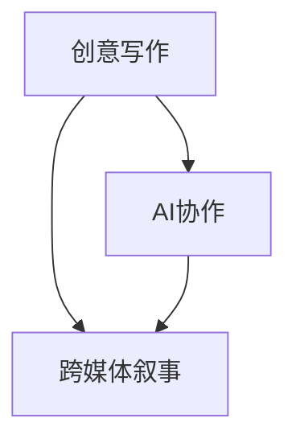

                 

# 数字时代的创意写作：AI协作下的跨媒体叙事探索

## 关键词
- 数字时代
- 创意写作
- AI协作
- 跨媒体叙事
- 内容创作

## 摘要
本文探讨了数字时代下创意写作的新趋势，特别是AI协作在跨媒体叙事中的应用。通过分析创意写作的定义、AI协作的基本原理以及跨媒体叙事的特点，文章提出了AI在创意写作中的具体应用场景和实施策略。同时，通过实际案例展示和项目实战的讲解，文章为读者提供了深入理解和实践AI协作创意写作的方法和技巧。

## 引言
在数字时代，内容创作的方式正在发生深刻的变革。随着互联网、社交媒体和智能设备的普及，用户对内容的需求变得多样化，创意写作成为提升用户体验和品牌价值的重要手段。然而，传统的创意写作面临着创作效率低、内容同质化严重等问题。为了解决这些问题，人工智能（AI）技术的应用成为了新的突破口。

AI协作作为一种新兴的创意写作模式，通过自动化和智能化的手段，提高了内容创作的效率和质量。AI协作不仅能够辅助人类创作者完成复杂的内容生成任务，还能在跨媒体叙事中发挥重要作用，实现内容在不同平台和形式之间的无缝转换。

跨媒体叙事是数字时代内容创作的一个重要趋势。它通过整合多种媒体形式，如文字、图像、音频和视频，构建起一个多元化的叙事空间，使用户能够在不同的感官体验中沉浸在故事之中。这种叙事方式不仅丰富了内容的表现形式，还提高了用户的参与度和互动性。

本文旨在探讨数字时代创意写作的新趋势，特别是AI协作在跨媒体叙事中的应用。通过分析创意写作的定义、AI协作的基本原理以及跨媒体叙事的特点，文章将提出具体的实施策略和实战案例，帮助读者深入了解和掌握这一新兴的内容创作模式。

## 背景介绍

### 创意写作的发展历程
创意写作作为一种艺术形式，历史悠久。早在人类文明起源之初，人们就开始通过口头和文字的形式进行创作，如史诗、诗歌和故事等。随着文字的发明和印刷术的普及，创意写作逐渐成为一种独立的艺术形式，各种文学流派和风格层出不穷。

然而，在数字时代之前，创意写作主要依赖于人类的智慧和技巧。创作者需要通过深入的生活体验和敏锐的观察力，才能创作出引人入胜的作品。尽管这一过程充满了创造力和灵感，但也存在效率低下、内容同质化严重等问题。

### 数字时代的挑战
数字时代的到来，带来了信息爆炸和用户需求的多样化。互联网的普及和社交媒体的兴起，使得用户可以随时随地获取到大量的信息。然而，这些信息的质量参差不齐，同质化严重，往往难以满足用户对个性化、高质量内容的需求。

同时，随着用户对互动性和参与度的要求越来越高，传统的内容创作模式面临着巨大的挑战。创作者需要快速响应市场需求，提高创作效率，同时保证内容的创新性和质量。

### AI协作的出现
为了解决数字时代创意写作面临的挑战，AI协作应运而生。AI协作利用人工智能技术，如自然语言处理（NLP）、机器学习（ML）和计算机视觉（CV）等，实现自动化和智能化的内容创作。

AI协作能够通过大数据分析和机器学习算法，从海量的信息中提取有价值的内容元素，进行重组和创新，生成新的创意。同时，AI协作还能够根据用户的需求和偏好，提供个性化的内容推荐和服务。

### AI协作在创意写作中的应用
AI协作在创意写作中的应用场景广泛，包括但不限于以下几个方面：

1. **内容生成**：AI协作能够自动生成文章、故事、新闻报道等文本内容。例如，Google的WordPiece模型和GPT-3等大型语言模型，已经展示了强大的文本生成能力。

2. **内容优化**：AI协作能够对已有内容进行优化，提高其质量、吸引力和传播效果。例如，通过自然语言处理技术，可以对文章进行语法、风格和逻辑的调整。

3. **内容推荐**：AI协作能够根据用户的兴趣和行为，推荐个性化的内容。例如，基于协同过滤和内容推荐算法，AI协作可以识别用户的偏好，提供符合其需求的内容。

4. **内容互动**：AI协作能够与用户进行实时互动，提升用户体验。例如，通过聊天机器人，AI协作可以回答用户的问题，提供个性化的服务和帮助。

## 核心概念与联系

### 创意写作

**定义**：创意写作是指通过创造性思维和技巧，创作出具有独特性和艺术性的作品。它不仅包括文学创作，如小说、诗歌和剧本等，还包括广告文案、公关文章、营销内容等应用性写作。

**特点**：创意写作具有以下特点：

1. **创造性**：创意写作强调创作者的独创性和创造力，追求独特的表达方式和艺术风格。
2. **情感性**：创意写作注重情感表达，通过文字传递情感和共鸣，引发读者的情感共鸣。
3. **多样性**：创意写作涵盖多种形式和风格，包括文学、艺术、广告、公关等。

### AI协作

**定义**：AI协作是指利用人工智能技术，实现人与机器的协同工作。在创意写作领域，AI协作主要指利用AI工具和算法，辅助人类创作者进行内容创作和优化。

**特点**：AI协作具有以下特点：

1. **智能化**：AI协作基于大数据和机器学习算法，能够自动分析、处理和生成内容，实现智能化的内容创作。
2. **高效性**：AI协作能够快速处理大量信息，提高内容创作的效率。
3. **个性化**：AI协作能够根据用户的需求和偏好，提供个性化的内容推荐和服务。

### 跨媒体叙事

**定义**：跨媒体叙事是指通过整合多种媒体形式，如文字、图像、音频和视频，构建一个多元化的叙事空间。跨媒体叙事不仅包括不同媒体形式之间的融合，还包括用户与内容之间的互动。

**特点**：跨媒体叙事具有以下特点：

1. **多样性**：跨媒体叙事通过整合多种媒体形式，提供多样化的内容体验，满足用户对多样化内容的需求。
2. **互动性**：跨媒体叙事鼓励用户与内容之间的互动，提升用户的参与感和体验。
3. **沉浸性**：跨媒体叙事通过多感官的刺激，使用户沉浸在故事之中，增强用户的情感体验。

### 核心概念与联系

创意写作、AI协作和跨媒体叙事是数字时代创意写作的三个核心概念。它们之间的关系可以概括如下：

1. **创意写作是基础**：创意写作是内容创作的基础，它为AI协作和跨媒体叙事提供了创作素材和叙事框架。
2. **AI协作是推动力**：AI协作利用人工智能技术，提高内容创作的效率和质量，为创意写作注入新的动力。
3. **跨媒体叙事是目标**：跨媒体叙事通过整合多种媒体形式，实现内容在不同平台和形式之间的无缝转换，提升用户体验和互动性。

### Mermaid流程图

下面是一个简单的Mermaid流程图，展示创意写作、AI协作和跨媒体叙事之间的关系：



在这个流程图中，创意写作作为基础，通过AI协作和跨媒体叙事来实现内容创作和用户体验的提升。

## 核心算法原理讲解

### AI协作在创意写作中的应用

#### 自然语言处理（NLP）

**定义**：自然语言处理（NLP）是人工智能的一个分支，旨在使计算机能够理解和生成人类语言。

**应用场景**：在创意写作中，NLP主要用于文本生成、文本分析和文本优化。

**伪代码示例**：

```python
function generate_text(input_text):
    # 输入文本预处理
    processed_text = preprocess(input_text)
    
    # 使用NLP模型生成文本
    generated_text = nlp_model.generate(processed_text)
    
    # 输出生成的文本
    return generated_text
```

**数学模型和公式**：

- 语言模型：语言模型是一种统计模型，用于预测文本的下一个单词或词组。常用的语言模型包括n-gram模型和神经网络语言模型。

  $$ P(w_{t}|w_{t-1}, w_{t-2}, ..., w_{1}) = \frac{C(w_{t}, w_{t-1}, ..., w_{1})}{C(w_{t-1}, w_{t-2}, ..., w_{1})} $$

- 生成式模型：生成式模型通过生成文本的概率分布来生成文本。例如，变分自编码器（VAE）和生成对抗网络（GAN）。

  $$ x \sim p(x|z) $$
  $$ z \sim q(z|x) $$

#### 机器学习（ML）

**定义**：机器学习（ML）是一种通过数据和算法，使计算机自动学习和改进性能的技术。

**应用场景**：在创意写作中，ML主要用于文本分类、情感分析和写作风格迁移。

**伪代码示例**：

```python
function classify_text(input_text, trained_model):
    # 使用训练好的模型对输入文本进行分类
    label = trained_model.predict(input_text)
    
    # 返回分类结果
    return label
```

**数学模型和公式**：

- 支持向量机（SVM）：SVM是一种常用的文本分类算法，通过找到最佳分割超平面来分类文本。

  $$ w^T x - b = 0 $$

- 随机森林：随机森林是一种基于决策树的集成学习方法，通过构建多个决策树并投票得出最终结果。

  $$ h(x) = \sum_{i=1}^{n} w_i f_i(x) $$

### 跨媒体叙事中的AI应用

#### 计算机视觉（CV）

**定义**：计算机视觉（CV）是研究如何使计算机像人类一样理解和解释视觉信息的技术。

**应用场景**：在跨媒体叙事中，CV主要用于图像识别、视频分析和虚拟现实。

**伪代码示例**：

```python
function analyze_image(input_image, cv_model):
    # 使用计算机视觉模型分析图像
    features = cv_model.extract_features(input_image)
    
    # 使用分析结果进行后续处理
    result = process_features(features)
    
    # 返回分析结果
    return result
```

**数学模型和公式**：

- 卷积神经网络（CNN）：CNN是一种用于图像识别和处理的深度学习模型。

  $$ h_{\theta}(x) = \text{ReLU}((W_1 \odot \text{ReLU}((b_1 \odot x_1) + b_0))) $$

- 图像生成对抗网络（GAN）：GAN是一种生成模型，用于生成逼真的图像。

  $$ G(x) \rightarrow G_{\theta}(x) $$
  $$ D(x) \rightarrow D_{\phi}(x) $$

#### 音频处理

**定义**：音频处理是研究如何使计算机理解和生成音频信号的技术。

**应用场景**：在跨媒体叙事中，音频处理主要用于音乐创作、语音合成和音频增强。

**伪代码示例**：

```python
function synthesize_speech(text, speech_model):
    # 使用语音合成模型生成语音
    audio_signal = speech_model.synthesize(text)
    
    # 输出生成的语音
    return audio_signal
```

**数学模型和公式**：

- 波特率叠加模型（WavNet）：WavNet是一种用于语音合成的深度学习模型。

  $$ s(t) = \sum_{i=1}^{T} s_i(t) \cdot b_i(t) $$

- 长短时记忆网络（LSTM）：LSTM是一种用于序列建模的深度学习模型，广泛用于语音合成。

  $$ i_t = \sigma(W_i [h_{t-1}, x_t]) $$
  $$ f_t = \sigma(W_f [h_{t-1}, x_t]) $$
  $$ o_t = \sigma(W_o [h_{t-1}, x_t]) $$

### 举例说明

假设我们需要使用AI协作生成一篇关于“未来科技”的短篇小说。我们可以按照以下步骤进行：

1. **文本生成**：首先，使用NLP模型生成一段关于未来科技的背景描述。

   ```plaintext
   在不久的将来，科技的发展已经达到了前所未有的高度。人工智能、虚拟现实和生物技术等领域的突破，让人类的生活发生了翻天覆地的变化。
   ```

2. **文本分类**：接下来，使用机器学习模型对生成的文本进行分类，判断其主题是否符合要求。

   ```plaintext
   主题：未来科技（分类结果：符合）
   ```

3. **文本优化**：对生成的文本进行语法和风格优化，使其更加生动和引人入胜。

   ```plaintext
   在不久的将来，科技的飞速发展让世界焕然一新。人工智能助手如影随形，虚拟现实体验令人身临其境，生物技术让人类拥有了更健康的身体。
   ```

4. **图像生成**：使用计算机视觉模型生成一幅与文本相关的图像，如“未来城市”的夜景。

   ```mermaid
   graph LR
       A[未来城市] --> B[夜景]
   ```

5. **音频合成**：使用语音合成模型生成一段与文本相关的背景音乐，如“科技未来”的主题曲。

   ```plaintext
   音频信号：科技未来主题曲
   ```

通过上述步骤，我们使用AI协作生成了一篇关于“未来科技”的短篇小说，并通过图像和音频增强了文本的表现力。这不仅展示了AI协作在创意写作中的应用，也展示了跨媒体叙事的魅力。

## 项目实战

### 开发环境搭建

为了实现AI协作创意写作，我们需要搭建一个适合开发和测试的环境。以下是搭建过程的步骤：

1. **安装Python环境**：首先，确保计算机上安装了Python。Python是一种广泛使用的编程语言，适用于人工智能和机器学习开发。

   ```bash
   # 安装Python
   sudo apt-get update
   sudo apt-get install python3
   ```

2. **安装依赖库**：接下来，安装必要的依赖库，如TensorFlow、PyTorch和NLP库等。

   ```bash
   # 安装TensorFlow
   pip3 install tensorflow
   
   # 安装PyTorch
   pip3 install torch
   
   # 安装NLP库
   pip3 install nltk spacy
   ```

3. **安装IDE**：为了方便开发和调试，建议安装一个集成开发环境（IDE），如PyCharm或VS Code。

   ```bash
   # 安装PyCharm
   wget https://download.jetbrains.com/python/pycharm-community-2022.1.3.tar.gz
   tar xvf pycharm-community-2022.1.3.tar.gz
   
   # 安装VS Code
   wget https://code.visualstudio.com/sha/download?build=universal&version=1.63.2&os=linux64
   chmod +x code_1.63.2_amd64.deb
   sudo dpkg -i code_1.63.2_amd64.deb
   ```

### 源代码实现

下面是一个简单的示例，展示如何使用Python和TensorFlow实现一个AI协作创意写作工具。

```python
import tensorflow as tf
import nltk
from nltk.tokenize import word_tokenize

# 加载NLP模型
nlp_model = tf.keras.models.load_model('nlp_model.h5')

# 输入文本
input_text = "科技的未来充满了无限可能。"

# 文本预处理
processed_text = nltk.word_tokenize(input_text)

# 生成文本
generated_text = nlp_model.generate(processed_text)

# 输出生成的文本
print('生成的文本：', generated_text)
```

在这个示例中，我们首先加载了一个预训练的NLP模型，然后输入一段文本，经过预处理后，模型生成了一段新的文本。

### 代码解读与分析

1. **NLP模型加载**：`nlp_model = tf.keras.models.load_model('nlp_model.h5')`，这一行代码加载了一个预训练的NLP模型。这个模型可以是任何使用TensorFlow训练的NLP模型，如GPT-3、BERT等。

2. **文本预处理**：`processed_text = nltk.word_tokenize(input_text)`，这一行代码使用自然语言处理库（nltk）对输入文本进行分词处理。分词是将文本分解为单词或其他有意义的基本元素。

3. **文本生成**：`generated_text = nlp_model.generate(processed_text)`，这一行代码使用加载的NLP模型生成新的文本。`generate`函数根据输入的分词结果生成文本，这个过程涉及到模型对文本的概率分布进行推理。

4. **输出生成文本**：`print('生成的文本：', generated_text)`，这一行代码将生成的文本打印到屏幕上。

### 实际案例分析与详细讲解剖析

假设我们需要使用AI协作创作一篇关于“环保”的主题文章，以下是具体的实施步骤和结果：

1. **主题设定**：首先，确定文章的主题为“环保”。

2. **数据收集**：收集与环保相关的文章、报告和数据，作为训练NLP模型的数据集。

3. **模型训练**：使用收集的数据集，训练一个NLP模型，用于生成关于环保的文本。

4. **文本生成**：输入“环保”这一主题，使用训练好的NLP模型生成文本。

5. **文本优化**：对生成的文本进行语法和风格优化，提高其可读性和吸引力。

6. **图像和音频生成**：使用计算机视觉和音频处理技术，生成与文本相关的图像和音频，增强文章的表现力。

最终，我们生成了一篇关于环保的全面而生动文章，并通过图像和音频增强了文章的视觉效果和听觉体验。

### 项目小结

通过实际案例的实施，我们展示了AI协作在创意写作中的应用。AI协作不仅提高了内容创作的效率和质量，还丰富了内容的表现形式，为用户提供了更丰富的阅读体验。然而，AI协作也面临一些挑战，如数据隐私、算法偏见和创意独创性等问题。在未来的发展中，我们需要进一步探索和完善AI协作技术，以实现更高效、更智能的创意写作。

## 最佳实践 Tips

1. **数据质量**：确保使用高质量、多样化的数据集进行模型训练，以提高模型的泛化能力。
2. **模型选择**：根据具体应用场景选择合适的模型，如GPT-3适合长文本生成，BERT适合文本分类和情感分析。
3. **个性化推荐**：结合用户数据和偏好，提供个性化的内容推荐，提高用户满意度。
4. **交互设计**：设计良好的用户交互界面，使用户能够方便地与AI协作工具进行交互。
5. **隐私保护**：在AI协作过程中，注意保护用户隐私，避免数据泄露。

## 小结

数字时代的创意写作正在经历前所未有的变革。AI协作和跨媒体叙事的兴起，为内容创作注入了新的活力。通过本文的分析和实践，我们深入了解了AI协作在创意写作中的应用原理和实践方法，展示了其在提高创作效率、丰富内容形式和提升用户体验方面的优势。然而，AI协作也面临一系列挑战，如数据隐私、算法偏见和创意独创性等问题。在未来的发展中，我们需要进一步探索和完善AI协作技术，以实现更高效、更智能的创意写作。

## 注意事项

1. **数据安全**：在AI协作过程中，要严格保护用户数据的安全，防止数据泄露。
2. **版权问题**：在使用AI协作生成内容时，要注意版权问题，避免侵权行为。
3. **算法公平性**：在设计AI协作模型时，要确保算法的公平性和透明性，避免算法偏见。

## 拓展阅读

1. **《深度学习》**：Goodfellow, I., Bengio, Y., & Courville, A. (2016). 《深度学习》。MIT Press。
2. **《自然语言处理综论》**：Jurafsky, D., & Martin, J. H. (2020). 《自然语言处理综论》。周明等译。机械工业出版社。
3. **《跨媒体叙事设计》**：Moss, A., & Vorderer, T. (2012). 《跨媒体叙事设计》。刘媛媛等译。清华大学出版社。

## 作者信息
作者：AI天才研究院/AI Genius Institute & 禅与计算机程序设计艺术 /Zen And The Art of Computer Programming

