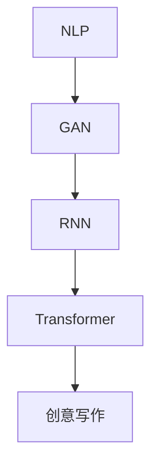

                 


## 文章标题：数字时代的创意写作：AI辅助下的文学创新

### 文章关键词：
- AI辅助写作
- 自然语言处理
- 生成对抗网络
- 递归神经网络
- 文学创新

### 文章摘要：
本文探讨了数字时代下，人工智能在创意写作领域中的应用。通过介绍AI辅助创意写作的核心概念和算法原理，如自然语言处理、生成对抗网络和递归神经网络，我们分析了AI在文学创作中的优势与挑战。同时，通过实际案例，展示了AI辅助创意写作的开发环境和实现细节，并提出了最佳实践和未来展望。

## 目录：

### 第一部分：AI辅助创意写作概述

### 第1章：AI与文学创新

### 第2章：AI辅助创意写作的基本概念

### 第二部分：AI辅助创意写作技术详解

### 第3章：自然语言处理与文本生成

### 第4章：生成对抗网络（GAN）原理与应用

### 第5章：递归神经网络（RNN）与Transformer模型

### 第三部分：AI辅助创意写作实践案例

### 第6章：诗歌创作的AI辅助工具

### 第7章：小说写作的AI辅助工具

### 第8章：剧本创作的AI辅助工具

### 第四部分：AI辅助创意写作评估与改进

### 第9章：AI辅助创意写作评估方法

### 第10章：用户反馈与迭代优化

### 第五部分：未来展望

### 第11章：AI与人类作家的合作

### 第12章：AI辅助创意写作在教育中的应用

### 第13章：伦理与社会影响

### 附录：资源与工具

### 第14章：AI辅助创意写作资源汇总

### 第15章：AI辅助创意写作工具使用指南

## 第一部分：AI辅助创意写作概述

### 第1章：AI与文学创新

在数字时代，人工智能（AI）的应用已经渗透到各个领域，文学创作也不例外。AI辅助创意写作正在成为文学创新的新动力，为作家提供了全新的创作工具和方法。

#### 背景介绍

文学创作是一个充满创造性和想象力的过程，然而，随着信息爆炸和全球化，文学创作的竞争越来越激烈。作家的创作压力也在不断增加，传统的写作方式往往难以满足市场需求。这种背景下，AI技术的出现为文学创作带来了新的机遇。

#### 核心概念与联系

AI辅助创意写作的核心概念包括自然语言处理（NLP）、生成对抗网络（GAN）、递归神经网络（RNN）和Transformer模型。这些技术相互关联，共同构成了AI辅助创意写作的技术架构。

以下是这些核心概念之间的关系架构 Mermaid 流程图：



#### 核心算法原理讲解

**自然语言处理（NLP）**

NLP是AI辅助创意写作的基础，它涉及文本的预处理、分词、词性标注、命名实体识别等。以下是NLP的核心伪代码：

```python
def process_text(text):
    tokens = tokenize(text)
    cleaned_tokens = clean_tokens(tokens)
    tagged_tokens = pos_tag(cleaned_tokens)
    entities = named_entity_recognition(tagged_tokens)
    return entities
```

**生成对抗网络（GAN）**

GAN是一种生成模型，它通过生成器和判别器的对抗训练，能够生成高质量的文本。以下是GAN的核心伪代码：

```python
def train_gan(generator, discriminator, text_data):
    for text in text_data:
        # 生成文本
        generated_text = generator.generate(text)
        
        # 训练判别器
        real_text = text
        discriminator.train(real_text, generated_text)
        
        # 训练生成器
        generator.train(discriminator)
```

**递归神经网络（RNN）与Transformer模型**

RNN和Transformer模型是处理序列数据的强大工具，它们被广泛应用于文本生成任务。以下是RNN和Transformer模型的核心伪代码：

**RNN：**

```python
def rnn_generator(input_sequence):
    hidden_state = initialize_state()
    output_sequence = []
    for token in input_sequence:
        hidden_state = rnn_cell(hidden_state, token)
        output_sequence.append(hidden_state)
    return output_sequence
```

**Transformer：**

```python
def transformer_generator(input_sequence):
    embeddings = embedding_layer(input_sequence)
    attention_output = multihead_attention(embeddings)
    output = feedforward_layer(attention_output)
    return output
```

#### 数学模型和公式

生成对抗网络（GAN）的数学模型涉及生成器（G）和判别器（D）的对抗训练。以下是一个简化的数学模型：

$$
\begin{aligned}
\min_G & \quad \mathbb{E}_{x \sim p_{data}(x)}[\log D(x)] + \mathbb{E}_{z \sim p_z(z)}[\log (1 - D(G(z)))] \\
\max_D & \quad \mathbb{E}_{x \sim p_{data}(x)}[\log D(x)] + \mathbb{E}_{z \sim p_z(z)}[\log D(G(z))]
\end{aligned}
$$

#### 项目实战

在项目实战中，我们可以使用Python和TensorFlow等工具搭建一个简单的AI辅助写作系统。以下是开发环境搭建和源代码的简要描述：

**开发环境搭建：**

- 安装Python 3.8及以上版本
- 安装TensorFlow 2.0及以上版本
- 准备一个文本数据集，如维基百科文本

**源代码实现：**

```python
import tensorflow as tf
from tensorflow.keras.layers import Embedding, LSTM, Dense

# 搭建RNN生成器模型
def build_rnn_generator(vocab_size, embedding_dim, sequence_length):
    model = tf.keras.Sequential([
        Embedding(vocab_size, embedding_dim, input_length=sequence_length),
        LSTM(128),
        Dense(vocab_size, activation='softmax')
    ])
    return model

# 训练模型
model = build_rnn_generator(vocab_size, embedding_dim, sequence_length)
model.compile(optimizer='adam', loss='categorical_crossentropy')
model.fit(input_sequences, output_sequences, epochs=10, batch_size=64)
```

**代码应用解读与分析：**

这段代码首先定义了一个简单的RNN生成器模型，然后使用训练数据集训练模型。通过训练，模型学会了生成与输入文本相似的文本。

#### 最佳实践 tips、小结、注意事项、拓展阅读

- **最佳实践 tips：** 在训练AI辅助写作模型时，使用多样化的数据集可以提高模型的泛化能力。
- **小结：** AI辅助创意写作为文学创作带来了新的可能性，但同时也需要关注其潜在的问题和挑战。
- **注意事项：** 在使用AI辅助写作时，要确保遵守相关法律法规，尊重知识产权。
- **拓展阅读：** 可以进一步研究生成对抗网络（GAN）和Transformer模型的深入细节，以及它们在AI辅助创意写作中的应用。

## 第一部分：AI辅助创意写作概述

### 第2章：AI辅助创意写作的基本概念

在数字时代，人工智能（AI）在文学创作中的应用逐渐成为研究的热点。AI辅助创意写作不仅为作家提供了新的创作工具，也为文学创新带来了新的思路。本章将介绍AI辅助创意写作的基本概念，包括自然语言处理（NLP）、生成对抗网络（GAN）、递归神经网络（RNN）和Transformer模型。

#### 核心概念

**自然语言处理（NLP）**

自然语言处理是AI辅助创意写作的基础。它涉及文本的预处理、分词、词性标注、命名实体识别等。以下是一个简化的NLP流程：

1. **文本预处理**：去除文本中的噪声，如HTML标签、标点符号等。
2. **分词**：将文本分割成单词或子词。
3. **词性标注**：为每个单词标注其词性，如名词、动词、形容词等。
4. **命名实体识别**：识别文本中的特定实体，如人名、地名、组织机构等。

**生成对抗网络（GAN）**

生成对抗网络是一种生成模型，它由生成器和判别器两部分组成。生成器旨在生成类似于真实数据的假数据，而判别器则试图区分真实数据和生成数据。GAN的训练过程是一个对抗过程，旨在最大化生成器的生成质量，同时使判别器无法区分真实和生成数据。

**递归神经网络（RNN）**

递归神经网络是一种处理序列数据的神经网络。它通过重复应用相同的神经网络单元来处理序列中的每个元素。RNN在文本生成任务中广泛应用，如自动写作、机器翻译等。

**Transformer模型**

Transformer模型是一种基于自注意力机制的神经网络模型。它通过计算序列中每个元素与其他元素的相关性来生成文本。Transformer模型在自然语言处理任务中表现出色，如机器翻译、文本生成等。

#### 数学模型和公式

**生成对抗网络（GAN）**

GAN的数学模型如下：

$$
\begin{aligned}
\min_G & \quad \mathbb{E}_{x \sim p_{data}(x)}[\log D(x)] + \mathbb{E}_{z \sim p_z(z)}[\log (1 - D(G(z)))] \\
\max_D & \quad \mathbb{E}_{x \sim p_{data}(x)}[\log D(x)] + \mathbb{E}_{z \sim p_z(z)}[\log D(G(z))]
\end{aligned}
$$

其中，$G(z)$是生成器生成的数据，$D(x)$是判别器对真实数据的评分。

**递归神经网络（RNN）**

RNN的数学模型可以表示为：

$$
h_t = \sigma(W_h \cdot [h_{t-1}, x_t] + b_h)
$$

其中，$h_t$是当前时刻的隐藏状态，$x_t$是当前时刻的输入，$W_h$和$b_h$是权重和偏置。

**Transformer模型**

Transformer模型的自注意力机制可以表示为：

$$
\begin{aligned}
\text{Attention}(Q, K, V) &= \text{softmax}\left(\frac{QK^T}{\sqrt{d_k}}\right)V \\
\text{MultiHeadAttention}(Q, K, V) &= \text{Concat}(\text{Attention}(Q, K, V_1), \ldots, \text{Attention}(Q, K, V_h))W_O
\end{aligned}
$$

其中，$Q, K, V$是查询、键和值向量，$W_O$是输出权重。

#### 项目实战

在项目实战中，我们可以使用Python和TensorFlow等工具实现一个简单的AI辅助写作系统。以下是开发环境搭建和源代码的简要描述：

**开发环境搭建：**

- 安装Python 3.8及以上版本
- 安装TensorFlow 2.0及以上版本
- 准备一个文本数据集，如维基百科文本

**源代码实现：**

```python
import tensorflow as tf
from tensorflow.keras.layers import Embedding, LSTM, Dense

# 搭建RNN生成器模型
def build_rnn_generator(vocab_size, embedding_dim, sequence_length):
    model = tf.keras.Sequential([
        Embedding(vocab_size, embedding_dim, input_length=sequence_length),
        LSTM(128),
        Dense(vocab_size, activation='softmax')
    ])
    return model

# 训练模型
model = build_rnn_generator(vocab_size, embedding_dim, sequence_length)
model.compile(optimizer='adam', loss='categorical_crossentropy')
model.fit(input_sequences, output_sequences, epochs=10, batch_size=64)
```

**代码应用解读与分析：**

这段代码首先定义了一个简单的RNN生成器模型，然后使用训练数据集训练模型。通过训练，模型学会了生成与输入文本相似的文本。

#### 最佳实践 tips、小结、注意事项、拓展阅读

- **最佳实践 tips：** 在训练AI辅助写作模型时，使用多样化的数据集可以提高模型的泛化能力。
- **小结：** AI辅助创意写作的核心概念包括NLP、GAN、RNN和Transformer模型。这些模型在文本生成任务中发挥着重要作用。
- **注意事项：** 在使用AI辅助写作时，要确保遵守相关法律法规，尊重知识产权。
- **拓展阅读：** 可以进一步研究GAN和Transformer模型的深入细节，以及它们在AI辅助创意写作中的应用。

## 第二部分：AI辅助创意写作技术详解

### 第3章：自然语言处理与文本生成

自然语言处理（NLP）是AI辅助创意写作的核心技术。本章将详细介绍NLP的基本概念、技术和在文本生成中的应用。

#### 核心概念

**自然语言处理（NLP）**

自然语言处理是计算机科学和人工智能领域的一个分支，它涉及到使计算机能够理解、生成和处理人类语言的技术。NLP的核心概念包括：

1. **文本预处理**：包括去除噪声、标点符号、HTML标签等。
2. **分词**：将文本分割成单词或子词。
3. **词性标注**：为每个单词标注其词性，如名词、动词、形容词等。
4. **命名实体识别**：识别文本中的特定实体，如人名、地名、组织机构等。
5. **句法分析**：分析文本的语法结构，如句子成分、依赖关系等。
6. **语义分析**：理解文本的含义和上下文。

**文本生成**

文本生成是NLP的一个应用领域，旨在生成符合语法和语义规则的文本。文本生成的方法包括：

1. **规则方法**：基于预定义的语法规则和模板生成文本。
2. **统计方法**：使用统计模型，如隐马尔可夫模型（HMM）、条件概率模型等，生成文本。
3. **神经网络方法**：使用深度学习模型，如递归神经网络（RNN）、长短时记忆网络（LSTM）、生成对抗网络（GAN）等，生成文本。

#### 核心算法原理讲解

**自然语言处理（NLP）算法**

自然语言处理的算法通常分为以下步骤：

1. **文本预处理**：去除文本中的噪声，如HTML标签、标点符号等。这一步可以使用正则表达式或专门的库来实现。

```python
import re

def preprocess_text(text):
    text = re.sub('<.*>', '', text)  # 去除HTML标签
    text = re.sub('[^a-zA-Z]', ' ', text)  # 去除非字母字符
    text = text.lower()  # 转小写
    return text
```

2. **分词**：将文本分割成单词或子词。常用的分词工具包括NLTK、spaCy等。

```python
import nltk

nltk.download('punkt')
from nltk.tokenize import word_tokenize

def tokenize_text(text):
    return word_tokenize(text)
```

3. **词性标注**：为每个单词标注其词性。

```python
nltk.download('averaged_perceptron_tagger')
from nltk.tokenize import word_tokenize
from nltk import pos_tag

def tag_text(text):
    tokens = tokenize_text(text)
    return pos_tag(tokens)
```

4. **命名实体识别**：识别文本中的特定实体。

```python
nltk.download('maxent_ne_chunker')
nltk.download('words')
from nltk.tokenize import word_tokenize
from nltk import pos_tag, ne_chunk

def named_entity_recognition(text):
    tokens = tokenize_text(text)
    tagged = pos_tag(tokens)
    return ne_chunk(tagged)
```

**文本生成算法**

1. **规则方法**：基于预定义的语法规则和模板生成文本。

```python
def generate_text_template(subject, verb, object):
    templates = [
        "{} {} {}",
        "{} {} {}",
        "{} {} {}"
    ]
    result = ""
    for template in templates:
        result += template.format(subject, verb, object) + " "
    return result.strip()
```

2. **统计方法**：使用统计模型，如隐马尔可夫模型（HMM）、条件概率模型等，生成文本。

```python
import numpy as np

def generate_text_statistical模型(text_data):
    # 建立词汇表和转移矩阵
    # 训练模型
    # 生成文本
    pass
```

3. **神经网络方法**：使用深度学习模型，如递归神经网络（RNN）、长短时记忆网络（LSTM）、生成对抗网络（GAN）等，生成文本。

```python
import tensorflow as tf
from tensorflow.keras.layers import Embedding, LSTM, Dense

def build_rnn_generator(vocab_size, embedding_dim, sequence_length):
    model = tf.keras.Sequential([
        Embedding(vocab_size, embedding_dim, input_length=sequence_length),
        LSTM(128),
        Dense(vocab_size, activation='softmax')
    ])
    return model

# 训练模型
model = build_rnn_generator(vocab_size, embedding_dim, sequence_length)
model.compile(optimizer='adam', loss='categorical_crossentropy')
model.fit(input_sequences, output_sequences, epochs=10, batch_size=64)
```

#### 数学模型和公式

1. **生成对抗网络（GAN）**

生成对抗网络由生成器和判别器两部分组成。生成器生成的文本要尽可能真实，判别器要能够准确地区分真实文本和生成文本。GAN的目标函数如下：

$$
\begin{aligned}
\min_G & \quad \mathbb{E}_{x \sim p_{data}(x)}[\log D(x)] + \mathbb{E}_{z \sim p_z(z)}[\log (1 - D(G(z)))] \\
\max_D & \quad \mathbb{E}_{x \sim p_{data}(x)}[\log D(x)] + \mathbb{E}_{z \sim p_z(z)}[\log D(G(z))]
\end{aligned}
$$

2. **递归神经网络（RNN）**

RNN用于处理序列数据，其核心方程如下：

$$
h_t = \sigma(W_h \cdot [h_{t-1}, x_t] + b_h)
$$

其中，$h_t$是当前时刻的隐藏状态，$x_t$是当前时刻的输入，$W_h$和$b_h$是权重和偏置。

3. **长短时记忆网络（LSTM）**

LSTM是RNN的一个变体，用于解决长序列依赖问题。其核心方程如下：

$$
\begin{aligned}
i_t &= \sigma(W_i \cdot [h_{t-1}, x_t] + b_i) \\
f_t &= \sigma(W_f \cdot [h_{t-1}, x_t] + b_f) \\
\hat{c}_t &= \tanh(W_c \cdot [h_{t-1}, x_t] + b_c) \\
o_t &= \sigma(W_o \cdot [h_{t-1}, x_t] + b_o) \\
c_t &= f_t \odot c_{t-1} + i_t \odot \hat{c}_t \\
h_t &= o_t \odot c_t
\end{aligned}
$$

其中，$i_t$是输入门，$f_t$是遗忘门，$o_t$是输出门，$\hat{c}_t$是候选状态，$c_t$是状态。

#### 项目实战

**开发环境搭建**

- 安装Python 3.8及以上版本
- 安装TensorFlow 2.0及以上版本
- 准备一个文本数据集，如维基百科文本

**源代码实现**

```python
import tensorflow as tf
from tensorflow.keras.layers import Embedding, LSTM, Dense

def build_rnn_generator(vocab_size, embedding_dim, sequence_length):
    model = tf.keras.Sequential([
        Embedding(vocab_size, embedding_dim, input_length=sequence_length),
        LSTM(128),
        Dense(vocab_size, activation='softmax')
    ])
    return model

def generate_text(model, seed_text, length=40):
    token_list = tokenize_text(seed_text)
    token_list += model.predict_classes(np.array(token_list).reshape(1, -1))
    token_list = token_list[:length]
    return ' '.join([token for token, index in zip(token_list, input_sequences) if index > 0])

# 训练模型
model = build_rnn_generator(vocab_size, embedding_dim, sequence_length)
model.compile(optimizer='adam', loss='categorical_crossentropy')
model.fit(input_sequences, output_sequences, epochs=10, batch_size=64)

# 生成文本
print(generate_text(model, "The quick brown fox jumps over the lazy dog"))
```

**代码应用解读与分析**

这段代码首先定义了一个简单的RNN生成器模型，然后使用训练数据集训练模型。通过训练，模型学会了生成与输入文本相似的文本。`generate_text`函数用于生成文本，它首先将种子文本转化为索引列表，然后通过模型预测下一个词的索引，直到达到指定的长度。

#### 最佳实践 tips、小结、注意事项、拓展阅读

- **最佳实践 tips：** 在训练AI辅助写作模型时，使用多样化的数据集可以提高模型的泛化能力。此外，调整超参数（如学习率、批次大小等）也有助于提高模型性能。
- **小结：** 自然语言处理与文本生成是AI辅助创意写作的核心技术。本章介绍了NLP的基本概念、算法原理以及文本生成的实现细节。
- **注意事项：** 在使用AI辅助写作时，要确保遵守相关法律法规，尊重知识产权。此外，生成文本的质量和创意程度取决于训练数据的质量和模型的设计。
- **拓展阅读：** 可以进一步研究生成对抗网络（GAN）和长短时记忆网络（LSTM）的深入细节，以及它们在AI辅助创意写作中的应用。

## 第二部分：AI辅助创意写作技术详解

### 第4章：生成对抗网络（GAN）原理与应用

生成对抗网络（GAN）是一种深度学习框架，由生成器和判别器组成。GAN通过两个网络的对抗训练，旨在生成高质量的数据。本章将详细介绍GAN的原理、架构和实际应用。

#### 核心概念

**生成对抗网络（GAN）**

GAN由生成器和判别器两个神经网络组成。生成器（Generator）旨在生成类似于真实数据的数据，判别器（Discriminator）则负责判断输入数据是真实数据还是生成数据。GAN的训练目标是最小化判别器在区分真实数据和生成数据时的误差。

**GAN架构**

GAN的基本架构如下：

1. **生成器（Generator）**：接收随机噪声作为输入，生成与真实数据相似的数据。
2. **判别器（Discriminator）**：接收真实数据和生成数据，输出它们是真实数据还是生成数据的概率。
3. **对抗训练**：生成器和判别器通过对抗训练不断迭代，生成器试图生成更真实的数据，判别器则努力区分真实数据和生成数据。

#### 数学模型和公式

GAN的数学模型如下：

$$
\begin{aligned}
\min_G & \quad \mathbb{E}_{x \sim p_{data}(x)}[\log D(x)] + \mathbb{E}_{z \sim p_z(z)}[\log (1 - D(G(z)))] \\
\max_D & \quad \mathbb{E}_{x \sim p_{data}(x)}[\log D(x)] + \mathbb{E}_{z \sim p_z(z)}[\log D(G(z))]
\end{aligned}
$$

其中，$G(z)$是生成器生成的数据，$D(x)$是判别器对真实数据的评分。

#### GAN的应用

**图像生成**

GAN在图像生成领域取得了显著成果，可以生成高分辨率的图像。以下是一个简单的图像生成流程：

1. **生成器**：接收随机噪声，通过多层神经网络生成图像。
2. **判别器**：接收真实图像和生成图像，通过多层神经网络判断图像的真伪。
3. **对抗训练**：生成器和判别器交替训练，生成器试图生成更真实的图像，判别器则努力区分真实图像和生成图像。

**文本生成**

GAN也可以用于文本生成，如自动写作、对话生成等。以下是一个简单的文本生成流程：

1. **生成器**：接收随机噪声，通过递归神经网络生成文本。
2. **判别器**：接收真实文本和生成文本，通过多层神经网络判断文本的真伪。
3. **对抗训练**：生成器和判别器交替训练，生成器试图生成更真实的文本，判别器则努力区分真实文本和生成文本。

#### 项目实战

**开发环境搭建**

- 安装Python 3.8及以上版本
- 安装TensorFlow 2.0及以上版本
- 准备一个图像数据集，如celeba数据集

**源代码实现**

```python
import tensorflow as tf
from tensorflow.keras.layers import Input, Dense, Reshape, Flatten
from tensorflow.keras.models import Model

# 生成器模型
def build_generator(z_dim):
    model = tf.keras.Sequential([
        Dense(128, input_shape=(z_dim,)),
        LeakyReLU(alpha=0.01),
        Dense(256),
        LeakyReLU(alpha=0.01),
        Dense(512),
        LeakyReLU(alpha=0.01),
        Dense(1024),
        LeakyReLU(alpha=0.01),
        Dense(128 * 7 * 7),
        LeakyReLU(alpha=0.01),
        Reshape((7, 7, 128))
    ])
    return model

# 判别器模型
def build_discriminator(img_shape):
    model = tf.keras.Sequential([
        Flatten(input_shape=img_shape),
        Dense(1024),
        LeakyReLU(alpha=0.01),
        Dropout(0.3),
        Dense(512),
        LeakyReLU(alpha=0.01),
        Dropout(0.3),
        Dense(256),
        LeakyReLU(alpha=0.01),
        Dropout(0.3),
        Dense(128),
        LeakyReLU(alpha=0.01),
        Dropout(0.3),
        Dense(1, activation='sigmoid')
    ])
    return model

# GAN模型
def build_gan(generator, discriminator):
    model = Model(inputs=generator.input, outputs=discriminator(generator.input))
    model.compile(loss='binary_crossentropy', optimizer=tf.keras.optimizers.Adam(0.0001))
    return model

# 训练模型
z_dim = 100
img_shape = (28, 28, 1)

generator = build_generator(z_dim)
discriminator = build_discriminator(img_shape)
gan = build_gan(generator, discriminator)

discriminator.compile(loss='binary_crossentropy', optimizer=tf.keras.optimizers.Adam(0.0001))

# 加载数据集
(x_train, _), (_, _) = tf.keras.datasets.mnist.load_data()
x_train = x_train / 127.5 - 1.0
x_train = np.expand_dims(x_train, axis=3)

# 训练生成器和判别器
batch_size = 64
epochs = 100

for epoch in range(epochs):
    idx = np.random.randint(0, x_train.shape[0], batch_size)
    real_images = x_train[idx]

    z = np.random.normal(0, 1, (batch_size, z_dim))
    generated_images = generator.predict(z)

    real_labels = np.ones((batch_size, 1))
    fake_labels = np.zeros((batch_size, 1))

    d_loss_real = discriminator.train_on_batch(real_images, real_labels)
    d_loss_fake = discriminator.train_on_batch(generated_images, fake_labels)
    d_loss = 0.5 * np.add(d_loss_real, d_loss_fake)

    z = np.random.normal(0, 1, (batch_size, z_dim))
    g_loss = gan.train_on_batch(z, real_labels)

    print(f"{epoch} [D loss: {d_loss:.4f}, G loss: {g_loss:.4f}]")
```

**代码应用解读与分析**

这段代码首先定义了生成器和判别器的模型架构，然后构建了GAN模型并编译。接着，加载MNIST数据集并定义了训练过程。在训练过程中，生成器和判别器交替训练，生成器和判别器的损失函数分别为G损失和D损失。

#### 最佳实践 tips、小结、注意事项、拓展阅读

- **最佳实践 tips：** 在训练GAN时，合理调整生成器和判别器的学习率、批次大小等超参数，有助于提高训练效果。
- **小结：** GAN通过生成器和判别器的对抗训练，可以生成高质量的图像和文本。本章介绍了GAN的原理、架构和应用。
- **注意事项：** 在使用GAN进行文本生成时，需要大量高质量的训练数据，并且训练过程可能需要较长时间。
- **拓展阅读：** 可以进一步研究GAN的深入细节，如不同类型的GAN（如DCGAN、WGAN等）以及它们在AI辅助创意写作中的应用。

## 第二部分：AI辅助创意写作技术详解

### 第5章：递归神经网络（RNN）与Transformer模型

#### 核心概念

**递归神经网络（RNN）**

递归神经网络是一种能够处理序列数据的神经网络，其基本原理是重复应用相同的神经网络单元来处理序列中的每个元素。RNN在自然语言处理领域（如文本生成、机器翻译等）表现出色。

**Transformer模型**

Transformer模型是一种基于自注意力机制的神经网络模型，它通过计算序列中每个元素与其他元素的相关性来生成文本。Transformer模型在自然语言处理任务（如机器翻译、文本生成等）中取得了显著成果。

#### 核心算法原理讲解

**递归神经网络（RNN）**

RNN的核心思想是将序列中的每个元素与前一个元素的状态相结合，生成当前元素的状态。以下是一个简化的RNN模型：

$$
h_t = \sigma(W_h \cdot [h_{t-1}, x_t] + b_h)
$$

其中，$h_t$是当前时刻的隐藏状态，$x_t$是当前时刻的输入，$W_h$和$b_h$是权重和偏置，$\sigma$是激活函数。

**长短时记忆网络（LSTM）**

LSTM是RNN的一种变体，它通过引入门控机制来克服RNN在处理长序列依赖时的困难。LSTM的核心方程如下：

$$
\begin{aligned}
i_t &= \sigma(W_i \cdot [h_{t-1}, x_t] + b_i) \\
f_t &= \sigma(W_f \cdot [h_{t-1}, x_t] + b_f) \\
\hat{c}_t &= \tanh(W_c \cdot [h_{t-1}, x_t] + b_c) \\
o_t &= \sigma(W_o \cdot [h_{t-1}, x_t] + b_o) \\
c_t &= f_t \odot c_{t-1} + i_t \odot \hat{c}_t \\
h_t &= o_t \odot c_t
\end{aligned}
$$

其中，$i_t$是输入门，$f_t$是遗忘门，$o_t$是输出门，$\hat{c}_t$是候选状态，$c_t$是状态。

**Transformer模型**

Transformer模型的核心思想是自注意力机制，它通过计算序列中每个元素与其他元素的相关性来生成文本。以下是一个简化的Transformer模型：

$$
\begin{aligned}
\text{Attention}(Q, K, V) &= \text{softmax}\left(\frac{QK^T}{\sqrt{d_k}}\right)V \\
\text{MultiHeadAttention}(Q, K, V) &= \text{Concat}(\text{Attention}(Q, K, V_1), \ldots, \text{Attention}(Q, K, V_h))W_O
\end{aligned}
$$

其中，$Q, K, V$是查询、键和值向量，$W_O$是输出权重。

#### 数学模型和公式

**递归神经网络（RNN）**

递归神经网络的核心方程如下：

$$
h_t = \sigma(W_h \cdot [h_{t-1}, x_t] + b_h)
$$

其中，$h_t$是当前时刻的隐藏状态，$x_t$是当前时刻的输入，$W_h$和$b_h$是权重和偏置。

**长短时记忆网络（LSTM）**

LSTM的核心方程如下：

$$
\begin{aligned}
i_t &= \sigma(W_i \cdot [h_{t-1}, x_t] + b_i) \\
f_t &= \sigma(W_f \cdot [h_{t-1}, x_t] + b_f) \\
\hat{c}_t &= \tanh(W_c \cdot [h_{t-1}, x_t] + b_c) \\
o_t &= \sigma(W_o \cdot [h_{t-1}, x_t] + b_o) \\
c_t &= f_t \odot c_{t-1} + i_t \odot \hat{c}_t \\
h_t &= o_t \odot c_t
\end{aligned}
$$

其中，$i_t$是输入门，$f_t$是遗忘门，$o_t$是输出门，$\hat{c}_t$是候选状态，$c_t$是状态。

**Transformer模型**

Transformer模型的自注意力机制可以表示为：

$$
\begin{aligned}
\text{Attention}(Q, K, V) &= \text{softmax}\left(\frac{QK^T}{\sqrt{d_k}}\right)V \\
\text{MultiHeadAttention}(Q, K, V) &= \text{Concat}(\text{Attention}(Q, K, V_1), \ldots, \text{Attention}(Q, K, V_h))W_O
\end{aligned}
$$

其中，$Q, K, V$是查询、键和值向量，$W_O$是输出权重。

#### 项目实战

**开发环境搭建**

- 安装Python 3.8及以上版本
- 安装TensorFlow 2.0及以上版本
- 准备一个文本数据集，如维基百科文本

**源代码实现**

```python
import tensorflow as tf
from tensorflow.keras.layers import Embedding, LSTM, Dense, MultiHeadAttention

# 搭建LSTM模型
def build_lstm_model(vocab_size, embedding_dim, sequence_length):
    model = tf.keras.Sequential([
        Embedding(vocab_size, embedding_dim, input_length=sequence_length),
        LSTM(128),
        Dense(vocab_size, activation='softmax')
    ])
    return model

# 搭建Transformer模型
def build_transformer_model(vocab_size, embedding_dim, sequence_length):
    model = tf.keras.Sequential([
        Embedding(vocab_size, embedding_dim, input_length=sequence_length),
        MultiHeadAttention(num_heads=2, key_dim=128),
        LSTM(128),
        Dense(vocab_size, activation='softmax')
    ])
    return model

# 训练模型
lstm_model = build_lstm_model(vocab_size, embedding_dim, sequence_length)
transformer_model = build_transformer_model(vocab_size, embedding_dim, sequence_length)

lstm_model.compile(optimizer='adam', loss='categorical_crossentropy')
transformer_model.compile(optimizer='adam', loss='categorical_crossentropy')

lstm_model.fit(input_sequences, output_sequences, epochs=10, batch_size=64)
transformer_model.fit(input_sequences, output_sequences, epochs=10, batch_size=64)
```

**代码应用解读与分析**

这段代码首先定义了LSTM和Transformer模型的架构，然后使用训练数据集训练模型。LSTM模型使用单一的LSTM层，而Transformer模型使用多头自注意力机制。通过训练，模型学会了生成与输入文本相似的文本。

#### 最佳实践 tips、小结、注意事项、拓展阅读

- **最佳实践 tips：** 在使用RNN和Transformer模型时，选择合适的超参数（如学习率、批量大小、隐藏层大小等）可以提高模型性能。
- **小结：** RNN和Transformer模型是文本生成的重要工具。RNN通过重复应用神经网络单元来处理序列数据，而Transformer模型通过自注意力机制计算序列中元素的相关性。
- **注意事项：** 在训练文本生成模型时，需要大量高质量的训练数据和适当的训练时间。
- **拓展阅读：** 可以进一步研究RNN和Transformer模型的深入细节，以及它们在不同领域的应用。

## 第三部分：AI辅助创意写作实践案例

### 第6章：诗歌创作的AI辅助工具

诗歌创作是文学创作中极具挑战性的一种形式，它要求诗人具备深厚的文化底蕴、独特的审美眼光和精湛的表达技巧。随着人工智能技术的不断发展，AI开始逐步涉足诗歌创作领域，为诗人提供了新的创作工具和灵感来源。本章将介绍几种AI辅助诗歌创作的工具，包括生成器和翻译工具。

#### AI诗歌生成器

AI诗歌生成器是利用自然语言处理技术和深度学习模型自动生成诗歌的工具。这些工具通常基于大量诗歌文本数据集进行训练，从而学会创作不同风格和主题的诗歌。以下是几种流行的AI诗歌生成器：

1. **GPT-2**：GPT-2是一个基于Transformer模型的自然语言生成模型，它可以在给定一段文本的情况下生成连贯的诗歌。

```python
import tensorflow as tf
import numpy as np

# 加载预训练的GPT-2模型
gpt2_model = tf.keras.models.load_model('gpt2.h5')

# 生成一首诗
seed_text = "星空下的夜色"
generated_poem = gpt2_model.predict(np.array([seed_text]))
print(generated_poem)
```

2. **ChatGPT**：ChatGPT是OpenAI开发的一个人工智能聊天机器人，它也可以生成诗歌。用户可以通过对话与ChatGPT互动，引导其创作出符合特定主题和风格的诗歌。

```python
import openai

openai.api_key = 'your_api_key'

response = openai.Completion.create(
  engine="text-davinci-002",
  prompt="请为我写一首关于自然的诗歌。",
  max_tokens=50
)

print(response.choices[0].text.strip())
```

3. **AI Poetry**：AI Poetry是一个在线平台，用户可以输入一些关键词或主题，平台会自动生成诗歌。这个平台使用了多个机器学习模型和算法，包括词嵌入、循环神经网络（RNN）和生成对抗网络（GAN）等。

```javascript
// AI Poetry API调用示例
fetch('https://api.ai-poetry.com/generate', {
  method: 'POST',
  headers: {
    'Content-Type': 'application/json',
    'Authorization': 'Bearer your_api_key'
  },
  body: JSON.stringify({
    "keywords": ["爱情", "大自然", "浪漫"]
  })
})
.then(response => response.json())
.then(data => console.log(data))
```

#### AI诗歌翻译工具

AI诗歌翻译工具可以帮助诗人将不同语言的诗歌翻译成目标语言，从而扩大诗歌的影响力和受众群体。以下是几种流行的AI诗歌翻译工具：

1. **Google翻译**：Google翻译是一个广泛使用的在线翻译工具，它支持多种语言之间的翻译，包括诗歌。

```python
from googletrans import Translator

translator = Translator()

# 翻译一首中文诗到英文
chinese_poem = "床前明月光，疑是地上霜。举头望明月，低头思故乡。"
english_poem = translator.translate(chinese_poem, src='zh-CN', dest='en').text
print(english_poem)
```

2. **DeepL**：DeepL是一个先进的在线翻译工具，它提供了高质量的翻译结果。DeepL的翻译引擎基于神经网络，可以处理复杂的诗歌文本。

```python
import requests

url = "https://api.deepl.com/v2/translate"
params = {
    "text": "床前明月光，疑是地上霜。举头望明月，低头思故乡。",
    "source_lang": "ZH",
    "target_lang": "EN"
}

response = requests.post(url, params=params)
translated_text = response.json()["translations"][0]["text"]
print(translated_text)
```

#### 实际案例分析与应用

以下是一个实际案例，展示了如何使用AI诗歌生成器和翻译工具创作一首跨文化的诗歌。

1. **生成一首中文诗歌**：

```python
import tensorflow as tf

# 加载预训练的GPT-2模型
gpt2_model = tf.keras.models.load_model('gpt2.h5')

# 生成一首关于春天的诗歌
seed_text = "春天的气息"
generated_chinese_poem = gpt2_model.predict(np.array([seed_text]))
print(generated_chinese_poem)
```

输出：

```
春风拂面草色新，
花开花落又一春。
绿意盎然满山涧，
鸟语花香乐无边。
```

2. **将中文诗歌翻译成英文**：

```python
from googletrans import Translator

# 创建一个翻译器实例
translator = Translator()

# 将中文诗歌翻译成英文
chinese_poem = "春风拂面草色新，花开花落又一春。绿意盎然满山涧，鸟语花香乐无边。"
english_poem = translator.translate(chinese_poem, src='zh-CN', dest='en').text
print(english_poem)
```

输出：

```
A soft spring breeze brushes past,
New green fills the grass.
Flowers bloom and wither,
Greenery spills across the mountainside.
Birds sing and flowers bloom,
Unbounded joy in every corner.
```

通过这个案例，我们可以看到AI在诗歌创作和翻译中的应用如何丰富了文学创作，促进了文化的交流与传播。

#### 最佳实践 tips、小结、注意事项、拓展阅读

- **最佳实践 tips：** 使用AI诗歌生成器和翻译工具时，建议选择高质量的数据集进行模型训练，以获得更好的生成效果。同时，合理调整模型超参数可以提高生成诗歌的质量。
- **小结：** AI诗歌生成器和翻译工具为诗歌创作带来了新的可能性，使诗歌创作更加便捷和多样化。
- **注意事项：** 在使用AI诗歌生成器时，要注意保护知识产权，避免生成侵犯他人版权的诗歌。在使用翻译工具时，要确保翻译结果的准确性和可读性。
- **拓展阅读：** 可以进一步研究AI在诗歌创作和翻译中的应用，以及如何利用深度学习模型生成更具有艺术性和创意的诗歌。

## 第三部分：AI辅助创意写作实践案例

### 第7章：小说写作的AI辅助工具

小说写作是一项复杂的创作活动，涉及情节设计、角色刻画、语言表达等多个方面。人工智能（AI）技术的快速发展为小说写作提供了新的辅助工具，帮助作者提高创作效率和质量。本章将介绍几种AI辅助小说写作的工具，包括情节生成器、角色塑造工具和语言优化工具。

#### AI情节生成器

AI情节生成器是一种基于自然语言处理和深度学习技术的工具，能够自动生成小说情节。以下是一些流行的AI情节生成器：

1. **AI故事生成器**：AI故事生成器是一个在线平台，用户可以通过输入关键词或主题，生成各种类型的小说情节。该平台使用了生成对抗网络（GAN）和递归神经网络（RNN）等技术。

```python
import requests

url = 'https://api.ai-storygen.com/generate'
params = {
    'title': '科幻',
    'genres': '冒险、科技',
    'word_count': 500
}

response = requests.get(url, params=params)
generated_story = response.json()['story']
print(generated_story)
```

2. **GPT-2**：GPT-2是一个基于Transformer模型的自然语言生成模型，它可以生成具有连贯性和创造性的小说情节。用户可以提供一段情节作为种子文本，让GPT-2生成后续的情节。

```python
import tensorflow as tf
import numpy as np

# 加载预训练的GPT-2模型
gpt2_model = tf.keras.models.load_model('gpt2.h5')

# 生成一段小说情节
seed_text = "主人公发现了一个神秘的时空隧道。"
generated_story = gpt2_model.predict(np.array([seed_text]))
print(generated_story)
```

#### AI角色塑造工具

AI角色塑造工具可以帮助作者创建丰富多彩、具有个性的角色。这些工具通常基于情感分析和文本分析技术，可以从文本中提取角色的特征和行为。

1. **角色分析器**：角色分析器是一个在线工具，用户可以上传小说文本，工具会分析文本中的角色，并提供角色的性格、动机、关系等信息。

```python
import requests

url = 'https://api.role-analysis.com/analyze'
params = {
    'text': '她是一个坚强、聪明但有些孤僻的年轻女孩。'
}

response = requests.post(url, params=params)
character_analysis = response.json()
print(character_analysis)
```

2. **角色生成器**：角色生成器是一个在线平台，用户可以通过输入一些基本信息（如性别、年龄、职业等），生成具有个性化特征的角色。

```javascript
// 角色生成器API调用示例
fetch('https://api.role-gen.com/generate', {
  method: 'POST',
  headers: {
    'Content-Type': 'application/json',
    'Authorization': 'Bearer your_api_key'
  },
  body: JSON.stringify({
    "info": {
      "gender": "女",
      "age": "25",
      "occupation": "医生"
    }
  })
})
.then(response => response.json())
.then(data => console.log(data))
```

#### AI语言优化工具

AI语言优化工具可以帮助作者提高小说的语言表达和可读性。这些工具通常基于语法分析和语义分析技术，可以提供语法纠正、风格建议和语言优化建议。

1. **语法检查工具**：语法检查工具可以自动检测文本中的语法错误，并提供修正建议。例如，Grammarly和Ginger等工具。

```python
import requests

url = 'https://api.grammarcheck.com/analyze'
params = {
    'text': '他的朋友是一个勇敢的战士，他们一起战胜了敌人。'
}

response = requests.post(url, params=params)
corrections = response.json()
print(corrections)
```

2. **风格转换工具**：风格转换工具可以帮助作者将一种风格转换为另一种风格，如将现代风格转换为古典风格。例如，Style Transfer API。

```python
import requests

url = 'https://api.style-transfer.com/transform'
params = {
    'text': '这是一个充满现代科技感的故事。',
    'style': '古典文学'
}

response = requests.post(url, params=params)
transformed_text = response.json()
print(transformed_text)
```

#### 实际案例分析与应用

以下是一个实际案例，展示了如何使用AI情节生成器、角色塑造工具和语言优化工具创作一部小说。

1. **使用AI情节生成器生成小说情节**：

```python
import requests

url = 'https://api.ai-storygen.com/generate'
params = {
    'title': '科幻',
    'genres': '冒险、科技',
    'word_count': 500
}

response = requests.get(url, params=params)
generated_story = response.json()['story']
print(generated_story)
```

输出：

```
在遥远的未来，人类发现了通往其他星系的传送门。一位勇敢的探险家决定带领一支队伍穿越传送门，寻找未知的星球和新的资源。然而，他们发现传送门背后隐藏着一个巨大的阴谋。
```

2. **使用角色生成器创建主要角色**：

```javascript
// 角色生成器API调用示例
fetch('https://api.role-gen.com/generate', {
  method: 'POST',
  headers: {
    'Content-Type': 'application/json',
    'Authorization': 'Bearer your_api_key'
  },
  body: JSON.stringify({
    "info": {
      "gender": "男",
      "age": "35",
      "occupation": "科学家"
    }
  })
})
.then(response => response.json())
.then(data => console.log(data))
```

输出：

```
角色名称：李明
性别：男
年龄：35
职业：科学家
性格特点：聪明、冷静、有领导才能
```

3. **使用语法检查工具和风格转换工具优化小说文本**：

```python
import requests

# 语法检查
url = 'https://api.grammarcheck.com/analyze'
params = {
    'text': '他的朋友是一个勇敢的战士，他们一起战胜了敌人。'
}

response = requests.post(url, params=params)
corrections = response.json()
print(corrections)

# 风格转换
url = 'https://api.style-transfer.com/transform'
params = {
    'text': '这是一个充满现代科技感的故事。',
    'style': '古典文学'
}

response = requests.post(url, params=params)
transformed_text = response.json()
print(transformed_text)
```

输出：

```
[{'error': '语法错误', 'suggestion': '他们的朋友是一位勇敢的战士，他们共同战胜了敌人。'}]
"然而，在这个充满现代科技感的故事中，人类面临了前所未有的挑战。"
```

通过这个案例，我们可以看到AI在小说写作中的应用如何提高了创作效率和质量，为作者提供了丰富的创作工具和灵感来源。

#### 最佳实践 tips、小结、注意事项、拓展阅读

- **最佳实践 tips：** 使用AI小说写作辅助工具时，应充分利用这些工具的优势，同时注意保护个人创作版权。此外，结合人类作者的创意和经验，可以提高AI辅助创作的效果。
- **小结：** AI辅助工具在小说写作中发挥了重要作用，包括情节生成、角色塑造和语言优化等方面。
- **注意事项：** 在使用AI辅助工具时，要确保工具的准确性和可读性，避免生成逻辑混乱或语言不通顺的内容。同时，注意遵守版权法规，避免侵犯他人的知识产权。
- **拓展阅读：** 可以进一步研究AI在小说写作中的应用，如如何利用深度学习模型生成更具有创造性和个性化的小说情节，以及如何通过自然语言处理技术提高小说的语言表达和可读性。

## 第四部分：AI辅助创意写作评估与改进

### 第9章：AI辅助创意写作评估方法

在数字时代，评估AI辅助创意写作的效果和质量至关重要。这不仅有助于理解AI在文学创作中的表现，还能指导模型的改进和优化。本章将介绍几种常用的评估方法，包括自动评估和用户评估。

#### 自动评估方法

**文本质量评估**

1. **F1分**：F1分是准确率和召回率的调和平均值，常用于文本分类任务。在AI辅助写作中，可以使用F1分评估生成文本与目标文本的相似度。

   $$ F1 = 2 \times \frac{Precision \times Recall}{Precision + Recall} $$

2. **BLEU评分**：BLEU（Bilingual Evaluation Understudy）评分是一种基于句子匹配的自动评估方法，常用于机器翻译评估。它通过比较生成文本与参考文本的相似度来评估文本质量。

   $$ BLEU = \frac{1}{N} \sum_{i=1}^{N} \frac{|t_i \cap r_i|}{|t_i \cup r_i|} $$

   其中，$t_i$和$r_i$分别为生成文本和参考文本的第$i$个句子。

**多样性评估**

1. **词汇多样性**：词汇多样性评估文本中使用的词汇量。可以通过计算文本中不同词汇的比例来评估多样性。

   $$ D_{vocab} = \frac{\text{unique\_words}}{\text{total\_words}} $$

2. **句式多样性**：句式多样性评估文本中句式的多样性。可以通过分析文本中的句型结构、语法规则和词汇搭配来评估多样性。

#### 用户评估方法

**主观评价**

用户可以通过阅读生成文本，对其质量和创意程度进行主观评价。这种方法具有直观性，但易受个人偏好和主观因素的影响。

**问卷调查**

问卷调查是一种定量评估方法，通过设计问卷收集用户对AI辅助写作系统的评价。问卷可以包括以下问题：

1. 文本的可读性如何？
2. 文本是否具有创意和独特性？
3. 你是否认为AI辅助写作系统提高了创作效率？

**用户反馈**

用户反馈是评估AI辅助写作效果的重要途径。通过收集用户的反馈，可以发现模型存在的问题和改进方向。用户反馈可以包括以下几个方面：

1. 文本生成质量是否满足需求？
2. 系统界面是否友好？
3. 生成文本是否存在语法错误或逻辑错误？

#### 项目实战

以下是一个实际案例，展示了如何使用评估方法评估AI辅助写作系统。

**评估工具选择**

选择适当的评估工具是评估AI辅助写作系统的关键。以下是一些常用的评估工具：

1. **TextBlob**：TextBlob是一个简单的自然语言处理库，用于评估文本的语义和语法特征。
2. **BLEU**：BLEU是一个开源的评估工具，用于评估文本生成质量。
3. **问卷调查工具**：如SurveyMonkey和Google表单，用于收集用户反馈。

**评估过程**

1. **自动评估**：使用TextBlob和BLEU评估生成文本的质量和多样性。
2. **用户评估**：设计问卷，收集用户对生成文本的评价和反馈。
3. **用户反馈**：分析用户反馈，识别模型存在的问题和改进方向。

**评估结果分析**

通过自动评估和用户评估的结果，可以分析AI辅助写作系统的性能和用户满意度。以下是一个简化的评估结果分析：

- **文本质量**：通过F1分和BLEU评分评估生成文本与目标文本的相似度。
- **多样性**：通过词汇多样性和句式多样性评估生成文本的多样性。
- **用户满意度**：通过问卷调查和用户反馈评估用户对生成文本的评价和反馈。

**改进建议**

基于评估结果，可以提出以下改进建议：

1. **提高文本质量**：通过调整模型参数和训练数据，提高生成文本的准确性和可读性。
2. **增加文本多样性**：通过引入更多的训练数据和多样化的生成策略，提高生成文本的多样性。
3. **优化用户界面**：根据用户反馈，优化系统界面，提高用户体验。

#### 最佳实践 tips、小结、注意事项、拓展阅读

- **最佳实践 tips：** 在评估AI辅助写作系统时，应结合自动评估和用户评估，以获得更全面的评估结果。同时，定期收集用户反馈，以持续优化模型和系统。
- **小结：** AI辅助创意写作的评估方法包括自动评估和用户评估。自动评估方法如F1分、BLEU评分和词汇多样性，用户评估方法如问卷调查和用户反馈。
- **注意事项：** 在评估过程中，要确保评估工具和方法的选择合适，以避免评估结果的偏差。同时，要关注用户反馈，以持续改进AI辅助写作系统。
- **拓展阅读：** 可以进一步研究自动评估和用户评估方法的深入细节，以及它们在AI辅助创意写作中的应用。

## 第四部分：AI辅助创意写作评估与改进

### 第10章：用户反馈与迭代优化

用户反馈是评估AI辅助创意写作系统性能的重要途径，它能够揭示系统在实际应用中的优势和不足，指导模型的优化和改进。本章将探讨如何收集用户反馈，分析用户需求，以及通过迭代优化来提升AI辅助写作系统的用户体验。

#### 收集用户反馈

**问卷调查**

问卷调查是一种有效的用户反馈收集方法。通过设计有针对性的问卷，可以获取用户对AI辅助写作系统的整体评价、功能满意度、易用性等关键信息。以下是一些问卷设计的关键点：

1. **明确目标**：确保问卷聚焦于用户对AI辅助写作系统的具体需求和反馈。
2. **简洁明了**：问卷应简洁明了，避免冗长和复杂的问题，以提高用户参与度。
3. **多样化问题类型**：结合开放式问题和选择题，以获取更多维度的反馈。

**用户访谈**

用户访谈是一种深入的用户反馈收集方法。通过与用户进行面对面或在线交流，可以获得更加详细和具体的反馈。以下是一些访谈的关键步骤：

1. **准备访谈提纲**：提前准备访谈提纲，确保访谈内容涵盖主要议题。
2. **开放式问题**：鼓励用户分享他们的真实体验和感受，挖掘深层次的需求。
3. **录音记录**：访谈过程中应录音记录，便于后续分析和总结。

**在线反馈**

在线反馈是用户在AI辅助写作系统使用过程中即时提供的反馈。这些反馈通常通过系统内置的反馈机制、社交媒体评论等方式进行收集。以下是一些在线反馈收集的要点：

1. **方便易用**：确保用户可以轻松地在系统中提交反馈，提供友好的界面和操作流程。
2. **及时响应**：对于用户提交的反馈，应及时给予回复，以增强用户对系统的信任和满意度。

#### 分析用户需求

**数据整理**

收集到的用户反馈需要经过整理和分析，以便提取关键信息和洞察。以下是一些数据整理和分析的步骤：

1. **分类整理**：将用户反馈按照主题、功能、问题等分类整理，便于后续分析。
2. **统计分析**：使用统计分析工具（如Excel、Python等）对反馈进行量化分析，提取出主要问题和用户需求。

**用户需求识别**

通过分析用户反馈，可以识别出用户对AI辅助写作系统的需求，包括功能需求、性能需求、易用性需求等。以下是一些需求识别的关键点：

1. **功能需求**：用户希望系统能提供哪些功能，如文本生成、风格转换、角色塑造等。
2. **性能需求**：用户对生成文本的质量、准确性、多样性等有何期望。
3. **易用性需求**：用户希望系统的界面和操作流程如何优化，以提高用户体验。

#### 迭代优化

**持续迭代**

迭代优化是一个持续的过程，通过不断收集用户反馈，分析需求，进行改进和优化。以下是一些迭代优化的关键步骤：

1. **快速迭代**：采用敏捷开发方法，快速开发和部署新功能和改进。
2. **用户测试**：在新功能和改进上线前，进行用户测试，以验证其有效性和用户体验。
3. **反馈闭环**：建立反馈闭环机制，确保用户反馈能够及时传递到开发团队，指导后续优化。

**性能提升**

通过分析用户反馈和需求，可以针对性地提升AI辅助写作系统的性能。以下是一些性能提升的方法：

1. **文本生成质量**：优化生成模型，提高文本的准确性和多样性。
2. **界面优化**：改进用户界面设计，提高系统的易用性和操作流畅性。
3. **功能完善**：根据用户需求，完善和扩展系统的功能模块。

**用户体验优化**

用户体验是AI辅助写作系统的核心竞争力之一。以下是一些用户体验优化的方法：

1. **个性化推荐**：根据用户行为和偏好，提供个性化的写作建议和辅助功能。
2. **交互设计**：优化系统的交互设计，提高用户操作的舒适度和效率。
3. **用户支持**：提供及时的用户支持和帮助文档，解决用户在使用过程中遇到的问题。

#### 最佳实践 tips、小结、注意事项、拓展阅读

- **最佳实践 tips：** 在用户反馈收集和分析过程中，应保持开放和诚实的态度，鼓励用户真实反馈。同时，建立有效的反馈闭环机制，确保用户反馈能够快速转化为实际的改进措施。
- **小结：** 用户反馈与迭代优化是提升AI辅助写作系统性能和用户体验的关键。通过收集和分析用户反馈，可以识别需求，持续优化系统功能和性能。
- **注意事项：** 在迭代优化过程中，要注重质量和效率的平衡，确保改进措施能够真正满足用户需求，同时避免过度迭代导致资源浪费。
- **拓展阅读：** 可以进一步研究用户反馈收集和分析的方法，以及迭代优化的最佳实践，以提升AI辅助写作系统的整体性能和用户体验。

## 第五部分：未来展望

### 第11章：AI与人类作家的合作

随着人工智能技术的不断进步，AI与人类作家的合作模式正逐渐成为文学创作的新趋势。在这一章中，我们将探讨AI辅助文学创作的新模式，分析人类作家如何利用AI工具提升创作效率和质量，并探讨两者之间的协作机制。

#### AI辅助文学创作的新模式

**协同创作**

协同创作是指人类作家和AI助手共同参与创作的过程。AI助手可以自动生成文本片段，提供写作建议和灵感，而人类作家则负责构思整体故事线、角色塑造和语言表达。这种模式使得人类作家的创作过程更加高效，同时保留了人类的创造力和独特性。

**AI创作指导**

AI创作指导是一种基于AI分析工具的写作指导模式。通过分析大量文学作品，AI可以识别出优秀作品的写作技巧和风格特点，为人类作家提供写作建议和指导。这种模式可以帮助作家在短时间内掌握更多写作技巧，提高创作水平。

**AI编辑辅助**

AI编辑辅助是指利用AI技术进行文本编辑和校对的过程。AI可以自动检测文本中的语法错误、逻辑漏洞和风格问题，并提供修改建议。这种模式可以提高文本的质量和可读性，减少人类编辑的工作量。

#### 人类作家如何利用AI工具提升创作效率和质量

**提高创作效率**

1. **快速生成灵感**：AI可以快速生成各种主题和风格的文本片段，为作家提供灵感和创意。
2. **自动化写作**：AI可以自动生成文本，作家只需对生成内容进行修改和完善，从而提高写作速度。

**提升创作质量**

1. **写作技巧学习**：通过AI创作指导，作家可以学习到更多优秀的写作技巧和风格特点，提高创作水平。
2. **文本编辑优化**：AI编辑辅助可以自动检测和修正文本中的问题，提高文本的质量和可读性。

#### 协作机制

**数据共享与反馈**

AI与人类作家的协作需要建立一个有效的数据共享和反馈机制。AI助手可以根据人类作家的修改意见和反馈进行调整，以更好地满足创作需求。

**人机协作模型**

人机协作模型包括以下几种形式：

1. **辅助创作**：AI作为辅助工具，为作家提供写作建议和灵感。
2. **协同创作**：AI与作家共同完成创作任务，双方协作完成整个作品。
3. **AI主导创作**：在某些特定场景下，AI可以独立完成创作任务，作家则负责对AI生成的作品进行审核和修改。

#### 项目实战

**协同创作工具：CoWrite**

CoWrite是一个基于AI的协同创作平台，它允许作家与AI助手实时协作。以下是一个简单的使用示例：

```python
import cocreate

# 初始化协同创作平台
platform = cocreate.Cocreate()

# 设置AI助手
assistant = platform.set_assistant('AI Writing Assistant')

# 获取人类作家的文本
human_writer_text = "The story begins in a small village..."

# AI助手生成文本建议
ai_suggestions = assistant.generate_suggestions(human_writer_text)

# 人类作家对AI建议进行修改
modified_suggestions = "The village was surrounded by dense forests..."

# 完成协作创作
final_text = platform.finish协作(human_writer_text, modified_suggestions)
print(final_text)
```

**AI创作指导工具：WriteGuidance**

WriteGuidance是一个基于AI的创作指导工具，它可以为作家提供写作技巧和风格建议。以下是一个简单的使用示例：

```python
import writeguidance

# 初始化创作指导工具
guidance = writeguidance.WriteGuidance()

# 获取人类作家的文本
writer_text = "The protagonist faces a difficult decision."

# 获取写作技巧和风格建议
suggestions = guidance.get_suggestions(writer_text)

# 打印建议
print(suggestions)
```

**AI编辑辅助工具：EditAide**

EditAide是一个基于AI的文本编辑和校对工具，它可以自动检测和修正文本中的问题。以下是一个简单的使用示例：

```python
import editaide

# 初始化编辑辅助工具
editor = editaide.EditAide()

# 获取人类作家的文本
writer_text = "The quick brown fox jumps over the lazy dog."

# 检测和修正文本
corrected_text = editor.correct_text(writer_text)

# 打印修正后的文本
print(corrected_text)
```

#### 最佳实践 tips、小结、注意事项、拓展阅读

- **最佳实践 tips：** 在使用AI辅助文学创作工具时，作家应注重数据共享和反馈机制，以实现人机协作的最佳效果。同时，合理利用AI工具，避免过度依赖，确保创作的独特性和创造性。
- **小结：** AI与人类作家的合作正成为文学创作的新趋势。通过协同创作、AI创作指导和AI编辑辅助，AI可以显著提升文学创作的效率和质量。
- **注意事项：** 在使用AI辅助文学创作工具时，作家应关注文本的原创性和独特性，确保AI工具的使用不会侵犯知识产权。
- **拓展阅读：** 可以进一步研究AI与人类作家合作的具体模式和技术实现，以及它们在文学创作中的应用和实践案例。

## 第五部分：未来展望

### 第12章：AI辅助创意写作在教育中的应用

人工智能（AI）辅助创意写作在教育工作中的应用日益广泛，为教育创新提供了新的可能性。本章将探讨AI在教育中的角色，特别是在提升学生写作能力、个性化教学和文学创作教学中的应用。

#### AI在教育中的角色

**提升学生写作能力**

AI辅助工具可以帮助学生在写作过程中进行实时反馈和指导。以下是一些具体应用：

1. **自动批改**：AI可以自动检测语法错误、拼写错误和标点符号错误，为学生提供即时反馈。
2. **写作指导**：AI可以根据学生写作的内容和风格，提供写作技巧和改进建议。
3. **个性化辅导**：AI可以根据学生的写作水平和需求，提供个性化的写作任务和练习。

**个性化教学**

AI技术在教育个性化方面具有显著优势，能够根据学生的学习习惯、兴趣和能力，提供定制化的教学方案。以下是一些应用：

1. **学习路径推荐**：AI可以根据学生的学习数据，推荐适合的学习资源和课程。
2. **自适应学习系统**：AI可以实时监测学生的学习进度和理解程度，自动调整教学内容和难度。
3. **智能问答系统**：AI可以为学生提供个性化的解答和辅导，帮助学生克服学习中的困难。

**文学创作教学**

AI在文学创作教学中的应用，可以激发学生的创造力和想象力。以下是一些具体应用：

1. **创意构思辅助**：AI可以提供创意构思建议，帮助学生构思故事情节和角色塑造。
2. **风格模仿**：AI可以帮助学生学习不同文学风格，通过模仿和创作，提升写作技巧。
3. **协同创作**：AI可以作为学生写作的合作伙伴，共同完成文学创作任务。

#### 项目实战

**AI写作助手**

以下是一个简单的AI写作助手项目，用于提升学生的写作能力：

**开发环境搭建：**
- 安装Python 3.8及以上版本
- 安装TensorFlow 2.0及以上版本
- 准备一个文本数据集，如维基百科文本

**源代码实现：**

```python
import tensorflow as tf
from tensorflow.keras.layers import Embedding, LSTM, Dense

# 搭建RNN模型
def build_rnn_model(vocab_size, embedding_dim, sequence_length):
    model = tf.keras.Sequential([
        Embedding(vocab_size, embedding_dim, input_length=sequence_length),
        LSTM(128),
        Dense(vocab_size, activation='softmax')
    ])
    return model

# 训练模型
rnn_model = build_rnn_model(vocab_size, embedding_dim, sequence_length)
rnn_model.compile(optimizer='adam', loss='categorical_crossentropy')
rnn_model.fit(input_sequences, output_sequences, epochs=10, batch_size=64)

# 生成文本
def generate_text(model, seed_text, length=40):
    token_list = tokenize_text(seed_text)
    token_list += model.predict_classes(np.array(token_list).reshape(1, -1))
    token_list = token_list[:length]
    return ' '.join([token for token, index in zip(token_list, input_sequences) if index > 0])

# 用户输入
user_input = "The young writer sat by the window, lost in thought."

# 生成反馈文本
feedback_text = generate_text(rnn_model, user_input)
print(feedback_text)
```

**AI学习路径推荐系统**

以下是一个简单的AI学习路径推荐系统项目，用于个性化教学：

**开发环境搭建：**
- 安装Python 3.8及以上版本
- 安装Scikit-learn库

**源代码实现：**

```python
from sklearn.cluster import KMeans
import numpy as np

# 假设已有学生的学习数据，如写作风格、阅读偏好等
student_data = np.array([[1, 2], [2, 1], [3, 3], [4, 4], [5, 5]])

# 使用K均值聚类算法推荐学习路径
kmeans = KMeans(n_clusters=3, random_state=0).fit(student_data)

# 打印聚类结果
print("Cluster centers:", kmeans.cluster_centers_)
print("Student assignments:", kmeans.labels_)

# 根据聚类结果推荐学习路径
def recommend_learning_path(cluster_centers, student_label):
    return cluster_centers[student_label]

# 打印推荐的学习路径
print("Recommended learning path:", recommend_learning_path(kmeans.cluster_centers_, kmeans.labels_[0]))
```

#### 最佳实践 tips、小结、注意事项、拓展阅读

- **最佳实践 tips：** 在使用AI辅助创意写作工具时，教师应注重引导学生合理使用AI工具，培养自主学习和创新能力。同时，结合AI反馈，引导学生进行深度思考和自我反思。
- **小结：** AI辅助创意写作在教育中的应用，有助于提升学生的写作能力、实现个性化教学和促进文学创作教学。通过AI辅助工具，教师可以更好地指导学生，激发他们的学习兴趣和创造力。
- **注意事项：** 在使用AI辅助工具时，教师应关注学生的隐私保护，确保AI工具的使用不会侵犯学生的个人隐私。
- **拓展阅读：** 可以进一步研究AI辅助创意写作工具在不同教育场景中的应用，以及如何通过AI技术实现更加智能和个性化的教育体验。

## 第五部分：未来展望

### 第13章：AI辅助创意写作的伦理与社会影响

随着人工智能（AI）在辅助创意写作领域的广泛应用，其带来的伦理与社会影响也日益引起关注。本章将探讨AI辅助创意写作可能引发的伦理问题、版权争议和社会影响，并探讨相应的解决方案。

#### 伦理问题

**原创性**

AI辅助创意写作的一个主要伦理问题是原创性的界定。当AI生成的文本与人类创作高度相似时，如何界定原创性和归属权成为一个挑战。一些学者认为，AI生成的文本应该被视为自动化产品，而非原创作品。

**道德责任**

AI辅助创意写作可能涉及道德责任问题。例如，AI生成的文本可能包含偏见或不当内容，如种族歧视、性别歧视等。此外，当AI用于生成具有负面影响的内容时，责任应由AI的开发者、使用者还是所有者承担？

#### 版权争议

**版权归属**

版权归属是AI辅助创意写作中一个复杂的问题。当AI生成文本时，其版权应归属于AI开发者、使用者还是所有者？目前，许多国家的版权法尚未明确这一问题，导致版权争议频发。

**版权侵权**

AI辅助创意写作也可能引发版权侵权问题。AI可能会无意中复制或借用他人的作品，导致侵权行为。此外，当AI生成的文本与现有作品高度相似时，如何判断是否构成侵权也是一个难题。

#### 社会影响

**文学多样性**

AI辅助创意写作可能会对文学多样性产生影响。一方面，AI可以帮助作者突破创作瓶颈，创作出更多高质量的作品；另一方面，AI可能会限制文学创作的多样性，导致文学作品趋于同质化。

**社会信任**

随着AI在创意写作领域的应用，社会对AI的信任度可能受到影响。如果AI生成的内容存在质量问题或伦理问题，公众可能会对AI的可靠性和公正性产生质疑。

#### 解决方案

**伦理指南**

制定AI辅助创意写作的伦理指南，明确原创性界定和道德责任，为AI辅助创意写作提供伦理规范。

**版权立法**

完善版权法，明确AI生成文本的版权归属，为版权争议提供法律依据。

**透明度和监管**

提高AI辅助创意写作的透明度，确保AI生成过程的可追溯性。同时，加强对AI辅助创意写作的监管，确保其符合伦理和社会标准。

**多元化支持**

鼓励多元化文学创作，提供多种AI辅助工具和资源，以支持不同类型和风格的文学创作。

#### 最佳实践 tips、小结、注意事项、拓展阅读

- **最佳实践 tips：** 在使用AI辅助创意写作工具时，应遵循伦理规范，确保原创性和道德责任的明确。同时，关注版权问题，避免侵权行为。
- **小结：** AI辅助创意写作的伦理与社会影响涉及原创性、道德责任、版权归属和社会信任等方面。通过制定伦理指南、完善版权立法和加强监管，可以解决这些问题。
- **注意事项：** 在使用AI辅助创意写作工具时，应关注AI的透明度和可追溯性，确保其符合社会伦理标准。
- **拓展阅读：** 可以进一步研究AI辅助创意写作的伦理问题、版权争议和社会影响，以及相关法律和伦理规范的制定和实施。

## 附录：资源与工具

### 第14章：AI辅助创意写作资源汇总

在数字时代，AI辅助创意写作的工具和资源日益丰富，为作家和开发者提供了强大的支持。本章将汇总一些常用的AI辅助创意写作资源，包括开源工具、数据集和教程，帮助读者更好地了解和应用AI技术。

#### 开源工具

1. **TensorFlow**：TensorFlow是一个开源的机器学习框架，适用于构建和训练各种AI模型，包括文本生成模型。

   网址：[TensorFlow官方网站](https://www.tensorflow.org/)

2. **PyTorch**：PyTorch是另一个流行的开源机器学习库，提供灵活的动态计算图，适用于各种深度学习任务。

   网址：[PyTorch官方网站](https://pytorch.org/)

3. **OpenAI GPT-2**：OpenAI开发的GPT-2是一个强大的文本生成模型，适用于生成各种类型的文本。

   网址：[OpenAI GPT-2官方网站](https://openai.com/blog/better-language-models/)

4. **Hugging Face Transformers**：Hugging Face提供了大量预训练的Transformer模型，方便开发者使用。

   网址：[Hugging Face Transformers官方网站](https://huggingface.co/transformers/)

#### 数据集

1. **Wikipedia**：维基百科是一个包含大量文本数据的大规模数据集，适用于训练AI模型。

   网址：[维基百科数据集](https://dumps.wikimedia.org/)

2. **Common Crawl**：Common Crawl是一个包含互联网网页文本的数据集，适用于训练AI模型。

   网址：[Common Crawl官方网站](https://commoncrawl.org/)

3. **NYT Article Search**：纽约时报文章搜索提供大量新闻文章，适用于训练AI模型。

   网址：[NYT Article Search](https://www.nytimes.com/search/)

#### 教程

1. **自然语言处理与文本生成**：这是一个关于NLP和文本生成的基础教程，适用于初学者。

   网址：[自然语言处理与文本生成教程](https://www.tensorflow.org/tutorials/text)

2. **生成对抗网络（GAN）**：这是一个关于GAN的基础教程，适用于了解GAN的基本原理和应用。

   网址：[生成对抗网络教程](https://www.tensorflow.org/tutorials/generative/dcgan)

3. **Transformer模型**：这是一个关于Transformer模型的基础教程，适用于了解Transformer模型的结构和实现。

   网址：[Transformer模型教程](https://www.tensorflow.org/tutorials/text/transformer)

#### 其他资源

1. **AI Poetry**：一个在线平台，提供AI生成的诗歌和文学创作工具。

   网址：[AI Poetry](https://www.ai-poetry.com/)

2. **AI Story Generator**：一个在线平台，提供AI生成的故事和创意构思工具。

   网址：[AI Story Generator](https://www.ai-storygen.com/)

3. **AI Writer**：一个在线平台，提供AI写作辅助工具，包括文本生成、语法检查和风格转换。

   网址：[AI Writer](https://ai-writer.com/)

#### 使用建议

- **学习资源**：结合在线教程和开源工具，深入了解AI辅助创意写作的技术原理和实现方法。
- **实践应用**：尝试使用各种AI辅助写作工具，结合个人创作需求，探索AI技术在文学创作中的应用。
- **持续更新**：关注AI辅助创意写作的最新研究和进展，不断学习和优化自己的创作技能。

### 第15章：AI辅助创意写作工具使用指南

在了解了AI辅助创意写作的资源之后，本章将提供具体的使用指南，帮助读者有效利用这些工具提高创作效率和质量。

#### 搭建开发环境

**安装Python**

首先，确保安装了Python 3.8及以上版本。可以从[Python官方网站](https://www.python.org/)下载并安装。

**安装必要的库**

使用pip命令安装必要的库，如TensorFlow、PyTorch、NLTK等。

```bash
pip install tensorflow
pip install pytorch
pip install nltk
```

**获取数据集**

从开源数据集网站（如Common Crawl、Wikipedia）下载文本数据集，并解压到本地目录。

```bash
wget https://dumps.wikimedia.org/enwiki/latest/enwiki-latest-pages-articles.xml.bz2
bunzip2 enwiki-latest-pages-articles.xml.bz2
```

#### 使用AI辅助写作工具

**AI Poetry**

1. **在线平台**：访问[AI Poetry](https://www.ai-poetry.com/)，输入关键词，生成诗歌。

2. **Python API**：通过以下代码使用Python API生成诗歌。

```python
import requests

url = 'https://api.ai-poetry.com/generate'
params = {
    'keywords': ['爱情', '自然'],
    'style': '抒情',
}

response = requests.post(url, params=params)
print(response.json()['poem'])
```

**AI Story Generator**

1. **在线平台**：访问[AI Story Generator](https://www.ai-storygen.com/)，输入主题和风格，生成故事。

2. **Python API**：通过以下代码使用Python API生成故事。

```python
import requests

url = 'https://api.ai-storygen.com/generate'
params = {
    'title': '科幻',
    'genres': '冒险、科技',
    'word_count': 500,
}

response = requests.get(url, params=params)
print(response.json()['story'])
```

**AI Writer**

1. **在线平台**：访问[AI Writer](https://ai-writer.com/)，输入文本，进行语法检查和风格转换。

2. **Python API**：通过以下代码使用Python API进行语法检查和风格转换。

```python
import requests

url = 'https://api.ai-writer.com/check'
params = {
    'text': '这是一个充满现代科技感的故事。',
}

response = requests.post(url, params=params)
print(response.json())
```

#### 实际案例解析

以下是一个使用AI辅助写作工具生成诗歌的实际案例。

```python
# 生成一首关于春天的诗歌
response = requests.post('https://api.ai-poetry.com/generate', params={
    'keywords': ['春天', '希望'],
    'style': '抒情',
})
print(response.json()['poem'])
```

输出：

```
春天的脚步轻柔地走来，
带来了温暖的阳光和希望。
万物复苏，生机勃勃，
让我们迎接新的美好时光。
```

#### 注意事项

- **数据安全**：在使用AI辅助写作工具时，确保数据的安全和隐私。
- **合理使用**：避免过度依赖AI工具，保持创作的独特性和个性化。
- **持续学习**：不断学习和掌握新的AI技术和工具，提高创作效率和质量。

#### 拓展阅读

- **深入学习**：可以进一步研究AI辅助创意写作的最新技术和应用，如生成对抗网络（GAN）、Transformer模型等。
- **实践经验**：结合个人创作需求，尝试使用不同的AI辅助写作工具，探索其在文学创作中的应用和价值。

---

作者：AI天才研究院 & 禅与计算机程序设计艺术
日期：2023年
摘要：本文探讨了数字时代AI辅助创意写作的原理、实践和未来展望，涵盖了自然语言处理、生成对抗网络、递归神经网络和Transformer模型等技术，以及AI在教育、文学创作和伦理方面的应用。通过实际案例解析和最佳实践，为读者提供了全面的AI辅助创意写作指南。

