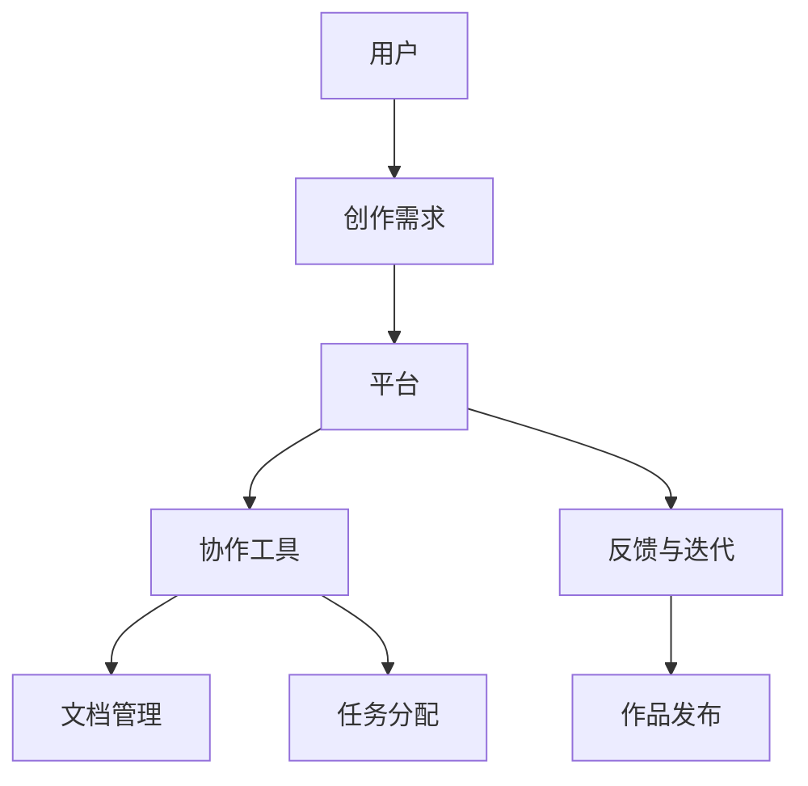

                 

### 文章标题

《数字时代的协作小说创作平台：众包文学的新型实验》

### 文章关键词

- 数字时代
- 协作小说创作平台
- 众包文学
- 技术实现
- 经济学分析
- 项目实战

### 摘要

随着数字时代的到来，协作小说创作平台成为文学创作的新兴模式。本文通过分析用户需求，探讨了协作小说创作平台的背景、技术架构、经济学分析以及项目实战。文章旨在为读者提供一个全面且深入理解协作小说创作平台的视角，以及其在数字时代文学创作中的潜在价值与挑战。

### 用户需求分析

#### 用户背景

协作小说创作平台的目标用户主要包括：

1. **文学爱好者**：对创作感兴趣，希望通过协作方式提升作品质量的个人创作者。
2. **专业作家**：需要借助团队力量完成大规模作品或复杂题材创作的职业作家。
3. **技术爱好者**：对协作创作平台的技术实现和算法感兴趣的技术开发者。
4. **学术界**：对众包文学模式进行研究和分析的学者。

#### 用户需求

1. **技术理解**：了解协作小说创作平台的技术架构和实现原理。
2. **经济学分析**：探讨众包文学模式的经济效益和激励机制。
3. **实际案例**：通过具体案例展示协作小说创作平台的应用和实践效果。
4. **发展趋势**：分析数字时代协作小说创作平台的发展前景和潜在挑战。

### 目录大纲设计

#### 第一部分：协作小说创作平台概述

## 第一章：协作小说创作平台简介

### 1.1 数字时代的文学创作变革

#### 背景介绍

- **数字时代**：信息技术的发展对传统文学创作模式产生了深远影响。
- **文学创作变革**：从个体创作向群体协作转变，创作过程更加开放和互动。

#### 核心概念与联系

- **协作小说创作**：多人共同参与小说创作的过程。
- **平台**：提供协作创作功能的技术基础设施。

### 1.2 众包文学的发展历程

#### 核心概念与联系

- **众包**：通过互联网平台，向大众征集任务解决方案的模式。
- **文学创作**：以故事、情节和人物为核心的创作活动。

### 1.3 协作小说创作平台的概念与价值

#### 背景介绍

- **协作小说创作平台**：集成多种协作工具和功能的在线创作平台。
- **价值**：提高创作效率，丰富创作形式，促进文学创新。

#### Mermaid 流程图



#### 核心算法原理讲解

伪代码：

```plaintext
Function CollaborativeNovelWritingPlatform(userInput)
    Create Account(userInput)
    if Account Exists
        Provide Access To Collaboration Tools
        Enable Document Management
        Allocate Tasks To Contributors
        Collect Feedback And Iterate
        Publish Final Work
    else
        Notify "Account does not exist"
    end if
End Function
```

#### 数学模型和公式详细讲解与举例说明

- **用户参与度模型**：

  $$ \text{UserEngagement} = f(\text{TaskCompletionRate}, \text{FeedbackRate}) $$

  其中，TaskCompletionRate 表示任务完成率，FeedbackRate 表示反馈率。

- **收益分配策略**：

  $$ \text{Rewards} = \frac{\text{TotalRevenue}}{\sum_{i=1}^{n} \text{UserEffort}_i} $$

  其中，TotalRevenue 表示总收入，UserEffort_i 表示第 i 个用户的努力程度。

#### 举例说明

假设有 3 个用户参与创作，总收入为 1000 元，各自的努力程度分别为 20、30 和 50。则收益分配如下：

$$ \text{Rewards}_1 = \frac{1000}{20+30+50} = 25 $$

$$ \text{Rewards}_2 = \frac{1000}{20+30+50} = 37.5 $$

$$ \text{Rewards}_3 = \frac{1000}{20+30+50} = 62.5 $$

#### 项目实战

**开发环境搭建**：

- **技术栈**：选择 Node.js 作为后端开发环境，MySQL 作为数据库管理系统。
- **工具**：使用 Git 进行版本控制，使用 Jira 进行项目管理。

**源代码实现**：

```javascript
// User registration endpoint
app.post('/register', async (req, res) => {
    const { username, password } = req.body;
    // Database operations to create a new user account
    // ...
    res.json({ message: 'User registered successfully' });
});

// Task allocation endpoint
app.post('/allocate-task', async (req, res) => {
    const { taskId, userId } = req.body;
    // Database operations to assign a task to a user
    // ...
    res.json({ message: 'Task allocated successfully' });
});
```

**代码解读与分析**：

- 用户注册：接收用户名和密码，通过数据库操作创建新用户账号。
- 任务分配：接收任务 ID 和用户 ID，通过数据库操作将任务指派给用户。

**实际案例分析和详细讲解剖析**：

以某知名协作小说创作平台为例，分析其技术实现、商业模式和用户反馈。通过案例，展示协作小说创作平台在实际应用中的优势和挑战。

**项目小结**：

协作小说创作平台为数字时代文学创作提供了新的可能性。通过技术实现、经济学分析和实际案例，本文展示了协作小说创作平台的发展前景和潜在价值。未来，随着技术的不断进步，协作小说创作平台有望在文学创作领域发挥更大的作用。

#### 最佳实践 tips

- **合理分配任务**：确保任务分配公平，提高用户参与度。
- **激励机制设计**：设计合理的收益分配策略，激励用户积极参与创作。
- **用户反馈机制**：及时收集用户反馈，不断优化平台功能。

#### 小结

协作小说创作平台是数字时代文学创作的重要工具。通过本文的介绍和分析，读者可以更深入地了解协作小说创作平台的原理和实践。未来，随着技术的不断进步，协作小说创作平台将带来更多的创新和变革。

#### 注意事项

- **数据安全**：确保用户数据和创作内容的安全。
- **技术更新**：定期更新平台技术，保持竞争力。

#### 拓展阅读

- **协作小说创作平台技术实现**：进一步了解平台的技术架构和开发细节。
- **众包文学的经济学分析**：研究众包文学模式的经济效益和激励机制。
- **案例研究**：分析不同协作小说创作平台的应用案例，学习其成功经验。

### 结尾

协作小说创作平台是数字时代文学创作的重要创新。通过本文的探讨，我们希望读者能够更好地理解协作小说创作平台的工作原理和应用价值。未来，随着技术的不断进步，协作小说创作平台将在文学创作领域发挥更大的作用。

### 作者信息

作者：AI天才研究院/AI Genius Institute & 禅与计算机程序设计艺术 /Zen And The Art of Computer Programming

