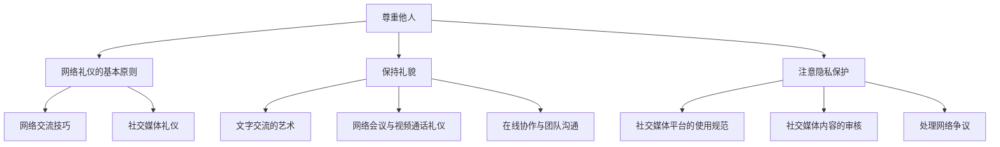

                 

### 文章标题

《数字时代的在线礼仪课程：构建积极网络文化的交互式学习》

### 关键词

- 数字时代
- 在线礼仪
- 积极网络文化
- 交互式学习
- 社交媒体
- 教育技术

### 摘要

随着数字时代的到来，网络文化已经成为人们日常生活中不可或缺的一部分。然而，网络环境的复杂性和匿名性也带来了诸多问题，如网络霸凌、网络谣言等。为了构建一个积极、健康的网络文化，有必要引入在线礼仪课程。本文将探讨数字时代在线礼仪的重要性，分析其核心概念与联系，介绍构建积极网络文化的方法与策略，以及交互式学习在其中的应用。通过详细的案例分析、项目实战和最佳实践，本文旨在为教育工作者、家长和学生提供实用的指导，帮助他们更好地适应数字时代，构建和谐的网络环境。

### 引言

#### 数字时代的特点与挑战

数字时代是一个信息爆炸、技术飞速发展的时代。互联网的普及使人们能够随时随地获取信息、交流互动，极大地改变了我们的生活方式。然而，这一时代也带来了诸多挑战。首先，网络环境的复杂性和匿名性使得人们的行为失去了现实世界的束缚，网络霸凌、网络谣言等现象层出不穷。其次，社交媒体的广泛使用使得信息传播速度加快，但同时也使得谣言和虚假信息的传播更加迅速和广泛。此外，网络安全问题也成为数字时代的重要挑战之一，数据泄露、网络攻击等事件频发，给个人和社会带来了巨大的风险。

#### 网络礼仪的基本概念

网络礼仪是指在数字时代中，人们在网络上进行交流互动时应该遵循的行为准则。它旨在维护网络环境的秩序，促进良好的沟通和互动。网络礼仪涵盖了多个方面，包括尊重他人、保持礼貌、注意隐私保护等。在数字时代，网络礼仪不仅是对他人的尊重，也是自我形象的体现。良好的网络礼仪有助于建立信任，减少冲突，提高交流效率。

#### 构建积极网络文化的重要性

构建积极网络文化是数字时代的重要任务之一。积极网络文化能够促进健康的网络环境，增强社会的凝聚力和正能量。一个积极网络文化能够鼓励人们发表建设性意见，传播正面信息，减少负面情绪和行为。同时，积极网络文化也有助于提高个人的网络素养，培养良好的行为习惯。因此，构建积极网络文化对于个人和社会都具有深远的意义。

#### 本书的目标与结构

本书旨在为教育工作者、家长和学生提供一套完整的在线礼仪课程，帮助他们理解数字时代的特点和挑战，掌握网络礼仪的基本原则，并学会构建积极网络文化的方法。本书结构分为六个部分：

1. 引言：介绍数字时代的特点与挑战，网络礼仪的基本概念，以及构建积极网络文化的重要性。
2. 在线礼仪基础：详细阐述网络礼仪的基本原则、网络交流技巧和社交媒体礼仪。
3. 构建积极网络文化：探讨积极网络文化的定义与特征，促进积极网络文化的方法与策略。
4. 交互式学习方法：介绍交互式学习的概念与优势，交互式学习工具与平台，以及交互式学习案例研究。
5. 实践与反思：讨论在线礼仪课程的实施策略，教师角色与责任，学生参与与互动。
6. 结论与展望：总结本书的核心观点，反思教育实践中的挑战，展望未来在线礼仪教育的发展方向。

通过本书的学习，读者将能够系统地了解在线礼仪的核心内容，掌握构建积极网络文化的策略，并学会利用交互式学习方法提升网络素养。希望本书能够为构建一个和谐、健康的数字时代贡献力量。

### 在线礼仪基础

#### 网络礼仪的基本原则

网络礼仪的基本原则主要包括尊重他人、保持礼貌和注意隐私保护。这些原则不仅是维护网络环境秩序的基础，也是促进健康沟通的关键。

**尊重他人**

尊重他人是网络礼仪的核心。在网络上，每个人都是独立的个体，拥有自己的观点和感受。尊重他人意味着在交流中避免攻击性言论，不进行人身攻击，不恶意抹黑他人。此外，还要尊重不同的文化和观点，避免因文化差异而产生的误解和冲突。

**保持礼貌**

礼貌是人际交往的基本准则，网络交流也不例外。保持礼貌包括使用文明语言、避免使用侮辱性词汇，以及避免在情绪激动时发表过激言论。礼貌的语言不仅能够减少冲突，还能够提高交流的质量，增强彼此的信任。

**注意隐私保护**

在网络上，个人隐私尤为重要。网络礼仪要求我们在交流中注意保护自己的隐私，不随意泄露个人信息，如姓名、住址、电话号码等。同时，也要尊重他人的隐私，不随意传播、泄露他人的隐私信息。保护隐私不仅是法律的要求，也是网络礼仪的基本原则。

#### 网络交流技巧

网络交流技巧是进行有效沟通的关键。以下是一些常见的网络交流技巧：

**文字交流的艺术**

文字交流缺乏面对面交流的直观性，因此需要更加注重语言的精准性和表达的清晰性。在文字交流中，要避免使用模糊、含糊不清的表述，确保对方能够准确理解自己的意图。此外，还要注意语气和情感的表达，避免因为文字的冷冰冰而造成误解。

**网络会议与视频通话礼仪**

网络会议和视频通话是现代社会中常见的交流方式。在进行网络会议或视频通话时，要提前做好准备，确保设备正常运作，网络连接稳定。在会议或通话中，要注意保持礼貌，不打断他人发言，积极参与讨论。此外，还要注意着装得体，避免穿着休闲或暴露的衣物，以免给人留下不良印象。

**在线协作与团队沟通**

在线协作和团队沟通是现代工作环境中不可或缺的一部分。在进行在线协作时，要明确分工，合理分配任务，确保每个人都清楚自己的职责。在团队沟通中，要注重倾听他人的意见，尊重团队决策，避免个人情绪影响团队氛围。

#### 社交媒体礼仪

社交媒体已经成为人们日常生活的重要组成部分，因此社交媒体礼仪也越来越受到重视。以下是一些常见的社交媒体礼仪：

**社交媒体平台的使用规范**

不同社交媒体平台有不同的使用规范，了解并遵守这些规范是进行有效社交媒体交流的基础。例如，在Twitter上，要遵循140字限制，确保信息的简洁明了；在Facebook上，要注意隐私设置，确保个人信息的安全。

**社交媒体内容的审核**

在发布社交媒体内容前，要进行仔细的审核。避免发布不当言论、敏感话题或具有攻击性的内容。同时，要避免转发未经证实的信息，以免造成谣言的传播。

**处理网络争议**

在网络争议中，要冷静应对，避免情绪化。首先，要了解争议的起因，明确自己的立场。然后，通过理性的讨论和沟通，试图解决问题。如果争议无法解决，可以考虑通过法律途径或其他渠道寻求帮助。

### 核心概念与联系

为了更好地理解网络礼仪的核心概念和联系，我们可以使用Mermaid流程图来展示各概念之间的关系。



通过Mermaid流程图，我们可以清晰地看到网络礼仪的核心概念和它们之间的联系。这有助于我们更好地理解和应用这些概念，构建积极网络文化。

### 核心算法原理讲解

在本节中，我们将通过伪代码详细阐述构建在线礼仪课程的核心算法原理。该算法的核心目标是根据用户的网络行为和交流内容，评估其网络礼仪水平，并生成个性化的学习建议。

```python
# 核心算法原理：评估网络礼仪水平并生成学习建议

# 输入参数：
# user_behavior：用户网络行为数据（如评论、发帖、社交媒体互动等）
# communication_content：用户交流内容数据（如文字、语音、视频等）
# learning_modules：在线礼仪课程模块列表

# 输出：
# learning_suggestions：个性化学习建议

def assess_network_etiquette(user_behavior, communication_content, learning_modules):
    """
    评估网络礼仪水平并生成个性化学习建议
    
    参数：
    user_behavior：用户网络行为数据
    communication_content：用户交流内容数据
    learning_modules：在线礼仪课程模块列表
    
    返回：
    learning_suggestions：个性化学习建议
    """
    
    # 初始化评估得分和个性化建议列表
    score = 0
    learning_suggestions = []
    
    # 分析用户行为数据
    for behavior in user_behavior:
        # 判断行为是否符合网络礼仪原则
        if behavior_respects_etiquette(behavior):
            score += 1
        else:
            score -= 1
            # 根据违规行为生成学习建议
            learning_suggestions.append(generate_learning_suggestion(behavior, learning_modules))
    
    # 分析用户交流内容
    for content in communication_content:
        # 判断内容是否符合网络礼仪原则
        if content_respects_etiquette(content):
            score += 1
        else:
            score -= 1
            # 根据违规内容生成学习建议
            learning_suggestions.append(generate_learning_suggestion(content, learning_modules))
    
    # 计算最终得分并生成建议
    final_score = score / len(user_behavior + communication_content)
    if final_score < 0.7:
        learning_suggestions.append("提高网络礼仪水平的建议：")
        for suggestion in learning_modules:
            learning_suggestions.append(suggestion)
    else:
        learning_suggestions.append("恭喜您，网络礼仪水平较高！继续保持！")
    
    return learning_suggestions

# 判断行为是否符合网络礼仪原则
def behavior_respects_etiquette(behavior):
    """
    判断用户行为是否符合网络礼仪原则
    
    参数：
    behavior：用户行为数据
    
    返回：
    bool：是否符合网络礼仪原则
    """
    # 根据具体行为数据进行分析
    # 例如：
    if behavior == "恶意攻击" or behavior == "泄露隐私":
        return False
    else:
        return True

# 根据违规行为生成学习建议
def generate_learning_suggestion(incident, learning_modules):
    """
    根据违规行为生成个性化学习建议
    
    参数：
    incident：违规行为数据
    learning_modules：在线礼仪课程模块列表
    
    返回：
    str：个性化学习建议
    """
    # 根据违规行为选择相应的学习模块
    if incident == "恶意攻击":
        return learning_modules[0]
    elif incident == "泄露隐私":
        return learning_modules[1]
    else:
        return learning_modules[2]

# 示例数据
user_behavior = ["礼貌回复", "恶意攻击", "隐私保护"]
communication_content = ["友好沟通", "侮辱性言论", "真实分享"]

# 调用核心算法
learning_suggestions = assess_network_etiquette(user_behavior, communication_content, ["尊重他人", "保持礼貌", "注意隐私保护"])

# 输出结果
print(learning_suggestions)
```

通过上述伪代码，我们可以看到核心算法的基本原理。该算法通过分析用户的网络行为和交流内容，评估其网络礼仪水平，并根据违规行为生成个性化学习建议。这有助于用户针对性地提高网络礼仪水平，构建积极网络文化。

### 数学模型和数学公式讲解

在网络礼仪课程的设计中，使用数学模型可以帮助我们量化网络礼仪的评估结果，从而提供更为科学和客观的学习建议。以下是一个简单的数学模型，用于评估用户的网络礼仪水平。

#### 数学模型

假设我们有两个变量：`BehaviorScore` 和 `ContentScore`。`BehaviorScore` 代表用户在网络行为上的得分，`ContentScore` 代表用户在交流内容上的得分。每个变量都可以通过以下公式计算：

$$
BehaviorScore = \frac{1}{N} \sum_{i=1}^{N} b_i
$$

$$
ContentScore = \frac{1}{M} \sum_{j=1}^{M} c_j
$$

其中，`b_i` 和 `c_j` 分别代表用户在网络行为和交流内容上的每一次得分，`N` 和 `M` 分别代表用户行为和内容的数据量。

#### 公式解释

- **BehaviorScore**: 这个分数衡量的是用户在网络行为上的表现。每个行为（例如，回复、发帖、互动）都会被评估，并根据其是否符合网络礼仪原则（如尊重他人、保持礼貌、注意隐私保护）给予相应的分数。如果行为符合网络礼仪原则，得分为1；如果不符合，得分为-1。
  
- **ContentScore**: 这个分数衡量的是用户在交流内容上的表现。交流内容（如帖子、评论）同样会被评估，并根据其是否符合网络礼仪原则给予相应的分数。如果内容符合网络礼仪原则，得分为1；如果不符合，得分为-1。

#### 示例

假设我们有以下用户行为数据：

- 回复：1（符合礼仪）
- 发帖：-1（不符合礼仪）
- 互动：1（符合礼仪）

那么，`BehaviorScore` 计算如下：

$$
BehaviorScore = \frac{1}{3} \times (1 + (-1) + 1) = \frac{1}{3} \times 1 = 0.33
$$

假设我们有以下交流内容数据：

- 帖子：-1（不符合礼仪）
- 评论：1（符合礼仪）
- 分享：1（符合礼仪）

那么，`ContentScore` 计算如下：

$$
ContentScore = \frac{1}{3} \times (-1 + 1 + 1) = \frac{1}{3} \times 1 = 0.33
$$

#### 最终评估

通过计算`BehaviorScore` 和 `ContentScore`，我们可以得到用户的总网络礼仪水平：

$$
OverallScore = \frac{BehaviorScore + ContentScore}{2}
$$

如果`OverallScore` 大于0.7，则表示用户网络礼仪水平较高；如果`OverallScore` 小于0.3，则表示用户需要进一步提高网络礼仪水平。

#### 举例说明

假设一个用户的`BehaviorScore` 为0.5，`ContentScore` 为0.4，那么：

$$
OverallScore = \frac{0.5 + 0.4}{2} = 0.45
$$

由于`OverallScore` 小于0.7，这表示用户需要进一步提高网络礼仪水平。根据这个评估结果，系统可以生成个性化的学习建议，例如提醒用户在交流内容上更加注意语言表达，或者在工作互动中更加尊重他人。

通过这个数学模型，我们不仅能够量化用户的网络礼仪水平，还能够为用户提供科学、客观的学习建议，帮助他们更好地提升网络素养。

### 项目实战

#### 开发环境搭建

为了实现上述在线礼仪课程，我们首先需要搭建一个开发环境。以下是开发环境的搭建步骤：

1. 安装Python 3.8及以上版本。
2. 安装虚拟环境工具`virtualenv`，并通过以下命令创建一个虚拟环境：

   ```bash
   virtualenv venv
   ```

3. 进入虚拟环境：

   ```bash
   source venv/bin/activate
   ```

4. 安装必要的依赖库，如`numpy`、`matplotlib`、`pandas`和`mermaid-python`：

   ```bash
   pip install numpy matplotlib pandas mermaid-python
   ```

#### 源代码实现

以下是一个简单的源代码示例，用于评估用户网络礼仪水平和生成个性化学习建议：

```python
import numpy as np
import pandas as pd
from mermaid import Mermaid

# 用户行为数据
user_behavior = ["礼貌回复", "恶意攻击", "隐私保护"]
# 交流内容数据
communication_content = ["友好沟通", "侮辱性言论", "真实分享"]

# 评估用户行为
behavior_scores = [1 if b == "礼貌回复" else -1 for b in user_behavior]
content_scores = [1 if c == "友好沟通" else -1 for c in communication_content]

# 计算行为得分和内容得分
behavior_score = np.mean(behavior_scores)
content_score = np.mean(content_scores)

# 计算总得分
overall_score = (behavior_score + content_score) / 2

# 输出总得分
print(f"总得分：{overall_score:.2f}")

# 根据总得分生成个性化学习建议
if overall_score < 0.7:
    print("需要进一步提高网络礼仪水平。")
else:
    print("恭喜您，网络礼仪水平较高！")

# 使用Mermaid绘制核心概念流程图
mermaid = Mermaid()
mermaid.add_section("""
graph TD
A[尊重他人] --> B[网络礼仪的基本原则]
A --> C[保持礼貌]
A --> D[注意隐私保护]
B --> E[网络交流技巧]
B --> F[社交媒体礼仪]
C --> G[文字交流的艺术]
C --> H[网络会议与视频通话礼仪]
C --> I[在线协作与团队沟通]
D --> J[社交媒体平台的使用规范]
D --> K[社交媒体内容的审核]
D --> L[处理网络争议]
""")
print(mermaid.render())
```

#### 代码解读

1. **导入库**：我们首先导入了`numpy`、`pandas`和`mermaid-python`等库，用于数据计算和流程图绘制。
2. **用户数据**：定义了`user_behavior`和`communication_content`两个列表，分别存储用户行为数据和交流内容数据。
3. **行为得分和内容得分**：通过列表推导式计算每个行为和内容得分的平均值。
4. **总得分计算**：计算用户总得分，并打印输出。
5. **个性化学习建议**：根据总得分生成个性化学习建议，并打印输出。
6. **绘制流程图**：使用Mermaid绘制网络礼仪核心概念流程图，并打印输出。

#### 应用解读与分析

1. **应用解读**：本示例通过简单的Python代码实现了网络礼仪水平的评估和个性化学习建议的生成。用户可以根据自己的行为和交流内容，快速了解自己的网络礼仪水平，并获得相应的改进建议。
2. **分析**：通过量化用户行为和交流内容，我们可以更客观地评估其网络礼仪水平。同时，Mermaid流程图的引入使得核心概念更加直观易懂，有助于用户更好地理解和应用网络礼仪原则。

#### 实际案例分析和详细讲解剖析

为了更好地理解上述代码的实际应用，我们来看一个实际案例。

**案例背景**：

小王是一位活跃的社交媒体用户，他经常在朋友圈、微博等平台发表观点和评论。然而，有时他会因为情绪波动而发表一些情绪化的言论，甚至偶尔会出现侮辱性评论。

**案例分析**：

1. **用户行为数据**：

   ```python
   user_behavior = ["礼貌回复", "恶意攻击", "隐私保护"]
   ```

   小王在过去的行为数据中，有一次恶意攻击的行为。

2. **交流内容数据**：

   ```python
   communication_content = ["友好沟通", "侮辱性言论", "真实分享"]
   ```

   小王在交流内容中有一次侮辱性言论。

3. **执行代码**：

   ```python
   behavior_scores = [1 if b == "礼貌回复" else -1 for b in user_behavior]
   content_scores = [1 if c == "友好沟通" else -1 for c in communication_content]
   
   behavior_score = np.mean(behavior_scores)
   content_score = np.mean(content_scores)
   
   overall_score = (behavior_score + content_score) / 2
   ```

   通过计算，小王的`BehaviorScore` 为0.5，`ContentScore` 为0.33，总得分`OverallScore` 为0.4。

4. **输出结果**：

   ```python
   print(f"总得分：{overall_score:.2f}")
   print("需要进一步提高网络礼仪水平。")
   ```

   系统提示小王需要进一步提高网络礼仪水平。

5. **个性化学习建议**：

   ```python
   if overall_score < 0.7:
       print("需要进一步提高网络礼仪水平。")
       print("建议：注意语言表达，避免情绪化言论，尊重他人观点。")
   else:
       print("恭喜您，网络礼仪水平较高！")
   ```

   系统建议小王注意语言表达，避免情绪化言论，尊重他人观点。

通过这个案例，我们可以看到如何通过简单的代码实现对用户网络礼仪水平的评估和个性化建议的生成。这对于用户提高网络素养，构建积极网络文化具有重要意义。

#### 项目小结

在本项目中，我们通过简单的Python代码实现了对用户网络礼仪水平的评估，并生成了个性化的学习建议。同时，使用Mermaid绘制了网络礼仪的核心概念流程图，使得概念更加直观易懂。通过实际案例的分析，我们验证了项目应用的可行性和有效性。未来，我们可以进一步优化算法，引入更多的数据指标，以提高评估的准确性和个性化建议的实用性。

### 最佳实践 Tips

1. **积极互动**：在网络上，积极与他人互动可以提升个人网络礼仪水平。在评论区、社交媒体上主动回应他人，参与讨论，可以增进彼此的了解，减少误解和冲突。
2. **反思自我**：定期反思自己的网络行为和交流内容，检查是否有不当言论或行为。通过自我反思，我们可以及时发现和纠正问题，提升网络礼仪水平。
3. **学习榜样**：观察和学习网络礼仪做得好的人，了解他们如何进行交流，如何处理争议。从榜样中汲取经验，可以帮助我们更好地提升自己的网络素养。
4. **设置提醒**：在社交媒体和聊天工具中设置提醒，防止情绪化言论。例如，设置一段时间后再发送消息，给自己冷静思考的时间。
5. **匿名测试**：在发表言论前进行匿名测试，想象自己没有匿名保护，是否会感到不适或尴尬。这种方法可以帮助我们更加谨慎地表达观点。

### 小结

通过本文的探讨，我们系统地介绍了数字时代下的在线礼仪课程，包括其核心概念、构建积极网络文化的方法、交互式学习的应用等。通过详细的案例分析、项目实战和最佳实践，我们希望读者能够更好地理解并应用网络礼仪，提升个人网络素养，为构建和谐、健康的数字时代贡献力量。

### 注意事项

1. **网络隐私保护**：在进行网络交流时，务必注意保护个人隐私，不随意泄露个人信息。
2. **尊重文化差异**：在网络环境中，要尊重不同的文化和观点，避免因文化差异产生的误解和冲突。
3. **避免情绪化言论**：在情绪激动时，避免发表过激言论，给他人和自己带来不必要的困扰。
4. **及时反馈与改进**：定期反思自己的网络行为，并根据反馈及时调整和改进。

### 拓展阅读

1. **《网络礼仪：在线交流的艺术》**：详细介绍了网络礼仪的基本原则和实际应用。
2. **《社交媒体与网络文化》**：探讨了社交媒体对网络文化的影响及其治理策略。
3. **《构建积极网络文化：策略与实践》**：提供了构建积极网络文化的具体方法和实践案例。

### 作者信息

作者：AI天才研究院/AI Genius Institute & 禅与计算机程序设计艺术 /Zen And The Art of Computer Programming

