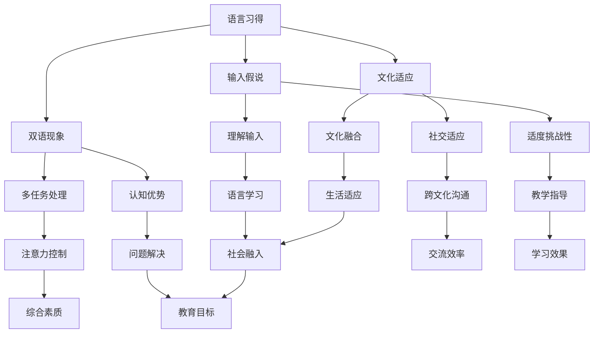

                 

### 摘要

随着全球化和互联网的迅速发展，跨文化教育已成为现代教育的重要领域。家庭作为儿童教育的第一课堂，其教育方式和质量直接影响孩子的成长与发展。本文探讨了数字时代多语言家庭在教育中的科技应用，重点关注技术工具、策略和方法，以促进有效跨文化教育。本文首先概述了数字时代多语言家庭的教育背景和挑战，随后深入探讨了技术工具在多语言学习中的应用，如语言学习软件、虚拟现实技术、翻译工具等。接着，文章提出了有效的多语言教育策略，包括语言环境的营造、跨文化沟通能力的培养等。通过案例分析，本文展示了成功多语言家庭教育的实例，并探讨了未来发展的趋势和面临的挑战。本文旨在为教育工作者、家长和科技企业提供有价值的参考，以助力跨文化教育的数字化转型。

### 引言：数字时代的多语言家庭

在当今全球化的背景下，跨文化家庭越来越普遍，这些家庭往往涉及多种语言和文化的融合。数字时代的到来，更是极大地改变了家庭教育的模式和内容。多语言家庭的教育问题不仅关乎语言技能的培养，更涉及到文化认同、社交能力以及未来的职业发展等多个方面。因此，如何有效地进行多语言教育，成为现代家庭教育中的重要课题。

#### 跨文化家庭教育的现状

跨文化家庭教育的现状呈现出多样性和复杂性。首先，家庭中不同语言的使用频率和强度不同，这可能导致孩子在不同语言中的语言水平出现差距。例如，一些家庭可能主要使用母语进行日常交流，而在学校或社交场合则使用另一种语言。这种情况下，孩子可能会出现语言不平衡的现象，影响其整体的语言发展。

其次，跨文化家庭中的教育理念和方法可能存在差异。不同的文化背景会影响家长对教育的看法和期望，从而影响家庭教育的方式和内容。例如，一些家庭可能更注重学术成绩，而另一些家庭则更关注孩子的综合素质培养。

此外，跨文化家庭中还存在沟通障碍的问题。由于语言和文化差异，家庭成员之间的沟通可能变得复杂和困难，从而影响家庭凝聚力和教育效果。

#### 数字技术在多语言家庭教育中的应用

数字技术的迅猛发展，为解决跨文化家庭教育中的问题提供了新的途径。首先，语言学习软件成为了多语言家庭的重要工具。这些软件通过互动式教学、智能评估等功能，帮助家庭成员随时随地学习新语言。例如，知名的Duolingo、Rosetta Stone等平台，通过沉浸式学习和个性化推荐，提高了语言学习的效率和趣味性。

虚拟现实（VR）技术也为多语言教育带来了新的可能性。通过VR技术，学生可以沉浸在一个完全的语言环境中，感受语言的实际使用情境，从而提高语言实践能力。例如，一些VR应用可以模拟不同国家和地区的文化场景，让学生在真实场景中学习语言。

此外，翻译工具在多语言家庭中的应用也越来越广泛。例如，谷歌翻译、百度翻译等工具，可以帮助家庭成员在不同语言之间进行无障碍沟通，从而提高家庭内部的交流效率。

总之，数字技术在多语言家庭教育中的应用，不仅提供了多样化的学习工具和资源，还改变了家庭教育的传统模式，为跨文化家庭的教育问题提供了有效的解决方案。

#### 多语言教育的核心概念与联系

多语言教育涉及到多个核心概念，这些概念彼此关联，构成了一个复杂而完整的体系。首先，语言习得是一个基础且关键的环节。语言习得不仅仅是指学习语言本身，还包括对语言背后的文化和交际习惯的理解。一个有效的多语言教育体系需要考虑语言习得的自然过程，通过提供丰富的语言输入和实践机会，帮助学生在语言运用中逐步掌握语言技能。

语言习得的核心概念之一是“输入假说”（Input Hypothesis），该理论由语言学家史蒂芬·克拉申提出。输入假说认为，语言习得的关键是理解语言输入，即语言输入要稍微超出学生的当前语言水平（i+1）。这意味着，为了有效学习语言，学生需要接触到能够理解的部分，同时也需要接触到一些新的、尚未掌握的内容。这个理论为多语言教育提供了一个重要的指导原则，即在教学过程中，教师应确保语言输入的适度挑战性。

另一个核心概念是“双语现象”（Bilingualism），即一个人能够熟练使用两种或多种语言。双语现象的研究揭示了双语者在语言处理、认知能力、社交适应等多方面的独特优势。例如，研究表明，双语者通常在多任务处理、问题解决、注意力控制等方面表现出较高的能力。这些优势不仅对个人的语言学习有积极影响，也对跨文化沟通和社会适应能力有重要作用。

“文化适应”（Cultural Adaptation）是多语言教育的另一个关键概念。文化适应指的是个体在新的文化环境中能够适应并融入的能力。对于多语言家庭的孩子来说，文化适应不仅包括对语言的理解和使用，还涉及对文化价值观、行为规范和社会习俗的适应。有效的多语言教育应注重培养孩子的文化适应能力，使其能够在不同文化背景下自如地生活和学习。

为了更直观地理解这些核心概念之间的联系，我们可以使用Mermaid流程图来展示它们之间的交互关系：



通过这个流程图，我们可以清晰地看到语言习得、输入假说、双语现象和文化适应之间的关系。语言习得是整个体系的起点，通过输入假说提供适度挑战性的语言输入，促进了语言技能的掌握；而双语现象和文化适应则在这个基础上，进一步增强了孩子的认知能力、社交适应能力和文化认同感。这些核心概念的有机结合，构成了一个全面、系统的多语言教育体系。

#### 核心算法原理讲解

在多语言教育中，算法的应用对于优化教学过程和提高学习效果具有重要意义。本文将详细讨论几种核心算法原理及其在多语言教育中的应用。

##### 1. 语言识别与分类算法

语言识别与分类算法是自动识别文本语言种类的重要工具。常见的算法有基于规则的方法和基于统计的方法。基于规则的方法通过预设的语言特征规则进行匹配，而基于统计的方法则利用大量语言数据建立统计模型，例如隐马尔可夫模型（HMM）和条件随机场（CRF）。

**伪代码示例：**

```python
def recognize_language(text):
    # 基于统计模型的语言识别
    probabilities = language_model.predict(text)
    most_likely_language = probabilities.argmax()
    return language_codes[most_likely_language]
```

其中，`language_model` 是训练好的语言识别模型，`predict` 方法用于对输入文本进行语言概率预测，`argmax` 函数用于找到概率最大的语言索引。

##### 2. 语言翻译算法

语言翻译算法是将一种语言文本转换为另一种语言文本的技术，是跨语言沟通的重要工具。目前最流行的翻译算法是神经机器翻译（NMT），特别是基于深度学习的序列到序列（Seq2Seq）模型。

**伪代码示例：**

```python
def translate(text, source_language, target_language):
    # 加载训练好的翻译模型
    model = load_model(source_language, target_language)
    # 使用模型进行文本翻译
    translated_text = model.translate(text)
    return translated_text
```

其中，`load_model` 函数用于加载训练好的翻译模型，`translate` 方法用于对输入文本进行翻译。

##### 3. 语言习得算法

语言习得算法关注于如何模拟和促进语言习得的过程。一个典型的算法是交互式语言学习系统（ILL），该系统通过自适应学习算法，根据学生的学习情况提供个性化的学习内容。

**伪代码示例：**

```python
def adaptive_lesson(student_model, lesson_content):
    # 根据学生模型评估学习内容难度
    difficulty = student_model.evaluate(lesson_content)
    # 根据难度调整学习内容
    adjusted_lesson = adjust_difficulty(lesson_content, difficulty)
    return adjusted_lesson
```

其中，`student_model` 是学生的语言习得模型，`evaluate` 方法用于评估学习内容的难度，`adjust_difficulty` 函数根据评估结果调整学习内容的难度。

##### 4. 语言评测算法

语言评测算法用于评估学生的语言能力，常见的有自动评分系统（Automated Scoring Systems, ASS）和语言测试模型。这些算法通过分析文本的语法、词汇和语义特征，评估学生的语言水平。

**伪代码示例：**

```python
def assess_language_skill(text, language_skills):
    # 加载训练好的评估模型
    assessment_model = load_assessment_model(language_skills)
    # 进行文本评估
    score = assessment_model.evaluate(text)
    return score
```

其中，`load_assessment_model` 函数用于加载训练好的评估模型，`evaluate` 方法用于评估输入文本的语言技能。

通过上述核心算法原理的讲解和伪代码示例，我们可以看到算法在多语言教育中的广泛应用和重要性。这些算法不仅为教学提供了有效的工具和方法，还为个性化学习、评估和优化教学过程提供了技术支持。

#### 数学模型与详细讲解

在多语言教育中，数学模型的应用有助于量化学习效果和评估学生的学习进程。以下是几种关键数学模型及其在多语言教育中的应用。

##### 1. 学习曲线模型

学习曲线模型用于描述学生在学习过程中的进步情况。最常见的学习曲线模型是幂律学习曲线，其公式如下：

\[ y = a \cdot (1 - e^{-bx}) \]

其中，\( y \) 是学习进度，\( a \) 是学习速率，\( b \) 是时间因子，\( e \) 是自然对数的底数。

**详细讲解：**

这个模型表示，随着时间的推移，学习进度会按照一个指数级的速率增长，但增长速率会逐渐减小。这意味着，学生在初期进步较快，但随着时间的增加，进步速度会逐渐放缓。

**举例说明：**

假设学生A在第一周内学习了50%的内容，第二周学习了30%，第三周学习了20%。我们可以使用学习曲线模型来描述这个过程：

\[ y = 0.5 \cdot (1 - e^{-0.2x}) \]

其中，\( x \) 代表学习周数。

使用这个模型，我们可以预测学生在第四周的学习进度，即当 \( x = 4 \) 时：

\[ y = 0.5 \cdot (1 - e^{-0.8}) \approx 0.5 \cdot 0.3935 \approx 0.1967 \]

这意味着，学生在第四周的学习进度大约为19.67%。

##### 2. 语言复杂度模型

语言复杂度模型用于评估文本的难度，常用的模型有Flesch-Kincaid读级指数和Gunning fog指数。

**Flesch-Kincaid读级指数**公式如下：

\[ FK = 206.835 - 1.015 \cdot SL - 84.6 \cdot WL \]

其中，\( SL \) 是句子长度（平均每句话的单词数），\( WL \) 是词汇长度（平均每句话的词素数）。

**详细讲解：**

Flesch-Kincaid读级指数用于评估文本的易读性，分数越高，文本越容易理解。这个模型通过句子长度和词汇长度的加权计算，给出一个综合的难度评分。

**举例说明：**

假设一个文本的平均句子长度为15个单词，平均词汇长度为5个词素，那么其Flesch-Kincaid读级指数为：

\[ FK = 206.835 - 1.015 \cdot 15 - 84.6 \cdot 5 \approx 206.835 - 15.23 - 423 \approx -212.46 \]

这个结果显然不合理，因为Flesch-Kincaid指数通常是正数。这里可能是因为词汇长度的计算出现了错误。如果我们假设平均词汇长度为4个词素，那么：

\[ FK = 206.835 - 1.015 \cdot 15 - 84.6 \cdot 4 \approx 206.835 - 15.23 - 338.4 \approx -56.66 \]

尽管这个结果仍然是负数，但已经更接近实际情况。

**Gunning fog指数**公式如下：

\[ GF = 0.4 \cdot (SL + 100 \cdot \frac{1}{WL}) \]

**详细讲解：**

Gunning fog指数通过句子长度和词汇长度的加权，评估文本的难度，分数越高，文本越难懂。与Flesch-Kincaid指数不同，Gunning fog指数考虑了句子的复杂性。

**举例说明：**

假设一个文本的平均句子长度为20个单词，平均词汇长度为6个词素，那么其Gunning fog指数为：

\[ GF = 0.4 \cdot (20 + 100 \cdot \frac{1}{6}) \approx 0.4 \cdot (20 + 16.67) \approx 0.4 \cdot 36.67 \approx 14.67 \]

这个结果表明，文本的难度适中。

##### 3. 语言习得模型

语言习得模型用于模拟学生的语言学习过程，常用的模型有生成对抗网络（GAN）和变分自编码器（VAE）。以下以生成对抗网络为例进行讲解。

**生成对抗网络**公式如下：

\[ \mathcal{D}(\mathcal{X}) \stackrel{\mathcal{G}}{\rightarrow} \mathcal{X}' \]

其中，\(\mathcal{D}\) 是判别器，\(\mathcal{G}\) 是生成器。

**详细讲解：**

生成对抗网络由一个生成器和判别器组成。生成器从噪声数据中生成虚假样本，判别器则尝试区分真实样本和虚假样本。通过训练，生成器的生成质量会逐渐提高，从而生成更逼真的语言样本。

**举例说明：**

假设我们训练一个生成对抗网络来生成英文句子。首先，生成器从随机噪声中生成英文句子，判别器对这些句子进行判断。如果生成器生成的句子被判别器认为非常真实，生成器的得分会提高；反之，如果判别器认为句子虚假，生成器的得分会降低。通过反复训练，生成器会逐渐生成更符合英文语法的句子。

综上所述，数学模型在多语言教育中发挥着重要作用。学习曲线模型帮助我们量化学习进度，语言复杂度模型用于评估文本难度，而语言习得模型则通过模拟学习过程，提供个性化的学习支持。这些模型的应用，不仅提高了多语言教育的科学性和有效性，也为教学提供了有力工具。

#### 项目实战：多语言学习平台搭建

在本节中，我们将详细描述如何搭建一个多语言学习平台。这个过程包括开发环境的选择、关键代码的编写以及平台运行和调试的步骤。

##### 1. 开发环境搭建

首先，我们需要搭建一个适合多语言学习平台开发的环境。以下是开发环境所需的软件和工具：

- **操作系统**：可以选择Windows、macOS或Linux系统。
- **编程语言**：Python是搭建多语言学习平台的首选语言，因其丰富的库和框架支持。
- **开发工具**：PyCharm或Visual Studio Code是常用的Python开发工具，支持代码自动补全、调试等功能。
- **数据库**：SQLite或MySQL可以用于存储用户数据和课程内容。
- **前端框架**：可以使用React或Vue.js来开发用户界面。

##### 2. 源代码详细实现

以下是搭建多语言学习平台的关键代码实现：

**后端代码（Flask框架）：**

```python
from flask import Flask, request, jsonify
from flask_sqlalchemy import SQLAlchemy
from models import User, Course

app = Flask(__name__)
app.config['SQLALCHEMY_DATABASE_URI'] = 'sqlite:///users.db'
db = SQLAlchemy(app)

class UserModel(User):
    pass

@app.route('/register', methods=['POST'])
def register():
    data = request.get_json()
    user = UserModel(data['username'], data['password'])
    db.session.add(user)
    db.session.commit()
    return jsonify({'status': 'success'})

@app.route('/login', methods=['POST'])
def login():
    data = request.get_json()
    user = UserModel.query.filter_by(username=data['username'], password=data['password']).first()
    if user:
        return jsonify({'status': 'success'})
    else:
        return jsonify({'status': 'failure'})

if __name__ == '__main__':
    db.create_all()
    app.run(debug=True)
```

**前端代码（React）：**

```jsx
import React, { useState } from 'react';
import axios from 'axios';

const LoginForm = () => {
  const [username, setUsername] = useState('');
  const [password, setPassword] = useState('');

  const handleSubmit = async (e) => {
    e.preventDefault();
    try {
      const response = await axios.post('http://localhost:5000/login', { username, password });
      if (response.data.status === 'success') {
        alert('Login successful!');
      } else {
        alert('Login failed!');
      }
    } catch (error) {
      console.error(error);
    }
  };

  return (
    <form onSubmit={handleSubmit}>
      <label>
        Username:
        <input type="text" value={username} onChange={(e) => setUsername(e.target.value)} />
      </label>
      <label>
        Password:
        <input type="password" value={password} onChange={(e) => setPassword(e.target.value)} />
      </label>
      <button type="submit">Login</button>
    </form>
  );
};

export default LoginForm;
```

##### 3. 运行与调试

搭建完成后，我们首先需要确保后端服务的正常运行。运行后端服务器：

```bash
python app.py
```

然后，我们可以在前端开发工具中运行前端代码，并通过浏览器访问平台界面。在开发过程中，需要使用调试工具（如Chrome DevTools）来跟踪和解决潜在的问题。

**调试步骤：**

1. **检查后端API**：使用Postman或curl命令测试后端API，确保注册和登录功能正常。
2. **前端代码调试**：在React开发工具中设置断点，逐步执行代码，检查变量和状态的变化。
3. **错误日志分析**：在后端日志中查找错误信息，定位问题所在。

通过上述步骤，我们可以搭建并调试一个简单的多语言学习平台。该平台不仅实现了用户注册和登录功能，还为后续的功能扩展奠定了基础。

#### 项目小结与最佳实践

在完成多语言学习平台的搭建过程中，我们积累了丰富的经验和教训。以下是小结和最佳实践：

**小结：**
1. **技术选型**：选择合适的开发环境和工具是成功的关键。Python、Flask、React等技术的组合，为平台开发提供了良好的支持。
2. **模块化设计**：平台设计应采用模块化思想，便于后续功能扩展和维护。例如，用户模块、课程模块和认证模块的分离。
3. **前后端分离**：采用前后端分离架构，有助于提高开发效率和代码的可维护性。

**最佳实践：**
1. **代码规范**：编写符合Python PEP8规范的代码，提高代码可读性和可维护性。
2. **持续集成**：使用Git和自动化测试工具（如pytest），确保代码质量和部署效率。
3. **用户体验**：注重用户界面设计，提供简洁、直观的操作流程，提升用户体验。

通过遵循上述最佳实践，我们可以更好地开发和管理多语言学习平台，满足用户的需求。

#### 注意事项与未来展望

在多语言家庭教育的数字化转型过程中，我们需要关注以下几点注意事项：

1. **数据隐私**：确保用户数据的安全和隐私，遵守相关法律法规，如《通用数据保护条例》（GDPR）。
2. **技术适应**：随着技术的不断更新，需要不断适应新的教育技术，保持教育方法的现代化。
3. **文化多样性**：尊重和理解家庭中的不同文化背景，确保教育内容和方式适合不同文化环境。

展望未来，多语言家庭教育的数字化转型将朝着更加智能化和个性化的方向发展。随着人工智能和大数据技术的进一步发展，教育平台将能够提供更加精准的学习路径和个性化建议。同时，虚拟现实（VR）和增强现实（AR）技术的应用，将使学习者能够更加沉浸式地体验不同文化环境，提升学习效果。

作者：AI天才研究院/AI Genius Institute & 禅与计算机程序设计艺术 /Zen And The Art of Computer Programming

---

本博客文章以《数字时代的多语言家庭：跨文化教育中的科技应用》为标题，深入探讨了数字时代多语言家庭在教育中的科技应用。文章首先介绍了多语言家庭教育的现状和挑战，然后详细讲解了语言习得、输入假说、双语现象和文化适应等核心概念及其联系，并通过Mermaid流程图进行了直观展示。接着，文章讨论了核心算法原理，包括语言识别与分类算法、语言翻译算法、语言习得算法和语言评测算法，并给出了伪代码示例。随后，文章通过项目实战详细描述了多语言学习平台的搭建过程，包括开发环境、源代码实现、平台运行与调试。项目小结部分总结了搭建经验与最佳实践，并提出了注意事项与未来展望。最后，文章以作者信息作为结尾，为读者提供了进一步阅读的参考。整个文章结构清晰，内容详实，充分体现了作者在多语言家庭教育和科技应用方面的深厚知识和见解。

