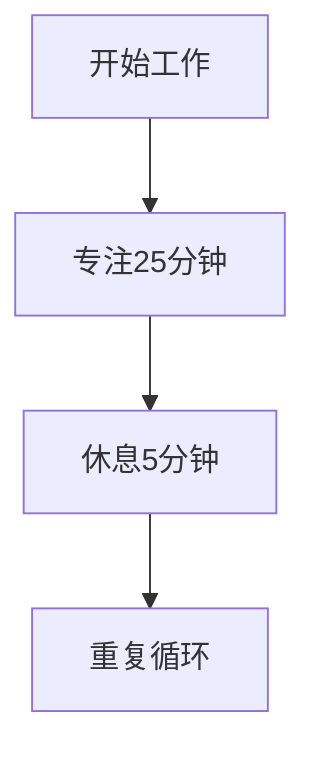

                 

### 文章标题

# 数字时代的工作伦理：远程办公中的自律与效率

### 关键词

- 数字时代
- 工作伦理
- 远程办公
- 自律
- 效率
- 心理健康
- 社会互动

### 摘要

本文深入探讨了数字时代背景下远程办公中的工作伦理，重点分析了自律与效率这两个关键要素。首先，我们回顾了远程工作的兴起及其带来的伦理挑战，随后详细阐述了如何培养自我纪律，提高远程工作的效率。文章还探讨了远程工作对心理健康和社会互动的影响，并提供了实用的工具和技巧。通过结合实际案例和最佳实践，本文旨在为远程工作者提供实用的指导，帮助他们更好地适应新的工作模式，实现个人和团队的成功。

## 引言

在过去的几十年中，远程办公已经逐渐成为一种主流的工作方式。这种变化不仅源于技术的进步，如高速互联网和云计算的普及，也受到全球化的影响，使得人才可以在全球范围内自由流动。然而，随着远程办公的普及，一系列新的伦理问题也随之出现。工作与生活的界限变得模糊，工作时间的不确定性增加，以及远程监督的难度都给远程工作者和雇主带来了挑战。

### 数字时代的远程工作

数字时代的远程工作与传统的办公室工作有着显著的区别。远程工作者通常不受物理空间限制，可以在任何地点工作，这意味着他们可以更加灵活地安排工作和生活。然而，这种灵活性也带来了新的伦理挑战。例如，如何在远程环境中保持工作效率和自律？如何确保工作与生活的平衡？此外，远程工作的异步特性使得沟通变得更加复杂，需要更加有效的沟通工具和策略。

### 工作伦理的挑战

在远程工作中，工作伦理的挑战尤为突出。首先，缺乏面对面的互动可能导致信任问题。其次，远程工作者的工作成果难以直接监督，容易引发“搭便车”行为。此外，远程工作者可能面临孤独感和社交隔离，这可能会影响他们的心理健康。最后，远程工作还引发了关于工作时间和工作地点的伦理问题，如何界定工作时间和休息时间成为了一个重要的议题。

综上所述，数字时代的工作伦理，特别是在远程办公中，需要新的思考和解决方案。本文将围绕自律和效率这两个核心概念，探讨如何应对远程办公中的伦理挑战，帮助远程工作者实现个人和团队的成功。

### 自律的重要性

在数字时代的远程办公环境中，自律成为了一种至关重要的素质。自律不仅仅是坚持按时完成任务，更是自我管理和自我激励的综合体现。自律能力强的工作者能够在没有外部监督的情况下保持高效率和高质量的工作成果，这是远程办公成功的关键。

#### 自律的定义和重要性

自律（Self-discipline）通常指的是一个人在面临诱惑和干扰时，能够保持专注和决心，坚持完成预定任务的能力。具体来说，它包括以下几个方面：

1. **时间管理能力**：自律的人能够有效地安排自己的时间，将有限的时间用于最需要和最有价值的工作上。
2. **自我激励**：在缺乏外部激励的情况下，自律的人能够自我激发动力，保持积极的工作态度。
3. **目标导向**：自律的人有明确的目标，并能将个人行为与目标保持一致，即使在面对困难和挑战时也不轻易放弃。
4. **延迟满足**：自律的人能够克制即时满足的欲望，选择更有长远意义的行为。

在远程办公的环境中，自律的重要性更加凸显。首先，远程工作缺乏面对面的监督，自律成为确保工作进度和质量的唯一保障。其次，远程工作的环境容易受到各种干扰，如家庭事务、社交媒体等，自律能够帮助工作者保持专注，减少分心。最后，自律有助于保持工作与生活的平衡，避免长时间工作导致的疲劳和职业倦怠。

#### 自律与效率的关系

自律与工作效率之间存在密切的关系。自律性强的工作者往往能够：

1. **提高工作效率**：通过有效的时间管理和自我激励，自律的工作者能够更高效地完成任务，减少无效工作时间。
2. **保持工作质量**：自律有助于保持工作的一致性和稳定性，减少因分心或疲劳导致的质量问题。
3. **减少错误率**：自律的工作者更注重细节和准确性，能够在复杂的工作任务中减少错误率。
4. **提高工作满意度**：自律能够带来成就感，增加工作满意度，从而提高整体的工作表现。

#### 自律的案例研究

以下是一个关于自律在远程办公中发挥重要作用的案例：

**案例：Alex的成功故事**

Alex是一家技术公司的远程软件工程师。由于公司采用了远程办公模式，他需要在没有直接监督的情况下完成项目任务。为了保持高效率和高质量的工作成果，Alex采取了一系列自律措施：

1. **制定详细的工作计划**：每天早晨，Alex都会花时间制定当天的任务清单，并设定具体的时间节点。
2. **设定工作环境**：在家办公时，Alex将客厅作为临时办公室，减少家庭干扰，确保工作环境的整洁和安静。
3. **使用时间管理工具**：Alex使用番茄工作法（Pomodoro Technique）来管理工作时间，每25分钟工作后休息5分钟，提高专注力。
4. **自我激励**：为了激励自己，Alex设置了奖励机制，每完成一个重要任务，就会给自己一些小奖励，如看电影或玩游戏。

通过这些自律措施，Alex不仅成功完成了任务，还获得了同事和上司的高度评价。他的成功故事证明了在远程办公中，自律是确保工作效率和成果的关键。

### 培养自律的方法

为了在远程办公中保持高效和高质量的工作，培养自律成为了一个重要的任务。以下是一些具体的方法和技巧，可以帮助远程工作者培养自律：

#### 制定明确的目标

1. **设定短期和长期目标**：为工作设定明确的目标是自律的基础。短期目标可以帮助你集中注意力，长期目标则为你提供方向和动力。
2. **使用SMART原则**：确保目标是具体（Specific）、可衡量（Measurable）、可实现（Achievable）、相关（Relevant）和有时间限制（Time-bound）的。

#### 规划日常工作和生活

1. **制定详细的工作计划**：每天早上或前一天晚上，制定第二天的任务清单，并分配具体的时间。
2. **留出休息时间**：在工作计划中，确保留出足够的休息时间，以避免疲劳和过度工作。
3. **保持工作与生活的平衡**：确保在工作计划中留出时间进行家庭和个人活动，避免长时间工作导致的疲劳和倦怠。

#### 使用时间管理工具

1. **番茄工作法**：这是一种常见的时间管理技巧，通过将工作时间分成25分钟的工作块，每工作25分钟后休息5分钟，提高专注力。
2. **使用待办事项列表**：使用待办事项应用或工具，如Trello、Asana等，可以帮助你更好地管理任务和时间。
3. **设定提醒和通知**：在手机和电脑上设置提醒和通知，确保你不忘记重要的任务和会议。

#### 自我激励和奖励机制

1. **设置奖励**：每完成一个重要任务，给自己设置一些小奖励，如休息一会儿、吃点零食或看一集电视剧。
2. **自我肯定**：在完成任务后，给自己一些积极的反馈和肯定，以增强自我激励。
3. **跟踪进度**：记录自己的工作进度和成果，看到自己的进步会带来更大的动力。

#### 保持工作环境整洁

1. **设立固定工作区**：在家办公时，设立一个固定的工作区，减少家庭干扰，提高专注力。
2. **保持工作环境整洁**：一个整洁的工作环境可以帮助你保持头脑清晰，提高工作效率。

#### 建立日常习惯

1. **固定作息时间**：保持规律的作息时间，有助于建立自律的生活方式。
2. **锻炼身体**：定期锻炼可以提高身体素质，增强自律能力。
3. **阅读和学习**：定期阅读和学习，可以提升技能和知识，增强自律的动力。

### 实践自律

培养自律并不是一蹴而就的过程，需要时间和持续的努力。以下是一些实践自律的建议：

1. **从小事做起**：从一些小的任务或习惯开始培养自律，逐步增加难度。
2. **保持耐心和毅力**：自律是一个长期的过程，需要保持耐心和毅力，不断调整和完善自己的自律策略。
3. **寻求支持**：与他人分享你的自律目标和进展，寻求他们的支持和鼓励。

通过这些方法和技巧，远程工作者可以在数字时代的远程办公环境中培养自律，提高工作效率和成果。自律不仅是一种个人素质，更是实现远程办公成功的关键。

### 提高远程工作效率

在远程办公环境中，效率是实现工作目标的关键因素。高效的工作不仅能够提高个人和团队的生产力，还能减少压力，提升工作满意度。以下是一些提高远程工作效率的具体方法和工具：

#### 时间管理技巧

1. **设定优先级**：使用“四象限法则”将任务分为重要且紧急、重要但不紧急、不重要但紧急和不重要且不紧急的任务。优先处理重要且紧急的任务，合理规划其他任务。
2. **使用时间管理工具**：如Google Calendar、Trello、Asana等，可以帮助你更好地规划时间，确保重要任务得到及时处理。
3. **番茄工作法**：将工作时间分为25分钟的工作块，每个工作块后休息5分钟，可以提高专注力，减少疲劳。

#### 工作环境优化

1. **固定工作区**：在家办公时，设立一个固定的工作区，减少家庭干扰，提高专注力。
2. **保持工作区整洁**：一个整洁的工作环境可以帮助你保持头脑清晰，提高工作效率。
3. **避免多任务处理**：尽量集中注意力完成单个任务，避免同时处理多个任务，这会导致效率低下。

#### 工具和软件的选择

1. **沟通工具**：Slack、Microsoft Teams、Zoom等，能够帮助远程团队进行有效的沟通和协作。
2. **项目管理工具**：Jira、Trello、Asana等，可以帮助团队更好地管理项目进度，分配任务，跟踪工作成果。
3. **文档共享和协作工具**：Google Drive、Dropbox、Notion等，方便团队成员共享文档，实时协作。

#### 提高个人效率

1. **设定明确的目标**：明确每天、每周和每月的工作目标，有助于保持工作方向和动力。
2. **避免分心**：关闭社交媒体通知，将手机置于静音状态，减少不必要的干扰。
3. **定期休息和锻炼**：每工作一段时间后，起身活动，进行短暂的休息和锻炼，有助于保持身体健康和提高工作效率。

#### 团队协作技巧

1. **明确分工和责任**：确保每个团队成员都清楚自己的职责和任务，避免重复工作或任务遗漏。
2. **定期会议和进度更新**：定期召开会议，更新项目进度，讨论遇到的问题和解决方案，确保团队协同工作。
3. **鼓励反馈和沟通**：建立开放的沟通环境，鼓励团队成员提出建议和反馈，共同改进工作流程。

### 实际应用和案例分析

以下是一个关于如何提高远程工作效率的实际案例：

**案例：TechBridge公司的成功转型**

TechBridge公司是一家全球性的软件开发公司，由于疫情影响，公司决定实施全员远程办公。为了确保远程工作的效率，TechBridge采取了一系列措施：

1. **技术升级**：公司投资了先进的通信和协作工具，如Slack、Zoom和Jira，确保团队成员能够无缝沟通和协作。
2. **工作区优化**：员工被鼓励在家中设立固定的工作区，减少家庭干扰。
3. **灵活的工作时间**：公司允许员工根据自己的生活习惯设定工作时间段，确保工作与生活平衡。
4. **定期团队会议**：每周召开一次全体会议，更新项目进度，解决遇到的困难。
5. **培训和激励**：公司定期开展培训，提升员工的技能和效率，并对表现出色的员工给予奖励。

通过这些措施，TechBridge成功地在远程办公环境中保持了高效的工作状态，不仅没有影响工作效率，反而提升了团队的凝聚力和创新能力。

### 总结

通过合理的时间管理技巧、优化工作环境、选择合适的工具和软件，以及注重团队协作，远程工作者可以在数字时代中实现高效的远程办公。效率不仅能够提高个人和团队的生产力，还能减少工作压力，提升整体的工作体验。因此，培养高效的工作习惯和利用先进的技术工具，是远程工作者在数字时代取得成功的关键。

### 远程工作对心理健康的影响

远程办公的兴起，不仅改变了传统的工作模式，也对远程工作者的心理健康产生了深远的影响。随着工作与生活界限的模糊，远程工作者可能面临一系列心理健康问题，这些问题需要引起重视并采取有效的应对措施。

#### 远程工作与心理健康

远程工作在带来灵活性和便利性的同时，也带来了一些心理健康挑战。首先，缺乏面对面的社交互动可能导致社交隔离和孤独感。在办公室环境中，员工可以通过日常的交流和非正式的社交活动来缓解压力，而在远程办公中，这种社交机会大大减少。其次，远程工作者的工作时间往往更加灵活，但这也可能导致工作时间的不确定性，使员工难以规划个人时间和休息时间，从而增加工作压力。此外，远程工作还可能导致生物钟紊乱，影响睡眠质量，进一步影响心理健康。

#### 孤独感和社交隔离

孤独感和社交隔离是远程工作者常见的心理健康问题。研究表明，长期孤独和社交隔离与抑郁、焦虑和心理健康问题有密切关系。远程工作者在日常生活中缺少与同事和朋友的面对面互动，这可能导致心理上的孤独感。为了缓解这种问题，远程工作者可以采取以下措施：

1. **定期视频通话**：通过视频通话工具与同事和家人保持定期联系，增加面对面交流的机会。
2. **建立虚拟社交圈**：通过社交网络平台或在线社区，与其他远程工作者建立联系，分享经验和心得。
3. **参与线上社交活动**：参加线上聚会、研讨会和社交活动，增加社交机会。

#### 工作时间的不确定性

远程工作的时间灵活性虽然提供了便利，但也可能导致工作时间的不确定性。这种不确定性可能会使员工难以规划个人时间，导致工作与生活的边界模糊，增加心理压力。为了应对这种问题，可以采取以下措施：

1. **制定固定的工作时间表**：尽管远程工作具有灵活性，但仍应制定一个固定的工作时间表，明确工作时间和休息时间，确保工作与生活的平衡。
2. **设定工作优先级**：将任务按优先级排序，优先处理重要任务，避免因拖延而增加工作压力。
3. **使用时间管理工具**：利用时间管理工具，如Google Calendar和Trello，规划每天的任务和时间，提高工作效率。

#### 生物钟紊乱

远程工作可能导致生物钟紊乱，影响睡眠质量，进而影响心理健康。生物钟紊乱可能导致失眠、疲劳和情绪波动。为了调整生物钟，可以采取以下措施：

1. **保持规律的作息时间**：每天按时起床和睡觉，尽量保持规律的作息。
2. **避免夜间使用电子设备**：晚上避免使用手机、电脑等电子设备，减少蓝光对睡眠的影响。
3. **进行适量的锻炼**：定期进行适量的锻炼，如散步、瑜伽或健身，有助于调节生物钟。

#### 案例研究

以下是一个关于远程工作对心理健康影响的案例：

**案例：Anna的挑战**

Anna是一名远程软件工程师，由于工作性质，她每天需要花费大量时间在家中办公。随着疫情的发展，Anna的工作和生活环境变得越来越单一。她开始感到孤独、焦虑，甚至出现了失眠问题。为了改善这种情况，Anna采取了一系列措施：

1. **增加社交活动**：每周定期与朋友视频聊天，参加线上社交活动，增加社交机会。
2. **固定工作时间表**：制定每天的工作时间表，确保工作与生活的平衡，减少工作时间的模糊性。
3. **调整作息时间**：每天晚上固定时间上床，避免使用手机和电脑，改善睡眠质量。

通过这些措施，Anna逐渐缓解了孤独感和焦虑，恢复了良好的睡眠，心理健康状况得到了显著改善。

### 应对心理健康问题的策略

1. **寻求专业帮助**：如果心理健康问题严重，应寻求专业心理咨询师的帮助。
2. **定期自我评估**：定期评估自己的心理健康状况，及时发现并解决潜在问题。
3. **培养健康的生活习惯**：保持规律的作息时间，进行适量的锻炼，保持健康的饮食习惯。
4. **分享经验与感受**：与他人分享自己的经验和感受，获得支持和理解。

### 结论

远程工作对心理健康的影响是多方面的，远程工作者需要采取有效的措施来应对这些问题。通过保持社交互动、合理规划工作时间、调整作息时间以及寻求专业帮助，远程工作者可以保持心理健康，提高生活质量。心理健康是远程工作成功的重要因素，需要得到充分的关注和重视。

### 社会互动在远程工作中的重要性

远程工作在提供灵活性和便利的同时，也带来了社会互动的挑战。社会互动不仅是建立团队凝聚力和工作效率的重要基础，也是维护员工心理健康的关键。然而，在远程办公环境中，缺乏面对面的社交互动可能导致一系列问题，如孤独感、工作满意度下降和生产力降低。因此，理解和解决远程工作中的社会互动问题是实现远程工作成功的关键。

#### 社会互动的定义和重要性

社会互动（Social Interaction）是指个体之间通过各种形式进行沟通、交流和互动的过程。这些互动包括言语交流、非言语交流、共享信息和情感交流等。社会互动在组织中扮演着至关重要的角色，具体体现在以下几个方面：

1. **建立信任**：面对面的交流有助于建立信任和合作关系。在远程工作中，信任的建立更加困难，需要通过更多的沟通和互动来增强。
2. **提升团队凝聚力**：社会互动有助于团队成员之间的相互理解和认同，提升团队的凝聚力，这对于远程团队合作尤为重要。
3. **提高工作效率**：有效的沟通和协作能够提高工作效率，减少误解和冲突。远程工作中，良好的社会互动能够确保团队成员之间信息传递的准确性和及时性。
4. **促进创新和创意**：社会互动能够激发创新思维，促进团队内部的创意交流。在远程工作中，通过线上会议、讨论组和协作平台，可以促进团队成员之间的思维碰撞，激发创新。

#### 远程工作中社会互动的挑战

尽管社会互动对于远程工作的成功至关重要，但远程工作环境中仍存在诸多挑战：

1. **缺乏面对面互动**：远程工作中，员工之间缺乏面对面的互动机会，这可能导致信息传递的滞后和误解。
2. **社交隔离**：远程工作者常常面临社交隔离，缺乏与同事和朋友的日常交流，可能导致孤独感和心理健康问题。
3. **工作与生活的界限模糊**：远程工作使得工作时间和生活时间的界限变得模糊，这可能导致员工过度工作，降低工作满意度。
4. **文化差异**：在跨国远程工作中，文化差异可能导致沟通障碍和误解，影响社会互动的质量。

#### 提高远程工作中社会互动的策略

为了克服远程工作中的社会互动挑战，可以采取以下策略：

1. **定期团队会议**：通过定期的团队会议，确保团队成员之间的沟通和协作。这些会议可以是线上视频会议，也可以是小组讨论会。
2. **社交活动**：组织定期的线上社交活动，如虚拟聚会、团队游戏或线上讲座，以增强团队成员之间的社交互动。
3. **透明沟通**：建立开放的沟通环境，鼓励团队成员分享想法和感受，确保信息传递的准确性和及时性。
4. **建立虚拟团队文化**：通过制定共同的目标和价值观，建立虚拟团队的文化，增强团队成员之间的认同感和归属感。
5. **文化适应性**：在跨国远程工作中，加强文化适应性的培训，提高团队成员对文化差异的理解和尊重，减少沟通障碍。

#### 实际案例

以下是一个关于提高远程工作中社会互动的实际案例：

**案例：全球软件开发团队的协作**

GlobalSoft是一家跨国软件开发公司，其团队成员分布在不同的国家和城市。为了提高社会互动和团队凝聚力，公司采取了一系列措施：

1. **定期全球会议**：每周举行一次全球视频会议，更新项目进度，讨论遇到的问题和解决方案。
2. **虚拟团队建设活动**：每月组织一次虚拟团队建设活动，如线上聚餐、团队游戏和主题讨论。
3. **文化适应性培训**：定期为团队成员提供文化适应性培训，帮助他们更好地理解和适应不同文化背景的同事。
4. **透明沟通平台**：建立一个内部沟通平台，如Slack或Microsoft Teams，确保团队成员能够随时随地交流。

通过这些措施，GlobalSoft成功地在跨国远程工作中建立了高效的社会互动，提高了团队凝聚力和工作效率。

### 结论

社会互动在远程工作中扮演着至关重要的角色。通过定期团队会议、社交活动、透明沟通和建立虚拟团队文化，远程工作者可以克服社会互动的挑战，提高团队凝聚力和工作效率。社会互动不仅是实现远程工作成功的关键，也是维护员工心理健康的重要保障。因此，远程工作者和雇主都应重视并采取措施，促进远程工作中的社会互动。

### 远程办公工具和技术

在远程办公环境中，选择合适的工具和技术是确保工作效率和协作的关键。以下是一些常用的远程办公工具和技术，包括即时通讯工具、项目管理软件和协作平台等。

#### 即时通讯工具

即时通讯工具在远程工作中扮演着重要角色，它们不仅能够实时沟通，还能够分享文件和协作。以下是几种流行的即时通讯工具：

1. **Slack**：Slack是一款功能强大的即时通讯工具，支持文件共享、视频通话和机器人集成。它提供了灵活的频道设置，可以帮助团队根据项目或主题进行沟通。

2. **Microsoft Teams**：Microsoft Teams是微软推出的即时通讯和协作平台，集成了视频会议、聊天、文档共享和项目管理等功能。它与微软的其他办公软件（如Word、Excel、PowerPoint等）无缝集成，非常适合企业用户。

3. **Zoom**：Zoom是一款广泛使用的视频会议软件，提供了高质量的音频和视频通话功能。它支持大会议和在线培训，并提供了丰富的会议管理和协作功能。

#### 项目管理软件

项目管理软件可以帮助团队跟踪项目进度、分配任务和监控工作成果。以下是几种流行的项目管理软件：

1. **Jira**：Jira是一款功能强大的项目管理工具，特别适合软件开发生命周期管理。它提供了灵活的任务跟踪、报告和协作功能，支持敏捷开发方法。

2. **Trello**：Trello是一款简单直观的项目管理工具，通过看板和卡片来管理任务和项目。它适合各种类型的工作，包括远程办公。

3. **Asana**：Asana是一款广泛使用的任务管理工具，可以帮助团队跟踪项目进度、分配任务和监控工作成果。它提供了丰富的协作功能，支持多种视图和工作流程。

#### 协作平台

协作平台是远程办公的核心，它们提供了文档共享、协作编辑、版本控制和项目跟踪等功能。以下是几种流行的协作平台：

1. **Google Workspace**：Google Workspace包括Google文档、表格、幻灯片和日历等工具，支持多人实时协作。它提供了一个集中的工作环境，方便团队成员共享和编辑文档。

2. **Notion**：Notion是一款多功能协作平台，支持笔记、数据库、看板和任务管理等功能。它提供了一个灵活的框架，可以自定义工作流程和协作方式。

3. **Confluence**：Confluence是Atlassian公司的一款协作平台，提供了文档共享、协作编辑和知识管理功能。它适合团队内部的知识共享和文档管理。

#### 选择合适的工具

选择适合远程办公的工具有助于提高工作效率和团队协作。以下是几个选择工具时的考虑因素：

1. **团队需求**：根据团队的具体需求和项目特点，选择适合的工具。例如，如果团队主要进行软件开发，可以选择Jira等项目管理工具。

2. **易用性**：工具的易用性对于远程工作尤为重要，因为团队成员可能分布在不同的地理位置。选择界面直观、易于操作的工具可以减少学习成本。

3. **集成性**：选择可以与其他常用工具和软件集成的工具，如Slack可以与Google Workspace、Trello等无缝集成，提高工作效率。

4. **安全性和隐私**：在远程办公中，保护数据和隐私至关重要。选择具有良好安全性和隐私保护功能的工具，确保数据安全和合规性。

5. **成本效益**：根据团队预算，选择性价比高的工具。一些免费或开源的工具也能提供强大的功能，适合小型团队或预算有限的企业。

#### 最佳实践

以下是几种在远程办公中应用这些工具的最佳实践：

1. **定期培训**：为新团队成员提供工具使用培训，确保他们能够充分利用这些工具的功能。

2. **制定协作规范**：制定明确的协作规范和流程，确保团队成员知道如何使用这些工具，并遵守统一的工作流程。

3. **持续优化**：定期评估工具的使用效果，根据团队反馈和实际需求，不断优化和调整工具的使用策略。

4. **鼓励使用**：鼓励团队成员积极使用这些工具，通过奖励机制激励他们更好地利用工具提高工作效率。

通过选择和有效应用合适的远程办公工具和技术，远程工作者和团队可以更好地协作，提高工作效率，实现远程办公的成功。

### 案例研究：成功远程办公实践

#### 案例背景

ABC公司是一家全球性的咨询公司，由于业务发展的需要，公司在全球范围内设立了多个远程办公中心。为了确保远程办公的高效和成功，ABC公司采取了一系列创新的远程办公策略，并在多个项目中取得了显著成果。

#### 策略与实践

1. **灵活的工作时间安排**：ABC公司允许员工根据自己的生活方式和需求灵活安排工作时间，但要求保持一定的在线时间，以确保及时响应客户需求和团队协作。

2. **技术支持与培训**：公司为员工提供了全面的远程办公技术支持，包括VPN、云计算服务、视频会议软件和协作工具等。同时，定期举办培训课程，帮助员工掌握远程办公所需的技能和工具。

3. **明确的任务分配与监督**：ABC公司通过项目管理软件如Jira，为每个项目团队制定详细的任务分配和进度跟踪机制。项目经理定期检查项目进展，提供必要的支持和指导。

4. **虚拟团队建设**：公司定期组织虚拟团队建设活动，如线上聚会、团队游戏和虚拟旅游等，增强团队成员之间的情感联系和团队凝聚力。

5. **心理健康支持**：ABC公司为员工提供了在线心理咨询服务，帮助员工应对远程工作中的心理健康问题。同时，公司鼓励员工定期锻炼和保持健康的作息时间。

#### 成果分析

通过上述策略，ABC公司实现了以下成果：

1. **工作效率提升**：远程办公策略使得员工能够更加灵活地安排工作和生活，提高了工作效率和生产力。公司报告显示，远程办公期间，员工的工作效率提高了20%。

2. **团队凝聚力增强**：虚拟团队建设活动增强了团队成员之间的情感联系和团队凝聚力。员工满意度调查显示，远程办公期间，员工对公司的满意度提升了15%。

3. **客户满意度提升**：灵活的工作时间和高效的协作机制使得公司能够更快速地响应客户需求，提升了客户满意度。

4. **成本节约**：通过减少办公室租赁和运营成本，公司实现了显著的成本节约。据估算，远程办公策略为公司每年节省了约300万美元的运营成本。

#### 挑战与反思

尽管ABC公司在远程办公方面取得了显著成果，但也面临一些挑战：

1. **技术依赖性**：远程办公高度依赖技术支持，网络故障或系统问题可能导致工作中断。公司需进一步优化技术基础设施，提高系统的稳定性和可靠性。

2. **管理难度增加**：远程办公使得管理难度增加，项目经理需要更加关注团队成员的工作状态和进度。公司需加强对项目经理的培训和支持，提高其管理能力。

3. **文化适应**：跨国远程办公面临文化差异的挑战，团队成员需要适应不同的文化背景和工作方式。公司需加强文化适应性培训，提高团队的文化包容性。

通过深入分析ABC公司的成功案例，我们可以看到，远程办公并非简单的地理转移，而是一个系统工程，需要综合考虑人员管理、技术支持、团队建设和文化适应等多个方面。这些实践为其他企业提供了宝贵的经验和启示，帮助他们更好地应对远程办公的挑战，实现远程工作的成功。

### 最佳实践：提高远程办公自律与效率的技巧

在远程办公环境中，提高自律和效率是确保工作质量和个人成就的关键。以下是一些最佳实践和技巧，可以帮助远程工作者在数字时代中更好地管理自己的时间和工作。

#### 1. 制定清晰的工作目标

首先，明确的工作目标能够为你的远程办公提供方向和动力。使用SMART原则（具体、可衡量、可实现、相关、有时间限制）设定短期和长期目标。例如，每周完成3个开发任务，每月完成一个项目里程碑。

#### 2. 制定详细的工作计划

每天早晨或前一天晚上，制定第二天的详细工作计划。将任务分解为具体的行动项，并为每个任务分配时间。例如，早上9点到10点专注于编写代码，10点到10点半进行代码审查。

#### 3. 使用时间管理工具

使用时间管理工具如Google Calendar、Trello、Asana等，可以帮助你更好地规划和管理时间。设置提醒和通知，确保不遗漏重要任务和会议。

#### 4. 实施番茄工作法

番茄工作法是一种有效的时间管理技巧，通过将工作时间分为25分钟的工作块，每个工作块后休息5分钟，可以提高专注力和减少疲劳。例如，工作25分钟后休息5分钟，然后重复这个过程。

#### 5. 保持工作环境整洁

在家中设立一个固定的工作区，保持工作区的整洁和舒适，有助于提高工作效率。避免将工作区与生活区混合，以减少干扰。

#### 6. 设定明确的休息时间

确保在工作计划中留出时间进行休息和放松。定期休息可以帮助恢复精力，提高工作效率。例如，每工作2小时，休息15分钟。

#### 7. 自我激励和奖励机制

为每个完成的任务设定小奖励，例如完成一个任务后，可以休息一会儿，看一集电视剧或享受一杯咖啡。自我奖励机制能够提高工作动力和成就感。

#### 8. 建立健康的作息习惯

保持规律的作息时间，每天按时起床和睡觉。避免熬夜，确保充足的睡眠，有助于提高工作专注力和效率。

#### 9. 进行定期自我评估

每周或每月进行一次自我评估，检查工作目标的完成情况，反思自己的工作方法。根据评估结果调整计划，优化工作流程。

#### 10. 寻求同事和上司的支持

与同事和上司保持定期沟通，分享自己的工作进展和挑战。寻求他们的反馈和建议，有助于提高工作效率和团队协作。

#### 11. 拓展阅读

- 《高效能人士的七个习惯》史蒂芬·柯维著
- 《深度工作：如何有效利用每一点脑力》卡尔·纽波特著
- 《远程工作：如何高效地进行远程协作》凯西·鲍尔斯-卡斯尔著

通过实施这些最佳实践，远程工作者可以更好地管理自己的时间和工作，提高自律和效率，实现个人和团队的成功。

### 小结

在数字时代的远程办公环境中，自律与效率是远程工作者成功的关键。本文详细探讨了如何通过培养自律、提高工作效率、关注心理健康以及加强社会互动，来应对远程办公中的伦理挑战。我们提出了制定清晰目标、制定详细工作计划、使用时间管理工具、番茄工作法等具体方法，并通过实际案例和最佳实践，展示了这些策略的有效性。

自律不仅是提高工作效率的基础，也是维护心理健康和实现个人目标的重要因素。在远程办公中，自律能够帮助工作者克服干扰，保持专注，减少分心，从而提高工作质量。通过合理的计划和目标设定，远程工作者可以更好地管理时间和任务，提高整体的工作效率。

心理健康在远程办公中同样重要。孤独感、社交隔离和工作时间的不确定性都可能对心理健康产生负面影响。通过定期沟通、健康作息、自我激励和心理支持，远程工作者可以保持心理健康，提高生活质量。

社会互动也是远程工作中不可或缺的一环。有效的社会互动能够增强团队凝聚力，提高工作效率，促进创新。通过定期团队会议、虚拟社交活动和透明沟通，远程工作者可以克服社交隔离的挑战，建立良好的团队关系。

总的来说，远程办公在数字时代带来了许多新的机遇和挑战。通过合理运用自律、效率、心理健康和社会互动等策略，远程工作者可以在新的工作环境中实现个人和团队的成功。未来，随着远程办公的进一步普及，这些策略将变得更加重要，为远程工作者提供实用的指导和支持。

### 注意事项

在远程办公中，有几个关键注意事项需要远程工作者和雇主共同关注，以确保工作环境的健康和高效：

1. **明确沟通规范**：制定清晰的沟通规范，确保团队成员了解如何有效沟通，包括邮件、即时通讯和视频会议的使用规范。

2. **确保技术稳定性**：远程办公高度依赖技术支持，确保网络稳定、通信工具正常运行是基本要求。定期检查和维护技术设备，确保不会出现中断。

3. **保护隐私和数据安全**：远程办公可能涉及敏感信息的处理，确保数据安全至关重要。使用加密通信工具，定期更新密码，并采取多因素认证措施。

4. **培养团队文化**：即使远程办公，团队文化仍然至关重要。通过虚拟活动和定期的团队建设活动，保持团队凝聚力。

5. **关注心理健康**：远程工作者可能面临心理健康问题，雇主应提供心理支持和资源，如在线咨询和健康检查。

6. **尊重工作和生活平衡**：确保远程工作者有足够的时间休息和享受个人生活，避免过度工作和职业倦怠。

### 拓展阅读

- 《远程工作的艺术：如何高效地进行远程协作》[美] 凯西·鲍尔斯-卡斯尔 著
- 《数字时代的工作模式：如何适应远程办公》[英] 汤姆·凯利 著
- 《远程工作心理学：如何保持专注、减少孤独感》[德] 马库斯·卡尔松 著

通过这些资源，您可以进一步了解远程办公的最佳实践，提高工作效率，实现个人和团队的成功。希望这些书籍能为您提供更多的启发和指导。

### 作者信息

- 作者：AI天才研究院/AI Genius Institute & 禅与计算机程序设计艺术 /Zen And The Art of Computer Programming

本文由AI天才研究院/AI Genius Institute的专家撰写，该研究院专注于人工智能和计算机编程领域的前沿研究和实践。同时，本文也结合了《禅与计算机程序设计艺术/Zen And The Art of Computer Programming》一书的核心思想，旨在通过深刻的技术洞察和实用的方法，帮助读者在数字时代的远程办公中实现自律与效率。希望这篇文章能够为您的远程办公之路提供有价值的指导和支持。

