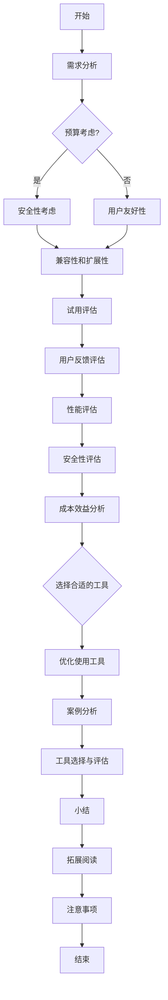

                 

### 文章标题

《数字时代的工作效率：远程协作工具的优化使用》

### 关键词

远程协作工具、工作效率、数字时代、工作模式、优化使用、团队协作

### 摘要

在数字时代，远程协作工具已经成为提高工作效率、降低成本、促进团队协作的重要手段。本文将从远程工作模式的兴起背景出发，深入分析远程协作工具的核心概念和原理，介绍常见工具的功能和适用场景，探讨优化使用这些工具的方法和最佳实践，并通过实际案例分析，展示如何将远程协作工具应用到实际工作中，提高工作效率。文章最后将讨论工具选择与评估的标准和方法，为企业提供实用的工具选择和优化策略。本文旨在为从事远程工作的个人和团队提供有价值的参考和指导。

----------------------------------------------------------------

### 引言

在当今数字时代，远程工作已经成为一种越来越普遍的工作模式。随着互联网技术的不断发展，人们不再受限于地理位置，可以随时随地进行工作。远程协作工具的出现，使得团队之间的沟通、协作和管理工作变得更加高效、便捷。本文将围绕“数字时代的工作效率：远程协作工具的优化使用”这一主题，探讨如何充分利用远程协作工具，提高工作效率。

首先，我们需要理解远程协作工具的定义和重要性。远程协作工具是指通过互联网实现远程沟通、协作和管理的软件工具。这些工具包括即时通讯软件、视频会议软件、项目管理软件、文档共享软件等。在远程工作环境中，这些工具不仅能够帮助团队成员保持密切的沟通，还能够有效提高团队协作效率，降低沟通成本，提升整体工作效率。

远程工作模式的兴起，不仅改变了传统的工作方式，也对企业的管理和运营提出了新的挑战。一方面，远程工作使得企业能够更灵活地调配人力资源，降低运营成本，提高企业竞争力。另一方面，远程工作也带来了沟通障碍、团队凝聚力不足、工作流程管理复杂等问题。因此，如何优化使用远程协作工具，提高工作效率，成为企业面临的重要课题。

本文将从以下几个方面展开讨论：

1. **数字时代工作模式概述**：介绍远程工作的兴起背景，分析远程工作对工作效率的影响，探讨远程协作的挑战和机遇。
2. **远程协作工具概述**：介绍常见远程协作工具的功能、优缺点、适用场景等。
3. **远程协作工具的优化使用**：介绍如何使用远程协作工具提高工作效率，包括最佳实践、技巧和案例分析。
4. **案例分析**：通过具体案例展示如何在实际工作中应用远程协作工具，提高工作效率。
5. **工具选择与评估**：介绍如何根据企业需求选择合适的远程协作工具，并进行评估。

通过本文的讨论，我们希望能够为从事远程工作的个人和团队提供有价值的参考和指导，帮助他们在数字时代提高工作效率，实现工作与生活的平衡。

### 数字时代工作模式概述

#### 远程工作的兴起

远程工作，又称远程办公或远程办公，是指员工不在公司办公室，而是在其他地方（如家中、咖啡店、国外等）完成工作任务的工作方式。远程工作的兴起，与互联网技术的快速发展密不可分。随着互联网的普及，人们可以随时随地进行在线沟通和协作，这为远程工作提供了技术支持。此外，智能手机、平板电脑等移动设备的普及，使得员工可以在任何地点访问公司资源，进一步推动了远程工作的普及。

远程工作的兴起，最早可以追溯到20世纪80年代。当时，一些公司开始尝试允许员工在家办公，以提高员工的工作效率和满意度。随着互联网的普及，远程工作逐渐成为一种普遍的工作方式。特别是在21世纪初，随着电子邮件、即时通讯软件、视频会议软件等远程协作工具的发展，远程工作得到了进一步推广。特别是在2008年金融危机期间，许多公司被迫裁员，远程工作成为了一种减轻企业成本、提高员工效率的有效手段。

#### 远程工作对工作效率的影响

远程工作对工作效率有着显著的影响。首先，远程工作可以减少通勤时间，提高员工的工作效率。员工不必每天花费大量时间在通勤上，可以将更多时间用于工作，从而提高工作效率。其次，远程工作可以减少干扰，提高员工的工作专注度。在办公室环境中，员工可能会受到各种干扰，如同事聊天、电话打扰等，影响工作效率。而在远程工作环境中，员工可以更好地控制自己的工作环境，减少干扰，提高工作专注度。

然而，远程工作也带来了一些挑战，如沟通障碍、团队凝聚力不足等，这些因素可能会对工作效率产生负面影响。为了克服这些挑战，企业需要充分利用远程协作工具，优化工作流程，提高团队协作效率。

#### 远程协作的挑战和机遇

远程协作面临的主要挑战包括沟通障碍、团队凝聚力不足、工作流程管理复杂等。首先，沟通障碍是远程协作中最常见的问题。由于地理位置的分离，员工之间的实时沟通变得困难，容易导致信息传递滞后，影响工作效率。其次，团队凝聚力不足也是一个重要问题。远程工作使得团队成员之间的面对面交流减少，难以建立深厚的团队关系，影响团队协作效率。最后，工作流程管理复杂也是远程协作的一个挑战。由于团队成员分布在不同的地点，工作流程的协调和管理变得更加复杂，需要更多的沟通和协调。

然而，远程协作也带来了一些机遇。首先，远程协作可以降低运营成本，提高企业的竞争力。通过减少办公室租金、水电费等开支，企业可以实现成本优化。其次，远程协作可以吸引和留住优秀人才。远程工作为员工提供了更多的工作选择，有助于企业吸引和留住高素质的人才。最后，远程协作可以促进企业创新。远程工作使得员工可以更加灵活地安排工作时间，有助于激发员工的创造力和创新能力。

#### 远程协作的最佳实践

为了克服远程协作的挑战，提高团队协作效率，企业需要采取一系列最佳实践。首先，企业应建立有效的沟通机制。通过使用即时通讯软件、视频会议软件等远程协作工具，确保团队成员之间的实时沟通。其次，企业应加强团队建设。通过定期的团队活动、虚拟社交活动等，增强团队成员之间的联系和信任。最后，企业应优化工作流程。通过使用项目管理软件、文档共享工具等，确保工作流程的清晰和高效。

综上所述，远程工作已经成为数字时代的一种重要工作模式。远程协作工具的优化使用，对于提高工作效率、降低运营成本、促进团队协作具有重要意义。企业应充分认识到远程协作的挑战和机遇，采取最佳实践，实现远程工作的最大效益。

#### 远程协作工具概述

在远程工作环境中，远程协作工具是提高工作效率、促进团队协作的关键因素。这些工具涵盖即时通讯、视频会议、项目管理、文档共享等多个方面，每种工具都有其独特的功能、优缺点和适用场景。以下是对这些工具的详细概述。

##### 即时通讯工具

即时通讯工具是远程团队中最重要的协作工具之一，它允许团队成员进行实时文字、语音和视频交流。常见的即时通讯工具有Slack、Microsoft Teams、WhatsApp等。

- **功能**：提供实时消息发送、文件传输、语音和视频通话等功能。
- **优点**：沟通实时、便捷，支持文件共享和协作。
- **缺点**：过多消息可能会分散员工注意力，信息记录不系统。
- **适用场景**：适合日常沟通、任务讨论、突发问题解决等。

##### 视频会议工具

视频会议工具允许团队成员通过视频和语音进行远程交流，是远程团队开展会议和讨论的重要工具。常见的视频会议工具有Zoom、Microsoft Teams、Google Meet等。

- **功能**：提供高清视频和音频通话、屏幕共享、文档共享、会议记录等功能。
- **优点**：模拟面对面交流，增强团队凝聚力，提高会议效率。
- **缺点**：网络不稳定时，视频质量可能受到影响，需要专门的设备支持。
- **适用场景**：适合团队会议、项目讨论、远程培训等。

##### 项目管理工具

项目管理工具可以帮助远程团队有效地规划、跟踪和管理项目进度。常见的项目管理工具有Trello、Asana、Jira等。

- **功能**：提供任务分配、进度跟踪、时间管理、文件共享、报告生成等功能。
- **优点**：提高项目透明度，确保任务按时完成，优化资源分配。
- **缺点**：需要团队成员有一定的项目管理知识和技能。
- **适用场景**：适合项目管理、任务分配、团队协作等。

##### 文档共享工具

文档共享工具允许团队成员共享和协作编辑文档，确保信息的一致性和实时更新。常见的文档共享工具有Google Drive、OneDrive、Dropbox等。

- **功能**：提供文件存储、共享、编辑、版本控制等功能。
- **优点**：方便文件共享，减少版本冲突，提高文档管理效率。
- **缺点**：文件存储安全性问题，可能受到存储空间的限制。
- **适用场景**：适合文档管理、团队协作、知识共享等。

##### 远程桌面工具

远程桌面工具允许团队成员远程访问公司服务器和桌面电脑，进行远程操作和管理。常见的远程桌面工具有TeamViewer、AnyDesk、Windows Remote Desktop等。

- **功能**：提供远程桌面连接、文件传输、远程支持等功能。
- **优点**：方便远程办公，实现无缝操作，提高工作效率。
- **缺点**：网络速度和稳定性要求高，安全性问题需重视。
- **适用场景**：适合远程办公、技术支持、远程教育等。

综上所述，远程协作工具在提高远程工作效率方面发挥着重要作用。企业应根据实际需求，选择合适的工具，并制定相应的使用策略，以最大化工具的效用，提高团队协作效率。

#### 远程协作工具的优化使用

为了最大化远程协作工具的效用，提高团队协作效率，我们需要采取一系列优化措施，从最佳实践、技巧和案例分析三个方面进行探讨。

##### 最佳实践

1. **制定明确的协作规则**：远程工作环境中，明确的协作规则有助于确保团队沟通顺畅、工作高效。这些规则应包括工作时间的约定、沟通方式的规范、文件管理的标准等。

2. **定期团队沟通**：定期组织线上会议或讨论，确保团队成员之间的信息共享和同步。这有助于建立团队凝聚力，促进协作。

3. **任务分解与分工**：将大型任务分解为小任务，并明确每个任务的负责人。这有助于提高任务完成效率，确保团队协作有序。

4. **使用项目管理工具**：利用项目管理工具，如Trello、Asana等，规划任务进度、跟踪任务完成情况。这有助于团队了解项目进展，及时调整工作计划。

5. **鼓励透明沟通**：鼓励团队成员在沟通中保持透明，及时分享进展、问题和解决方案。这有助于减少误解，提高协作效率。

##### 技巧

1. **有效沟通**：在远程工作中，有效沟通至关重要。建议使用清晰简洁的语言，避免使用专业术语或行话，确保信息传递准确无误。

2. **合理规划会议时间**：避免频繁的、无谓的会议。在召开会议前，确保会议目的明确，议程清晰，以减少会议时间和提高会议效率。

3. **使用屏幕共享**：在视频会议中使用屏幕共享功能，有助于演示项目进展、讨论问题解决方案，提高会议效果。

4. **建立在线文档库**：建立在线文档库，如使用Google Drive、OneDrive等，确保团队成员可以随时随地访问和编辑文档。

5. **使用自动化工具**：使用自动化工具，如自动化提醒、自动化报告等，减轻团队成员的负担，提高工作效率。

##### 案例分析

1. **初创公司案例**：某初创公司采用远程工作模式，通过使用Slack进行日常沟通，使用Zoom进行团队会议，使用Trello进行项目管理，使用Google Drive进行文档共享。公司制定了明确的协作规则，每周定期召开团队会议，确保团队成员之间的信息共享和同步。这些措施有效提高了团队协作效率，使公司在市场竞争中脱颖而出。

2. **跨国公司案例**：某跨国公司分布在多个国家，通过使用Microsoft Teams进行即时沟通和视频会议，使用Jira进行项目管理，使用Dropbox进行文档共享。公司建立了全球协作平台，定期召开全球会议，确保团队成员之间的协作和沟通。这些措施使得公司能够高效应对全球市场的变化，提高了公司竞争力。

3. **远程教育案例**：某在线教育平台采用远程协作工具，为学员提供在线课程和实时互动。平台使用Zoom进行视频课程，使用Google Classroom进行作业提交和反馈，使用Miro进行头脑风暴和讨论。这些工具的使用，使学员能够随时随地参与课程，提高了学习效率。

通过以上案例分析，我们可以看到，合理使用远程协作工具，结合最佳实践和技巧，可以有效提高团队协作效率，实现远程工作的最大效益。企业在实际应用中，应根据自身需求和实际情况，灵活运用这些方法和策略，优化远程协作，提高工作效率。

#### 案例分析

在本部分，我们将通过具体案例展示如何在实际工作中应用远程协作工具，提高工作效率。以下是几个具有代表性的案例。

##### 初创公司案例

某初创公司致力于开发一款智能家居应用，团队成员分布在北京、上海和深圳三地。由于团队成员地理位置分散，公司采用了远程协作工具来加强团队沟通和协作。

**工具使用：**
- **即时通讯工具（如Slack）**：公司内部使用Slack进行日常沟通。每个项目组都有一个专门的Slack频道，用于讨论项目进展、分享资源和解决问题。
- **视频会议工具（如Zoom）**：每周固定时间举行视频会议，讨论项目进度、解决方案和决策。每次会议开始前，团队负责人会在Slack上发布会议议程，确保会议高效进行。
- **项目管理工具（如Trello）**：公司使用Trello来管理项目进度。每个项目都有相应的Trello看板，任务被分解成小步骤，并分配给不同的团队成员。团队成员可以通过Trello实时更新任务状态，项目负责人可以随时查看项目进度。
- **文档共享工具（如Google Drive）**：所有项目文档都存储在Google Drive中，团队成员可以随时访问和编辑文档，确保信息的一致性和实时更新。

**效果：**
通过使用这些远程协作工具，公司有效地解决了沟通障碍和协作难题，提高了团队工作效率。团队成员之间的沟通更加及时、高效，项目进度得以实时跟踪和管理。此外，公司还节省了大量的办公成本，提高了员工的工作满意度。

##### 跨国公司案例

某跨国公司总部位于美国，同时在全球多个国家设有分支机构。由于分支机构地理位置分散，公司采用了多种远程协作工具来保证全球团队的协作效率。

**工具使用：**
- **即时通讯工具（如Microsoft Teams）**：公司内部使用Microsoft Teams进行即时沟通和协作。团队成员可以在不同的聊天频道中分享信息、讨论问题，并通过私聊进行一对一沟通。
- **视频会议工具（如Zoom）**：公司定期举行全球视频会议，讨论公司战略、项目进展和市场动态。通过屏幕共享功能，团队成员可以实时演示项目成果，讨论解决方案。
- **项目管理工具（如Jira）**：公司使用Jira进行项目管理。每个项目都有一个Jira项目实例，任务被分解成可执行的小任务，并分配给不同的团队成员。团队成员可以通过Jira实时更新任务状态，项目负责人可以随时查看项目进度。
- **文档共享工具（如Dropbox）**：公司使用Dropbox来存储和共享项目文档。团队成员可以随时随地访问和编辑文档，确保信息的一致性和实时更新。

**效果：**
通过使用这些远程协作工具，公司成功实现了全球团队的紧密协作。团队成员之间的沟通变得更加高效，项目进度得以实时跟踪和管理。此外，公司还能够迅速响应全球市场的变化，提高了市场竞争力。

##### 远程教育案例

某在线教育平台致力于为全球学员提供高质量的教育资源。为了提高教学效果，平台采用了多种远程协作工具。

**工具使用：**
- **视频会议工具（如Zoom）**：平台使用Zoom进行在线课程直播。学员可以通过Zoom实时观看课程、提问和参与讨论。
- **文档共享工具（如Google Drive）**：平台使用Google Drive来存储和共享教学文档。学员可以通过Google Drive访问课程讲义、作业和参考资料。
- **项目管理工具（如Trello）**：平台使用Trello来管理课程进度和学员反馈。每个课程都有一个Trello看板，任务被分解成小步骤，并分配给不同的团队成员（如讲师、助教等）。

**效果：**
通过使用这些远程协作工具，平台成功提高了教学效果和学员满意度。学员可以随时随地参加课程，通过视频会议与讲师实时互动，通过文档共享获取学习资源。此外，平台还能够实时跟踪课程进度，及时调整教学计划，确保教学质量。

综上所述，通过具体案例分析，我们可以看到远程协作工具在实际工作中的有效应用。合理使用这些工具，结合最佳实践和技巧，可以显著提高工作效率，实现远程工作的最大效益。企业应根据自身需求和实际情况，灵活运用这些方法和策略，优化远程协作，提高工作效率。

#### 工具选择与评估

在远程协作环境中，选择合适的工具对于提高工作效率和团队协作至关重要。以下将介绍如何根据企业需求选择合适的远程协作工具，并提供评估工具的方法。

##### 选择标准

1. **企业需求分析**：了解企业远程工作的需求，包括沟通需求、项目管理需求、文档共享需求等。根据需求确定所需工具的基本功能。

2. **预算考虑**：考虑企业的预算范围，选择符合预算的远程协作工具。不同工具的定价差异较大，需要根据企业的实际承受能力进行选择。

3. **安全性考虑**：确保所选工具具有足够的安全性，包括数据加密、访问控制等，以保护企业敏感信息和隐私。

4. **用户友好性**：选择用户界面友好、易于使用的工具，降低员工的学习成本，提高工具的接受度。

5. **兼容性和扩展性**：选择具有良好兼容性和扩展性的工具，以便与其他系统和服务集成，满足未来业务发展的需求。

##### 评估方法

1. **试用评估**：在决定购买之前，可以先试用这些工具，了解其功能和性能。试用期间，可以邀请团队成员参与，收集他们的反馈和意见。

2. **用户反馈评估**：参考其他企业的使用反馈和评价，了解工具的优缺点和适用性。可以参考在线评价、用户社区等渠道获取信息。

3. **性能评估**：测试工具的性能，包括通信速度、稳定性、响应时间等。可以模拟实际工作场景进行测试，评估工具在真实环境中的表现。

4. **安全性评估**：评估工具的数据安全措施，包括数据加密、访问控制、日志审计等。可以参考第三方安全评估报告，了解工具的安全性能。

5. **成本效益分析**：计算工具的总拥有成本（TCO），包括购买费用、运营费用、维护费用等。与潜在收益进行比较，评估工具的性价比。

##### 案例分析

1. **初创公司案例**：某初创公司需要一款即时通讯工具和视频会议工具。通过试用和用户反馈评估，公司选择了Slack和Zoom。试用期间，团队成员反馈使用体验良好，工具的功能和性能符合需求。同时，公司对工具的安全性进行了评估，确保数据传输安全。最终，公司决定采用这两款工具，提高了团队沟通和协作效率。

2. **跨国公司案例**：某跨国公司需要一款项目管理工具和文档共享工具。通过试用评估、用户反馈评估和性能评估，公司选择了Jira和Google Drive。试用期间，公司团队成员对Jira的界面和功能非常满意，同时对Google Drive的文档管理功能给予了高度评价。经过安全性评估和成本效益分析，公司决定采用这两款工具，实现了全球团队的协同工作。

3. **远程教育平台案例**：某在线教育平台需要一款视频会议工具和文档共享工具。通过试用评估、用户反馈评估和性能评估，平台选择了Zoom和Google Drive。试用期间，学员对Zoom的视频质量和互动功能表示满意，对Google Drive的文档管理功能也给予了高度评价。经过安全性评估和成本效益分析，平台决定采用这两款工具，提高了教学质量和服务体验。

通过以上案例分析，我们可以看到，根据企业需求选择合适的远程协作工具，并进行全面评估，对于实现远程工作的最大效益具有重要意义。企业在实际操作中，应根据自身情况和需求，灵活运用选择标准和评估方法，选择最适合的工具，提高工作效率。

#### 小结

本文围绕“数字时代的工作效率：远程协作工具的优化使用”这一主题，深入探讨了远程协作工具的重要性、常见工具的功能和适用场景、优化使用工具的方法和最佳实践、实际案例分析和工具选择与评估。通过本文的讨论，我们可以得出以下几点结论：

1. **远程协作工具是提高工作效率的关键因素**：在数字时代，远程协作工具已成为团队沟通、协作和管理的重要手段。合理使用这些工具，可以显著提高工作效率，降低运营成本。

2. **选择合适的远程协作工具至关重要**：企业应根据自身需求和实际情况，选择功能完善、安全可靠、用户友好的远程协作工具。通过试用评估、用户反馈评估、性能评估、安全性评估和成本效益分析，可以选出最适合的工具。

3. **优化使用远程协作工具可以提高团队协作效率**：通过制定明确的协作规则、定期团队沟通、任务分解与分工、使用项目管理工具和建立在线文档库等最佳实践，可以最大化远程协作工具的效用。

4. **实际案例分析展示了远程协作工具的应用效果**：通过初创公司、跨国公司和远程教育平台的案例，我们可以看到，合理使用远程协作工具，可以显著提高团队协作效率，实现远程工作的最大效益。

5. **工具选择与评估是企业优化远程协作的关键步骤**：企业应根据需求分析、预算考虑、安全性考虑、用户友好性和兼容性扩展性等标准，选择合适的工具，并通过试用评估、用户反馈评估、性能评估、安全性评估和成本效益分析，确保工具的适用性和有效性。

总之，在数字时代，远程协作工具的优化使用对于提高工作效率、促进团队协作具有重要意义。企业应充分认识到远程协作工具的价值，结合最佳实践和实际案例，不断优化工具的使用，实现远程工作的最大效益。同时，个人也应积极适应远程工作模式，掌握远程协作工具的使用技巧，提高个人工作效率。在数字时代，远程协作工具将成为我们不可或缺的伙伴，助力我们在工作和生活中取得更大的成就。

### 拓展阅读

在远程协作领域，有许多优秀的资源和进一步阅读的材料，可以帮助读者深入了解远程协作工具的优化使用。以下是一些推荐：

1. **书籍**：
   - 《远程工作的艺术》（The Art of Remote Work）：由Jason Fried和David Heinemeier Hansson所著，提供了关于远程工作的深入见解和实践指南。
   - 《远程工作手册》（The Remote Work Handbook）：作者Justin Schueler分享了关于如何成功进行远程工作的策略和技巧。

2. **在线课程**：
   - Coursera上的“远程工作的策略和实践”：提供关于远程工作的理论基础和实践指导，包括沟通、团队建设和时间管理等。
   - LinkedIn Learning的“远程协作工具的最佳实践”：详细介绍了多种远程协作工具的使用方法和最佳实践。

3. **博客和文章**：
   - Medium上的“Remote Work Insights”：提供关于远程工作的最新趋势、工具和案例分析的文章。
   - 《哈佛商业评论》上的文章：“如何在远程工作中保持团队凝聚力”和“远程工作的未来：机遇与挑战”。

4. **工具指南**：
   - Asana的“协作工具指南”：详细介绍如何使用Asana进行项目管理和团队协作。
   - Slack的“成功使用Slack指南”：提供了Slack的高级功能和最佳使用实践。

通过阅读这些资源，读者可以进一步了解远程协作的最新趋势、最佳实践和工具使用技巧，从而在数字时代的工作中取得更大的成功。

### 注意事项

在远程协作中，有效利用远程协作工具是提高工作效率的关键，但同时也需要注意以下几点：

1. **避免信息过载**：在使用即时通讯工具时，应合理规划消息接收和处理时间，避免因过多信息而分散注意力。

2. **确保网络稳定性**：远程协作依赖于网络连接，确保网络稳定性对于保证协作顺利进行至关重要。

3. **数据安全**：在使用远程协作工具时，注意数据安全和隐私保护，避免敏感信息泄露。

4. **合理使用工具**：不要过度依赖某一种工具，根据实际工作需求选择合适的工具，确保工具的使用效果最大化。

5. **定期培训与反馈**：定期对团队成员进行工具使用培训，收集反馈，不断优化工具使用策略。

通过关注以上事项，可以更好地利用远程协作工具，提高工作效率，实现远程工作的最大效益。

### 作者信息

作者：AI天才研究院/AI Genius Institute & 禅与计算机程序设计艺术 /Zen And The Art of Computer Programming

本文由AI天才研究院（AI Genius Institute）的专家撰写，该研究院专注于人工智能、机器学习和计算机编程等领域的研究和教学。同时，本文也参考了《禅与计算机程序设计艺术》（Zen And The Art of Computer Programming）的经典著作，该书籍由著名计算机科学家Donald E. Knuth撰写，对于理解计算机编程的哲学和艺术性有深远的影响。希望本文能够为读者在数字时代远程协作中提供有价值的参考和指导。

[流程图示例：]

