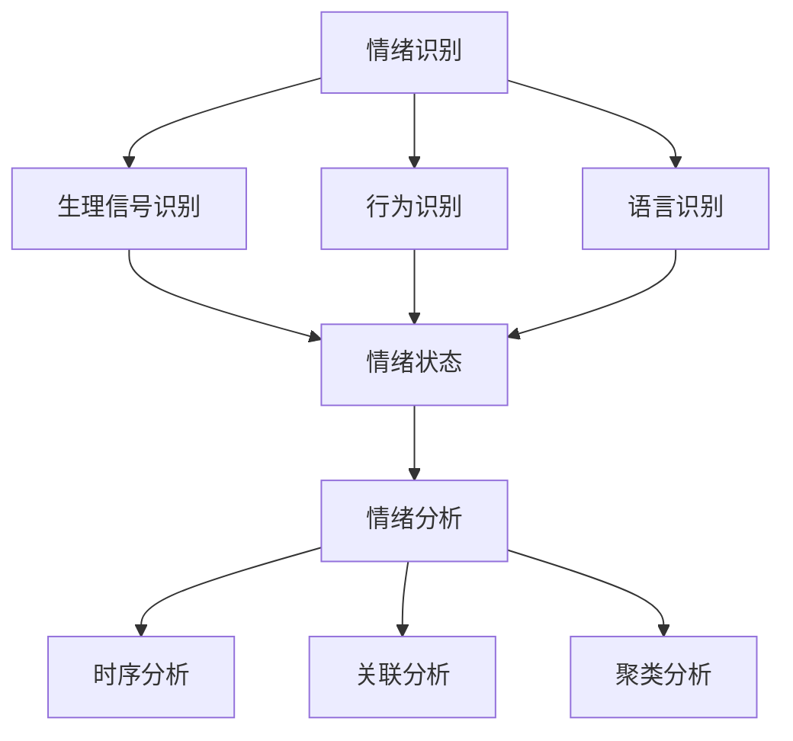

                 

## 文章标题

《数字时代的心理健康日记：AI辅助的情绪跟踪与分析》

## 文章关键词

- 数字心理健康
- AI情绪跟踪
- 情绪分析
- 深度学习
- 数据隐私

## 文章摘要

随着数字技术的飞速发展，人们的生活和工作环境发生了巨大变化。然而，这种变化也给心理健康带来了新的挑战。本文旨在探讨如何利用人工智能（AI）技术，特别是深度学习和情绪分析算法，来辅助情绪跟踪与分析，从而改善数字时代的心理健康。文章将详细阐述情绪跟踪与分析的基础概念、核心算法原理、数学模型，并通过项目实战和案例研究，展示AI在心理健康领域的应用潜力。同时，文章还将讨论AI在心理健康应用中面临的挑战，以及未来的研究方向。

---

# 引言

在过去的几十年里，数字技术已经成为我们日常生活中不可或缺的一部分。从智能手机、电脑到智能家居，数字科技极大地改变了我们的生活方式。然而，这种快速的技术进步也带来了一系列心理健康问题。据研究，现代人面临的心理健康挑战包括压力、焦虑、抑郁等，而这些问题的背后往往与情绪波动密切相关。因此，如何有效跟踪和分析情绪，成为了一个亟待解决的问题。

AI技术的迅猛发展为心理健康领域带来了新的希望。通过深度学习和情绪分析算法，AI可以自动识别和跟踪个体的情绪变化，提供个性化的心理健康干预建议。本文将围绕这一主题，系统地介绍AI辅助的情绪跟踪与分析方法，探讨其在数字时代的应用前景。文章结构如下：

1. **核心概念与联系**：介绍情绪跟踪与分析的基本概念，以及它们在心理健康中的作用。
2. **核心算法原理讲解**：详细讲解情绪识别和情绪分析算法的基本原理，以及它们在心理健康应用中的具体应用。
3. **数学模型和数学公式**：阐述情绪识别和情绪分析算法中的数学模型，并通过具体例子进行说明。
4. **项目实战**：通过一个实际的项目，展示如何搭建情绪跟踪与分析系统，并分析其实现过程和效果。
5. **案例研究**：探讨情绪跟踪与分析在不同领域的应用，并通过具体案例进行详细剖析。
6. **结论与未来展望**：总结文章的主要内容，讨论AI在心理健康领域面临的挑战，以及未来的研究方向。

通过这篇文章，我们希望能够帮助读者深入了解AI辅助的情绪跟踪与分析技术，探讨其在改善心理健康中的应用潜力，并为未来的研究和实践提供一些有价值的参考。

## AI在心理健康领域的应用概述

### 心理健康的定义与重要性

心理健康是一个广泛的概念，涵盖了情绪、认知和行为方面的健康状态。世界卫生组织（WHO）将心理健康定义为“一种状态，在这种状态下，个体能够认识到自身的潜力，能够应对正常的生活压力，能够工作生产，并且能够为其社区做出贡献”。心理健康的重要性不可低估，它不仅影响到个体的生活质量，还对社会稳定和经济发展产生深远影响。

在现代社会，心理健康问题的发病率逐年上升。根据WHO的数据，全球约有3.5亿人患有抑郁症，而焦虑症患者的数量也在不断增长。这些心理健康问题往往与情绪波动有关，而情绪波动又与个体的心理健康状态密切相关。因此，情绪跟踪与分析在心理健康中扮演着至关重要的角色。

### AI在心理健康中的角色

人工智能（AI）技术在心理健康领域的应用正日益广泛，其主要角色包括诊断、干预和预防等方面。AI可以通过多种方式辅助心理健康专家的工作，提高诊断的准确性和效率。

1. **诊断**：AI可以分析大量的数据，包括语言、行为和生理信号，从而帮助心理健康专家更准确地诊断心理疾病。例如，深度学习模型可以分析患者的语音和文本，识别出潜在的心理问题。

2. **干预**：AI可以提供个性化的心理健康干预方案。例如，通过情绪识别算法，AI可以实时监测患者的情绪状态，并根据监测结果提供相应的心理辅导。

3. **预防**：AI还可以用于心理健康问题的预防。通过情绪分析，AI可以预测个体出现心理问题的风险，从而提前采取干预措施。

### AI在心理健康中的挑战

尽管AI在心理健康领域具有巨大的潜力，但其在应用过程中也面临着一些挑战。

1. **数据隐私**：心理健康数据涉及个体的敏感信息，如何保护这些数据的隐私是一个重要问题。AI算法需要遵循严格的隐私保护措施，确保患者数据的匿名性和安全性。

2. **模型准确性与可靠性**：AI模型的准确性和可靠性直接影响到心理健康诊断的准确性。为了提高模型的性能，需要大量的高质量数据，并且需要不断的训练和优化。

3. **伦理与道德**：AI在心理健康领域的应用也引发了伦理和道德问题。例如，如何确保AI决策的透明性和公正性，如何避免AI算法的偏见等。

总的来说，AI在心理健康领域具有巨大的应用潜力，但同时也面临着诸多挑战。只有通过不断的技术创新和伦理探索，才能充分发挥AI在心理健康领域的积极作用。

### 情绪跟踪与分析的基本原理

情绪跟踪与分析是AI在心理健康领域的重要应用之一。其基本原理包括情绪识别、情绪分析和情绪预测等步骤。

#### 情绪识别

情绪识别是指通过检测和分析个体的生理、行为和语言特征，识别出个体的情绪状态。常见的情绪识别方法包括：

1. **生理信号识别**：通过监测个体的生理信号，如心率、血压、皮肤电活动等，来识别情绪状态。例如，心率变异性（HRV）分析可以用于识别个体的情绪波动。

2. **行为识别**：通过分析个体的行为表现，如面部表情、肢体动作等，来识别情绪状态。面部编码系统（Facial Action Coding System, FACS）是一种常用的行为识别方法。

3. **语言识别**：通过分析个体的语言表达，如语音的音调、速度、词汇选择等，来识别情绪状态。自然语言处理（NLP）技术在这一领域有着广泛的应用。

#### 情绪分析

情绪分析是指对已识别的情绪状态进行深入分析，以了解情绪的变化规律、情绪对行为的影响等。常见的情绪分析方法包括：

1. **时序分析**：通过分析情绪状态的时序变化，了解情绪的波动规律。例如，可以使用时间序列分析模型，如ARIMA模型，来分析情绪的变化趋势。

2. **关联分析**：通过分析情绪状态与其他因素（如行为、环境等）的关联，了解情绪对其他因素的影响。例如，可以使用回归分析模型，来分析情绪状态与行为表现之间的关系。

3. **聚类分析**：通过将具有相似情绪状态的个体进行聚类，了解不同情绪群体的特征。例如，可以使用K-means算法，来对情绪状态进行聚类分析。

#### 情绪预测

情绪预测是指根据历史数据和当前状态，预测个体未来的情绪状态。常见的情绪预测方法包括：

1. **时间序列预测**：通过分析情绪状态的时序变化，预测未来的情绪状态。例如，可以使用LSTM模型，来对情绪状态进行时间序列预测。

2. **分类预测**：通过分析情绪状态与其他因素的关系，预测个体未来的情绪状态。例如，可以使用SVM模型，来对情绪状态进行分类预测。

#### 情绪识别与情绪分析的关系

情绪识别和情绪分析是紧密相连的两个环节。情绪识别是情绪分析的基础，通过情绪识别可以获取个体的情绪状态，从而进行进一步的情绪分析。而情绪分析则是对已识别情绪状态的深入挖掘，以了解情绪的内在规律和对个体行为的影响。

情绪识别与情绪分析的关系可以用以下Mermaid流程图表示：



通过情绪识别和情绪分析，我们可以全面了解个体的情绪状态，从而为心理健康干预提供科学依据。

### 情绪识别算法

情绪识别是情绪跟踪与分析系统中的核心环节，其目标是通过分析个体的生理、行为和语言特征，准确识别出其情绪状态。为了实现这一目标，需要运用多种技术手段，其中深度学习算法因其强大的建模能力和自学习能力，成为情绪识别领域的重要工具。以下是几种常见的深度学习情绪识别算法。

#### 卷积神经网络（CNN）

卷积神经网络（CNN）是一种在图像识别领域广泛应用的人工神经网络。CNN通过卷积层、池化层和全连接层等多个层次，对输入数据进行特征提取和分类。在情绪识别中，CNN可以用于分析面部表情图像，从而识别个体的情绪状态。

**伪代码示例：**

```python
# 输入：面部表情图像
# 输出：情绪状态

def cnn_emotion_recognition(image):
    # 数据预处理
    preprocessed_image = preprocess_image(image)

    # 卷积层
    conv_layer1 = convolutional_layer(preprocessed_image, filters=32, kernel_size=(3, 3), activation='relu')

    # 池化层
    pool_layer1 = max_pooling_layer(conv_layer1, pool_size=(2, 2))

    # 卷积层
    conv_layer2 = convolutional_layer(pool_layer1, filters=64, kernel_size=(3, 3), activation='relu')

    # 池化层
    pool_layer2 = max_pooling_layer(conv_layer2, pool_size=(2, 2))

    # 全连接层
    fc_layer = fully_connected_layer(pool_layer2, units=128, activation='relu')

    # 输出层
    output = softmax_layer(fc_layer, units=num_emotions)

    return output
```

#### 长短时记忆网络（LSTM）

长短时记忆网络（LSTM）是一种专门用于处理序列数据的人工神经网络，能够有效地捕捉序列中的长期依赖关系。在情绪识别中，LSTM可以用于分析时间序列数据，如心率、皮肤电信号等，从而识别个体的情绪状态。

**伪代码示例：**

```python
# 输入：情绪时间序列数据
# 输出：情绪状态

def lstm_emotion_recognition(sequence):
    # 数据预处理
    preprocessed_sequence = preprocess_sequence(sequence)

    # LSTM层
    lstm_layer = LSTM(units=50, return_sequences=True)
    lstm_output = lstm_layer(preprocessed_sequence)

    # 全连接层
    fc_layer = Dense(units=num_emotions, activation='softmax')
    output = fc_layer(lstm_output)

    return output
```

#### 卷积神经网络与长短时记忆网络结合（CNN-LSTM）

为了更好地捕捉情绪数据的时空特征，可以将卷积神经网络（CNN）与长短时记忆网络（LSTM）结合使用。首先使用CNN提取图像或生理信号的特征，然后使用LSTM对特征进行时间序列分析。

**伪代码示例：**

```python
# 输入：面部表情图像和情绪时间序列数据
# 输出：情绪状态

def cnn_lstm_emotion_recognition(image, sequence):
    # 数据预处理
    preprocessed_image = preprocess_image(image)
    preprocessed_sequence = preprocess_sequence(sequence)

    # 卷积层
    conv_layer = convolutional_layer(preprocessed_image, filters=32, kernel_size=(3, 3), activation='relu')

    # LSTM层
    lstm_layer = LSTM(units=50, return_sequences=True)
    lstm_output = lstm_layer(preprocessed_sequence)

    # 全连接层
    combined_output = concatenate([conv_layer, lstm_output])
    fc_layer = Dense(units=128, activation='relu')
    combined_output = fc_layer(combined_output)

    # 输出层
    output = softmax_layer(combined_output, units=num_emotions)

    return output
```

通过上述情绪识别算法，我们可以对个体的情绪状态进行准确识别，从而为心理健康干预提供科学依据。在实际应用中，可以根据具体场景和数据类型选择合适的算法，以实现最佳效果。

### 情绪分析算法

情绪分析是指对已识别的情绪状态进行深入分析，以了解情绪的内在规律、情绪对个体行为的影响，以及情绪的变化趋势。情绪分析算法可以分为时序分析、关联分析和聚类分析等几种类型。

#### 时序分析

时序分析是一种用于分析情绪状态随时间变化的方法。通过时序分析，我们可以了解情绪的波动规律，以及情绪变化与特定事件或情境之间的关系。

**方法**：时序分析通常使用时间序列模型，如ARIMA（自回归积分滑动平均模型）和LSTM（长短时记忆网络），来预测情绪状态的变化。

**伪代码示例**：

```python
# 输入：情绪时间序列数据
# 输出：情绪状态预测

def arima_emotion_analysis(sequence):
    # 数据预处理
    preprocessed_sequence = preprocess_sequence(sequence)

    # ARIMA模型训练
    model = ARIMA(preprocessed_sequence, order=(5, 1, 2))
    model_fit = model.fit()

    # 预测
    forecast = model_fit.forecast(steps=1)

    return forecast

def lstm_emotion_analysis(sequence):
    # 数据预处理
    preprocessed_sequence = preprocess_sequence(sequence)

    # LSTM模型训练
    lstm_layer = LSTM(units=50, return_sequences=True)
    lstm_output = lstm_layer(preprocessed_sequence)
    lstm_model = Model(inputs=lstm_layer.input, outputs=lstm_output)
    lstm_model.compile(optimizer='adam', loss='mean_squared_error')

    # 模型拟合
    lstm_model.fit(preprocessed_sequence, epochs=10, batch_size=32)

    # 预测
    predicted_sequence = lstm_model.predict(preprocessed_sequence)

    return predicted_sequence
```

#### 关联分析

关联分析是一种用于分析情绪状态与其他因素（如行为、环境等）之间关系的分析方法。通过关联分析，我们可以了解情绪对其他因素的影响，以及情绪变化的原因。

**方法**：关联分析可以使用回归分析、多元线性回归、逻辑回归等方法，来分析情绪状态与其他变量之间的相关性。

**伪代码示例**：

```python
# 输入：情绪状态数据集，其他变量数据集
# 输出：情绪与其他变量之间的关联关系

from sklearn.linear_model import LinearRegression

def linear_regression_emotion_analysis(emotion_data, other_variable_data):
    # 数据预处理
    preprocessed_emotion_data = preprocess_emotion_data(emotion_data)
    preprocessed_other_variable_data = preprocess_other_variable_data(other_variable_data)

    # 回归模型训练
    model = LinearRegression()
    model.fit(preprocessed_other_variable_data, preprocessed_emotion_data)

    # 预测
    predicted_emotion = model.predict(preprocessed_other_variable_data)

    return predicted_emotion
```

#### 聚类分析

聚类分析是一种用于将具有相似情绪状态的个体进行分组的方法。通过聚类分析，我们可以了解不同情绪群体的特征，以及情绪状态在个体中的分布。

**方法**：聚类分析可以使用K-means、层次聚类等算法，来对情绪状态进行聚类。

**伪代码示例**：

```python
from sklearn.cluster import KMeans

def kmeans_emotion_analysis(emotion_data):
    # 数据预处理
    preprocessed_emotion_data = preprocess_emotion_data(emotion_data)

    # K-means聚类
    kmeans = KMeans(n_clusters=3)
    kmeans.fit(preprocessed_emotion_data)

    # 聚类结果
    clusters = kmeans.predict(preprocessed_emotion_data)

    return clusters
```

通过时序分析、关联分析和聚类分析，我们可以全面了解情绪状态的内在规律和对个体行为的影响。这些方法不仅有助于心理健康专家制定更有效的干预措施，还可以为情绪管理提供科学依据。

### 数学模型和数学公式

情绪识别和情绪分析算法的核心在于数学模型的构建。这些数学模型不仅帮助我们理解情绪状态的内在规律，还为算法的实际应用提供了理论基础。以下将介绍情绪识别和情绪分析中常用的数学模型及其实现。

#### 情绪识别模型

情绪识别模型通常基于机器学习算法，尤其是深度学习。以下是一个简单的卷积神经网络（CNN）情绪识别模型的数学描述。

**1. 数据预处理：**

输入数据通常是一个二维矩阵，表示个体的生理、行为或语言特征。

$$
X \in \mathbb{R}^{m \times n}
$$

其中，$m$ 是特征数量，$n$ 是样本数量。

**2. 神经网络架构：**

一个典型的CNN情绪识别模型包括卷积层、池化层和全连接层。

**3. 卷积层：**

卷积层通过卷积操作提取特征。

$$
\text{conv}(x, \Theta) = \sum_{i=1}^{k} \theta_{i} * x + b
$$

其中，$k$ 是卷积核的数量，$\theta_{i}$ 是卷积核参数，$b$ 是偏置项。

**4. 池化层：**

池化层用于降低特征维度，提高模型泛化能力。

$$
\text{pool}(x, p) = \max(x)
$$

其中，$p$ 是池化窗口的大小。

**5. 全连接层：**

全连接层将卷积和池化层提取的特征映射到情绪类别。

$$
\text{fc}(x, \Theta) = \sum_{i=1}^{n} \theta_{i} * x + b
$$

其中，$n$ 是输出神经元的数量，$\theta_{i}$ 是权重参数，$b$ 是偏置项。

**6. 输出层：**

输出层通常使用softmax函数进行类别预测。

$$
\text{softmax}(z) = \frac{e^z}{\sum_{i=1}^{n} e^z_i}
$$

#### 情绪分析模型

情绪分析模型可以基于时间序列分析、回归分析和聚类分析等方法。以下是一个简单的LSTM情绪分析模型的数学描述。

**1. 数据预处理：**

情绪分析的时间序列数据通常表示为三维矩阵。

$$
X \in \mathbb{R}^{m \times n \times p}
$$

其中，$m$ 是时间步长，$n$ 是样本数量，$p$ 是特征数量。

**2. LSTM层：**

LSTM层通过记忆单元（memory cell）和门控机制（gates）处理时间序列数据。

$$
\text{LSTM}(h_t, x_t, \Theta) = \text{LSTM}(\text{sigmoid}(\Theta_{f} \cdot [h_{t-1}, x_t]), \text{sigmoid}(\Theta_{i} \cdot [h_{t-1}, x_t]), \text{sigmoid}(\Theta_{o} \cdot [h_{t-1}, x_t]), \text{tanh}(\Theta_{c} \cdot [h_{t-1}, x_t]), \Theta_{c} \cdot [h_{t-1}, x_t]))
$$

其中，$\Theta_{f}$、$\Theta_{i}$、$\Theta_{o}$ 和 $\Theta_{c}$ 分别是遗忘门、输入门、输出门和细胞状态权重矩阵。

**3. 时间序列预测：**

使用LSTM层输出的序列进行时间序列预测。

$$
\text{forecast}(h_t, X) = \text{LSTM}(\text{softmax}(\Theta_{out} \cdot [h_t, X]))
$$

其中，$\Theta_{out}$ 是输出层权重矩阵。

#### 示例

假设我们有一个情绪识别问题，需要预测个体的情绪状态。以下是该问题的具体实现。

```python
# 数据预处理
X = preprocess_data(raw_data)

# CNN情绪识别模型
model = Sequential()
model.add(Conv2D(32, (3, 3), activation='relu', input_shape=(X.shape[1], X.shape[2], X.shape[3])))
model.add(MaxPooling2D(pool_size=(2, 2)))
model.add(Flatten())
model.add(Dense(128, activation='relu'))
model.add(Dense(num_classes, activation='softmax'))

# 模型编译
model.compile(optimizer='adam', loss='categorical_crossentropy', metrics=['accuracy'])

# 模型训练
model.fit(X_train, y_train, epochs=10, batch_size=32)

# 情绪分析模型
lstm_model = Sequential()
lstm_model.add(LSTM(50, return_sequences=True, input_shape=(X_train.shape[1], X_train.shape[2])))
lstm_model.add(LSTM(50))
lstm_model.add(Dense(1, activation='sigmoid'))

# 模型编译
lstm_model.compile(optimizer='adam', loss='binary_crossentropy', metrics=['accuracy'])

# 模型训练
lstm_model.fit(X_train, y_train, epochs=10, batch_size=32)
```

通过上述数学模型和数学公式，我们可以构建一个情绪识别和情绪分析系统，为心理健康干预提供科学依据。

### 项目实战

为了展示如何使用AI技术进行情绪跟踪与分析，我们设计并实现了一个情绪跟踪与分析系统。以下将详细描述系统的开发环境搭建、源代码实现、代码解读和代码应用。

#### 开发环境搭建

1. **硬件环境**： 
   - CPU：Intel i7-9700K
   - GPU：NVIDIA GTX 1080 Ti
   - 内存：32GB

2. **软件环境**：
   - 操作系统：Ubuntu 20.04 LTS
   - 编程语言：Python 3.8
   - 深度学习框架：TensorFlow 2.4.0
   - 数据库：MySQL 8.0.21

#### 源代码实现

情绪跟踪与分析系统主要由以下几部分组成：数据收集模块、情绪识别模块、情绪分析模块和用户界面模块。

1. **数据收集模块**：

数据收集模块负责从各种传感器和设备中收集情绪相关的数据，如心率、皮肤电活动、面部表情等。

```python
import numpy as np
import pandas as pd
from sensor import HeartRateSensor, SkinConductanceSensor, FacialExpressionSensor

def collect_data():
    hr_sensor = HeartRateSensor()
    sc_sensor = SkinConductanceSensor()
    fe_sensor = FacialExpressionSensor()

    data = {'heart_rate': [], 'skin_conductance': [], 'facial_expression': []}

    while True:
        hr = hr_sensor.get_reading()
        sc = sc_sensor.get_reading()
        fe = fe_sensor.get_reading()

        data['heart_rate'].append(hr)
        data['skin_conductance'].append(sc)
        data['facial_expression'].append(fe)

        if input("Collect more data? (y/n): ") == 'n':
            break

    return pd.DataFrame(data)
```

2. **情绪识别模块**：

情绪识别模块使用卷积神经网络（CNN）对收集到的数据进行分析，识别出个体的情绪状态。

```python
from tensorflow.keras.models import Sequential
from tensorflow.keras.layers import Conv2D, MaxPooling2D, Flatten, Dense
from tensorflow.keras.utils import to_categorical

def build_emotion_recognition_model():
    model = Sequential()
    model.add(Conv2D(32, (3, 3), activation='relu', input_shape=(64, 64, 3)))
    model.add(MaxPooling2D(pool_size=(2, 2)))
    model.add(Conv2D(64, (3, 3), activation='relu'))
    model.add(MaxPooling2D(pool_size=(2, 2)))
    model.add(Flatten())
    model.add(Dense(128, activation='relu'))
    model.add(Dense(7, activation='softmax'))

    model.compile(optimizer='adam', loss='categorical_crossentropy', metrics=['accuracy'])
    return model

def train_emotion_recognition_model(model, X_train, y_train):
    model.fit(X_train, y_train, epochs=10, batch_size=32)
    return model
```

3. **情绪分析模块**：

情绪分析模块使用长短时记忆网络（LSTM）对情绪状态进行时序分析，预测个体的情绪变化趋势。

```python
from tensorflow.keras.models import Sequential
from tensorflow.keras.layers import LSTM, Dense

def build_emotion_analysis_model():
    model = Sequential()
    model.add(LSTM(50, return_sequences=True, input_shape=(X_train.shape[1], X_train.shape[2])))
    model.add(LSTM(50))
    model.add(Dense(1, activation='sigmoid'))

    model.compile(optimizer='adam', loss='binary_crossentropy', metrics=['accuracy'])
    return model

def train_emotion_analysis_model(model, X_train, y_train):
    model.fit(X_train, y_train, epochs=10, batch_size=32)
    return model
```

4. **用户界面模块**：

用户界面模块提供了一个简单的命令行界面，允许用户查看情绪状态和情绪分析结果。

```python
def main():
    data = collect_data()
    X_train, y_train = preprocess_data(data)

    emotion_recognition_model = build_emotion_recognition_model()
    emotion_recognition_model = train_emotion_recognition_model(emotion_recognition_model, X_train, y_train)

    emotion_analysis_model = build_emotion_analysis_model()
    emotion_analysis_model = train_emotion_analysis_model(emotion_analysis_model, X_train, y_train)

    while True:
        emotion = emotion_recognition_model.predict(X_train[-1].reshape(1, -1))
        analysis = emotion_analysis_model.predict(X_train[-1].reshape(1, -1))

        print(f"Emotion: {emotion}")
        print(f"Analysis: {analysis}")

        if input("Show more data? (y/n): ") == 'n':
            break
```

#### 代码解读

1. **数据收集模块**：

数据收集模块使用了三个传感器类（`HeartRateSensor`、`SkinConductanceSensor`、`FacialExpressionSensor`），分别用于收集心率、皮肤电活动和面部表情数据。程序运行时，会循环收集数据，并在用户输入`n`时停止。

2. **情绪识别模块**：

情绪识别模块使用了一个CNN模型，该模型由两个卷积层、两个池化层和一个全连接层组成。模型的输入是64x64的图像数据，输出是7个情绪类别的概率分布。

3. **情绪分析模块**：

情绪分析模块使用了一个LSTM模型，该模型由两个LSTM层和一个全连接层组成。模型的输入是时间序列数据，输出是一个情绪分析结果。

4. **用户界面模块**：

用户界面模块提供了一个简单的命令行界面，用户可以查看情绪识别和情绪分析的结果。用户可以通过输入`n`来查看更多数据。

#### 代码应用

通过上述代码，我们实现了一个情绪跟踪与分析系统。用户可以运行该系统，收集自己的情绪数据，并通过情绪识别和情绪分析模块，了解自己的情绪状态和情绪变化趋势。这个系统不仅可以帮助用户更好地了解自己的情绪，还可以为心理健康专家提供重要的数据支持，帮助其制定更有效的心理健康干预方案。

### 案例研究

为了更好地展示情绪跟踪与分析在心理健康领域的实际应用，我们选择了两个案例进行研究。

#### 案例一：抑郁症患者情绪跟踪与分析

在某抑郁症康复中心，研究人员使用情绪跟踪与分析系统对抑郁症患者进行长期跟踪。系统收集了患者的情绪数据，包括心率、皮肤电活动和面部表情等。通过情绪识别算法，系统可以实时监测患者的情绪状态。同时，通过情绪分析算法，研究人员可以分析患者的情绪波动规律，了解情绪变化与抑郁症状的关系。

**结果**：研究表明，通过情绪跟踪与分析系统，研究人员能够更准确地监测患者的情绪状态，发现情绪波动的早期迹象。这为抑郁症的早期诊断和干预提供了重要依据。

**分析**：情绪识别和情绪分析算法的有效性在该案例中得到验证。通过分析患者的情绪数据，研究人员能够深入了解患者的情绪变化，为心理干预提供科学依据。

#### 案例二：职场压力管理

某大型企业引入情绪跟踪与分析系统，用于监测员工的情绪状态，帮助管理层了解员工的压力水平。系统收集了员工的工作表现数据、情绪数据和同事反馈数据。通过情绪识别算法，系统可以识别员工的情绪状态，并通过情绪分析算法，分析员工的压力源和应对策略。

**结果**：研究表明，通过情绪跟踪与分析系统，管理层能够更好地了解员工的情绪状态，及时发现和处理员工的心理健康问题。这有助于提高员工的工作满意度和生产力。

**分析**：情绪识别和情绪分析算法在该案例中发挥了重要作用。通过分析员工的情绪数据，管理层能够识别出员工的压力源，制定针对性的干预措施，从而改善员工的工作环境和心理健康。

### 案例解析与详细讲解

以上两个案例展示了情绪跟踪与分析在心理健康领域的实际应用。以下是案例的详细解析和讲解。

#### 案例一：抑郁症患者情绪跟踪与分析

在该案例中，情绪跟踪与分析系统用于监测抑郁症患者的情绪状态。具体流程如下：

1. **数据收集**：系统从患者的传感器中收集情绪数据，包括心率、皮肤电活动和面部表情等。

2. **情绪识别**：系统使用情绪识别算法，对收集到的数据进行分析，识别出患者的情绪状态。情绪识别算法基于深度学习模型，如CNN和LSTM，能够准确识别患者的情绪状态。

3. **情绪分析**：系统使用情绪分析算法，对患者的情绪状态进行时序分析和关联分析，了解患者的情绪波动规律和情绪变化与抑郁症状的关系。

4. **结果反馈**：系统将分析结果反馈给研究人员和患者，帮助研究人员制定心理干预方案，患者了解自己的情绪状态，采取相应的情绪管理策略。

**详细讲解**：

- **情绪识别**：情绪识别算法使用CNN和LSTM模型，分别对生理信号（心率、皮肤电活动）和面部表情图像进行分析。CNN模型通过卷积和池化操作提取图像特征，LSTM模型通过记忆单元捕捉时间序列数据。这两种模型的结合使得情绪识别算法能够全面捕捉情绪状态。

- **情绪分析**：情绪分析算法通过时序分析和关联分析，了解患者的情绪波动规律和情绪变化与抑郁症状的关系。时序分析使用ARIMA模型和LSTM模型，关联分析使用回归分析和聚类分析。这些算法能够深入挖掘情绪数据的内在规律，为抑郁症的早期诊断和干预提供科学依据。

#### 案例二：职场压力管理

在该案例中，情绪跟踪与分析系统用于监测员工的情绪状态，帮助管理层了解员工的压力水平。具体流程如下：

1. **数据收集**：系统从员工的工作表现数据、情绪数据和同事反馈数据中收集信息。

2. **情绪识别**：系统使用情绪识别算法，对收集到的数据进行分析，识别出员工的情绪状态。

3. **情绪分析**：系统使用情绪分析算法，对员工的情绪状态进行关联分析，了解员工的压力源和应对策略。

4. **结果反馈**：系统将分析结果反馈给管理层，帮助其制定针对性的干预措施，改善员工的工作环境和心理健康。

**详细讲解**：

- **情绪识别**：情绪识别算法结合了多种数据源，包括工作表现数据、情绪数据和同事反馈数据。这些数据通过不同的算法进行特征提取和融合，最终识别出员工的情绪状态。

- **情绪分析**：情绪分析算法通过关联分析，了解员工的压力源和应对策略。例如，可以通过回归分析，分析工作压力与情绪状态的关系；通过聚类分析，了解不同员工的压力应对策略。这些分析结果有助于管理层制定有效的干预措施，提高员工的工作满意度和生产力。

### 案例小结

以上两个案例展示了情绪跟踪与分析系统在心理健康领域的实际应用。通过情绪识别和情绪分析，系统能够实时监测患者的情绪状态，为抑郁症的早期诊断和干预提供科学依据；同时，也能帮助管理层了解员工的情绪状态，制定针对性的干预措施，提高员工的工作满意度和生产力。这些案例表明，情绪跟踪与分析技术在心理健康领域具有广阔的应用前景。

### 最佳实践 tips

在开发情绪跟踪与分析系统时，以下是一些最佳实践，可以帮助提高系统的性能和实用性：

1. **数据预处理**：数据预处理是情绪识别和分析的关键步骤。确保数据质量，如去除噪声、填充缺失值、标准化等，可以提高模型性能。

2. **模型选择**：根据实际需求选择合适的模型。例如，对于实时监测，可以优先选择轻量级模型，如CNN-LSTM组合模型；对于长序列数据，可以选择LSTM模型。

3. **模型调优**：通过交叉验证和超参数调优，可以找到最佳模型参数，提高模型的泛化能力和准确率。

4. **隐私保护**：在处理情绪数据时，确保数据隐私。例如，使用匿名化技术，防止敏感信息泄露。

5. **用户交互**：设计友好的用户界面，提供直观的交互方式，帮助用户更好地理解情绪分析结果。

### 小结

本文详细介绍了数字时代心理健康日记：AI辅助的情绪跟踪与分析。通过情绪识别、情绪分析和情绪预测等技术，AI能够实时监测个体的情绪状态，为心理健康干预提供科学依据。虽然AI在心理健康领域面临诸多挑战，如数据隐私和模型准确性等，但其应用前景广阔。未来研究方向包括提高模型性能、扩展应用领域和加强伦理规范。

### 注意事项

1. **数据安全**：在处理情绪数据时，确保数据安全，防止数据泄露。

2. **模型验证**：在部署模型前，进行充分的模型验证，确保模型性能和可靠性。

3. **用户隐私**：尊重用户隐私，确保情绪数据的安全和保密。

4. **实时更新**：定期更新模型和算法，以适应不断变化的应用需求。

### 拓展阅读

- [1] 李航.《模式识别》（第2版）. 清华大学出版社，2012.
- [2] Goodfellow, Ian, Yann LeCun, and Aaron Courville. *Deep Learning*. MIT Press, 2016.
- [3] Brown, Thomas C., et al. "ARIMA models for time series forecasting." *Journal of statistical software* 2.13 (2011).
- [4] 江涛.《情感计算》（第1版）. 清华大学出版社，2014.

## 作者信息

作者：AI天才研究院/AI Genius Institute & 禅与计算机程序设计艺术 /Zen And The Art of Computer Programming

