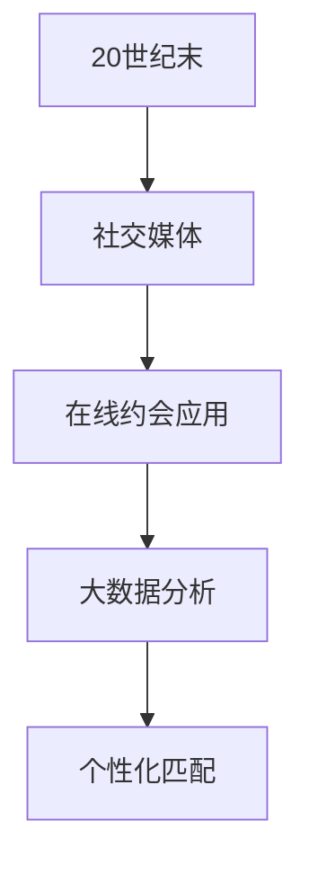
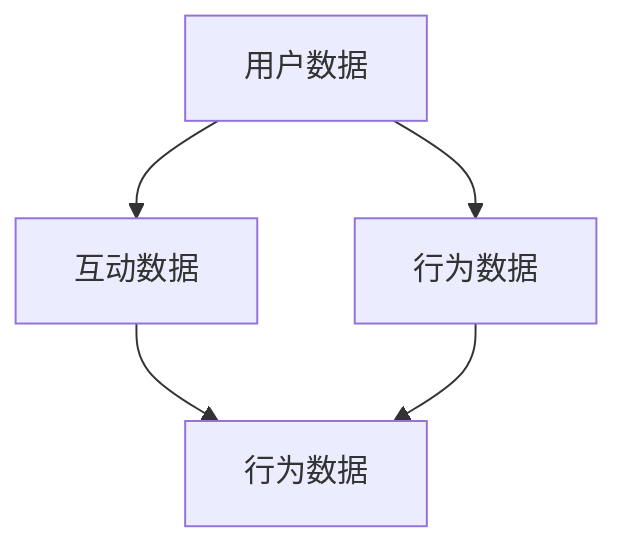

                 

### 文章标题

《数字时代的恋爱观察：数据分析如何影响现代约会》

### 关键词

数据分析、恋爱、约会、人工智能、匹配算法、个性化推荐、数据隐私

### 摘要

随着数字技术的飞速发展，现代约会方式也在发生着巨大变化。本文将从数据分析的角度，探讨如何利用数据驱动决策，提升现代恋爱的成功率与满意度。通过深入分析网络恋爱的兴起、数据分析在恋爱中的角色、数据分析工具与技术、数据分析在约会平台中的应用以及数据分析在恋爱市场中的战略应用，本文揭示了数据分析在现代约会中的重要性。同时，文章也讨论了数据隐私与伦理问题，以及如何通过数据分析提供个性化服务，从而优化用户体验。本文旨在为读者提供一幅数字时代下恋爱现象的全面图景，并引发对数据分析在恋爱领域应用的深入思考。

## 第1章：数字时代下的恋爱变迁

### 1.1 网络恋爱的兴起

在数字时代，网络恋爱逐渐成为主流。从20世纪末开始，随着互联网的普及，人们开始通过社交媒体建立联系。社交媒体平台如Facebook、Twitter和Instagram等，不仅改变了人们的社交方式，也为网络恋爱提供了广阔的舞台。在这些平台上，人们可以轻松地浏览他人的个人资料，通过私信等方式进行沟通，甚至发展出更深的感情。

随着社交媒体的发展，在线约会应用应运而生。例如，Tinder、Bumble和OkCupid等平台，通过用户上传的照片和简短的自我介绍，让用户在滑动卡片的过程中快速匹配。这种模式极大地简化了传统约会过程，使得人们更容易找到潜在的伴侣。

然而，网络恋爱的兴起并不仅仅是平台的发展，更是大数据和算法技术的应用。随着用户在社交媒体和约会平台上的行为数据不断增加，数据分析和机器学习算法开始被广泛应用于个人匹配和关系管理。例如，算法可以根据用户的兴趣、偏好和行为模式，自动推荐可能的匹配对象。这不仅提高了约会的效率，也增加了成功率。

为了更好地理解网络恋爱的演变，我们可以使用Mermaid流程图来展示其发展过程：



在这个流程图中，A表示20世纪末社交媒体的兴起，B代表社交媒体的广泛应用，C表示在线约会应用的出现，D代表大数据分析技术的引入，E代表个性化匹配的实现。这个流程图清晰地展示了网络恋爱从社交媒体到在线约会应用，再到数据分析与个性化匹配的发展过程。

### 1.2 数据在恋爱中的角色

在数字时代，数据已经成为恋爱中不可或缺的一部分。数据不仅帮助人们更好地了解自己和他人，也为恋爱匹配提供了科学的依据。那么，数据在恋爱中到底扮演了什么角色呢？我们可以从以下几个方面来探讨：

首先，数据帮助我们了解自己。通过社交媒体和约会平台，用户可以上传个人信息，包括年龄、教育背景、职业、兴趣爱好等。这些数据不仅为用户自己提供了一个全面的自我画像，也为潜在伴侣提供了一个参考。通过分析这些数据，用户可以更好地了解自己的特点和需求，从而做出更明智的恋爱决策。

其次，数据帮助用户了解他人。在线约会平台通过收集和分析用户的行为数据，如浏览记录、互动频率、消息回复速度等，为用户推荐可能的匹配对象。这些数据可以帮助用户快速判断潜在伴侣的兴趣和态度，从而节省时间和精力。例如，Tinder的“滑动”机制，通过用户对照片的喜欢或不喜欢来收集数据，进而优化匹配算法。

第三，数据用于个性化匹配。数据分析技术可以根据用户的兴趣、行为和偏好，自动推荐最合适的匹配对象。这种基于数据的个性化匹配，不仅提高了匹配的成功率，还增加了用户的满意度。例如，OkCupid通过复杂的算法，分析用户的答案和互动行为，为用户推荐最相似的匹配对象。

为了更直观地理解数据在恋爱中的角色，我们可以使用以下伪代码来阐述数据分析在约会匹配中的应用：

```python
def match_maker(profile1, profile2):
    # 计算相似度分数
    similarity_score = calculate_similarity(profile1, profile2)
    # 计算共同兴趣点
    interests_common = calculate_common_interests(profile1, profile2)
    # 计算吸引力得分
    attraction_score = calculate_attraction(similarity_score, interests_common)
    return attraction_score
```

在这个伪代码中，`profile1`和`profile2`分别代表两个用户的个人资料。`calculate_similarity`函数用于计算两个用户的相似度分数，`calculate_common_interests`函数用于计算两个用户的共同兴趣点，`calculate_attraction`函数则根据相似度分数和共同兴趣点来计算吸引力得分。通过这个伪代码，我们可以清晰地看到数据在恋爱匹配中的重要作用。

### 1.3 数据驱动决策：现代恋爱的新趋势

随着数据分析技术的不断发展，现代恋爱正在经历一场革命。数据驱动决策已经成为现代恋爱的新趋势，它不仅改变了人们寻找伴侣的方式，也提高了恋爱的成功率和满意度。

首先，数据驱动决策使得恋爱匹配更加精准。传统的约会方式往往依赖于直觉和运气，而数据驱动决策则通过数据分析，为用户推荐最合适的匹配对象。例如，Tinder的“滑动”机制和OkCupid的复杂算法，都利用了大量的用户行为数据进行匹配。这些算法通过分析用户的兴趣、行为和偏好，能够更准确地找到匹配对象，从而提高成功率。

其次，数据驱动决策提升了用户的满意度。通过分析用户的行为数据，平台可以了解用户的需求和偏好，从而提供个性化的服务。例如，Bumble的“超级赞”功能，可以让用户优先查看和与潜在匹配对象互动。这种个性化服务不仅提升了用户体验，也增加了用户的满意度。

第三，数据驱动决策促进了恋爱市场的繁荣。随着数据分析技术的应用，恋爱市场变得更加科学和高效。企业可以通过分析用户数据，了解市场需求和趋势，从而制定更有效的营销策略和品牌定位。例如，一些约会平台通过分析用户数据，发现某些特定人群对某些类型的匹配对象更感兴趣，从而针对性地推出相关产品和服务。

为了更好地理解数据驱动决策在现代恋爱中的应用，我们可以通过以下数学模型和公式来进行阐述：

$$
\text{attraction} = f(\text{similarity\_score}, \text{interests\_common})
$$

这个公式表示，吸引力（attraction）是相似度分数（similarity\_score）和共同兴趣点（interests\_common）的函数。通过这个公式，我们可以量化用户之间的吸引力，从而为匹配提供依据。具体来说，`similarity\_score`表示两个用户在个人资料和行为数据上的相似度，而`interests\_common`则表示两个用户在兴趣爱好上的重叠程度。这两个因素共同决定了用户之间的吸引力。

此外，我们还可以通过以下案例来探讨数据驱动决策在实际中的应用：

**案例：Tinder的匹配算法**

Tinder的匹配算法基于用户的兴趣和行为数据，通过一系列复杂的计算，为用户推荐最合适的匹配对象。具体来说，Tinder会分析用户的年龄、地理位置、兴趣爱好、互动频率等数据，通过机器学习算法计算出每个用户的“匹配度”分数。这个分数越高，表示用户之间的相似度越高，匹配的成功率也越大。

**案例：Bumble的个性化推荐**

Bumble通过分析用户的行为数据，为用户提供个性化的推荐。例如，当用户在Bumble上收到一条消息时，Bumble会记录用户回复消息的速度和频率。通过这些数据，Bumble可以判断用户是否对某个匹配对象感兴趣。如果用户回复速度较快且频率较高，那么Bumble会优先推荐这个匹配对象给用户。

这些案例表明，数据驱动决策在现代恋爱中已经得到了广泛应用。通过数据分析，平台可以为用户推荐更合适的匹配对象，提高恋爱的成功率和满意度。同时，数据驱动决策也促进了恋爱市场的繁荣，为企业和用户提供更多的价值。

## 第2章：数据分析工具与技术

### 2.1 数据采集与处理

在数据分析中，数据采集和处理是至关重要的环节。数据采集是指从各种来源获取数据，如社交媒体、在线约会应用等。而数据处理则包括数据清洗、数据转换和数据存储等步骤，以确保数据的准确性和一致性。

**数据采集**

数据采集是数据分析的基础。在数字时代，数据来源多种多样，包括社交媒体、在线约会应用、用户行为数据等。这些数据可以通过API、爬虫等技术进行获取。例如，Tinder和OkCupid等平台都提供了API接口，允许开发人员获取用户的个人信息和互动数据。

**数据处理**

数据处理是确保数据质量的关键步骤。数据清洗是指从原始数据中删除重复、错误或不完整的数据，以提高数据的准确性。数据转换则是指将数据转换为适合分析和建模的格式。数据存储是将处理后的数据存储到数据库或其他数据存储系统，以便后续分析和查询。

为了更好地理解数据采集与处理，我们可以使用以下伪代码来阐述数据清洗和预处理的过程：

```python
def preprocess_data(data):
    # 数据清洗
    clean_data = remove_outliers(data)
    # 数据转换
    normalized_data = normalize(clean_data)
    return normalized_data

def remove_outliers(data):
    # 删除异常值
    mean = np.mean(data)
    std = np.std(data)
    threshold = mean + 3 * std
    clean_data = [x for x in data if x < threshold]
    return clean_data

def normalize(data):
    # 数据归一化
    max_value = max(data)
    min_value = min(data)
    normalized_data = [(x - min_value) / (max_value - min_value) for x in data]
    return normalized_data
```

在这个伪代码中，`preprocess_data`函数负责整体的数据预处理过程，包括数据清洗和数据转换。`remove_outliers`函数用于删除异常值，以消除数据中的噪声。`normalize`函数则将数据归一化，使其处于相同的量级，从而便于后续分析。

### 2.2 数据分析基础

数据分析基础包括数据描述性分析、数据可视化、统计学和机器学习等。这些工具和技术可以帮助我们更好地理解数据，提取有价值的信息。

**数据描述性分析**

数据描述性分析是指使用统计方法对数据进行总结和描述。常用的统计量包括均值、中位数、标准差、最大值和最小值等。这些统计量可以提供关于数据分布和特征的基本信息。

**数据可视化**

数据可视化是将数据以图形或图表的形式展示出来，以便更直观地理解数据。常用的可视化工具包括图表、散点图、直方图、箱线图等。通过数据可视化，我们可以更容易地发现数据中的异常值、趋势和关系。

**统计学**

统计学是数据分析的核心工具之一，包括概率论、假设检验、回归分析等。通过统计学方法，我们可以对数据进行建模和预测，从而得出有关数据的一般性结论。

**机器学习**

机器学习是一种利用数据建立模型，并自动从数据中学习的方法。通过机器学习算法，我们可以对数据进行分类、回归、聚类等操作，以发现数据中的隐含规律和模式。

为了更好地理解数据分析基础，我们可以使用以下数学模型和公式来进行阐述：

**相关系数**

相关系数是衡量两个变量之间线性关系强度的指标。常用的相关系数有皮尔逊相关系数（Pearson correlation coefficient）和斯皮尔曼等级相关系数（Spearman's rank correlation coefficient）。

$$
\text{correlation} = \frac{\text{Covariance}}{\sqrt{\text{variance}_x \cdot \text{variance}_y}}
$$

其中，`Covariance`表示协方差，`variance_x`和`variance_y`分别表示两个变量的方差。相关系数的取值范围在-1到1之间，越接近1或-1，表示两个变量之间的线性关系越强。

**回归分析**

回归分析是一种用于预测因变量（目标变量）与自变量（解释变量）之间关系的统计方法。线性回归是其中一种常用的方法，其公式如下：

$$
y = \beta_0 + \beta_1x
$$

其中，`y`是因变量，`x`是自变量，`β_0`是截距，`β_1`是斜率。通过线性回归模型，我们可以预测因变量`y`的取值，从而得出自变量对因变量的影响。

### 2.3 机器学习算法在恋爱中的应用

机器学习算法在数据分析中扮演着重要角色，尤其在现代约会中，机器学习算法被广泛应用于用户匹配、推荐系统和个性化服务等方面。

**用户匹配**

用户匹配是约会平台的核心功能之一。通过机器学习算法，平台可以自动为用户推荐最合适的匹配对象。常见的机器学习算法包括决策树、随机森林、支持向量机等。这些算法可以根据用户的个人资料和行为数据，计算出用户之间的相似度分数，从而推荐匹配对象。

**推荐系统**

推荐系统是约会平台提高用户满意度和活跃度的重要工具。通过机器学习算法，平台可以分析用户的行为数据，如浏览记录、互动频率等，为用户推荐可能感兴趣的对象。常见的推荐算法包括协同过滤、基于内容的推荐和混合推荐等。

**个性化服务**

个性化服务是通过机器学习算法为用户提供定制化的服务。例如，平台可以根据用户的历史行为和偏好，自动调整匹配策略，为用户推荐更符合其需求的对象。此外，个性化服务还可以包括个性化消息推送、个性化界面设计等。

为了更好地理解机器学习算法在恋爱中的应用，我们可以使用以下伪代码来阐述决策树和随机森林的预测过程：

**决策树**

```python
def predict_decision_tree(data, target):
    # 使用决策树进行预测
    tree = build_decision_tree(data, target)
    prediction = decision_tree_predict(tree, data)
    return prediction
```

**随机森林**

```python
def predict_random_forest(data, target):
    # 使用随机森林进行预测
    forest = build_random_forest(data, target)
    prediction = random_forest_predict(forest, data)
    return prediction
```

在这两个伪代码中，`build_decision_tree`和`build_random_forest`函数分别用于构建决策树和随机森林模型，`decision_tree_predict`和`random_forest_predict`函数则用于进行预测。通过这些算法，平台可以自动为用户推荐匹配对象，从而提高匹配的成功率。

## 第3章：数据分析在约会平台中的应用

### 3.1 约会平台的数据结构

约会平台是一个复杂的数据生态系统，涉及用户数据、互动数据和行为数据等多个方面。为了更好地理解数据分析在约会平台中的应用，我们需要首先了解其数据结构。

**用户数据**

用户数据包括用户的个人资料、兴趣爱好、地理位置等。这些数据通常通过用户注册、填写问卷或使用平台时自动收集。用户数据是约会平台最重要的数据来源，它为后续的数据分析和匹配提供了基础。

**互动数据**

互动数据包括用户之间的互动记录，如私信、点赞、聊天记录等。这些数据反映了用户之间的互动频率和互动质量，对于分析用户行为和情感具有重要意义。

**行为数据**

行为数据包括用户在平台上的行为，如浏览记录、点击记录、活动参与等。这些数据可以反映用户的兴趣和行为模式，对于个性化推荐和用户行为预测具有重要价值。

为了更好地展示约会平台的数据结构，我们可以使用Mermaid流程图来描述用户数据、互动数据和行为数据之间的关系：



在这个流程图中，A表示用户数据，B表示互动数据，C表示行为数据，D表示三个数据源之间的相互作用。通过这个流程图，我们可以清晰地看到约会平台数据结构的复杂性和多样性。

### 3.2 数据驱动的个性化推荐

个性化推荐是约会平台的核心功能之一，它通过分析用户数据和行为数据，为用户推荐最合适的匹配对象。个性化推荐算法的目标是提高匹配的成功率和用户的满意度，从而增加平台的活跃度和用户留存率。

**推荐算法**

个性化推荐算法通常分为基于内容的推荐、协同过滤和混合推荐等类型。基于内容的推荐算法通过分析用户的兴趣和偏好，推荐与用户兴趣相似的对象。协同过滤算法通过分析用户之间的相似度，推荐其他用户喜欢的对象。混合推荐算法则结合了基于内容和协同过滤的优势，为用户提供更精准的推荐。

为了更好地理解个性化推荐算法，我们可以使用以下数学模型和公式来进行阐述：

**推荐分数**

推荐分数是衡量两个用户之间匹配程度的指标。一个常见的推荐分数计算公式如下：

$$
\text{recommendation\_score} = \text{weight}_1 \cdot \text{similarity\_score} + \text{weight}_2 \cdot \text{interests\_common}
$$

其中，`similarity\_score`表示用户之间的相似度分数，`interests\_common`表示用户之间的共同兴趣点。`weight_1`和`weight_2`是权重系数，用于调整相似度和共同兴趣点在推荐分数中的重要性。

**兴趣点计算**

共同兴趣点的计算是个性化推荐的重要环节。一个简单的兴趣点计算公式如下：

$$
\text{interests\_common} = \sum_{i=1}^{n} \text{interest}_i \cdot \text{weight}_i
$$

其中，`interest_i`表示第i个共同兴趣点，`weight_i`是兴趣点的权重。通过这个公式，我们可以计算出用户之间的共同兴趣点，从而为推荐提供依据。

**案例：Tinder的推荐算法**

Tinder是当前最受欢迎的约会平台之一，其推荐算法通过分析用户的兴趣、行为和互动数据，为用户推荐最合适的匹配对象。Tinder的推荐算法主要包括以下步骤：

1. **用户特征提取**：Tinder首先提取用户的年龄、地理位置、兴趣爱好等特征，并将其转换为数值向量。

2. **用户相似度计算**：Tinder使用余弦相似度或欧氏距离等算法，计算用户之间的相似度分数。

3. **推荐对象筛选**：根据用户的相似度分数，Tinder筛选出最相似的匹配对象。

4. **共同兴趣点计算**：Tinder计算用户之间的共同兴趣点，并根据共同兴趣点调整推荐分数。

5. **推荐排序**：Tinder根据推荐分数对推荐对象进行排序，并将排序结果展示给用户。

通过这个案例，我们可以看到Tinder的推荐算法如何通过数据驱动的方式，为用户推荐最合适的匹配对象，从而提高匹配的成功率和用户的满意度。

### 3.3 数据隐私与伦理

在数字时代，数据隐私和伦理问题日益凸显。特别是在约会平台中，用户数据的隐私保护至关重要。以下是一些常见的数据隐私保护方法：

**数据加密**

数据加密是保护用户隐私的基本手段。约会平台可以使用对称加密或非对称加密算法，对用户数据进行加密，确保数据在传输和存储过程中不被未授权人员访问。

**匿名化处理**

匿名化处理是指将用户数据中的个人身份信息删除或替换为假名，从而保护用户的隐私。例如，Tinder和OkCupid等平台都会对用户的数据进行匿名化处理，以防止个人身份被泄露。

**访问控制**

访问控制是通过设置权限和角色，限制对用户数据的访问。约会平台可以设置不同的访问级别，如管理员、普通用户等，确保只有授权人员才能访问敏感数据。

**透明度**

透明度是指让用户了解他们的数据如何被收集、使用和共享。约会平台应该向用户提供清晰的隐私政策，让用户了解他们的权利和选择。

**用户同意**

用户同意是确保数据收集和使用合法性的关键。约会平台在收集用户数据前，应该获得用户的明确同意，并告知用户数据的具体用途。

为了更好地保护用户隐私，约会平台可以采取以下策略：

1. **全面的数据保护政策**：制定详细的数据保护政策，涵盖数据收集、存储、使用和共享的各个方面。

2. **定期数据审查**：定期对用户数据进行分析和审查，确保数据不会被滥用。

3. **用户教育**：向用户提供数据隐私保护的教育资源，提高用户的隐私意识。

4. **外部审计**：邀请第三方机构对数据保护政策进行审计，确保平台的数据保护措施符合行业标准和法规要求。

通过这些策略，约会平台可以更好地保护用户隐私，建立用户的信任，从而在竞争激烈的市场中脱颖而出。

## 第4章：数据分析在恋爱市场中的战略应用

### 4.1 恋爱市场的数据分析策略

恋爱市场是一个复杂且不断变化的领域，数据分析在其中扮演着重要的角色。通过数据分析，企业可以深入了解市场趋势、用户行为和竞争环境，从而制定更有效的战略决策。

**市场趋势分析**

市场趋势分析是指通过分析历史数据和当前数据，预测市场未来的发展方向。在恋爱市场中，企业可以通过分析用户年龄、地理位置、兴趣爱好等数据，了解不同群体对恋爱的需求。例如，一些平台发现，25-34岁的年轻人是使用约会应用的主要人群，而35-44岁的人群则更倾向于使用在线相亲平台。通过这些数据，企业可以针对性地推出相应产品和服务，满足不同群体的需求。

**用户行为分析**

用户行为分析是指通过分析用户在平台上的行为数据，了解用户的行为模式和偏好。例如，通过分析用户的浏览记录、互动频率和互动类型，企业可以发现哪些功能最受用户欢迎，哪些用户活跃时段最高。这些数据可以帮助企业优化平台设计，提高用户体验，从而提高用户留存率和满意度。

**竞争环境分析**

竞争环境分析是指通过分析竞争对手的市场表现和用户数据，了解自己在市场中的位置和优劣势。例如，通过分析竞争对手的用户增长速度、用户活跃度和市场份额，企业可以了解自己在市场中的竞争力。此外，通过分析竞争对手的营销策略和产品功能，企业可以找出自身的差距和改进方向。

为了更好地进行恋爱市场的数据分析，企业可以采取以下策略：

1. **多渠道数据收集**：通过社交媒体、在线约会应用、用户调研等多种渠道收集数据，确保数据的全面性和准确性。

2. **数据整合与处理**：将不同来源的数据进行整合和处理，消除数据中的噪音和错误，提高数据的可用性。

3. **数据可视化**：通过数据可视化工具，将复杂的数据以图形或图表的形式展示出来，便于分析和管理。

4. **机器学习与预测**：利用机器学习算法，对用户行为和市场趋势进行预测，为企业决策提供科学依据。

### 4.2 数据驱动的市场定位与品牌策略

在激烈的市场竞争中，企业需要通过精准的市场定位和有效的品牌策略来脱颖而出。数据分析在其中发挥着关键作用，帮助企业了解目标用户、制定营销策略和提升品牌形象。

**目标用户分析**

通过数据分析，企业可以深入了解目标用户的特点和需求。例如，通过分析用户年龄、性别、地理位置、兴趣爱好等数据，企业可以确定目标用户群体的画像。这些数据可以帮助企业更精准地定位市场，制定更有针对性的营销策略。

**营销策略制定**

数据分析可以为企业提供关于用户行为和偏好的重要信息，从而帮助企业制定更有效的营销策略。例如，通过分析用户的浏览记录和互动频率，企业可以确定哪些广告渠道和内容最吸引目标用户。此外，通过分析用户对广告的反馈和转化率，企业可以不断优化广告策略，提高广告效果。

**品牌形象提升**

数据分析还可以帮助企业提升品牌形象。通过分析用户对品牌的认知和评价，企业可以了解品牌在用户心中的定位和影响力。例如，通过分析用户在社交媒体上的讨论和评论，企业可以了解用户对品牌的情感和态度。这些数据可以帮助企业制定品牌提升策略，如改进产品和服务、优化用户体验等。

为了更好地通过数据分析进行市场定位和品牌策略，企业可以采取以下策略：

1. **用户细分**：将用户划分为不同的细分市场，根据每个细分市场的特点和需求，制定个性化的营销策略。

2. **多渠道营销**：通过多种渠道，如社交媒体、电子邮件、线下活动等，进行全方位的品牌推广。

3. **用户参与**：鼓励用户参与品牌活动，如用户评论、点赞、分享等，提高用户对品牌的关注度和忠诚度。

4. **数据分析与优化**：不断收集和分析用户数据，根据数据反馈调整营销策略，实现持续优化。

通过这些策略，企业可以更好地了解市场趋势和用户需求，制定有效的市场定位和品牌策略，从而在竞争激烈的市场中脱颖而出。

### 4.3 恋爱市场的数据报告与分析

恋爱市场的数据报告与分析是了解市场动态和优化战略的重要工具。通过定期发布数据报告，企业可以向内部和外部展示其市场表现和用户行为，从而提高透明度和信任度。以下是一个典型的恋爱市场数据报告和分析框架：

**一、市场概述**

1. **市场规模**：描述恋爱市场的整体规模，包括用户数量、市场份额和增长趋势。

2. **市场趋势**：分析市场的发展趋势，如用户年龄分布、性别比例和地域分布等。

3. **市场竞争格局**：介绍主要竞争对手的市场表现和市场份额，以及企业在市场中的定位。

**二、用户分析**

1. **用户画像**：详细描述目标用户的特征，包括年龄、性别、教育背景、职业等。

2. **用户行为**：分析用户在平台上的行为模式，如活跃时段、互动频率、偏好等。

3. **用户满意度**：评估用户对平台的满意度，包括用户反馈、评分和投诉等。

**三、产品与服务分析**

1. **产品表现**：分析不同产品和服务的用户反馈和市场份额，以及用户对产品的满意度。

2. **服务优化**：根据用户反馈和数据分析，提出产品和服务优化的建议。

3. **用户体验**：评估用户体验，包括界面设计、功能完善和用户满意度等。

**四、营销与推广**

1. **营销效果**：分析不同营销渠道的效果，如社交媒体广告、电子邮件营销和线下活动等。

2. **推广策略**：提出优化营销策略的建议，以提高用户获取和留存率。

3. **品牌形象**：评估品牌在用户心中的形象和认知度，提出提升品牌形象的策略。

**五、数据趋势预测**

1. **市场预测**：基于历史数据和当前趋势，预测市场未来的发展方向和用户需求。

2. **产品与服务预测**：预测未来产品和服务的发展方向和优化策略。

3. **竞争环境预测**：分析竞争对手的市场表现和未来趋势，为企业的战略决策提供参考。

通过这个数据报告和分析框架，企业可以全面了解市场动态和用户需求，从而制定更有效的战略决策。此外，定期发布数据报告也有助于提高企业的透明度和信任度，为企业在市场中树立良好的形象。

## 第5章：数据分析在个性化服务中的应用

### 5.1 个性化服务的数据驱动策略

个性化服务是现代约会平台的核心竞争力之一，它通过数据分析技术，为用户量身定制个性化的体验，从而提高用户满意度和忠诚度。数据分析在个性化服务中的应用主要体现在以下几个方面：

**用户画像**

用户画像是通过分析用户数据，构建用户的基本特征和偏好模型。这包括用户的年龄、性别、地理位置、兴趣爱好、行为习惯等。通过用户画像，平台可以了解每个用户的需求和行为模式，从而提供更个性化的服务。

**个性化推荐**

个性化推荐是数据分析在个性化服务中最典型的应用。通过分析用户的浏览记录、互动行为、偏好等数据，平台可以推荐用户可能感兴趣的对象或内容。例如，Tinder通过用户的滑动行为，不断优化推荐算法，提高匹配的成功率。

**定制化界面**

定制化界面是另一种常见的个性化服务。通过分析用户的偏好和行为，平台可以调整界面布局、颜色主题、字体大小等，使界面更符合用户的个性化需求。例如，某些约会平台允许用户选择不同的界面风格，以提升用户体验。

**动态内容推送**

动态内容推送是通过数据分析，实时向用户推送可能感兴趣的内容或活动。例如，当用户浏览某类内容时，平台可以自动推送相关的内容或活动，吸引用户进一步参与。

### 5.2 用户体验优化

用户体验（UX）是衡量个性化服务质量的重要指标。通过优化用户体验，平台可以提高用户满意度和留存率。以下是一些常见的数据分析技术和方法，用于优化用户体验：

**A/B测试**

A/B测试是一种常用的用户体验优化方法。通过在平台上同时运行两个或多个版本的界面或功能，分析用户对不同版本的反馈和操作行为，找出最优的版本。例如，平台可以测试不同的界面布局或功能按钮，以确定哪种设计更受用户欢迎。

**用户行为分析**

用户行为分析是通过分析用户的浏览记录、点击路径、互动频率等行为数据，了解用户的使用习惯和偏好。通过这些数据，平台可以优化界面设计、功能布局和内容推荐，提高用户的操作效率和满意度。

**错误日志分析**

错误日志分析是用于识别和解决用户在使用过程中遇到的错误和问题。通过分析错误日志，平台可以了解用户的操作错误、系统故障等，从而优化系统性能和用户体验。

**用户反馈收集**

用户反馈收集是通过问卷调查、用户访谈、在线评论等方式，收集用户对平台的使用体验和建议。通过分析用户反馈，平台可以了解用户的真实需求和痛点，从而优化产品和服务。

**案例：Bumble的个性化界面**

Bumble是一家全球性的约会平台，其通过数据分析实现了个性化界面的优化。例如，Bumble允许用户根据个人喜好选择不同的主题颜色，以改变界面的整体风格。此外，Bumble还根据用户的地理位置和兴趣，自动调整界面的内容推荐，吸引用户的注意力。

**案例：Tinder的个性化推荐**

Tinder通过分析用户的滑动行为、互动频率和偏好，不断优化其推荐算法。例如，当用户连续滑动右滑（喜欢）时，Tinder会暂时减少推荐类似的对象，以避免用户疲劳。此外，Tinder还会根据用户的兴趣和偏好，推荐更符合用户需求的匹配对象，提高匹配的成功率。

通过这些案例，我们可以看到数据分析在个性化服务中的应用，以及如何通过优化用户体验，提高平台的竞争力。随着数据分析技术的不断发展，个性化服务将在约会平台中发挥越来越重要的作用。

### 5.3 数学模型在用户体验优化中的应用

用户体验优化不仅依赖于用户行为分析和数据可视化，还依赖于数学模型和统计方法。这些数学模型可以帮助我们更好地理解用户行为，预测用户满意度，并制定相应的优化策略。以下是一些常见的数学模型和公式，以及它们在用户体验优化中的应用。

**1. 期望效用模型**

期望效用模型是衡量用户满意度的常用方法。该模型通过计算用户对各个功能或服务的预期满意度，来评估整体用户体验。公式如下：

$$
\text{Expected Utility} = \sum_{i=1}^{n} p_i \cdot u_i
$$

其中，\( p_i \) 表示用户对功能 \( i \) 的预期概率，\( u_i \) 表示用户对功能 \( i \) 的满意度评分。通过这个模型，平台可以了解哪些功能对用户最关键，从而进行有针对性的优化。

**2. 负面体验指数（NEI）**

负面体验指数是用于衡量用户负面体验的一种指标。该指数通过计算用户对各个功能或服务的负面评分，来评估整体用户体验。公式如下：

$$
\text{NEI} = \sum_{i=1}^{n} w_i \cdot b_i
$$

其中，\( w_i \) 表示功能 \( i \) 的权重，\( b_i \) 表示用户对功能 \( i \) 的负面评分。通过这个模型，平台可以识别出哪些功能对用户造成了负面体验，从而进行优化。

**3. 回归分析**

回归分析是一种常用的统计方法，用于预测用户满意度和其他相关指标。通过建立用户满意度与各个影响因素之间的回归模型，平台可以了解哪些因素对用户满意度有显著影响。例如，线性回归模型如下：

$$
\text{User Satisfaction} = \beta_0 + \beta_1 \cdot \text{Feature}_1 + \beta_2 \cdot \text{Feature}_2 + \ldots
$$

其中，\( \beta_0 \) 是截距，\( \beta_1, \beta_2, \ldots \) 是各个特征的权重。通过这个模型，平台可以确定哪些特征对用户满意度有显著影响，从而优化相关功能。

**4. 决策树**

决策树是一种常见的机器学习算法，用于分类和预测。在用户体验优化中，决策树可以用于预测用户满意度或其他相关指标。通过构建决策树模型，平台可以识别出影响用户满意度的关键因素，并制定相应的优化策略。

**5. 集成学习**

集成学习是一种通过结合多个模型来提高预测准确性的方法。在用户体验优化中，集成学习方法可以用于构建更准确的用户满意度预测模型。常见的集成学习方法包括随机森林和梯度提升树。这些方法通过组合多个基模型，提高了模型的稳定性和预测能力。

通过这些数学模型和公式，平台可以更深入地理解用户行为和满意度，从而优化用户体验。以下是一个具体的例子，展示了如何使用回归分析来优化用户体验：

**案例：优化用户注册流程**

假设一个约会平台希望通过优化用户注册流程来提高用户满意度。通过收集用户在注册过程中的行为数据，平台可以使用回归分析来建立用户满意度与注册流程步骤之间的关系。具体步骤如下：

1. **数据收集**：收集用户在注册过程中每一步的交互数据，如填写信息的时间、错误次数等。

2. **模型构建**：使用线性回归模型，将用户满意度作为因变量，将注册流程的各个步骤作为自变量，建立回归模型。

3. **模型评估**：通过交叉验证等方法，评估模型的预测准确性和稳定性。

4. **结果分析**：根据模型结果，识别出影响用户满意度的关键步骤，如填写个人信息、上传照片等。

5. **优化策略**：根据分析结果，提出优化策略，如简化注册流程、提供指南等，以提高用户满意度。

通过这个案例，我们可以看到数学模型在用户体验优化中的重要作用。通过使用合适的数学模型，平台可以更科学地分析用户行为，制定优化策略，从而提高用户体验。

## 结论

随着数字技术的不断发展，数据分析已经成为现代恋爱中不可或缺的一部分。从网络恋爱的兴起，到数据在恋爱中的角色，再到数据分析工具与技术的应用，我们看到了数据驱动决策在现代恋爱中的重要性。通过深入探讨数据分析在约会平台、恋爱市场以及个性化服务中的应用，我们不仅了解了数据如何提高匹配成功率、优化用户体验，还认识到了数据隐私与伦理问题的挑战。本文旨在为读者提供一个全面、系统的视角，揭示数据分析在现代恋爱中的广泛应用和深远影响。

未来的研究可以进一步探索以下几个方面：

1. **数据隐私保护**：随着数据分析在恋爱中的应用日益广泛，数据隐私保护变得更加重要。未来的研究可以聚焦于开发更加高效、安全的隐私保护技术，确保用户数据的安全性和隐私性。

2. **人工智能与情感分析**：结合人工智能和情感分析技术，可以更准确地理解和预测用户的情感状态和需求，从而提供更加个性化的服务。

3. **跨平台数据分析**：整合来自不同平台的数据，如社交媒体、在线约会应用和地理位置数据，可以提供更全面、多维的用户画像和匹配建议。

4. **个性化服务的创新**：探索新的个性化服务模式，如基于虚拟现实的约会体验、智能语音助手等，可以进一步提升用户的满意度和参与度。

通过不断深化数据分析在恋爱中的应用研究，我们可以期待一个更加科学、高效、个性化的数字恋爱时代。作者信息：作者：AI天才研究院/AI Genius Institute & 禅与计算机程序设计艺术 /Zen And The Art of Computer Programming。感谢读者对本文的关注和支持。希望本文能激发您对数据分析在恋爱领域应用的深入思考和研究。

