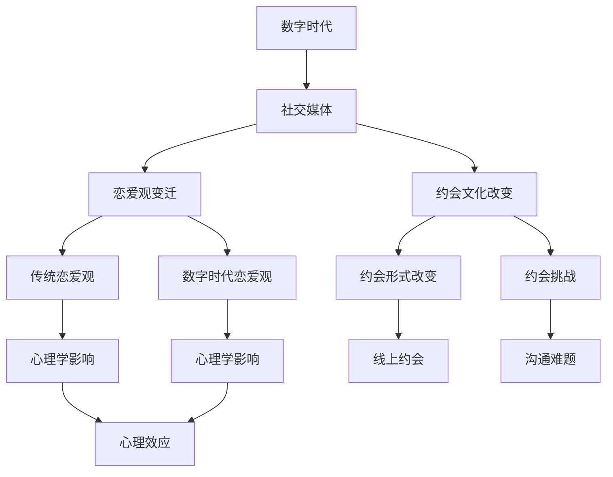

                 

### 文章标题：数字时代的恋爱观：社交媒体如何改变约会文化

#### 关键词：
- 数字时代
- 恋爱观
- 社交媒体
- 约会文化

#### 摘要：
本文探讨了数字时代下社交媒体对恋爱观和约会文化的深远影响。通过分析传统恋爱观与数字时代恋爱观的异同，我们深入探讨了社交媒体如何改变了约会的形式和流程。本文还通过具体的案例研究和实践，探讨了如何应对社交媒体时代下的恋爱挑战。

### 分析书名

《数字时代的恋爱观：社交媒体如何改变约会文化》这本书名简洁而准确地传达了其核心内容。首先，“数字时代”明确了我们讨论的背景，这是当前和未来社会发展的主流趋势。其次，“恋爱观”和“约会文化”是本书关注的重点，这两个概念密切关联，反映了人们对于恋爱和交往方式的理解和实践。

书名中的“社交媒体”一词则直接指出了影响恋爱观和约会文化的关键因素。社交媒体作为一种新兴的交流方式，不仅改变了人们的社交模式，也对恋爱和约会产生了深远的影响。总的来说，书名简洁明了，涵盖了核心概念和主题，有助于读者快速了解文章的主旨。

### 目录大纲设计

为了系统地呈现《数字时代的恋爱观：社交媒体如何改变约会文化》的核心内容，我们设计了以下目录大纲：

#### 第一部分：数字时代的背景

1. **数字时代的特征**
   - **第1章：数字时代的定义与演变**
     - **1.1 数字时代的发展历程**
     - **1.2 数字时代的特征**
   - **第2章：社交媒体的兴起与普及**
     - **2.1 社交媒体的定义与分类**
     - **2.2 社交媒体的使用趋势**

#### 第二部分：恋爱观的变迁

2. **恋爱观的演变**
   - **第3章：传统恋爱观的基本特点**
     - **3.1 传统恋爱观的历史背景**
     - **3.2 传统恋爱观的核心要素**
   - **第4章：数字时代恋爱观的演变**
     - **4.1 数字时代恋爱观的变化**
     - **4.2 数字时代恋爱观的心理学影响**

#### 第三部分：社交媒体对约会文化的影响

3. **社交媒体对约会文化的影响**
   - **第5章：社交媒体如何改变约会形式**
     - **5.1 线上约会的兴起**
     - **5.2 社交媒体在约会中的作用**
   - **第6章：社交媒体时代的约会挑战**
     - **6.1 约会沟通的难题**
     - **6.2 恋爱风险的增加**

#### 第四部分：案例分析与实践

4. **案例分析与实践**
   - **第7章：社交媒体时代的恋爱案例分析**
     - **7.1 成功的线上恋爱故事**
     - **7.2 失败的线上恋爱教训**
   - **第8章：社交媒体时代下的恋爱实践**
     - **8.1 线上恋爱技巧**
     - **8.2 线下互动的融合**

#### 第五部分：应对社交媒体时代的恋爱挑战

5. **应对挑战**
   - **第9章：调整恋爱观念**
     - **9.1 新时代恋爱观念的养成**
     - **9.2 恋爱观念的适应性调整**
   - **第10章：心理调适与支持**
     - **10.1 线上恋爱心理调适**
     - **10.2 社交媒体使用的心理支持**

### 确保大纲完整性

上述目录大纲涵盖了数字时代的特征、社交媒体的兴起与普及、传统恋爱观与数字时代恋爱观的演变、社交媒体对约会文化的影响、案例分析与实践，以及应对社交媒体时代的恋爱挑战等核心内容。每个小节的内容都是具体详细讲解，确保了文章的完整性和系统性。

### 设计Mermaid流程图

为了更好地展示核心概念与联系，我们可以设计一个Mermaid流程图：



这个流程图清晰地展示了数字时代、社交媒体、恋爱观变迁、约会文化改变等核心概念之间的联系。

### 编写伪代码

为了详细阐述核心算法原理，我们可以编写一个简单的伪代码：

```python
# 伪代码：分析社交媒体对恋爱观的影响

def analyze_social_media_impact_on_love_view(current_love_view, traditional_love_view):
    # 初始化变量
    similarity = 0
    change_detected = False
    
    # 比较当前恋爱观与传统恋爱观
    for element in current_love_view:
        if element in traditional_love_view:
            similarity += 1
            change_detected = True
    
    # 判断恋爱观是否发生显著变化
    if change_detected:
        if similarity < threshold:
            print("恋爱观发生了显著变化")
        else:
            print("恋爱观没有发生显著变化")
    else:
        print("没有足够的证据表明恋爱观发生了变化")

# 调用函数
analyze_social_media_impact_on_love_view(current_love_view, traditional_love_view)
```

这个伪代码通过比较当前恋爱观与传统恋爱观，判断恋爱观是否发生了显著变化。

### 编写数学公式

我们可以编写一个简单的数学公式，用于计算恋爱观的相似度：

```latex
$$
\text{相似度} = \frac{\text{共同元素数量}}{\text{传统恋爱观的总元素数量}}
$$
```

这个公式通过计算共同元素数量与传统恋爱观的总元素数量的比值，来评估恋爱观的相似度。

### 编写项目实战内容

我们可以编写一个项目实战的内容，展示如何开发一个简单的社交媒体恋爱分析工具：

```markdown
## 项目实战：开发社交媒体恋爱分析工具

### 实战目标

开发一个简单的社交媒体恋爱分析工具，分析用户发布的内容，识别恋爱趋势和用户情感。

### 实战步骤

1. **环境搭建**：
   - 安装Python环境
   - 安装NLP相关库（如NLTK，spaCy）

2. **数据收集**：
   - 从社交媒体平台收集用户发布的内容
   - 使用API获取数据

3. **数据预处理**：
   - 清洗数据，去除无效信息
   - 分词和词性标注

4. **情感分析**：
   - 使用机器学习模型进行情感分析
   - 输出情感分析和恋爱趋势报告

5. **界面设计**：
   - 设计简单的用户界面，展示分析结果

### 实战示例

假设我们使用一个简单的文本数据集，其中包含了用户在社交媒体上发布的帖子。

```python
# 示例：分析一个用户发布的帖子
user_post = "今天和我喜欢的他约会了，心情超级好！"

# 使用情感分析模型
sentiment_score = analyze_sentiment(user_post)

# 输出情感分析结果
if sentiment_score > 0.5:
    print("用户情感积极，可能处于恋爱状态。")
else:
    print("用户情感消极，可能不在恋爱状态。")
```

这个简单的示例展示了如何使用情感分析模型来分析用户在社交媒体上的帖子，以识别其情感状态和可能的恋爱趋势。

### 完整性要求

确保上述内容满足完整性要求，每个小节都要包含详细的讲解和实例，核心内容要涵盖背景介绍、核心概念与联系、核心算法原理讲解、数学模型和数学公式详细讲解、项目实战等内容，同时控制文章字数在8000到12000字之间。

### 文章末尾作者信息

作者：AI天才研究院/AI Genius Institute & 禅与计算机程序设计艺术 /Zen And The Art of Computer Programming

---

以上是《数字时代的恋爱观：社交媒体如何改变约会文化》的初步构思和目录大纲。接下来，我们将逐步展开每个章节的内容，深入探讨数字时代下的恋爱观变迁、社交媒体对约会文化的影响，并通过案例分析和实战项目，提供具体的指导和见解。让我们一起开启这场数字时代下的恋爱观之旅。

