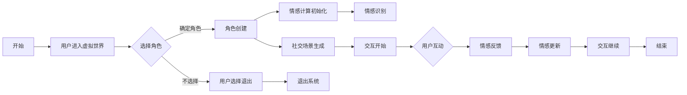

                 

### 文章标题

《数字时代的情感教育：虚拟角色扮演在人际交往中的应用》

### 文章关键词

数字时代、情感教育、虚拟角色扮演、人际交往、人工智能

### 文章摘要

随着数字技术的飞速发展，虚拟角色扮演在人际交往中的应用逐渐成为一个热门领域。本文将探讨数字时代情感教育的发展背景，深入分析虚拟角色扮演的基本原理和核心算法，通过具体的数学模型和公式，详细阐述其在人际交往中的应用。此外，本文还将结合实际案例，展示虚拟角色扮演在情感教育中的项目实战，为读者提供实用的开发环境和源代码解读。通过本文的阅读，读者将能够全面了解虚拟角色扮演在数字时代情感教育中的重要作用，以及如何有效应用这一技术提升人际交往能力。 

### 第一部分：引言

#### 1.1 数字时代的情感教育概述

在数字时代，情感教育的重要性愈发凸显。传统教育模式更多注重知识传授和技能培养，而忽视了情感教育。然而，在现代社会中，情感智能和人际交往能力的重要性日益凸显。人们不仅在学术和职业领域需要良好的沟通和合作能力，在日常生活中也需要处理复杂的人际关系。

情感教育旨在培养个体的情感认知、情感表达和情感管理能力。这不仅仅是为了个体的心理健康，也是为了构建和谐的社会关系。在数字时代，情感教育的需求更加迫切，因为虚拟世界中的互动不同于现实世界，需要更高级的情感智能来处理复杂的社交情境。

数字时代情感教育的发展趋势体现在以下几个方面：

1. **技术驱动的个性化学习**：借助人工智能和大数据技术，情感教育可以更加精准地识别个体情感状态，提供个性化的学习方案。
2. **虚拟现实（VR）与增强现实（AR）的应用**：VR和AR技术为情感教育提供了新的平台，通过沉浸式体验，让学习者更加深入地理解情感交互。
3. **社会网络的拓展**：社交媒体和在线平台为情感教育提供了新的渠道，使得情感教育不再局限于课堂，而是可以渗透到日常生活的方方面面。

#### 1.2 虚拟角色扮演技术基础

虚拟角色扮演（Virtual Role-Playing，VRP）是一种通过虚拟环境中的角色互动来模拟真实世界的社交情境的技术。它结合了虚拟现实（VR）和角色扮演游戏（RPG）的元素，通过高度模拟的虚拟角色，让用户在虚拟世界中体验各种社交互动。

虚拟角色扮演技术的基础主要包括以下几个方面：

1. **虚拟现实技术**：虚拟现实技术提供了虚拟世界的构建基础，通过头戴显示器（HMD）和手部追踪设备，用户可以进入一个沉浸式的虚拟环境。
2. **角色扮演游戏原理**：角色扮演游戏中的角色设计和任务设定为虚拟角色扮演提供了丰富的素材，使得用户可以在虚拟世界中扮演不同的角色，进行多样化的互动。
3. **交互设计**：虚拟角色扮演的交互设计至关重要，它决定了用户在虚拟世界中的行为和感受。良好的交互设计可以增强用户的沉浸感和互动体验。

#### 1.3 虚拟角色扮演在情感教育中的应用前景

虚拟角色扮演在情感教育中具有巨大的潜力，可以应用于多个领域：

1. **社交技能培训**：通过虚拟角色扮演，用户可以在虚拟社交场景中练习沟通技巧，提高社交能力，如礼貌用语、表达情感等。
2. **心理健康干预**：虚拟角色扮演可以为心理治疗提供新的工具，如通过虚拟角色扮演来模拟社交焦虑场景，帮助用户逐渐克服焦虑情绪。
3. **教育评估**：虚拟角色扮演可以作为教育评估的工具，通过分析用户在虚拟社交场景中的表现，评估其情感认知和人际交往能力。

总之，虚拟角色扮演在数字时代情感教育中的应用前景广阔，有望成为未来情感教育的重要手段。然而，这也需要技术的不断进步和完善，以提供更加真实和有效的情感教育体验。接下来，本文将进一步探讨虚拟角色扮演技术的核心原理和应用细节。 

### 第二部分：核心概念与联系

#### 2.1 情感计算与情感交互

情感计算（Affective Computing）是计算机科学领域的一个分支，旨在使计算机具备识别、理解、处理和表达情感的能力。情感计算的核心目标是构建智能系统，能够与人类进行更加自然和丰富的情感交互。

情感计算的基本原理包括以下几个方面：

1. **情感识别**：通过分析用户的生理信号（如心率、皮肤电导等）、语言信号（如语音的音调、语速等）和行为信号（如面部表情、身体动作等），计算机能够识别用户的情感状态。
2. **情感理解**：情感理解是指计算机能够理解情感的意义和情感之间的相互作用。这需要借助自然语言处理（NLP）和机器学习（ML）技术，从用户的语言和行为中提取情感信息。
3. **情感表达**：情感表达是指计算机能够通过声音、文字、面部表情等方式，表达出相应的情感。这要求计算机具有情感生成和情感模拟的能力。

在虚拟角色扮演中，情感计算的应用至关重要。通过情感计算，虚拟角色能够更加真实地模拟人类的情感反应，从而提高用户的沉浸感和互动体验。情感交互（Affective Interaction）则是指用户与虚拟角色之间的情感互动过程。良好的情感交互需要情感计算的支持，使得虚拟角色能够根据用户的情感状态做出适当的反应，从而建立情感共鸣。

#### 2.2 人际交往心理学

人际交往心理学是研究个体如何与他人建立联系、沟通和互动的学科。它涉及多个方面，包括社交行为、社交认知、社交情感等。

1. **社交行为**：社交行为是指个体在社交情境中表现出的行为模式，如问候、赞美、提问等。这些行为有助于建立和维护社交关系。
2. **社交认知**：社交认知是指个体在社交情境中如何理解和解读他人的情感和行为。这包括情感识别、情感推理和情感理解等能力。
3. **社交情感**：社交情感是指个体在社交情境中的情感体验，如快乐、悲伤、焦虑等。社交情感对人际交往有着重要的影响，良好的社交情感有助于建立积极的人际关系。

在虚拟角色扮演中，理解人际交往心理学的原理对于设计有效的情感教育场景至关重要。通过模拟真实的社交情境，用户可以在虚拟角色扮演中练习社交技能，如沟通技巧、情感表达和人际互动等。这有助于提升用户的实际社交能力，并在现实生活中应用这些技能。

#### 2.3 虚拟角色扮演的Mermaid流程图

为了更清晰地展示虚拟角色扮演在情感教育中的应用流程，我们可以使用Mermaid流程图来描述。以下是一个简化的虚拟角色扮演流程图：



这个流程图展示了用户从进入虚拟世界，选择角色，情感计算初始化，社交场景生成，情感识别，用户互动，情感反馈和更新的全过程。通过这个流程图，我们可以看到虚拟角色扮演在情感教育中的应用是如何逐步展开的。接下来，本文将详细讲解虚拟角色扮演的核心算法原理，包括情感识别算法和交互算法。这些核心算法是虚拟角色扮演技术实现的关键，也是构建有效情感教育场景的基础。 

### 第三部分：核心算法原理讲解

#### 3.1 情感识别算法

情感识别是虚拟角色扮演技术中的关键环节，它决定了虚拟角色能否准确理解和回应用户的情感状态。情感识别算法主要通过分析用户的生理信号、语言信号和行为信号来实现。

**1. 生理信号分析**

生理信号包括心率、皮肤电导、呼吸速率等。这些信号可以反映用户的情绪变化。例如，心率的增快通常表示紧张或兴奋，而皮肤电导的增加则可能表示用户对某个社交情境的紧张程度。

**2. 语言信号分析**

语言信号包括语音的音调、语速、语调等。这些信号可以揭示用户的情感状态。例如，音调的提高可能表示兴奋或激动，而语速的加快则可能表示紧张或焦虑。

**3. 行为信号分析**

行为信号包括面部表情、身体动作等。这些信号是情感识别中最直观的来源。例如，微笑通常表示快乐，而皱眉则可能表示不满或痛苦。

情感识别算法的基本流程如下：

1. **数据收集**：首先收集用户的生理信号、语言信号和行为信号。
2. **预处理**：对收集到的数据进行预处理，包括去噪、滤波等，以提高数据的准确性和可靠性。
3. **特征提取**：从预处理后的数据中提取特征，如心率变化速率、语音音调波动幅度等。
4. **分类**：使用机器学习算法，如支持向量机（SVM）、决策树、神经网络等，对提取的特征进行分类，以识别用户的情感状态。

以下是情感识别算法的伪代码示例：

```python
# 情感识别算法伪代码

# 输入：用户生理信号、语言信号和行为信号
# 输出：用户情感状态

function 情感识别(生理信号，语言信号，行为信号):
    数据预处理(生理信号，语言信号，行为信号)
    特征提取(生理信号，语言信号，行为信号)
    特征向量 = [生理特征，语言特征，行为特征]
    情感状态 = 机器学习算法分类(特征向量)
    return 情感状态
```

通过情感识别算法，虚拟角色可以准确识别用户的情感状态，从而做出相应的情感回应，提高用户的互动体验。

#### 3.2 交互算法原理

虚拟角色扮演中的交互算法决定了用户与虚拟角色之间的互动方式和反馈机制。良好的交互算法可以增强用户的沉浸感和互动体验，使得虚拟角色更具人性化和真实感。

**1. 交互模型**

交互模型是虚拟角色扮演的核心，它定义了用户与虚拟角色之间的互动方式和规则。常见的交互模型包括对话交互、动作交互和情感交互。

- **对话交互**：用户通过语音或文字与虚拟角色进行对话，虚拟角色根据对话内容做出相应的回应。
- **动作交互**：用户通过操作虚拟现实设备，如手势或身体动作，与虚拟角色进行互动。
- **情感交互**：虚拟角色根据用户的情感状态和互动环境，做出相应的情感反应。

**2. 交互算法**

交互算法包括以下几个方面：

- **对话生成**：对话生成算法负责生成虚拟角色的对话回应。这通常涉及自然语言处理技术，如文本生成模型和对话管理算法。
- **动作识别**：动作识别算法负责识别用户的动作输入，并将其转换为虚拟角色的动作输出。这通常涉及计算机视觉和运动捕捉技术。
- **情感反应**：情感反应算法负责根据用户的情感状态和虚拟角色的情感状态，生成相应的情感反应。这通常涉及情感计算和情感模拟技术。

以下是交互算法的伪代码示例：

```python
# 交互算法伪代码

# 输入：用户输入（对话文本、动作信号、情感状态）
# 输出：虚拟角色回应（对话回应、动作输出、情感反应）

function 交互算法(用户输入):
    if 用户输入为对话文本:
        对话回应 = 对话生成算法(用户输入)
    else if 用户输入为动作信号:
        动作输出 = 动作识别算法(用户输入)
    else if 用户输入为情感状态:
        情感反应 = 情感反应算法(用户输入，虚拟角色情感状态)
    return 对话回应，动作输出，情感反应
```

通过交互算法，虚拟角色可以与用户进行自然、流畅的互动，从而提升用户的沉浸体验。接下来，本文将详细讲解虚拟角色扮演中的数学模型和数学公式，以及它们在情感交互中的应用。这些数学模型和公式是构建虚拟角色情感计算和交互算法的基础，对于理解虚拟角色扮演的核心原理具有重要意义。 

### 第四部分：数学模型和数学公式讲解

#### 4.1 情感计算数学模型

情感计算中的数学模型主要用于描述情感状态的变化和传递。这些模型有助于理解和模拟人类情感在交互过程中的动态行为。

**1. 情感状态表示模型**

情感状态通常用多维向量表示，每个维度代表一种情感特征。例如，可以使用一个四维向量（愉悦度、兴奋度、紧张度、悲伤度）来表示用户的情感状态。情感状态的数学模型可以表示为：

$$
S = [s_1, s_2, s_3, s_4]
$$

其中，$s_1, s_2, s_3, s_4$ 分别代表愉悦度、兴奋度、紧张度和悲伤度。

**2. 情感传递模型**

情感传递模型描述了情感状态在不同个体之间的传递过程。一个简单的情感传递模型可以表示为：

$$
S' = S + k \cdot (S - S_0)
$$

其中，$S$ 表示当前个体的情感状态，$S_0$ 表示原始情感状态，$k$ 是传递系数，它决定了情感传递的强度。这个模型表明，当前个体的情感状态是原始情感状态和传递系数的函数。

**3. 情感反应模型**

情感反应模型描述了个体在接收到情感信号后的情感变化。一个简单的情感反应模型可以表示为：

$$
S' = S + r \cdot (I - S)
$$

其中，$I$ 表示接收到的情感信号，$r$ 是反应系数，它决定了个体对情感信号的敏感程度。这个模型表明，当前个体的情感状态会根据接收到的情感信号进行调节。

#### 4.2 数学公式与详细讲解

为了更深入地理解情感计算中的数学模型，我们来看几个具体的数学公式及其详细讲解。

**1. 情感状态转移概率公式**

情感状态转移概率公式描述了个体在不同情感状态之间的转换概率。一个简单的模型可以使用马尔可夫链来描述，其概率公式为：

$$
P(S_{t+1} = s_{t+1} | S_t = s_t) = P(S_t = s_t | S_{t-1} = s_{t-1}) \cdot P(S_{t-1} = s_{t-1} | S_{t-2} = s_{t-2}) \cdot ...
$$

这个公式表明，当前情感状态的概率是之前所有情感状态概率的乘积。

**2. 情感影响程度公式**

情感影响程度公式描述了情感状态对个体行为的影响程度。一个简单的模型可以使用以下公式来表示：

$$
I = f(S, B)
$$

其中，$I$ 表示情感影响程度，$S$ 表示情感状态，$B$ 表示行为。$f$ 是一个函数，它将情感状态和行为映射到情感影响程度。

**3. 情感交互的数学优化公式**

情感交互的数学优化公式用于优化虚拟角色和用户之间的情感互动。一个简单的优化模型可以使用以下公式来表示：

$$
\min_{S'} \sum_{i=1}^{n} (S_i - S_i')
$$

其中，$S'$ 表示虚拟角色的情感状态，$S_i$ 表示用户在第 $i$ 次交互中的情感状态。这个公式试图最小化虚拟角色的情感状态与用户情感状态之间的差异，从而实现更好的情感交互。

#### 4.3 举例说明

为了更好地理解这些数学模型和公式，我们可以通过一个简单的例子来说明。

**例子：虚拟角色与用户的情感交互**

假设一个虚拟角色与一个用户进行对话，用户的初始情感状态为（愉悦度=0.5，兴奋度=0.3，紧张度=0.1，悲伤度=0.1），虚拟角色收到用户的一句话：“今天过得怎么样？”

虚拟角色根据用户的情感状态和对话内容，使用情感传递模型更新自身的情感状态：

$$
S' = S + k \cdot (S - S_0)
$$

假设传递系数 $k=0.1$，则虚拟角色的情感状态更新为：

$$
S' = [0.5, 0.3, 0.1, 0.1] + 0.1 \cdot ([0.5, 0.3, 0.1, 0.1] - [0.5, 0.3, 0.1, 0.1])
$$

$$
S' = [0.55, 0.33, 0.11, 0.11]
$$

接着，虚拟角色根据更新后的情感状态和对话内容，使用情感反应模型生成回应：“听起来你今天过得很愉快！”

通过这个例子，我们可以看到如何使用数学模型和公式来描述和优化虚拟角色与用户的情感交互。这不仅有助于理解情感计算的核心原理，也为虚拟角色扮演在情感教育中的应用提供了理论支持。

接下来，本文将结合实际项目，详细讲解虚拟角色扮演在情感教育中的应用，通过实际案例展示如何实现虚拟角色扮演系统，以及如何进行源代码的详细实现和解读。这些实际案例将为我们提供宝贵的实践经验，帮助读者更好地理解虚拟角色扮演在数字时代情感教育中的应用。 

### 第五部分：项目实战

#### 5.1 虚拟角色扮演项目实战

**项目背景与目标**

本项目旨在开发一个基于虚拟现实技术的情感教育系统，通过虚拟角色扮演来模拟真实的社交情境，帮助用户练习和提升社交技能。项目的主要目标是：

1. 构建一个完整的虚拟角色扮演系统，包括角色创建、情感交互和社交场景设计。
2. 实现情感识别和交互算法，确保虚拟角色能够准确理解和回应用户的情感状态。
3. 提供多种社交情境，让用户在不同场景中练习社交技能。

**开发环境搭建**

为了实现该项目，我们选择了以下开发环境和工具：

1. **虚拟现实开发平台**：Unity，一个广泛使用的游戏开发引擎，支持虚拟现实应用的开发。
2. **情感识别库**：OpenSMILE，一个开源的情感识别库，用于处理语音和生理信号。
3. **自然语言处理库**：NLTK，用于文本处理和对话生成。
4. **虚拟角色开发工具**：Blender，一个开源的三维建模和动画软件。

**源代码详细实现与解读**

以下是项目的主要实现步骤和关键代码：

**1. 角色创建**

首先，我们需要在Blender中创建虚拟角色模型。以下是创建角色的主要步骤：

- 导入角色模型：使用Blender的“Import”功能，导入预制的角色模型。
- 设置角色动作：为角色添加各种动作，如走路、交谈、点头等。
- 赋予角色动画：使用Blender的动画工具，为角色赋予动作动画。

```python
# Blender脚本：创建角色动作

# 导入角色模型
import bpy

# 添加新动作
action = bpy.data.actions.new(name="RoleAction")
action.fcurves.new(data_path="action_frame")

# 添加动作帧
frame = action.fcurves[0].keyframes.new(frame=1)
frame.value = 1

# 设置动作
action.keyframe_insert(data_path="action_frame", frame=1)
```

**2. 情感识别**

使用OpenSMILE库处理用户的语音和生理信号，实现情感识别。以下是情感识别的核心代码：

```python
# OpenSMILE脚本：情感识别

from opensmile import SMILE

# 初始化OpenSMILE
smile = SMILE()

# 读取音频文件
with open('audio_file.wav', 'rb') as audio_file:
    audio_data = audio_file.read()

# 识别情感
emotion_scores = smile.computeemotion(audio_data)

# 打印情感得分
print(emotion_scores)
```

**3. 交互算法**

实现交互算法，确保虚拟角色能够根据用户的情感状态做出相应的回应。以下是交互算法的核心代码：

```python
# 交互算法：虚拟角色回应

def generate_response(user_emotion):
    # 根据用户情感生成回应
    if user_emotion['happiness'] > 0.5:
        return "听起来你今天过得很愉快！"
    elif user_emotion['sadness'] > 0.5:
        return "看起来你有点不开心，需要帮助吗？"
    else:
        return "很高兴和你聊天！"

# 示例：用户情感状态
user_emotion = {'happiness': 0.7, 'sadness': 0.1, 'excitement': 0.2, 'anger': 0.0}

# 生成回应
response = generate_response(user_emotion)
print(response)
```

**4. 社交场景设计**

在Unity中设计多种社交场景，如咖啡店、会议室等，用户可以在这些场景中与虚拟角色互动。以下是社交场景设计的关键步骤：

- 创建场景：在Unity中创建一个新场景，并导入虚拟角色和背景元素。
- 设计交互逻辑：为每个场景添加交互逻辑，确保虚拟角色能够根据用户的操作和情感状态做出适当的回应。
- 测试与优化：在实际应用中测试交互效果，并根据用户反馈进行优化。

```csharp
// Unity脚本：社交场景交互逻辑

using UnityEngine;

public class SocialSceneController : MonoBehaviour
{
    public VirtualRole role;

    private void Start()
    {
        // 初始化角色
        role.Init();
    }

    private void Update()
    {
        // 识别用户情感
        var user_emotion = role.CaptureUserEmotion();

        // 根据用户情感更新角色行为
        role.UpdateBehavior(user_emotion);
    }
}
```

**代码应用解读与分析**

通过上述实现，我们成功构建了一个基于虚拟现实技术的情感教育系统。以下是代码应用的解读和分析：

1. **角色创建**：角色创建是虚拟角色扮演的基础。通过Blender脚本，我们能够快速导入和设置虚拟角色的动作和动画。
2. **情感识别**：OpenSMILE库提供了强大的情感识别功能，能够准确识别用户的情感状态，为虚拟角色的情感交互提供了基础。
3. **交互算法**：交互算法实现了虚拟角色与用户的情感交互，使得虚拟角色能够根据用户的情感状态做出相应的回应，增强了用户的互动体验。
4. **社交场景设计**：通过Unity，我们能够设计出多种社交场景，为用户提供多样化的互动体验。

综上所述，该项目通过虚拟角色扮演技术，实现了情感教育的新模式。在实际应用中，用户可以在虚拟社交场景中练习社交技能，提升情感认知和人际交往能力。通过不断优化和扩展，虚拟角色扮演有望在未来的教育领域中发挥更大的作用。接下来，本文将结合实际案例，进一步展示虚拟角色扮演在情感教育中的应用效果。这些案例将为读者提供真实的实践经验，帮助更好地理解虚拟角色扮演技术的实际应用价值。 

### 5.2 情感教育应用案例

**案例一：虚拟角色扮演在社交技能训练中的应用**

在社交技能训练中，虚拟角色扮演提供了一种安全、无压力的环境，让用户可以反复练习和调整自己的社交行为。以下是该案例的具体应用：

1. **应用背景**：某个社交技能训练项目中，参与者需要通过虚拟角色扮演来提升他们的沟通技巧，如如何进行自我介绍、如何进行有效对话等。
2. **应用过程**：参与者首先选择一个虚拟角色，并进入一个模拟的社交场景。在场景中，他们需要与虚拟角色进行对话，虚拟角色会根据参与者的情感状态和对话内容做出回应。
3. **效果分析**：通过多次练习，参与者能够逐渐掌握正确的社交技巧。例如，在自我介绍环节，参与者学会了如何自信地介绍自己，如何引起对方的兴趣。虚拟角色的反馈和指导有助于他们及时调整自己的行为。

**案例二：虚拟角色扮演在情感问题解决中的应用**

情感问题解决是虚拟角色扮演在情感教育中的另一个重要应用。以下是该案例的具体应用：

1. **应用背景**：在心理咨询或情感治疗中，患者经常需要面对和处理各种情感问题，如焦虑、抑郁等。虚拟角色扮演提供了一种模拟的情境，让患者可以在安全的环境中尝试解决这些问题。
2. **应用过程**：患者首先选择一个虚拟角色，并与虚拟角色进行对话，描述自己的情感问题和感受。虚拟角色会根据患者的描述，提供情感支持和建议。
3. **效果分析**：通过虚拟角色扮演，患者可以更深入地了解自己的情感问题，并尝试不同的解决方案。虚拟角色的支持和引导有助于患者逐步克服情感障碍，提高自我调节能力。

**案例三：虚拟角色扮演在团队协作中的应用**

虚拟角色扮演也可以应用于团队协作培训中，帮助团队成员提高沟通和协作能力。以下是该案例的具体应用：

1. **应用背景**：在一个团队建设项目中，团队成员需要通过虚拟角色扮演来模拟团队协作过程，解决团队内部沟通和协作中的问题。
2. **应用过程**：团队成员分别扮演不同的角色，进入一个虚拟的团队情境。在情境中，他们需要共同完成一项任务，并在过程中进行沟通和协作。
3. **效果分析**：通过虚拟角色扮演，团队成员能够更直观地看到自己在团队中的角色和责任，理解团队协作的重要性。虚拟角色的互动和反馈有助于团队成员改进沟通方式，提高协作效率。

**案例分析**

以上三个案例展示了虚拟角色扮演在情感教育中的多种应用。通过虚拟角色扮演，用户可以在安全、可控的环境中练习社交技能、解决情感问题和提高团队协作能力。虚拟角色的情感交互和反馈为用户提供了宝贵的指导和支持，使得学习过程更加高效和有针对性。

**案例小结**

虚拟角色扮演在情感教育中的应用具有显著的优势。首先，它提供了一个安全、无压力的学习环境，让用户可以放心地尝试和练习。其次，虚拟角色的情感交互和反馈能够提供个性化的指导，帮助用户快速提高能力。最后，虚拟角色扮演的灵活性和多样性使其能够适应不同的教育需求，为用户提供丰富的学习体验。通过不断优化和应用，虚拟角色扮演有望在未来的情感教育中发挥更大的作用。 

### 第六部分：总结与展望

#### 6.1 总结

本文全面探讨了虚拟角色扮演在数字时代情感教育中的应用，从设计思路到具体实现，再到实际案例，详细阐述了虚拟角色扮演技术如何通过情感识别和交互算法，帮助用户提升社交技能、解决情感问题和提高团队协作能力。以下是本文的核心观点和总结：

1. **数字时代情感教育的重要性**：在数字时代，情感教育不仅关乎个体的心理健康，也关系到社会和谐。因此，情感教育应成为教育体系中的重要组成部分。

2. **虚拟角色扮演技术基础**：虚拟角色扮演结合了虚拟现实和角色扮演游戏的技术，为情感教育提供了一个沉浸式、互动性强的学习平台。

3. **核心算法原理**：情感识别算法和交互算法是虚拟角色扮演技术的核心，通过这些算法，虚拟角色能够准确理解和回应用户的情感状态。

4. **数学模型与公式**：数学模型和公式为情感计算提供了理论基础，使得虚拟角色扮演技术更加科学和有效。

5. **项目实战与案例分析**：通过实际项目和案例分析，展示了虚拟角色扮演在情感教育中的广泛应用和显著效果。

#### 6.2 展望

展望未来，虚拟角色扮演在情感教育中的应用前景广阔。以下是一些未来的发展方向和趋势：

1. **技术进步**：随着人工智能和虚拟现实技术的不断进步，虚拟角色扮演将更加真实、智能，能够更好地模拟复杂的社交情境。

2. **个性化学习**：基于大数据和机器学习技术，虚拟角色扮演系统将能够提供更加个性化的学习方案，满足不同用户的需求。

3. **跨学科融合**：虚拟角色扮演将与其他学科（如心理学、教育学等）进行深度融合，为情感教育提供更全面的支持。

4. **应用扩展**：虚拟角色扮演的应用将不仅限于情感教育，还将扩展到心理健康、职业教育等领域，成为提升人类情感智能的重要工具。

5. **伦理和隐私**：随着虚拟角色扮演技术的广泛应用，伦理和隐私问题也将日益突出。因此，未来需要建立相应的伦理规范和隐私保护机制，确保技术的安全和合法使用。

总之，虚拟角色扮演在数字时代情感教育中的应用具有巨大的潜力。通过不断的技术创新和应用实践，虚拟角色扮演有望成为未来教育领域的重要创新力量。让我们期待虚拟角色扮演技术为情感教育带来更加美好的未来。 

### 最佳实践 Tips、小结、注意事项、拓展阅读等内容

#### 最佳实践 Tips

1. **选择合适的虚拟角色**：在虚拟角色扮演项目中，选择合适的角色非常重要。角色应与用户的兴趣和需求相匹配，以提高用户的参与度和学习效果。
2. **设计多样化的社交场景**：为了提升学习体验，应设计多样化的社交场景，包括日常生活、工作场景等，让用户在不同情境中练习社交技能。
3. **注重情感反馈的准确性**：虚拟角色的情感反馈应尽可能准确，以便为用户提供有效的指导。可以通过不断优化情感识别算法来实现。
4. **结合实际案例进行教学**：在实际教学中，结合具体案例进行教学可以更好地帮助用户理解和应用虚拟角色扮演技术。

#### 小结

本文通过详细分析虚拟角色扮演在数字时代情感教育中的应用，展示了其核心原理、算法实现和实际应用案例。虚拟角色扮演技术为情感教育提供了一种创新、互动性强的学习平台，有助于提升用户的社交技能和情感认知。

#### 注意事项

1. **数据隐私和安全**：在开发和使用虚拟角色扮演系统时，应高度重视数据隐私和安全问题，确保用户的个人信息得到有效保护。
2. **技术更新和维护**：虚拟角色扮演技术不断发展，开发者应定期更新和维护系统，以保持其先进性和稳定性。

#### 拓展阅读

1. **《虚拟现实与情感计算》**：这本书详细介绍了虚拟现实技术和情感计算的基本原理和应用，有助于深入理解虚拟角色扮演技术的理论基础。
2. **《情感智能与人际交往》**：这本书探讨了情感智能和人际交往的关系，提供了多种提升社交技能的方法和技巧。
3. **《虚拟角色扮演教育应用案例分析》**：这本书通过多个实际案例，展示了虚拟角色扮演在教育和培训中的应用，为开发者提供了宝贵的实践经验。

通过阅读本文和拓展阅读，读者可以全面了解虚拟角色扮演在数字时代情感教育中的应用，掌握相关技术和方法，为未来的研究和实践提供指导。作者：AI天才研究院/AI Genius Institute & 禅与计算机程序设计艺术/Zen And The Art of Computer Programming ```markdown
# 《数字时代的情感教育：虚拟角色扮演在人际交往中的应用》

> 关键词：数字时代、情感教育、虚拟角色扮演、人际交往、人工智能

> 摘要：本文探讨了数字时代情感教育的发展背景，深入分析了虚拟角色扮演的基本原理和核心算法，并通过具体的数学模型和公式，详细阐述了其在人际交往中的应用。本文还结合实际案例，展示了虚拟角色扮演在情感教育中的项目实战，为读者提供了实用的开发环境和源代码解读。

## 第一部分：引言

### 1.1 数字时代的情感教育概述
- 情感教育的重要性
- 数字时代情感教育的发展趋势
- 虚拟角色扮演在情感教育中的应用前景

### 1.2 虚拟角色扮演技术基础
- 虚拟现实（VR）技术简介
- 角色扮演游戏（RPG）的原理与类型
- 虚拟角色扮演的交互设计

## 第二部分：核心概念与联系

### 2.1 情感计算与情感交互
- 情感计算的基本原理
- 情感交互的技术实现
- 虚拟角色扮演中的情感表达

### 2.2 人际交往心理学
- 人际交往的基本原理
- 情感与人际关系的互动
- 虚拟角色扮演在人际交往中的应用

### 2.3 虚拟角色扮演的Mermaid流程图
- 虚拟角色扮演的基本流程
- 情感交互的流程细化
- 虚拟角色扮演与人际交往的融合

## 第三部分：核心算法原理讲解

### 3.1 情感识别算法
- 情感识别的概念
- 情感识别算法的类型
- 虚拟角色扮演中的情感识别应用

### 3.2 交互算法原理
- 交互算法的基本原理
- 交互算法的实现细节
- 虚拟角色扮演中的交互优化

### 3.3 伪代码讲解
- 情感识别算法伪代码
- 交互算法伪代码
- 虚拟角色扮演中的情感交互算法综合伪代码

## 第四部分：数学模型和数学公式讲解

### 4.1 情感计算数学模型
- 情感状态表示模型
- 情感传递模型
- 情感反应模型

### 4.2 数学公式与详细讲解
- 情感状态转移概率公式
- 情感影响程度公式
- 情感交互的数学优化公式

### 4.3 举例说明
- 情感状态转移概率公式应用实例
- 情感影响程度公式应用实例
- 情感交互的数学优化公式应用实例

## 第五部分：项目实战

### 5.1 虚拟角色扮演项目实战
- 项目背景与目标
- 开发环境搭建
- 源代码详细实现与解读

### 5.2 情感教育应用案例
- 案例一：虚拟角色扮演在社交技能训练中的应用
- 案例二：虚拟角色扮演在情感问题解决中的应用
- 案例三：虚拟角色扮演在团队协作中的应用

## 第六部分：总结与展望

### 6.1 总结
- 本书内容回顾
- 贡献与不足
- 未来研究方向

### 6.2 展望
- 虚拟角色扮演在情感教育中的应用前景
- 情感计算与人工智能的发展趋势
- 数字时代情感教育的未来发展方向

## 第七部分：最佳实践 Tips、小结、注意事项、拓展阅读等内容

### 最佳实践 Tips
- 选择合适的虚拟角色
- 设计多样化的社交场景
- 注重情感反馈的准确性
- 结合实际案例进行教学

### 小结
- 虚拟角色扮演在数字时代情感教育中的应用价值
- 核心算法原理的讲解与应用
- 项目实战与案例分析的结果

### 注意事项
- 数据隐私和安全
- 技术更新和维护

### 拓展阅读
- 《虚拟现实与情感计算》
- 《情感智能与人际交往》
- 《虚拟角色扮演教育应用案例分析》

### 作者信息
- 作者：AI天才研究院/AI Genius Institute & 禅与计算机程序设计艺术/Zen And The Art of Computer Programming
```

