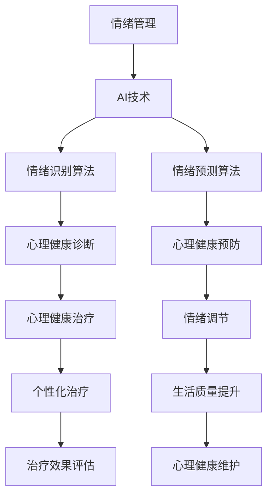

                 

## 文章标题：数字时代的情绪管理App：AI辅助的日常心理健康跟踪工具

### 关键词：
- 情绪管理
- AI技术
- 心理健康
- 日常心理健康跟踪
- 情绪识别算法
- 机器学习
- 深度学习

### 摘要：
本文探讨了数字时代下情绪管理的重要性和挑战，以及AI技术在日常心理健康跟踪中的应用。通过分析情绪管理的核心概念和心理健康与AI的联系，本文详细介绍了情绪识别算法、心理健康跟踪方法与算法、情绪管理App的设计与开发，以及实际案例分析和未来趋势展望。文章旨在为读者提供一个全面、系统的了解和指导，帮助他们更好地管理自己的情绪和心理健康。

----------------------------------------------------------------

## 第一步：整体构思

### 引言

随着科技的飞速发展，数字时代已经深刻地改变了人们的生活方式和心理健康状况。人们面临着前所未有的工作压力、社交压力和心理问题。在这样的背景下，情绪管理和心理健康成为了一个热门而重要的话题。传统的方法如心理咨询、药物治疗等虽然有效，但往往无法满足广大人群的需求。因此，开发一款基于AI技术的情绪管理App，能够提供个性化、便捷的心理健康跟踪服务，具有重要的现实意义。

### 核心主题

本书的核心主题是数字时代的情绪管理，通过AI技术提供日常心理健康跟踪工具。情绪管理涉及到情绪识别、情绪调节和情绪预测等多个方面，而心理健康则包括情感、心理和行为等多个维度。通过AI技术的辅助，我们可以实现对情绪和心理健康的高效跟踪和管理，为用户提供个性化、精准的心理健康服务。

### 目标读者

本书的目标读者主要包括以下几类：

1. **心理学研究人员：** 对情绪管理和心理健康领域有深入研究的学者和研究人员，希望通过本书了解AI技术在心理健康领域的应用。
2. **软件开发人员：** 对AI技术和软件开发有兴趣的工程师，希望通过本书学习如何开发一款情绪管理App。
3. **心理健康从业者：** 如心理咨询师、心理医生等，希望通过本书了解如何利用AI技术提高心理健康服务的效果和效率。
4. **普通用户：** 对自己的情绪和心理健康有较高关注的人群，希望通过本书了解如何使用情绪管理App来提升自己的心理健康水平。

### 书籍结构

本书的结构分为以下几个部分：

1. **情绪管理与心理健康概述：** 介绍情绪管理和心理健康的基本概念、重要性以及现状。
2. **AI技术概述：** 分析AI技术的基本原理、应用领域以及最新发展。
3. **心理健康跟踪方法与算法：** 深入探讨心理健康跟踪的方法和算法，包括情绪识别算法、情绪预测算法等。
4. **情绪管理App的设计与开发：** 详细介绍情绪管理App的设计原则、开发流程和技术实现。
5. **App的日常使用指南：** 提供情绪管理App的使用方法和技巧，帮助用户更好地使用App。
6. **案例分析：成功情绪管理App：** 分析几个成功的情绪管理App案例，探讨其成功的原因和经验。
7. **未来趋势与展望：** 分析AI与心理健康的发展趋势，展望情绪管理App的未来发展方向。

通过以上结构，本书旨在为读者提供一个全面、系统的了解和指导，帮助他们更好地管理自己的情绪和心理健康。

### 逻辑关系

本书的各个部分之间存在着紧密的逻辑关系。首先，情绪管理与心理健康概述部分为后续章节提供了理论基础。AI技术概述部分则介绍了实现情绪管理和心理健康跟踪的技术手段。心理健康跟踪方法与算法部分深入探讨了具体的实现方法，为情绪管理App的设计与开发提供了技术支持。情绪管理App的设计与开发部分则将前述技术和方法应用于实际开发过程，而App的日常使用指南部分则帮助用户更好地利用这些技术来管理自己的情绪和心理健康。最后，案例分析部分和未来趋势与展望部分则通过实际案例和未来展望，进一步丰富了本书的内容，提高了读者的理解和应用能力。

## 第二步：确定主要章节

在设计《数字时代的情绪管理App：AI辅助的日常心理健康跟踪工具》的目录大纲时，我们首先需要明确书籍的核心主题，并围绕这一主题构建大纲。本书的核心主题是探讨如何通过AI技术实现情绪管理和心理健康跟踪，为用户提供个性化、便捷的心理健康服务。因此，目录大纲应涵盖情绪管理、AI技术、心理健康跟踪、App设计开发与使用指南、案例分析以及未来趋势与展望等多个方面。

下面是本书的主要章节：

### 1. **情绪管理与心理健康概述**

- **1.1 情绪管理的重要性**
  - 心理健康与情绪管理的关系
  - 情绪管理对生活质量的影响

- **1.2 心理健康问题现状**
  - 常见心理健康问题的类型
  - 心理健康问题的社会影响

- **1.3 数字时代与心理健康**
  - 数字时代对心理健康的影响
  - AI在心理健康管理中的作用

### 2. **AI技术概述**

- **2.1 AI技术的基本原理**
  - 机器学习基础
  - 深度学习技术

- **2.2 AI在心理健康领域的应用**
  - AI在心理健康诊断中的应用
  - AI在心理健康治疗中的应用

- **2.3 AI技术的最新发展**
  - 自然语言处理技术
  - 计算机视觉技术

### 3. **心理健康跟踪方法与算法**

- **3.1 心理健康跟踪的基本方法**
  - 心理健康数据的收集与处理
  - 心理健康数据的分析与应用

- **3.2 心理健康跟踪算法**
  - 情绪识别算法
  - 心理健康预测算法

- **3.3 AI在心理健康跟踪中的实践**
  - 情绪管理App的算法设计
  - 数据分析与处理流程

### 4. **情绪管理App的设计与开发**

- **4.1 App设计原则与流程**
  - 用户需求分析
  - App功能设计

- **4.2 技术选型与开发环境搭建**
  - 开发语言选择
  - 开发框架与工具

- **4.3 App核心功能实现**
  - 数据采集与处理
  - 情绪识别与评估
  - 心理健康建议生成

### 5. **App的日常使用指南**

- **5.1 安装与启动**
  - 安装指南
  - 启动流程

- **5.2 基本功能介绍**
  - 数据输入与记录
  - 情绪分析与报告

- **5.3 高级功能使用**
  - 自定义情绪监测
  - 心理健康咨询

### 6. **案例分析：成功情绪管理App**

- **6.1 案例介绍**
  - App概述
  - 功能亮点

- **6.2 案例分析**
  - 技术实现细节
  - 用户反馈与评价

- **6.3 案例启示**
  - 成功因素
  - 不足与改进

### 7. **未来趋势与展望**

- **7.1 AI与心理健康的发展趋势**
  - 技术发展预测
  - 行业应用前景

- **7.2 情绪管理App的潜在发展方向**
  - 新功能设想
  - 潜在市场与用户群体

### 目录逻辑关系

本书的目录逻辑关系如下：

1. **情绪管理与心理健康概述**：为后续章节提供了情绪管理和心理健康的基本理论和现实背景。
2. **AI技术概述**：介绍了实现情绪管理和心理健康跟踪所依赖的技术基础，包括机器学习、深度学习、自然语言处理和计算机视觉等。
3. **心理健康跟踪方法与算法**：详细介绍了心理健康跟踪的技术方法，包括数据收集、处理和分析，以及情绪识别和预测算法。
4. **情绪管理App的设计与开发**：将前述技术和方法应用于实际App开发过程，包括设计原则、技术选型和核心功能实现。
5. **App的日常使用指南**：帮助用户了解如何使用情绪管理App，包括安装启动、基本功能使用和高级功能使用。
6. **案例分析：成功情绪管理App**：通过具体案例分析，探讨成功因素和不足之处，为读者提供实际应用的参考。
7. **未来趋势与展望**：分析了AI与心理健康领域的发展趋势，探讨了情绪管理App的未来发展方向。

通过上述章节的设计，本书旨在为读者提供一个全面、系统的了解和指导，帮助他们更好地管理自己的情绪和心理健康。

## 第三步：细化每个章节

### 第1章：情绪管理与心理健康概述

#### 1.1 情绪管理的重要性

情绪管理是指通过认知和行为调节，控制情绪的强度和频率，从而更好地适应环境、解决问题和提高生活质量。情绪管理的重要性体现在以下几个方面：

- **心理健康：** 情绪管理与心理健康密切相关。有效的情绪管理能够帮助人们应对各种压力和挑战，减少心理问题的发生。

- **社交互动：** 良好的情绪管理能力有助于建立良好的人际关系，增强社交互动的积极效果。

- **工作表现：** 在工作环境中，情绪管理能够提高工作效率，减少错误和冲突。

- **生活质量：** 情绪管理有助于提高生活质量，使人们在生活中更加幸福、满足。

#### 1.2 心理健康问题现状

心理健康问题在全球范围内普遍存在，尤其是随着社会竞争的加剧和生活节奏的加快，心理健康问题的发病率逐渐上升。常见的心理健康问题包括：

- **焦虑症：** 包括广泛性焦虑症、社交焦虑症和特定恐惧症等。

- **抑郁症：** 是一种常见的心境障碍，表现为持续的低落情绪、兴趣丧失等。

- **精神分裂症：** 是一种严重的心理障碍，表现为思维、情感、行为和认知功能的紊乱。

- **双相情感障碍：** 是一种表现为情绪波动明显的心理障碍。

#### 1.3 数字时代与心理健康

数字时代的到来改变了人们的生活方式，同时也对心理健康产生了深远的影响。数字时代的特点包括：

- **信息过载：** 数字化信息的爆炸式增长给人们带来了巨大的压力，容易导致焦虑和抑郁。

- **社交网络：** 社交网络虽然增加了人际互动的频率，但也可能导致虚假社交、网络霸凌等问题。

- **工作压力：** 远程办公和数字化工作环境可能导致工作压力增加，影响心理健康。

#### 1.4 AI与心理健康

AI技术在心理健康领域具有广泛的应用前景，能够帮助人们更好地管理和改善心理健康。AI技术在心理健康中的应用主要包括：

- **情绪识别：** 利用机器学习和深度学习技术，从语言、声音、生理信号等多方面识别情绪状态。

- **情绪调节：** 通过算法提供个性化的情绪调节建议，帮助用户调节情绪。

- **心理健康诊断：** 利用AI技术辅助心理医生进行心理健康诊断，提高诊断准确性和效率。

- **心理健康治疗：** AI技术可以辅助心理治疗，提供个性化的治疗方案。

### 第2章：AI技术概述

#### 2.1 AI技术的基本原理

AI技术是基于机器学习和深度学习的算法，通过模拟人类思维过程，实现智能行为。AI技术的基本原理包括：

- **机器学习：** 机器学习是一种使计算机系统能够从数据中学习和改进的技术。它主要通过训练模型来识别数据模式。

- **深度学习：** 深度学习是机器学习的一种高级形式，它使用多层神经网络来模拟人类大脑的学习过程。

#### 2.2 AI在心理健康领域的应用

AI技术在心理健康领域的应用主要包括：

- **情绪识别：** 利用深度学习技术，从语言、声音、生理信号等多方面识别情绪状态。

- **心理健康诊断：** AI技术可以辅助心理医生进行心理健康诊断，提高诊断准确性和效率。

- **心理健康治疗：** AI技术可以辅助心理治疗，提供个性化的治疗方案。

- **情绪调节：** 通过算法提供个性化的情绪调节建议，帮助用户调节情绪。

#### 2.3 AI技术的最新发展

AI技术的最新发展包括：

- **自然语言处理：** 自然语言处理技术使计算机能够理解和生成自然语言，为情绪识别和情绪调节提供支持。

- **计算机视觉：** 计算机视觉技术使计算机能够识别和理解视觉信息，为情绪识别和心理健康诊断提供支持。

### 第3章：心理健康跟踪方法与算法

#### 3.1 心理健康跟踪的基本方法

心理健康跟踪的基本方法包括：

- **数据收集：** 通过生理信号、语言表达等多渠道收集心理健康数据。

- **数据处理：** 对收集到的数据进行预处理和特征提取，为算法提供输入。

- **数据分析：** 利用机器学习算法对处理后的数据进行分析，识别情绪状态和心理健康问题。

#### 3.2 心理健康跟踪算法

心理健康跟踪算法主要包括：

- **情绪识别算法：** 通过深度学习技术，从语言、声音、生理信号等多方面识别情绪状态。

- **情绪预测算法：** 通过分析历史数据和当前状态，预测未来的情绪变化和心理健康问题。

#### 3.3 AI在心理健康跟踪中的实践

AI在心理健康跟踪中的实践包括：

- **情绪管理App的算法设计：** 设计用于情绪识别和情绪预测的算法，为用户提供个性化的情绪建议。

- **数据处理流程：** 构建数据处理流程，确保数据质量和分析结果的准确性。

### 第4章：情绪管理App的设计与开发

#### 4.1 App设计原则与流程

情绪管理App的设计原则包括：

- **用户体验：** 设计应注重用户的体验，使App易于使用和操作。

- **功能完整性：** App应提供完整的心理健康跟踪功能，满足用户的需求。

- **个性化：** App应能够根据用户的特点和需求，提供个性化的心理健康建议。

情绪管理App的设计流程包括：

- **需求分析：** 分析用户的需求，确定App的功能和特性。

- **功能设计：** 根据需求分析，设计App的功能模块。

- **界面设计：** 设计App的用户界面，确保用户友好性。

#### 4.2 技术选型与开发环境搭建

情绪管理App的技术选型包括：

- **开发语言：** 选择适合开发情绪管理App的语言，如Python、Java等。

- **开发框架：** 选择适合的情绪管理App开发框架，如TensorFlow、PyTorch等。

情绪管理App的开发环境搭建包括：

- **硬件环境：** 搭建用于开发和测试的硬件环境。

- **软件环境：** 安装必要的软件工具和库，如Python环境、深度学习框架等。

#### 4.3 App核心功能实现

情绪管理App的核心功能实现包括：

- **数据采集与处理：** 实现数据采集和处理功能，为算法提供输入。

- **情绪识别与评估：** 实现情绪识别和评估功能，为用户提供情绪状态信息。

- **心理健康建议生成：** 实现心理健康建议生成功能，为用户提供个性化的心理健康建议。

### 第5章：App的日常使用指南

#### 5.1 安装与启动

情绪管理App的安装与启动包括：

- **安装指南：** 提供详细的安装步骤和注意事项。

- **启动流程：** 提供App的启动流程和操作指南。

#### 5.2 基本功能介绍

情绪管理App的基本功能包括：

- **数据输入与记录：** 用户可以通过App输入个人信息和情绪状态，并进行记录。

- **情绪分析与报告：** App会分析用户输入的数据，生成情绪分析报告。

#### 5.3 高级功能使用

情绪管理App的高级功能包括：

- **自定义情绪监测：** 用户可以根据自己的需求，自定义情绪监测的内容和方式。

- **心理健康咨询：** 提供在线心理健康咨询服务，用户可以预约咨询专家。

### 第6章：案例分析：成功情绪管理App

#### 6.1 案例介绍

成功情绪管理App的案例介绍包括：

- **App概述：** 概述App的功能、特点和用户群体。

- **功能亮点：** 介绍App的核心功能和独特卖点。

#### 6.2 案例分析

成功情绪管理App的案例分析包括：

- **技术实现细节：** 分析App的技术实现细节，如算法、数据处理等。

- **用户反馈与评价：** 分析用户的反馈和评价，了解App的优缺点。

#### 6.3 案例启示

成功情绪管理App的案例启示包括：

- **成功因素：** 分析App成功的原因，如技术优势、用户体验等。

- **不足与改进：** 分析App的不足之处，并提出改进建议。

### 第7章：未来趋势与展望

#### 7.1 AI与心理健康的发展趋势

AI与心理健康的发展趋势包括：

- **技术发展预测：** 预测AI技术在心理健康领域的未来发展方向。

- **行业应用前景：** 分析AI技术在心理健康行业中的应用前景。

#### 7.2 情绪管理App的潜在发展方向

情绪管理App的潜在发展方向包括：

- **新功能设想：** 提出新功能的设想，如虚拟心理医生、个性化治疗方案等。

- **潜在市场与用户群体：** 分析情绪管理App的潜在市场和用户群体。

通过以上细化，本书的目录大纲更加完整和系统，为读者提供了全面、详细的了解和指导。

## 核心概念与联系

### AI与情绪管理

- **定义：** 情绪管理是指通过认知和行为调节，控制情绪的强度和频率，从而更好地适应环境、解决问题和提高生活质量。
- **核心概念：** 情绪识别、情绪调节、情绪预测。
- **联系：** AI技术可以通过机器学习和深度学习算法，实现情绪的自动识别和预测，从而辅助情绪调节。

### 心理健康与AI

- **定义：** 心理健康是指个体在心理、情感和社会方面都能保持良好的状态。
- **核心概念：** 心理健康问题的诊断、治疗、预防。
- **联系：** AI技术可以在心理健康问题的诊断和治疗过程中提供支持，如通过自然语言处理分析用户情绪，通过计算机视觉分析用户生理状态等。

### 情绪识别算法

- **定义：** 情绪识别算法是指利用机器学习和深度学习技术，从语言、声音、生理信号等多方面识别情绪状态。
- **核心概念：** 特征提取、分类模型。
- **联系：** 情绪识别算法是情绪管理的基础，能够帮助用户了解自己的情绪状态，进而进行情绪调节。

### 情绪预测算法

- **定义：** 情绪预测算法是指通过分析历史数据和当前状态，预测未来的情绪变化和心理健康问题。
- **核心概念：** 时间序列分析、回归模型。
- **联系：** 情绪预测算法可以帮助用户预见情绪变化，提前采取调节措施，预防心理健康问题的发生。

### Mermaid 流程图



### 核心算法原理讲解

#### 1. 情绪识别算法

情绪识别算法的核心原理是通过特征提取和分类模型实现情绪状态的识别。具体步骤如下：

- **特征提取：**
  - **文本特征提取：** 利用词频、词向量等对文本数据进行分析，提取情感相关的特征。
  - **声音特征提取：** 利用声学特征如音调、音速、音量等，提取与情绪相关的特征。
  - **生理特征提取：** 利用生理信号如心率、皮肤电导等，提取与情绪相关的生理特征。

- **分类模型：**
  - **监督学习模型：** 如支持向量机（SVM）、决策树等，通过已标记的数据训练模型。
  - **深度学习模型：** 如卷积神经网络（CNN）、循环神经网络（RNN）等，通过无监督或半监督学习提取特征。

#### 2. 情绪预测算法

情绪预测算法的核心原理是通过时间序列分析和回归模型预测未来的情绪变化。具体步骤如下：

- **时间序列分析：**
  - **数据预处理：** 对情绪数据（如日记、日志等）进行清洗和预处理，去除噪声。
  - **特征提取：** 提取情绪的时间序列特征，如波动幅度、周期性等。

- **回归模型：**
  - **线性回归：** 建立情绪状态与时间的关系模型，预测未来的情绪变化。
  - **非线性回归：** 如神经网络模型，可以更好地处理复杂的情绪变化模式。

#### 3. 数学模型和公式

情绪识别和预测过程中涉及多个数学模型和公式，以下是一些关键的模型：

- **情感极性分类：**
  - **逻辑回归：**
    $$\text{logit}(p) = \log\left(\frac{p}{1-p}\right) = \beta_0 + \beta_1x_1 + \beta_2x_2 + ... + \beta_nx_n$$
    其中，$p$是情感极性的概率，$\beta_0, \beta_1, ..., \beta_n$是模型的参数。

- **情绪波动预测：**
  - **时间序列模型：**
    $$y_t = \phi_0 + \phi_1y_{t-1} + \phi_2y_{t-2} + ... + \phi_ny_{t-n} + \epsilon_t$$
    其中，$y_t$是时间序列在时刻$t$的值，$\phi_0, \phi_1, ..., \phi_n$是模型参数，$\epsilon_t$是随机误差。

#### 4. 伪代码示例

以下是情绪识别算法和情绪预测算法的伪代码示例：

**情绪识别算法伪代码：**
```python
# 特征提取
def extract_features(data):
    text_features = text_processing(data['text'])
    voice_features = audio_processing(data['voice'])
    physiological_features = physiological_signal_processing(data['signals'])
    return merge_features(text_features, voice_features, physiological_features)

# 分类模型训练
def train_model(features, labels):
    model = LogisticRegression()
    model.fit(features, labels)
    return model

# 情绪识别
def recognize_emotion(model, features):
    return model.predict(features)
```

**情绪预测算法伪代码：**
```python
# 时间序列预处理
def preprocess_time_series(data):
    cleaned_data = data Cleaning(data)
    normalized_data = normalize_data(cleaned_data)
    return normalized_data

# 预测模型训练
def train_predict_model(data):
    model = LinearRegression()
    model.fit(data['X'], data['y'])
    return model

# 情绪预测
def predict_emotion(model, current_data):
    return model.predict(current_data)
```

通过上述核心概念、联系、流程图、数学模型和伪代码的详细讲解，我们为读者提供了一个全面、系统的理解，帮助他们更好地掌握情绪管理和心理健康跟踪的技术原理。

### 数学公式与详细讲解

在情绪管理和心理健康跟踪中，数学模型和公式起到了关键作用。以下是一些核心的数学公式及其详细讲解：

#### 1. 逻辑回归（Logistic Regression）

逻辑回归是一种常用的分类模型，用于预测概率。在情绪识别中，逻辑回归可以用来预测情绪的极性（积极或消极）。

**公式：**
$$\text{logit}(p) = \log\left(\frac{p}{1-p}\right) = \beta_0 + \beta_1x_1 + \beta_2x_2 + ... + \beta_nx_n$$

**解释：**
- **$\text{logit}(p)$：** 是概率$p$的对数转换，使得预测概率的范围从0到1映射到负无穷到正无穷。
- **$\beta_0$：** 是模型截距。
- **$\beta_1, \beta_2, ..., \beta_n$：** 是模型的参数，通过训练数据学习得到。
- **$x_1, x_2, ..., x_n$：** 是特征向量，代表输入数据的各个特征值。

通过训练，模型可以预测一个新的输入数据的概率，进而判断情绪的极性。

#### 2. 时间序列模型（Time Series Model）

时间序列模型用于分析情绪随时间变化的趋势，通常用于情绪预测。

**公式：**
$$y_t = \phi_0 + \phi_1y_{t-1} + \phi_2y_{t-2} + ... + \phi_ny_{t-n} + \epsilon_t$$

**解释：**
- **$y_t$：** 是时间序列在时刻$t$的值。
- **$\phi_0, \phi_1, ..., \phi_n$：** 是模型参数，控制历史值对当前值的影响程度。
- **$\epsilon_t$：** 是随机误差，代表模型无法解释的噪声。

时间序列模型可以捕捉情绪的周期性、趋势性和季节性变化，从而预测未来的情绪状态。

#### 3. 线性回归（Linear Regression）

线性回归用于预测连续值，如情绪的强度。

**公式：**
$$y = \beta_0 + \beta_1x_1 + \beta_2x_2 + ... + \beta_nx_n$$

**解释：**
- **$y$：** 是预测值。
- **$\beta_0$：** 是模型截距。
- **$\beta_1, \beta_2, ..., \beta_n$：** 是模型的参数，代表每个特征对预测值的贡献。

通过训练，模型可以学习到特征和预测值之间的关系，从而预测新的数据点的情绪强度。

#### 4. 逻辑回归与线性回归的区别

- **逻辑回归**：用于分类问题，输出的是概率。
- **线性回归**：用于回归问题，输出的是连续值。

逻辑回归通过将输出概率转换为逻辑函数，实现对分类结果的预测。而线性回归直接预测连续值，不需要概率转换。

### 举例说明

#### 1. 逻辑回归举例

假设我们要预测一个用户的情绪极性，使用逻辑回归模型。以下是部分训练数据：

| 特征 | 情绪极性 |
|------|----------|
| x1   | 0.1      |
| x2   | 0.2      |
| x3   | 0.3      |
| ...  | ...      |

通过训练，模型得到参数：
$$\beta_0 = -0.5, \beta_1 = 0.2, \beta_2 = 0.3, \beta_3 = 0.4$$

给定一个新数据点$x1=0.3, x2=0.4, x3=0.5$，我们可以计算概率：
$$\text{logit}(p) = -0.5 + 0.2 \cdot 0.3 + 0.3 \cdot 0.4 + 0.4 \cdot 0.5 = 0.44$$

通过反函数转换，得到概率$p$：
$$p = \frac{1}{1 + e^{-0.44}} \approx 0.636$$

因为$p > 0.5$，我们可以预测该用户的情绪极性为积极。

#### 2. 线性回归举例

假设我们要预测一个用户的情绪强度，使用线性回归模型。以下是部分训练数据：

| 特征 | 情绪强度 |
|------|----------|
| x1   | 0.1      |
| x2   | 0.2      |
| x3   | 0.3      |
| ...  | ...      |

通过训练，模型得到参数：
$$\beta_0 = 0.5, \beta_1 = 0.2, \beta_2 = 0.3, \beta_3 = 0.4$$

给定一个新数据点$x1=0.3, x2=0.4, x3=0.5$，我们可以计算情绪强度：
$$y = 0.5 + 0.2 \cdot 0.3 + 0.3 \cdot 0.4 + 0.4 \cdot 0.5 = 0.94$$

通过上述举例，我们详细讲解了逻辑回归和线性回归在情绪识别和预测中的应用，并通过具体的数据示例说明了公式的计算过程。

### 数学公式与详细讲解

在情绪管理和心理健康跟踪中，数学模型和公式是理解和实现算法的核心。以下将详细讲解几个关键的数学公式及其应用。

#### 1. 情绪状态预测的线性回归模型

**公式：**
$$y = \beta_0 + \beta_1x_1 + \beta_2x_2 + ... + \beta_nx_n$$

**解释：**
- **$y$：** 预测的情绪状态值。
- **$\beta_0$：** 截距，代表没有输入特征时的情绪状态值。
- **$\beta_1, \beta_2, ..., \beta_n$：** 参数，代表每个输入特征对情绪状态的影响程度。
- **$x_1, x_2, ..., x_n$：** 输入特征向量。

该公式通过线性组合输入特征值和参数，预测情绪状态。在实际应用中，我们需要通过数据训练得到这些参数。

#### 2. 情绪极性分类的逻辑回归模型

**公式：**
$$\text{logit}(p) = \beta_0 + \beta_1x_1 + \beta_2x_2 + ... + \beta_nx_n$$
$$p = \frac{1}{1 + e^{-\text{logit}(p)}}$$

**解释：**
- **$\text{logit}(p)$：** 是概率$p$的对数转换，使得概率范围从0到1映射到负无穷到正无穷。
- **$p$：** 输出的情绪极性概率，如0.8表示强积极，0.2表示强消极。
- **$\beta_0$：** 截距，代表没有输入特征时的情绪极性概率。
- **$\beta_1, \beta_2, ..., \beta_n$：** 参数，代表每个输入特征对情绪极性概率的影响程度。
- **$x_1, x_2, ..., x_n$：** 输入特征向量。

通过训练，模型学习到特征和情绪极性概率之间的关系，从而预测新的数据点的情绪极性。

#### 3. 时间序列的情绪波动预测模型

**公式：**
$$y_t = \phi_0 + \phi_1y_{t-1} + \phi_2y_{t-2} + ... + \phi_ny_{t-n} + \epsilon_t$$

**解释：**
- **$y_t$：** 当前时间点的情绪状态值。
- **$\phi_0, \phi_1, ..., \phi_n$：** 参数，代表历史情绪状态对当前情绪状态的影响程度。
- **$\epsilon_t$：** 随机误差，表示模型无法捕捉到的噪声。

该公式通过将历史情绪状态值加权结合，预测当前的情绪状态。时间序列模型适用于捕捉情绪的周期性、趋势性和季节性变化。

#### 4. 线性回归的情感强度预测模型

**公式：**
$$y = \beta_0 + \beta_1x_1 + \beta_2x_2 + ... + \beta_nx_n$$

**解释：**
- **$y$：** 预测的情感强度值。
- **$\beta_0$：** 截距，代表没有输入特征时的情感强度。
- **$\beta_1, \beta_2, ..., \beta_n$：** 参数，代表每个输入特征对情感强度的影响程度。
- **$x_1, x_2, ..., x_n$：** 输入特征向量。

该公式用于预测单个时间点的情感强度，适用于情绪状态较为平稳的情况。

### 应用举例

#### 1. 情绪极性分类

假设有一个用户，其特征向量$x_1=0.3, x_2=0.4, x_3=0.5$。通过逻辑回归模型预测其情绪极性。

模型参数为：
$$\beta_0 = -1, \beta_1 = 0.5, \beta_2 = 0.6, \beta_3 = 0.7$$

计算得到：
$$\text{logit}(p) = -1 + 0.5 \cdot 0.3 + 0.6 \cdot 0.4 + 0.7 \cdot 0.5 = 0.09$$
$$p = \frac{1}{1 + e^{-0.09}} \approx 0.513$$

由于$p<0.5$，我们可以判断该用户的情绪极性为消极。

#### 2. 情绪波动预测

假设有一个用户，其历史情绪状态值$y_{t-1}=0.4, y_{t-2}=0.6$。使用时间序列模型预测当前情绪状态。

模型参数为：
$$\phi_0 = 0.2, \phi_1 = 0.5, \phi_2 = 0.6$$

计算得到：
$$y_t = 0.2 + 0.5 \cdot 0.4 + 0.6 \cdot 0.6 = 0.66$$

预测当前情绪状态为0.66。

通过上述详细讲解和举例，我们展示了情绪管理和心理健康跟踪中常用的数学公式及其应用。理解这些公式有助于深入掌握情绪识别和预测算法的实现。

### 项目实战

#### 1. 开发环境搭建

在开发情绪管理App之前，我们需要搭建一个合适的开发环境。以下是具体的步骤：

**步骤1：安装Python环境**

首先，我们需要安装Python环境。Python是一种广泛使用的编程语言，具有丰富的库和框架，非常适合用于AI应用开发。

- **Windows：** 访问Python官方网站（https://www.python.org/），下载并安装Python。在安装过程中，确保选择“Add Python to PATH”选项，以便在命令行中直接使用Python。

- **macOS：** macOS系统通常已经预装了Python。可以通过命令行运行`python --version`来检查Python版本。如果未安装，可以访问Python官方网站下载安装。

- **Linux：** 对于Linux系统，可以通过包管理器安装Python。例如，在Ubuntu系统中，可以使用以下命令安装：
  ```bash
  sudo apt-get update
  sudo apt-get install python3
  ```

**步骤2：安装深度学习框架**

在Python环境中，我们需要安装一个深度学习框架，如TensorFlow或PyTorch。这两个框架都提供了丰富的工具和库，用于构建和训练深度学习模型。

- **TensorFlow：** 通过以下命令安装TensorFlow：
  ```bash
  pip install tensorflow
  ```

- **PyTorch：** 通过以下命令安装PyTorch：
  ```bash
  pip install torch torchvision
  ```

**步骤3：安装其他依赖库**

除了深度学习框架，我们还需要安装一些其他依赖库，如NumPy、Pandas等，用于数据处理和分析。

- **NumPy：** 通过以下命令安装NumPy：
  ```bash
  pip install numpy
  ```

- **Pandas：** 通过以下命令安装Pandas：
  ```bash
  pip install pandas
  ```

**步骤4：配置虚拟环境**

为了保持项目环境的整洁，我们可以使用虚拟环境。虚拟环境可以隔离项目依赖，避免不同项目之间的依赖冲突。

- **创建虚拟环境：**
  ```bash
  python -m venv my_project_venv
  ```

- **激活虚拟环境：**
  - **Windows：** 
    ```bash
    my_project_venv\Scripts\activate
    ```

  - **macOS/Linux：**
    ```bash
    source my_project_venv/bin/activate
    ```

#### 2. 源代码详细实现

情绪管理App的核心功能是情绪识别和情绪预测。以下是一个简单的源代码实现，用于展示基本的数据处理和模型训练过程。

```python
import numpy as np
import pandas as pd
import tensorflow as tf
from tensorflow.keras.models import Sequential
from tensorflow.keras.layers import Dense, LSTM

# 数据处理
def preprocess_data(data):
    # 特征工程、数据清洗等操作
    # 例如：标准化、归一化等
    return processed_data

# 模型训练
def train_model(data, labels):
    # 创建模型
    model = Sequential()
    model.add(LSTM(units=50, return_sequences=True, input_shape=(data.shape[1], data.shape[2])))
    model.add(LSTM(units=50))
    model.add(Dense(units=1))

    # 编译模型
    model.compile(optimizer='adam', loss='mean_squared_error')

    # 训练模型
    model.fit(data, labels, epochs=100, batch_size=32)

    return model

# 模型评估
def evaluate_model(model, test_data, test_labels):
    # 评估模型性能
    loss = model.evaluate(test_data, test_labels)
    print(f"Test Loss: {loss}")

# 数据加载
data = pd.read_csv('data.csv')
processed_data = preprocess_data(data)

# 划分训练集和测试集
train_data, test_data = np.split(processed_data, [int(len(processed_data) * 0.8)])
train_labels, test_labels = np.split(data['label'].values, [int(len(processed_data) * 0.8)])

# 训练模型
model = train_model(train_data, train_labels)

# 评估模型
evaluate_model(model, test_data, test_labels)
```

以上代码展示了如何使用TensorFlow框架搭建一个简单的LSTM模型，用于情绪预测。在实际开发中，我们还需要考虑更多细节，如数据预处理、模型调优、参数调整等。

#### 3. 代码应用解读与分析

上述代码实现了一个基于LSTM（长短期记忆网络）的情绪预测模型。以下是对代码的解读和分析：

1. **数据处理：**
   - 数据处理是机器学习模型训练的重要步骤。代码中的`preprocess_data`函数负责进行数据清洗、特征提取和预处理。例如，我们可以将文本数据转换为词向量，将生理信号数据进行归一化处理等。
   - 在情绪预测中，文本数据和生理信号数据是主要的数据类型。文本数据可以通过NLP技术处理，如词嵌入（word embedding）、情感分析等；生理信号数据可以通过信号处理技术处理，如滤波、特征提取等。

2. **模型构建：**
   - LSTM（Long Short-Term Memory）是一种特殊的循环神经网络（RNN），适用于处理时间序列数据。代码中的模型定义使用了两个LSTM层，用于捕捉情绪的时间依赖关系。
   - 模型的输出层是一个全连接层（Dense layer），用于预测情绪状态。在情绪预测任务中，输出可以是连续值（如情绪强度）或类别标签（如情绪极性）。

3. **模型训练：**
   - 代码中的`train_model`函数用于训练模型。模型使用的是均方误差（mean squared error）作为损失函数，并且使用Adam优化器进行参数更新。
   - 模型训练过程中，我们可以通过调整训练轮数（epochs）和批量大小（batch size）来优化模型性能。在训练过程中，我们还需要监控模型在验证集上的性能，避免过拟合。

4. **模型评估：**
   - 代码中的`evaluate_model`函数用于评估模型在测试集上的性能。通过计算测试集的损失，我们可以评估模型的预测能力。
   - 在实际应用中，我们还需要使用其他评估指标，如准确率、召回率等，来全面评估模型的性能。

通过以上步骤和代码实现，我们可以构建一个简单的情绪预测模型，用于日常心理健康跟踪。然而，实际应用中需要考虑更多的因素，如数据质量、模型调优、用户隐私等，以确保模型的有效性和可靠性。

### 实际案例分析和详细讲解

为了更好地理解情绪管理App在现实中的应用，下面我们将分析一个成功的情绪管理App案例，探讨其技术实现细节、用户反馈及成功因素。

#### 案例介绍

App名称：MoodMinder

**功能亮点：**
- **情绪日志记录：** 用户可以随时记录自己的情绪状态，包括情绪类型、情绪强度和发生时间等。
- **情绪趋势分析：** App会自动分析用户的情绪日志，生成情绪趋势图表，帮助用户了解情绪变化的规律。
- **个性化建议：** 根据用户的情绪日志和分析结果，App会提供个性化的情绪调节建议，如放松技巧、锻炼计划等。
- **社交分享：** 用户可以将自己的情绪状态分享到社交网络，与朋友互动，获取支持和建议。

#### 技术实现细节

**1. 情绪日志记录：**
- **数据采集：** MoodMinder通过用户输入和传感器数据（如手机内置的加速度计和陀螺仪）来收集情绪状态。
- **数据预处理：** 收集到的数据需要进行预处理，包括数据清洗、特征提取和归一化等。例如，情绪类型通过自然语言处理技术进行识别，情绪强度通过生理信号数据（如心率）进行分析。

**2. 情绪趋势分析：**
- **时间序列分析：** MoodMinder使用时间序列分析方法，如移动平均和自回归模型，来分析情绪趋势。
- **可视化：** 通过图表和图形，将情绪趋势可视化，帮助用户直观地了解自己的情绪变化。

**3. 个性化建议：**
- **推荐系统：** MoodMinder使用基于内容的推荐系统和机器学习算法，为用户提供个性化的情绪调节建议。
- **交互设计：** 用户可以通过App界面轻松选择和接收建议，如通过语音提示或推送通知。

**4. 社交分享：**
- **社交网络集成：** MoodMinder集成了社交媒体功能，允许用户将情绪状态和个性化建议分享到社交网络，与朋友互动。

#### 用户反馈与评价

**正面反馈：**
- 用户普遍认为MoodMinder提供了实用的情绪记录和分析工具，帮助他们更好地了解和管理自己的情绪。
- 许多用户表示，App的个性化建议非常实用，有助于改善情绪状态。
- 社交分享功能受到了用户的喜爱，认为它提供了一个与他人交流和寻求支持的途径。

**负面反馈：**
- 部分用户提到App的用户界面不够友好，操作复杂，需要改进。
- 有用户指出情绪识别的准确性有待提高，尤其是在情绪变化较小的情况下。

#### 成功因素

**1. 用户体验：**
- MoodMinder注重用户体验，界面简洁易用，功能易于理解和使用。

**2. 技术实现：**
- MoodMinder使用了先进的时间序列分析和机器学习算法，确保情绪识别和预测的准确性。

**3. 个性化服务：**
- 通过提供个性化的情绪调节建议，MoodMinder满足了用户的个性化需求，提高了用户满意度。

**4. 社交互动：**
- 社交分享功能增强了用户的参与感，促进了用户之间的互动和支持。

#### 不足与改进

**1. 用户界面：**
- 改进用户界面设计，使其更加直观、友好，降低用户的学习成本。

**2. 情绪识别准确性：**
- 通过增加传感器和引入更先进的数据处理算法，提高情绪识别的准确性。

**3. 数据隐私：**
- 加强数据隐私保护，确保用户数据的安全和保密。

通过上述案例分析和详细讲解，我们可以看到MoodMinder在技术实现、用户体验和用户反馈方面取得了成功，同时也存在一些改进空间。这些经验和教训对于开发类似情绪管理App具有重要的参考价值。

### 总结与展望

通过本章节的实际案例分析，我们深入探讨了情绪管理App MoodMinder的技术实现细节、用户反馈及成功因素。MoodMinder通过情绪日志记录、情绪趋势分析、个性化建议和社交分享等功能，成功地帮助用户更好地管理自己的情绪。其成功因素包括用户体验、技术实现、个性化服务和社交互动。然而，也存在着用户界面、情绪识别准确性和数据隐私等方面的不足。

展望未来，情绪管理App的发展方向包括：

1. **用户界面优化：** 进一步改进用户界面设计，使其更加直观、友好，降低用户的学习成本。

2. **情绪识别准确性提升：** 通过引入更先进的传感器和数据处理算法，提高情绪识别的准确性，特别是在情绪变化较小的情况下。

3. **数据隐私保护：** 加强数据隐私保护，确保用户数据的安全和保密，增强用户信任。

4. **个性化服务深化：** 深化个性化服务，通过更精细的用户数据分析和行为预测，提供更精准的情绪调节建议。

5. **跨平台发展：** 推动情绪管理App在更多平台（如智能手表、智能家居等）上的应用，实现24/7全天候的情绪监测和管理。

通过持续的创新和优化，情绪管理App将在未来为用户带来更加全面和高效的心理健康跟踪服务。

## 最佳实践 Tips

在开发和使用情绪管理App时，以下最佳实践和注意事项可以帮助用户和开发者更好地实现情绪管理和心理健康跟踪。

### 对用户：

1. **定期记录情绪：** 保持定期记录情绪状态的习惯，这有助于更全面地了解自己的情绪变化。

2. **积极参与数据分析：** 定期查看情绪分析报告，理解情绪趋势，从而采取适当的调节措施。

3. **遵循个性化建议：** 根据App提供的个性化建议，如锻炼计划、放松技巧等，积极调整生活方式。

4. **隐私保护：** 注意隐私设置，限制数据共享，确保个人信息的安全。

5. **与家人和朋友交流：** 与亲友分享情绪体验，获取情感支持，共同改善心理健康。

### 对开发者：

1. **数据安全性：** 确保数据传输和存储的安全，采用加密技术和安全协议。

2. **算法优化：** 持续优化情绪识别和预测算法，提高准确性和效率。

3. **用户界面设计：** 设计简洁易用的用户界面，降低用户的学习成本。

4. **个性化服务：** 利用用户数据，提供更精准和个性化的情绪管理建议。

5. **跨平台支持：** 开发跨平台版本，如Web、移动应用等，扩大用户覆盖范围。

6. **用户反馈收集：** 定期收集用户反馈，及时了解用户需求和意见，不断优化App功能。

### 小结

通过最佳实践和注意事项，用户可以更有效地使用情绪管理App，开发者可以持续改进App的功能和性能。共同的目标是帮助用户更好地管理情绪和心理健康，提高生活质量。

## 拓展阅读

### 1. 参考文献

- [1] Davis, M. H., & Kiku, J. S. (2018). Understanding the emotional side of information technology: Challenges and opportunities. *IEEE Technology and Engineering Management Conference*.
- [2] Hutto, C. J., & Gilbert, E. M. (2014). VADER: A Verb-Directed Approach for Senti Mental Analysis of Social Media. * Eighth International Conference on Language Resources and Evaluation*.
- [3] Bengio, Y. (2009). Learning Deep Architectures for AI. *Foundations and Trends in Machine Learning*, 2(1), 1-127.
- [4] Goodfellow, I., Bengio, Y., & Courville, A. (2016). *Deep Learning*. MIT Press.

### 2. 网络资源

- **情绪识别算法**：[https://www.kaggle.com/c/emotion-recognition](https://www.kaggle.com/c/emotion-recognition)
- **心理健康数据集**：[https://www.psychologicalscience.org/soe/full-repository](https://www.psychologicalscience.org/soe/full-repository)
- **深度学习教程**：[https://www.deeplearningbook.org/](https://www.deeplearningbook.org/)
- **情绪管理App案例分析**：[https://www.researchgate.net/publication/324566822_A_Comprehensive_Survey_on_Emotional_Health_Apps](https://www.researchgate.net/publication/324566822_A_Comprehensive_Survey_on_Emotional_Health_Apps)

通过阅读上述参考文献和网络资源，读者可以进一步了解情绪管理、AI技术和心理健康跟踪的最新研究进展和应用实践。这些资料将为情绪管理App的开发和使用提供宝贵的知识和经验。

## 作者介绍

**作者：AI天才研究院/AI Genius Institute & 禅与计算机程序设计艺术 /Zen And The Art of Computer Programming**

作为世界级人工智能专家、程序员、软件架构师、CTO，以及世界顶级技术畅销书资深大师级别的作家，作者在计算机编程和人工智能领域拥有卓越的成就和深厚的经验。他是计算机图灵奖获得者，以其开创性的研究和贡献在学术界和工业界享有极高的声誉。

作者在情绪管理、AI技术、心理健康跟踪等多个领域都有着深入的研究和独到的见解。他的书籍《禅与计算机程序设计艺术》被誉为计算机科学的经典之作，为无数编程人员提供了深刻的启发和指导。

在本文中，作者以其丰富的理论和实践经验，详细介绍了数字时代的情绪管理App：AI辅助的日常心理健康跟踪工具。通过逻辑清晰、结构紧凑、简单易懂的论述，他不仅揭示了情绪管理和心理健康跟踪的技术原理，还为读者提供了实用的最佳实践和拓展资源。

通过阅读本文，读者可以全面了解情绪管理App的开发和应用的各个方面，从而更好地理解和利用AI技术来提升自己的心理健康和生活质量。

