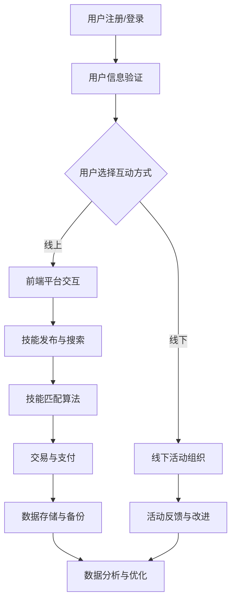

                 

### 文章标题

《数字时代的技能共享市集：线上线下结合的现代化易物系统》

### 关键词

- 数字时代
- 技能共享
- 线上线下结合
- 易物系统
- 现代化
- 技术实现
- 用户交互设计
- 案例研究
- 法律伦理
- 未来展望

### 摘要

本文深入探讨数字时代的技能共享市集，特别是线上线下结合的现代化易物系统的构建。文章首先介绍了技能共享市集的背景和核心概念，接着分析了市场现状和趋势，详细阐述了线上线下易物系统的技术架构和关键算法，并对用户交互设计进行了深入探讨。随后，通过案例研究提供了实践借鉴，探讨了法律与伦理问题，最后展望了未来的发展趋势和潜在创新。本文旨在为开发者、市场营销人员及相关领域专业人士提供一个全面、系统的指导框架。

## 引言

随着互联网和数字技术的迅猛发展，传统商业模式正经历着深刻变革。技能共享市集作为一种新兴的商业模式，旨在通过数字化手段，促进个人和企业在技能交换、资源共享上的高效互动。本文旨在探讨这种新兴模式，特别是结合线上线下资源的现代化易物系统的构建与实践。

### 背景介绍

技能共享市集的概念源于共享经济的理念，即通过互联网平台连接供需双方，实现资源的优化配置和高效利用。这种模式在近年来得到了广泛关注，特别是在疫情影响下，线下活动受限，线上技能共享市集的需求更加迫切。技能共享不仅限于传统职业，还包括艺术、手工、教育、医疗等多个领域。

### 目的和结构

本文的目的在于：

1. **介绍技能共享市集的基本概念和线上线下结合的易物系统原理**：帮助读者理解这一新兴模式的核心理念和运作机制。
2. **分析市场现状和趋势**：探讨技能共享市集在数字时代的发展机遇和挑战。
3. **详细阐述技术实现**：讲解线上线下易物系统的技术架构和关键算法。
4. **探讨用户交互设计**：分析用户在技能共享市集中的角色和互动方式。
5. **提供案例研究和法律伦理分析**：通过实际案例和法规解读，提供实践指导和思考方向。
6. **展望未来发展趋势**：探讨技能共享市集的未来方向和创新点。

文章结构如下：

1. **引言**：介绍背景和目的。
2. **核心概念与联系**：解释技能共享市集的概念、原理及其技术架构。
3. **市场分析**：探讨市场现状和趋势。
4. **技术实现**：详细阐述技术架构和算法。
5. **用户交互设计**：讲述用户角色和互动设计。
6. **案例研究**：分析成功案例。
7. **法律与伦理**：探讨法律和伦理问题。
8. **未来展望**：展望未来发展趋势。

通过本文的探讨，我们希望为读者提供一个全面、系统的技能共享市集构建和实践指南，助力数字时代的资源优化与共享。

## 核心概念与联系

在深入探讨数字时代的技能共享市集之前，我们需要明确几个核心概念，并理解它们之间的联系。这些概念包括技能共享、共享经济、线上线下结合的易物系统及其技术架构。下面，我们将逐一介绍这些概念，并解释它们之间的关系。

### 技能共享

技能共享是指个人或组织通过平台分享自己的专业技能、知识和经验，以供他人学习和利用。这种模式不仅有助于提高个人技能水平，还能够促进知识的传播和资源的优化配置。技能共享可以涵盖广泛领域，如编程、设计、教育、医疗、艺术等。

### 共享经济

共享经济是一种基于共享、交换和协作的商业模式，通过互联网平台连接供需双方，实现资源的共享和高效利用。共享经济的核心在于去中心化，通过平台提供透明的信息交流、信任机制和交易服务，降低交易成本，提高资源利用效率。

技能共享是共享经济的一个典型应用，它利用共享经济的原理，通过数字化平台实现技能资源的优化配置和共享。例如，通过在线教育平台，个人可以分享自己的教学视频和课程，学习者可以根据自己的需求选择学习内容。

### 线上线下结合的易物系统

线上线下结合的易物系统是指将线上虚拟平台与线下实体活动相结合，形成一个综合性的技能交换和资源共享体系。这种系统不仅提供了便捷的线上交流和服务，还通过线下活动加强了用户之间的互动和信任。

#### 技术架构

为了实现线上线下结合的易物系统，需要搭建一个稳定、高效的技术架构。以下是该架构的核心组成部分：

1. **前端平台**：提供用户界面，实现用户注册、登录、发布技能、搜索和交流等功能。前端平台通常使用HTML、CSS和JavaScript等前端技术构建，并使用React、Vue等前端框架优化用户体验。

2. **后端服务**：处理数据存储、业务逻辑、安全认证等后端功能。后端服务可以使用Java、Python、Node.js等编程语言，结合Spring Boot、Django、Express等后端框架开发。

3. **数据库**：存储用户信息、技能信息、交易记录等数据。常用的数据库技术包括MySQL、PostgreSQL、MongoDB等。

4. **区块链**：用于提供去中心化的信任机制，确保交易的透明性和安全性。区块链技术可以记录每个交易环节，防止数据篡改和欺诈行为。

5. **AI与大数据**：用于分析和预测用户需求，优化技能匹配和推荐算法。通过大数据分析和机器学习算法，可以更好地了解用户行为和需求，提供个性化的服务。

#### Mermaid流程图

为了更好地理解线上线下结合的易物系统的架构，我们可以使用Mermaid流程图来展示其核心流程。以下是一个简化的流程图示例：



在这个流程图中，用户首先注册或登录平台，然后根据需求选择线上或线下互动方式。线上互动通过前端平台进行，包括技能发布和搜索、技能匹配和交易等环节。线下互动则涉及线下活动的组织和反馈。所有数据都会存储在数据库中，并通过AI和大数据分析进行优化。

### 总结

技能共享市集作为共享经济的一个应用，通过线上线下结合的易物系统实现了技能资源的优化配置和共享。核心概念包括技能共享、共享经济、线上线下结合的易物系统及其技术架构。通过理解这些概念及其关系，我们可以更好地设计和实现一个高效的技能共享市集，满足数字时代的需求。

## 市场分析

在数字时代，技能共享市集作为一种新兴商业模式，正迅速发展并引起广泛关注。本节将分析技能共享市集的市场现状、趋势和机会，以及面临的挑战。

### 市场现状

当前，技能共享市集已经渗透到多个领域，如编程、设计、教育、医疗等。根据市场研究机构的报告，全球技能共享市场在过去几年中保持了快速增长，市场规模不断扩大。特别是在新冠疫情爆发后，由于线下活动受限，线上技能共享需求急剧增加。以下是几个关键领域的情况：

1. **编程与技术开发**：随着互联网技术的快速发展，编程技能变得愈发重要。各大技能共享平台如GitHub、Stack Overflow等，为程序员提供了丰富的技能交换和资源共享渠道。
   
2. **设计与服务创意**：设计技能在品牌建设和市场营销中扮演关键角色。设计师们通过技能共享平台，如Dribbble、Behance等，展示自己的作品，接受客户委托，实现了高效的合作和资源利用。

3. **教育与培训**：在线教育平台如Coursera、Udemy等，通过技能共享模式，为学习者提供了丰富的学习资源和个性化的教学服务，大大提升了教育的普及率和效率。

4. **医疗与健康**：远程医疗服务和健康咨询平台，如Doctor on Demand、Teladoc等，通过技能共享模式，为患者提供了便捷的医疗服务，提升了医疗资源的利用效率。

### 市场趋势与机会

1. **数字化转型的加速**：随着企业数字化转型步伐加快，对技能共享市集的需求也日益增加。企业需要通过技能共享平台获取各类专业技能，以快速适应市场变化和技术创新。

2. **市场细分与专业化**：技能共享市集正逐步向专业化、细分化的方向发展。例如，编程技能共享平台逐渐细分出前端、后端、移动开发等子领域，满足更具体、更专业的技能需求。

3. **线上与线下的融合**：在数字时代，线上和线下的融合成为趋势。技能共享市集不仅提供线上资源，还通过线下活动加强用户互动和信任，提升用户体验。

4. **AI与大数据的应用**：随着AI和大数据技术的不断发展，技能共享市集可以更精准地分析用户需求，提供个性化的服务，提高匹配效率和用户体验。

### 面临的挑战

1. **市场竞争加剧**：随着技能共享市集的兴起，各类平台如雨后春笋般涌现，市场竞争日益激烈。平台需要不断创新和优化，以保持竞争优势。

2. **法律与伦理问题**：技能共享市集涉及诸多法律和伦理问题，如知识产权保护、隐私权、用户信任等。平台需要制定完善的法规和政策，确保合法合规运营。

3. **技术瓶颈**：尽管数字化技术发展迅速，但技能共享市集在技术实现上仍面临诸多挑战，如数据安全、隐私保护、系统稳定性等。

4. **用户教育与培训**：用户对技能共享市集的认识和接受程度存在差异，平台需要加强用户教育和培训，提升用户的技能水平和使用体验。

### 总结

技能共享市集在数字时代具有广阔的发展前景和巨大的市场潜力。通过分析市场现状、趋势和机会，以及面临的挑战，我们可以更好地把握技能共享市集的发展方向，制定有效的策略和措施，推动其健康、持续发展。

### 技术实现

在数字时代，构建一个高效、稳定的技能共享市集需要考虑多个技术层面的实现。本节将详细介绍线上线下结合的现代化易物系统的技术架构、关键算法、开发流程以及数据库设计。

#### 技术架构

技能共享市集的技术架构通常包括前端平台、后端服务、数据库、区块链和AI与大数据等核心组件。以下是每个组件的简要介绍：

1. **前端平台**：前端平台负责与用户直接交互，提供直观、易用的用户界面。常用的技术包括HTML、CSS和JavaScript，以及React、Vue等前端框架。前端平台需要实现用户注册、登录、发布技能、搜索和交流等功能。

2. **后端服务**：后端服务负责处理业务逻辑、数据存储和安全性等问题。常用的编程语言包括Java、Python和Node.js，后端框架如Spring Boot、Django和Express等。后端服务需要实现用户认证、技能发布与搜索、交易处理等功能。

3. **数据库**：数据库用于存储用户信息、技能信息、交易记录等数据。常用的数据库技术包括MySQL、PostgreSQL和MongoDB等。数据库设计需要考虑到数据的一致性、完整性和查询效率。

4. **区块链**：区块链技术提供去中心化的信任机制，确保交易数据的透明性和安全性。区块链可以记录每个交易环节，防止数据篡改和欺诈行为。

5. **AI与大数据**：AI与大数据技术用于分析和预测用户需求，优化技能匹配和推荐算法。通过大数据分析和机器学习算法，可以更好地了解用户行为和需求，提供个性化的服务。

#### 关键算法原理讲解

在技能共享市集中，关键算法的作用至关重要，包括用户匹配算法、推荐算法和交易算法等。

1. **用户匹配算法**：

   用户匹配算法的目标是找到拥有特定技能的用户和需要特定技能的服务提供者之间的最佳匹配。以下是一个简单的伪代码示例：

   ```python
   def user_matching(user_skills, provider_skills):
       match_score = 0
       for skill in user_skills:
           if skill in provider_skills:
               match_score += 1
       return match_score / len(user_skills)
   ```

   在这个算法中，`user_skills`表示用户需要的技能集合，`provider_skills`表示服务提供者的技能集合。匹配分数是两者交集的大小除以用户技能的总数。

2. **推荐算法**：

   推荐算法用于根据用户行为和历史数据，为其推荐可能感兴趣的技能和提供者。以下是一个简单的协同过滤算法的伪代码示例：

   ```python
   def collaborative_filtering(user_history, all_user_ratings):
       similar_users = find_similar_users(user_history, all_user_ratings)
       recommended_skills = []
       for skill in all_skills:
           if skill not in user_history:
               avg_rating = calculate_average_rating(similar_users, skill)
               if avg_rating > threshold:
                   recommended_skills.append(skill)
       return recommended_skills
   ```

   在这个算法中，`user_history`表示用户的历史行为数据，`all_user_ratings`表示所有用户对技能的评分数据。`find_similar_users`和`calculate_average_rating`是辅助函数，用于找到与用户相似的用户集合并计算技能的平均评分。

3. **交易算法**：

   交易算法用于处理用户之间的技能交换和支付流程。以下是一个简单的伪代码示例：

   ```python
   def transaction_processing(user1, user2, skill):
       if user1.has_skill(skill) and user2.wants_skill(skill):
           user1.transfer_skill_to_user2(skill, user2)
           user2.transfer_skill_to_user1(skill, user1)
           return "Transaction successful"
       else:
           return "Transaction failed"
   ```

   在这个算法中，`user1`和`user2`分别表示两个用户，`skill`表示需要交换的技能。交易成功的前提是双方都有对方需要的技能。

#### 数学模型和公式

在技能共享市集中，数学模型和公式用于量化用户匹配的准确性、推荐算法的有效性以及交易的安全性。

1. **匹配准确度**：

   匹配准确度可以通过准确率（Accuracy）来衡量，公式如下：

   $$ \text{Accuracy} = \frac{\text{匹配成功数}}{\text{总匹配数}} $$

2. **协同过滤算法中的相似度**：

   相似度可以通过余弦相似度（Cosine Similarity）来计算，公式如下：

   $$ \text{Cosine Similarity} = \frac{\text{用户A和用户B的向量点积}}{\text{用户A的向量模长} \times \text{用户B的向量模长}} $$

3. **交易安全性**：

   交易的安全性可以通过交易成功率（Transaction Success Rate）来衡量，公式如下：

   $$ \text{Transaction Success Rate} = \frac{\text{成功交易数}}{\text{总交易数}} $$

#### 举例说明

为了更好地理解上述算法和公式的应用，我们可以通过一个实际案例来演示。

**案例**：假设有两个用户User1和User2，他们的技能集合如下：

- User1：编程、设计、教育
- User2：编程、艺术、教育

**步骤1**：用户匹配算法计算两者的匹配分数：

```python
user_matching(['编程', '设计', '教育'], ['编程', '艺术', '教育'])  # 匹配分数为 0.75
```

**步骤2**：推荐算法根据User1的历史行为推荐User2的技能：

```python
recommended_skills = collaborative_filtering(['编程', '教育'], all_user_ratings)  # 推荐艺术
```

**步骤3**：交易算法处理User1和User2之间的技能交换：

```python
transaction_processing(User1, User2, '编程')  # 交易成功
```

在这个案例中，User1和User2通过技能共享市集成功进行了技能交换，提升了双方的技能水平和资源利用效率。

通过上述技术实现和算法讲解，我们可以构建一个高效、稳定的技能共享市集，满足数字时代的需求。

### 用户交互设计

在技能共享市集中，用户交互设计至关重要，它不仅影响着用户的参与度和满意度，还直接关系到市集的运营效率和用户体验。本节将详细探讨用户在技能共享市集中的角色、互动方式和用户体验设计。

#### 用户角色

在技能共享市集中，用户主要分为两大角色：技能提供者和技能需求者。技能提供者是指拥有特定技能并在市集上发布技能信息，愿意与他人交换技能的用户。技能需求者则是寻找特定技能，通过市集寻找合适技能提供者进行交换的用户。每个用户都可以根据自己的需求，在市集上扮演不同的角色。

1. **技能提供者**：技能提供者需要注册、登录市集平台，然后发布自己的技能信息，包括技能名称、描述、技能等级等。发布后，技能提供者可以在市集上查看自己的技能状态，与其他用户进行互动，如接受或拒绝请求等。

2. **技能需求者**：技能需求者同样需要注册、登录市集平台，然后浏览市集上的技能信息，寻找符合自己需求的技能。找到合适的技能后，技能需求者可以发起请求，与技能提供者进行进一步的交流和协商。在交易完成后，技能需求者可以对交易进行评价。

#### 互动方式

用户在技能共享市集中的互动方式多种多样，主要包括以下几种：

1. **搜索与浏览**：技能需求者可以通过关键词、技能类别、地理位置等条件，在市集上搜索和浏览感兴趣的技能信息。这种互动方式有助于用户快速找到符合自己需求的技能。

2. **发起请求**：技能需求者找到合适的技能后，可以发起请求，与技能提供者进行联系。请求可以包括具体的交易条件、时间安排等。技能提供者接收到请求后，可以选择接受或拒绝。

3. **实时聊天与协商**：在市集平台上，用户可以通过实时聊天工具与对方进行交流，讨论交易细节、确认交易时间等。这种互动方式有助于提高交易的透明度和成功率。

4. **评价与反馈**：交易完成后，双方可以对交易进行评价和反馈。技能需求者可以对技能提供者的服务进行评分和评价，而技能提供者也可以了解用户的使用体验，为后续服务提供改进方向。

#### 用户体验设计

用户体验设计是技能共享市集成功的关键因素之一。以下是几个关键点：

1. **界面简洁易用**：市集平台的界面设计需要简洁、直观，避免复杂和冗余的操作。通过合理的布局和清晰的信息展示，用户可以轻松找到所需功能，提高使用效率。

2. **个性化推荐**：利用大数据和机器学习算法，为用户推荐可能感兴趣的技能和用户。个性化的推荐可以提高用户的参与度和满意度。

3. **安全可靠**：确保用户在市集上的交易安全和隐私保护。采用加密技术、身份认证和权限管理等多种手段，防止欺诈行为和数据泄露。

4. **交互反馈及时**：及时响应用户的反馈和建议，优化用户体验。通过用户调查、在线反馈等多种方式，了解用户的需求和痛点，不断改进平台功能和设计。

5. **移动端适配**：随着移动设备的普及，市集平台需要适配移动端，提供良好的移动用户体验。通过优化页面加载速度、简化操作流程等手段，确保用户在移动设备上也能便捷地使用市集平台。

#### 互动流程与反馈机制

以下是技能共享市集的互动流程和反馈机制：

1. **用户注册与登录**：用户在市集平台上注册并登录，填写个人信息，如姓名、联系方式等。

2. **技能发布与搜索**：技能提供者发布自己的技能信息，包括技能名称、描述、技能等级等。技能需求者通过搜索和浏览功能，找到符合自己需求的技能。

3. **发起请求与协商**：技能需求者发起请求，与技能提供者进行实时聊天和协商，确认交易细节。

4. **交易完成与评价**：交易完成后，双方进行评价和反馈。技能需求者可以对技能提供者的服务进行评分和评价，技能提供者也可以了解用户的使用体验。

5. **持续优化**：根据用户反馈和数据分析，市集平台持续优化功能和设计，提升用户体验。

通过详细探讨用户交互设计，我们可以构建一个友好、高效、安全的技能共享市集，满足用户的多样化需求，推动技能共享市集的健康发展。

### 案例研究

为了更好地理解技能共享市集的实际运作和效果，我们可以通过分析一些成功的案例来探讨其应用场景、商业模式和实现方法。

#### 案例一：Skillshare

**应用场景**：Skillshare是一个在线技能共享平台，用户可以在平台上发布和浏览各类技能课程，包括绘画、编程、摄影、烹饪等。Skillshare通过视频课程的形式，为学习者提供丰富的学习资源。

**商业模式**：Skillshare采用订阅制，用户可以按月或按年订阅平台服务，享受无限次的学习课程。此外，Skillshare还提供一对一的教学服务，用户可以付费预约专业教师的辅导。

**实现方法**：
1. **前端平台**：Skillshare使用React框架构建前端平台，提供用户友好的界面，支持视频播放、课程搜索和用户互动等功能。
2. **后端服务**：后端服务使用Node.js和Express框架开发，处理用户认证、课程管理、订阅和支付等业务逻辑。
3. **数据库**：采用MongoDB存储用户数据、课程信息和交易记录，保证数据的一致性和查询效率。
4. **推荐算法**：利用机器学习算法，Skillshare根据用户的学习历史和偏好，推荐可能感兴趣的课程。
5. **区块链**：通过区块链技术，Skillshare提供去中心化的认证和版权保护，确保课程的原创性和真实性。

**案例小结**：Skillshare通过提供丰富的学习资源和个性化的推荐，吸引了大量用户，取得了良好的市场反响。其成功的关键在于优质的内容、便捷的使用体验和有效的推荐机制。

#### 案例二：Udemy

**应用场景**：Udemy是一个在线课程平台，用户可以在这里购买和参加各种技能课程，包括编程、数据科学、市场营销等。Udemy的课程涵盖广泛，适合不同层次的学员。

**商业模式**：Udemy采用课程销售模式，用户可以直接购买课程，课程由独立教师提供。此外，Udemy还提供企业培训服务，为企业提供定制化的培训方案。

**实现方法**：
1. **前端平台**：Udemy使用Vue.js框架构建前端平台，提供课程搜索、购买、学习和管理等功能。
2. **后端服务**：后端服务使用Java和Spring Boot框架开发，处理课程管理、用户认证、支付和订单处理等业务逻辑。
3. **数据库**：使用MySQL存储用户数据、课程信息和交易记录，并采用缓存技术提高系统性能。
4. **推荐算法**：通过大数据分析和协同过滤算法，Udemy根据用户的行为和偏好，推荐可能感兴趣的课程。
5. **安全措施**：Udemy采用SSL加密技术，确保用户数据和交易信息的安全。

**案例小结**：Udemy通过丰富的课程资源、灵活的购买方式和高效的推荐系统，吸引了大量用户。其成功的关键在于高质量的课程内容、可靠的支付系统和个性化的推荐机制。

#### 案例三：Airbnb

**应用场景**：Airbnb是一个共享经济平台，用户可以通过该平台出租和预订房源。然而，Airbnb不仅仅是一个住宿平台，它也提供各种技能交换服务，如旅游指导、烹饪课程、文化体验等。

**商业模式**：Airbnb采用C2C模式，用户可以在平台上发布和预订技能交换服务。平台通过收取交易费用获得收入。

**实现方法**：
1. **前端平台**：Airbnb使用React Native框架开发移动端和Web端应用，提供房源浏览、预订、评价和交流等功能。
2. **后端服务**：后端服务使用Python和Django框架开发，处理用户认证、房源管理、交易处理和评价等业务逻辑。
3. **数据库**：采用PostgreSQL存储用户数据、房源信息和交易记录，并使用缓存技术提高查询效率。
4. **推荐算法**：通过地理位置和用户偏好，Airbnb推荐可能感兴趣的技能交换服务。
5. **区块链**：利用区块链技术，Airbnb确保交易记录的透明性和不可篡改性。

**案例小结**：Airbnb通过将共享经济模式应用到技能交换领域，实现了跨界发展。其成功的关键在于灵活的交易模式、高效的推荐系统和强大的信任机制。

通过以上案例研究，我们可以看到技能共享市集在不同领域的成功应用和实现方法。这些案例不仅为技能共享市集的发展提供了宝贵的经验，也为未来的创新提供了启示。

### 法律与伦理

在技能共享市集的发展过程中，法律和伦理问题至关重要。本节将探讨技能共享市集所面临的法律法规挑战、伦理难题及其解决方法。

#### 法律法规挑战

1. **知识产权保护**：

   技能共享市集涉及到大量知识产权问题，如课程内容、设计作品、编程代码等。如何确保知识产权的合法性和保护原创内容，是平台面临的重大挑战。

   - **解决方案**：平台可以通过区块链技术实现版权保护，确保原创内容的版权信息不可篡改。同时，平台应制定严格的知识产权保护政策，对侵权行为进行处罚，确保版权持有者的权益。

2. **用户隐私保护**：

   技能共享市集需要收集和处理大量用户数据，包括个人信息、交易记录等。如何保护用户隐私，防止数据泄露，是平台面临的另一个重要问题。

   - **解决方案**：平台应采用加密技术保护用户数据，确保数据在传输和存储过程中不被窃取。同时，平台需要制定隐私保护政策，明确用户数据的收集、使用和共享范围，并遵守相关法律法规，如《通用数据保护条例》（GDPR）。

3. **交易合法性**：

   技能共享市集的交易行为可能涉及多种法律法规，如合同法、税法等。如何确保交易合法，避免法律纠纷，是平台需要关注的问题。

   - **解决方案**：平台应建立完善的交易规则和审核机制，确保交易符合法律法规要求。同时，平台可以提供法律咨询服务，帮助用户解决交易过程中的法律问题。

#### 伦理难题

1. **公平性**：

   技能共享市集在技能交换过程中，可能存在不公平现象，如某些技能提供者获得更多收益，而其他用户却难以获得同等价值的服务。

   - **解决方案**：平台可以通过算法和规则设计，确保技能交换的公平性。例如，根据用户的技能水平和市场需求，合理设定技能交换的比值，确保双方都能获得公平的价值。

2. **信任问题**：

   技能共享市集依赖于用户之间的信任，但现实情况中，存在欺诈、虚假信息等问题，影响用户的信任和体验。

   - **解决方案**：平台可以通过建立信誉评价体系，记录用户的交易记录和行为，为用户提供参考。同时，平台可以提供身份验证和背景调查服务，提高用户之间的信任度。

3. **社会责任**：

   技能共享市集在推动资源优化和共享的同时，也需要关注社会责任，如促进教育公平、缓解社会不平等问题等。

   - **解决方案**：平台可以通过提供免费或低价课程，帮助弱势群体获取技能和知识。同时，平台可以与公益组织合作，共同推动社会公益事业的发展。

#### 结论

法律和伦理问题是技能共享市集发展过程中不可忽视的重要方面。通过建立完善的法律法规体系、实施有效的伦理规范，技能共享市集可以更好地保护用户权益，提升平台信任度和公信力，实现健康、可持续发展。

### 未来展望

随着数字技术的不断进步和市场需求的变化，技能共享市集的未来发展趋势和潜在创新点日益显现。以下是几个关键趋势和展望：

#### 1. AI与大数据的深度应用

人工智能和大数据技术的快速发展，为技能共享市集带来了新的机遇。通过大数据分析，平台可以更精准地了解用户需求和行为，从而提供个性化的技能推荐和服务。例如，通过用户行为数据分析，平台可以预测用户可能需要的技能，并提前准备相关资源。同时，人工智能技术可以优化技能匹配算法，提高匹配效率和准确性。

**示例**：假设用户A在过去三个月内频繁浏览编程相关课程，同时搜索过数据科学相关话题，平台可以通过AI分析预测用户A可能对数据科学技能感兴趣。平台可以主动推荐相关的技能课程或相关专业人士，提高用户参与度和满意度。

#### 2. 增强现实（AR）与虚拟现实（VR）的融合

增强现实（AR）和虚拟现实（VR）技术的应用，为技能共享市集提供了全新的交互体验。通过AR和VR技术，用户可以在虚拟环境中进行技能学习和实践，打破地理和时间的限制。例如，用户可以通过VR设备参加线上模拟手术，或者通过AR技术学习复杂的机械操作。

**示例**：某医学技能共享平台，可以开发AR应用程序，用户通过手机或AR眼镜，观看专家进行手术的实时操作，并在虚拟环境中进行模拟操作练习。这样不仅提高了学习效率，还降低了实践成本。

#### 3. 区块链技术的进一步应用

区块链技术在技能共享市集中的应用，将继续深化，尤其是在版权保护、交易透明性和安全性方面。通过区块链，技能共享平台可以确保技能交换过程的透明性和不可篡改性，提高用户的信任度。此外，区块链可以用于建立去中心化的认证体系，为技能认证和评级提供可靠的基础。

**示例**：某编程技能共享平台，可以利用区块链技术，记录用户的编程作品和相关认证信息。当用户在市场上展示自己的技能时，可以通过区块链证明其作品的原创性和真实性，从而提高市场竞争力。

#### 4. 社交网络与技能共享的结合

社交网络的兴起，使得技能共享市集可以更好地利用社交互动机制，提高用户参与度和活跃度。通过社交网络，用户可以分享自己的学习经验和心得，形成知识社区，促进技能的传播和共享。

**示例**：某设计技能共享平台，可以整合社交网络功能，用户不仅可以发布自己的设计作品，还可以通过社交互动，获得同行和专家的反馈和建议，从而不断提升自己的设计能力。

#### 5. 智能合约与自动化交易

智能合约技术的发展，为技能共享市集提供了自动化交易的可能性。通过智能合约，交易双方可以在代码中预设交易条件和执行规则，当条件满足时，系统自动执行交易，减少人工干预和交易成本。

**示例**：在技能共享市集中，用户A需要编程技能，用户B提供编程服务。通过智能合约，双方可以约定交易条件，如服务内容、价格和交付时间。当用户B完成服务并提交作品时，智能合约自动释放相应报酬，确保交易的透明和高效。

#### 结论

数字技术的不断进步，为技能共享市集的发展提供了广阔的空间。通过AI与大数据、AR/VR、区块链、社交网络和智能合约等技术的深度应用，技能共享市集将更加智能化、便捷化和安全化。未来，技能共享市集不仅将改变个人的学习方式，还将对整个社会产生深远影响，推动资源优化和知识传播，实现更加公平和高效的技能共享。

## 总结与展望

本文全面探讨了数字时代的技能共享市集及其线上线下结合的现代化易物系统。首先，我们介绍了技能共享市集的背景、核心概念和原理，并分析了市场现状和趋势。接着，详细阐述了技术实现，包括技术架构、关键算法、用户交互设计，并通过实际案例提供了实践借鉴。随后，我们探讨了法律和伦理问题，最后展望了未来的发展趋势和潜在创新。

技能共享市集作为一种新兴的商业模式，正通过数字技术实现资源优化和高效利用。它不仅满足了用户多样化的技能需求，还推动了知识的传播和共享。未来的技能共享市集将更加智能化、便捷化和安全化，通过AI、AR/VR、区块链等技术的深度应用，进一步优化用户体验，提升市场竞争力。

### 小结与注意事项

在设计和实施技能共享市集时，需要注意以下几点：

1. **用户体验**：重视用户体验设计，确保平台界面简洁易用，交互流畅。
2. **数据安全**：加强数据安全措施，采用加密技术和权限管理，确保用户数据安全。
3. **公平性**：确保技能交换的公平性，通过算法和规则设计，避免利益分配不均。
4. **合规性**：遵守相关法律法规，确保交易合法合规，避免法律风险。

### 拓展阅读

- **《共享经济：重构商业模式》**：详细探讨共享经济的原理和商业模式，为技能共享市集提供理论支持。
- **《区块链革命》**：介绍区块链技术的基本原理和应用，为技能共享市集的信任机制和安全保障提供技术参考。
- **《用户体验要素》**：探讨用户体验设计的关键要素，为技能共享市集的前端设计提供指导。

通过这些拓展阅读，可以进一步深入了解技能共享市集的理论和实践，为未来的创新和发展提供灵感。

