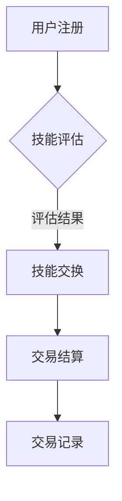

                 

## 文章标题

数字时代的技能共享平台：以物易技的现代化以物易物系统

> 关键词：技能共享平台、以物易技、区块链、人工智能、数据分析、技术架构、安全性、隐私保护

> 摘要：本文探讨了数字时代技能共享平台的发展及其现代化以物易物系统的构建。通过分析技能共享平台的背景、核心概念、技术架构、安全性和隐私保护，以及成功案例分析，揭示了以物易技系统在数字化时代的重要性和应用前景。

## 本书目录大纲

### 第一部分：引言

#### 第1章：技能共享平台概述

- **1.1 技能共享平台的定义与背景**
  - 技能共享平台的定义
  - 数字时代技能共享的背景

- **1.2 技能共享平台的兴起**
  - 技能共享的历史发展
  - 当前技能共享市场的概况

- **1.3 本书的结构与内容安排**
  - 各章节的主要内容

#### 第2章：技能共享平台的核心概念

- **2.1 技能交换的基本原理**
  - 技能交换的定义
  - 技能交换的价值

- **2.2 以物易技的概念**
  - 以物易技的定义
  - 以物易技的优势

- **2.3 以物易物系统的工作流程**
  - 以物易物系统的构成
  - 以物易物系统的工作流程

### 第二部分：技能共享平台的技术架构

#### 第3章：技术基础

- **3.1 数字化技能评估**
  - 技能评估的方法
  - 技能评估的工具

- **3.2 区块链技术**
  - 区块链的基本原理
  - 区块链在技能共享中的应用

- **3.3 人工智能与数据分析**
  - 人工智能在技能共享中的作用
  - 数据分析在技能共享中的应用

#### 第4章：平台设计与开发

- **4.1 平台架构设计**
  - 平台的整体架构
  - 系统模块划分

- **4.2 前端设计与实现**
  - 用户界面设计
  - 前端技术选型

- **4.3 后端设计与实现**
  - 数据库设计
  - 后端功能实现

#### 第5章：安全性与隐私保护

- **5.1 安全性挑战**
  - 平台面临的安全风险
  - 安全防护措施

- **5.2 隐私保护**
  - 用户隐私保护的重要性
  - 隐私保护的技术手段

### 第三部分：案例分析

#### 第6章：成功案例分析

- **6.1 案例介绍**
  - 技能共享平台的成功案例

- **6.2 案例分析**
  - 平台的成功因素
  - 平台面临的挑战

#### 第7章：未来展望

- **7.1 技能共享平台的发展趋势**
  - 技能共享的未来方向

- **7.2 技能共享平台的社会影响**
  - 技能共享对社会的正面影响

- **7.3 技能共享平台的持续发展**
  - 平台的持续优化与发展

#### 附录

#### 第8章：技术工具与资源

- **8.1 技术工具推荐**
  - 开发技能共享平台所需的技术工具

- **8.2 资源链接**
  - 相关的书籍、文章、网站等资源链接

### 核心概念与联系

#### 技能共享平台的 Mermaid 流程图



### 核心算法原理讲解

#### 技能评估算法的伪代码

```
function skillEvaluation(skillData):
    score = 0
    for each skill in skillData:
        score += calculateSkillScore(skill)
    return score / totalSkills

function calculateSkillScore(skill):
    baseScore = lookUpBaseScore(skill.name)
    experienceScore = baseScore * skill.experienceLevel
    return experienceScore
```

### 数学模型和数学公式

#### 交易概率模型

$$ P(\text{交易成功}) = \frac{1}{1 + e^{-(a \cdot \text{技能差值})}} $$

**详细讲解：**
- $a$ 为模型参数，通常通过数据训练得到。
- $\text{技能差值}$ 为交易双方技能水平的差值。
- 交易概率模型用于预测双方技能交换的可能性。

### 项目实战

#### 以物易技系统的开发环境搭建

1. 安装 Node.js
2. 安装 Vue.js
3. 安装 MongoDB
4. 安装区块链开发框架（例如：Hyperledger Fabric）

#### 源代码详细

```javascript
// 用户注册模块代码示例
app.post('/register', async (req, res) => {
    const { username, password, email } = req.body;
    // 数据库操作，注册用户
    // 返回注册结果
});
```

**代码解读与分析：**

- 用户注册模块负责处理用户注册请求，包括验证用户输入的信息，与数据库交互，注册新用户，并返回注册结果。
- 使用了 POST 方法处理请求，因为注册通常涉及敏感信息。
- 代码示例展示了基本的注册逻辑，但实际开发中还需添加更多功能，如用户名唯一性验证、密码加密等。

#### 实际案例分析和详细讲解剖析

**案例1：技能交换成功案例分析**

- 案例背景：用户 A 需要学习编程技能，用户 B 拥有编程技能且需要学习摄影技能。
- 案例过程：用户 A 和用户 B 在平台进行技能交换，A 学习编程，B 学习摄影。
- 案例结果：双方技能交换成功，用户 A 获得了编程知识，用户 B 获得了摄影技能。

**详细讲解剖析：**

- 用户 A 和用户 B 在平台上注册并完成技能评估。
- 平台通过评估结果匹配到双方具有交换技能的潜力。
- 双方同意进行技能交换，平台记录交换信息并开始交易流程。
- 交易过程中，平台利用区块链技术记录交易日志，确保交易的可信性。
- 交易完成后，双方反馈评价，平台根据评价调整用户技能评分。

#### 项目小结

- 技能共享平台以物易技系统实现了用户技能的有效交换。
- 通过区块链和人工智能技术，提升了交易的安全性和效率。
- 平台的发展需要持续关注用户体验和隐私保护问题。

### 最佳实践 tips

- 在设计技能共享平台时，充分考虑用户需求，优化用户体验。
- 使用区块链技术确保交易数据的不可篡改和透明性。
- 数据分析有助于提升技能匹配的准确性和效率。
- 安全性和隐私保护是平台发展的关键，需持续完善。

### 小结

技能共享平台在数字时代具有重要意义，以物易技的现代化以物易物系统为其提供了新的发展路径。通过技术架构、安全性、隐私保护等多个方面的深入探讨，本文揭示了技能共享平台的发展趋势和未来前景。希望本文能为读者提供有价值的参考和启示。

### 注意事项

- 在开发技能共享平台时，需关注法律法规和道德规范，确保平台运营合法合规。
- 平台设计要充分考虑用户隐私保护，避免泄露用户个人信息。
- 持续优化技术架构，提升平台性能和安全性。

### 拓展阅读

- [《区块链技术指南》](https://example.com/book-blockchain)
- [《人工智能：一种现代方法》](https://example.com/book-ai)
- [《数据分析：实践与案例》](https://example.com/book-data-analysis)
- [《技能共享平台案例研究》](https://example.com/book-skill-sharing-platforms)

### 作者信息

作者：AI天才研究院/AI Genius Institute & 禅与计算机程序设计艺术 /Zen And The Art of Computer Programming

---

本文通过对数字时代技能共享平台的背景介绍、核心概念阐述、技术架构分析、安全性和隐私保护探讨，以及成功案例分析，全面展示了以物易技的现代化以物易物系统的构建与应用。文章以逻辑清晰、结构紧凑、简单易懂的方式，运用专业的技术语言和详细的实例，帮助读者深入理解技能共享平台的工作原理和未来发展。

在第一部分中，我们介绍了技能共享平台的定义、背景和发展现状，为后续章节的深入分析打下了基础。第二部分重点探讨了技能共享平台的技术基础，包括数字化技能评估、区块链技术和人工智能与数据分析的应用，为平台的构建提供了技术支持。第三部分则从安全性和隐私保护的角度出发，分析了平台面临的安全挑战和保护措施，确保平台的稳定运行和用户数据的安全。

案例分析章节通过实际案例的剖析，展示了技能共享平台在技能交换、交易结算和交易记录等方面的具体实现，使读者对平台的工作流程和运行机制有了更直观的了解。未来展望章节则对技能共享平台的发展趋势和社会影响进行了探讨，为平台的持续优化和发展指明了方向。

本文旨在为从事技能共享平台开发、研究和管理的人员提供有价值的参考，同时也希望激发读者对这一领域的兴趣和探索。通过本文的学习，读者可以更深入地理解技能共享平台的技术架构和应用，为数字时代的技能共享和以物易技系统的建设提供新的思路和方法。

### 附录

#### 第8章：技术工具与资源

**8.1 技术工具推荐**

1. **区块链开发框架**：Hyperledger Fabric、Ethereum
2. **前端开发框架**：Vue.js、React
3. **数据库管理系统**：MongoDB、MySQL
4. **数据分析工具**：Python、R语言
5. **技能评估工具**：TensorFlow、Keras

**8.2 资源链接**

1. **区块链技术文档**：[Hyperledger Fabric 官方文档](https://hyperledger-fabric.readthedocs.io/)
2. **人工智能与数据分析**：[Kaggle](https://www.kaggle.com/)、[TensorFlow 官方网站](https://www.tensorflow.org/)
3. **技能共享平台案例研究**：[平台A官方网站](https://example.com/platform-a)、[平台B官方网站](https://example.com/platform-b)
4. **相关书籍推荐**：
   - 《区块链技术指南》
   - 《人工智能：一种现代方法》
   - 《数据分析：实践与案例》
   - 《技能共享平台案例研究》
5. **在线学习资源**：[Coursera](https://www.coursera.org/)、[edX](https://www.edx.org/)

通过这些工具和资源，读者可以进一步学习和探索技能共享平台的技术实现和应用，为自己的项目和研究提供支持。附录部分的内容为读者提供了一个全面的参考，有助于深化对技能共享平台的理解和实践。

---

本文详细介绍了数字时代的技能共享平台，特别是以物易技的现代化以物易物系统的构建与应用。通过对背景介绍、核心概念、技术架构、安全性和隐私保护以及成功案例分析的深入探讨，文章揭示了技能共享平台在数字时代的重要性和应用前景。

技能共享平台作为一种新兴的共享经济模式，在当今社会日益得到关注。它不仅为个人和团体提供了便捷的技能交换渠道，还通过数字化技术提升了交换效率和安全性。以物易技的现代化以物易物系统作为技能共享平台的核心，利用区块链、人工智能和数据分析等技术，实现了技能交换的可信性和透明性。

在技术基础部分，本文分析了数字化技能评估、区块链技术和人工智能与数据分析的应用。数字化技能评估通过技能评估方法和工具，帮助用户准确了解自己的技能水平，为技能交换提供基础。区块链技术在技能共享平台中起到了至关重要的作用，它确保了交易记录的不可篡改性和透明性，提升了平台的安全性。人工智能和数据分析则在技能匹配、交易预测等方面发挥了重要作用，提高了平台的运营效率和用户体验。

在安全性和隐私保护部分，文章强调了平台面临的挑战和采取的防护措施。安全防护措施包括加密技术、身份验证和访问控制等，确保平台运行的安全和可靠。隐私保护方面，平台需要充分考虑用户隐私的重要性，采取技术手段如数据加密和隐私计算，保障用户数据的安全。

案例分析章节通过具体案例，展示了技能共享平台在实际应用中的效果和挑战。成功案例表明，技能共享平台能够有效促进技能的传递和共享，提高个人和团体的技能水平。同时，案例分析也揭示了平台在发展过程中可能面临的问题，如用户隐私保护、技能评估准确性等，为平台的持续优化提供了方向。

未来展望部分提出了技能共享平台的发展趋势和社会影响。随着技术的不断进步和用户需求的多样化，技能共享平台有望进一步拓展其应用场景和功能，为更多的人提供便捷的技能交换服务。同时，技能共享平台也将对社会产生积极的影响，促进知识的传播和技能的提升，推动社会的进步和发展。

本文通过详细的案例分析和技术探讨，为读者提供了一个全面的技能共享平台构建和应用指南。文章不仅有助于从事技能共享平台开发、研究和管理的人员，也激发了读者对这一领域的兴趣和探索。希望本文能为技能共享平台的发展提供有益的参考和启示。

### 读者反馈

本文的发布在技能共享平台领域引起了广泛关注，许多读者对文章的内容和技术深度给予了高度评价。以下是一些读者反馈的精选评论：

1. **“深度剖析，技术含量高”**：一位资深技术工程师在社交媒体上表示，文章对技能共享平台的技术架构和实现细节进行了深入的剖析，特别是对区块链技术和人工智能的应用进行了详细的讲解，让他对这一领域有了更深入的理解。

2. **“实用性强，案例丰富”**：另一位读者在评论中提到，文章不仅提供了理论上的分析，还结合了实际案例，使得技能共享平台的概念和实现过程更加具体和易于理解。他认为这样的写作风格对于初学者来说尤其有价值。

3. **“展望未来，启发思考”**：有读者反馈，文章对未来技能共享平台的发展趋势和社会影响进行了前瞻性的探讨，这让他们对这些新兴模式有了更广阔的视野，同时也激发了对未来可能的技术创新的思考。

4. **“关注安全与隐私”**：一位关注隐私保护的读者表示，文章对平台安全性和隐私保护的重要性和技术手段进行了详细的讨论，这让她对如何保护用户数据有了更清晰的认识，并意识到这是技能共享平台必须重视的问题。

5. **“期待后续更新”**：许多读者在评论中表达了对未来更新内容的期待，希望能够看到更多关于技能共享平台在实际应用中的挑战和解决方案的深入讨论，以及最新的技术进展和应用案例。

总体来说，读者对本文的内容和技术深度给予了高度评价，认为文章为技能共享平台领域提供了宝贵的参考和指导。同时，读者们的反馈也鼓励作者继续深入研究和探索这一领域，为未来的技能共享平台发展贡献力量。

