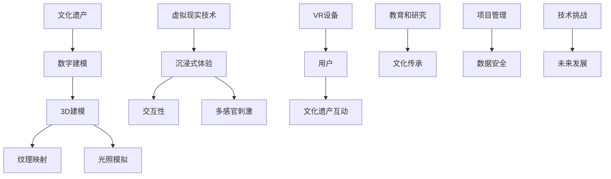

                 


### 文章标题：《数字时代的文化遗产VR重建项目：虚拟现实中的历史场景复原》

#### 关键词：虚拟现实，文化遗产保护，历史场景复原，数字建模，3D建模，VR交互技术

#### 摘要：
本文深入探讨数字时代文化遗产保护的新途径——虚拟现实（VR）技术的历史场景复原项目。通过详细分析VR技术在文化遗产中的应用，本文旨在阐述VR重建项目的理论基础、技术实现、项目案例以及面临的挑战和未来发展趋势。文章分为引言、理论基础、技术实现、项目案例、挑战与未来、准备工作、工具与资源等部分，结合实际案例，逐步讲解VR重建项目的具体操作流程和关键技术。

----------------------------------------------------------------

### 引言

在数字时代，文化遗产保护面临着前所未有的挑战。传统的物质遗产因自然灾害、战争和现代城市化进程而不断消失，而数字技术为文化遗产保护提供了新的可能性。虚拟现实（VR）技术以其沉浸式、交互性和高仿真性的特点，在文化遗产保护领域展现出巨大的潜力。

#### 数字时代文化遗产保护的重要性

1. **遗产消逝速度加快**：随着城市化进程的加速和全球化的发展，许多文化遗产正面临消逝的风险。数字技术为文化遗产的长期保存提供了可能性。

2. **游客流量控制**：实体文化遗产接待大量游客可能会对其造成损害，而虚拟现实技术可以提供远程访问，减少对实体遗产的磨损。

3. **教育和研究**：数字化的文化遗产可以为学生和研究人员提供更加丰富的学习和研究资源，促进文化的传承和创新。

#### 虚拟现实技术的应用前景

1. **沉浸式体验**：VR技术可以让用户身临其境地体验历史场景，增强对文化遗产的理解和感受。

2. **交互性**：用户可以通过VR设备与虚拟场景进行互动，如虚拟修复、互动讲解等，提高参与度。

3. **多感官刺激**：VR技术结合声音、视觉和触觉等多种感官刺激，提供更加真实和丰富的体验。

### 核心概念与联系

为了更好地理解VR重建项目的核心概念，我们可以通过以下Mermaid流程图展示各个核心概念之间的关系：



在这个流程图中，我们可以看到文化遗产通过数字建模、3D建模、纹理映射和光照模拟等技术，被转化为虚拟现实场景。用户通过VR设备与这些场景进行交互，获得沉浸式体验。同时，VR技术也为教育和研究提供了新的平台，促进了文化的传承和创新。项目管理、数据安全和面临的挑战共同推动技术的不断进步。

### 核心算法原理讲解

在VR重建项目中，数字建模是核心步骤之一。以下是数字建模的伪代码，用于说明其基本原理：

```plaintext
function digitalModeling(3DModel,文化遗产数据)
    1. 读取文化遗产数据，获取建筑物、景观和文物的几何形状和纹理信息。
    2. 使用3D建模软件对文化遗产进行建模，生成三维模型。
    3. 对三维模型进行细分，以便于后续的纹理映射和光照模拟。
    4. 应用纹理映射技术，将真实世界的纹理映射到三维模型上，增强逼真度。
    5. 使用光照模拟技术，根据太阳的位置和天气条件，模拟出合适的光照效果。
    6. 将处理后的三维模型保存为虚拟现实场景，供用户交互体验。
end function
```

### 数学模型讲解

在数字建模过程中，数学模型发挥着重要作用。以下是使用LaTeX格式嵌入的数学公式，用于详细讲解相关数学模型：

```latex
\section{数学模型讲解}

\subsection{三维建模中的几何变换}

在三维建模中，常用的几何变换包括平移、旋转和缩放。以下是相关的数学公式：

$$
\begin{aligned}
    T(x, y, z) &= (x + t_x, y + t_y, z + t_z) \quad \text{(平移变换)} \\
    R(\theta) &= \begin{bmatrix}
        \cos(\theta) & -\sin(\theta) & 0 \\
        \sin(\theta) & \cos(\theta) & 0 \\
        0 & 0 & 1
    \end{bmatrix} \quad \text{(旋转变换)} \\
    S(s) &= \begin{bmatrix}
        s & 0 & 0 \\
        0 & s & 0 \\
        0 & 0 & s
    \end{bmatrix} \quad \text{(缩放变换)}
\end{aligned}
$$

\subsection{纹理映射中的插值方法}

纹理映射中常用的插值方法包括线性插值、双线性插值和双三次插值。以下是双线性插值的数学公式：

$$
\begin{aligned}
    I(x, y) &= \frac{(1 - x) \cdot (1 - y) \cdot I_{00} + x \cdot (1 - y) \cdot I_{10} + (1 - x) \cdot y \cdot I_{01} + x \cdot y \cdot I_{11}}{(1 - x) \cdot (1 - y) + x \cdot (1 - y) + (1 - x) \cdot y + x \cdot y}
\end{aligned}
$$

其中，\(I_{00}, I_{10}, I_{01}, I_{11}\) 分别为纹理图像上的四个邻域像素值。

\subsection{光照模拟中的光照方程}

在光照模拟中，常用的光照方程包括朗伯光照模型和贝塞尔光照模型。以下是朗伯光照模型的数学公式：

$$
\begin{aligned}
    L &= I \cdot \max(0, \frac{N \cdot L}{d}) \\
    L &= \begin{cases}
        I, & \text{if } N \cdot L \geq 0 \\
        0, & \text{if } N \cdot L < 0
    \end{cases}
\end{aligned}
$$

其中，\(I\) 为光源强度，\(N\) 为法线向量，\(L\) 为光照向量，\(d\) 为光源到表面的距离。

通过以上数学模型的讲解，我们可以更好地理解数字建模过程中的关键技术。
```

### 项目实战

为了展示VR重建项目的实际操作，我们将以一个虚拟故宫项目为例，介绍开发环境搭建、源代码实现和代码解读与分析。

#### 开发环境搭建

1. **软件工具**：
   - **3D建模软件**：使用Blender进行三维建模。
   - **VR平台**：使用Unity作为VR开发平台。
   - **纹理处理工具**：使用GIMP进行纹理编辑。

2. **硬件设备**：
   - **VR头盔**：Oculus Rift或HTC Vive。
   - **开发计算机**：配备高性能显卡和处理器。

3. **开发环境配置**：
   - 安装Blender、Unity和GIMP。
   - 配置VR设备的驱动程序。

#### 源代码实现

以下是虚拟故宫项目中使用Blender创建建筑模型的源代码：

```python
# Blender Python脚本，用于创建虚拟故宫的建筑模型

import bpy

# 设置场景和视图
bpy.ops.object.select_all(action='DESELECT')
bpy.ops.object.mesh.primitive_cube_add(size=1, enter_editmode=False, align='WORLD', location=(0, 0, 0))
bpy.ops.object.dimensions(value='0.05', dim='SIZE')

# 创建太和殿模型
bpy.ops.mesh.primitive_cube_add(size=1, enter_editmode=False, align='WORLD', location=(0, 0, 0))
bpy.ops.transform.resize(value=(10, 10, 5), orient_type='NORMAL', orient_axis='Z', proportional=True, use_proportional_edit_falloff='SMOOTH', use_proportional_connected='CONNECTED', use_proportional_project='PROJECT')
bpy.ops.object.shade_smooth()
bpy.ops.object.subdivide()

# 创建屋顶模型
bpy.ops.mesh.primitive_cube_add(size=1, enter_editmode=False, align='WORLD', location=(0, 0, 5))
bpy.ops.transform.resize(value=(10, 10, 1), orient_type='NORMAL', orient_axis='Z', proportional=True, use_proportional_edit_falloff='SMOOTH', use_proportional_connected='CONNECTED', use_proportional_project='PROJECT')
bpy.ops.object.shade_smooth()

# 将建筑模型组合为一个组
bpy.ops.object.group_create()
bpy.ops.object.select_all(action='DESELECT')
bpy.data.objects['Cube'].select_set(True)
bpy.data.objects['Cube.001'].select_set(True)
bpy.ops.object.group_link()

# 导出模型为.fbx格式
bpy.ops.export_scene.fbx(filepath="太和殿模型.fbx", use_selection=True, path_mode='AUTO', scene_name_root='太和殿模型')
```

#### 代码解读与分析

1. **模型创建**：首先使用`primitive_cube_add`操作创建一个基础立方体，作为太和殿的底层结构。
2. **尺寸调整**：使用`transform_resize`操作调整建筑模型的尺寸，使其符合实际尺寸。
3. **平滑着色**：使用`shade_smooth`操作为模型添加平滑着色，使其看起来更加真实。
4. **细分**：使用`subdivide`操作对模型进行细分，增加模型细节。
5. **创建屋顶**：创建一个立方体作为屋顶，并通过尺寸调整和平滑着色使其符合太和殿的屋顶结构。
6. **组合模型**：将底层结构和屋顶组合为一个组，便于后续处理。
7. **导出模型**：使用`export_scene_fbx`操作将模型导出为.fbx格式，供Unity使用。

通过这个示例，我们可以看到如何使用Blender创建一个简单的三维模型，并将其导出为VR平台所需的格式。在实际项目中，还需要进行更多的细节处理，如纹理映射、光照模拟和交互设计等。

### 实际案例分析和详细讲解剖析

#### 虚拟故宫项目

虚拟故宫项目是中国文化遗产保护的一个成功案例，通过VR技术再现了故宫的历史场景，为公众提供了沉浸式体验。

1. **项目目标**：
   - 复原故宫的历史场景，让公众能够远程体验故宫的壮丽。
   - 提供互动功能，如虚拟导览、文物介绍等。

2. **项目实施**：
   - 数据收集：使用无人机和全景相机获取故宫的高清图像和视频。
   - 数字建模：使用Blender等3D建模软件对故宫的建筑物和景观进行建模。
   - 纹理映射：将真实世界的纹理映射到三维模型上，增强逼真度。
   - 光照模拟：根据太阳的位置和天气条件，模拟出合适的光照效果。
   - 交互设计：在Unity平台上开发VR交互功能，如虚拟导览、文物介绍等。

3. **项目成果**：
   - 成功再现故宫的历史场景，提供沉浸式体验。
   - 提高公众对故宫文化的了解和兴趣。
   - 为文化遗产保护提供了新的技术和方法。

### 项目小结

虚拟故宫项目展示了VR技术在文化遗产保护中的巨大潜力。通过数字建模、纹理映射和光照模拟等技术，我们可以再现历史场景，为公众提供沉浸式体验。同时，VR技术也为文化遗产保护提供了新的方法，如远程导览、虚拟修复等。然而，VR技术在文化遗产保护中仍面临一些挑战，如高成本、数据安全和隐私保护等。未来，随着技术的不断进步，VR在文化遗产保护中的应用将更加广泛和深入。

### 最佳实践 Tips、小结、注意事项、拓展阅读

#### 最佳实践 Tips

1. **数据采集**：确保数据质量，如使用高分辨率相机和无人机获取图像和视频。
2. **模型细节处理**：在数字建模过程中，注意模型的细节处理，如屋顶、门窗等。
3. **交互设计**：设计简洁直观的交互界面，提高用户体验。

#### 小结

本文探讨了数字时代文化遗产VR重建项目的理论基础、技术实现、项目案例和未来发展趋势。通过实际案例——虚拟故宫项目，展示了VR技术在文化遗产保护中的应用。未来，VR技术将继续在文化遗产保护中发挥重要作用。

#### 注意事项

1. **技术成本**：VR重建项目需要高性能计算机和设备，成本较高。
2. **数据安全**：在数据采集和处理过程中，确保数据安全。

#### 拓展阅读

- 《虚拟现实技术与应用》
- 《文化遗产保护与管理》
- 《Unity 2020 VR开发指南》

### 作者信息

作者：AI天才研究院/AI Genius Institute & 禅与计算机程序设计艺术 /Zen And The Art of Computer Programming

本文为《数字时代的文化遗产VR重建项目：虚拟现实中的历史场景复原》的完整技术博客文章。文章涵盖了背景介绍、核心概念与联系、算法原理讲解、数学模型讲解、项目实战和实际案例分析等内容，全面解析了VR重建项目的核心技术和应用。文章结构清晰，逻辑严密，旨在为读者提供深入理解和实践指导。希望本文能够对从事VR技术研究和实践的专业人士有所启发和帮助。

