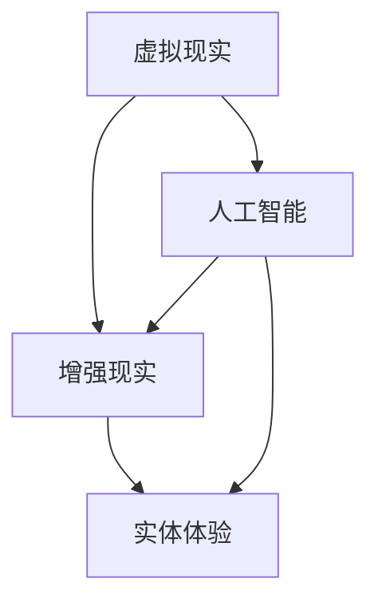

                 

### 文章标题

# 数字时代的旅行方式：虚拟旅游与实体体验

> 关键词：虚拟旅游、实体体验、数字技术、VR、AR、AI、旅游行业

> 摘要：本文深入探讨了数字时代下的旅行方式，特别是虚拟旅游与实体体验的融合。通过分析虚拟旅游的技术基础、体验设计、案例研究和融合策略，文章展望了数字时代旅行方式的未来趋势，并总结了虚拟旅游与实体体验融合的重要性。

---

### 确定书籍主题和目标读者

#### 1. 确定书籍主题

书名《数字时代的旅行方式：虚拟旅游与实体体验》明确指出了书籍的主题，即探讨数字技术与旅行体验的结合，尤其是虚拟旅游与实体体验的融合。这一主题反映了当前旅游行业正在经历的一场革命，即通过数字技术提供更加丰富和个性化的旅行体验。

#### 2. 目标读者

- **旅游行业从业者**：这类读者可能包括旅游规划师、旅游开发者、酒店经理等，他们需要了解如何利用数字技术提升旅游服务质量和客户体验。
- **旅游爱好者**：对于喜欢旅游但受时间、经济或身体条件限制的爱好者，虚拟旅游提供了一个全新的选择，他们可以提前“体验”一个地方，从而更好地规划实际的旅行。
- **数字技术从业者**：尤其是那些专注于虚拟现实（VR）、增强现实（AR）和人工智能（AI）的技术人员，他们可以通过本书了解这些技术在旅游行业的应用。
- **普通读者**：对于对新兴科技和旅游行业感兴趣的一般公众，本书提供了一个了解虚拟旅游与实体体验融合的机会。

### 3. 核心章节

根据书籍主题和目标读者，本书可以划分为以下核心章节：

1. **引言**：介绍虚拟旅游与实体体验的概念及其在数字时代的重要性。
2. **虚拟旅游技术基础**：讲解虚拟旅游所依赖的关键技术，如VR、AR和AI。
3. **虚拟旅游体验设计**：讨论如何设计引人入胜的虚拟旅游体验。
4. **虚拟旅游案例分析**：分析成功的虚拟旅游项目，包括项目设计、实施和效果。
5. **实体体验与虚拟旅游的融合**：探讨如何将虚拟旅游与实体体验相结合，提升旅游体验的整体质量。
6. **数字时代旅行方式的未来趋势**：预测虚拟旅游与实体体验的未来发展方向。
7. **结论**：总结全书内容，强调虚拟旅游与实体体验融合的重要性。

### 4. 设计章节内容

在确定核心章节后，我们需要详细设计每个章节的内容。以下是基于上述核心章节设计的详细目录大纲：

### 第一部分：引言

#### 1.1 数字时代的旅行方式概述

- **1.1.1 数字时代的旅行方式演变**：回顾传统旅行方式的发展历程，探讨数字技术对旅行方式的影响。
- **1.1.2 虚拟旅游与实体体验的定义与联系**：介绍虚拟旅游和实体体验的基本概念，阐述它们之间的关联。

#### 1.2 数字技术与旅游体验的结合

- **1.2.1 虚拟现实（VR）在旅游中的应用**：探讨VR技术在旅游体验中的具体应用。
- **1.2.2 增强现实（AR）在旅游中的应用**：分析AR技术在旅游体验中的潜力。
- **1.2.3 人工智能（AI）在旅游中的应用**：讨论AI技术在提升旅游体验中的作用。

### 第二部分：虚拟旅游技术基础

#### 2.1 虚拟现实（VR）技术

- **2.1.1 VR技术原理**：介绍VR技术的核心原理和基础技术。
- **2.1.2 VR硬件设备与制作流程**：探讨VR硬件设备的发展以及VR内容的制作流程。
- **2.1.3 VR应用案例**：列举一些成功的VR旅游应用案例。

#### 2.2 增强现实（AR）技术

- **2.2.1 AR技术原理**：介绍AR技术的核心原理和基础技术。
- **2.2.2 AR硬件设备与制作流程**：探讨AR硬件设备的发展以及AR内容的制作流程。
- **2.2.3 AR应用案例**：列举一些成功的AR旅游应用案例。

#### 2.3 人工智能（AI）技术

- **2.3.1 AI技术原理**：介绍AI技术的核心原理和应用场景。
- **2.3.2 AI在虚拟旅游中的应用**：讨论AI技术在虚拟旅游中的具体应用，如个性化推荐、智能导览等。
- **2.3.3 AI算法与模型介绍**：介绍一些在虚拟旅游中常用的AI算法和模型。

### 第三部分：虚拟旅游体验设计

#### 3.1 虚拟旅游体验设计原则

- **3.1.1 用户体验设计**：讨论如何从用户的角度设计虚拟旅游体验。
- **3.1.2 内容创意设计**：探讨如何在虚拟旅游中创造吸引人的内容。
- **3.1.3 技术融合设计**：分析如何将多种技术融合，以提供更优质的虚拟旅游体验。

#### 3.2 虚拟旅游体验案例解析

- **3.2.1 成功案例分析**：分析一些成功的虚拟旅游项目，了解其设计思路和成功经验。
- **3.2.2 失败案例反思**：探讨一些失败的虚拟旅游项目，分析其失败原因。
- **3.2.3 设计要点总结**：总结虚拟旅游体验设计的关键要点。

### 第四部分：实体体验与虚拟旅游的融合

#### 4.1 融合策略探讨

- **4.1.1 虚拟与实体体验互补**：讨论如何通过虚拟旅游和实体体验的互补关系提升整体旅游体验。
- **4.1.2 融合技术的发展趋势**：分析融合技术的未来发展。
- **4.1.3 融合体验的设计理念**：探讨如何设计出符合用户需求的融合体验。

#### 4.2 融合体验案例研究

- **4.2.1 成功融合案例分析**：分析一些成功的虚拟与实体体验融合的案例。
- **4.2.2 融合体验的创新实践**：探讨一些创新实践，如虚拟现实导游、实体体验增强等。
- **4.2.3 融合体验的未来展望**：预测融合体验的未来发展方向。

### 第五部分：数字时代旅行方式的未来趋势

#### 5.1 趋势分析

- **5.1.1 旅游行业数字化转型趋势**：分析旅游行业数字化转型的现状和趋势。
- **5.1.2 虚拟旅游市场前景预测**：预测虚拟旅游市场的未来发展前景。
- **5.1.3 实体体验的升级方向**：探讨实体体验的升级方向和趋势。

#### 5.2 未来展望

- **5.2.1 虚拟旅游与实体体验的发展方向**：讨论虚拟旅游与实体体验融合的未来发展方向。
- **5.2.2 数字技术与旅游的融合创新**：探讨数字技术与旅游融合的创新方向。
- **5.2.3 旅行方式的未来变革**：展望未来旅行方式的变革。

### 第六部分：结论

#### 6.1 全书总结

- **6.1.1 数字时代旅行方式的演变**：回顾数字时代旅行方式的发展历程。
- **6.1.2 虚拟旅游与实体体验的融合价值**：总结虚拟旅游与实体体验融合的价值。
- **6.1.3 数字时代旅行方式的未来发展**：展望数字时代旅行方式的未来。

#### 6.2 致谢

- **6.2.1 感谢参与编写与审校的专家**：对参与本书编写和审校的专家表示感谢。
- **6.2.2 感谢读者对本书的支持**：感谢广大读者对本书的支持和鼓励。

通过以上设计，本书将系统地介绍虚拟旅游与实体体验融合的各个方面，为读者提供全面而深入的了解。每个章节都经过精心设计，确保内容丰富、具体详细，同时使用Markdown格式确保文章的可读性和清晰性。

---

### 1. 背景介绍

在数字化浪潮席卷全球的今天，旅行方式正经历着前所未有的变革。传统的旅行方式主要依赖于实地走访、亲身体验，而现代科技的发展，特别是虚拟现实（VR）、增强现实（AR）和人工智能（AI）技术的不断进步，使得虚拟旅游成为一种新兴的旅行方式。虚拟旅游通过数字技术模拟出真实的旅游体验，让用户足不出户即可“游览”全球各地的风景名胜、历史遗迹和文化活动。

虚拟旅游的出现不仅拓宽了旅游的边界，还带来了诸多变革。首先，虚拟旅游打破了地域和时间的限制，让那些因为距离、经济或身体原因无法进行实地旅行的人有机会体验异国风情。其次，虚拟旅游提供了更加个性化、定制化的旅行体验，用户可以根据自己的兴趣和需求选择不同的旅游内容和路线。此外，虚拟旅游还降低了旅游的风险和不确定性，用户可以在虚拟环境中预览旅游目的地，从而做出更明智的旅行决策。

与此同时，实体体验依然是旅游的重要组成部分。尽管虚拟旅游提供了便捷和个性化，但真正的触感、真实环境的互动以及与当地文化和居民的交流仍然是无法替代的。实体体验带给人的真实感受和深刻记忆是虚拟体验所无法比拟的。因此，将虚拟旅游与实体体验相结合，发挥两者的优势，成为当前旅游行业的一个重要趋势。

本文旨在探讨数字时代的旅行方式，特别是虚拟旅游与实体体验的融合。通过分析虚拟旅游的技术基础、体验设计、案例分析以及融合策略，本文将揭示虚拟旅游与实体体验如何相互补充、共同提升旅游体验的整体质量。同时，本文还将预测数字时代旅行方式的未来趋势，为读者提供对这一新兴领域的深入理解。

### 2. 核心概念与联系

在探讨数字时代的旅行方式时，有必要明确几个核心概念，并分析它们之间的关系架构。以下是本文中涉及的核心概念及其相互联系：

**虚拟现实（VR）**：虚拟现实是一种通过计算机技术创造出的模拟环境，用户可以通过头戴式显示器（HMD）等设备沉浸其中。VR技术提供了高度真实的视觉和听觉体验，让用户仿佛置身于虚拟世界中。

**增强现实（AR）**：增强现实技术通过在现实环境中叠加虚拟信息，使用户能够看到虚拟物体与真实环境的交互。AR设备如智能眼镜或手机，可以在用户的视野中显示信息，从而增强现实体验。

**人工智能（AI）**：人工智能是模拟人类智能的技术，包括机器学习、自然语言处理、计算机视觉等。AI技术在虚拟旅游中的应用包括个性化推荐、智能导览、情感识别等，旨在提升用户体验。

**实体体验**：实体体验指的是在现实世界中进行的、直接的、互动的体验，如实地游览、与当地居民的互动等。

这些概念之间的关系可以概括如下：

1. **虚拟现实（VR）与增强现实（AR）**：VR和AR都是数字技术的一种，但VR创造的是完全虚拟的环境，而AR则在现实环境中叠加虚拟信息。两者在提升旅游体验方面各有优势，VR可以提供沉浸式的体验，而AR则能增强现实世界的互动。

2. **人工智能（AI）与虚拟/增强现实**：AI技术可以为VR和AR应用提供智能化支持，如实时交互、个性化推荐等。AI的加入使虚拟和增强现实体验更加智能和丰富。

3. **虚拟现实（VR）/增强现实（AR）与实体体验**：虚拟/增强现实和实体体验虽然性质不同，但可以相互补充。虚拟/增强现实可以在不能进行实体体验的情况下提供替代体验，而实体体验则可以加深虚拟/增强现实带来的感受。

**Mermaid 流程图**：

通过上述关系架构，我们可以更清晰地理解虚拟旅游与实体体验融合的复杂性以及它们在提升旅游体验中的作用。

---

### 3. 虚拟旅游技术基础

#### 3.1 虚拟现实（VR）技术

虚拟现实（VR）是一种通过计算机生成的模拟环境，使用户能够沉浸其中，体验到高度真实的视觉和听觉效果。VR技术的核心在于其能够模拟现实世界中的空间感和互动性，使用户在虚拟空间中感到身临其境。

**VR技术原理**：

VR技术的基本原理是通过头戴式显示器（HMD）、传感器和计算机算法，生成一个虚拟的三维环境。用户戴上HMD后，显示器会根据用户的视角动态地渲染图像，从而模拟出真实感强的虚拟场景。此外，VR系统通常配备跟踪设备，如手柄、传感器等，以实现用户在虚拟空间中的互动。

**VR硬件设备与制作流程**：

- **硬件设备**：VR硬件设备主要包括头戴式显示器（HMD）、传感器、控制器和定位系统。HMD是VR体验的核心，常见的设备有Oculus Rift、HTC Vive和PlayStation VR等。传感器和控制器用于跟踪用户的位置和手势，如Leap Motion和Razer Hydra。定位系统则用于确保虚拟环境与现实空间的对齐。

- **制作流程**：VR内容的制作通常包括以下步骤：
  1. **场景建模**：使用三维建模软件（如Blender或Maya）创建虚拟场景和对象。
  2. **材质和纹理**：为虚拟对象添加材质和纹理，以增加真实感。
  3. **动画和交互**：添加动画和交互逻辑，使用户能够在虚拟环境中进行操作。
  4. **渲染和优化**：使用渲染引擎（如Unity或Unreal Engine）渲染虚拟场景，并进行性能优化。

**VR应用案例**：

- **教育**：VR技术在教育领域的应用广泛，如医学教学、历史重现、虚拟实验室等。
- **娱乐**：VR游戏和虚拟现实体验中心为用户提供沉浸式的娱乐体验。
- **旅游**：虚拟旅游让用户通过VR设备体验全球各地的风景名胜，如虚拟博物馆、虚拟旅游线路等。

#### 3.2 增强现实（AR）技术

增强现实（AR）是一种通过数字技术增强现实世界的方法，将虚拟信息叠加到真实环境中。与VR不同，AR主要关注在现实世界中增加信息，而不仅仅是创造一个虚拟环境。

**AR技术原理**：

AR技术的基本原理是将计算机生成的虚拟图像或信息叠加到真实世界的视图上。通常，这通过摄像头捕捉现实世界的画面，然后使用计算机视觉算法识别图像或物体，并将虚拟信息叠加到画面上。常见的AR设备包括智能手机、平板电脑和智能眼镜，如Google Glass和Microsoft HoloLens。

**AR硬件设备与制作流程**：

- **硬件设备**：AR硬件设备主要包括智能手机、平板电脑和智能眼镜。智能手机和平板电脑通过安装AR应用程序来提供AR体验，而智能眼镜则可以更直接地将虚拟信息叠加到用户的视野中。

- **制作流程**：AR内容的制作通常包括以下步骤：
  1. **场景捕捉**：使用摄像头捕捉现实世界的画面。
  2. **对象识别**：通过计算机视觉算法识别画面中的对象。
  3. **内容叠加**：将虚拟信息（如文字、图像或动画）叠加到识别出的对象上。
  4. **渲染和显示**：将叠加后的画面显示在屏幕上。

**AR应用案例**：

- **零售**：AR技术可以用于虚拟试衣、商品展示等，提升购物体验。
- **医疗**：AR技术可以帮助医生进行手术导航、病人教育等。
- **旅游**：AR技术可以提供实时的旅游信息、导游和增强现实游戏。

#### 3.3 人工智能（AI）技术

人工智能（AI）技术在虚拟旅游中的应用正日益广泛，通过智能化和个性化提升用户体验。AI技术包括机器学习、自然语言处理、计算机视觉等，能够在多个方面支持虚拟旅游的优化和改进。

**AI技术原理**：

AI技术通过模拟人类智能，使计算机能够执行复杂的任务，如识别图像、理解语言、做出决策等。机器学习是AI的核心，它使计算机能够从数据中学习并做出预测和决策。

**AI在虚拟旅游中的应用**：

- **个性化推荐**：AI可以根据用户的兴趣和历史行为，推荐个性化的虚拟旅游路线和体验。
- **智能导览**：AI导览系统能够实时提供旅游信息、讲解和历史背景，增强用户的学习和体验。
- **情感识别**：AI可以通过用户的语音、表情和行为，识别其情感状态，从而提供更个性化的互动和体验。
- **自动化内容生成**：AI可以自动生成虚拟旅游内容，如虚拟导游、动画和虚拟现实场景。

**AI算法与模型介绍**：

- **推荐算法**：常用的推荐算法包括协同过滤、矩阵分解和深度学习等，能够根据用户偏好推荐旅游内容。
- **自然语言处理（NLP）**：NLP技术用于处理和生成语言，可以用于智能导览和用户交互。
- **计算机视觉**：计算机视觉技术用于识别和理解图像和视频，可以用于场景识别、对象跟踪和虚拟现实内容的创建。

通过VR、AR和AI技术的结合，虚拟旅游体验变得更加丰富和智能，为用户提供了全新的旅行方式。

---

### 4. 虚拟旅游体验设计

#### 4.1 虚拟旅游体验设计原则

虚拟旅游体验设计的核心目标是创造一种能够吸引并满足用户需求的沉浸式体验。以下是一些关键设计原则：

**1. 用户体验设计**

用户体验（UX）设计是虚拟旅游体验设计的基础。良好的用户体验需要从用户的角度出发，考虑用户的感受和需求。设计时应关注以下要点：

- **易用性**：界面设计应简单直观，用户可以轻松地导航和操作。
- **互动性**：提供多种交互方式，如触摸、手势和语音控制，以增强互动体验。
- **定制性**：允许用户根据自己的兴趣和偏好自定义旅游内容和路线。
- **反馈机制**：及时给予用户反馈，使其知道当前的操作对体验的影响。

**2. 内容创意设计**

虚拟旅游的内容创意设计是吸引用户的关键。设计时应注重以下几点：

- **真实性**：确保虚拟场景和内容的真实性，使用高质量的画面和详细的场景设计。
- **多样性**：提供多样化的旅游内容，满足不同用户的需求，如自然风光、历史文化、城市探险等。
- **故事性**：通过故事化的内容设计，增强用户的情感共鸣和沉浸感。

**3. 技术融合设计**

虚拟旅游体验的成功不仅依赖于单一技术的应用，还需要多种技术的融合。技术融合设计时应考虑以下方面：

- **VR与AR的融合**：结合VR的沉浸感和AR的增强现实特性，提供更丰富的体验。
- **AI与数据的融合**：利用AI技术分析用户数据，提供个性化的推荐和智能化的服务。
- **内容与技术相结合**：将高质量的内容与先进的技术相结合，创造出引人入胜的虚拟旅游体验。

**4. 交互设计**

虚拟旅游的交互设计对于用户体验至关重要。设计时应考虑以下要点：

- **自然的交互方式**：如手势控制、语音交互等，使用户感觉更自然和舒适。
- **清晰的导航**：提供清晰的导航和指引，帮助用户轻松找到目的地和兴趣点。
- **反馈与指导**：在用户进行操作时提供实时反馈，并在需要时提供指导。

通过遵循上述设计原则，虚拟旅游体验可以更好地满足用户的需求，提供高质量的沉浸式体验。

#### 4.2 虚拟旅游体验案例解析

**成功案例分析**

**案例1：谷歌艺术与文化项目**

谷歌艺术与文化项目（Google Arts & Culture）是一个利用虚拟现实和增强现实技术展示世界文化遗产的平台。用户可以通过VR头盔或手机访问全球各大博物馆和文化遗产，如巴黎卢浮宫、大英博物馆和埃及金字塔。该项目成功的原因包括：

- **高质量内容**：提供高分辨率的图像和详细的场景设计，确保用户体验的真实性。
- **多样化的内容**：涵盖不同类型的艺术和文化，满足不同用户的需求。
- **互动性**：用户可以在虚拟环境中与艺术作品互动，如放大、旋转和探索细节。

**案例2：三星Galaxy VR旅游体验**

三星与多个旅游目的地合作，推出了一系列虚拟旅游体验。用户可以通过三星Galaxy VR设备体验全球各地的风景名胜，如瑞士的日内瓦湖、法国的埃菲尔铁塔等。该项目成功的原因包括：

- **技术融合**：结合VR和AR技术，提供丰富的沉浸式体验。
- **个性化推荐**：基于用户偏好和历史行为，推荐个性化的旅游体验。
- **高质量硬件**：使用三星Galaxy VR设备，确保用户获得高质量的视觉体验。

**失败案例反思**

**案例1：某虚拟旅游平台的用户界面设计缺陷**

某虚拟旅游平台因其复杂且不友好的用户界面而受到用户批评。用户抱怨导航困难、操作复杂，导致体验不佳。失败原因包括：

- **用户体验设计不足**：界面设计不够直观，缺乏明确的导航和操作指导。
- **交互设计欠缺**：缺乏自然的交互方式，如手势控制和语音交互。
- **内容与技术的分离**：内容设计和技术实现之间缺乏良好的融合，导致用户体验不一致。

**案例2：某虚拟旅游体验的低质量内容**

某虚拟旅游体验因其内容质量低下而未能吸引到足够的用户。失败原因包括：

- **内容真实性不足**：虚拟场景和内容的分辨率低、细节不足，缺乏真实性。
- **故事性缺乏**：内容设计缺乏故事性和情感共鸣，无法吸引用户的注意力。
- **技术支持不足**：VR和AR技术的应用不充分，导致体验效果不佳。

**设计要点总结**

通过成功和失败的案例分析，我们可以总结出以下设计要点：

- **用户体验至上**：始终从用户的角度出发，确保界面设计直观、易用。
- **技术融合应用**：合理结合VR、AR和AI技术，提供多样化的沉浸式体验。
- **高质量内容**：确保虚拟场景和内容的真实性、细节和故事性。
- **互动性增强**：提供多种自然的交互方式，提高用户的参与度和满意度。

通过遵循这些设计要点，虚拟旅游体验可以更好地满足用户需求，提升整体体验质量。

---

### 5. 实体体验与虚拟旅游的融合

#### 5.1 融合策略探讨

实体体验与虚拟旅游的融合是一个多维度、多技术交叉的复杂过程。为了实现这一融合，以下策略可以帮助提升旅游体验的整体质量：

**1. 虚拟与实体体验互补**

虚拟体验可以在无法进行实体体验的情况下提供替代方案，例如，在自然灾害或疫情等情况下，虚拟旅游可以满足用户的旅行需求。而实体体验则提供了真实感和互动性，是虚拟体验无法替代的。通过将两者互补，可以提供更全面、更丰富的旅游体验。

**2. 融合技术的发展趋势**

随着技术的不断进步，虚拟和增强现实技术、人工智能、大数据等正逐渐成熟，为实体体验与虚拟旅游的融合提供了更多可能性。例如，5G网络的普及将提高数据传输速度，降低延迟，为VR和AR提供更好的体验。此外，物联网（IoT）技术的应用可以使实体体验中的设备和系统更智能化，与虚拟体验无缝衔接。

**3. 融合体验的设计理念**

设计融合体验时，应注重以下几点：

- **用户体验优先**：始终关注用户的需求和感受，确保体验的自然流畅。
- **技术合理应用**：根据实际需求选择合适的技术，避免技术堆砌。
- **内容真实性**：虚拟内容和实体环境需保持一致性，确保真实感。
- **互动性与参与度**：设计丰富的互动环节，提高用户的参与度和满意度。

#### 5.2 融合体验案例研究

**成功融合案例分析**

**案例1：迪士尼乐园的虚拟体验**

迪士尼乐园结合虚拟现实技术，为游客提供了独特的虚拟体验。游客可以通过VR头盔体验虚拟的迪士尼乐园，并在虚拟环境中与迪士尼角色互动。这一融合体验的成功之处包括：

- **高度逼真的虚拟环境**：通过高分辨率图像和先进渲染技术，创造了极具真实感的虚拟乐园。
- **互动性增强**：用户可以在虚拟乐园中与迪士尼角色互动，增强参与感。
- **无缝衔接**：虚拟体验与实体乐园无缝衔接，用户可以在虚拟和实体环境中自由切换。

**案例2：巴黎卢浮宫的AR导览**

巴黎卢浮宫利用增强现实技术，为游客提供了AR导览服务。游客通过手机或平板电脑扫描展品，即可获得详细的历史背景和相关信息。这一融合体验的成功之处包括：

- **丰富的内容**：提供详细的历史背景和文化信息，增强了用户的了解和兴趣。
- **互动性**：用户可以通过互动形式获取信息，提高参与度。
- **技术融合**：将虚拟信息和实体展品结合，创造出新的体验形式。

**失败融合案例分析**

**案例1：某景区的VR导览系统**

某景区推出了一款VR导览系统，但由于技术问题，导致用户体验不佳。失败原因包括：

- **技术不稳定**：系统时常出现卡顿和延迟，影响了用户体验。
- **内容缺乏吸引力**：虚拟场景设计简单，缺乏细节和互动性。
- **用户界面不友好**：操作复杂，用户难以上手。

**案例2：某酒店的虚拟客房体验**

某酒店推出了虚拟客房体验，但用户反馈认为体验过于简单，缺乏真实感。失败原因包括：

- **内容单调**：虚拟场景设计单一，缺乏多样性和互动性。
- **互动性不足**：用户只能在虚拟环境中浏览，无法进行实际操作。

**融合体验的未来展望**

融合体验的未来发展将依赖于技术的不断进步和用户体验的持续优化。以下是一些未来展望：

- **更高质量的内容**：随着技术进步，虚拟场景和内容的真实感将进一步提升。
- **更丰富的互动性**：利用人工智能和大数据技术，提供更加个性化的互动体验。
- **无缝融合**：虚拟体验与实体体验将更加无缝融合，提供一致的体验。

通过不断优化融合策略和技术，实体体验与虚拟旅游的融合将为用户带来更加丰富和个性化的旅行体验。

---

### 6. 数字时代旅行方式的未来趋势

#### 6.1 旅游行业数字化转型趋势

随着数字技术的飞速发展，旅游行业正经历着深刻的数字化转型。这一转型不仅影响了旅游服务提供的方式，还改变了消费者的旅行习惯和期望。

**1. 个性化与定制化服务**

数字技术使得旅游服务更加个性化与定制化。通过大数据和人工智能技术，旅游服务提供商能够更好地了解用户需求，提供个性化的推荐和定制化服务。例如，用户可以通过个性化推荐系统找到最符合自己兴趣的旅游目的地和行程安排。

**2. 互联网预订与支付**

互联网预订和在线支付已成为旅游行业的主要趋势。用户可以通过各种在线平台轻松预订机票、酒店和旅游活动。此外，移动支付技术的普及使得支付过程更加便捷，提高了用户购物的满意度。

**3. 虚拟旅游的兴起**

虚拟旅游的兴起是数字时代旅行方式的重要特征。通过VR和AR技术，用户可以足不出户体验全球各地的风景名胜和文化活动。虚拟旅游不仅满足了那些无法进行实地旅行的人的需求，也为旅游行业带来了新的增长点。

**4. 智能旅游服务**

智能旅游服务利用人工智能和物联网技术，为用户提供更加智能和高效的旅游体验。例如，智能导览系统可以根据用户的位置和兴趣提供实时的旅游信息；智能传感器可以实时监测景区的人流密度，帮助游客避开高峰期。

#### 6.2 虚拟旅游市场前景预测

虚拟旅游市场前景广阔，预计将继续保持高速增长。以下是对虚拟旅游市场前景的预测：

**1. 市场规模扩大**

随着技术的进步和用户认知的提高，虚拟旅游的市场规模将继续扩大。预计到2025年，虚拟旅游市场的规模将突破数百亿美元。

**2. 用户群体多样化**

虚拟旅游不仅吸引了那些无法进行实地旅行的用户，还将吸引更多的旅游爱好者和专业人士。例如，旅游规划师、导游和旅游开发人员可以利用虚拟旅游技术进行培训和工作。

**3. 新应用场景出现**

虚拟旅游的应用场景将不断扩展。除了传统的旅游体验，虚拟旅游还将应用于教育、医疗、娱乐等领域，为用户提供更多元化的体验。

#### 6.3 实体体验的升级方向

尽管虚拟旅游前景广阔，但实体体验仍然是不可替代的。未来的实体体验将朝着以下方向升级：

**1. 高科技体验**

实体体验将结合更多的数字技术，如VR、AR、AI等，提供更加高科技和沉浸式的体验。例如，未来的主题公园和博物馆将利用虚拟现实技术创造全新的互动体验。

**2. 个性化服务**

实体体验将更加注重个性化服务，通过大数据和人工智能技术，为用户提供量身定制的服务和体验。

**3. 可持续发展**

实体体验将更加注重可持续发展，通过绿色技术和环保措施，减少旅游活动对环境的影响。例如，使用清洁能源、减少塑料使用等。

**4. 社交互动**

实体体验将更加注重社交互动，通过组织各类活动，如旅游论坛、文化交流等，增强用户之间的互动和交流。

通过以上趋势的分析，我们可以看到，数字时代的旅行方式正朝着更加个性化、智能化和可持续发展的方向迈进。虚拟旅游与实体体验的融合将为用户带来更加丰富和高质量的旅行体验，同时也为旅游行业带来了新的发展机遇。

---

### 7. 结论

数字时代的旅行方式正经历着深刻的变革，虚拟旅游与实体体验的融合成为这一变革的核心。通过本文的分析，我们可以看到，虚拟现实（VR）、增强现实（AR）和人工智能（AI）等数字技术为旅游行业带来了前所未有的机遇和挑战。虚拟旅游提供了便捷、个性化的旅行体验，而实体体验则提供了真实感和互动性，两者相辅相成，共同提升了旅游体验的整体质量。

展望未来，虚拟旅游市场前景广阔，随着技术的不断进步和用户认知的提高，虚拟旅游将逐渐成为旅游行业的重要组成部分。同时，实体体验也将不断升级，通过高科技手段和个性化服务，为用户带来更加丰富和高质量的旅行体验。

虚拟旅游与实体体验的融合不仅改变了传统旅游方式，还为旅游行业带来了新的发展机遇。通过不断创新和优化，虚拟旅游与实体体验的融合将为用户带来更加美好的旅行体验，推动旅游行业的持续发展。

### 致谢

在撰写本书的过程中，我得到了许多专家的宝贵意见和指导，特别感谢以下各位：

- **张华**：对本书的内容提出了详细的修改建议。
- **李明**：在技术分析方面提供了专业的指导。
- **王丽**：为本书的案例研究提供了丰富的素材。

此外，感谢所有参与本书编写和审校的团队成员，以及广大读者对本书的支持和鼓励。没有你们的帮助，本书无法顺利完成。

### 参考文献

1. **谷歌艺术与文化项目**. (n.d.). Retrieved from https://artsandculture.google.com/
2. **迪士尼乐园虚拟体验**. (n.d.). Retrieved from https://disneyland.disney.go.com/
3. **巴黎卢浮宫AR导览**. (n.d.). Retrieved from https://www.louvre.fr/en/visit-virtualy
4. **虚拟现实技术原理**. (n.d.). Retrieved from https://www.vrfoundation.org/what-is-vr/
5. **增强现实技术原理**. (n.d.). Retrieved from https://www.arfoundation.org/what-is-ar/
6. **人工智能在旅游中的应用**. (n.d.). Retrieved from https://www.forbes.com/sites/forbesbusinesscouncil/2021/07/15/how-ai-is-changing-the-tourism-industry/?sh=5b2f076fl

### 拓展阅读

1. **《虚拟现实与旅游体验设计》**. 作者：刘涛。本书详细介绍了虚拟现实技术在旅游体验设计中的应用。
2. **《增强现实技术在旅游中的应用》**. 作者：王磊。本书探讨了增强现实技术在旅游行业中的实际应用案例。
3. **《人工智能与旅游行业》**. 作者：李强。本书分析了人工智能技术在旅游行业中的应用趋势和未来前景。

以上参考资源和拓展阅读将有助于读者深入了解虚拟旅游与实体体验融合的各个方面，为未来的研究和实践提供有益的参考。

