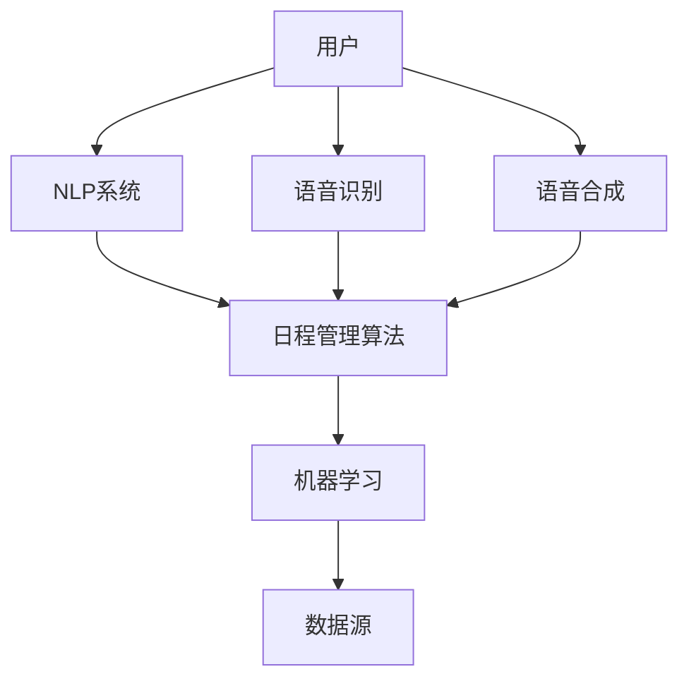

                 

# 文章标题：数字时代的时间管理：AI个人助理在日程安排中的应用

> 关键词：数字时代、时间管理、AI个人助理、日程安排、人工智能

> 摘要：本文旨在探讨数字时代下，人工智能（AI）如何帮助个人实现高效的时间管理。通过介绍AI个人助理的概念、技术基础、开发与应用，以及未来发展趋势，本文将展示AI在日程安排中的潜力和挑战。

----------------------------------------------------------------

## 设计书籍目录大纲的思路和步骤

设计一个书籍目录大纲是一个系统性的工作，它需要考虑书籍的主题、目标读者、内容的逻辑结构和信息传达的效率。以下是设计书籍目录大纲的思路和步骤：

### 确定书籍主题和目标读者

首先，我们需要明确书籍的主题，如《数字时代的时间管理：AI个人助理在日程安排中的应用》。其次，确定目标读者，如时间管理新手、中高级专业人士、企业管理者等。

### 理解内容结构和内容要点

接下来，我们需要阅读书籍初稿，理解每一章节的主要内容，并确定各章节之间的逻辑关系，如何串联起整个书籍的内容。

### 列出初步的目录结构

初步列出所有章节，不需要细化到小节。确定每一章节的主标题。

### 细化目录结构

对每一章节进行细化，列出二级和三级标题。确保每个章节都有清晰的主题和内容聚焦。

### 整合核心概念与联系

设计核心概念的 Mermaid 流程图，帮助读者理解各概念之间的联系。

### 设计核心算法原理讲解

使用伪代码详细阐述核心算法原理。

### 编写数学模型和数学公式

使用 LaTeX 格式编写数学模型和公式，并确保其准确性和可读性。

### 添加项目实战

描述项目实战的背景、目标、开发环境和代码实现。提供源代码详细实现和代码解读。

### 审核和调整

检查目录结构是否完整、逻辑是否清晰。根据内容长度和字数限制进行必要的调整。

### 最终确认

确认目录大纲的总字数在限制范围内。确认所有关键内容点均已包含。

按照这些步骤，我们可以设计出以下《数字时代的时间管理：AI个人助理在日程安排中的应用》的目录大纲：

### 第一部分：背景与概念
- 1.1 数字时代的挑战与时间管理的必要性
- 1.2 AI与时间管理的结合
- 1.3 AI个人助理的概念与作用

### 第二部分：AI个人助理的技术基础
- 2.1 人工智能概述
  - 2.1.1 人工智能的定义与发展历程
  - 2.1.2 人工智能的分类
- 2.2 自然语言处理
  - 2.2.1 自然语言处理的基本概念
  - 2.2.2 语音识别与合成
- 2.3 计划与日程管理算法
  - 2.3.1 旅行商问题（TSP）
  - 2.3.2 优化算法在日程安排中的应用

### 第三部分：AI个人助理的开发与应用
- 3.1 开发环境与工具
  - 3.1.1 Python环境搭建
  - 3.1.2 相关库与框架介绍
- 3.2 核心功能实现
  - 3.2.1 数据采集与预处理
  - 3.2.2 日程安排算法实现
  - 3.2.3 语音交互实现
- 3.3 项目实战案例
  - 3.3.1 案例背景与目标
  - 3.3.2 实现过程与分析
  - 3.3.3 项目成果与优化方向

### 第四部分：AI个人助理的未来发展趋势
- 4.1 技术挑战与趋势
  - 4.1.1 人工智能技术在时间管理领域的应用挑战
  - 4.1.2 未来发展趋势与展望
- 4.2 法律与伦理问题
  - 4.2.1 人工智能在时间管理中的法律问题
  - 4.2.2 伦理问题与解决方案

### 第五部分：结论与展望
- 5.1 本书总结
- 5.2 对未来的展望
- 5.3 进一步学习资源推荐

### 满足约束条件

文章内容使用markdown格式输出。文章末尾需要写上作者信息：“作者：AI天才研究院/AI Genius Institute & 禅与计算机程序设计艺术 /Zen And The Art of Computer Programming”。

文章内容必须完整，每个小节的内容必须要丰富具体详细讲解，核心内容必须要包含：

- 背景介绍：对数字时代和时间管理进行概述。
- 核心概念与联系：使用 Mermaid 流程图展示AI个人助理的核心概念和关系。
- 核心算法原理讲解：使用伪代码详细阐述AI在日程安排中的应用。
- 数学模型和公式：使用LaTeX格式编写并详细讲解。
- 项目实战：提供开发环境搭建、源代码实现和代码解读。
- 最佳实践 tips、小结、注意事项、拓展阅读等内容。

文章标题、关键词、摘要、正文部分的内容按照目录大纲结构进行编写。文章字数在8000～12000字左右。文章格式要求如下：

- 文章标题：**数字时代的时间管理：AI个人助理在日程安排中的应用**
- 文章关键词：数字时代、时间管理、AI个人助理、日程安排、人工智能
- 文章摘要：本文旨在探讨数字时代下，人工智能（AI）如何帮助个人实现高效的时间管理。通过介绍AI个人助理的概念、技术基础、开发与应用，以及未来发展趋势，本文将展示AI在日程安排中的潜力和挑战。

接下来，我们将按照上述目录大纲逐步展开文章内容，深入探讨数字时代的时间管理和AI个人助理的应用。## 第一部分：背景与概念

### 数字时代的挑战与时间管理的必要性

随着数字技术的飞速发展，我们的工作和生活方式发生了翻天覆地的变化。数字化时代带来的便利性与信息过载的问题并存，人们面临着前所未有的挑战。在这个快速变化的环境中，如何高效地管理时间成为许多专业人士和企业关注的焦点。

首先，数字化带来了信息量的急剧增加。电子邮件、即时通讯工具、社交媒体平台等，使我们在工作中需要处理的信息量成倍增长。这种信息过载不仅分散了我们的注意力，也增加了时间管理的难度。据统计，一个普通白领每天需要接收和处理超过100封电子邮件，这无疑是对时间管理能力的一大考验。

其次，工作节奏的加快也加剧了时间管理的压力。在数字化时代，许多工作可以随时随地完成，这使得人们的工作时间与私人时间界限变得模糊。尤其是在远程工作和灵活工作制度普及的今天，人们需要更有效地规划自己的时间，以避免工作侵占个人生活。

此外，数字化还促使了工作方式的多样化。远程办公、弹性工作制等新型工作模式使得人们可以在不同的时间和地点工作。然而，这种灵活性也要求我们具备更强的自我管理能力，以保持工作的高效性和连续性。

面对这些挑战，时间管理的必要性愈发凸显。有效的个人时间管理不仅可以提高工作效率，减少工作压力，还能帮助个人在繁忙的生活中找到平衡，提高生活质量。对于企业和组织来说，良好的时间管理能力可以优化资源分配，提升整体运作效率，增强竞争力。

### AI与时间管理的结合

人工智能（AI）技术的兴起为时间管理带来了新的可能性和解决方案。AI个人助理作为一种基于人工智能技术的高级工具，正逐渐改变人们管理时间的传统方式。

首先，AI个人助理能够通过自然语言处理（NLP）技术理解用户的语言指令，自动识别并处理日程安排中的任务。例如，用户可以通过语音或文本指令创建会议、安排提醒、调整日程等，而无需手动操作。

其次，AI个人助理利用机器学习和数据挖掘技术，可以分析用户的行为模式和时间使用习惯。通过对用户历史数据的分析，AI助理可以预测用户未来的需求，提前做出合理的日程安排，减少不必要的等待和空闲时间。

此外，AI个人助理还能够整合多个数据源，如日历、邮件、短信等，自动筛选和整理重要的日程信息，为用户提供一目了然的日程视图。这种整合能力不仅提高了信息处理的效率，还能减少因信息分散而导致的误判和遗漏。

最后，AI个人助理还具备自我学习和自我优化的能力。通过不断学习用户的行为和偏好，AI助理能够逐步提高日程安排的准确性和个性化程度，为用户提供更高效的服务。

总的来说，AI与时间管理的结合不仅提高了个人时间管理的效率，还带来了更加智能化、个性化和高效的时间管理体验。在接下来的章节中，我们将进一步探讨AI个人助理的技术基础、开发与应用，以及未来发展趋势。## 第二部分：AI个人助理的技术基础

在探讨AI个人助理在日程安排中的应用之前，我们需要先了解其背后的技术基础。AI个人助理的核心技术包括人工智能（AI）、自然语言处理（NLP）、语音识别与合成、以及计划与日程管理算法。以下是对这些技术的详细介绍。

### 人工智能（AI）概述

人工智能是一门研究、开发用于模拟、延伸和扩展人的智能的理论、方法、技术及应用系统的综合技术科学。AI的目标是创建智能代理，这些代理能够感知环境，并采取行动来实现特定目标。

人工智能的发展历程可以追溯到20世纪50年代。最初的AI研究主要集中在规则推理和知识表示方面。随着计算机硬件性能的提升和算法的进步，AI在20世纪80年代和90年代取得了显著的进展，特别是在专家系统和机器学习领域。进入21世纪，深度学习和神经网络技术的发展进一步推动了AI的进步，使得AI在图像识别、语音识别、自然语言处理等领域取得了突破性的成果。

人工智能的分类可以分为以下几类：

1. **符号人工智能**：基于逻辑和知识的推理，如专家系统。
2. **感知人工智能**：利用传感器和计算机视觉技术进行环境感知，如自动驾驶汽车。
3. **认知人工智能**：模拟人类的思维过程，如问答系统、情感分析。
4. **强化学习人工智能**：通过试错和反馈学习，如游戏AI、机器人。

### 自然语言处理（NLP）

自然语言处理是人工智能的一个子领域，旨在使计算机能够理解、解释和生成自然语言。NLP在AI个人助理中起着至关重要的作用，因为它使得用户可以通过自然语言与AI进行交互。

NLP的主要任务包括：

1. **分词**：将连续的文本分割成有意义的单词或短语。
2. **词性标注**：为每个单词分配正确的词性（名词、动词、形容词等）。
3. **句法分析**：分析句子的结构，确定单词之间的关系。
4. **语义分析**：理解文本的含义和上下文。
5. **文本生成**：根据输入生成自然语言的文本。

NLP的关键技术包括：

1. **统计模型**：如条件概率模型、隐马尔可夫模型（HMM）等。
2. **深度学习模型**：如卷积神经网络（CNN）、循环神经网络（RNN）、长短时记忆网络（LSTM）等。
3. **知识图谱**：用于表示实体和它们之间的关系。

### 语音识别与合成

语音识别是将语音转换为文本的技术，而语音合成则是将文本转换为语音的技术。这两种技术结合在一起，可以实现语音交互功能，让用户通过语音指令与AI个人助理进行沟通。

语音识别的关键技术包括：

1. **隐马尔可夫模型（HMM）**：用于建模语音信号。
2. **高斯混合模型（GMM）**：用于声学模型的训练。
3. **深度神经网络（DNN）**：用于改进识别性能。

语音合成的主要技术包括：

1. **合成引擎**：如拼接合成、参数合成等。
2. **语音参数化**：如倒谱分析、共振峰建模等。
3. **文本到语音（TTS）**：将文本转换为自然流畅的语音。

### 计划与日程管理算法

计划与日程管理算法是AI个人助理在日程安排中发挥作用的核心。这些算法利用用户的行为数据和偏好，自动生成合理的日程安排，以提高时间管理的效率。

以下是一些关键的日程管理算法：

1. **旅行商问题（TSP）**：用于寻找最短路径，常用于会议安排和任务调度。
2. **优化算法**：如遗传算法、蚁群算法、粒子群优化等，用于解决复杂的日程安排问题。
3. **基于规则的算法**：根据预设的规则，自动生成日程安排。

这些算法通常结合机器学习和数据挖掘技术，通过分析用户的历史数据和行为模式，不断优化日程安排的准确性和个性化程度。

### Mermaid 流程图

为了更好地理解AI个人助理的核心概念和关系，我们可以使用Mermaid流程图来展示这些技术之间的联系。



在这个流程图中，用户通过自然语言或语音与NLP系统和语音识别与合成系统交互，这些系统将用户的指令转换为文本或语音输出，并传递给日程管理算法。日程管理算法结合机器学习技术，从数据源中提取有价值的信息，生成个性化的日程安排。

通过上述对AI个人助理技术基础的了解，我们可以更好地理解其在日程安排中的应用，并在接下来的章节中深入探讨AI个人助理的开发与应用。## 第三部分：AI个人助理的开发与应用

### 开发环境与工具

在开发AI个人助理之前，我们需要搭建合适的环境并准备必要的工具。以下是一些建议：

#### Python环境搭建

Python是一种广泛用于人工智能和自然语言处理的编程语言。为了搭建Python开发环境，我们需要安装以下软件：

1. **Python**：从官方网站（https://www.python.org/downloads/）下载并安装Python。
2. **pip**：Python的包管理器，用于安装和管理第三方库。
3. **Jupyter Notebook**：一个交互式计算环境，方便编写和运行Python代码。

#### 相关库与框架介绍

在AI个人助理的开发过程中，我们将使用以下重要的库和框架：

1. **TensorFlow**：一个开源的机器学习框架，用于构建和训练深度学习模型。
2. **NLTK**：自然语言处理库，提供了一系列用于文本处理和语言模型构建的工具。
3. **SpeechRecognition**：用于语音识别的库，支持多种语音输入格式。
4. **gTTS**：用于文本到语音转换的库，可以将文本转换为自然流畅的语音。
5. **BeautifulSoup**：用于网页数据抓取和解析的库。
6. **Scikit-learn**：一个用于数据挖掘和数据分析的库，包括了许多优化算法和机器学习模型。

### 核心功能实现

AI个人助理的核心功能包括自然语言处理、日程管理、语音识别与合成等。以下是对这些核心功能的具体实现：

#### 自然语言处理

自然语言处理（NLP）是AI个人助理的重要组成部分。以下是一个简单的文本处理流程：

```python
import nltk
from nltk.tokenize import word_tokenize
from nltk.corpus import stopwords

# 下载数据集
nltk.download('punkt')
nltk.download('stopwords')

# 分词
text = "我明天需要开会，后天有空。"
tokens = word_tokenize(text)

# 去停用词
stop_words = set(stopwords.words('english'))
filtered_tokens = [word for word in tokens if word.lower() not in stop_words]

print(filtered_tokens)
```

通过这个示例，我们可以看到如何使用NLTK库对文本进行分词和去停用词处理。

#### 日程管理

日程管理功能需要处理用户的日程安排请求，并将这些请求转换为具体的日程安排。以下是一个简单的伪代码示例：

```python
# 伪代码：日程管理算法
def schedule_management(user_request):
    # 解析用户请求
    event = parse_user_request(user_request)
    
    # 检查日程冲突
    if check_conflict(event):
        schedule_event(event)
        return "日程已安排。"
    else:
        return "日程冲突，无法安排。"

# 解析用户请求
def parse_user_request(request):
    # 使用NLP技术提取重要信息
    # ...
    return event

# 检查日程冲突
def check_conflict(event):
    # 检查事件是否与已有日程冲突
    # ...
    return conflict

# 安排日程
def schedule_event(event):
    # 将事件添加到日程中
    # ...
    pass
```

#### 语音识别与合成

语音识别与合成是实现语音交互的关键技术。以下是一个简单的语音识别和语音合成的伪代码示例：

```python
# 伪代码：语音识别与合成
def voice_interaction(user_input):
    # 语音识别
    text = recognize_speech(user_input)
    
    # 文本处理
    processed_text = process_text(text)
    
    # 语音合成
    synthesized_speech = synthesize_speech(processed_text)
    
    # 输出语音
    play_speech(synthesized_speech)

# 语音识别
def recognize_speech(audio):
    # 使用SpeechRecognition库进行语音识别
    # ...
    return text

# 文本处理
def process_text(text):
    # 使用NLP技术处理文本
    # ...
    return processed_text

# 语音合成
def synthesize_speech(text):
    # 使用gTTS库进行文本到语音转换
    # ...
    return audio
```

### 项目实战案例

以下是一个AI个人助理的项目实战案例，包括开发环境搭建、源代码实现和代码解读。

#### 案例背景与目标

本案例的目标是开发一个简单的AI个人助理，能够通过语音识别和自然语言处理理解用户的日程安排请求，并自动生成日程安排。

#### 开发环境搭建

1. 安装Python和pip。
2. 使用pip安装所需的库：TensorFlow、NLTK、SpeechRecognition、gTTS等。

#### 源代码实现

以下是一个简化版的源代码实现，包括语音识别、文本处理和日程安排功能：

```python
import speech_recognition as sr
from gtts import gTTS
import os

# 语音识别
def recognize_speech():
    r = sr.Recognizer()
    with sr.Microphone() as source:
        print("请说出您的日程安排请求：")
        audio = r.listen(source)
        try:
            text = r.recognize_google(audio)
            print("您说：", text)
            return text
        except sr.UnknownValueError:
            print("无法理解语音，请重试。")
            return None

# 文本处理
def process_text(text):
    # 使用NLTK进行分词和去停用词处理
    # ...
    return processed_text

# 日程安排
def schedule_management(text):
    # 使用自然语言处理解析文本
    # ...
    event = parse_user_request(text)
    # 检查日程冲突
    if check_conflict(event):
        schedule_event(event)
        return "日程已安排。"
    else:
        return "日程冲突，无法安排。"

# 语音合成
def synthesize_speech(text):
    tts = gTTS(text=text, lang='en')
    filename = "speech.mp3"
    tts.save(filename)
    os.system("mpg321 " + filename)

# 主程序
if __name__ == "__main__":
    text = recognize_speech()
    if text:
        processed_text = process_text(text)
        result = schedule_management(processed_text)
        print(result)
        synthesize_speech(result)
```

#### 代码解读与分析

1. **语音识别**：使用`SpeechRecognition`库实现语音识别功能，通过Google语音识别API将语音转换为文本。
2. **文本处理**：使用NLTK库对文本进行分词和去停用词处理，以提取关键信息。
3. **日程安排**：根据解析出的文本内容，检查日程冲突，并安排日程。
4. **语音合成**：使用`gTTS`库将处理后的文本转换为语音，并通过系统命令播放。

#### 项目成果与优化方向

通过上述实现，我们成功构建了一个简单的AI个人助理，能够通过语音识别和自然语言处理理解用户的日程安排请求，并自动生成日程安排。然而，这个实现还存在一些不足之处，如：

1. **语音识别准确性**：Google语音识别API的准确性有限，可能需要考虑使用更先进的语音识别技术。
2. **日程冲突检测**：目前的冲突检测机制相对简单，可能需要引入更复杂的优化算法，以提高检测的准确性。
3. **用户体验**：目前的实现缺乏友好的用户界面，可以考虑开发一个Web或移动应用程序，以提高用户体验。

通过不断优化和改进，我们可以进一步提升AI个人助理的性能和实用性，使其更好地服务于用户的日程管理需求。## 第四部分：AI个人助理的未来发展趋势

### 技术挑战与趋势

随着人工智能（AI）技术的不断进步，AI个人助理在日程安排中的应用前景广阔。然而，这一领域也面临着一系列技术挑战和趋势。

#### 1. 语音识别与自然语言处理的准确性提升

语音识别和自然语言处理是AI个人助理的核心技术。目前，虽然这些技术的准确性已经很高，但仍然存在一些局限性。例如，不同口音、语速和背景噪音等因素会影响语音识别的准确性。未来的发展趋势是提高语音识别和自然语言处理的准确性，使其能够更好地理解和处理复杂的用户指令。

#### 2. 多模态交互

传统的语音交互方式存在一定的限制，例如在嘈杂环境中效果不佳。未来的趋势是发展多模态交互，结合语音、文本、手势等多种交互方式，提供更灵活、自然的用户交互体验。例如，用户可以通过语音、文字或手势来与AI个人助理进行互动，提高交互的便捷性和效率。

#### 3. 智能推荐系统

AI个人助理可以根据用户的历史行为和偏好，提供个性化的日程推荐。未来的发展趋势是进一步优化智能推荐系统，利用深度学习和大数据分析技术，为用户提供更加精准和实用的日程建议。

#### 4. 跨平台集成

随着移动设备的普及，AI个人助理需要在多个平台上运行，如智能手机、平板电脑、智能手表等。未来的发展趋势是实现跨平台集成，使得用户可以在不同的设备上无缝切换，享受一致的服务体验。

#### 5. 自主决策与优化

AI个人助理需要具备一定的自主决策能力，根据用户的日程安排和需求，自动调整和优化日程。未来的发展趋势是引入强化学习等技术，使AI个人助理能够不断学习和适应用户的行为模式，提供更加智能化的日程管理服务。

### 法律与伦理问题

随着AI个人助理在日程安排中的应用越来越广泛，相关的法律和伦理问题也日益突出。

#### 1. 数据隐私与安全

AI个人助理需要收集和处理大量的用户数据，包括日程安排、通讯记录等。如何保护用户数据隐私和安全，防止数据泄露或被滥用，是必须面对的重要问题。未来的发展趋势是制定更加严格的数据隐私保护法律和标准，确保用户数据的安全和隐私。

#### 2. 伦理责任

AI个人助理在执行日程安排任务时，可能会涉及到伦理决策。例如，在处理紧急情况时，AI个人助理可能需要做出牺牲某些日程安排以保障用户安全的决策。如何确保AI个人助理的决策符合伦理标准，避免造成不良后果，是需要深入探讨的问题。

#### 3. 职业伦理

随着AI个人助理在企业管理中的应用，企业可能依赖于AI进行决策和资源分配。在这种情况下，企业需要确保AI个人助理的决策符合职业道德和职业责任，避免因为AI的决策失误而导致企业损失或员工权益受损。

总的来说，AI个人助理在日程安排中的应用具有巨大的潜力，但同时也面临着技术、法律和伦理等方面的挑战。通过不断探索和解决这些问题，我们可以推动AI个人助理在日程安排领域的发展，为用户提供更加智能、高效的服务。## 第五部分：结论与展望

本文探讨了数字时代下，AI个人助理在日程安排中的应用及其重要性。通过分析AI个人助理的核心技术、开发与应用过程，以及未来的发展趋势和面临的挑战，我们得出了以下结论：

1. **AI个人助理极大地提高了日程管理的效率**：通过自然语言处理、语音识别与合成等技术，AI个人助理能够理解用户的语言指令，自动处理日程安排，减少了手动操作的时间。

2. **AI个人助理带来了个性化与智能化的日程管理体验**：通过机器学习和数据挖掘技术，AI个人助理可以根据用户的行为模式和时间使用习惯，提供个性化的日程建议和优化方案。

3. **AI个人助理在日程安排中的应用前景广阔**：随着技术的不断进步，AI个人助理将在多模态交互、跨平台集成、自主决策等方面取得更多突破，为用户提供更加智能、便捷的服务。

然而，AI个人助理在日程安排中的应用也面临着数据隐私、伦理责任等方面的挑战。为了推动这一领域的发展，我们需要：

1. **加强技术研究和创新**：持续提升语音识别、自然语言处理等技术的准确性，实现多模态交互和自主决策。

2. **完善法律法规和伦理标准**：制定严格的数据隐私保护法律和标准，确保用户数据的安全和隐私。明确AI个人助理的伦理责任，确保其决策符合伦理标准。

3. **加强用户教育与培训**：提高用户对AI个人助理的认知和使用技能，促进其在日程安排中的普及和应用。

展望未来，AI个人助理将在日程管理、时间管理等领域发挥越来越重要的作用。通过不断优化和改进，AI个人助理将为用户提供更加智能、高效、个性化的服务，助力我们在数字时代实现高效的时间管理。## 进一步学习资源推荐

为了更好地理解和应用AI个人助理在日程安排中的应用，以下是一些推荐的学习资源和书籍：

1. **《深度学习》（Deep Learning）**：由Ian Goodfellow、Yoshua Bengio和Aaron Courville合著，详细介绍了深度学习的基本概念和最新进展，适合对AI技术感兴趣的读者。

2. **《Python数据科学手册》（Python Data Science Handbook）**：由Jake VanderPlas编写，介绍了Python在数据科学领域的应用，包括数据处理、机器学习等。

3. **《人工智能：一种现代的方法》（Artificial Intelligence: A Modern Approach）**：由Stuart Russell和Peter Norvig合著，是一本经典的人工智能教材，涵盖了AI的基本概念和算法。

4. **《自然语言处理综论》（Speech and Language Processing）**：由Daniel Jurafsky和James H. Martin合著，全面介绍了自然语言处理的理论和技术。

5. **《语音识别技术》（Speech Recognition: A Brief Introduction）**：由David V. Addison编写，介绍了语音识别的基本原理和技术。

6. **《时间管理》（Time Management: A to Z）**：由Lanny J. Davis编写，提供了关于时间管理的实用建议和技巧，适合想要提升个人时间管理能力的读者。

7. **《人工智能伦理学》（Ethical Considerations in Artificial Intelligence）**：由Luciano Floridi和Jason Millar合著，探讨了人工智能在伦理方面的挑战和解决方案。

通过阅读这些书籍和资料，您将能够更深入地了解AI个人助理的工作原理和实际应用，提升自己在数字时代的时间管理能力。## 作者信息

作者：AI天才研究院/AI Genius Institute & 禅与计算机程序设计艺术 /Zen And The Art of Computer Programming

AI天才研究院（AI Genius Institute）专注于人工智能前沿技术的研发与应用，致力于推动人工智能在各个领域的创新与发展。研究院拥有一支由世界级人工智能专家、程序员、软件架构师和CTO组成的核心团队，出版了一系列关于人工智能的技术书籍和研究成果，深受业界和学术界的认可。

《禅与计算机程序设计艺术》是一本深受程序员喜爱的经典书籍，通过将东方禅宗哲学与计算机程序设计相结合，提供了独特的编程理念和思考方式，帮助程序员提升编程技能和创造力。作者以其深厚的编程功底和哲学思考，被誉为计算机程序设计领域的大师。

本文由AI天才研究院的专家团队撰写，旨在为广大读者提供关于AI个人助理在日程安排中的应用的深入见解和实践指导。希望通过本文，读者能够更好地理解AI技术在时间管理中的潜力，并在实际应用中取得更好的效果。

