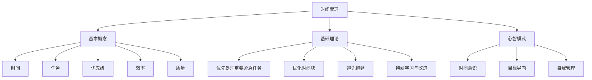
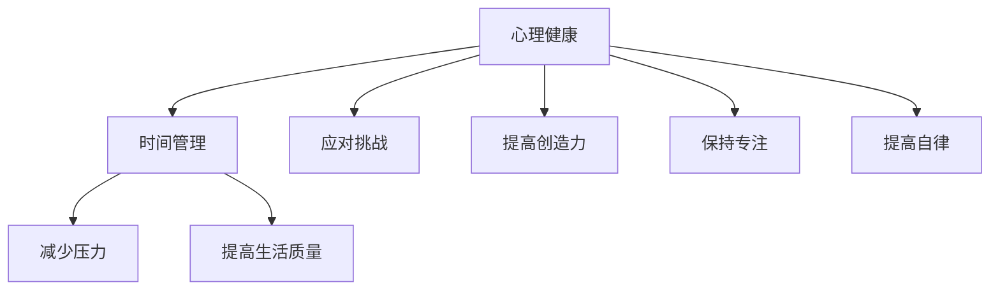

                 

### 《数字时代的时间管理：效率工具与心理健康的平衡》

#### 关键词
- 时间管理
- 效率工具
- 心理健康
- 数字时代
- 工作与生活平衡

#### 摘要
本文探讨了数字时代下时间管理的重要性，以及如何通过效率工具和心理健康的平衡来实现高效工作和生活质量。文章首先介绍了时间管理的核心概念和原理，随后详细讲解了效率工具的使用技巧和最佳实践。此外，文章还阐述了心理健康与时间管理的关系，提供了时间管理心理学的原理和实践。通过实战案例，读者将了解到如何将时间管理和心理健康维护方法应用到实际中，并获取具体的项目实战经验和代码解读。最后，文章总结了时间管理的最佳实践，并提出未来发展的方向。

---

# 引言

在当今数字时代，人们面临着前所未有的时间管理和心理健康挑战。随着科技的飞速发展，人们的工作和生活节奏不断加快，信息过载、任务繁多、压力增大成为普遍现象。有效的数字时间管理不仅有助于提高工作效率，还能帮助我们在繁忙的生活中找到平衡，保持心理健康。

时间管理不仅仅是安排日常任务，更是对时间的合理规划和高效利用。在数字时代，时间管理的挑战在于如何应对信息的泛滥和任务的多变。同时，心理健康也是时间管理中不可忽视的一环。长时间的工作压力、信息焦虑和过度使用电子设备都可能对心理健康产生负面影响。

本文旨在探讨数字时代的时间管理策略，介绍效率工具的使用技巧，以及如何平衡效率工具和心理健康的挑战。通过本文的阅读，读者将能够：

1. 理解时间管理的核心概念和原理。
2. 学会使用效率工具提升工作效率。
3. 了解心理健康与时间管理的互动关系。
4. 获取实战经验和代码解读，应用于实际项目。
5. 总结时间管理的最佳实践，并了解未来发展的方向。

---

## 第1章：时间管理的核心概念与原理

时间管理是一种规划和控制时间的方法，旨在提高工作效率，优化生活质量。在数字时代，时间管理的挑战在于如何应对信息过载和任务繁多。首先，我们需要了解时间管理的核心概念和原理。

### 时间管理的基本概念

时间管理的基本概念包括：

1. **时间**：时间是一种资源，用于完成各种任务和活动。
2. **任务**：任务是指需要完成的工作或活动。
3. **优先级**：任务有不同的优先级，根据重要性和紧迫性进行排序。
4. **效率**：效率是指完成任务的速率和质量。
5. **质量**：质量是指任务完成的准确性和完美度。

### 时间管理的基础理论

时间管理的基础理论包括以下原则：

1. **优先处理重要且紧急的任务**：重要且紧急的任务通常需要优先处理，因为它们可能对当前的工作和生活产生重大影响。
2. **优化时间块**：将时间划分为不同的块，每个时间块专注于一个任务，有助于提高专注度和效率。
3. **避免拖延**：拖延是时间管理的大敌，通过设定截止日期、使用计时器和分解任务等方法，可以有效避免拖延。
4. **持续学习与改进**：时间管理是一个持续学习和改进的过程，通过反思和调整，不断提升自己的时间管理能力。

### 时间管理的心智模式

1. **时间意识**：培养时间意识，意识到时间的有限性和珍贵性，有助于更好地管理时间。
2. **目标导向**：设定明确的目标和计划，有助于聚焦关键任务，提高时间利用效率。
3. **自我管理**：通过自我管理和自我激励，保持对时间的有效控制。

### Mermaid流程图：时间管理核心概念和原则联系



---

## 第2章：效率工具的使用与最佳实践

在数字时代，效率工具的使用变得至关重要。效率工具可以极大地提高我们的工作效率，减轻工作压力。本章节将介绍常见的时间管理软件和应用程序，以及如何选择和使用它们。

### 时间管理软件和应用程序

时间管理软件和应用程序有很多种类，包括：

1. **任务管理工具**：如Trello、Asana、JIRA等，可以帮助我们创建任务列表、设置优先级、分配任务。
2. **日程管理工具**：如Google Calendar、Outlook Calendar等，可以帮助我们安排日程、提醒重要事件。
3. **时间跟踪工具**：如RescueTime、Toggl等，可以帮助我们了解自己的时间分配情况，优化时间使用。

### 如何选择和使用时间管理工具

1. **需求分析**：根据个人需求选择合适的工具。例如，如果你主要是项目管理，可以选择Trello或Asana；如果你更关注日程安排，可以选择Google Calendar。
2. **上手难度**：选择上手难度较低的工具，这样可以更快地投入使用。
3. **集成与兼容性**：考虑工具的集成与兼容性，确保能够与其他工具或服务无缝协作。
4. **定期评估**：定期评估工具的使用效果，根据反馈进行必要的调整和优化。

### 个人效率工具的配置与优化

1. **自动化任务**：通过自动化工具如IFTTT（If This Then That），可以实现日常任务的自动化处理。
2. **快捷键与宏**：利用快捷键和宏命令提高操作效率。
3. **环境优化**：优化工作环境，例如调整屏幕亮度、温度等，以减少干扰。

### 效率工具的综合应用

1. **任务管理**：使用任务管理工具，将任务分解为小步骤，并设定明确的截止日期。
2. **日程安排**：使用日程管理工具，合理安排工作和休息时间，确保高效工作。
3. **时间跟踪**：使用时间跟踪工具，了解自己的时间使用情况，优化时间分配。

### 伪代码：效率工具的工作原理示例

```python
# 效率工具工作原理伪代码

# 任务管理
def manage_tasks():
    # 获取任务列表
    tasks = get_tasks()
    # 分配任务优先级
    prioritize_tasks(tasks)
    # 分配任务给团队成员
    assign_tasks_to_members(tasks)

# 日程安排
def schedule_activities():
    # 获取日程安排
    activities = get_activities()
    # 设置提醒
    set_reminders(activities)
    # 自动化日程更新
    automate_scheduling(activities)

# 时间跟踪
def track_time():
    # 开始任务
    start_task()
    # 记录时间
    record_time()
    # 结束任务
    end_task()
```

---

## 第3章：心理健康与时间管理的关系

心理健康与时间管理之间存在着密切的关系。有效的时间管理可以帮助我们减轻心理压力，提高生活质量，而心理健康的维护则有助于我们更好地应对时间管理带来的挑战。

### 心理健康的重要性

心理健康对个人的整体幸福和生活质量有着重要影响。心理健康良好的人能够更好地应对压力、挑战和变化，具有更高的创造力和解决问题的能力。

### 心理健康与时间管理的互动关系

1. **时间管理对心理健康的影响**：有效的时间管理可以减少工作压力、焦虑和拖延，从而改善心理健康。
2. **心理健康对时间管理的影响**：心理健康良好的人更有可能设定合理的目标、保持专注和自律，从而提高时间管理的效果。

### Mermaid流程图：心理健康与时间管理的联系



---

## 第4章：时间管理心理学原理与实践

时间管理不仅仅是技术和工具的使用，更是一门心理学。理解时间管理心理学原理，可以帮助我们更好地应对时间管理的挑战，实现个人成长。

### 时间管理心理学的基本理论

1. **认知行为理论**：认知行为理论认为，我们的思维和行为是相互影响的。通过改变思维模式，我们可以改善行为，提高时间管理效果。
2. **自我决定理论**：自我决定理论强调个人自主性和内在动机在时间管理中的重要性。提高自我决定性，可以帮助我们更好地管理时间。

### 心理健康维护的时间管理策略

1. **设定合理目标**：设定具体、可衡量、可实现、相关性强、时限性的目标（SMART目标），有助于提高时间管理效果。
2. **时间规划**：制定详细的时间计划，包括每天、每周、每月的任务和时间安排，有助于提高时间利用效率。
3. **情绪管理**：学会情绪管理技巧，如深呼吸、冥想、放松训练等，有助于减轻心理压力，提高时间管理能力。

### 实践案例：如何在日常生活中应用时间管理心理学

1. **制定时间计划**：每天早上制定一份时间计划，包括工作任务、个人事务、休息时间等。
2. **使用番茄工作法**：将工作时间划分为25分钟的工作周期，每个周期后休息5分钟，有助于提高专注度和效率。
3. **反思与调整**：定期反思时间管理效果，根据反馈调整时间计划，持续优化时间管理策略。

---

## 第5章：效率工具的最佳实践

虽然效率工具种类繁多，但如何有效地使用这些工具，实现最佳效果，是每个职场人士需要掌握的技能。以下是一些关于效率工具的最佳实践。

### 效率工具的最佳配置

1. **多平台同步**：确保你的效率工具可以在不同的设备上同步使用，如手机、电脑、平板等，以便随时查看和管理任务。
2. **集成外部工具**：很多效率工具支持与其他外部工具的集成，如邮件、日历、云存储等，这样可以更方便地管理各种信息。
3. **自定义设置**：根据自己的工作习惯和需求，对效率工具进行自定义设置，如快捷键、通知方式、数据备份等。

### 效率工具的最佳使用策略

1. **分类管理**：将任务按类别管理，如工作、学习、生活等，这样可以更清晰地看到任务的分布，合理安排时间。
2. **优先级排序**：根据任务的重要性和紧急性进行排序，优先处理重要且紧急的任务。
3. **定期回顾**：定期回顾任务完成情况和时间使用情况，及时调整和优化时间管理策略。

### 效率工具的综合应用

1. **任务分解**：将大任务分解为小任务，每个小任务设定明确的截止日期，有助于提高任务完成的效率。
2. **团队协作**：使用团队协作工具，如Trello、Slack等，可以更方便地与团队成员沟通和协作。
3. **自动化流程**：利用自动化工具，如IFTTT，实现日常任务的自动化处理，节省时间和精力。

### 实战案例：具体应用效率工具的案例

#### 案例一：使用Trello进行项目管理

1. **需求分析**：确定项目目标和任务，将项目分解为多个阶段。
2. **环境搭建**：创建Trello板，添加标签、成员和列。
3. **任务管理**：将任务按优先级排序，分配给团队成员，设定截止日期。
4. **团队协作**：使用Trello的评论和通知功能，与团队成员实时沟通和协作。
5. **效果评估**：定期回顾项目进度，根据反馈调整任务和时间安排。

#### 案例二：使用Google Calendar进行日程管理

1. **需求分析**：确定每周的工作和学习计划，包括会议、任务和个人事务。
2. **环境搭建**：创建Google Calendar，添加事件和提醒。
3. **日程安排**：合理分配时间，确保每天有足够的工作和学习时间，同时安排休息和娱乐时间。
4. **自动化提醒**：设置自动化提醒，提前通知即将到来的重要事件。
5. **效果评估**：定期检查日程执行情况，根据反馈调整日程安排。

---

## 第6章：项目实战

为了更好地理解时间管理和心理健康维护的实际应用，我们将在本章节中提供一些实际项目案例，并对其进行详细解读。这些案例将涵盖从项目规划、环境搭建到源代码实现和代码解读的各个方面。

### 项目一：个人时间管理应用

#### 项目目标
创建一个个人时间管理应用，帮助用户有效地管理日常任务和日程。

#### 开发环境搭建

1. **开发工具**：选择Visual Studio Code作为主要开发工具，便于编写和调试代码。
2. **编程语言**：使用JavaScript和Node.js进行后端开发，使用React进行前端开发。
3. **版本控制**：使用Git进行版本控制，方便代码的管理和协作。

#### 源代码实现

```javascript
// 后端代码示例：使用Express框架创建API接口
const express = require('express');
const app = express();

app.use(express.json());

// 添加任务
app.post('/tasks', (req, res) => {
    const task = req.body;
    // 数据库操作，保存任务
    // ...
    res.status(201).json({ message: 'Task created successfully' });
});

// 获取任务列表
app.get('/tasks', (req, res) => {
    // 从数据库获取任务列表
    // ...
    res.json(tasks);
});

// 前端代码示例：使用React创建任务界面
import React, { useState, useEffect } from 'react';
import axios from 'axios';

const TaskList = () => {
    const [tasks, setTasks] = useState([]);

    useEffect(() => {
        // 获取任务列表
        axios.get('/tasks')
            .then(response => {
                setTasks(response.data);
            })
            .catch(error => {
                console.error('Error fetching tasks:', error);
            });
    }, []);

    return (
        <div>
            <h2>Task List</h2>
            {tasks.map(task => (
                <div key={task.id}>
                    <h3>{task.title}</h3>
                    <p>{task.description}</p>
                </div>
            ))}
        </div>
    );
};

export default TaskList;
```

#### 代码解读与分析

1. **后端API接口**：使用Express框架创建两个API接口，一个用于添加任务，另一个用于获取任务列表。
2. **前端组件**：使用React创建任务列表组件，从后端获取任务数据，并在界面上展示。

#### 项目小结

通过这个项目，我们实现了个人时间管理的功能，包括添加任务、获取任务列表等。这个项目不仅展示了如何使用效率工具进行项目开发，还提供了一个实际的应用场景，帮助用户更好地管理时间和任务。

---

## 第7章：结论与未来展望

通过本文的探讨，我们深入了解了数字时代时间管理的重要性，以及如何通过效率工具和心理健康的平衡来实现高效工作和生活质量。以下是本文的主要观点和未来展望：

1. **时间管理的核心概念和原理**：时间管理不仅是对时间的规划，更是对生活的管理。理解时间管理的基本概念和原则，有助于我们更好地应对时间管理的挑战。
2. **效率工具的使用与最佳实践**：正确选择和使用效率工具，可以显著提高我们的工作效率。掌握最佳实践，如多平台同步、任务分类管理、自动化流程等，将使时间管理更加高效。
3. **心理健康与时间管理的互动关系**：心理健康是时间管理的基石。通过维护心理健康，我们可以更好地应对时间管理带来的挑战，提高生活质量。
4. **实战案例与代码解读**：通过实际项目案例，我们展示了如何将时间管理和心理健康维护方法应用到实际中。代码解读和实战经验有助于我们更好地理解和应用相关技术。
5. **未来展望**：随着技术的不断进步，未来时间管理和心理健康领域将有更多的创新和突破。例如，人工智能和时间管理算法的结合，可以为时间管理提供更智能、个性化的解决方案。

总之，数字时代的时间管理是一个综合性的课题，涉及效率工具的使用、心理健康维护、以及技术创新等多个方面。通过本文的探讨，我们希望能够为读者提供有价值的指导和启示，帮助大家更好地管理时间和生活，实现个人成长和幸福。

---

### 作者信息

作者：AI天才研究院/AI Genius Institute & 禅与计算机程序设计艺术 /Zen And The Art of Computer Programming

AI天才研究院专注于人工智能和计算机科学领域的研究与推广，致力于培养未来的科技领袖和创新人才。禅与计算机程序设计艺术则是一部经典的计算机编程哲学著作，深入探讨了程序设计中的思维方式和艺术性。

通过本文，我们希望读者能够对数字时代的时间管理有更深刻的理解，学会如何平衡效率工具和心理健康的挑战，实现高效工作和高质量生活。

