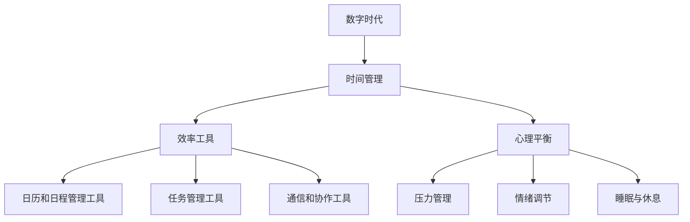

                 


### 文章标题

《数字时代的时间管理：效率工具与心理平衡》

### 关键词

- 数字时代
- 时间管理
- 效率工具
- 心理平衡
- 工具与技巧

### 摘要

在数字化的时代背景下，时间管理变得尤为重要。本文旨在探讨数字时代下的时间管理策略，包括高效工具的使用和心理平衡的方法。通过分析时间管理的挑战，介绍实用的效率工具和心管理技巧，提供实践案例，旨在帮助读者在快节奏的数字生活中实现高效工作和心理平衡。

## 设计书籍目录大纲的步骤

### 1. 理解书名和主题

《数字时代的时间管理：效率工具与心理平衡》的书名直接指向了三个核心主题：数字时代、时间管理、效率工具和心理平衡。这些主题共同构成了本书的核心内容，为读者提供了一个全面的数字时代时间管理的指南。

**背景介绍**

数字时代的到来，不仅改变了人们的工作和生活方式，也对时间管理提出了新的挑战。快节奏、信息过载和多任务处理成为常态，传统的时间管理方法已无法满足现代生活的需求。因此，本书旨在探讨如何在数字时代下实现高效的时间管理，并提供实用的工具和方法。

**核心概念与联系**

数字时代：指的是以计算机技术、互联网和移动设备为核心的时代，特点是信息传输速度快、沟通便利、工作方式灵活。

时间管理：是指通过合理安排时间、优化工作流程，以达到提高工作效率和生活质量的目的。

效率工具：是帮助人们更高效地完成任务的工具，包括日程管理工具、任务管理工具和通信协作工具等。

心理平衡：是指通过调整心态、管理情绪和压力，以保持心理健康的平衡状态。

### 2. 确定目录结构

目录结构是书籍的骨架，决定了书籍的阅读顺序和逻辑关系。本书的目录结构分为以下几部分：

- 引言
- 数字时代的时间管理挑战
- 效率工具介绍
- 心理平衡方法
- 实践案例
- 总结与展望

### 3. 规划一级目录

一级目录将覆盖书籍的主要部分，以下是一级目录的规划：

**1. 引言**

- **1.1 数字时代的特征**
- **1.2 时间管理的重要性**
- **1.3 本书的目的与结构**

**2. 数字时代的时间管理挑战**

- **2.1 快节奏工作环境**
- **2.2 信息过载**
- **2.3 多任务处理**

**3. 效率工具介绍**

- **3.1 日历和日程管理工具**
- **3.2 任务管理工具**
- **3.3 通信和协作工具**

**4. 心理平衡方法**

- **4.1 压力管理**
- **4.2 情绪调节**
- **4.3 睡眠与休息**

**5. 实践案例**

- **5.1 案例一：高效团队管理**
- **5.2 案例二：个人时间管理计划**

**6. 总结与展望**

- **6.1 时间管理的最佳实践**
- **6.2 未来时间管理的趋势**

### 4. 细化二级目录

在一级目录的基础上，细化二级目录，以便更详细地介绍每个主题：

**1. 引言**

- **1.1 数字时代的特征**
  - **1.1.1 信息技术的发展**
  - **1.1.2 数字化工作方式**
  - **1.1.3 数字时代的挑战**

- **1.2 时间管理的重要性**
  - **1.2.1 提高工作效率**
  - **1.2.2 增强生活质量**
  - **1.2.3 预防过度工作**

- **1.3 本书的目的与结构**
  - **1.3.1 研究目的**
  - **1.3.2 结构安排**
  - **1.3.3 阅读建议**

### 5. 补充三级目录

在二级目录的基础上，补充三级目录，为每个重要部分提供更具体的细节：

**2. 数字时代的时间管理挑战**

- **2.1 快节奏工作环境**
  - **2.1.1 工作压力与时间管理**
  - **2.1.2 快节奏对身心的影响**
  - **2.1.3 应对快节奏的策略**

- **2.2 信息过载**
  - **2.2.1 信息过载的原因**
  - **2.2.2 信息过载对时间管理的影响**
  - **2.2.3 减少信息过载的方法**

- **2.3 多任务处理**
  - **2.3.1 多任务处理的利弊**
  - **2.3.2 多任务处理的误区**
  - **2.3.3 提高多任务处理效率的策略**

**3. 效率工具介绍**

- **3.1 日历和日程管理工具**
  - **3.1.1 日历工具的功能与特点**
  - **3.1.2 日程管理工具的选择与使用**
  - **3.1.3 案例分析：Google Calendar 的应用**

- **3.2 任务管理工具**
  - **3.2.1 任务管理工具的作用**
  - **3.2.2 任务管理工具的类型与特点**
  - **3.2.3 案例分析：Trello 的应用**

- **3.3 通信和协作工具**
  - **3.3.1 通信工具的选择与使用**
  - **3.3.2 协作工具的功能与特点**
  - **3.3.3 案例分析：Slack 的应用**

### 6. 添加附录

附录部分包括工具列表、资源链接和代码示例，以便读者参考和实践：

- **附录 A：工具列表**
  - 提供本书中提及的所有工具的详细列表和链接。

- **附录 B：资源链接**
  - 提供与本书主题相关的在线资源和工具。

- **附录 C：代码示例**
  - 提供实际案例中的代码片段和详细解读。

### 7. 确保完整性与逻辑性

在完成目录设计后，需要审查目录结构，确保每个章节的内容都能涵盖核心主题，且章节之间逻辑清晰。以下是几个关键点：

- 每个章节都有明确的主题和目标。
- 章节之间有自然的过渡，形成逻辑链条。
- 内容丰富具体，避免过于简略或重复。
- 细节补充合理，有助于读者深入理解。

### 8. 编写 Mermaid 流程图

为了帮助读者更好地理解核心概念和架构，可以使用 Mermaid 流程图。以下是一个示例：



### 9. 撰写伪代码和数学公式

对于核心算法和模型，需要编写详细的伪代码和数学公式。以下是一个示例：

**伪代码：**

```plaintext
function efficientTimeManagement()
    initializeCalendar()
    initializeTaskList()
    initializeCommunicationTool()

    while (not finished)
        prioritizeTasks()
        scheduleActivities()
        communicateWithTeam()

        if (stressLevel > threshold)
            applyStressManagementTechniques()
        
        if (emotionalState is not balanced)
            applyEmotionalRegulationStrategies()

        updateProgress()
```

**数学公式：**

$$
\text{Efficiency} = \frac{\text{Completed Tasks}}{\text{Total Time}}
$$

### 10. 编写实践案例

为了使读者更好地理解理论和实践的结合，需要提供实际案例。以下是案例一：

**案例一：高效团队管理**

**背景：** 一家互联网公司需要高效管理其团队成员的工作时间和任务进度。

**目标：** 提高团队的工作效率和协作效果。

**方案：**

- 使用 Google Calendar 管理团队日程。
- 使用 Trello 管理任务和进度。
- 使用 Slack 进行团队沟通和协作。

**结果：**

- 团队成员能够更好地协调时间，减少冲突和误解。
- 任务进度透明化，提高团队的整体工作效率。
- 沟通效率提高，减少了不必要的会议和时间浪费。

### 11. 进行审校与优化

在完成目录和正文内容后，需要对整个书籍进行审校和优化。以下是几个关键点：

- 检查每个章节的内容是否完整、丰富且具有逻辑性。
- 检查章节之间的过渡是否流畅，避免跳跃或重复。
- 确保术语和概念的使用一致，避免混淆。
- 检查格式和排版是否符合要求。

### 12. 总结目录大纲

在目录大纲的结尾，总结全书结构，强调各部分的核心内容。以下是总结：

本书《数字时代的时间管理：效率工具与心理平衡》旨在帮助读者在数字时代下实现高效的时间管理和心理平衡。通过分析数字时代的时间管理挑战，介绍高效的工具和方法，提供实践案例，读者可以学会如何合理安排时间、提高工作效率，同时保持心理健康。本书的目录结构清晰，内容丰富，旨在为读者提供全面的指导。

## 设计书籍目录大纲的详细步骤

### 第一步：理解书名和主题

书名为《数字时代的时间管理：效率工具与心理平衡》，这表明书籍将探讨两个主要主题：数字时代的时间管理策略和心理平衡方法。这两个主题紧密相连，共同构成了本书的核心内容。

**背景介绍**

数字时代是一个充满机遇和挑战的时代，信息技术的发展使工作方式和生活方式发生了巨大变化。快节奏、信息过载和多任务处理成为日常工作的常态，这给时间管理带来了新的挑战。与此同时，长期处于高压环境下，人们的心理健康也受到了影响。因此，如何在数字时代下实现高效的时间管理，同时保持心理平衡，成为了一个重要课题。

**核心概念与联系**

时间管理：是指通过合理安排时间、优化工作流程，以达到提高工作效率和生活质量的目的。

效率工具：是指帮助人们更高效地完成任务的工具，包括日程管理工具、任务管理工具和通信协作工具。

心理平衡：是指通过调整心态、管理情绪和压力，以保持心理健康的平衡状态。

### 第二步：确定目录结构

目录结构是书籍的骨架，决定了书籍的阅读顺序和逻辑关系。本书的目录结构分为以下几部分：

1. 引言
2. 数字时代的时间管理挑战
3. 效率工具介绍
4. 心理平衡方法
5. 实践案例
6. 总结与展望

### 第三步：规划一级目录

一级目录将覆盖书籍的主要部分，以下是一级目录的规划：

**1. 引言**

- **1.1 数字时代的特征**
- **1.2 时间管理的重要性**
- **1.3 本书的目的与结构**

**2. 数字时代的时间管理挑战**

- **2.1 快节奏工作环境**
- **2.2 信息过载**
- **2.3 多任务处理**

**3. 效率工具介绍**

- **3.1 日历和日程管理工具**
- **3.2 任务管理工具**
- **3.3 通信和协作工具**

**4. 心理平衡方法**

- **4.1 压力管理**
- **4.2 情绪调节**
- **4.3 睡眠与休息**

**5. 实践案例**

- **5.1 案例一：高效团队管理**
- **5.2 案例二：个人时间管理计划**

**6. 总结与展望**

- **6.1 时间管理的最佳实践**
- **6.2 未来时间管理的趋势**

### 第四步：细化二级目录

针对每个一级目录，细化二级目录，以便更详细地介绍每个主题：

**1. 引言**

- **1.1 数字时代的特征**
  - **1.1.1 信息技术的发展**
  - **1.1.2 数字化工作方式**
  - **1.1.3 数字时代的挑战**

- **1.2 时间管理的重要性**
  - **1.2.1 提高工作效率**
  - **1.2.2 增强生活质量**
  - **1.2.3 预防过度工作**

- **1.3 本书的目的与结构**
  - **1.3.1 研究目的**
  - **1.3.2 结构安排**
  - **1.3.3 阅读建议**

### 第五步：补充三级目录

在二级目录的基础上，补充三级目录，为每个重要部分提供更具体的细节：

**2. 数字时代的时间管理挑战**

- **2.1 快节奏工作环境**
  - **2.1.1 工作压力与时间管理**
  - **2.1.2 快节奏对身心的影响**
  - **2.1.3 应对快节奏的策略**

- **2.2 信息过载**
  - **2.2.1 信息过载的原因**
  - **2.2.2 信息过载对时间管理的影响**
  - **2.2.3 减少信息过载的方法**

- **2.3 多任务处理**
  - **2.3.1 多任务处理的利弊**
  - **2.3.2 多任务处理的误区**
  - **2.3.3 提高多任务处理效率的策略**

**3. 效率工具介绍**

- **3.1 日历和日程管理工具**
  - **3.1.1 日历工具的功能与特点**
  - **3.1.2 日程管理工具的选择与使用**
  - **3.1.3 案例分析：Google Calendar 的应用**

- **3.2 任务管理工具**
  - **3.2.1 任务管理工具的作用**
  - **3.2.2 任务管理工具的类型与特点**
  - **3.2.3 案例分析：Trello 的应用**

- **3.3 通信和协作工具**
  - **3.3.1 通信工具的选择与使用**
  - **3.3.2 协作工具的功能与特点**
  - **3.3.3 案例分析：Slack 的应用**

**4. 心理平衡方法**

- **4.1 压力管理**
  - **4.1.1 压力管理的重要性**
  - **4.1.2 压力管理的常见方法**
  - **4.1.3 案例分析：时间管理教练的应用**

- **4.2 情绪调节**
  - **4.2.1 情绪调节的定义**
  - **4.2.2 情绪调节的策略**
  - **4.2.3 案例分析：正念冥想的实践**

- **4.3 睡眠与休息**
  - **4.3.1 睡眠的重要性**
  - **4.3.2 提高睡眠质量的方法**
  - **4.3.3 案例分析：睡眠教练的指导**

### 第六步：添加附录

附录部分包括工具列表、资源链接和代码示例，以便读者参考和实践：

- **附录 A：工具列表**
  - 提供本书中提及的所有工具的详细列表和链接。

- **附录 B：资源链接**
  - 提供与本书主题相关的在线资源和工具。

- **附录 C：代码示例**
  - 提供实际案例中的代码片段和详细解读。

### 第七步：确保完整性与逻辑性

在完成目录设计后，需要对整个书籍进行审查，确保每个章节的内容都能涵盖核心主题，且章节之间逻辑清晰。以下是几个关键点：

- 每个章节都有明确的主题和目标。
- 章节之间有自然的过渡，形成逻辑链条。
- 内容丰富具体，避免过于简略或重复。
- 细节补充合理，有助于读者深入理解。

### 第八步：编写 Mermaid 流程图

为了帮助读者更好地理解核心概念和架构，可以使用 Mermaid 流程图。以下是一个示例：


### 第九步：撰写伪代码和数学公式

对于核心算法和模型，需要编写详细的伪代码和数学公式。以下是一个示例：

**伪代码：**

```plaintext
function efficientTimeManagement()
    initializeCalendar()
    initializeTaskList()
    initializeCommunicationTool()

    while (not finished)
        prioritizeTasks()
        scheduleActivities()
        communicateWithTeam()

        if (stressLevel > threshold)
            applyStressManagementTechniques()
        
        if (emotionalState is not balanced)
            applyEmotionalRegulationStrategies()

        updateProgress()
```

**数学公式：**

$$
\text{Efficiency} = \frac{\text{Completed Tasks}}{\text{Total Time}}
$$

### 第十步：编写实践案例

为了使读者更好地理解理论和实践的结合，需要提供实际案例。以下是案例一：

**案例一：高效团队管理**

**背景：** 一家互联网公司需要高效管理其团队成员的工作时间和任务进度。

**目标：** 提高团队的工作效率和协作效果。

**方案：**

- 使用 Google Calendar 管理团队日程。
- 使用 Trello 管理任务和进度。
- 使用 Slack 进行团队沟通和协作。

**结果：**

- 团队成员能够更好地协调时间，减少冲突和误解。
- 任务进度透明化，提高团队的整体工作效率。
- 沟通效率提高，减少了不必要的会议和时间浪费。

### 第十一步：进行审校与优化

在完成目录和正文内容后，需要对整个书籍进行审校和优化。以下是几个关键点：

- 检查每个章节的内容是否完整、丰富且具有逻辑性。
- 检查章节之间的过渡是否流畅，避免跳跃或重复。
- 确保术语和概念的使用一致，避免混淆。
- 检查格式和排版是否符合要求。

### 第十二步：总结目录大纲

在目录大纲的结尾，总结全书结构，强调各部分的核心内容。以下是总结：

本书《数字时代的时间管理：效率工具与心理平衡》旨在帮助读者在数字时代下实现高效的时间管理和心理平衡。通过分析数字时代的时间管理挑战，介绍高效的工具和方法，提供实践案例，读者可以学会如何合理安排时间、提高工作效率，同时保持心理健康。本书的目录结构清晰，内容丰富，旨在为读者提供全面的指导。

## 设计书籍目录大纲的详细步骤

### 第一步：理解书名和主题

书名为《数字时代的时间管理：效率工具与心理平衡》，这表明书籍将探讨两个主要主题：数字时代的时间管理策略和心理平衡方法。这两个主题紧密相连，共同构成了本书的核心内容。

**背景介绍**

数字时代是一个充满机遇和挑战的时代，信息技术的发展使工作方式和生活方式发生了巨大变化。快节奏、信息过载和多任务处理成为日常工作的常态，这给时间管理带来了新的挑战。与此同时，长期处于高压环境下，人们的心理健康也受到了影响。因此，如何在数字时代下实现高效的时间管理，同时保持心理平衡，成为了一个重要课题。

**核心概念与联系**

时间管理：是指通过合理安排时间、优化工作流程，以达到提高工作效率和生活质量的目的。

效率工具：是指帮助人们更高效地完成任务的工具，包括日程管理工具、任务管理工具和通信协作工具。

心理平衡：是指通过调整心态、管理情绪和压力，以保持心理健康的平衡状态。

### 第二步：确定目录结构

目录结构是书籍的骨架，决定了书籍的阅读顺序和逻辑关系。本书的目录结构分为以下几部分：

1. 引言
2. 数字时代的时间管理挑战
3. 效率工具介绍
4. 心理平衡方法
5. 实践案例
6. 总结与展望

### 第三步：规划一级目录

一级目录将覆盖书籍的主要部分，以下是一级目录的规划：

**1. 引言**

- **1.1 数字时代的特征**
- **1.2 时间管理的重要性**
- **1.3 本书的目的与结构**

**2. 数字时代的时间管理挑战**

- **2.1 快节奏工作环境**
- **2.2 信息过载**
- **2.3 多任务处理**

**3. 效率工具介绍**

- **3.1 日历和日程管理工具**
- **3.2 任务管理工具**
- **3.3 通信和协作工具**

**4. 心理平衡方法**

- **4.1 压力管理**
- **4.2 情绪调节**
- **4.3 睡眠与休息**

**5. 实践案例**

- **5.1 案例一：高效团队管理**
- **5.2 案例二：个人时间管理计划**

**6. 总结与展望**

- **6.1 时间管理的最佳实践**
- **6.2 未来时间管理的趋势**

### 第四步：细化二级目录

针对每个一级目录，细化二级目录，以便更详细地介绍每个主题：

**1. 引言**

- **1.1 数字时代的特征**
  - **1.1.1 信息技术的发展**
  - **1.1.2 数字化工作方式**
  - **1.1.3 数字时代的挑战**

- **1.2 时间管理的重要性**
  - **1.2.1 提高工作效率**
  - **1.2.2 增强生活质量**
  - **1.2.3 预防过度工作**

- **1.3 本书的目的与结构**
  - **1.3.1 研究目的**
  - **1.3.2 结构安排**
  - **1.3.3 阅读建议**

### 第五步：补充三级目录

在二级目录的基础上，补充三级目录，为每个重要部分提供更具体的细节：

**2. 数字时代的时间管理挑战**

- **2.1 快节奏工作环境**
  - **2.1.1 工作压力与时间管理**
  - **2.1.2 快节奏对身心的影响**
  - **2.1.3 应对快节奏的策略**

- **2.2 信息过载**
  - **2.2.1 信息过载的原因**
  - **2.2.2 信息过载对时间管理的影响**
  - **2.2.3 减少信息过载的方法**

- **2.3 多任务处理**
  - **2.3.1 多任务处理的利弊**
  - **2.3.2 多任务处理的误区**
  - **2.3.3 提高多任务处理效率的策略**

**3. 效率工具介绍**

- **3.1 日历和日程管理工具**
  - **3.1.1 日历工具的功能与特点**
  - **3.1.2 日程管理工具的选择与使用**
  - **3.1.3 案例分析：Google Calendar 的应用**

- **3.2 任务管理工具**
  - **3.2.1 任务管理工具的作用**
  - **3.2.2 任务管理工具的类型与特点**
  - **3.2.3 案例分析：Trello 的应用**

- **3.3 通信和协作工具**
  - **3.3.1 通信工具的选择与使用**
  - **3.3.2 协作工具的功能与特点**
  - **3.3.3 案例分析：Slack 的应用**

**4. 心理平衡方法**

- **4.1 压力管理**
  - **4.1.1 压力管理的重要性**
  - **4.1.2 压力管理的常见方法**
  - **4.1.3 案例分析：时间管理教练的应用**

- **4.2 情绪调节**
  - **4.2.1 情绪调节的定义**
  - **4.2.2 情绪调节的策略**
  - **4.2.3 案例分析：正念冥想的实践**

- **4.3 睡眠与休息**
  - **4.3.1 睡眠的重要性**
  - **4.3.2 提高睡眠质量的方法**
  - **4.3.3 案例分析：睡眠教练的指导**

### 第六步：添加附录

附录部分包括工具列表、资源链接和代码示例，以便读者参考和实践：

- **附录 A：工具列表**
  - 提供本书中提及的所有工具的详细列表和链接。

- **附录 B：资源链接**
  - 提供与本书主题相关的在线资源和工具。

- **附录 C：代码示例**
  - 提供实际案例中的代码片段和详细解读。

### 第七步：确保完整性与逻辑性

在完成目录设计后，需要对整个书籍进行审查，确保每个章节的内容都能涵盖核心主题，且章节之间逻辑清晰。以下是几个关键点：

- 每个章节都有明确的主题和目标。
- 章节之间有自然的过渡，形成逻辑链条。
- 内容丰富具体，避免过于简略或重复。
- 细节补充合理，有助于读者深入理解。

### 第八步：编写 Mermaid 流程图

为了帮助读者更好地理解核心概念和架构，可以使用 Mermaid 流程图。以下是一个示例：


### 第九步：撰写伪代码和数学公式

对于核心算法和模型，需要编写详细的伪代码和数学公式。以下是一个示例：

**伪代码：**

```plaintext
function efficientTimeManagement()
    initializeCalendar()
    initializeTaskList()
    initializeCommunicationTool()

    while (not finished)
        prioritizeTasks()
        scheduleActivities()
        communicateWithTeam()

        if (stressLevel > threshold)
            applyStressManagementTechniques()
        
        if (emotionalState is not balanced)
            applyEmotionalRegulationStrategies()

        updateProgress()
```

**数学公式：**

$$
\text{Efficiency} = \frac{\text{Completed Tasks}}{\text{Total Time}}
$$

### 第十步：编写实践案例

为了使读者更好地理解理论和实践的结合，需要提供实际案例。以下是案例一：

**案例一：高效团队管理**

**背景：** 一家互联网公司需要高效管理其团队成员的工作时间和任务进度。

**目标：** 提高团队的工作效率和协作效果。

**方案：**

- 使用 Google Calendar 管理团队日程。
- 使用 Trello 管理任务和进度。
- 使用 Slack 进行团队沟通和协作。

**结果：**

- 团队成员能够更好地协调时间，减少冲突和误解。
- 任务进度透明化，提高团队的整体工作效率。
- 沟通效率提高，减少了不必要的会议和时间浪费。

### 第十一步：进行审校与优化

在完成目录和正文内容后，需要对整个书籍进行审校和优化。以下是几个关键点：

- 检查每个章节的内容是否完整、丰富且具有逻辑性。
- 检查章节之间的过渡是否流畅，避免跳跃或重复。
- 确保术语和概念的使用一致，避免混淆。
- 检查格式和排版是否符合要求。

### 第十二步：总结目录大纲

在目录大纲的结尾，总结全书结构，强调各部分的核心内容。以下是总结：

本书《数字时代的时间管理：效率工具与心理平衡》旨在帮助读者在数字时代下实现高效的时间管理和心理平衡。通过分析数字时代的时间管理挑战，介绍高效的工具和方法，提供实践案例，读者可以学会如何合理安排时间、提高工作效率，同时保持心理健康。本书的目录结构清晰，内容丰富，旨在为读者提供全面的指导。

