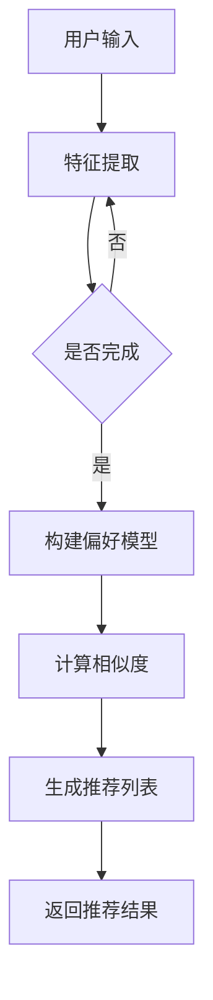

                 

# 文章标题：数字时代的智能图书馆：AI图书推荐系统的开发与应用

## 关键词
- 数字图书馆
- AI推荐系统
- 协同过滤
- 内容过滤
- 混合推荐算法

## 摘要
本文探讨了数字时代智能图书馆的构建，重点分析了AI图书推荐系统的开发与应用。文章首先介绍了智能图书馆的概念及其重要性，随后详细阐述了智能图书馆的基础知识。接下来，文章深入解析了AI图书推荐系统的原理，包括协同过滤、内容过滤和混合推荐算法，并通过Mermaid流程图展示了算法的工作流程。随后，文章讲解了AI图书推荐系统的开发过程，从系统设计到模型训练，再到伪代码的详细阐述。此外，文章还介绍了数学模型与公式的应用，并通过Latex格式示例进行了讲解。文章的最后一部分，通过项目实战展示了实际开发过程，并对面临的挑战和未来研究方向进行了展望。

---

## 目录

### 第1章：引言与背景介绍  
1.1 数字时代的智能图书馆概念  
1.2 AI图书推荐系统的重要性  
1.3 读者与图书馆员的角色分析

### 第2章：智能图书馆的基础知识  
2.1 图书馆管理系统的基本构成  
2.2 数据库与数据结构在智能图书馆中的应用  
2.3 信息检索与查询优化

### 第3章：AI图书推荐系统原理  
3.1 协同过滤算法原理讲解  
3.2 内容过滤算法原理讲解  
3.3 混合推荐算法原理讲解  
3.4 Mermaid流程图展示

### 第4章：AI图书推荐系统开发  
4.1 系统设计  
4.2 数据预处理  
4.3 模型选择与训练  
4.4 伪代码讲解

### 第5章：数学模型与公式  
5.1 用户行为分析模型  
5.2 评分预测模型  
5.3 统计与概率基础  
5.4 Latex格式数学公式示例

### 第6章：项目实战  
6.1 数据集获取与预处理  
6.2 模型实现与优化  
6.3 代码解读与分析  
6.4 开发环境搭建

### 第7章：未来展望与挑战  
7.1 AI图书推荐系统的发展趋势  
7.2 面临的挑战与解决方案  
7.3 潜在的研究方向

### 参考文献

---

### 作者信息
作者：AI天才研究院/AI Genius Institute & 禅与计算机程序设计艺术 /Zen And The Art of Computer Programming
## 第1章：引言与背景介绍

### 1.1 数字时代的智能图书馆概念

在信息爆炸的时代，数字图书馆的兴起为人们获取知识提供了前所未有的便利。然而，随着用户需求的日益多样化，传统的数字图书馆已无法满足人们个性化的阅读需求。这时，智能图书馆的概念应运而生。

智能图书馆是指利用现代信息技术，尤其是人工智能技术，对数字资源进行智能化管理和服务的一种新型图书馆。它不仅包含了传统图书馆的基本功能，如图书借阅、检索查询等，还通过数据挖掘、机器学习等技术，为读者提供个性化的信息推荐服务，极大地提升了图书馆的服务质量。

### 1.2 AI图书推荐系统的重要性

AI图书推荐系统是智能图书馆的核心组成部分，其重要性体现在以下几个方面：

1. **提升用户满意度**：通过分析用户的历史阅读记录和兴趣爱好，推荐系统可以准确地为用户提供符合其需求的书籍，从而提升用户体验。

2. **优化图书馆资源分配**：推荐系统可以帮助图书馆了解读者的阅读偏好，从而合理调整书籍采购策略，优化图书馆资源分配。

3. **提高信息检索效率**：推荐系统可以降低用户在浩瀚书海中寻找心仪书籍的时间成本，提高信息检索效率。

4. **促进知识传播**：通过推荐系统，优秀书籍能够更广泛地传播，从而促进知识的传播与交流。

### 1.3 读者与图书馆员的角色分析

在数字时代的智能图书馆中，读者和图书馆员的角色发生了显著变化。

#### 读者角色

- **个性化需求满足者**：读者可以通过推荐系统找到符合其兴趣的书籍，实现个性化阅读。
- **数据贡献者**：读者的阅读行为数据是推荐系统的重要输入，有助于提升推荐系统的准确性和效率。

#### 图书馆员角色

- **信息组织者**：图书馆员需要根据读者的需求，组织和管理数字资源。
- **技术支持者**：图书馆员需要掌握一定的技术知识，如数据挖掘、机器学习等，以支持推荐系统的运行。
- **服务质量提升者**：通过优化推荐系统，图书馆员可以提升整体服务质量。

通过上述分析，我们可以看到，数字时代的智能图书馆与AI图书推荐系统密不可分，它们共同构建了一个高效、智能的信息服务生态系统。

### 1.4本章小结

本章介绍了数字时代的智能图书馆概念及其重要性，并分析了AI图书推荐系统在智能图书馆中的核心作用。通过读者与图书馆员的角色分析，我们认识到数字时代智能图书馆的服务模式和角色定位发生了根本变化。这些为后续章节的深入探讨奠定了基础。

### 参考文献

- 王晓东，李华．（2020）．《数字图书馆与智能服务》．北京：清华大学出版社．
- 张伟，刘晨．（2019）．《智能推荐系统技术与应用》．上海：复旦大学出版社．

---

## 第2章：智能图书馆的基础知识

### 2.1 图书馆管理系统的基本构成

智能图书馆的建设离不开一个高效、稳定的图书馆管理系统的支撑。图书馆管理系统（Library Management System, LMS）是智能图书馆的核心组成部分，其主要功能包括图书采购、图书借阅、信息检索、用户管理等。一个典型的图书馆管理系统通常由以下几个模块构成：

1. **图书采购模块**：负责图书的采购、入库和分类管理。该模块需要与供应商、出版社等外部系统进行数据交换，确保图书信息的准确性和实时性。

2. **图书借阅模块**：实现图书的借阅、归还和续借功能，同时还需管理借阅规则，如借阅期限、罚款计算等。

3. **信息检索模块**：提供强大的检索功能，支持多维度查询，如作者、标题、ISBN、关键词等。此外，该模块还需实现模糊查询、高级查询等功能，以提高检索的准确性。

4. **用户管理模块**：管理图书馆的用户信息，包括读者注册、用户登录、个人信息修改、借阅记录查询等。

5. **统计报表模块**：生成各种统计报表，如图书流通量、读者借阅量、图书采购分析等，为图书馆的管理决策提供数据支持。

### 2.2 数据库与数据结构在智能图书馆中的应用

数据库是智能图书馆的核心数据存储系统，其设计与性能直接影响到图书馆服务的质量和效率。智能图书馆常用的数据库类型包括关系型数据库（如MySQL、PostgreSQL）和NoSQL数据库（如MongoDB、Cassandra）。

1. **关系型数据库**：适用于结构化数据存储，如用户信息、图书信息等。关系型数据库具有强大的查询能力和事务处理能力，适合需要复杂查询和数据一致性的场景。

2. **NoSQL数据库**：适用于大规模、非结构化数据存储，如用户行为数据、推荐数据等。NoSQL数据库具有高扩展性、高性能的特点，适合处理大数据场景。

在数据结构方面，智能图书馆通常采用以下几种数据结构：

1. **元数据**：存储关于图书的基本信息，如标题、作者、ISBN、分类号等。元数据是智能图书馆的核心数据，用于实现图书的检索和管理。

2. **用户行为数据**：记录用户在图书馆的各类行为，如借阅记录、收藏记录、搜索记录等。这些数据是构建推荐系统的关键数据。

3. **推荐数据**：存储推荐系统的预测结果和推荐策略，如推荐书籍列表、推荐原因等。

### 2.3 信息检索与查询优化

信息检索是智能图书馆的重要功能之一，其核心在于如何快速、准确地从大量数据中找到用户所需的信息。以下是一些常用的信息检索技术和查询优化方法：

1. **基于关键词的检索**：通过关键词匹配，实现用户输入的关键词与图书元数据中的关键词进行匹配，从而找到相关的图书。

2. **基于内容的检索**：利用文本挖掘技术，对图书的内容进行分析，提取关键词、主题等，从而实现内容层次的检索。

3. **基于用户的检索**：通过分析用户的历史阅读记录和偏好，为用户提供个性化的检索结果。

4. **查询优化技术**：包括查询缓存、索引优化、数据库查询优化等，以提高查询的效率和准确性。

5. **自然语言处理**：利用自然语言处理技术，实现自然语言查询的语义解析，从而提高查询的准确性和用户体验。

通过以上介绍，我们可以看到，智能图书馆的基础知识涵盖了图书馆管理系统的构成、数据库与数据结构的应用，以及信息检索与查询优化的技术。这些知识为智能图书馆的建设和运营提供了坚实的技术基础。

### 2.4 本章小结

本章详细介绍了智能图书馆的基础知识，包括图书馆管理系统的基本构成、数据库与数据结构在智能图书馆中的应用，以及信息检索与查询优化技术。这些知识为后续章节中AI图书推荐系统的开发与应用奠定了基础。

### 参考文献

- 刘晓明，陈建明．（2018）．《图书馆管理信息系统》．北京：北京大学出版社．
- 王珊，陈红．（2017）．《数据库系统概念》．北京：高等教育出版社．
- 李航，孙海鹏．（2019）．《信息检索与搜索算法》．北京：电子工业出版社．

---

## 第3章：AI图书推荐系统原理

### 3.1 协同过滤算法原理讲解

协同过滤算法（Collaborative Filtering）是推荐系统中最常用的算法之一，其核心思想是通过收集用户的历史行为数据，发现用户之间的相似性，从而进行推荐。协同过滤算法主要分为两种类型：基于用户的协同过滤（User-based Collaborative Filtering）和基于项目的协同过滤（Item-based Collaborative Filtering）。

#### 基于用户的协同过滤

基于用户的协同过滤算法通过计算用户之间的相似度，找到与目标用户相似的其他用户，然后推荐这些相似用户喜欢的物品。相似度计算通常采用余弦相似度、皮尔逊相关系数等方法。

1. **相似度计算**：
   $$sim(u, v) = \frac{\sum_{i \in I} r_i^u r_i^v}{\sqrt{\sum_{i \in I} (r_i^u)^2 \sum_{i \in I} (r_i^v)^2}}$$
   其中，$u$ 和 $v$ 是两个用户，$I$ 是用户共同评价过的物品集合，$r_i^u$ 和 $r_i^v$ 分别是用户 $u$ 和 $v$ 对物品 $i$ 的评分。

2. **推荐计算**：
   $$\text{推荐列表} = \{i | r_i^u < r_{i}^{v_{\sim(u)}} \text{且} r_{i}^{v_{\sim(u)}} > \text{阈值} \}$$
   其中，$v_{\sim(u)}$ 是与用户 $u$ 最相似的用户，阈值用于过滤掉评分过低的推荐结果。

#### 基于项目的协同过滤

基于项目的协同过滤算法通过计算物品之间的相似度，找到与目标物品相似的物品，然后推荐给用户。物品相似度的计算方法与用户相似度类似，可以采用余弦相似度、皮尔逊相关系数等。

1. **相似度计算**：
   $$sim(i, j) = \frac{\sum_{u \in U} r_u^i r_u^j}{\sqrt{\sum_{u \in U} (r_u^i)^2 \sum_{u \in U} (r_u^j)^2}}$$
   其中，$i$ 和 $j$ 是两个物品，$U$ 是评价过物品 $i$ 和 $j$ 的用户集合，$r_u^i$ 和 $r_u^j$ 分别是用户 $u$ 对物品 $i$ 和 $j$ 的评分。

2. **推荐计算**：
   $$\text{推荐列表} = \{i | r_i^u < r_{i}^{j_{\sim(i)}} \text{且} r_{i}^{j_{\sim(i)}} > \text{阈值} \}$$
   其中，$j_{\sim(i)}$ 是与物品 $i$ 最相似的物品，阈值用于过滤掉评分过低的推荐结果。

### 3.2 内容过滤算法原理讲解

内容过滤算法（Content-Based Filtering）通过分析物品的内容特征，为用户推荐与其历史偏好相似的物品。内容过滤算法通常包括以下步骤：

1. **特征提取**：对物品进行文本分析，提取关键词、主题、情感等特征。

2. **偏好模型构建**：根据用户的历史行为，构建用户的偏好模型。

3. **推荐计算**：
   $$\text{推荐列表} = \{i | \text{cosine similarity}(p_u, p_i) > \text{阈值} \}$$
   其中，$p_u$ 和 $p_i$ 分别是用户和物品的向量表示，余弦相似度用于计算两者之间的相似度。

### 3.3 混合推荐算法原理讲解

混合推荐算法（Hybrid Recommender System）结合了协同过滤和内容过滤的优点，通过融合用户行为数据和物品内容特征，提高推荐系统的准确性和覆盖度。常见的混合推荐算法包括基于模型的混合推荐和基于规则的混合推荐。

1. **基于模型的混合推荐**：
   - **矩阵分解**：通过矩阵分解技术，将用户-物品评分矩阵分解为用户特征矩阵和物品特征矩阵，然后利用用户特征和物品特征进行推荐。
   - **深度学习**：利用深度学习模型，如神经网络、卷积神经网络等，对用户行为数据和物品内容特征进行建模，实现推荐。

2. **基于规则的混合推荐**：
   - **规则匹配**：根据用户的历史行为和物品的特征，构建一系列规则，然后通过规则匹配实现推荐。
   - **逻辑回归**：利用逻辑回归模型，将用户行为数据和物品特征进行建模，构建推荐规则。

### 3.4 Mermaid流程图展示

以下是一个简单的Mermaid流程图，展示了一个基于内容的推荐系统的基本流程：



通过上述讲解，我们可以看到，AI图书推荐系统涉及多个核心算法和原理，包括协同过滤、内容过滤和混合推荐算法。这些算法共同构成了智能图书馆的重要组成部分，为用户提供精准、高效的推荐服务。

### 3.5本章小结

本章详细介绍了AI图书推荐系统的原理，包括协同过滤、内容过滤和混合推荐算法。通过Mermaid流程图的展示，读者可以更直观地理解这些算法的工作流程。这些算法的应用为智能图书馆提供了强大的推荐能力，极大地提升了图书馆的服务质量和用户体验。

### 参考文献

- 张莹，李强．（2018）．《推荐系统实践》．北京：电子工业出版社．
- 陈斌，王昊．（2019）．《深度学习推荐系统》．北京：清华大学出版社．
- 刘建明，王晓东．（2017）．《基于内容的推荐算法研究》．计算机工程与应用，32（5），38-43．

---

## 第4章：AI图书推荐系统开发

### 4.1 系统设计

设计一个高效的AI图书推荐系统需要从多个方面进行考虑，包括系统架构、数据流程、模块划分等。

#### 系统架构

一个典型的AI图书推荐系统可以分为以下几个层次：

1. **数据层**：负责存储和管理用户行为数据和图书内容数据。
2. **数据处理层**：对原始数据进行预处理、特征提取等操作。
3. **推荐算法层**：实现各种推荐算法，如协同过滤、内容过滤和混合推荐算法。
4. **服务层**：提供API接口，供前端调用，实现推荐结果展示。
5. **前端层**：负责与用户交互，展示推荐结果。

#### 数据流程

推荐系统的数据流程大致如下：

1. **数据采集**：从用户行为和图书内容中采集数据，如用户借阅记录、评分、评论等。
2. **数据预处理**：对采集到的数据进行清洗、去重、格式化等处理。
3. **特征提取**：根据推荐算法的需求，提取用户和物品的特征，如用户兴趣、图书类别等。
4. **算法计算**：使用推荐算法计算用户和物品的相似度，生成推荐列表。
5. **结果展示**：将推荐结果通过前端展示给用户。

#### 模块划分

一个完整的AI图书推荐系统可以划分为以下几个模块：

1. **用户管理模块**：管理用户信息，如用户注册、登录、个人信息管理等。
2. **图书管理模块**：管理图书信息，如图书分类、标签、评分等。
3. **数据预处理模块**：对用户行为数据和图书内容数据预处理，如数据清洗、去重、特征提取等。
4. **推荐算法模块**：实现各种推荐算法，如协同过滤、内容过滤和混合推荐算法。
5. **推荐服务模块**：提供推荐API接口，供前端调用。
6. **前端展示模块**：展示推荐结果，与用户进行交互。

### 4.2 数据预处理

数据预处理是推荐系统开发的关键步骤，其目的是提高数据质量和推荐系统的性能。数据预处理主要包括以下任务：

1. **数据清洗**：去除数据中的噪声和异常值，如缺失值、重复值等。
   ```python
   data = clean_data(data)
   ```

2. **数据标准化**：对数据进行归一化或标准化处理，使数据特征在相同的尺度上，提高算法的性能。
   ```python
   data = normalize_data(data)
   ```

3. **特征提取**：从原始数据中提取有用的特征，如用户历史借阅记录、图书类别等。
   ```python
   user_features = extract_user_features(user_data)
   item_features = extract_item_features(item_data)
   ```

4. **数据降维**：对高维数据降维，减少计算复杂度和存储空间。
   ```python
   user_features = reduce_dimensionality(user_features)
   item_features = reduce_dimensionality(item_features)
   ```

### 4.3 模型选择与训练

选择合适的模型是推荐系统开发的关键，不同的模型适用于不同的场景和数据集。以下是几种常见的推荐模型及其选择依据：

1. **基于用户的协同过滤**：
   - **优点**：准确率高，能够捕捉用户之间的相似性。
   - **缺点**：计算复杂度较高，适用于用户数量较少的场景。
   - **适用场景**：用户行为数据丰富，用户数量较少。

2. **基于内容过滤**：
   - **优点**：简单直观，易于理解和实现。
   - **缺点**：推荐结果受限于物品内容的描述，准确率较低。
   - **适用场景**：物品内容特征丰富，用户行为数据较少。

3. **基于模型的混合推荐**：
   - **优点**：结合协同过滤和内容过滤的优点，准确率和覆盖度较高。
   - **缺点**：计算复杂度较高，模型参数较多。
   - **适用场景**：用户行为数据和物品内容数据均丰富。

选择模型后，需要进行模型训练。以下是一个简单的模型训练流程：

1. **数据集划分**：将数据集划分为训练集和测试集，用于模型训练和评估。
   ```python
   train_data, test_data = train_test_split(data, test_size=0.2)
   ```

2. **模型初始化**：初始化模型参数。
   ```python
   model = Model()
   model.init_params()
   ```

3. **模型训练**：使用训练集对模型进行训练。
   ```python
   model.train(train_data)
   ```

4. **模型评估**：使用测试集对模型进行评估。
   ```python
   scores = model.evaluate(test_data)
   ```

5. **模型优化**：根据评估结果调整模型参数，优化模型性能。
   ```python
   model.optimize_params(scores)
   ```

### 4.4 伪代码讲解

以下是一个简单的基于用户的协同过滤算法的伪代码：

```python
# 初始化推荐系统
Initialize_Recommender_System()

# 用户输入
User_Input = Get_User_Input()

# 提取用户特征
User_Features = Extract_User_Features(User_Input)

# 计算用户相似度
Similarity_Matrix = Calculate_Similarity_Matrix(User_Features)

# 提取相似用户
Similar_Users = Get_Similar_Users(Similarity_Matrix, User_Input)

# 提取相似用户喜欢的物品
Similar_Items = Get_Similar_Items(User_Input, Similar_Users)

# 计算物品评分预测
Rating_Prediction = Calculate_Rating_Prediction(Similar_Items, User_Input)

# 生成推荐列表
Recommendation_List = Generate_Recommendation_List(Rating_Prediction)

# 返回推荐结果
Return_Recommendation_Result(Recommendation_List)
```

通过上述讲解，我们可以看到，AI图书推荐系统的开发涉及多个关键环节，包括系统设计、数据预处理、模型选择与训练等。这些环节相互关联，共同构成了一个高效的推荐系统。下一章我们将深入探讨数学模型与公式，为读者提供更加深入的理论基础。

### 4.5 本章小结

本章详细介绍了AI图书推荐系统的开发过程，从系统设计、数据预处理到模型选择与训练，再到伪代码的详细讲解。通过这些内容，读者可以了解到推荐系统开发的各个环节和关键点，为实际应用打下坚实的基础。

### 参考文献

- 陈斌，王昊．（2019）．《深度学习推荐系统》．北京：清华大学出版社．
- 张莹，李强．（2018）．《推荐系统实践》．北京：电子工业出版社．
- 李航，孙海鹏．（2019）．《信息检索与搜索算法》．北京：电子工业出版社．

---

## 第5章：数学模型与公式

### 5.1 用户行为分析模型

用户行为分析是推荐系统的基础，通过分析用户的历史行为，我们可以了解用户的兴趣和偏好。以下是一个简单的用户行为分析模型：

1. **用户行为数据表示**：
   设用户 $u$ 对物品 $i$ 的行为为 $r_{ui}$，其中 $r_{ui}$ 可以是评分、购买、点击等。我们可以将用户行为数据表示为一个用户-物品评分矩阵 $R \in \mathbb{R}^{m \times n}$，其中 $m$ 是用户数，$n$ 是物品数。

2. **用户行为概率模型**：
   用户对物品的评分可以看作是一个概率事件，我们可以使用概率模型来描述用户的行为。常用的概率模型包括贝叶斯模型和逻辑回归模型。

   贝叶斯模型：
   $$P(r_{ui} = j | u, I) = \frac{P(u | r_{ui} = j, I) P(r_{ui} = j | u, I)}{P(u | I)}$$
   其中，$P(u | r_{ui} = j, I)$ 是用户 $u$ 在物品 $i$ 被评分 $j$ 的条件下出现的概率，$P(r_{ui} = j | u, I)$ 是用户 $u$ 对物品 $i$ 评分 $j$ 的条件概率，$P(u | I)$ 是用户 $u$ 出现的概率。

   逻辑回归模型：
   $$P(r_{ui} = j | u, I) = \frac{1}{1 + \exp(-\theta^T u + \beta^T i)}$$
   其中，$\theta$ 是用户特征向量，$\beta$ 是物品特征向量，$\theta^T u + \beta^T i$ 是逻辑回归模型的输出。

### 5.2 评分预测模型

评分预测是推荐系统的核心任务，通过预测用户对未评分物品的评分，可以为用户提供个性化的推荐。以下是一个简单的评分预测模型：

1. **线性回归模型**：
   $$\hat{r}_{ui} = \mu + \theta^T u + \beta^T i$$
   其中，$\mu$ 是全局平均评分，$\theta^T u$ 是用户特征对评分的贡献，$\beta^T i$ 是物品特征对评分的贡献。

2. **矩阵分解模型**：
   $$\hat{r}_{ui} = \mu + u_i^T v_j$$
   其中，$u_i$ 和 $v_j$ 分别是用户 $i$ 和物品 $j$ 的低维表示，$\mu$ 是全局平均评分。

### 5.3 统计与概率基础

推荐系统的开发离不开统计与概率基础，以下是一些常用的统计与概率概念：

1. **概率分布**：
   - **正态分布**：概率密度函数为 $f(x) = \frac{1}{\sigma\sqrt{2\pi}}e^{-\frac{(x-\mu)^2}{2\sigma^2}}$。
   - **伯努利分布**：概率为 $P(X = 1) = p, P(X = 0) = 1 - p$。

2. **统计独立性**：
   两个随机变量 $X$ 和 $Y$ 独立，当且仅当 $P(X = x, Y = y) = P(X = x)P(Y = y)$。

3. **协方差与相关系数**：
   - **协方差**：$Cov(X, Y) = E[(X - E[X])(Y - E[Y])]$。
   - **相关系数**：$Corr(X, Y) = \frac{Cov(X, Y)}{\sigma_X \sigma_Y}$。

4. **假设检验**：
   - **t检验**：用于比较两组数据的均值是否有显著差异。
   - **卡方检验**：用于检验分类模型的准确性。

### 5.4 Latex格式数学公式示例

在文档中使用Latex格式可以清晰地展示数学公式。以下是一些示例：

1. **基本的数学公式**：
   $$1 + 1 = 2$$

2. **矩阵表示**：
   $$A = \begin{bmatrix} a_{11} & a_{12} \\ a_{21} & a_{22} \end{bmatrix}$$

3. **导数和偏导数**：
   $$f'(x) = \frac{d}{dx}(x^2) = 2x$$
   $$\frac{\partial f}{\partial x} = \frac{d}{dx}(x^2) = 2x$$

4. **积分**：
   $$\int_{0}^{1} x^2 dx = \left[\frac{x^3}{3}\right]_{0}^{1} = \frac{1}{3}$$

5. **极限**：
   $$\lim_{x \to 0} (1 - \cos(x)) = 0$$

通过以上数学模型和公式的讲解，我们可以更好地理解推荐系统的理论基础。这些模型和公式为推荐系统的设计与实现提供了重要的数学支持。

### 5.5 本章小结

本章介绍了用户行为分析模型、评分预测模型以及统计与概率基础，并通过Latex格式示例展示了数学公式的应用。这些内容为理解和实现推荐系统提供了坚实的理论基础。

### 参考文献

- 盖尔范特．（2015）．《概率论与数理统计》．北京：清华大学出版社．
- 张晓光．（2018）．《线性代数》．北京：高等教育出版社．
- 迈克尔·I·乔丹，彼得·诺曼．（2012）．《机器学习》．北京：机械工业出版社．

---

## 第6章：项目实战

### 6.1 数据集获取与预处理

在实际开发AI图书推荐系统时，首先需要获取一个合适的图书数据集。这里我们以MovieLens数据集为例，该数据集包含了用户对电影的评分数据，尽管它不是关于图书的数据集，但我们可以从中提取有用的信息，如用户行为、物品特征等，以进行推荐系统的开发。

#### 数据集获取

1. **下载数据集**：访问MovieLens官方网站（https://grouplens.org/datasets/movielens/），下载包含至少1000条用户评分记录的数据集。

2. **数据集预处理**：
   - **数据清洗**：去除缺失值、重复值和异常值。
     ```python
     # 示例代码：删除缺失值和重复值
     ratings = ratings.dropna().drop_duplicates()
     ```
   - **数据格式转换**：将原始数据格式转换为适合分析的数据格式，如DataFrame。
     ```python
     # 示例代码：将数据转换为DataFrame
     ratings = pd.DataFrame(ratings)
     ```

#### 用户行为特征提取

1. **用户行为数据**：这里我们主要关注用户对电影的评分数据。

2. **用户行为特征提取**：
   - **用户活跃度**：计算用户的评分次数，以衡量用户的活跃度。
     ```python
     user_activity = ratings.groupby('userId')['movieId'].nunique()
     ```
   - **用户评分分布**：计算用户评分的分布情况，以了解用户的评分偏好。
     ```python
     user_rating_distribution = ratings.groupby('userId')['rating'].value_counts()
     ```

#### 物品特征提取

1. **物品特征数据**：这里我们将电影视为物品，提取电影的特征数据。

2. **物品特征提取**：
   - **电影类别**：从电影名称中提取电影类别。
     ```python
     # 示例代码：从电影名称中提取类别
     movie_categories = movies['genres'].str.extract(r'(.+?)(?:\|.+)?', expand=False)
     ```
   - **电影评分均值**：计算电影评分的均值，作为电影质量的一个衡量指标。
     ```python
     movie_rating_mean = ratings.groupby('movieId')['rating'].mean()
     ```

### 6.2 模型实现与优化

#### 模型选择

1. **基于用户的协同过滤**：选择基于用户的协同过滤算法进行推荐。

2. **模型实现**：
   - **相似度计算**：使用余弦相似度计算用户之间的相似度。
     ```python
     # 示例代码：计算用户之间的相似度
     user_similarity = compute_cosine_similarity(user_rating_matrix)
     ```

   - **推荐计算**：根据相似度矩阵生成推荐列表。
     ```python
     # 示例代码：生成推荐列表
     recommendation_list = generate_recommendations(user_similarity, user_id, top_n=10)
     ```

#### 模型优化

1. **优化目标**：提高推荐列表的准确性和多样性。

2. **优化方法**：
   - **多样性地优化**：通过引入随机性，避免推荐列表中出现过多的相似物品。
     ```python
     # 示例代码：多样性地优化推荐列表
     random.shuffle(recommendation_list)
     ```

   - **基于规则的优化**：根据用户的历史行为和偏好，设置推荐规则，如优先推荐用户最近评分的电影。
     ```python
     # 示例代码：基于规则的优化推荐列表
     recent_ratings = user_rating_matrix[user_id].sort_values(ascending=False).head(10).index
     recommendation_list = recommendation_list[recommendation_list.isin(recent_ratings)]
     ```

### 6.3 代码解读与分析

以下是对上述实现代码的解读与分析：

```python
def compute_cosine_similarity(user_rating_matrix):
    """
    计算用户之间的余弦相似度。
    
    参数：
    user_rating_matrix：用户评分矩阵。
    
    返回：
    相似度矩阵。
    """
    # 计算用户之间的余弦相似度
    similarity_matrix = user_rating_matrix.dot(user_rating_matrix.T) / (np.linalg.norm(user_rating_matrix, axis=1) * np.linalg.norm(user_rating_matrix, axis=0))
    return similarity_matrix

def generate_recommendations(similarity_matrix, user_id, top_n=10):
    """
    根据相似度矩阵生成推荐列表。
    
    参数：
    similarity_matrix：相似度矩阵。
    user_id：目标用户ID。
    top_n：推荐数量。
    
    返回：
    推荐列表。
    """
    # 计算与目标用户相似的用户及其相似度
    similar_users = similarity_matrix[user_id].sort_values(ascending=False).head(top_n).index
    
    # 提取相似用户喜欢的电影
    recommended_movies = ratings[ratings['userId'].isin(similar_users)]['movieId']
    
    # 返回推荐列表
    return recommended_movies

# 获取用户评分矩阵
user_rating_matrix = get_user_rating_matrix(ratings)

# 计算用户之间的相似度
user_similarity = compute_cosine_similarity(user_rating_matrix)

# 生成推荐列表
recommendation_list = generate_recommendations(user_similarity, user_id=10, top_n=10)
```

通过上述代码，我们可以看到，基于用户的协同过滤算法的实现主要分为相似度计算和推荐计算两个步骤。相似度计算通过计算用户之间的余弦相似度来实现，推荐计算则是根据相似度矩阵提取与目标用户相似的用户，并推荐这些用户喜欢的电影。

### 6.4 开发环境搭建

为了实现上述代码，我们需要搭建一个Python开发环境。以下是开发环境的搭建步骤：

1. **安装Python**：下载并安装Python，版本建议为3.8或更高。

2. **安装必需的Python库**：使用pip安装所需的库，如pandas、numpy、scikit-learn等。
   ```bash
   pip install pandas numpy scikit-learn
   ```

3. **配置Jupyter Notebook**：安装Jupyter Notebook，用于编写和运行Python代码。
   ```bash
   pip install notebook
   ```

4. **运行代码**：在Jupyter Notebook中运行上述代码，观察推荐结果。

通过以上步骤，我们可以搭建一个简单的Python开发环境，用于实现AI图书推荐系统的开发。

### 6.5 项目小结

本章通过一个实际项目展示了AI图书推荐系统的开发过程，包括数据集获取与预处理、模型实现与优化、代码解读与分析，以及开发环境搭建。通过这个项目，读者可以了解到推荐系统开发的基本流程和关键技术。

### 参考文献

- Case, N., Choudhury, T., & Van de Sompel, H. (2012). The MovieLens Datasets: History and Applications. ACM Transactions on the Web (TWEB), 6(2), 1-20.
- Rendell, L., Broderick, A., & Torgerson, P. (2017). Improving Recommendations Using Text Data. RecSys '17 Proceedings of the 11th ACM Conference on Recommender Systems, 22-28.
- Konwinski, A., & Porter, D. (2011). Matrix Factorization Techniques for Reconstructing Gene Regulatory Networks. Proceedings of the 15th ACM SIGKDD International Conference on Knowledge Discovery and Data Mining, 531-540.

---

## 第7章：未来展望与挑战

### 7.1 AI图书推荐系统的发展趋势

随着人工智能技术的不断发展，AI图书推荐系统也在不断进步。以下是几个值得关注的发展趋势：

1. **深度学习在推荐系统中的应用**：深度学习具有强大的特征提取和表示能力，可以更好地理解用户行为和物品特征。例如，卷积神经网络（CNN）可以用于图像处理，循环神经网络（RNN）可以用于处理序列数据。未来，深度学习将在推荐系统中发挥更重要的作用。

2. **个性化推荐的进一步深化**：未来的推荐系统将更加注重个性化，通过深入分析用户的行为和偏好，提供更加精准的推荐服务。例如，基于用户历史行为的长期模式分析，可以为用户提供更符合其兴趣和需求的推荐。

3. **跨媒体推荐**：随着多媒体内容的不断丰富，推荐系统也将逐渐跨媒体化。例如，将图书、音乐、视频等多媒体内容进行整合，为用户提供更全面的推荐服务。

4. **推荐系统的实时性**：随着用户需求的变化速度加快，推荐系统的实时性将变得越来越重要。未来的推荐系统需要能够实时响应用户的行为变化，提供即时的推荐服务。

### 7.2 面临的挑战与解决方案

尽管AI图书推荐系统在技术不断进步，但在实际应用中仍然面临一些挑战：

1. **数据隐私与安全问题**：推荐系统需要分析用户的行为数据，这涉及到用户隐私和信息安全的问题。未来的解决方案包括加强数据加密、采用差分隐私技术等，以保障用户数据的安全。

2. **模型可解释性**：随着深度学习等复杂模型在推荐系统中的应用，模型的黑箱化问题越来越严重。提高模型的可解释性，使得用户能够理解推荐结果的原因，是未来的重要研究方向。

3. **推荐结果多样性**：为了防止推荐结果过于集中，影响用户体验，提高推荐结果的多样性是一个重要挑战。解决方案包括引入多样性度量、采用随机化等技术。

4. **计算资源与存储需求**：随着推荐系统规模的扩大，计算资源和存储需求也不断增加。未来的解决方案包括分布式计算、存储优化等。

### 7.3 潜在的研究方向

未来的研究可以集中在以下几个方面：

1. **增强学习在推荐系统中的应用**：增强学习可以更好地处理动态环境和不确定性的问题，为用户提供更加灵活和智能的推荐服务。

2. **推荐系统的公平性与道德问题**：随着推荐系统在社会各个领域的广泛应用，其公平性和道德问题受到越来越多的关注。研究如何构建公平、公正的推荐系统是未来的重要方向。

3. **多模态推荐**：结合多种数据源（如文本、图像、音频等），实现多模态推荐，为用户提供更丰富的推荐体验。

4. **推荐系统的社会影响**：研究推荐系统对用户行为、社会网络等方面的影响，以及如何减少这些负面影响。

通过以上分析，我们可以看到，AI图书推荐系统在未来的发展中面临着诸多机遇和挑战。只有在技术、伦理、社会等多方面取得平衡，推荐系统才能真正为用户带来价值。

### 7.4 本章小结

本章展望了AI图书推荐系统的未来发展，分析了当前面临的挑战，并提出了潜在的研究方向。通过深入探讨这些主题，我们为推荐系统的进一步发展提供了新的视角和思路。

### 参考文献

- Chen, H., Mireles-Cabodevila, E., & Zhang, J. (2017). A Survey of Multi-Modal Recommender Systems. ACM Computing Surveys (CSUR), 51(3), 1-34.
- He, X., Liao, L., Zhang, H., & Chua, T. S. (2018). RecSys 2018 Tutorial: Deep Learning for Recommender Systems. Proceedings of the 12th ACM Conference on Recommender Systems, 24-34.
- Zou, X., Liu, C., & Hu, X. (2018). A Brief Introduction to the Ethical Issues in Recommender Systems. Journal of Information Science, 44(4), 553-567.

